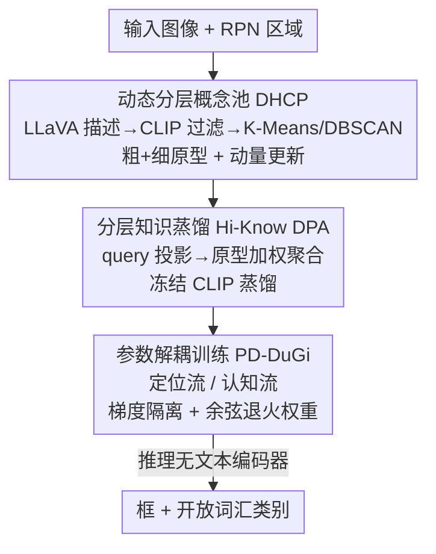

# DeCo-DETR: Decoupled Cognition DETR for efficient Open-Vocabulary Object Detection

**会议**: ICLR2026  
**OpenReview**: [https://openreview.net/forum?id=3UDlRUf1es](https://openreview.net/forum?id=3UDlRUf1es)  
**代码**: 待确认  
**领域**: 目标检测 / 开放词汇检测  
**关键词**: 开放词汇检测, DETR, 知识蒸馏, 语义原型, 梯度解耦

## 一句话总结
DeCo-DETR 把开放词汇检测里"在线调用文本编码器"和"定位与对齐互相打架"这两件事解耦——用 LVLM 离线蒸馏出一个可复用的分层语义原型池替代推理时的文本编码器，再用双流梯度隔离把定位和语义对齐分开训练，在 OV-COCO novel 类上提升 3.1~5.8 个点的同时把单图推理压到 135ms。

## 研究背景与动机
**领域现状**：开放词汇目标检测（OVOD）要让检测器在推理时识别训练时没标注过的类别。主流路线是借 CLIP 这类视觉-语言模型（VLM）的跨模态对齐能力：要么直接用 CLIP/LLM 提供文本线索，要么走知识蒸馏（KD），把大模型的语义知识蒸馏进轻量检测器（如 ViLD 把类别名的文本嵌入蒸馏给检测器，DK-DETR、DetCLIP 在此基础上强化视觉-语义对齐）。

**现有痛点**：这两条路都有硬伤。第一，**推理太贵**——靠 prompt engineering 的方法要让 LLM 和检测器在推理时同时跑；即使是蒸馏类方法，仍然紧耦合一个大文本编码器在线生成 novel 类的文本线索，延迟下不来（Grounding DINO 这类靠 BERT-Base 文本编码器的方法单图要 ~280ms）。第二，**多模态融合天然有取舍**——把特征往 seen 类上猛调会让模型偏向闭集目标，从而削弱识别 unseen 类所需的跨模态对齐能力。

**核心矛盾**：第二个痛点的根子是一个**优化冲突**：定位（localization）要的是精确的空间判别力，语义对齐（semantic alignment）要的是跨模态泛化力，两者在共享参数空间里联合优化时梯度互相干扰，结果就是顾此失彼——闭集精度和开放世界泛化只能二选一。

**本文目标**：拆成两个子问题——(1) 去掉推理时对文本编码器的依赖、把语义知识变成可复用的离线资产；(2) 在训练时把"定位"和"语义对齐"这两个互相打架的目标分开，互不污染梯度。

**切入角度**：作者的观察是，语义认知（cognition）这件事本质上可以**离线**完成、并固化成一组原型，推理时只需查表式地用这些原型增强检测器查询，根本不必每次都现场跑文本编码器；而训练时的目标冲突也可以通过**梯度隔离**在结构上消除，而不是靠调权重硬平衡。

**核心 idea**：一个统一的"解耦"范式——用 LVLM 离线构建分层语义原型池替代在线文本编码（解决效率），再用双流梯度隔离把定位流和认知流分开训练（解决冲突），让一个 vision-centric 的 DETR 在推理时完全不带文本编码器。

## 方法详解

### 整体框架
DeCo-DETR 接收一张图像，输出 seen + unseen 类别的检测框，整条管线由三个组件串成。**第一步**离线构建一个**动态分层概念池（DHCP）**：对训练集每张图取区域 proposal，用 LLaVA 给每个区域生成自由文本描述，再用 CLIP 把区域和文本都投到共享空间、过滤掉低置信对，最后用 K-Means + DBSCAN 聚成"粗+细"两层语义原型，并在训练中用动量更新持续刷新。**第二步**用**分层知识蒸馏（Hi-Know DPA）**把检测器的 object query 投影进这个原型空间、按相似度聚合多粒度语义，得到语义增强后的 query，并用冻结的 CLIP 当 teacher 做蒸馏监督。**第三步**用**参数解耦训练（PD-DuGi）**把"定位"和"语义对齐"拆成两条平行优化流，靠梯度隔离让两者各学各的。推理时不再需要文本编码器——原型池提供语义先验，双流解码器一次前向同时吐出框和类别语义。

### 关键设计

**1. 动态分层概念池 DHCP：把"在线文本编码"换成可复用的离线原型记忆**

这一步直接针对"推理太贵"的痛点：与其每次推理都现场调用大文本编码器，不如把语义知识离线蒸馏成一组固定的原型，推理时查表即可。具体分两阶段。**离线初始化**：对训练集每张图的区域 $R_i$，先用 LLaVA 生成文本描述 $t_i = \text{LLaVA}(R_i)$，再用 CLIP 把区域和文本投到共享空间 $v_i = f^{img}_{CLIP}(R_i)$、$u_i = f^{txt}_{CLIP}(t_i)$，只保留跨模态一致的高置信对 $T = \{u_i \mid \cos(v_i,u_i) > \delta\}$。接着做**两层聚类**得到分层原型：先 K-Means 聚出 $M_1$ 个粗粒度簇 $C_{coarse}=\text{K-Means}(T, k{=}M_1)$，再对每个粗簇内做 DBSCAN 密度聚类得到细粒度子簇 $C_{fine}=\text{DBSCAN}(c)$，两层质心拼成原型矩阵 $A \in \mathbb{R}^{d \times M}$（$M = M_1 + M_2$）。粗原型管类间大区分、细原型管类内细微变化。**在线更新**：训练中对一批对齐嵌入 $\{e_i\}$，先算它们对原型的软分配 $D_{i,j} = \frac{\exp(\tau^{-1}\cos(e_i,A_j))}{\sum_k \exp(\tau^{-1}\cos(e_i,A_k))}$，再用动量规则刷原型

$$A_j \leftarrow \gamma A_j + (1-\gamma)\,\text{LayerNorm}\Big(\sum_i D_{i,j} e_i\Big),$$

$\gamma$ 控制更新速率，LayerNorm 保数值稳定。这样原型池能在不忘旧结构的前提下吸收新语义模式，成为一份稳定又自适应的语义记忆——而推理时它就是一张固定查找表，文本编码器彻底从推理路径里消失。

**2. 分层知识蒸馏 Hi-Know DPA：让检测器 query 从原型池里"取"多粒度语义**

DHCP 给出了原型空间，但检测器的 object query 还在自己的视觉特征空间里，两者不可直接比。Hi-Know DPA 架一座桥：用一个可学投影 $h_\theta: \mathbb{R}^C \to \mathbb{R}^d$ 把每个 query 投到原型空间 $\hat q_n = h_\theta(q_n)$，再算它和所有原型的相似度分配权重 $w_{n,j} = \frac{\exp(\alpha^{-1}\cos(\hat q_n, A_j))}{\sum_k \exp(\alpha^{-1}\cos(\hat q_n, A_k))}$，然后按权重聚合原型语义得到增强 query

$$r_n = \sum_{j=1}^{M} w_{n,j} A_j + \text{MLP}(\hat q_n),$$

其中 MLP 残差项保住原始视觉信息，使每个 query 既吸收了粗+细两级语义、又不丢自己的空间敏感性。为进一步校准对齐，引入冻结 CLIP 当 teacher：用 CLIP 视觉嵌入 $z^{CLIP}_n$ 与文本原型矩阵 $P$ 算出 teacher 分布 $\tilde w_n = \text{Softmax}(\tau^{-1}\cos(z^{CLIP}_n, P))$，训练目标为

$$\mathcal{L}_{DPA} = \mathcal{L}_{det} + \lambda_{KL}\sum_n \text{KL}(\tilde w_n \| w_n) + \lambda_{align}\mathcal{L}_{align},$$

即在标准 DETR 检测损失外，用 KL 散度把 student 的原型分布 $w_n$ 往 teacher 分布 $\tilde w_n$ 上拉，再加一个辅助对齐损失稳住特征匹配。关键在于"分层"——query 不是对单一文本嵌入对齐，而是对一整套多粒度原型做加权聚合，这让 novel 类的细粒度语义也能被 grounding 到。

**3. 参数解耦训练 PD-DuGi：用梯度隔离把"定位"和"语义对齐"彻底分流**

这是针对第二个核心矛盾的结构性解法。作者认为定位和语义对齐的目标本质冲突，在共享参数空间里联合优化必然互相干扰，于是用**双流 + 梯度隔离**把它们拆开。先在增强 query $r_n$ 上接一个参数化语义预测器 $g_\phi: \mathbb{R}^d \to \mathbb{R}^{|C_{base}\cup C_{novel}|}$（用多层 cross-attention 实现，捕捉原型与类别嵌入的关联），输出类别分布 $t_n = \text{Softmax}(g_\phi(r_n))$。**语义对齐流**对 query 做 stop-gradient $q'_n = \text{StopGradient}(q_n)$，再投影、聚合、过 $g_\phi$，用冻结 CLIP teacher 给出的目标分布 $T_{teacher}$ 算交叉熵 $\mathcal{L}_{align} = \text{CrossEntropy}(t_n, T_{teacher})$——这条流只更新语义模块（$g_\phi$ 和 $h_\theta$）。**梯度隔离**是核心动作：$\mathcal{L}_{det}$ 的梯度只回流到检测 backbone 和 decoder，$\mathcal{L}_{align}$ 的梯度只回流到语义投影和预测器，两者井水不犯河水，从而把视觉流形 $\mathcal{V}$ 和语义流形 $\mathcal{S}$ 解耦、又共同映到输出空间 $\mathcal{Y}$。整体目标按时间加权

$$\mathcal{L}_{PD} = \mathcal{L}_{det} + \lambda_{align}(t)\,\mathcal{L}_{align},$$

其中 $\lambda_{align}(t)$ 走余弦退火：早期先把检测学稳，后期逐步加重语义对齐——这套课程式调度让两个目标平滑过渡而非一开始就硬抢梯度。推理时单次前向、无文本编码器，原型池 + 语义预测器联合完成开放词汇识别。

### 损失函数 / 训练策略
总损失即 $\mathcal{L}_{PD} = \mathcal{L}_{det} + \lambda_{align}(t)\mathcal{L}_{align}$，其中 $\mathcal{L}_{det}$ 为标准 DETR 检测损失，$\mathcal{L}_{align}$ 为对齐交叉熵，$\lambda_{align}(t)$ 余弦退火。原型动量 $\gamma=0.99$、温度 $\tau=0.07$；原型池 $M_1=1203$ 粗 + $M_2=4800$ 细（共 6003）；decoder 6 层、8 头；总 batch 64（8×A100），推理在单张 RTX 4090 上测。

## 实验关键数据

### 主实验
OV-COCO 报 $AP^{novel}_{50}/AP^{base}_{50}/AP_{50}$，OV-LVIS 报稀有/常见/频繁类 AP。DeCo-DETR 在四种 OVOD 设定（V/G/C/WS-OVD）的 novel AP 上普遍领先。

| 数据集 / 设定 | 指标 | DeCo-DETR | 之前最强 | 提升 |
|--------|------|------|----------|------|
| OV-COCO (V-OVD) | $AP^{novel}_{50}$ | 41.3 | 38.2 (CAKE) | +3.1 |
| OV-COCO (G-OVD) | $AP^{novel}_{50}$ | 47.1 | 41.3 (RALF) | +5.8 |
| OV-COCO (WS-OVD) | $AP^{novel}_{50}$ | 45.5 | 41.8 (CAKE) | +3.7 |
| OV-LVIS | $AP_r$ / $AP$ | 29.4 / 35.2 | 29.3 / 35.0 (Mamba) | +0.1 / +0.2 |

效率上，ResNet-50 下推理仅 135ms、GFLOPs 仅增 6.8%、参数 44M（vs 41M，+7.3%）；相比靠文本编码器的 Grounding DINO（~280ms）约 2× 加速，而 novel AP 仍接近（41.3 vs 42.1）。

| 方法 | 推理延迟 (R50) | 备注 |
|------|----------------|------|
| Grounding DINO | ~280ms | 带 BERT-Base 文本编码器 |
| DetPro | 140ms | — |
| DeCo-DETR | 135ms (7.4 FPS) | 推理无文本编码器 |

### 消融实验
逐组件累加（OV-COCO，列为 novel / base / overall $AP_{50}$）：

| 配置 | $AP^{novel}_{50}$ | $AP^{base}_{50}$ | $AP_{50}$ | 说明 |
|------|------|------|------|------|
| 1. Baseline | 30.4 | 52.6 | 46.8 | DETR 基线 |
| 2. + 分层 DHCP | 36.6 | 54.0 | 49.4 | 加分层原型池 |
| 3. + PD-DuGi 梯度隔离 | 37.5 | 55.1 | 50.5 | 双流梯度隔离 |
| 4. + 余弦 $\lambda(t)$（完整） | 41.3 | 55.5 | 51.0 | 退火权重调度 |

### 关键发现
- **细粒度原型是 DHCP 的命门**：去掉细粒度单元（$M_2=0$）novel AP 暴跌 10.5 点；而把 $M_2$ 翻倍到 9600 只换来 +0.2%、却涨显存和延迟——$M_2=4800$ 是甜点。分层（粗+细）相比单层原型直接 +2.5 点。
- **梯度隔离同时提升 novel 和 base**：PD-DuGi 把 $AP^{novel}_{50}$ 从 36.6→37.5（+0.9）、$AP^{base}_{50}$ 从 54.0→55.1（+1.1）——两端同涨，说明共享参数空间确实存在"语义梯度污染定位特征"的干扰，隔离后两者各得其所。
- **VLM 规模有阈值**：用 LLaVA-1.5 7B 时 novel AP 只有 30.1%；升到 13B 及以上（13B / LLaVA-NEXT 13B / Qwen2.5-VL 32B）稳定在 38.2~38.9%，再加大收益微乎其微——部署时选中等规模 VLM 即可。
- **query 数量近乎免费涨点**：N 从 300→2000，novel AP +4.8，得益于 Transformer decoder 的并行性，延迟只增 ~10ms；即便 N=300（36.5%）也远超 ViLD（29.4%）。

## 亮点与洞察
- **把"认知"离线化、固化成查找表**：最妙的设计是认识到语义对齐这件事不必在线做——离线把 LVLM 知识蒸馏成原型池后，推理路径里文本编码器直接消失，效率和泛化得以解耦。这种"重活离线、推理查表"的思路可迁移到任何依赖大模型在线推理的轻量部署场景。
- **梯度隔离当作结构性解法而非调参**：面对定位与对齐的目标冲突，作者不是去调 loss 权重硬平衡，而是用 stop-gradient + 分流让两条流物理隔离，消融里 novel/base 双涨证明了这比共享空间更优。
- **粗+细两级聚类（K-Means + DBSCAN）**：用全局 K-Means 抓类间结构、再用局部 DBSCAN 抓类内密度变化，这套分层原型构造对任何需要"多粒度语义记忆"的检索/对齐任务都有借鉴价值。

## 局限与展望
- **强依赖 LVLM 与 CLIP 的离线质量**：原型池由 LLaVA 描述 + CLIP 过滤构建，描述噪声或 CLIP 对齐偏差会直接固化进原型；且需要 ≥13B 的 VLM 才能稳住 novel 性能，离线构建成本不低。
- **原型池规模偏大**：6003 个原型（尤其 4800 细粒度）带来显存和查表开销，$M_2$ 翻倍即收益递减，说明原型空间的表达-成本权衡仍有优化空间。
- **离线原型对分布漂移的适应性有限**：虽有动量在线更新，但原型骨架在离线阶段定型，面对训练集未覆盖的全新语义分布时，自适应能力可能受限。
- **Table 4 表头疑似笔误**：原文两列均标 $AP^{novel}_{50}$，按上下文第二列应为 $AP^{base}_{50}$，此处按语义校正（⚠️ 以原文为准）。

## 相关工作与启发
- **vs ViLD / DK-DETR（蒸馏路线）**：它们把 VLM 的文本嵌入蒸馏进检测器，但推理仍紧耦合文本编码器；DeCo-DETR 把语义固化成离线原型池，推理彻底去掉文本编码器，延迟和 novel AP 同时占优。
- **vs Grounding DINO（融合路线）**：靠 BERT-Base 在线文本编码器做跨模态融合，单图 ~280ms；DeCo-DETR vision-centric、推理 135ms，约 2× 加速而精度接近（41.3 vs 42.1 novel AP）。
- **vs CAKE**：CAKE 也想减轻文本依赖，但在细粒度检测上吃力；DeCo-DETR 用粗+细分层原型补齐细粒度语义，OV-COCO 多个设定 novel AP 反超 CAKE 3~6 点。

## 评分
- 新颖性: ⭐⭐⭐⭐ "解耦认知"双管齐下（离线原型替代在线文本编码 + 双流梯度隔离）是清晰且有说服力的组合创新。
- 实验充分度: ⭐⭐⭐⭐ 覆盖 OV-COCO 四设定 + OV-LVIS + 三种 backbone + 效率/VLM 规模/query/原型粒度多维消融。
- 写作质量: ⭐⭐⭐⭐ 动机—方法—实验逻辑顺，公式完整；但 Table 4 表头笔误、部分附录指标未在正文展开。
- 价值: ⭐⭐⭐⭐ 给出"推理零文本编码器"的高效 OVOD 实用方向，对 DETR 系开放词汇检测的工程落地有参考意义。

<!-- RELATED:START -->

## 相关论文

- [\[ECCV 2024\] LaMI-DETR: Open-Vocabulary Detection with Language Model Instruction](../../ECCV2024/object_detection/lami-detr_open-vocabulary_detection_with_language_model_instruction.md)
- [\[ICLR 2026\] DETR-ViP: Detection Transformer with Robust Discriminative Visual Prompts](detr-vip_detection_transformer_with_robust_discriminative_visual_prompts.md)
- [\[CVPR 2026\] Parameter-Efficient Semantic Augmentation for Enhancing Open-Vocabulary Object Detection](../../CVPR2026/object_detection/parameter-efficient_semantic_augmentation_for_enhancing_open-vocabulary_object_d.md)
- [\[ICLR 2026\] RF-DETR: Neural Architecture Search for Real-Time Detection Transformers](rf-detr_neural_architecture_search_for_real-time_detection_transformers.md)
- [\[AAAI 2026\] VK-Det: Visual Knowledge Guided Prototype Learning for Open-Vocabulary Aerial Object Detection](../../AAAI2026/object_detection/vk-det_visual_knowledge_guided_prototype_learning_for_open-vocabulary_aerial_obj.md)

<!-- RELATED:END -->
