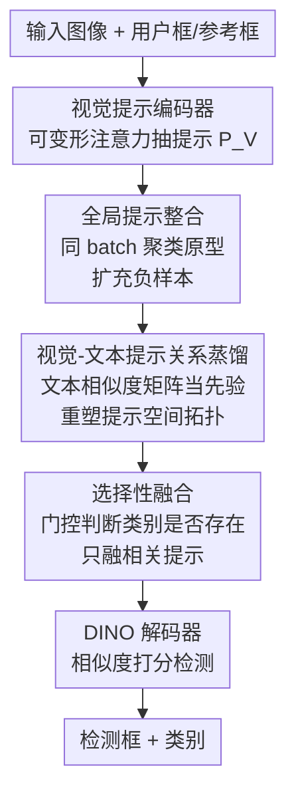

# DETR-ViP: Detection Transformer with Robust Discriminative Visual Prompts

**会议**: ICLR2026  
**OpenReview**: [https://openreview.net/forum?id=2KKDWERRm3](https://openreview.net/forum?id=2KKDWERRm3)  
**代码**: https://github.com/MIV-XJTU/DETR-ViP  
**领域**: 目标检测 / 开放词表检测  
**关键词**: 视觉提示检测, 开放词表检测, Grounding DINO, 提示判别性, 关系蒸馏

## 一句话总结
DETR-ViP 把"视觉提示为什么打不过文本提示"归因于视觉提示缺乏全局判别性，通过全局提示整合扩充负样本、用文本提示关系蒸馏重塑视觉提示空间拓扑、再加选择性融合稳住推理，在 COCO / LVIS / ODinW / Roboflow100 上把视觉提示检测显著推到新 SOTA（COCO 比 T-Rex2-T 高 +4.4 AP）。

## 研究背景与动机
**领域现状**：开放集（开放词表）检测靠"提示"打破闭集类别的限制。主流是文本提示，靠 CLIP/BERT 把视觉特征对齐到文本嵌入空间（GLIP、Grounding DINO、RegionCLIP 等）。另一条路是视觉提示——用户直接框一个/几个参考目标，模型据此找同类物体，交互性更强，在罕见类别上往往比文本提示更准，因为视觉提示天生与图像特征同源、不需要跨模态对齐。

**现有痛点**：视觉提示虽然在罕见类别上有优势，但**整体性能仍落后于文本提示**，长期被当作"训练文本提示检测器的副产品"，没人系统研究它为什么差。作者在 Grounding DINO 上搭了一个支持视觉提示的 baseline（VIS-GDINO），实测 COCO 只有 21.1 mAP、LVIS 只有 17.2 mAP，明显低于文本提示版本。

**核心矛盾**：作者对 VIS-GDINO 的视觉提示做 t-SNE 和成对余弦相似度分析，发现根因是**视觉提示缺乏全局判别性**——具体两点：(1) 同一类别不同实例的视觉提示方差很大（同类不紧凑）；(2) 不同类别的视觉提示在全局嵌入空间里高度纠缠、边界模糊（异类不可分）。文本提示靠语言模型预训练天生就有"同义聚类、异义分离"的好结构，视觉提示因为实例外观随个体/环境剧烈变化，分布天然杂乱。

**本文目标**：在不依赖跨模态对齐这条"间接路线"的前提下，**同时压低视觉提示的类内方差、拉大类间距离**，让视觉提示自己具备文本那样的语义判别结构。

**切入角度**：作者提出一个可量化的诊断指标 IISR（Intra-Inter Similarity Ratio，类内/类间相似度之比），IISR 越大说明视觉提示语义一致性越强；实验显示 IISR 和 mAP 高度正相关——于是优化目标就清晰了：把 IISR 提上去。

**核心 idea**：用"全局提示整合 + 文本提示关系蒸馏"直接重塑视觉提示嵌入空间的拓扑结构，再用"选择性融合"在推理时按需融合提示，把视觉提示检测从副产品做成一等公民。

## 方法详解

### 整体框架
DETR-ViP 建立在 Grounding DINO 之上。先把 Grounding DINO 改造成 **VIS-GDINO baseline**：在 backbone 和 encoder 之间插入一个**视觉提示编码器**（沿用 T-Rex 的做法，把用户框的归一化框做正弦编码 → 内容嵌入拼接 → 多尺度可变形交叉注意力，从图像特征里抽出视觉提示 $P_V$），并去掉 encoder/decoder 里原本的文本-图像融合模块。检测时不靠线性分类头，而是用提案特征 $O$ 和提示嵌入 $P$ 的相似度打分：$\text{Score}=\sigma(OP^\top+b)$，提示在这里就充当"分类器权重"。

在 VIS-GDINO 之上，DETR-ViP 叠加三件事来治"判别性不足"：训练时用**全局提示整合**把同 batch 所有图像的视觉提示聚成类原型、当成共享分类器扩充负样本；用**视觉-文本提示关系蒸馏**把文本提示之间的相似度矩阵作为先验，直接优化视觉提示空间的拓扑；推理/训练时用**选择性融合**先判断某类是否真的出现在图里、只融合相关提示、压住无关类别。整条流水线如下：

### 关键设计

**1. 全局提示整合：用跨图聚合的类原型把"小 N 路分类"撑成"大 N 路分类"**

视觉提示检测的分类损失本质是 Focal Loss 形式的对比学习：正提示 $p^+$ 把提案特征往自己拉、负提示 $p^-$ 往外推。问题是 T-Rex2 的"当前图提示、当前图检测"策略——提示只从当前训练图的 GT 框里采——使得每个 iteration 只见到极少几个类别，分类退化成一个很小的 N 路任务，类别多样性不足直接限死了模型的全局判别力。文本提示可以简单地 pad 一堆类别短语补到固定长度，但视觉提示依赖来源图像，额外采一批图来造负样本会大幅拖慢训练。

作者的做法是：把同一个 batch 内所有图像的视觉提示**按类别分组、各类取均值得到类原型**，再把所有类原型拼起来，作为当前 batch 所有图像**共享的分类器权重**。这样一来，给定类别的视觉提示不只来自当前样本、也来自 batch 内其他样本的正例，既显著扩充了负样本数量、稳住了训练，又隐式模拟了"跨图提示"（用别的图的提示来检测当前图）。消融里这一步把 COCO 从 29.2 → 35.6（+6.4）、LVIS 从 23.4 → 33.0（+9.6），其中罕见类 APr +13.4、常见类 APc +13.9，因为罕见/常见类现在能参与整体更新而非只贡献当前样本。

**2. 视觉-文本提示关系蒸馏：把文本类间相似度矩阵当先验，直接捏视觉提示空间的拓扑**

要让视觉提示空间"同类紧凑、异类可分"，最直接的想法是上 Supervised Contrastive Loss（式 6）。但硬对比损失把所有负样本一视同仁，捕捉不到概念之间的相关性；在 grounding 数据上还会被假负样本坑——比如 woman 和 person 训练时被当成不同类别，但把它俩的视觉提示当互为负例显然不合理。另一条 T-Rex2 走的路是把视觉提示对齐到对应文本提示（间接继承文本空间的好结构），但研究表明图文无法完美对齐，这条间接路线天花板有限。

作者改成**关系蒸馏**：不约束视觉-文本的逐对对齐，而是把文本提示之间的相似度矩阵 $C C^\top$ 作为软标签先验，去监督视觉提示之间的相似度矩阵 $P P^\top$：

$$\mathcal{L}_{\text{distill}} = \text{CrossEntropy}\big(\text{Softmax}(CC^\top/\tau_t),\ \text{Softmax}(PP^\top/\tau_v)\big)$$

其中 $c,p$ 是 L2 归一化后的文本/视觉提示向量，$\tau_t,\tau_v$ 是温度。它利用 text-text 的关系结构当先验、直接优化视觉提示空间的拓扑，绕开跨模态对齐的难题。和对齐损失是互补的：对齐损失给视觉提示提供稳定的文本语义锚点，关系蒸馏专注于精修视觉提示内部的结构关系。效果上 COCO IISR 暴涨 +0.4220、LVIS +0.1698，AP 再 +5.9（→41.5）/ +6.5（→39.5）；t-SNE 里语义相关概念（truck↔car、bench↔chair、backpack↔handbag）被映得更近，说明学到的是有语义连贯性的结构而非死记硬背。

**3. 选择性融合：先判断类别在不在图里，只融相关提示，治"提示数量敏感"的脆弱性**

早期把提示嵌入和图像特征融合（让提示捕捉图像特定信息、让高响应区域更语义显著）是开放词表检测的常用手段。但实际用提示非常灵活：交互检测里用户可能只给 1~2 个感兴趣类别，批量标注里可能预先给 80 个 COCO 类别而当前图只有少数有实例。作者发现直接套 Grounding DINO 的全量融合**对提示数量极度敏感**——给全 80 类时检测正常，只给 'person' 一个提示时性能崩溃，因为全局提示整合让模型过拟合到了"多提示"场景，出现了训练-测试 gap。

选择性融合的做法：在融合层注意力权重里引入门控向量 $G$，目标是类别 $c$ 出现在图里时 $g_c\to 0$、不出现时 $g_c\to-\infty$。具体用一个辅助分类分支算图像特征 $X_I$ 与提示 $P_V$ 的相似度矩阵 $S$，每个提示取最大相似度当置信度，再过阈值激活 $\delta(\cdot)$（超过阈值 $\theta$ 输出 0、否则 $-\infty$）：

$$X_I^o = \text{Softmax}\Big(\frac{QK^\top + G}{\sqrt{d}}\Big)V,\quad G=\delta(\text{MAX}(S,0),\theta)$$

训练和评测都用它，模型会过滤掉对当前图响应不足的提示，融合更稳更鲁棒。消融显示：直接上 encoder 全量融合几乎没收益甚至掉点，换成 encoder 选择性融合 COCO +0.7 / LVIS +1.1；decoder 全量融合因为直接改 object query、放大无关类别的负作用反而伤 AP（LVIS 一度从 40.6 崩到 25.5），改成 decoder 选择性融合后又拉回并再 +1.0 / +0.5。

### 损失函数 / 训练策略
基础损失 $\mathcal{L}_{\text{base}}$ 沿用 DINO 的分类损失 $\mathcal{L}_{cls}$、L1、GIoU、去噪损失 $\mathcal{L}_{dn}$，以及 T-Rex2 的图文对比对齐损失 $\mathcal{L}_{\text{Align}}$；总损失 $\mathcal{L}_{\text{total}}=\mathcal{L}_{\text{base}}+\lambda_{\text{distill}}\mathcal{L}_{\text{distill}}$。权重 $\lambda_{cls},\lambda_1,\lambda_{GIoU},\lambda_{\text{Align}},\lambda_{\text{distill}}=1.0,5.0,2.0,1.0,10.0$，温度 $\tau_t=0.07,\tau_v=0.1$。backbone 用 Swin-T/L，6 层视觉 encoder + 3 层视觉提示编码器（可变形交叉注意力）+ 6 层 box decoder，AdamW，backbone 学习率 $1\times10^{-5}$、其余 $1\times10^{-4}$。训练数据用 Objects365(V1) + GoldG（GQA + Flickr30k），并排除 COCO 图像，保证零样本评测公平。

## 实验关键数据

### 主实验
零样本评测覆盖 COCO、LVIS、ODinW(35)、Roboflow100，全程不在这些 benchmark 上训练。Visual-G（通用协议，每类采 N 图、用全部 GT 框均值当提示）下：

| 数据集 | 指标 | DETR-ViP-T | T-Rex2-T | 提升 |
|--------|------|-----------|----------|------|
| COCO | AP | 43.2 | 38.8 | +4.4 |
| LVIS | AP | 41.1 | 37.4 | +3.7 |
| LVIS | APc | 43.3 | 33.9 | +9.4 |
| LVIS | APr | 35.1 | 29.9 | +5.2 |
| ODinW | APavg | 31.2 | 23.6 | +7.6 |
| Roboflow100 | APavg | 23.6 | 17.4 | +6.2 |

DETR-ViP-T 用更少数据就在 LVIS 上比 YOLOE-v8-L 高 +6.9 AP（APr/APc/APf 各 +1.9/+8.7/+6.3），在 ODinW/Roboflow100（域偏移更大）上甚至超过 T-Rex2-**L** 3.4 / 5.1 AP。DETR-ViP-L 进一步比 T-Rex2-L 在 COCO/LVIS 上高 +3.7 / +1.5。Visual-I（交互协议，每类只随机取一个 GT 框抽提示，排除图里不存在的类别）下提升更大：DETR-ViP-T 在 COCO 65.4 vs T-Rex2-T 56.6、Roboflow100 40.1 vs 30.6，全面领先。

### 消融实验
从 VIS-GDINO 逐步叠加到 DETR-ViP（COCO-val / LVIS-minival，AP 与 IISR）：

| 配置 | COCO AP | COCO IISR | LVIS AP | 说明 |
|------|---------|-----------|---------|------|
| VIS-GDINO-T | 21.1 | 0.8797 | 17.2 | baseline，提示散乱 |
| +图文对齐 | 29.2 | 0.9743 | 23.4 | 蒸入文本语义先验 (+8.1/+6.2) |
| +全局提示整合 | 35.6 | 1.0734 | 33.0 | 扩充负样本 (+6.4/+9.6) |
| +关系蒸馏 | 41.5 | 1.4954 | 39.5 | 重塑空间拓扑 (+5.9/+6.5) |
| +encoder 全量融合 | 41.3 | 1.5001 | 39.1 | 几乎无收益甚至掉点 |
| +encoder 选择性融合 | 42.2 | 1.4963 | 40.6 | +0.7/+1.1 |
| +decoder 全量融合 | 40.8 | 1.4976 | 25.5 | 直接改 query，LVIS 崩 |
| +decoder 选择性融合 | 43.2 | 1.5010 | 41.1 | 完整模型，再 +1.0/+0.5 |

### 关键发现
- **IISR 和 mAP 强正相关**：每一步改进 IISR 涨、AP 也涨，验证了"判别性不足"这个根因诊断和"提 IISR"这个优化目标的正确性。
- **关系蒸馏对 IISR 贡献最猛**：COCO IISR 一步从 1.07 跳到 1.50（+0.42），说明文本关系先验是把视觉提示空间"捏出语义结构"的关键。
- **全量融合是陷阱**：encoder 全量融合无收益，decoder 全量融合让 LVIS AP 从 40.6 崩到 25.5；只有"先判断类别是否存在"的选择性融合才稳，凸显提示数量鲁棒性是视觉提示检测的真实痛点。

## 亮点与洞察
- **先诊断再开方**：不是堆模块，而是先用 t-SNE + IISR 把"视觉提示为什么差"量化成"类内方差大 + 类间纠缠"，再针对性设计——IISR 这个简单的类内/类间相似度之比可复用到任何"提示即分类器"的检测/检索任务做诊断。
- **关系蒸馏绕开图文对齐天花板**：与其强行把视觉提示对齐到文本（受图文不可完美对齐限制），不如把 text-text 相似度矩阵当软标签去监督 visual-visual 相似度矩阵，直接优化拓扑、还自动避开假负样本——这个"蒸关系而非蒸表征"的思路很巧，可迁移到任何想借强模态结构去规整弱模态空间的场景。
- **全局提示整合用类原型当共享分类器**：把"小 N 路退化分类"问题用 batch 内跨图聚合优雅解决，几乎零额外开销就显著扩充了负样本，对罕见类增益尤其大。

## 局限与展望
- **门控阈值 $\theta$ 是硬阈值**：选择性融合靠 $\delta(\cdot)$ 在 $\theta$ 处做 0/$-\infty$ 的硬切，论文未充分讨论 $\theta$ 的敏感性，跨域场景下阈值是否需要自适应存疑。
- **依赖文本提示作为先验**：关系蒸馏要求每个视觉类别有对应文本，对完全没有语言描述的纯视觉新概念，先验从何而来需要进一步设计。
- **类原型靠 batch 内聚合**：全局提示整合的有效性受 batch 内类别覆盖影响，batch 小或类别极度长尾时类原型可能不稳；更大规模或记忆库式的原型维护值得探索。

## 相关工作与启发
- **vs T-Rex2**：T-Rex2 用"当前图提示、当前图检测" + 图文对齐，把视觉提示间接对齐到文本；DETR-ViP 指出这导致小 N 路退化和对齐天花板，改用跨图全局整合 + 关系蒸馏直接重塑视觉提示空间，同 backbone 下全面反超且用更少数据。
- **vs YOLOE**：YOLOE 用 RepRTA/SAVPE 统一处理文本/视觉提示；DETR-ViP 在相同训练数据下 LVIS 高 +6.9 AP，差距集中在常见/罕见类，源于更高效的视觉提示分布优化。
- **vs Grounding DINO**：DETR-ViP 以 GD 为骨架，但去掉其原生融合、插入视觉提示编码器，并把全量融合换成选择性融合——直接复用 GD 的全量融合反而掉点，说明文本提示的融合经验不能照搬到视觉提示。

## 评分
- 新颖性: ⭐⭐⭐⭐⭐ 把"视觉提示为何差"量化诊断 + 关系蒸馏 + 选择性融合，思路清晰且各有创新
- 实验充分度: ⭐⭐⭐⭐⭐ 四个 benchmark、两套协议、逐步消融 + IISR/t-SNE 可视化交叉印证
- 写作质量: ⭐⭐⭐⭐⭐ 动机—诊断—方法—验证逻辑闭环，IISR 把直觉落到可量化指标
- 价值: ⭐⭐⭐⭐ 显著推进视觉提示检测 SOTA，关系蒸馏思路有较强可迁移性

<!-- RELATED:START -->

## 相关论文

- [\[ICLR 2026\] DeCo-DETR: Decoupled Cognition DETR for efficient Open-Vocabulary Object Detection](deco-detr_decoupled_cognition_detr_for_efficient_open-vocabulary_object_detectio.md)
- [\[CVPR 2026\] EW-DETR: Evolving World Object Detection via Incremental Low-Rank DEtection TRansformer](../../CVPR2026/object_detection/ew-detr_evolving_world_object_detection_via_incremental_low-rank_detection_trans.md)
- [\[ECCV 2024\] BAM-DETR: Boundary-Aligned Moment Detection Transformer for Temporal Sentence Grounding in Videos](../../ECCV2024/object_detection/bam-detr_boundary-aligned_moment_detection_transformer_for_temporal_sentence_gro.md)
- [\[CVPR 2026\] From Detection to Association: Learning Discriminative Object Embeddings for Multi-Object Tracking](../../CVPR2026/object_detection/from_detection_to_association_learning_discriminative_object_embeddings_for_mult.md)
- [\[CVPR 2026\] ViTPrompt: Training-Free Prompt Refinement with Visual Tokens for Open-Vocabulary Detection](../../CVPR2026/object_detection/vitprompt_training-free_prompt_refinement_with_visual_tokens_for_open-vocabulary.md)

<!-- RELATED:END -->
