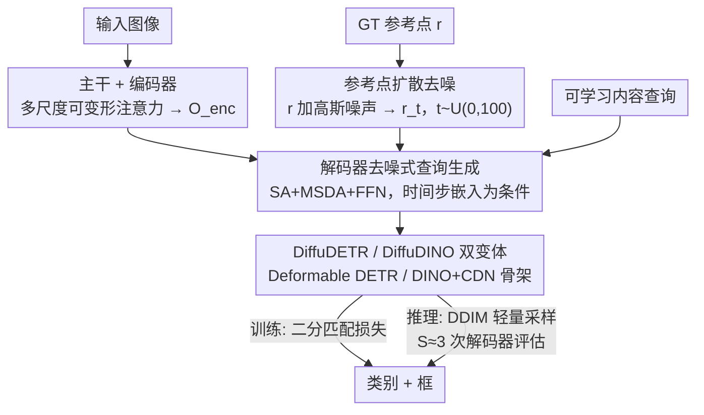

# DiffuDETR: Rethinking Detection Transformers with Denoising Diffusion Process

**会议**: ICLR2026  
**OpenReview**: [https://openreview.net/forum?id=nkp4LdWDOr](https://openreview.net/forum?id=nkp4LdWDOr)  
**代码**: https://mbadran2000.github.io/DiffuDETR  
**领域**: 目标检测  
**关键词**: 检测 Transformer、去噪扩散、查询初始化、参考点、DETR

## 一句话总结
DiffuDETR 把目标检测重新表述为「以图像和一组带噪参考点为条件的物体查询生成任务」，用去噪扩散训练让 DETR 解码器学会从高斯噪声里把查询的参考点逐步去噪成精确目标位置，在 COCO / LVIS / V3Det 上一致超过 Deformable DETR、DINO 等基线，且推理只需多跑几次解码器、几乎不增加计算量。

## 研究背景与动机
**领域现状**：DETR 系列把目标检测变成「集合预测」问题，用一组可学习的物体查询（object queries）配二分图匹配（匈牙利算法）实现端到端检测，省掉了锚框、NMS 等手工组件。围绕 DETR 的改进主要走两条路：一是改进查询初始化（DAB-DETR 把查询写成可更新的锚框坐标、Deformable DETR 用 two-stage 从编码器 top-K 提议初始化查询），二是设计更好的辅助训练目标（DN-DETR 注入带噪 GT 框做去噪辅助任务、DINO 加对比去噪 CDN 和混合查询选择）。

**现有痛点**：原始 DETR 的查询被初始化成零向量，没有任何空间先验，模型得从零学「查询 → 物体」的对齐，导致收敛极慢、训练不稳。后续工作虽然各自缓解，但查询初始化本质上仍是「人为设计一个先验」——要么手工设锚框，要么从编码器提议里挑，先验从哪来、好不好，都是另外的工程问题。

**核心矛盾**：检测是一个**无序集合**预测问题，要生成一组离散的物体候选再去和 GT 对应；而扩散模型擅长的是图像那种**逐像素、有空间结构**的去噪重建。正因为这种错配，扩散模型在分割上很成功（分割天然是 image-to-image），在检测上却几乎没人做通——DiffusionDet 是少数例外，但它建在 Sparse R-CNN 上、去噪的是提议**框**，而不是 DETR 的查询。

**本文目标**：能不能把「查询初始化」这件事，本身交给一个生成式的去噪过程来做，让查询的参考点直接从噪声里采样、再去噪到位，从而既得到天然带空间先验的查询，又顺手得到一个比 DN-DETR 更强的训练信号？

**切入角度**：作者注意到 DETR 解码器里的**参考点**（reference points）是低维的（每个查询就 4 维框坐标），把扩散过程只施加在这组低维参考点上，而不是高维图像上，扩散空间极小，因此只用 $T=100$ 步（远少于图像扩散的 1000 步）就够，推理也能很便宜。

**核心 idea**：把目标检测表述成对「查询参考点」的去噪扩散过程——训练时给 GT 参考点加高斯噪声、让解码器以图像特征为条件学会去噪；推理时从标准高斯采参考点、用 DDIM 迭代去噪成框。

## 方法详解

### 整体框架
DiffuDETR 沿用 Deformable DETR 的编码器-解码器骨架（多尺度可变形注意力），唯一的关键改动落在**训练机制**上：把解码器的参考点 $r\in\mathbb{R}^{N\times4}$ 当作低维的「扩散隐变量」，让模型学会对它做去噪。

整条流水线是：CNN 主干抽多尺度特征 → Transformer 编码器（多尺度可变形注意力）得到编码特征 $O_{enc}$ → 训练时把 GT 物体的归一化参考点按随机时间步 $t\sim U(0,100)$ 加高斯噪声得到带噪参考点 $r_t$ → 解码器同时吃 $O_{enc}$、带噪参考点 $r_t$、以及一组静态可学习的内容查询（content queries），在时间步嵌入条件下**迭代去噪** → MLP 头把每个去噪后的查询解码成类别 + 框坐标。其中内容查询编码「这是什么类别」的语义信息，带噪参考点提供「在哪里」的空间先验，解码器在编码特征的指引下逐步把噪声参考点修正到正确目标位置。

解码器单层的更新写成：

$$q_n = \mathrm{FFN}\big(\mathrm{MSDA}(\mathrm{SA}(q_{n-1}) + t),\, r_t,\, O_{enc}\big)$$

其中 $q_n$ 是第 $n$ 层查询，$t$ 是时间步嵌入，SA 是自注意力，MSDA 是多尺度可变形注意力（按带噪参考点在编码特征上插值采样）。

### 关键设计

**1. 参考点扩散去噪：把查询初始化变成低维去噪问题**

DETR 系列的痛点是查询没有空间先验、得从零学对齐。DiffuDETR 不再「设计」一个先验，而是让先验从噪声里**生成**出来。具体做法：把一张图里 $N$ 个 GT 物体的归一化参考点 $r\in\mathbb{R}^{N\times4}$ 当作扩散的干净信号，前向过程按时间步 $t$ 往上加高斯噪声，

$$q(r_t\mid r) = f(r_t;\, r,\, \sigma^2 I)$$

其中 $r_t$ 是第 $t$ 步的带噪参考点，$\sigma^2$ 控制噪声强度，$f$ 是前向加噪函数（这里取正态分布，原则上可换别的）。解码器要学的就是这个反向过程：以编码图像特征为条件，把带噪参考点逐步去噪回真实物体位置，等价于学到「物体位置的条件分布」。关键的工程巧思是扩散只作用在**低维**参考点上（每物体 4 维），所以训练只用 $T=100$ 步就够，远少于图像扩散的 1000 步——低维空间让扩散又快又省。

**2. 去噪信号充当更强的训练目标：替代 DN-DETR 的去噪辅助任务**

DN-DETR/DINO 也做「去噪」，但它们是在主任务旁边加一个**辅助**去噪分支（注入带噪 GT 框让模型重建）。DiffuDETR 把去噪直接做成**主**训练目标：解码器在每个采样到的时间步上都要从 $r_t$ 恢复正确位置，这相当于在不同噪声强度下反复监督查询对齐，提供了比单点去噪辅助任务更密集、更有梯度信息的学习信号。论文实验直接对照——同样 ResNet-50、50 epoch，DiffuDETR 50.2 AP 超过 DN-Deformable DETR 的 48.6 AP，说明扩散式去噪比 DN 式去噪是更强的训练信号。代价是扩散训练本身收敛慢，需要更多 epoch（DiffuDINO 要到 50 epoch 才稳定超过 DINO，而 DINO 36 epoch 后反而开始退化）。

**3. 双变体落地：DiffuDETR / DiffuDINO（及 DiffuAlignDETR）**

这套去噪式查询生成是「即插」的训练机制，可以挂在不同 DETR 骨架上。论文给两个主变体：**DiffuDETR** 建在 Deformable DETR 解码器上；**DiffuDINO** 建在 DINO 解码器上、保留其对比去噪查询（CDN）。两者共享同样的扩散参考点机制，差别只在底座解码器。作者还顺手把机制挂到 Align-DETR 上得到 **DiffuAlignDETR**，同样涨点（ResNet-50 24 epoch：51.4 → 51.9 AP），说明该设计对不同 DETR 变体普遍有效、不是只适配某一个骨架。

**4. 轻量 DDIM 采样：推理只多跑几次解码器**

扩散模型推理慢是通病，但 DiffuDETR 的扩散空间是低维参考点，可以用确定性 DDIM 采样器、只跑很少几步。推理时对每个查询先从标准高斯采 $K=4$ 个参考点 $r_T^{(i,k)}\sim\mathcal N(0,I)$，然后对 $t=T,\dots,1$ 迭代：用解码器预测噪声残差 $\hat\epsilon=\epsilon_\theta(r_t,t)$，按 DDIM 规则更新

$$r_{t-1} = \sqrt{\bar\alpha_{t-1}}\,\frac{r_t-\sqrt{1-\bar\alpha_t}\,\hat\epsilon}{\sqrt{\bar\alpha_t}} + \sqrt{1-\bar\alpha_{t-1}}\,\hat\epsilon$$

整个采样只需要 $S$ 次解码器评估（$S\ll T$），而**主干和编码器只跑一次**，所以相比 DINO 只增加很小的 GFLOPs。实验里 $S=3$ 次解码器评估就拿到最佳结果（51.9 AP），且 $S=1$ 时计算量和 DINO 完全相同却已经 +1.7 AP——意味着这套机制即便单步推理也是「免费午餐」。

### 损失函数 / 训练策略
训练沿用 DETR 的二分图匹配（匈牙利匹配）+ 分类/框回归损失，去噪过程嵌进解码器迭代。扩散用 $T=100$ 步，时间步在训练中按 $t\sim U(0,100)$ 采样；噪声分布选高斯、调度器选 cosine（消融里这两项都最优）。

## 实验关键数据

### 主实验
COCO 2017 val（ResNet-50 主干），每个变体都稳超对应基线：

| 模型 | Epochs | AP | AP50 | AP75 | 说明 |
|------|--------|----|------|------|------|
| Deformable DETR | 50 | 48.2 | 67.0 | 52.2 | DiffuDETR 基线 |
| DiffuDETR (Ours) | 50 | 50.2 | 66.8 | 55.2 | +2.0 over Deformable DETR |
| DN-Deformable DETR | 50 | 48.6 | 67.4 | 52.7 | 去噪辅助任务对照 |
| DINO | 36 | 50.9 | 69.0 | 55.3 | DiffuDINO 基线 |
| DiffuDINO (Ours) | 50 | **51.9** | 69.4 | 55.7 | +1.0 over DINO |
| Align-DETR | 24 | 51.4 | 69.1 | 55.8 | DiffuAlignDETR 基线 |
| DiffuAlignDETR (Ours) | 24 | 51.9 | 69.2 | 56.4 | +0.5，且只需 24 epoch |
| DiffusionDet | - | 46.8 | 65.3 | 51.8 | 同为生成式检测，明显落后 |
| Pix2Seq | 300 | 43.2 | 61.0 | 46.1 | 序列生成式检测 |

跨数据集（DiffuDINO vs DINO）：

| 数据集 | 主干 | DINO AP | DiffuDINO AP | 提升 |
|--------|------|---------|--------------|------|
| LVIS | ResNet-50 | 26.5 | 28.9 | +2.4 |
| LVIS | ResNet-101 | 30.9 | 32.5 | +1.6 |
| V3Det | ResNet-50 | 33.5 | 35.7 | +2.2 |
| V3Det | Swin-B | 42.0 | **50.3** | +8.3 |

在类别更多、分布更长尾的 LVIS / V3Det 上提升更大，Swin-B 骨架的 V3Det 上甚至涨 8.3 AP，说明去噪式查询生成在复杂、密集、长尾场景里收益更明显。

### 消融实验

| 配置 | AP | 说明 |
|------|----|------|
| 噪声分布: Gaussian | **51.9** | 最优 |
| 噪声分布: Sigmoid Gaussian | 50.4 | 想避免裁剪、但仍逊于高斯 |
| 噪声分布: Beta | 49.5 | 比高斯低多达 2.4 AP |
| 调度器: Cosine | **51.9** | 后期保留更多原始信号，最优 |
| 调度器: Linear | 51.6 | 中等物体上与 cosine 持平 |
| 调度器: Square Root | 51.4 | 三者中最低 |
| 解码器评估 D.E.=1 | 51.6 | 计算量同 DINO（244.5 GFLOPs），已 +1.7 |
| 解码器评估 D.E.=3 | **51.9** | 最优（285.2 GFLOPs） |
| 解码器评估 D.E.=5 | 51.8 | 不再涨，计算继续增 |
| 解码器评估 D.E.=10 | 51.4 | 反而下降，427.9 GFLOPs |

### 关键发现
- **高斯噪声在检测上依然最优**：尽管 Sigmoid Gaussian 能避免参考点值超出 $[0,1]$ 的裁剪问题，实证上高斯仍全面胜出，说明检测任务里高斯分布的训练信号最匹配。
- **三次解码器评估是甜点**：$S=1$ 已经免费 +1.7 AP，$S=3$ 达到最佳，再多（5/10）AP 反降而计算暴涨——低维扩散让「便宜采样」成立。
- **对初始化噪声极稳**：5 个随机种子下 COCO AP 波动 < ±0.2；按物体数把 COCO 拆成 sparse（≤10 物体）/ dense（>10 物体）子集，两个子集上 DiffuDINO 都稳超 DINO 且标准差 < ±0.2，密集场景收益尤其明显。

## 亮点与洞察
- **「初始化即生成」的视角转换**：以往把查询初始化当成要人为设计的先验工程，DiffuDETR 直接让先验从噪声里被去噪生成出来——既绕开手工设计，又顺带得到一个比 DN 辅助任务更强的训练信号，一举两得。
- **低维扩散是省钱的关键**：扩散贵在高维去噪，作者把扩散只压在 4 维参考点上，于是 $T$ 从 1000 降到 100、推理只需 3 次解码器评估，把「扩散+检测」从理论可行做到了实用便宜。这个「只对低维结构化变量做扩散」的思路可迁移到关键点、轨迹、姿态等其它低维输出任务。
- **机制可插拔**：同一套参考点扩散能挂在 Deformable DETR / DINO / Align-DETR 三种骨架上都涨点，说明它是正交于具体解码器改进的通用增益。

## 局限与展望
- **训练收敛慢**：扩散训练本性慢，DiffuDINO 要 50 epoch 才稳过 DINO，比 DINO 自身 36 epoch 收敛更费时间，训练成本更高。
- **提升幅度在强基线上变小**：COCO 上 DiffuDINO 比 DINO 只 +1.0 AP，对已经很强的 DETR 基线增量有限；真正的大涨点集中在长尾 / 复杂数据集（LVIS、V3Det）。
- **推理仍多算几次解码器**：相比单次前向的判别式检测器，DDIM 采样要重复跑解码器（最优 3 次），在极端实时场景下仍有额外开销。
- **可改进方向**：能否用更快的蒸馏式单步采样器、或对噪声调度做任务自适应，进一步压掉训练 epoch 与推理步数。

## 相关工作与启发
- **vs DiffusionDet**：两者都把检测当去噪扩散，但 DiffusionDet 建在 Sparse R-CNN 上、去噪的是提议**框**；DiffuDETR 建在 DETR 上、去噪的是查询**参考点**。结果上 DiffuDETR/DiffuDINO（50.2/51.9 AP）大幅超过 DiffusionDet（46.8 AP），说明把扩散接进 DETR 的查询生成比接进 R-CNN 提议框更对路。
- **vs DN-DETR / DINO**：DN-DETR/DINO 把去噪当**辅助**任务（注入带噪 GT 框/标签做重建）；DiffuDETR 把去噪当**主**训练目标并扩展成多时间步的完整扩散过程，提供更密集的监督——同设置下 DiffuDETR 50.2 AP 超 DN-Deformable DETR 48.6 AP。
- **vs Pix2Seq**：Pix2Seq 把检测当语言式序列生成、自回归吐 token；DiffuDETR 走扩散并行去噪路线，避免了自回归的逐 token 生成，且精度大幅领先（43.2 vs 51.9 AP）。

## 评分
- 新颖性: ⭐⭐⭐⭐ 首次把扩散去噪接到 DETR 查询参考点上、视角清晰，但属于「扩散 × 检测」既有方向的延伸而非全新范式
- 实验充分度: ⭐⭐⭐⭐⭐ 三数据集、多骨架、多变体 + 噪声分布/调度器/解码次数/多种子/稀疏密集子集消融，相当扎实
- 写作质量: ⭐⭐⭐⭐ 动机和方法表述清楚，公式与图配合到位
- 价值: ⭐⭐⭐⭐ 提供一个可插拔、低成本、在长尾密集场景明显涨点的查询初始化新思路，迁移性好

<!-- RELATED:START -->

## 相关论文

- [\[ICLR 2026\] RF-DETR: Neural Architecture Search for Real-Time Detection Transformers](rf-detr_neural_architecture_search_for_real-time_detection_transformers.md)
- [\[ECCV 2024\] TAPTR: Tracking Any Point with Transformers as Detection](../../ECCV2024/object_detection/taptr_tracking_any_point_with_transformers_as_detection.md)
- [\[ICLR 2026\] Enhancing Vision Transformers for Object Detection via Context-Aware Token Selection and Packing](enhancing_vision_transformers_for_object_detection_via_context-aware_token_selec.md)
- [\[NeurIPS 2025\] Rethinking Evaluation of Infrared Small Target Detection](../../NeurIPS2025/object_detection/rethinking_evaluation_of_infrared_small_target_detection.md)
- [\[CVPR 2026\] Tri-Modal Fusion Transformers for UAV-based Object Detection](../../CVPR2026/object_detection/tri-modal_fusion_transformers_for_uav-based_object_detection.md)

<!-- RELATED:END -->
