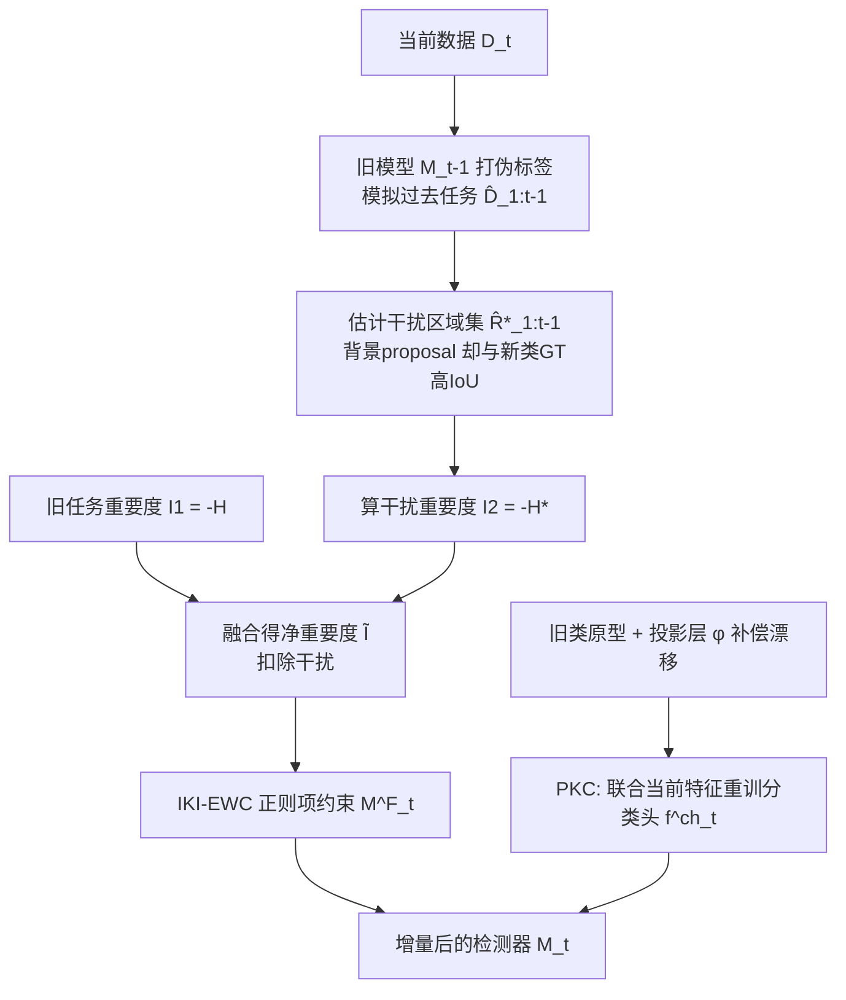

# Interference-Isolated Elastic Weight Consolidation and Knowledge Calibration for Incremental Object Detection

**会议**: ICLR 2026  
**OpenReview**: [https://openreview.net/forum?id=VrXdmCjni4](https://openreview.net/forum?id=VrXdmCjni4)  
**代码**: 待确认  
**领域**: 增量目标检测 / 持续学习 / 灾难性遗忘  
**关键词**: Incremental Object Detection, Elastic Weight Consolidation, 任务干扰, 原型校准, 语义漂移  

## 一句话总结
针对增量目标检测中"未标注的过去/未来类目标被当成背景"导致的任务知识冲突，本文重新推导 EWC 的贝叶斯后验，从参数重要度里**显式扣除干扰知识**（IKI-EWC），再用可学习投影层补偿原型语义漂移重训分类头（PKC），在 VOC/COCO 上稳超 SOTA。

## 研究背景与动机
- **领域现状**：增量目标检测（IOD）要求检测器在不断学新类的同时不忘旧类。主流做法分两类——基于知识蒸馏（用旧模型的特征/预测做软标签）和基于参数正则（约束重要参数不被覆盖，EWC 是代表）。
- **现有痛点**：现有方法大多没有**显式、定量地建模知识保留过程中的信息冲突**，任务边界模糊。IOD 比普通类增量学习多一层麻烦：一张图里可能同时含有过去、当前、未来任务的物体，而那些**未标注的过去类/未来类目标会被错误地当作背景**学进模型。过去类的目标还能靠旧模型打伪标签缓解，但**未来类目标完全无标注、最难处理**。
- **核心矛盾**：直接套用 EWC 时，旧模型 $M_{t-1}$ 已经把"未来类目标=背景"这种错误学进了参数里，EWC 又会忠实地把这些**干扰知识**也当成"重要参数"保护起来，反而加剧了新旧知识的冲突，让遗忘更严重。这本质上违反了 EWC 推导所依赖的条件独立假设。
- **本文目标**：在不额外训练当前任务 teacher（区别于 BPF）的前提下，从参数正则的角度把"干扰知识"从参数重要度中剥离出去，同时缓解分类头的语义漂移。
- **核心 idea**：**[隔离干扰]** 用旧检测器在新数据上的误判来估计任务冲突区域，重新推导贝叶斯后验，建立"已学知识"与"干扰知识"的数学关系，从而在更新权重时**定向扣除冲突**；**[原型校准]** 用可学习投影层补偿旧类原型的语义漂移，再联合当前特征重训分类头。

## 方法详解

### 整体框架
IIKC 框架建立在 Faster R-CNN（ResNet-50 backbone）之上，含两个互补模块：**IKI-EWC** 处理区域特征提取器 $M^F_t$（backbone+RPN+ROI/FC）的参数正则，**PKC** 单独治理分类头 $f^{ch}_t$ 的遗忘。整条流水线先用旧模型 $M_{t-1}$ 在当前数据 $D_t$ 上打高置信伪标签模拟"过去任务场景"，据此估出冲突区域集 $\hat{R}^*_{1:t-1}$ 并从参数重要度里扣掉，再以校准后的旧类原型重训分类头。

### 关键设计

**1. 重写 IOD 的后验分解：把背景里的"假背景"摘出去。** 标准 EWC 在序贯学习下假设条件独立 $p(D_t\mid\theta,D_{1:t-1})=p(D_t\mid\theta)$，于是后验简化成 $p(\theta\mid D_{1:t})\propto p(D_t\mid\theta)\,p(\theta\mid D_{1:t-1})$。但在 IOD 里这个假设被破坏——本文把图像级数据映射到 proposal 级做细粒度分析，定义**干扰集** $R^*_{1:t-1}=\{r\in R^-_{1:t-1}:\exists g\in G_t,\ \mathrm{IoU}(r,g)\ge\gamma\}$，即早期被当作背景、但其实和第 $t$ 阶段新类前景重叠的那些 proposal。把它们从过去数据里剔除后，数据重新分解为 $D_{1:t}=(R_{1:t-1}\setminus R^*_{1:t-1})\cup R_t=R'_{1:t-1}\cup R_t$，后验也随之改写成 $p(\theta\mid D_{1:t})\propto p(R_t\mid\theta)\,p(\theta\mid R'_{1:t-1})$，让正则项只建立在**非冲突**的干净 proposal 上。

**2. 跨阶段估计干扰、并解析出干净后验。** 难点在于 $R'_{1:t-1}$ 无法在任一单阶段算出：阶段 $1{:}t-1$ 时还没有 $G_t$，到了阶段 $t$ 又拿不到原始 $R_{1:t-1}$。本文用 $D_t$ 加旧模型 $M_{t-1}$ 在阶段 $t$ 近似它——跑 $M_{t-1}$ 得旧类伪标签构造模拟过去集 $\hat{D}_{1:t-1}$，回喂得到背景子集 $\hat{R}^-_{1:t-1}$，再按 IoU 阈值筛出 $\hat{R}^*_{1:t-1}$。把 $R_{1:t-1}$ 看成干净子集与干扰子集的混合，令 $k=|\hat{R}^*_{1:t-1}|/|\hat{R}'_{1:t-1}|$ 度量干扰严重程度，即可解析地解出干净后验 $p(\theta\mid\hat{R}'_{1:t-1})=(1+k)\,p(\theta\mid R_{1:t-1})-k\,p(\theta\mid\hat{R}^*_{1:t-1})$，无需在数据层面真正重建 $R'_{1:t-1}$。

**3. 干扰隔离的参数重要度公式。** 对两个后验都做 Laplace 近似（高斯，中心在收敛参数 $\theta^*_{t-1}$，方差由各自 Hessian $H,H^*$ 给出），最大化后验得到阶段 $t$ 的损失 $L(\theta)=L^{det}_t(\theta)+\frac{\lambda}{2}\sum_i\tilde{I}_i(\theta_i-\theta^*_{t-1,i})^2$，其中**净重要度**为
$$\tilde{I}_i=\frac{I_{1,i}\,I_{2,i}}{(1+k)^2 I_{2,i}+k^2 I_{1,i}}$$
$I_{1,i}=-H_i$ 是携带干扰的旧任务重要度（鼓励保留旧知识），$I_{2,i}=-H^*_i$ 是干扰区域上的重要度（衡量该参数受冲突知识影响的强度）。这个公式的妙处在于：对被干扰污染的参数放松约束、对真正承载旧知识的参数加强保护，从而把"未来类当背景"这种错误信息从重要度估计中定向移除。

**4. PKC：投影层补偿语义漂移、重训分类头。** 参数正则管得住 $M^F_t$，却挡不住分类头 $f^{ch}_t$ 的语义漂移——特征空间一变，旧类原型就失真。PKC 在旧模型训完后从 ROI FC 输出抽取旧类区域特征，按高斯（均值 $\mu_i$、对角协方差 $\sigma^2_i$）建模每类分布得原型 $C$。再学一个线性投影 $\phi(f_{t-1})=Wf_{t-1}+b$ 把旧特征空间映射到新特征空间，损失 $L_{proj}=\sum_{i\in\mathrm{TopK}}\|\phi(f_{t-1,i})-f_{t,i}\|_2^2$ 只用每类 L2 距离最小的 TopK 对特征做对齐。训练好投影后，从原型高斯采样旧类特征 $f^s$ 经 $\phi$ 做漂移补偿，与当前任务特征 $f^t$ 拼接喂入分类头，用交叉熵 $L_{ce}$ 重训，从而在分类头层面进一步抑制遗忘。

## 实验关键数据

### 主实验：PASCAL VOC 2007（两阶段，mAP@0.5）
表中灰底列为全类平均 AP（1-20）。

| 方法 | 来源 | 19-1 | 15-5 | 10-10 | 5-15 |
|------|------|------|------|-------|------|
| Joint Training（上界） | - | 76.4 | 76.4 | 76.4 | 76.4 |
| ABR* | ICCV'23 | 70.9 | 71.0 | 72.0 | 69.4 |
| GMDP-ABR* | ICLR'25 | 74.6 | 73.2 | 72.7 | 70.7 |
| BPF | ECCV'24 | 74.1 | 72.7 | 72.9 | 73.0 |
| GMDP-ILOD | ICLR'25 | 73.9 | 71.8 | 70.8 | 61.7 |
| **Ours** | - | **75.4** | **73.7** | **75.7** | **75.6** |

\* 表示使用 exemplar 回放。本文为**非回放**方法，却在 10-10/5-15 上比 BPF 高 2.8%/2.6%，比回放方法 GMDP-ABR 高 3.0%/4.9%。

### 主实验：MS COCO 2017（COCO-style mAP）

| 方法 | 40-40 AP / AP50 / AP75 | 70-10 AP / AP50 / AP75 |
|------|----------------------|----------------------|
| BPF (ECCV'24) | 34.4 / 54.3 / 37.3 | 36.2 / 56.8 / 38.9 |
| **Ours** | **35.9 / 55.8 / 38.8** | **37.1 / 57.6 / 40.6** |

非回放设定下平均 AP 比 BPF 高 1.5%（40-40）/0.9%（70-10），类别越多干扰抑制越关键。

### 消融实验（VOC，1-20 平均 mAP@0.5）

| IKI-EWC | PKC | VOC 10-10 | VOC 10-5 | VOC 5-5 |
|:-------:|:---:|:---------:|:--------:|:-------:|
| – | – | 73.8 | 66.4 | 64.0 |
| ✓ | – | 75.1 | 70.9 | 66.6 |
| – | ✓ | 74.3 | 67.9 | 63.2 |
| ✓ | ✓ | **75.7** | **71.5** | **66.6** |

IKI-EWC 是主力（单加即 +1.3%/+4.5%/+4.0%），PKC 在长序列设定下提供额外增益。超参消融显示 $\lambda=20$、$K=32$、$\gamma=0.5$ 较优，$K$ 在 2~512 间相当鲁棒。

### 关键发现
- 把干扰知识从 EWC 重要度里扣掉，比朴素加 EWC（$L2$++）在 10-10 上大幅缓解了遗忘（朴素 L2++ 在 11-20 新类上掉到 42.5）。
- 在 15-1 这种"旧类压倒性多"的长序列里，正则法会给旧参数过高重要度、限制可塑性，是本文方法相对偏弱的设定。

## 亮点与洞察
- **把"假背景"问题数学化**：第一次把 IOD 里"未标注过去/未来类被当背景"这一冲突，落到 proposal 级别并写进贝叶斯后验分解，给出可解析的干净后验与净重要度闭式公式，而非启发式加权。
- **非回放、不训额外 teacher**：相比 BPF 要训当前任务 teacher、相比 ABR/GMDP-ABR 要存 exemplar，本文纯参数正则路线在存储与计算上更轻，却能反超回放方法。
- **分而治之**：把"区域特征提取器"和"分类头"的遗忘拆成 IKI-EWC 与 PKC 两个机制，分别用参数重要度与原型漂移补偿来治理，定位清晰。

## 局限与展望
- **长序列单步增量（15-1）是软肋**：旧类主导时正则把可塑性压得过死，新类适应受限，作者自己也点出这一点。
- **干扰估计依赖旧模型伪标签质量**：$\hat{R}^*_{1:t-1}$ 完全靠 $M_{t-1}$ 在 $D_t$ 上的误判推断，旧模型若本身较弱，干扰集估计会有偏差。
- **未来类目标仍未被正面利用**：方法是"把未来类当背景的错误从参数里扣掉"，而非真正利用未来类信息；如何前瞻性建模未标注未来类仍是开放问题。
- **检测器架构受限**：实验基于两阶段 Faster R-CNN，proposal 级推导能否平滑迁移到 DETR 类一阶段/query-based 检测器有待验证。

## 相关工作与启发
- **EWC** (Kirkpatrick et al., 2017)：本文的理论起点，区别在于把条件独立假设在 IOD 下的失效显式建模出来。
- **BPF** (Mo et al., ECCV'24)：双 teacher 蒸馏组合类概率缓解新旧冲突；本文换成参数正则视角，省掉额外 teacher。
- **GMDP** (Wang et al., ICLR'25)：用高斯混合原型对齐特征分布；本文 PKC 的原型建模与之思路相近但用于漂移补偿。
- **启发**：在持续学习里，"重要度估计"本身可能被错误标注污染——把数据噪声/标注缺失显式写进重要度公式，是一个比单纯调正则强度更本质的方向。

## 评分
- **新颖性**: ⭐⭐⭐⭐ — 把 IOD 的"假背景冲突"重写进 EWC 后验并给出净重要度闭式解，理论切入点扎实且少见。
- **实验充分度**: ⭐⭐⭐⭐ — VOC 两阶段/多阶段 + COCO 两设定，组件/超参消融齐全；但仅 Faster R-CNN 单架构，缺 DETR 类验证。
- **写作质量**: ⭐⭐⭐⭐ — 推导脉络清晰、图 1/图 2 直观，公式与动机衔接好。
- **价值**: ⭐⭐⭐⭐ — 非回放、不训额外 teacher 却反超回放 SOTA，对资源受限的增量检测落地有实用价值。

<!-- RELATED:START -->

## 相关论文

- [\[CVPR 2026\] Parameterized Prompt for Incremental Object Detection](../../CVPR2026/object_detection/parameterized_prompt_for_incremental_object_detection.md)
- [\[CVPR 2026\] RHCNet: Residual-Guided Hierarchical Calibration Network for Robust Underwater Object Detection](../../CVPR2026/object_detection/rhcnet_residual-guided_hierarchical_calibration_network_for_robust_underwater_ob.md)
- [\[ECCV 2024\] On Calibration of Object Detectors: Pitfalls, Evaluation and Baselines](../../ECCV2024/object_detection/on_calibration_of_object_detectors_pitfalls_evaluation_and_baselines.md)
- [\[CVPR 2026\] Black-Box Domain Adaptation for Object Detection with Retention-Driven Knowledge Compression](../../CVPR2026/object_detection/black-box_domain_adaptation_for_object_detection_with_retention-driven_knowledge.md)
- [\[AAAI 2026\] YOLO-IOD: Towards Real Time Incremental Object Detection](../../AAAI2026/object_detection/yolo-iod_towards_real_time_incremental_object_detection.md)

<!-- RELATED:END -->
