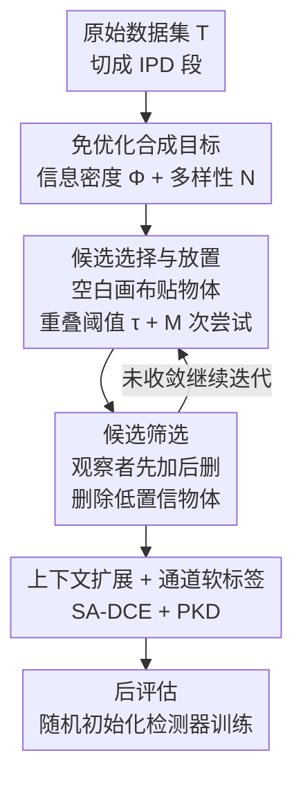

# OD3: Optimization-Free Dataset Distillation for Object Detection

**会议**: ICLR 2026  
**OpenReview**: [https://openreview.net/forum?id=W6gbWvvovB](https://openreview.net/forum?id=W6gbWvvovB)  
**代码**: https://github.com/VILA-Lab/OD3  
**领域**: 目标检测 / 数据集蒸馏  
**关键词**: 数据集蒸馏, 目标检测, 免优化合成, 知识蒸馏, 软标签

## 一句话总结
OD3 把数据集蒸馏从图像分类拓展到目标检测，提出一套**完全不用梯度优化**的合成流程：从空白画布出发，迭代地把真实物体贴进去（候选选择）、再用一个预训练观察者模型把低置信度物体挑出来删掉（候选筛选），配合通道级软标签训练学生检测器——在 COCO 1% 压缩率下 mAP50 比此前唯一的检测蒸馏方法 DCOD 高出 14.8%。

## 研究背景与动机
**领域现状**：数据集蒸馏（Dataset Distillation, DD）想把一个大数据集压缩成几百张合成图，使得在这些合成图上训练出来的模型逼近在全量数据上训练的效果。但几乎所有 DD 工作都聚焦在**图像分类**——每张图一个主体、一个标签，合成时只要把类别的高层语义信息塞进像素即可。

**现有痛点**：目标检测要难得多。一张图里有多个不同类别的实例，既要预测**类别**又要预测**框的位置**，监督信号是空间标注而非图像级标签。直接把分类的蒸馏方法搬过来会水土不服：基于模型反演（model inversion）的优化式蒸馏（如此前唯一的检测蒸馏方法 DCOD 的 Fetch-and-Forge）依赖逐像素的梯度更新，既慢又难以保留物体的几何位置和上下文。核心集选择（coreset selection）类方法虽然不用训练，但压缩率通常只能做到 20% 以上，离"几百张图"的极限压缩差得远。

**核心矛盾**：检测蒸馏同时要保住物体的**几何（location）**和**身份（class）**两类信息，而基于像素优化的合成因为受限于固定梯度，很难既保留多实例的空间关系、又灵活地为小物体补上下文。

**本文目标**：设计一个专为检测的蒸馏框架，在 0.25%~5% 这种极端压缩率下仍能训出可用的检测器，同时彻底摆脱昂贵的优化过程。

**切入角度**：作者把蒸馏重新定义成一个"往空白画布上尽可能多地收集有效信息"的问题——所谓"有效"就是画布上贴的物体既**高置信、尺寸合适**又**种类多样**。既然合成图就是把真实物体的 patch 贴到画布上，那就根本不需要梯度优化，只要决定"贴谁、贴哪、留谁"即可。

**核心 idea**：用"先加后删"的免优化拼贴（candidate selection + screening）代替"逐像素反演优化"，并用一个量化指标（信息密度 + 多样性）引导拼贴质量。

## 方法详解

### 整体框架
OD3 要解决的是"如何不靠优化、只靠拼贴就造出一小批高质量的检测训练图"。整条流水线分两大阶段串行：**候选选择与放置**负责把真实物体贴满空白画布，**候选筛选**负责用观察者模型把贴得不好的物体删掉，二者在同一张画布上以"先加后删"的方式迭代多轮，最后给保留下来的物体生成软标签，用来在后评估阶段训练一个随机初始化的检测器。

为保证合成集里每个物体只出现一次、且类间平衡，作者先把原始数据集 $\mathcal{T}$ 切成 IPD 个互不重叠的段（IPD = images per dataset，直接对应压缩率），每段蒸出一张图，合成集 $\mathcal{S}$ 的大小恰好等于 IPD。

### 关键设计

**1. 免优化的信息密度目标：把"贴得好不好"变成可量化的分数**

要在不用梯度的前提下判断一张合成图质量，就得有个明确的目标函数。作者定义**信息密度** $\Phi(x)$ 来衡量画布被"有价值物体"占据的程度：

$$\Phi(x) = \frac{\sum_{r=0}^{K} a(o_r)\, q(o_r)}{\sum_{r=0}^{K} a(o_r)}$$

其中 $K$ 是画布上物体数，$a(o_r)$ 是第 $r$ 个物体的面积，$q(o_r)$ 是预训练检测器给它的置信度。直观上这是一个**以面积为权重的平均置信度**——既鼓励贴大物体、又鼓励贴检测器认得清的物体。光有密度还不够，少数高置信物体堆在一起信息单一，于是再加一个**信息多样性** $N(x)=N$（画布上不同物体的数量）。最终蒸馏目标把二者相加：

$$S_{\hat{x}} = \arg\max_{x_T}\ \Phi(x_T) + N(x_T)$$

因为 $\Phi$ 和 $N$ 相互牵制（贴更多物体可能拉低平均置信度）、纠缠在一起，作者不去解析地求最优，而是固定画布尺寸后，**用消融实验扫一个重叠阈值 $\tau$** 来逼近最大值。这个目标函数是整个免优化框架的"指南针"，把抽象的"质量"落成了可计算、可比较的标量。

**2. 候选选择与放置：受控随机贴图 + 采样控制器保证唯一与平衡**

针对"既要贴满又不能乱叠"的痛点，候选选择阶段从真实图里按框抠出物体 patch，然后做**受控随机放置**：对每个候选物体在画布上尝试 $M$ 次（实验取 40），只有当它与已有物体的重叠不超过阈值 $\tau$（取 0.6）时才落位，否则丢弃。这样既保留了随机带来的多样性，又避免物体严重堆叠互相遮挡。

配套的**采样控制器**（Fig. 3）保证同一个真实物体不会被放进不同的合成图：把原始集切成 IPD 段、每段只喂给一张合成图，于是 $|\mathcal{S}|=\text{IPD}$ 且合成集里物体互不重复。这种分段合成天然维持了**类间平衡与类内多样性**——避免某个高频类在所有合成图里反复出现而稀释信息。

**3. 候选筛选：观察者驱动的"先加后删"迭代，且理论保证不会更差**

只贴不删会留下大量低置信、贴歪的物体污染训练信号。候选筛选阶段引入一个**预训练观察者模型**（observer，本身就是一个检测器），在半成品画布上做推理，把预测和插入时的真值框匹配，凡置信度低于阈值 $\eta$（取 0.2）或不满足一致性的物体一律删除。整个合成因此是一个先加后删的循环：

$$x_{i+1} = f_{\text{remove}}\big(f_{\text{add}}(x_i)\big),\quad i=0,1,\dots,T-1$$

作者把它和"只加不删"（$x_{i+1}=f_{\text{add}}(x_i)$）做了对比，并给出 **Theorem 1**：在合理的置信度阈值和足够迭代下，先加后删的目标值 $G_2$ 一定不小于只加不删的 $G_1$（$G_2 \ge G_1$）。证明思路是把每个物体的"面积×置信度"看成概率权重，删掉低置信物体相当于从分子里抹去低质量贡献，从而抬高存活集合的期望置信度 $\mathbb{E}_{r\ge M+1}[q(o_r)] \ge \mathbb{E}_r[q(o_r)]$，于是密度 $\Phi$ 单调不降。这给"为什么要加删除步"提供了一个干净的理论依据，而不只是工程上的经验。

**4. SA-DCE 上下文扩展 + 通道级软标签：补小物体上下文、让蒸馏信号对检测有效**

最后要解决两个检测特有的细节问题。其一，小物体抠出来后几乎没有周边上下文，检测器难以把它和背景区分。作者提出**尺度感知动态上下文扩展（SA-DCE）**：按物体面积自适应地向外扩一圈像素，

$$\ell_{\text{extension}} = \left(1 - \frac{a(o_{ir}) - a_{\min}}{a_{\max} - a_{\min}}\right)\times r$$

物体越小（面积越接近 $a_{\min}$），扩展量越大，从而给小目标补上最缺的周边线索；这是优化式方法做不到的，因为它们被困在逐像素调参里，无法做这种有针对性的上下文调整。其二，分类里好用的 logit 软标签搬到检测上效果很差，作者改用**通道级软标签**：以 PKD（Pearson Knowledge Distillation）为基础，对 FPN 输出在高宽维度做去均值除标准差的归一化

$$\frac{f^{\text{fpn}}(f^{\text{backbone}}(x_i)) - \text{mean}(\cdot)}{\text{std}(\cdot) + \epsilon}$$

再用 MSE 监督学生检测器的 FPN 特征（Eq. 6）。相比直接回归原始 FPN 特征（Eq. 5），通道级归一化把蒸馏信号聚焦在通道间的相对结构上，给检测器提供了更有效的监督。

### 损失函数 / 训练策略
后评估阶段用合成集 $\mathcal{S}$ 及其通道级软标签，从随机初始化训练一个目标检测器，监督用 PKD 形式的特征 MSE 损失（Eq. 6）。COCO 上 Faster R-CNN-50 训 96 epoch、RetinaNet-50 训 256 epoch；观察者用 Faster R-CNN-101、学生用 Faster R-CNN-50。整个合成在单张 4090 上完成，COCO 约 4.7 小时、VOC 约 0.74 小时，主要开销来自观察者筛选。

## 实验关键数据

### 主实验
COCO 上与核心集选择方法和唯一的检测蒸馏方法 DCOD 对比，OD3 在所有压缩率全面领先（观察者 Faster R-CNN-101，学生 Faster R-CNN-50）：

| 压缩率 IPD | 指标 | OD3 | DCOD | 提升 |
|--------|------|------|----------|------|
| 0.25% | mAP50 | 24.30 | 17.20 | +7.1 |
| 0.5% | mAP50 | 31.90 | 21.50 | +10.4 |
| 1.0% | mAP | 22.40 | 12.10 | +10.3 |
| 1.0% | mAP50 | 39.50 | 24.70 | +14.8 |

全量数据上限是 mAP 39.80 / mAP50 60.10，OD3 仅用 1% 数据就把 mAP50 拉到 39.50。PASCAL VOC 上同样领先：2.0% 压缩率达 mAP50 58.70，比 DCOD 高 8.0。

### 消融实验
组件消融（COCO，Table 5）清楚显示两个阶段各自的贡献：

| 配置 | mAP50 (0.25%) | mAP50 (1.0%) | 说明 |
|------|---------|---------|------|
| 无选择无筛选 | 2.40 | 14.10 | 接近随机贴图 |
| 仅候选选择 | 19.10 | 33.90 | 受控放置带来主要增益 |
| 选择 + 筛选（Full） | 24.30 | 39.50 | 观察者筛选再补 +5~6 点 |

标签类型消融（Table 3）验证 SA-DCE：Ex-Bbox（带上下文扩展的框）相比普通 Bbox 在各压缩率普遍提升，尤其小物体 mAPs 在 0.5% 时 +1.6；mask 标签反而最差，说明扩展上下文比精确掩码更利于这种拼贴式合成。

### 关键发现
- **候选选择是地基，候选筛选是精修**：从 2.40 → 19.10 → 24.30（0.25%），仅放置就贡献了绝大部分增益，观察者筛选在此基础上稳定再加 5~6 点 mAP50。
- **SA-DCE 主要救小物体**：Ex-Bbox 对 mAPs 的提升最明显（+0.7~+1.6），印证了"小目标缺上下文"这一动机；但对大物体（mAPl）偶尔略降，说明上下文扩展是有选择性的权衡。
- **跨架构泛化好**（Table 4）：观察者用 RetinaNet / Faster R-CNN / Deformable DETR / ViTDet、学生换成 RetinaNet 或 Faster R-CNN，结果都稳定，说明合成数据的质量不依赖特定检测器。
- **极致高效**：合成只需单卡 4090 数小时，无需任何反向传播优化，相比 DCOD 的反演式合成大幅省时。

## 亮点与洞察
- **把"蒸馏"重述成"信息收集"**：用信息密度 $\Phi$（面积加权置信度）+ 多样性 $N$ 两个简单标量当目标函数，绕开了梯度优化，思路干净且可解释——这是全文最"啊哈"的地方。
- **先加后删配理论护栏**：删除低置信物体能抬高期望置信度（Theorem 1, $G_2\ge G_1$），把一个工程直觉变成可证的单调性结论，少见地为免优化合成提供了理论支撑。
- **SA-DCE 是个可迁移的小 trick**："物体越小、上下文扩得越多"的自适应扩框，可以直接迁移到任何 copy-paste 式的检测数据增强里。
- **通道级软标签**揭示了一个易被忽视的点：检测蒸馏不能照搬分类的 logit 软标签，FPN 特征做通道归一化（PKD）才有效。

## 局限与展望
- **依赖观察者模型质量**：候选筛选完全由预训练观察者的置信度驱动，若观察者本身在某些类别上偏差大，会系统性地删错或留错物体。
- **拼贴合成的真实性有限**：物体贴在随机采样的背景上，缺乏真实场景里的物理/语义一致性（如物体与背景的尺度、光照关系），在更依赖全局上下文的检测器上可能受限。
- **多样性度量过于朴素**：$N(x)$ 只数物体个数，没有刻画类别分布或空间布局的多样性，仍有改进空间。
- **超参依赖经验扫描**：重叠阈值 $\tau$、置信度阈值 $\eta$、尝试次数 $M$ 都靠消融扫出，换数据集可能需重新调。

## 相关工作与启发
- **vs DCOD**：DCOD 走 Fetch-and-Forge，先在原数据上训检测器再用模型反演做逐像素优化合成；OD3 完全不优化，靠拼贴 + 筛选，既快又在 COCO 1% 上 mAP50 高出 14.8，并能灵活做 SA-DCE 上下文扩展（反演式做不到）。
- **vs 核心集选择（CSOD / Uniform / K-Center / Herding）**：它们从真实图里"挑子集"，压缩率难低于 20%；OD3 是"合成新图"，能压到 0.5% 甚至更低，且在同等设定下大幅领先。
- **vs 分类蒸馏（SRe²L 等）**：分类蒸馏靠 logit 软标签 + 像素优化，OD3 指出这套到检测上失效，改用 FPN 通道级软标签 + 免优化拼贴，专门处理多实例与空间标注。

## 评分
- 新颖性: ⭐⭐⭐⭐⭐ 首个免优化的检测数据集蒸馏框架，把蒸馏重述为信息收集并配理论保证。
- 实验充分度: ⭐⭐⭐⭐ COCO/VOC 多压缩率 + 组件/标签/跨架构消融充分，但缺更大检测器与开放域验证。
- 写作质量: ⭐⭐⭐⭐ 动机和方法叙述清晰，公式与图配合好；部分符号记法略显繁琐。
- 价值: ⭐⭐⭐⭐⭐ 填补检测蒸馏空白，单卡数小时即可合成，实用性强。

<!-- RELATED:START -->

## 相关论文

- [\[ICLR 2026\] Dual Distillation for Few-Shot Anomaly Detection](dual_distillation_for_few-shot_anomaly_detection.md)
- [\[CVPR 2026\] Incremental Object Detection via Future-Aware Decoupled Cross-Head Distillation](../../CVPR2026/object_detection/incremental_object_detection_via_future-aware_decoupled_cross-head_distillation.md)
- [\[ICLR 2026\] InfoDet: A Dataset for Infographic Element Detection](infodet_a_dataset_for_infographic_element_detection.md)
- [\[ICLR 2026\] CGSA: Class-Guided Slot-Aware Adaptation for Source-Free Object Detection](cgsa_class-guided_slot-aware_adaptation_for_source-free_object_detection.md)
- [\[ICML 2026\] FOCUS: Forcing In-Context Object Localization through Visual Support Constraints and Policy Optimization](../../ICML2026/object_detection/focus_forcing_in-context_object_localization_through_visual_support_constraints_.md)

<!-- RELATED:END -->
