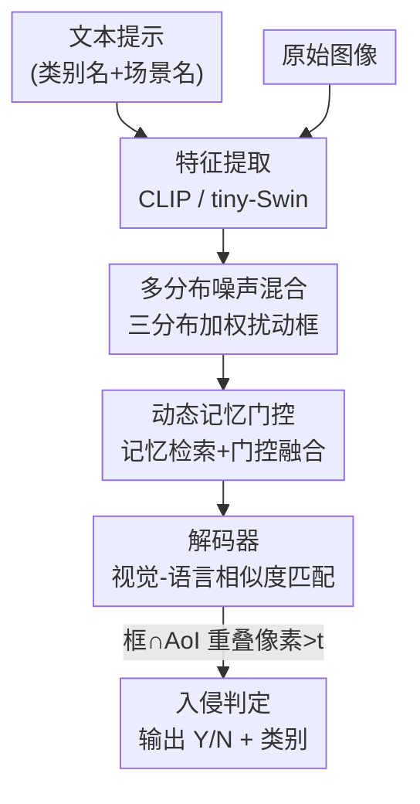

# OVID: Open-Vocabulary Intrusion Detection

**会议**: ICLR 2026  
**OpenReview**: [https://openreview.net/forum?id=msFFC14G9i](https://openreview.net/forum?id=msFFC14G9i)  
**代码**: 待确认  
**领域**: 目标检测 / 开放词表 / 视觉入侵检测  
**关键词**: 入侵检测, 开放词表, 多模态对齐, 检测+分割, 记忆门控

## 一句话总结
本文首次提出"开放词表入侵检测（OVID）"任务，构造了 8 类入侵的 Cityintrusion-OpenV 数据集，并设计端到端多模态框架 OVIDNet——用文本-图像特征对齐去识别训练中没见过的入侵类别，再配两个即插即用的小策略（多分布噪声混合、动态记忆门控）提升泛化，在零样本与任务迁移设定下都超过 OpenSeeD 等强基线。

## 研究背景与动机

**领域现状**：视觉入侵检测要判断"目标是否进入了某个受限区域（Area-of-Interest, AoI）"，广泛用于安防、智能监控、自动驾驶。早期静态相机场景靠背景减除（ABS）、方向梯度直方图（HOG）等就够；动态视角下则借助 PIDNet、Cross-PIDNet 这类检测/分割框架，通过判断目标与 AoI 的重叠像素来给出入侵结论。

**现有痛点**：这些方法都依赖**预定义的封闭类别**。早期 PIDNet 只能检测单一类别（行人）；后来的 MF-ID、MMID-bench 把类别扩到 4 类、并引入多域适配，但本质仍是"训练集里标过的类才认得"。现实世界里冒出来一辆 Car、一辆 Truck 这种没定义过的类别，模型直接漏检（False Negative），实用性大打折扣。

**核心矛盾**：入侵检测的实战需求是**开放世界**——任何可能闯入受限区的物体都该被发现；而现有框架的能力边界被训练类别死死框住。同时已有的开放词表检测器（Grounding DINO、YOLO-World）虽能零样本检测，却**只做检测这一件事**，缺少分割和入侵判定，OpenSeeD 能联合检测+分割却又没有入侵判断能力，都无法直接搬来用。另一层障碍是**没有数据集**：现有入侵数据集类别少（≤4）、且只有图像标签没有配套文本标签，撑不起开放词表训练。

**本文目标**：把入侵检测从"封闭类别"推到"开放词表"，需要同时解决两个子问题——(1) 造一个类别更丰富、带文本提示的入侵数据集；(2) 设计一个能同时做检测、分割、入侵判定，且能泛化到未见类别的端到端框架。

**切入角度**：既然 OpenSeeD 已经能联合检测+分割，就以它为底座改造，把"视觉特征与语言嵌入对齐"这条开放词表的成功经验引进入侵检测，让模型靠文本提示去认未见类别。

**核心 idea**：用"文本提示 ↔ 图像特征对齐"替代"固定类别头"来识别入侵者，并针对入侵场景的两个具体短板（未见类别定位不准、复杂场景上下文建模弱）各加一个轻量策略来补强。

## 方法详解

### 整体框架
OVIDNet 的输入是两个模态：**文本**（可自定义的入侵类别名如 'person'、'bus'，以及场景名如 'street'、'road'）和**图像**。文本经 CLIP 文本编码器得到文本嵌入，图像经 tiny-Swin-Transformer 得到多尺度图像特征，两者送入解码器。解码器里嵌入了两个增强策略——**多分布噪声混合**作用在框回归上、**动态记忆门控**作用在特征上——分别提升对未见类别的定位与对复杂场景的上下文建模。解码后同时产出检测框（入侵者）与分割掩码（AoI），最后通过**重叠像素判定**：当目标框与 AoI 掩码的重叠像素超过阈值 $t$，就标记为入侵（'Y'），否则为非入侵（'N'），并把类别名一并写到目标框上。整体可写成：

$$Is = J\{\,D(F_T, F_I) \overset{e}{\to} (Box_p, Aoi_p)\,\}$$

其中 $F_T=E_T(\text{Text})$、$F_I=E_I(\text{Img})$，$D$ 是解码器，$J$ 是入侵判定模块，$Box_p$、$Aoi_p$ 是预测的框与 AoI。

### 关键设计

**1. 多模态对齐的开放词表入侵框架：用文本提示替代固定类别头**

针对"封闭类别无法认未见入侵者"这个根本痛点，OVIDNet 不再用固定类别分类头，而是把图像特征 $F_I$ 与文本嵌入 $F_T$ 做相似度匹配，让"哪些类算入侵"由用户给的文本提示动态决定。这套设计建立在开放词表检测+分割底座 OpenSeeD 之上，关键是把它从"只会检测+分割"扩展成"检测+分割+入侵判定"三任务一体：在拿到检测框与 AoI 分割掩码后，用重叠像素与阈值 $t$ 联合裁决入侵结果。预备阶段形式化区分了基类 $C_T^d$ 与验证类 $C_V^d$，新类别 $C_N=C_V^d\setminus C_T^d\neq\emptyset$，模型只在基类上训练、却要在 $C_N$ 上零样本生效——这正是开放词表范式带来的能力，也是它区别于 MF-ID 等封闭方法的本质。

**2. 多分布噪声混合策略：按目标大小自适应地扰动框，强化未见类别的定位**

OpenSeeD 原始的去噪训练只用单一均匀分布、固定比例的噪声扰动框，公式为 $B_f=C\{B_e+N_r\odot\Delta\odot\Upsilon,0,1\}$（$N_r\sim U(-1,1)$，$\Upsilon$ 为常数缩放）。问题是真实场景里目标尺寸差异极大：小目标需要细粒度扰动保住细节、大目标需要大尺度扰动强化全局特征，一个固定噪声分布兼顾不了。本文把噪声换成**三种分布的加权混合**：

$$B_f = C\{B_e + (\alpha N_u + \beta N_g + \gamma N_t)\odot\Delta\odot\Theta,\,0,1\}$$

其中 $N_u\sim U(-1,1)$、$N_g\sim\mathcal N(0,1)$、$N_t\sim L(0,1)$（拉普拉斯分布），权重满足 $\alpha+\beta+\gamma=1$。更关键的是把固定缩放 $\Upsilon$ 换成**随框面积自适应的噪声比** $\Theta=\tau\cdot(1+\log(1+A))$，$A=w\cdot h$ 为框面积——面积越大噪声幅度越大，从而对大、小目标给出不同强度的扰动。这套"多分布 + 面积感知"让模型对未见类别的位置信息更鲁棒，是提升零样本定位的主力。

**3. 动态记忆门控模块：用记忆网络补长程依赖、用门控做上下文自适应**

入侵检测里复杂场景的上下文建模一直偏弱，单帧特征缺乏长程依赖。本模块对输入特征 $X\in\mathbb R^{B\times C\times H\times W}$ 先做全局平均池化得到查询向量 $Q=\text{GAP}(X)$，再用**记忆检索**从一组可学习的记忆单元里取出相关上下文：

$$O_m = \text{softmax}\!\left(\frac{QM_K^T}{\sqrt d}\right)M_V$$

$M_K$、$M_V$ 是记忆键/值，$M$ 为记忆单元数，$O_m$ 是检索到的记忆输出。随后用一个**动态门控**生成自适应权重 $W=\sigma(W_2\,\text{ReLU}(W_1 Q))$，对原特征加权后与记忆输出拼接、再 $1\times1$ 卷积融合：$X_f=\text{Conv}_{1\times1}(\text{Concat}(X\odot W,\,O_m))$。门控让模型按当前场景动态决定保留多少原特征、注入多少记忆上下文，从而在雾天、拥挤街道等复杂场景下更稳。

### 损失函数 / 训练策略
沿用 OpenSeeD 的多任务训练范式，联合优化检测与分割；多分布噪声混合作为去噪训练的数据扰动嵌入框回归过程。实现上用 8 张 RTX 2080Ti，Max Iter / 总 Batch / checkpoint / eval 周期均设 15000 / 8 / 15000 / 15000，图像编码器 tiny-Swin、文本编码器 CLIP，入侵判定阈值（数据集标注阶段）设为 20。评测采用零样本与任务迁移两种方式。

## 实验关键数据

### 主实验

数据集对比上，新提的 Cityintrusion-OpenV 把入侵类别从 ≤4 提到 **8** 类，每图入侵案例数 18.03（约为前作 2×）：

| 数据集 | 入侵类别数 | Y/N 案例 | 每图案例 |
|--------|-----------|---------|---------|
| Cityintrusion | 1 | 4599/15084 | 7.3 |
| Cityintrusion-Multicategory | 4 | 5431/22683 | 9.59 |
| Multi-Domain Multi-Category | 4 | 5431/22683† | 9.59 |
| **Ours (Cityintrusion-OpenV)** | **8** | **24750/37899** | **18.03** |

与开放词表强基线 OpenSeeD 比，零样本全景分割（PQ）与任务迁移入侵精度（Acc）均有提升：

| 测试设定 | 指标 | OpenSeeD | OVIDNet | 提升 |
|---------|------|----------|---------|------|
| Cityscape 零样本 | PQ(%) | 14.03 | 16.22 | +2.19 |
| Foggy-Cityscape 零样本 | PQ(%) | 14.28 | 15.40 | +1.12 |
| Normal 入侵迁移 | Acc(%) | 29.36 | 32.79 | +3.43 |
| Foggy 入侵迁移 | Acc(%) | 24.38 | 27.83 | +3.45 |

与传统入侵方法（PIDNet、MF-ID、MMID-bench）相比，OVIDNet 是唯一具备**开放结构 + 零样本检测（ZSD）**、且能评估全部 8 类入侵的框架；旧方法只能覆盖 1~4 类、且无零样本能力。

### 消融实验

在 COCO 训练、Cityscape 零样本验证、Cityintrusion-OpenV 任务迁移设定下逐个加策略：

| B | DMG | MDNM | PQ(%) | mIOU(%) | mAP@.5(%) | Acc(%) |
|---|-----|------|-------|---------|-----------|--------|
| ✓ | | | 14.03 | 28.34 | 27.58 | 29.36 |
| ✓ | ✓ | | 15.80 | 28.78 | 29.16 | 30.72 |
| ✓ | | ✓ | 15.33 | 29.40 | 28.56 | 31.75 |
| ✓ | ✓ | ✓ | 16.22 | 29.37 | 28.98 | 32.79 |

### 关键发现
- 两个策略**各自有效、叠加更优**：完整模型相对 baseline 入侵精度 Acc 提升 3.43%、PQ 提升 2.19%。
- 单看入侵精度，MDNM（+2.39 Acc）比 DMG（+1.36 Acc）贡献更大，说明"未见类别的定位"是这一任务的瓶颈所在。
- 随任务难度上升（普通入侵检测 → 域适配 → 开放词表），各类别性能整体下降，印证开放世界对泛化与零样本能力提出了更高要求——横向比绝对数值需注意任务难度不同，不可直接比大小。

## 亮点与洞察
- **把"开放词表"这套范式第一次引进入侵检测**：核心洞察是入侵判定的"哪些算入侵"本就该由用户语言动态指定，文本-视觉对齐天然契合这个需求，比固定类别头更贴合实战。
- **面积感知的噪声比 $\Theta=\tau(1+\log(1+A))$** 是个轻巧又通用的 trick：用一个对数项把框大小耦合进去噪强度，小目标轻扰、大目标重扰，可迁移到任何基于去噪训练的检测器。
- **记忆门控把"检索式记忆"和"通道门控"组合**：用 softmax 注意力从记忆单元取上下文、再用 sigmoid 门控决定融合比例，给复杂/恶劣场景补长程依赖，这种"记忆+门控"模块可复用到其他需要上下文增强的密集预测任务。
- 任务、数据集、框架、基线一次性给齐，为后续 OVID 研究立了可比的 benchmark。

## 局限与展望
- 绝对指标偏低（零样本 PQ 仅 16.22%、入侵 Acc 约 33%），开放词表入侵检测整体仍处早期，离实用精度有距离。
- 框架是在 OpenSeeD 上改造而来，对底座依赖较强；两个策略虽有效但提升幅度有限（多在 1~3 个点），尚未触及范式级突破。
- 数据集 Cityintrusion-OpenV 基于 Cityscape 自动标注、阈值固定为 20，类别仍只有 8 类，距"真正开放世界"的长尾类别还有很大空间；自动标注的入侵标签质量也值得进一步验证。
- 入侵判定靠"框∩AoI 重叠像素 > 阈值"这一硬规则，阈值敏感性与遮挡/透视场景下的鲁棒性论文未充分展开。

## 相关工作与启发
- **vs OpenSeeD**：OpenSeeD 联合检测+分割但缺入侵判定能力；本文以它为底座，补上入侵判断模块与两个泛化策略，使其适配 OVID 任务，零样本 PQ 与入侵 Acc 都更高。
- **vs Grounding DINO / YOLO-World**：这些开放词表检测器只做检测单任务，无法满足 OVID"检测+分割+入侵判定"的多任务需求。
- **vs MF-ID / MMID-bench**：它们首次把入侵类别从 1 扩到 4、并引入多域适配，但仍是封闭类别、无零样本能力；本文是开放结构，能识别未定义类别，实用性更强。

## 评分
- 新颖性: ⭐⭐⭐⭐☆ 首次提出开放词表入侵检测任务与配套数据集，范式新但框架以 OpenSeeD 改造为主。
- 实验充分度: ⭐⭐⭐⭐☆ 覆盖 COCO/Cityscape/Foggy/自建数据集，含零样本、任务迁移、消融多设定。
- 写作质量: ⭐⭐⭐☆☆ 动机与方法清晰，但部分公式/记号略粗糙，绝对指标偏低需更多解释。
- 价值: ⭐⭐⭐⭐☆ 为安防/监控/自动驾驶的开放世界入侵检测立了任务、数据与基线，实用导向明确。

<!-- RELATED:START -->

## 相关论文

- [\[ICLR 2026\] Fantastic Tractor-Dogs and How Not to Find Them With Open-Vocabulary Detectors](fantastic_tractor-dogs_and_how_not_to_find_them_with_open-vocabulary_detectors.md)
- [\[ICLR 2026\] Retain and Adapt: Auto-Balanced Model Editing for Open-Vocabulary Object Detection under Domain Shifts](retain_and_adapt_auto-balanced_model_editing_for_open-vocabulary_object_detectio.md)
- [\[ICLR 2026\] DeCo-DETR: Decoupled Cognition DETR for efficient Open-Vocabulary Object Detection](deco-detr_decoupled_cognition_detr_for_efficient_open-vocabulary_object_detectio.md)
- [\[CVPR 2026\] WeDetect: Fast Open-Vocabulary Object Detection as Retrieval](../../CVPR2026/object_detection/wedetect_fast_open-vocabulary_object_detection_as_retrieval.md)
- [\[CVPR 2026\] Thermal-Det: Language-Guided Cross-Modal Distillation for Open-Vocabulary Thermal Object Detection](../../CVPR2026/object_detection/thermal-det_language-guided_cross-modal_distillation_for_open-vocabulary_thermal.md)

<!-- RELATED:END -->
