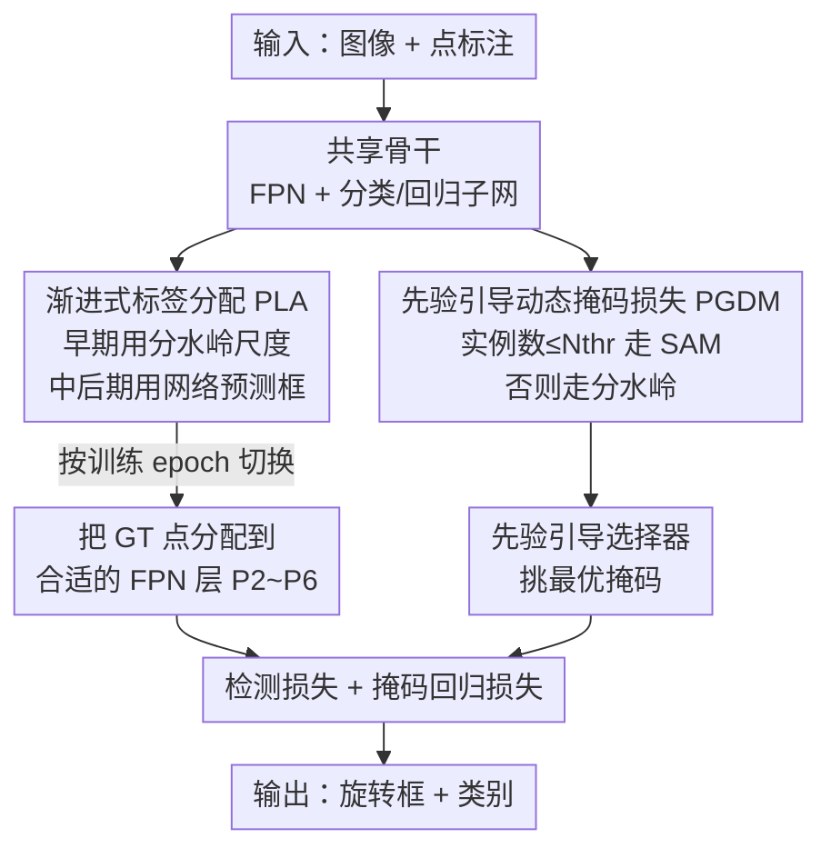

# Point2RBox-v3: Self-Bootstrapping from Point Annotations via Integrated Pseudo-Label Refinement and Utilization

**会议**: ICLR 2026  
**OpenReview**: [https://openreview.net/forum?id=9vlS8PSGG7](https://openreview.net/forum?id=9vlS8PSGG7)  
**代码**: https://github.com/VisionXLab/Point2RBox-v3  
**领域**: 旋转目标检测 / 弱监督检测  
**关键词**: 点监督, 旋转目标检测, 伪标签, 标签分配, SAM, 分水岭

## 一句话总结
针对"只用一个点标注训练旋转框检测器"这一弱监督任务，本文提出 Point2RBox-v3，用渐进式标签分配（PLA）把伪标签里的尺度信息喂给 FPN 多层标签分配、并用先验引导的动态掩码损失（PGDM-Loss）让 SAM 管稀疏场景、分水岭管密集场景，在 DOTA-v1.0 等六个遥感基准上把点监督旋转检测推到新 SOTA（DOTA-v1.0 两阶段 66.09%）。

## 研究背景与动机

**领域现状**：旋转目标检测（OOD）在遥感、自动驾驶、场景文字等领域需求旺盛，但标注一个旋转框（RBox）比水平框贵 36.5%、比一个点贵 104.8%，于是"只标点、弱监督学旋转框"成了热门替代路线。当前点监督方法大致分四类：多示例学习/类概率图生成伪框、单样本知识组合、借 SAM 零样本能力的点提示分割、以及用空间布局生成伪标签（如 Point2RBox-v2）。

**现有痛点**：作者把矛头指向所有端到端方法共有的两个短板——伪标签**利用效率低**和**质量差**。利用效率上，端到端方法需要给特征金字塔网络（FPN）做标签分配，而 FPN 的不同层本应负责不同尺度的目标；可是 Point2RBox-v2 这类方法图省事，把所有真值点都丢到同一层，白白浪费了伪标签里本就携带的尺度信息。质量上，Point2RBox-v2 靠"Voronoi 分水岭损失"造掩码当伪标签，但分水岭在**稀疏场景**（目标稀少、空间线索不足）容易过/欠分割；而 SAM 虽然在稀疏场景更鲁棒，却在**密集场景**翻车（过分割导致掩码糊成一片），且算力开销大。

**核心矛盾**：点本身不含尺度，导致标签分配无法直接套用经典的 FPN 多层分配；而单一的伪标签生成器（分水岭 or SAM）各有死角，没有一个在稀疏和密集场景都靠谱。

**本文目标**：(1) 把伪标签里的粗尺度线索重新利用起来，恢复 FPN 多层标签分配；(2) 让伪掩码生成在稀疏和密集场景都准。

**切入角度**：作者注意到 Point2RBox-v2 里分水岭伪标签**本来只用于损失约束（尺度学习）**，那么这份尺度信息能不能"一鱼两吃"，再引到标签分配模块里去？同时分水岭和 SAM 的失效场景恰好互补，能不能按场景稀疏程度动态路由、取长补短？

**核心 idea**：用"伪标签自举"——把模型自己产出的伪标签（含尺度）反哺给多层标签分配（PLA），并按场景稀疏度把掩码生成在 SAM 与分水岭之间动态切换（PGDM-Loss）。

## 方法详解

### 整体框架
Point2RBox-v3 是一个端到端的点监督旋转检测器：输入是图像 $I$ 和每个实例的中心点标注 $P=\{(x_i,y_i)\}$，输出是每个实例的旋转框 $[(x,y),(w,h),\theta]$ 和类别。骨干（Backbone+Neck，FPN）共享，接分类子网和回归子网。围绕"伪标签"做两件事：**利用侧**用 PLA 把伪标签的尺度信息分配到合适的 FPN 层；**质量侧**用 PGDM-Loss 按稀疏/密集动态选择 SAM 或分水岭来产掩码监督。其余损失项沿用 Point2RBox-v2。整条管线最关键的一点是：伪标签不是一次性算好就固定，而是**随训练阶段动态演化**——早期用分水岭区域给个粗尺度，中后期改用网络自己的前向预测框，越训越准，这就是"self-bootstrapping"。

### 关键设计

**1. 渐进式标签分配 PLA：把伪标签的尺度信息引回 FPN 多层分配**

这一设计针对"点无尺度、所有点被塞进同一 FPN 层、浪费尺度信息"的痛点。经典检测里目标尺度决定它该由 FPN 哪一层负责，但点监督拿不到尺度，前人干脆放弃多层分配——作者指出这正是点监督与全监督差距的主因。PLA 的做法是把原本只服务于损失的伪标签尺度"借"到标签分配上，并且**分阶段演化**：训练**早期**用分水岭生成的伪标签估尺度，公式为 $V=\text{Voronoi}(X)$、$S=\text{Watershed}(I,X,V)$、$PL=\text{minAreaRect}(S)$，即先按标注点做 Voronoi 划分、再分水岭得到每个实例的盆地区域 $S$、最后取最小外接旋转矩形当伪框。但分水岭区域是**静态**的，一旦某样本分割得差，这个缺陷会贯穿整个训练无法纠正。所以**中后期**改用网络的前向预测：对每个 FPN 层，取离目标点最近的锚点预测框作为候选集 $C_g$，再按分类置信度挑最优，$PL_g=\arg\max_{b\in C_g}\text{score}(b)$。这样伪标签随网络变强而变准，引导真值点被分到越来越合适的 FPN 层（P2~P6）。消融显示切换 epoch 取 3 或 6 最好（选 6），而全程只用分水岭（switch=12）或全程只用网络预测（switch=0）都明显更差，说明"先粗后精"的阶段切换是关键。据作者所知，这是首个用动态伪标签做标签分配的点监督模型。

**2. 先验引导动态掩码损失 PGDM-Loss：让 SAM 和分水岭按场景稀疏度分工**

这一设计针对"分水岭在稀疏场景差、SAM 在密集场景差且慢"的质量痛点，是对 Point2RBox-v2 的 Voronoi 分水岭损失的增强。核心是一个按图像实例数**动态路由**的混合损失：一张图的总实例数 $\le N_{thr}$ 判为稀疏场景，走 SAM 分支；否则判为密集场景，走原分水岭分支。这样既补上了稀疏场景的精度，又保留了分水岭在密集场景的效率，避免对所有图都用 SAM 带来的算力爆炸。作者用轻量的 MobileSAM 当 SAM，且 SAM **只在训练时充当弱监督来源、完全不参与推理**，因此不拖慢推理。消融里 $N_{thr}=4$ 取得最佳 E2E 59.6%，而把 $N_{thr}$ 设成 $\infty$（所有实例都走 SAM）训练时间翻了约四倍、精度反而掉，印证了"分场景"而非"一刀切用 SAM"的必要性。两分支拿到掩码 $S$ 后统一计算损失：先把掩码旋转对齐当前预测得到回归目标 $\binom{w_t}{h_t}=2\max R^\top(S-\binom{x_c}{y_c})$，再用高斯 Wasserstein 距离损失 $L_{mask}=L_{GWD}(\cdot)$ 算单实例宽高回归损失，整图损失为所有实例的均值 $L_{PGDM}=\frac{1}{N}\sum_{j}L_j$。

**3. 先验引导选择器：用类相关先验挑出 SAM 真正对的那张掩码**

这一设计针对"SAM 在遥感域的原生置信度不可靠"的痛点——SAM 在通用数据上训练，虽能按边缘分割遥感实例，但它给的 native score 常常不能反映掩码质量（最对的那张掩码未必得分最高）。对走 SAM 分支的实例 $j$，SAM 会吐一组候选掩码 $M_j=\{m_1,\dots,m_k\}$，本文用一个先验引导的打分函数选最优：$m^*_j=\arg\max_{m_i\in M_j}\sum_k w_{k,c_j}\cdot\phi_k(m_i)$，其中 $\phi_k(m_i)$ 是从掩码算出的五个度量（中心对齐、颜色一致性、矩形度、圆形度、长宽比可靠性，⚠️ 细节以原文附录 A.5 为准），$w_{k,c_j}$ 是按类别 $c_j$ 的形状先验设的类相关权重（如某类应更接近矩形）。消融（Table 6）显示，若只用 SAM 原生置信度，E2E / 两阶段分别掉 1.75 / 2.5 个点，说明这套先验筛选确实把 SAM 的输出"翻译"成了对遥感更靠谱的监督。

### 损失函数 / 训练策略
总损失在 Point2RBox-v2 各损失项基础上，把分水岭损失替换增强为 PGDM-Loss（单实例用 GWD 宽高回归、整图取均值），其余尺度/布局损失沿用。训练用 ResNet50 骨干、AdamW，学习率 $5\times10^{-5}$ 起、warm-up 500 iter、分阶段衰减，所有数据集统一训练 12 epoch、仅随机翻转增强、不用多尺度；PLA 切换 epoch 设 6，PGDM 稀疏阈值 $N_{thr}=4$。模型同时支持**端到端**（训完直接测）和**两阶段**（先造 RBox 伪标签再训一个标准 FCOS）两种用法。

## 实验关键数据

### 主实验
六个遥感/检测基准（DOTA-v1.0/1.5/2.0、DIOR、STAR、RSAR）上均刷新点监督 SOTA：

| 数据集 | 指标 | 本文 | 之前 SOTA(Point2RBox-v2) | 说明 |
|--------|------|------|--------------------------|------|
| DOTA-v1.0 (两阶段) | AP50 | 66.09 | 62.61 | +3.48，亦超 SAM 路线 P2RBox(59.04) 7.05 |
| DOTA-v1.0 (端到端) | AP50 | 59.61 | 51.00 | +8.61 |
| DOTA-v1.5 | AP50 | 56.86 | — | 六基准之一 |
| DOTA-v2.0 | AP50 | 41.28 | — | |
| DIOR | AP50 | 46.40 | — | |
| STAR | AP50 | 19.60 | — | |
| RSAR | AP50 | 45.96 | — | |

类别级分析显示，提升主要来自**大尺寸、低密度类别**：桥梁 BR 从 8.0% 飙到 41.6%、环岛 RA 55.4%、足球场 SBF 44.4%——这些正是稀疏点最难推出准确旋转框的类别；而在高密度类别（船、车、飞机等）上与强基线 Point2RBox-v2 持平。

### 消融实验

| 配置 | DOTA E2E | DOTA FCOS(两阶段) | 说明 |
|------|----------|-------------------|------|
| 基线(无 PLA / 无 PGDM) | 51.0 | 62.6 | Point2RBox-v2 起点 |
| + PLA | 56.6 | 64.6 | 单加渐进标签分配 |
| + PGDM | 54.2 | 63.9 | 单加动态掩码损失 |
| + PLA + PGDM (Full) | 59.6 | 66.1 | 两者叠加最佳 |
| w/o 先验(只用 SAM 原生分) | 57.86 | 63.59 | 比 PGDM-Loss 掉 1.75 / 2.5 |

PGDM 稀疏阈值消融：$N_{thr}=4$ 时 E2E 59.6%、训练 19.5h；$N_{thr}=\infty$（全走 SAM）精度掉到 57.2%、训练却要 79.0h，约四倍开销。

### 关键发现
- **PLA 与 PGDM 互补可叠加**：单加 PLA 增益最大（端到端 +5.6），单加 PGDM 也有正收益，两者叠加再上一个台阶，说明"利用效率"和"质量"是两条相对独立的改进维度。
- **阶段切换是 PLA 的命门**：全程用网络预测或全程用分水岭都比中途切换差很多，验证了"早期粗尺度托底、中后期自举精修"的设计直觉。
- **SAM 必须分场景 + 配先验**：无脑全用 SAM 既慢又掉点；用原生置信度选掩码也掉点——SAM 的价值要靠"稀疏才用 + 先验筛选"才能释放。
- **方法可迁移**：把 PLA、PGDM 模块嫁接进部分弱监督框架 PWOOD（10%/20%/30% 点标注 + 大量无标注），在 DOTA-v1.0/1.5 各比例下均稳定提升（如 DOTA-v1.0 full 从 PWOOD 的 55.87 提到 64.57），证明其通用性。

## 亮点与洞察
- **"伪标签一鱼两吃"**：把本来只用于损失约束的伪标签尺度，复用到 FPN 多层标签分配上——几乎零额外成本就补回了点监督与全监督的主要差距来源，思路很巧。
- **按数据特性路由两种弱监督器**：分水岭与 SAM 的失效场景天然互补，用"实例数阈值"这个极简信号做动态路由，既避开 SAM 的算力坑又拿到它在稀疏场景的红利。
- **承认基础模型置信度不可信并给出补丁**：先验引导选择器是一个可迁移的 trick——当用通用大模型（SAM）做特定域弱监督时，别信它的原生分，用域先验度量重排候选，这一经验对其他"借 SAM 当伪标签"的工作普遍适用。
- **训练用 SAM、推理不用**：把昂贵大模型限制在训练期当监督源，保住推理速度，是弱监督里实用的工程取舍。

## 局限与展望
- **依赖人工设定的类相关先验**：PGDM 的五个度量与类权重 $w_{k,c_j}$ 需按"期望形状"等先验设定，迁到先验未知或形状多变的新域时需要重调，自动化程度有限。
- **稀疏判定用全局实例数较粗**：用整图实例数 $\le N_{thr}$ 判稀疏，对"同一图局部稀疏局部密集"的情形可能不够精细。
- **横向比较需谨慎**：六个基准的绝对 AP 差异很大（STAR 仅 19.60），不同数据集难度悬殊，跨数据集比大小意义有限；端到端与两阶段也不可直接混比。
- **改进方向**：可探索可学习/自适应的稀疏路由与掩码打分先验，减少手工调参；或把 PLA 的"自举尺度"思想推广到水平框、视频等更多弱监督设定。

## 相关工作与启发
- **vs Point2RBox-v2**：v2 用 Voronoi 分水岭损失造伪标签、且把所有点塞进单一 FPN 层；v3 在质量侧用 SAM/分水岭动态路由增强分水岭损失、在利用侧用 PLA 恢复多层分配，DOTA-v1.0 两阶段 +3.48、端到端 +8.61。
- **vs P2RBox / PointSAM 等 SAM 路线**：它们直接把 SAM 当掩码生成器贯穿流程；本文只在稀疏场景调用 SAM、且用先验选择器修正其置信度，端到端 59.61 超过 P2RBox 的 59.04，同时推理不含 SAM 更快。
- **vs PointOBB / PointOBB-v3**：PointOBB 系把所有 FPN 层中心区域点当正样本、或用门控聚合多层成单图，本质仍丢掉了经典多层标签分配；本文论证正是这一缺失造成点-全监督差距，并用粗尺度线索把它补回来。

## 评分
- 新颖性: ⭐⭐⭐⭐ 首个用动态伪标签做多层标签分配、并按场景互补融合 SAM 与分水岭，角度新颖且切中点监督痛点
- 实验充分度: ⭐⭐⭐⭐⭐ 覆盖六个基准 + 类别级分析 + 多组消融（模块/切换 epoch/阈值/先验）+ PWOOD 迁移
- 写作质量: ⭐⭐⭐⭐ 动机与方法清晰，配图到位；部分指标定义需查附录
- 价值: ⭐⭐⭐⭐ 低成本提升弱监督旋转检测，模块可迁移，对"借大模型做域内弱监督"有普适启发

<!-- RELATED:START -->

## 相关论文

- [\[ICLR 2026\] Bootstrapping MLLM for Weakly-Supervised Class-Agnostic Object Counting](bootstrapping_mllm_for_weaklysupervised_classagnostic_object_counting.md)
- [\[ICLR 2026\] Towards Reliable Detection of Empty Space: Conditional Marked Point Processes for Object Detection](towards_reliable_detection_of_empty_space_conditional_marked_point_processes_for.md)
- [\[CVPR 2026\] Back to Point: Exploring Point-Language Models for Zero-Shot 3D Anomaly Detection](../../CVPR2026/object_detection/back_to_point_exploring_point-language_models_for_zero-shot_3d_anomaly_detection.md)
- [\[CVPR 2026\] FastRef: Fast Prototype Refinement for Few-shot Industrial Anomaly Detection](../../CVPR2026/object_detection/fastref_fast_prototype_refinement_for_few-shot_industrial_anomaly_detection.md)
- [\[CVPR 2026\] ViTPrompt: Training-Free Prompt Refinement with Visual Tokens for Open-Vocabulary Detection](../../CVPR2026/object_detection/vitprompt_training-free_prompt_refinement_with_visual_tokens_for_open-vocabulary.md)

<!-- RELATED:END -->
