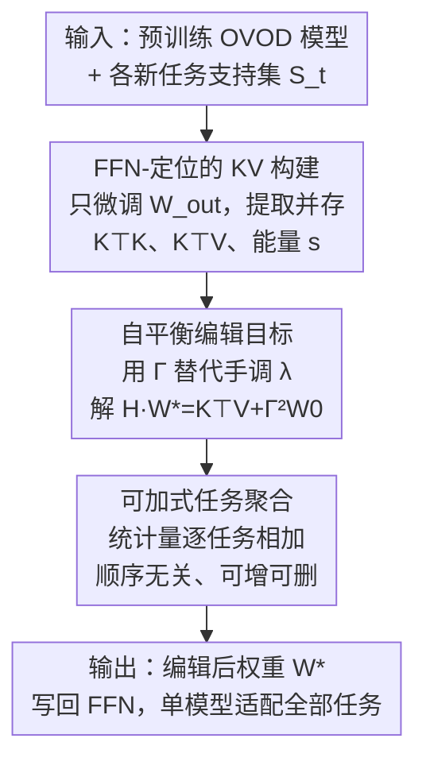

# Retain and Adapt: Auto-Balanced Model Editing for Open-Vocabulary Object Detection under Domain Shifts

**会议**: ICLR 2026  
**OpenReview**: [https://openreview.net/forum?id=4fOGZWupMM](https://openreview.net/forum?id=4fOGZWupMM)  
**代码**: 项目页（论文提及，待确认）  
**领域**: 开放词表目标检测 / 模型编辑 / 持续学习  
**关键词**: 开放词表检测, 模型编辑, 跨域小样本, 自平衡, 顺序无关

## 一句话总结
把「模型编辑」第一次引入开放词表目标检测（OVOD），只微调 FFN 输出投影层并存下紧凑的 KV 协方差统计量，再用一个数据自适应的对角矩阵 $\Gamma$ 替代手调超参 $\lambda$，从而在「保住预训练能力」和「适应新域」之间自动找平衡——在 19 个跨域小样本任务上把新任务适配率（AGR）做到约 95–99%、同时保留约 94–98% 的 COCO 原始能力，且任务可任意顺序增删、无需重训。

## 研究背景与动机

**领域现状**：OVOD（如 Grounding DINO、GLIP）借助视觉-语言预训练，无需穷举标注就能识别大量类别，在分布内 benchmark 上表现很强。但一旦遇到 OOD 分布漂移——图像风格、采集条件、分辨率变化，或出现没见过的域/类别——检测精度会断崖式下跌。要把这类模型持续部署到真实多变环境，就必须能不断吸收新域知识。

**现有痛点**：传统的解法是持续学习（continual learning），按序把新任务并进来并尽量少遗忘。但它有三个硬伤：一是**不显式考虑预训练知识**，只在多个新任务之间平衡，容易把模型本来的强能力磨掉；二是**强依赖固定任务顺序**，对顺序极其敏感，论文实测 SD-LoRA 在 20 个随机任务序下方差很大；三是要**重训**，灵活性和效率都差。另一条路是小样本微调，单个小数据集上能调好，但跨多个域不可扩展，而且经常把基础性能搞坏。

**核心矛盾**：问题的根本在于「Reliability（学进新知识）」和「Locality（保住旧能力）」之间存在 trade-off，而现有方法要么忽略 Locality，要么靠一个需要反复手调、且随模型/任务规模变化的超参 $\lambda$ 去平衡——既低效又不通用。

**本文目标**：设计一种轻量、灵活的知识注入机制，能在不重训、不依赖任务顺序的前提下，自动地在新旧知识间取得平衡，并且存储成本与任务数量无关。

**切入角度**：作者观察到，模型编辑（model editing，原本用于 LLM 注入新事实而不动整模型）天然契合这个场景——它能高效注入新知识同时保留原能力。更关键的一个实验发现是：在 OVOD 小样本下，**只微调 FFN 参数就能逼近全模型微调**（见原文 Table 11），说明 FFN 是知识存放的主要位置，轻量编辑就够用。

**核心 idea**：把 OVOD 的小样本适配重新表述成一个「在 FFN 层做 KV 编辑」的问题，并用**数据本身的统计量**（每行特征能量 $s_i$）构造一个对角正则矩阵 $\Gamma$ 去替代手调的 $\lambda$，让新旧知识的平衡「自动」发生。

## 方法详解

### 整体框架

ABME（Auto-Balanced Model Editing）要做的事，可以概括成「**把每个新任务压缩成一组 KV 统计量，再用一个闭式线性方程把它们融进 FFN 权重**」。整条流程是：对每个新任务，先只微调 FFN 的输出投影矩阵 $W_{out}$ 得到任务适配模型；让支持集再过一遍这个模型，在被编辑的 FFN 层记录输入（key $K$）和输出（value $V$），但**不存完整矩阵**，只累加紧凑的协方差 $K^\top K$、互协方差 $K^\top V$ 和能量统计 $s$（存储与任务数无关）；最后把这些统计量代入一个自平衡目标，解一个对称正定线性系统得到编辑后的权重 $W^\star$，写回模型。由于统计量是**可加的**，多个任务（甚至任意子集）只需把各自的 $K^\top K$、$K^\top V$、$\Gamma^2$ 相加，就能在不重训的情况下任意组合或移除任务。

### 关键设计

**1. FFN 定位的 KV 知识构建：把新任务压成与任务数无关的紧凑统计量**

OVOD 模型很大，逐任务存完整的 key/value 矩阵不现实——视觉骨干里 $K_i, V_i$ 的行数 $n_i$ 会随样本数和 patch 数暴涨。作者借用 LLM 编辑里「FFN 是知识存放点」的认识，把要编辑的参数锁定为 FFN 的输出投影矩阵 $W_{out}\in\mathbb{R}^{d_0\times d_1}$，其输入定义为 key、输出定义为 value。具体分两步：先对任务 $\tau_i$ 把 $W_{out}$ 当唯一可学参数、冻结其余，用标准检测损失 $\min_{\theta_i}\mathcal{L}_{det}(\theta_i; S_i)$ 微调出任务适配模型；再让支持集 $S_i$ 过这个模型，在被编辑层取出 $K_i\in\mathbb{R}^{n_i\times d_0}$、$V_i\in\mathbb{R}^{n_i\times d_1}$。

关键在于**不保留原始矩阵**：作者证明后续优化只需要协方差与互协方差 $K_i^\top K_i$、$K_i^\top V_i$（维度 $d_0\times d_0$、$d_0\times d_1$，与样本数 $n_i$ 解耦），就足以重建求解所需的全部信息。这一步让存储成本从「随任务/样本线性增长」变成「常数级」，是整套方法可扩展的前提。

**2. 自平衡编辑目标：用数据自适应的 $\Gamma$ 抹掉手调超参 $\lambda$**

最朴素的编辑目标是带 $\lambda$ 的岭回归式写法 $\min_W \|KW-V\|_F^2 + \lambda\|W-W_0\|_F^2$：前项让权重吸收新知识、后项把它拉回原始参数 $W_0$ 以保旧能力。但 $\lambda$ 没有解析解，只能启发式地试、再在 query 集和 base 集上验证；更糟的是它**不通用**——换任务设定或换 OVOD 模型都得重调。这正是前面说的「平衡靠手调超参」痛点。

作者的做法是把那个标量 $\lambda$ 换成一个**由数据自己决定的对角矩阵** $\Gamma$，目标改写为

$$\min_W \|KW-V\|_F^2 + \|\Gamma(W-W_0)\|_F^2, \quad \Gamma=\mathrm{diag}\big(s_1^{1/4},\dots,s_d^{1/4}\big),\ s_i=\sum_t k_{ti}^2.$$

直觉上，正则项对 $(W-W_0)$ 第 $i$ 行的平方范数施加的权重是 $\Gamma_{ii}^2=s_i^{1/2}$，而 $s_i$ 恰是第 $i$ 个 key 维度上所有样本特征的能量之和。也就是说：**某个特征维度上新数据越「活跃」（能量越大），就越允许对应权重往新知识偏；反之能量小的维度就保守地贴着原始权重**——平衡因此随数据分布自动发生，不再需要任何人工搜索。

**3. 可加式聚合带来的顺序无关编辑：解一个闭式线性系统，任务可任意增删**

对自平衡目标 $W$ 求导即得线性系统。令 $H:=K^\top K+\Gamma^2$（一般半正定，$\Gamma$ 对角严格为正时正定），唯一最优解为

$$W^\star = H^{-1}\big(K^\top V + \Gamma^2 W_0\big).$$

实现上不显式求逆，而是用数值求解器（如 `torch.linalg.solve`）解 $H W^\star = K^\top V + \Gamma^2 W_0$。更重要的是：求解只依赖聚合统计量，而 $K^\top K=\sum_t K_t^\top K_t$、$K^\top V=\sum_t K_t^\top V_t$、$\Gamma^2=\sum_t \Gamma_t^2$ 全是**逐任务可加**的。这条加法更新规则带来两个直接好处：其一，多任务编辑只是把各任务统计量相加再解一次方程，与喂入顺序完全无关（论文用 20 个随机序验证稳定性）；其二，想加入新任务就加上它的统计量、想移除某任务就减去它，**全程不重训**，天然支持「order-agnostic 的插入/删除」。算法以 batch 方式累加 $A\leftarrow A+K_b^\top K_b$、$B\leftarrow B+K_b^\top V_b$、$s$ 同步累加，最后一次性解出 $W^\star$（原文 Alg. 1）。

### 损失函数 / 训练策略
微调阶段只对 $W_{out}$ 用标准检测损失 $\mathcal{L}_{det}$（Eq. 2），其余参数冻结；编辑阶段不再是「训练」，而是解闭式线性系统得到 $W^\star$。$\Gamma$ 里指数取 $1/4$（即正则权重 $\propto s_i^{1/2}$）是消融选出的设定。整套流程没有需要跨模型/任务重调的超参。

## 实验关键数据

数据集：CDFSOD（6 个跨域小样本检测数据集）+ ODinW-13，共 19 个任务，覆盖显著分布漂移；K-shot 取 $K\in\{1,5,10,30,50\}$。指标用 COCO 风格 AP；另用编辑后模型在 COCO 上的 AP 衡量原能力保留。两个核心比率：**RR（Retention Ratio）** $=\text{AP}^{edited}_{old}/\text{AP}^{original}_{old}$ 衡量旧能力保留；**AGR（Adaptation Gain Ratio）** $=\text{AP}^{edited}_{new}/\text{AP}^{finetuned}_{new}$ 衡量相对全微调的适配水平。验证模型为 Grounding DINO 与 GLIP。

### 主实验

CDFSOD（Table 2，本文主结果，Avg 为 6 数据集均值）：

| Shots | 方法 | Avg(新任务) | COCO | RR | AGR |
|-------|------|------|------|------|------|
| 1-shot | EWC | 20.0 | 57.6 | 96.5% | 90.9% |
| 1-shot | SD-LoRA | 19.8 | 52.5 | 87.9% | 90.0% |
| 1-shot | **Ours** | **21.7** | 57.5 | 96.3% | **98.6%** |
| 5-shot | Adam-NSCL | 29.1 | 57.8 | 96.8% | 73.5% |
| 5-shot | **Ours** | **38.5** | 57.0 | 95.5% | **97.2%** |
| 10-shot | **Ours** | **41.0** | 56.8 | 95.1% | **95.6%** |
| 30-shot | **Ours** | **46.7** | 55.1 | 92.3% | **95.5%** |
| 50-shot | **Ours** | **48.0** | 54.5 | 91.3% | **95.0%** |

可以看到：基础模型在 CDFSOD 上 Avg 只有 17.7（OOD 几乎失效），ABME 把各 shot 的 AGR 稳定拉到约 95–99%，远高于 EWC/Adam-NSCL/SD-LoRA（这些 baseline 的 AGR 多在 60–90%），同时 RR 大体维持在 91–96%。ODinW-13（Table 1）上 1/5/10-shot 的 AGR 分别约 96%/97%/93%，同样压过 baseline。

**灵活性**：全 19 个任务直接按 Eq. 7 把统计量相加合成单一模型（Table 3），AGR 多数 >95%、COCO 上 RR 也 >95%，说明一个编辑后模型即可覆盖全部 19 个数据集而无需重训。

### 消融实验

| 配置 | 关键现象 | 说明 |
|------|---------|------|
| 手调 $\lambda\in\{1,5,10,15,20\}$ | 新任务 mAP 各点均低于 Auto-Balance | 固定 $\lambda$ 即便精挑也打不过自适应 $\Gamma$（Fig. 2a） |
| Auto-Balance（本文） | 新任务 mAP 全程领先，且 COCO 维持竞争力 | 跨任务规模泛化、无需搜参 |
| 任务随机排序 ×20（SD-LoRA） | 误差棒很大 | 传统持续学习对顺序高度敏感（Fig. 2b） |
| 任务随机排序 ×20（Ours） | 性能稳定 | 按 Eq. 7 聚合，与顺序无关 |
| $\Gamma$ 指数 $\alpha$（Table 4） | $\alpha=1/2$ 等设定对比 | 选定数据自适应正则的指数 |
| EWC+Ours / SD-LoRA+Ours（Table 5，10-shot） | EWC Avg 31.9→41.7、AGR 74.4%→97.2%；SD-LoRA Avg 28.4→38.5、AGR 66.2%→89.7% | 可与现有持续学习方法叠加，新任务和 COCO 保留双双提升 |

### 关键发现
- **贡献最大的是自平衡目标**：把手调 $\lambda$ 换成数据自适应 $\Gamma$，不仅省掉搜参，新任务 mAP 还稳定超过任何固定 $\lambda$，这是方法相对朴素编辑的核心增益。
- **顺序无关性来自可加统计量**：传统持续学习随任务序方差巨大，ABME 因为只做统计量相加，结果与顺序无关——这点对真实部署（任务陆续到来）非常实用。
- **正交于现有方法**：作为编辑模块叠在 EWC/SD-LoRA 上能把它们的 AGR 从 60–70% 区间一举拉到 90%+，说明「FFN 编辑」与持续学习的正则/结构思路互补。
- **shot 越多 RR 略降**：50-shot 时 RR 降到约 91%，说明注入越多新知识、对旧能力的挤压越明显，存在可见但温和的 trade-off。

## 亮点与洞察
- **把 LLM 的 KV 编辑迁到检测器**：核心洞察是「OVOD 的 FFN 也是知识存放点、只微调它就接近全微调」，于是把 LLM 里成熟的 locate-then-edit 思路平移过来，开辟了 OVOD 持续扩展的新范式。
- **用数据能量当正则权重**：$\Gamma_{ii}=s_i^{1/4}$ 这个设计很巧——把「该不该更新某个权重维度」交给该维度上新数据的特征能量来决定，等于让正则强度逐维、逐数据自适应，彻底绕开了不可解析的 $\lambda$。
- **存储与任务数解耦**：只存 $d_0\times d_0$、$d_0\times d_1$ 的协方差矩阵，无论来多少任务、多少样本都不涨，这让「无限持续编辑」在工程上可行。
- **可迁移性**：这套「微调子模块→记录 KV→闭式聚合」的范式不限于检测，凡是有 FFN/线性投影、且希望增量注入又少遗忘的视觉模型（分割、VLM 适配）都可能套用。

## 局限与展望
- **只编辑 FFN 输出投影**：知识若不主要存在 FFN，或新域需要改注意力/骨干表示，单点编辑可能不够。
- **依赖每任务先做一次小微调**：构建 KV 前要对 $W_{out}$ 微调，虽轻量但仍非完全免训练；极端在线场景下这步开销值得进一步压缩。
- **高 shot 下 RR 下降**：注入知识越多，旧能力保留越吃力（50-shot RR≈91%），自平衡虽缓解但未消除 trade-off。
- **泛化验证范围**：仅在 Grounding DINO / GLIP 两个 OVOD 模型、检测任务上验证；对更大模型或其他视觉任务的可迁移性还需更多实验。

## 相关工作与启发
- **vs LLM 模型编辑（ROME / AlphaEdit / WISE 等）**：它们在 LLM 上做 locate-then-edit 或零空间约束更新，本文把同一套 KV 框架引入 OVOD，并新增「数据自适应 $\Gamma$」来自动平衡新旧——区别在于编辑对象从语言事实变成检测域知识、平衡方式从经验 trade-off 变成数据驱动。
- **vs 持续学习（EWC / Adam-NSCL / SD-LoRA）**：它们靠正则、零空间或低秩适配抑制遗忘，但忽略显式保留预训练能力、且对任务顺序敏感、需重训；本文用可加统计量做闭式聚合，实现顺序无关、可增删、不重训，并能作为模块叠加增强它们。
- **vs OVOD 小样本微调（ETS / Domain-RAG / CD-ViTO）**：这些方法对单个小数据集有效但任务专用、需反复微调且可能损伤原能力；本文把小样本适配统一成编辑问题，单模型即可覆盖多任务并保住基础域。

## 评分
- 新颖性: ⭐⭐⭐⭐⭐ 首次把模型编辑引入 OVOD，并用数据自适应 $\Gamma$ 取代手调 $\lambda$，切入角度新且自洽
- 实验充分度: ⭐⭐⭐⭐ 19 个跨域任务、两个 OVOD 模型、多 shot + 顺序鲁棒 + 叠加实验都有；但仅限检测、模型种类偏少
- 写作质量: ⭐⭐⭐⭐ 从 LLM 编辑形式化推导到 OVOD，逻辑清晰、公式完整
- 价值: ⭐⭐⭐⭐⭐ 顺序无关、可增删、存储恒定的编辑范式对真实持续部署很有吸引力

<!-- RELATED:START -->

## 相关论文

- [\[ICLR 2026\] OVID: Open-Vocabulary Intrusion Detection](ovid_open-vocabulary_intrusion_detection.md)
- [\[CVPR 2026\] WeDetect: Fast Open-Vocabulary Object Detection as Retrieval](../../CVPR2026/object_detection/wedetect_fast_open-vocabulary_object_detection_as_retrieval.md)
- [\[ECCV 2024\] LaMI-DETR: Open-Vocabulary Detection with Language Model Instruction](../../ECCV2024/object_detection/lami-detr_open-vocabulary_detection_with_language_model_instruction.md)
- [\[ICLR 2026\] DeCo-DETR: Decoupled Cognition DETR for efficient Open-Vocabulary Object Detection](deco-detr_decoupled_cognition_detr_for_efficient_open-vocabulary_object_detectio.md)
- [\[ICLR 2026\] Fantastic Tractor-Dogs and How Not to Find Them With Open-Vocabulary Detectors](fantastic_tractor-dogs_and_how_not_to_find_them_with_open-vocabulary_detectors.md)

<!-- RELATED:END -->
