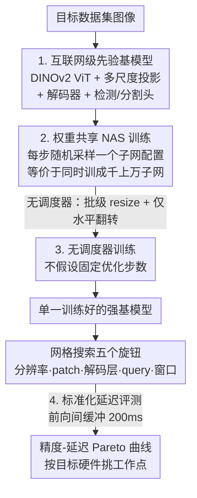

# RF-DETR: Neural Architecture Search for Real-Time Detection Transformers

**会议**: ICLR 2026  
**OpenReview**: [https://openreview.net/forum?id=qHm5GePxTh](https://openreview.net/forum?id=qHm5GePxTh)  
**代码**: https://github.com/roboflow/rf-detr (有)  
**领域**: 目标检测  
**关键词**: 实时检测、DETR、神经架构搜索、权重共享、精度-延迟权衡

## 一句话总结
RF-DETR 用 DINOv2 互联网级预训练 + 端到端权重共享 NAS 训练一个"超网"，让一次训练就能在网格搜索中无需重训地导出整条精度-延迟 Pareto 曲线，在 COCO 上首次让实时检测器突破 60 AP，在真实世界数据集 RF100-VL 上以 20 倍速度反超 GroundingDINO。

## 研究背景与动机

**领域现状**：当前实时目标检测有两条路线。一条是开放词表检测器（GroundingDINO、YOLO-World 这类基于视觉-语言模型 VLM 的方法），靠互联网级图文预训练拿到强零样本泛化；另一条是闭词表"专家"检测器（D-FINE、RT-DETR、LW-DETR），推理快但精度上限受限。

**现有痛点**：VLM 虽然零样本强，但一旦遇到预训练里没见过的分布外类别/模态（比如工业、医学、遥感数据），就需要微调，而微调后既丢了开放词表泛化能力，又因为笨重的文本编码器拖慢推理。反过来，专家检测器虽然快，作者却发现它们**隐式过拟合了 COCO**——为刷 COCO 定制的骨干网、学习率调度器、数据增强调度器，在数据分布差异大的真实数据集上泛化很差（YOLOv8 在 RF100-VL 上几乎不随模型变大而提升）。

**核心矛盾**：精度-延迟之间存在权衡，而且**这个权衡点高度依赖目标硬件和数据集特性**（每图目标数、类别数、数据规模都不同）。传统硬件感知 NAS 能找权衡点，但每换一种硬件就要重新搜索 + 重新训练，代价极高。

**本文目标**：(1) 让专家检测器也吃上互联网级先验，恢复对真实数据的泛化；(2) 不为每个硬件/数据集重训，就能拿到一整条可选工作点的精度-延迟曲线；(3) 顺带把混乱的延迟评测标准统一掉。

**切入角度**：作者借鉴 OFA（Once-For-All）的"权重共享 NAS"思想——训练时在同一套权重里同时优化成千上万个子网，把"训练"和"架构搜索"解耦。关键观察是：图像分辨率、patch 大小这类输入/架构参数可以在训练中随机变动，而解码层数、query token 数这类推理配置可以在推理时直接裁剪，无需微调。

**核心 idea**：把端到端权重共享 NAS 第一次用到检测/分割上——训一个 DINOv2 打底的强基模型，让它的子网都能开箱即用，再用网格搜索在验证集上扫出 Pareto 曲线。

## 方法详解

### 整体框架

RF-DETR 的输入是目标数据集，输出是一整条精度-延迟 Pareto 曲线，使用者按硬件预算在曲线上挑一个工作点直接部署。整个流程分三段：先把 LW-DETR 现代化成一个 DINOv2 打底的强基模型（含检测头 + 轻量分割头）；训练时用"无调度器 + 权重共享 NAS"的方式，每个迭代随机采样一个子网配置做梯度更新，等价于同时训练成千上万个子网；基模型训完后**不再训练**，直接在验证集上网格搜索五个"旋钮"，扫出整条 Pareto 曲线，并用统一的延迟评测协议公平测速。

### 关键设计

**1. 互联网级先验基模型：把专家检测器现代化，吃上 DINOv2 预训练**

针对"专家检测器没有互联网级先验、在真实数据上泛化差"的痛点，RF-DETR 在 LW-DETR 基础上做了三处改造。最关键的是把 LW-DETR 原本的 CAEv2 骨干换成 **DINOv2**：DINOv2 编码器有 12 层（CAEv2 只有 10 层、patch 16），层更多更慢，但在小数据集上检测精度显著更高，慢下来的延迟由后面的 NAS 补回来。结构上，ViT 骨干交错使用**带窗口**和**不带窗口**的注意力块来平衡精度与延迟，骨干输出经多尺度投影器后送入解码器组，解码器每一层都接检测头（box 头 + 类别头）。为了能在消费级 GPU 上靠梯度累积训练，投影器里用 LayerNorm 替代 BatchNorm。作者还加了一个**轻量实例分割头**（RF-DETR-Seg）：它对编码器输出做双线性上采样得到像素嵌入图，再把每个 query token 经 FFN 变换后的嵌入与像素嵌入图做点积生成掩码——这些像素嵌入可看作分割原型（prototype）。和 MaskDINO 不同，它**不引入多尺度骨干特征**以压低延迟，分割头还能复用检测头同一张低分辨率特征图，保证空间对齐。分割模型在 Objects-365 上用 SAM2 伪标注的实例掩码预训练。

**2. 端到端权重共享 NAS：五个旋钮一次训练扫出整条 Pareto 曲线**

这是全文核心，针对"每换硬件/数据集就要重搜重训"的痛点。做法是在**每个训练迭代均匀随机采样一个子网配置**做梯度更新，让同一套权重同时优化成千上万个子网（类似 dropout 的集成学习）。可调的五个"旋钮"是：

- **Patch 大小**：小 patch 精度高但算力大，用 FlexiViT 式插值在训练中在不同 patch 尺寸间平滑过渡；
- **解码层数**：每层解码器都施加回归损失，因此推理时可丢弃任意（甚至全部）解码层；丢光解码器等于把模型退化成单阶段检测器，截断解码器还能同时缩小分割分支；
- **Query token 数**：按编码器输出处每个 token 类别 logit 的最大 sigmoid 值排序，推理时丢掉低分 query 来控制最大检测数和延迟；Pareto 最优的 query 数其实隐式编码了"目标数据集每图平均目标数"这一统计量；
- **图像分辨率**：预分配"最大分辨率 ÷ 最小 patch"对应的位置嵌入，对更小分辨率/更大 patch 做插值；
- **每块窗口数**：增减窗口注意力的窗口数，在精度、全局信息混合与算力间权衡。

关键性质是：**只有当基模型在目标数据集上完全训完后才开始搜索**，因此搜索空间里所有子网都无需再微调就有强性能，把"为新硬件优化"的成本降到一次网格搜索。有趣的是训练中没显式见过的子网也能拿到高精度，说明这套权重共享 NAS 还能泛化到未见架构；而且这种"架构增强"本身在训练中起到了正则化作用。

**3. 无调度器训练：去掉对数据集特性的隐式假设**

针对"为刷 COCO 定制的调度器/增强让模型隐式过拟合"的痛点，RF-DETR 走 scheduler-free 路线。学习率上，它指出 **cosine 调度假设了一个已知固定的优化步数**，这对 RF100-VL 这种数据规模差异巨大的目标数据集并不现实，于是放弃 cosine。数据增强上，激进增强（VerticalFlip、RandomResize、CachedMixUp 等）会引入数据集先验偏置——比如自动驾驶里的行人检测器若用垂直翻转训练，会因水坑倒影产生误检——因此只保留水平翻转和随机裁剪。此外 LW-DETR 的逐图随机 resize 会把每张图 pad 到 batch 内最大尺寸，造成大量 padding、窗口伪影和算力浪费；RF-DETR 改成**批级 resize**，最小化每个 batch 的填充像素，并让所有位置编码分辨率在训练时被等概率见到。

**4. 标准化延迟评测：用前向间缓冲消除功率节流，让测速可复现**

针对"各论文延迟数字互相打架、无法公平比较"的痛点（例如 D-FINE 报的 LW-DETR 延迟比原文快了 25%），作者定位到根因是 **GPU 在连续前向时功率节流/过热**导致测量漂移。解决办法极简：在连续前向之间**缓冲 200ms** 限制功率过载，延迟测量就稳定可复现了（注意这测的是可复现延迟而非持续吞吐）。作者还指出两个评测陷阱：YOLO 测延迟时常省掉 NMS、用 FP16 测速却用 FP32 报精度（而朴素量化可能把精度砸到接近 0 AP），因此主张**精度和延迟必须用同一个模型 artifact 报告**。这套基准工具单独开源。

### 损失函数 / 训练策略
检测沿用 DETR 系的集合匹配损失，且**对每一层解码器输出都施加损失**，这正是推理时能任意丢解码层的前提；分割分支额外加分割损失。相比 LW-DETR，RF-DETR 用更大 batch、更低学习率（保住 DINOv2 预训练知识）、LayerNorm 替代 BatchNorm，并辅以 Objects-365 预训练补偿更慢的优化。在 RF100-VL 这类小数据集上，NAS 挖出的模型可选地再微调（>100 epoch 才能让架构增强正则收敛）；在 COCO 上几乎不需要额外微调。

## 实验关键数据

评测在 COCO 与 RF100-VL（100 个多样真实数据集）上进行，硬件为 NVIDIA T4 + TensorRT 10.4，按延迟分桶（N/S/M/L/XL/2XL）而非参数量分组。

### 主实验

COCO 检测（同延迟桶对比）：

| 桶 | 模型 | 延迟(ms) | AP | 对比 |
|----|------|---------|----|----|
| N | D-FINE | 2.1 | 42.7 | baseline |
| N | LW-DETR | 1.9 | 42.9 | baseline |
| N | **RF-DETR** | 2.3 | **48.0** | 比 D-FINE(N) +5.3 AP |
| M | D-FINE | 5.4 | 55.0 | baseline |
| M | **RF-DETR** | 4.4 | **54.7** | 同级且更快 |
| 2XL | **RF-DETR** | 17.2 | **60.1** | 首个实时检测器破 60 AP |

RF100-VL（100 数据集平均）：RF-DETR(2XL) 反超 GroundingDINO(tiny) 与 LLMDet(tiny) 约 +1.2 AP，而延迟只有它们的零头（GroundingDINO 约 310ms PyTorch，RF-DETR 实时级）。nano 档 RF-DETR(+微调) 达 58.6 AP，与 D-FINE(N) 58.2 相当但泛化更稳。

COCO 实例分割：RF-DETR-Seg(nano) 40.3 AP，超过所有尺寸的 YOLOv8/v11，比 FastInst 高 5.4% 且快近 10 倍；RF-DETR-Seg(medium) 45.3 AP 逼近 MaskDINO(R50) 的 46.3，但延迟从 242ms* 降到 5.9ms。

### 消融实验

| 配置 | 相对 LW-DETR 的 AP 变化 | 说明 |
|------|------------------------|------|
| 更温和超参（大 batch / 低 lr / LN 替 BN） | −1.0% | LN 替 BN 掉点但为消费级硬件必需 |
| 换 DINOv2 骨干（替 CAEv2） | +2% | 互联网级先验是主要增益来源 |
| + 权重共享 NAS（最终模型） | 净 +2% 且不增延迟 | NAS 把骨干变慢的延迟补回来 |

骨干对比：DINOv2 最佳，比 CAEv2 高约 2%；SAM2 的 Hiera-S 虽参数更少却明显更慢（与 Hiera"比同等 ViT 更快"的说法相悖，原因是 Hiera 没在 Flash Attention/TensorRT 高度优化算子下评测延迟）。

### 关键发现
- **DINOv2 预训练是最大单一增益**（+2%），低学习率对保住其预训练知识尤其关键；权重共享 NAS 在不增延迟的前提下再补回 +2%，正好抵消 DINOv2 更深骨干带来的延迟。
- 一次训练即可导出整条**连续** Pareto 曲线——COCO 曲线上所有点来自同一次训练，这是 NAS 解耦训练与搜索的直接红利。
- RT-DETR 在 RF100-VL 的 AP50 上反超建立在它之上的 D-FINE，佐证 **D-FINE 的超参确实过拟合了 COCO**，间接支持了"专家检测器隐式过拟合 COCO"的核心论点。
- 延迟测量在加入 200ms 缓冲后差异巨大（如 LW-DETR(M) 报 5.6ms，缓冲 FP32 下变 26.8ms），说明此前跨论文的延迟对比很多并不公平。

## 亮点与洞察
- **把 OFA 的权重共享 NAS 第一次端到端搬到检测+分割**：以往 NAS 用在检测上多是"换个 NAS 骨干"，本文直接优化端到端检测精度去找 Pareto 前沿，且子网开箱即用、无需重训，这是工程落地价值最大的一点。
- **"每层解码器都监督 → 推理时任意丢层"** 这个设计极其优雅：训练时的密集监督直接换来了推理时的免费可伸缩性，丢光解码器还能平滑退化成单阶段检测器。
- **Pareto 最优 query 数隐式编码数据集统计量**（平均每图目标数），这把"该设多少 query"从手调超参变成了搜索自动发现的产物，可迁移到任何需要设定候选数的检测/分割框架。
- **延迟可复现性这个"脏活"被认真对待**：定位到 GPU 功率节流并用 200ms 缓冲解决，外加"精度与延迟必须同一 artifact"的呼吁，对整个实时检测社区的横向比较都有纠偏价值。

## 局限与展望
- **基模型参数量并不小**（nano 档就有 30.5M 参数 vs D-FINE(N) 3.8M），RF-DETR 的"轻量"主要体现在延迟/GFLOPs 而非参数量，内存受限场景未必占优。
- 权重共享 NAS 的架构增强正则在小数据集上**收敛慢**（RF100-VL 需 >100 epoch 才需可选微调），这部分训练成本本文用"可选微调"带过，但对极小数据集的实际开销值得更细评估。
- 延迟评测协议测的是**可复现延迟而非持续吞吐**，在需要持续高吞吐（如流式视频）的部署里，200ms 缓冲下的数字与真实吞吐有差距。
- 与 VLM 的对比是"微调后闭词表 vs 开放词表"，RF-DETR 放弃了开放词表能力换取速度与精度，对真正需要零样本开放词表的场景并不适用。

## 相关工作与启发
- **vs OFA (Cai et al., 2019)**：OFA 在图像分类上提出权重共享 NAS、分阶段训练且每阶段用不同学习率调度器；本文把它端到端搬到检测/分割，并指出那种分阶段调度器对"模型收敛点"做了强假设、在多样数据集上不成立，因此走无调度器路线。
- **vs LW-DETR (Chen et al., 2024a)**：RF-DETR 直接以 LW-DETR 为底座现代化——换 DINOv2 骨干、批级 resize、LN 替 BN、加 NAS，最终在不增延迟下 +2% AP，并成为首个 COCO 破 60 AP 的实时检测器。
- **vs D-FINE / RT-DETR**：同属实时专家检测器，但本文论证它们隐式过拟合 COCO（D-FINE 在 RF100-VL 上被它所基于的 RT-DETR 反超），RF-DETR 用互联网级先验 + 无调度器训练换来对真实数据分布的泛化。
- **vs GroundingDINO / LLMDet（开放词表 VLM）**：它们靠图文预训练拿零样本泛化但推理极慢且分布外类别需微调；RF-DETR 在 RF100-VL 上以约 1/20 延迟反超微调后的它们，主打"实时速度 + 互联网级先验"的结合。
- **vs MaskDINO / FastInst（实例分割）**：RF-DETR-Seg 不引入多尺度骨干特征、复用检测头特征图来压延迟，在逼近 MaskDINO 精度的同时快数十倍。

## 评分
- 新颖性: ⭐⭐⭐⭐⭐ 首个端到端权重共享 NAS 用于检测+分割，"一次训练扫出整条 Pareto 曲线"是真正的范式增量。
- 实验充分度: ⭐⭐⭐⭐⭐ COCO + RF100-VL（100 数据集）双基准、检测与分割双任务、骨干/NAS/调度器多维消融，外加延迟评测协议。
- 写作质量: ⭐⭐⭐⭐ 动机清晰、设计自洽，五个旋钮讲得很透；部分附录引用缺失（??）略影响完整性。
- 价值: ⭐⭐⭐⭐⭐ 代码开源、工程落地性极强，对实时检测的部署与公平评测都有实际推动。

<!-- RELATED:START -->

## 相关论文

- [\[CVPR 2026\] YOLO-Master: MOE-Accelerated with Specialized Transformers for Enhanced Real-time Detection](../../CVPR2026/object_detection/yolo-master_moe-accelerated_with_specialized_transformers_for_enhanced_real-time.md)
- [\[ICLR 2026\] DeCo-DETR: Decoupled Cognition DETR for efficient Open-Vocabulary Object Detection](deco-detr_decoupled_cognition_detr_for_efficient_open-vocabulary_object_detectio.md)
- [\[CVPR 2026\] YOLO-ULM: Ultra-Lightweight Models for Real-Time Object Detection](../../CVPR2026/object_detection/yolo-ulm_ultra-lightweight_models_for_real-time_object_detection.md)
- [\[CVPR 2025\] Mr. DETR++: Instructive Multi-Route Training for Detection Transformers with MoE](../../CVPR2025/object_detection/mr_detr_instructive_multi-route_training_for_detection_transformers.md)
- [\[ICLR 2026\] DiffuDETR: Rethinking Detection Transformers with Denoising Diffusion Process](diffudetr_rethinking_detection_transformers_with_denoising_diffusion_process.md)

<!-- RELATED:END -->
