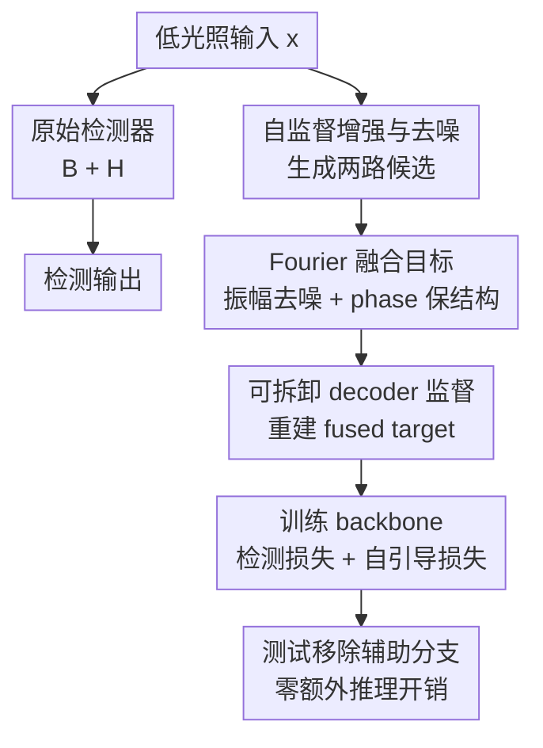

# Self-Guided Low Light Object Detection Framework

**会议**: ICLR 2026  
**OpenReview**: [https://openreview.net/forum?id=MGgAJ8yy2D](https://openreview.net/forum?id=MGgAJ8yy2D)  
**代码**: https://github.com/gw-shin/SGLDet  
**领域**: 目标检测 / 低光照目标检测  
**关键词**: 低光照目标检测, 自引导监督, 图像增强, 图像去噪, Fourier 融合

## 一句话总结

这篇论文提出 SGLDet：训练时给标准检测器挂一个可拆卸的增强-去噪-Fourier 融合辅助分支，用低光照图像自身生成像素级监督来强化 backbone 表征，测试时移除辅助分支，因此在 DARK FACE、ExDark 和 nuImages 夜间检测上显著涨点且不增加推理开销。

## 研究背景与动机

**领域现状**：低光照目标检测的常见路线大致有三类：先用低光照增强模型把图像变亮，再送入检测器；直接改检测器结构，让它更适合暗光场景；或者用白天/正常光域到夜间/低光域的 domain adaptation。它们都在试图解决同一个问题：相机图像在暗光下对比度低、噪声强、边界模糊，检测器 backbone 很难提取稳定的局部结构和语义特征。

**现有痛点**：增强预处理看起来直观，但很多 LLIE 方法是为人眼观感优化的，不一定服务检测。把图像变亮往往也会把噪声一起放大，检测器看到的是“更亮但更脏”的输入。专门为暗光设计的检测器可以带来收益，却通常要在推理阶段增加模块、参数或耗时。去噪模型能压噪声，但强去噪又容易把边缘和小目标细节抹掉，并且推理延迟难以接受。domain adaptation 不增加推理开销，但当源域和目标域差距很大，例如白天驾驶场景迁移到真实夜间场景时，源域偏置会让效果不稳定。

**核心矛盾**：低光照检测真正需要的是“训练时让 backbone 学到更干净、更结构化的暗光表征”，而不是“测试时再额外跑一堆图像处理模块”。但如果只靠检测框监督，信号又很稀疏，尤其在小目标、人脸、夜间驾驶目标上，检测器很难从框级标签里学到足够密集的边界、亮度和噪声模式。

**本文目标**：作者希望把增强和去噪的好处引入检测训练，同时避免两类副作用：一是增强/去噪模块不能留在推理路径里拖慢速度，二是增强只变亮、去噪只平滑都不能单独作为理想监督。方法需要只依赖目标低光照图像本身，不要求成对正常光 ground truth，也不依赖额外源域数据。

**切入角度**：论文的观察是，低光照输入本身可以经过自监督增强和自监督去噪生成一个“更适合作为监督”的目标图像。增强结果更保留结构和语义细节，但噪声也被放大；增强后再去噪的结果噪声更低，但边界可能被平滑。Fourier 域里振幅更偏向亮度、噪声、风格等低层统计， phase 更承载结构与语义，因此可以从二者里分别取所需。

**核心 idea**：用训练期可拆卸的自引导辅助分支，把“增强图像的 phase”和“增强后去噪图像的 amplitude”融合成 dense target，再用重建损失监督检测器 backbone，测试时只保留原始检测器。

## 方法详解

### 整体框架

SGLDet 的输入和输出在测试阶段完全等同于原始检测器：输入低光照图像 $x$，backbone $B$ 提取特征，检测头 $H$ 输出框和类别。新增的部分只在训练阶段存在：低光照图像 $x$ 同时进入一个辅助目标构造管线，先增强得到 $x_E$，再在增强图像上去噪得到 $x_{E+D}$，随后用 Fourier 融合构造监督目标 $\hat{x}$。检测器 backbone 的特征再通过一个可拆卸 decoder $G$ 重建 $\tilde{x}$，用 $\hat{x}$ 对 $\tilde{x}$ 施加像素级自引导损失。

这套流程的关键在于辅助管线不改变检测输入，也不改变测试时的模型结构。训练时，检测损失 $L_{det}$ 负责框级任务，重建损失 $L_{self}$ 给 backbone 补充密集的结构和噪声感知监督；测试时，增强模块、去噪模块、Fourier 融合和 decoder 都被移除，因此参数量、FLOPs 和推理时间与 baseline detector 保持一致。

### 关键设计

**1. 训练期可拆卸自引导分支：把暗光先验变成 backbone 的 dense supervision**

低光照检测的难点不是检测器完全看不到物体，而是框级监督太稀疏，难以告诉 backbone 哪些暗处纹理、边界和噪声模式应该被保留。SGLDet 在训练时把一个 U-Net 风格的 decoder $G$ 接到 backbone 上，并通过 skip connections 接收对应层的特征图，让 backbone 的各层都承担一个附加任务：从检测特征里重建一个更适合低光照检测的目标图像 $\hat{x}$。这样，检测器不只被 bounding boxes 训练，也被像素级目标持续约束，迫使特征对暗光下的边界、人体/车辆轮廓和背景分离更敏感。

这个设计比“推理前先增强图像”更实用。增强、去噪、融合、decoder 都只在训练时出现，测试阶段输入仍是原始低光照图像 $x$，推理图仍是 $B(x) \rightarrow H(B(x))$。因此它获得的是训练带来的表征迁移，而不是测试时额外计算换来的视觉预处理收益。这也是论文在 DARK FACE 和 nuImages 上强调的点：性能提升不伴随额外参数、FLOPs 或延迟。

**2. 自监督增强与去噪：只用目标域低光照图像构造监督候选**

作者没有使用成对正常光图像来训练辅助模块，而是采用可在目标数据集上自监督训练的增强模块 SCI 和去噪模块 SDAP。增强模块 $E$ 的作用是提升亮度和对比度，得到 $x_E = E(x)$；去噪模块 $D$ 作用在增强后的图像上，得到 $x_{E+D} = D(x_E)$。这样做的好处是目标图像估计完全来自当前低光照域，不需要 LOL 这类成对增强数据，也不需要白天源域，因此更贴近真实夜间检测场景。

但这两路候选都不是完美答案。单独增强能把信号变强，也会把暗处噪声放大；增强后去噪能压低噪声，却可能把小目标边缘、脸部轮廓和车道边界附近的结构一起抹平。论文没有简单地在空间域平均两张图，而是把它们当成互补来源：增强图像更适合提供结构，去噪图像更适合提供干净的低层统计。

**3. Fourier 融合目标：用 denoised amplitude 和 enhanced phase 同时保噪声水平与结构细节**

Fourier 变换把单通道图像 $x$ 映射到复数频域 $X(u,v)$，其中振幅 $A(u,v)$ 反映亮度、风格、噪声等低层统计，phase $P(u,v)$ 更强地保留空间结构和语义布局。论文在 RGB 三个通道上分别做 FFT，然后从增强图像 $x_E$ 中取 phase，从增强后去噪图像 $x_{E+D}$ 中取 amplitude，最后通过 inverse FFT 构造融合目标：$\hat{x} = iFFT(A(x_{E+D}) \cdot e^{jP(x_E)})$。

这个融合正好对应暗光检测的两个矛盾需求：检测器需要亮度提升后的边界和语义结构，所以 phase 来自增强图像；检测器又不能被放大的噪声误导，所以 amplitude 来自去噪后的图像。后续 t-SNE 分析也支撑这个解释：融合图像在 HOG 表示上更接近增强图像，说明低层结构被保留；在噪声水平分布上更接近去噪图像，说明噪声被压低。换句话说，$\hat{x}$ 不是为了生成最好看的增强图，而是为了给检测 backbone 一个结构清楚且噪声更温和的训练目标。

**4. 多任务损失平衡：让重建目标辅助检测，而不是盖过检测任务**

SGLDet 的训练目标由检测损失和自引导重建损失共同组成。decoder 从 backbone 特征预测 $\tilde{x}$，与 Fourier fused target $\hat{x}$ 做均方误差：$L_{self}=\|\tilde{x}-\hat{x}\|_2^2$。总损失写作 $L_{total}=L_{det}+\lambda \cdot L_{self}$，其中 $\lambda$ 控制像素级自引导监督的强度。

这个权重不是越大越好。论文在 DARK FACE 上做了敏感性分析：$\lambda=0.01$ 时 mAP 达到 76.6，是最优设置；$\lambda \le 0.001$ 时 dense guidance 太弱，收益有限；$\lambda \ge 0.05$ 时重建目标开始支配训练，检测特征反而被拉向图像重建而不是目标定位，mAP 明显下降。这个结果说明 SGLDet 的定位很清楚：自引导重建是检测训练的辅助信号，不是要把检测 backbone 训练成图像恢复网络。

### 一个完整示例

以夜间驾驶图像为例，输入 $x$ 中一辆车和几个行人处在车灯眩光与暗背景之间。baseline YOLOv8-m 只根据框标签训练，很多中间层只需要最终框附近的稀疏梯度，暗处行人轮廓和背景噪声的差异可能学得不稳定。SGLDet 训练时会先把同一张图送进 SCI，得到更亮的 $x_E$，这一步让行人边缘和车辆轮廓更明显，但路面和暗处区域的噪声也更突出。

接着 SDAP 在 $x_E$ 上去噪，得到 $x_{E+D}$，噪声水平下降，但一些细小边界可能被平滑。Fourier 融合时，系统从 $x_E$ 拿 phase 来保留“行人在哪里、车辆边界怎么走”，从 $x_{E+D}$ 拿 amplitude 来保留更干净的亮度和噪声统计，重建出 $\hat{x}$。decoder $G$ 再要求 backbone 特征能还原这个 fused target。训练结束后，SCI、SDAP、FFT/iFFT 和 decoder 都拿掉，测试时仍只跑 YOLOv8-m；但它的 backbone 已经在训练中学过如何关注低光照场景里更稳定的结构。

### 损失函数 / 训练策略

实现上，增强模块使用 SCI，去噪模块使用 SDAP，二者都在目标数据集上以自监督方式重新训练。辅助 decoder 采用 U-Net decoder 结构，由转置卷积和 double convolution blocks 组成，并通过 skip connections 接收检测 backbone 的多层特征。检测器训练仍使用各 baseline 原本的训练配置，只额外加入 $L_{self}$。

在 DARK FACE 上，baseline 是带 ResNet backbone 的 DSFD，训练 100 epochs，SGD 优化，前 10% epoch warm-up，最大学习率 0.001，并用 cosine one-cycle scheduler；$L_{self}$ 的权重采用 $\lambda=0.01$。在 ExDark 上，baseline 是 YOLOv3-608 / Darknet-53，遵循 MAET 协议，用 COCO 预训练权重微调 25 epochs，学习率 0.001，并在第 18 和 23 个 epoch 衰减。nuImages 夜间实验使用 YOLOv8-m，比较了仅夜间训练和白天预训练后夜间微调两种设置。

## 实验关键数据

### 主实验

| 数据集 / 设置 | Baseline | 本文 | 之前强基线 | 提升 |
|--------|------|------|----------|------|
| DARK FACE / DSFD | 59.7 mAP | 76.6 mAP | DAI-Net 68.5 mAP / Retinexformer 68.1 mAP | +16.9 over baseline，+8.1 over DAI-Net |
| ExDark / YOLOv3-608 | 76.4 mAP | 78.6 mAP | DAI-Net 78.3 mAP / SCI 77.9 mAP | +2.2 over baseline，+0.3 over DAI-Net |
| nuImages Night / YOLOv8-m scratch | 52.4 mAP | 55.3 mAP | SCI 53.5 mAP | +2.9 over baseline，+1.8 over SCI |
| nuImages Day→Night finetune / YOLOv8-m | 56.4 mAP | 58.0 mAP | DAI-Net 54.4 mAP / MAET 53.8 mAP | +1.6 over baseline，+3.6 over DAI-Net |

DARK FACE 的提升最显著，说明训练期 dense supervision 对小而暗的人脸很有效。ExDark 的 baseline 已经较强，且类别更复杂，提升幅度较小但仍超过 LLIE、T2 和 domain adaptation。nuImages 的结果最能体现应用价值：在真实夜间驾驶场景中，本文不仅超过增强/分解方法，还超过依赖白天源域的 domain adaptation，说明它对大 domain gap 更稳。

| 方法类别 | 方法 | DARK FACE mAP | 额外推理代价 |
|------|------|------|------|
| Baseline Detector | DSFD | 59.7 | 无 |
| Self-supervised LLIE | RUAS / Zero-DCE / SCI | 65.5 / 65.7 / 64.3 | 有额外参数、FLOPs、时间 |
| Supervised LLIE | Retinexformer / GLARE | 68.1 / 65.9 | Retinexformer 43.73 ms，GLARE 746.72 ms |
| Domain Adaptation | DAI-Net | 68.5 | 无，但需源域预训练 |
| Self-Guided Framework | Ours | 76.6 | 无 |

这个表说明本文的优势不只是 mAP 高，而是“涨点方式”更干净。LLIE 方法需要在推理阶段额外跑增强网络，GLARE 甚至带来极高延迟；DAI-Net 没有推理开销，但需要 WIDER Face 源域预训练且在跨域很大时不稳；SGLDet 只改变训练过程，部署时成本与 baseline 一致。

### 消融实验

| 配置 | DARK FACE mAP | 说明 |
|------|---------|------|
| DSFD baseline | 59.7 | 只有原始检测损失 |
| 只用增强目标 $E$ | 72.9 | 亮度和对比度改善，收益很大，但噪声被放大 |
| 增强 + 去噪 $E,D$ | 72.2 | 噪声被抑制，但边界细节损失导致略降 |
| 增强 + 去噪 + Fourier fusion | 76.6 | 同时保留结构与较低噪声，是最佳配置 |

| 模块选择 | DARK FACE mAP | 说明 |
|------|---------|------|
| Gamma correction + Gaussian blur | 70.9 | 朴素模块也大幅超过 baseline，说明自引导路径本身有效 |
| Retinexformer + SDAP | 72.5 | 监督增强模型不如目标域自监督增强稳定 |
| Zero-DCE + SDAP | 73.8 | 自监督增强更适合目标域适配 |
| SCI + Median blur | 73.6 | 简单去噪也能提供收益 |
| SCI + Restormer real-noise | 76.0 | 真实噪声假设更匹配暗光数据 |
| SCI + SDAP | 76.6 | 自监督目标域去噪效果最佳 |

| $\lambda$ | DARK FACE mAP | 解释 |
|------|---------|------|
| 0.0001 | 72.5 | 自引导信号过弱 |
| 0.0010 | 74.0 | 有帮助但未充分发挥 |
| 0.0100 | 76.6 | 检测与重建监督较平衡 |
| 0.0500 | 67.3 | 重建任务开始干扰检测特征 |
| 0.1000 | 61.6 | 辅助损失过强，几乎破坏检测优化 |

### 关键发现

- Fourier fusion 是关键增益来源之一：只增强已经能从 59.7 提到 72.9，但加去噪后若不做结构保留反而降到 72.2；融合后达到 76.6，说明“保 phase 结构 + 换 denoised amplitude”比直接使用去噪图像更适合检测监督。
- 自引导路径对模块选择有鲁棒性：即使用 gamma correction 和 Gaussian blur 这种非常简单的组合，也能达到 70.9 mAP，证明收益不是某个强增强器或强去噪器独占，而来自训练期密集监督机制。
- nuImages 上 domain adaptation 反而落后 baseline，MAET 和 DAI-Net 在 Day→Night 设置分别为 53.8 和 54.4，而 baseline 是 56.4，说明白天到夜间驾驶的 domain gap 会让源域迁移策略失效；SGLDet 不依赖源域，达到 58.0。
- 推理速度是本文很重要的实验结论：nuImages scratch 设置下 YOLOv8-m 和本文都是 5.88 ms / 170.1 FPS，而 T2 变成 12.56 ms / 79.6 FPS，Retinexformer 只有 7.3 FPS，GLARE 只有 0.2 FPS。

## 亮点与洞察

- 训练期辅助、测试期移除这个思路很适合实时感知。很多低光照方法把增强器放在输入前面，工程上等于多部署一个模型；SGLDet 把图像恢复能力变成训练信号，部署时仍是原检测器。
- Fourier 融合的使用比较准确地对应了增强和去噪各自的副作用。作者没有把增强图和去噪图做简单拼接或平均，而是利用 amplitude / phase 的语义差异，把“干净的低层统计”和“清楚的结构布局”拆开再组合。
- 论文把低光照增强从“让图更好看”转向“让检测特征更好学”。最终 fused target 不一定是视觉质量最优的图像，但它能作为 dense supervision，帮助 backbone 在暗光噪声里建立更强的 object-background separation。
- 实验覆盖了人脸检测、多类别暗光检测和夜间驾驶三个场景，并且用了 DSFD、YOLOv3、YOLOv8-m 多种检测器，说明方法不是绑定某个 detector head 的小技巧。
- 对实际自动驾驶尤其有启发：如果夜间数据少、白天到夜间差异大，继续堆 domain adaptation 未必稳；直接在夜间目标域上构造自监督训练信号，可能是更低成本的路线。

## 局限与展望

- 辅助分支虽然不增加推理成本，但会增加训练阶段的复杂度。增强模块、去噪模块、Fourier 融合和 decoder 都需要训练或运行，论文主要报告推理成本，对训练成本和训练时间的讨论不够充分。
- 方法依赖 fused target 的质量。如果目标数据集的噪声类型、眩光、运动模糊非常特殊，SCI + SDAP 不一定总是最佳组合；虽然消融显示模块选择较鲁棒，但跨传感器、雨夜、雾夜等复杂退化还需要更多验证。
- Fourier amplitude / phase 的解释是合理的，但真实图像里结构、噪声、风格并不会完全按这两个分量干净分离。对于强眩光、过曝车灯、彩色噪声等情况，phase 是否总能保留可用语义仍有不确定性。
- nuImages 夜间实验只选了 car、pedestrian、traffic cone、barrier 四类，因为其他类别样本不足。这符合数据现实，但也意味着方法在长尾类别、远距离小目标和罕见交通参与者上的效果仍需补充。
- 后续可以探索把自引导目标从图像重建扩展到特征重建，例如让 backbone 对齐 fused image 的中间表征，而不是只用 MSE 重建像素；也可以让 $\lambda$ 按训练阶段或图像噪声水平自适应，而不是固定为 0.01。

## 相关工作与启发

- **vs LLIE 预处理方法**: RUAS、Zero-DCE、SCI、Retinexformer、GLARE 等方法直接改善输入图像，再交给检测器。它们的问题是目标常常偏视觉质量，且测试时增加计算。SGLDet 借用了增强能力，但只把它变成训练期监督目标，不把增强器放入部署图。
- **vs T2 这类专门低光照检测器**: T2 通过 Retinex decomposition 等结构改造服务低光照检测，但会引入额外推理路径。SGLDet 不改测试阶段检测器结构，因此更容易插到 DSFD、YOLOv3、YOLOv8-m 这类已有框架中。
- **vs domain adaptation 方法 MAET / DAI-Net**: 这些方法试图从正常光源域迁移到低光目标域，优势是可以不增加推理开销；但它们依赖源域与目标域的可迁移性。SGLDet 不需要源域，用目标低光照图像自身生成监督，因此在 nuImages 这种 day-night gap 很大的场景里更稳。
- **vs 自监督去噪 AP-BSN / SDAP**: 去噪方法本身追求干净图像，但过强去噪会损伤检测所需边界。SGLDet 把 SDAP 作为目标构造的一部分，再通过 Fourier phase 保住增强图结构，避免把去噪输出直接当最终监督。
- **启发**: 对其他恶劣条件检测也可以借鉴“训练期可拆卸自监督恢复分支”的范式，例如雨雾、运动模糊、压缩噪声或水下检测。关键不是把恢复图像部署到前端，而是设计一个对任务有用、训练时可用、测试时可移除的 dense target。

## 评分

- 新颖性: ⭐⭐⭐⭐☆ 训练期可拆辅助监督本身不是全新范式，但把增强、去噪与 Fourier amplitude/phase 融合用于低光照检测监督，组合得比较精准。
- 实验充分度: ⭐⭐⭐⭐⭐ 覆盖 DARK FACE、ExDark、nuImages 三类场景和多种检测器，并包含组件、模块选择、$\lambda$、速度和特征分析。
- 写作质量: ⭐⭐⭐⭐☆ 方法逻辑清楚，图和消融能支撑主张；不足是训练成本与一些实现细节展开略少。
- 价值: ⭐⭐⭐⭐⭐ 对实时低光照检测很有实际价值，尤其适合不能增加推理延迟、又有目标域夜间数据可训练的部署场景。

<!-- RELATED:START -->

## 相关论文

- [\[AAAI 2026\] LoReTTA: A Low Resource Framework To Poison Continuous Time Dynamic Graphs](../../AAAI2026/object_detection/loretta_a_low_resource_framework_to_poison_continuous_time_dynamic_graphs.md)
- [\[ICLR 2026\] CGSA: Class-Guided Slot-Aware Adaptation for Source-Free Object Detection](cgsa_class-guided_slot-aware_adaptation_for_source-free_object_detection.md)
- [\[ICML 2026\] EARL: Towards a Unified Analysis-Guided Reinforcement Learning Framework for Egocentric Interaction Reasoning and Pixel Grounding](../../ICML2026/object_detection/earl_towards_a_unified_analysis-guided_reinforcement_learning_framework_for_egoc.md)
- [\[ICLR 2026\] Point2RBox-v3: Self-Bootstrapping from Point Annotations via Integrated Pseudo-Label Refinement and Utilization](point2rbox-v3_self-bootstrapping_from_point_annotations_via_integrated_pseudo-la.md)
- [\[CVPR 2026\] EW-DETR: Evolving World Object Detection via Incremental Low-Rank DEtection TRansformer](../../CVPR2026/object_detection/ew-detr_evolving_world_object_detection_via_incremental_low-rank_detection_trans.md)

<!-- RELATED:END -->
