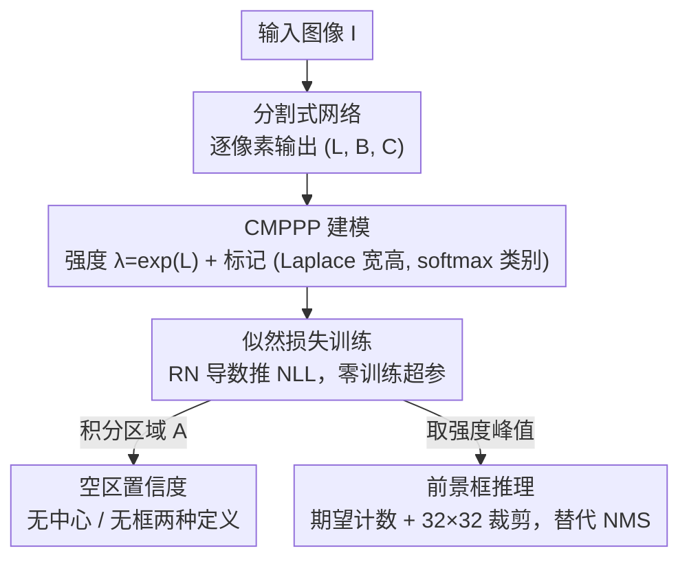

# Towards Reliable Detection of Empty Space: Conditional Marked Point Processes for Object Detection

**会议**: ICLR 2026  
**OpenReview**: [https://openreview.net/forum?id=M2KLWLHzX0](https://openreview.net/forum?id=M2KLWLHzX0)  
**代码**: https://github.com/CMPPP-CV/cmpppnet  
**领域**: 目标检测 / 不确定性估计 / 自动驾驶感知  
**关键词**: 标记点过程, 空间统计, 置信度校准, 空区检测, 似然训练

## 一句话总结
把目标检测重新建模成"标记泊松点过程"（CMPPP）——目标中心是点、宽高与类别是标记，用极大似然端到端训练，从而能对"某个区域是否真的没有障碍物（可通行）"给出有良好校准的概率估计，且检测精度与常规检测器相当。

## 研究背景与动机

**领域现状**：目标检测器（YOLO/FCOS/CenterNet/R-CNN 系）给每个预测框输出一个 objectness/置信度，语义分割给每个像素输出 softmax 概率。这些分数被当作"模型对该预测正确与否的不确定性"来用。

**现有痛点**：这些置信度往往严重失校准（miscalibrated）——架构和损失函数是为了刷精度而设计的（FPN、anchor、one-hot 交叉熵），缺乏概率论根基，模型倾向于过度自信。更关键的是，检测器**只对自己检出的框给置信度，对框以外的区域完全不表态**：它没有任何机制回答"这片没检出目标的区域，是不是真的安全无障碍"。

**核心矛盾**：交叉熵 + 像素/超像素条件独立假设下训练出来的模型，把"没检出目标"默认等同于"该区域安全"。但在自动驾驶/机器人轨迹规划里，真正要回答的是"规划的这条连续轨迹是否无碰撞"，需要对**任意空区域**给出量化、校准的碰撞风险——常规检测器给不出这个。这是安全自动驾驶里一个被忽视的研究空白。

**本文目标**：构造一个有概率论根基的检测模型，既能做检测，又能对"任意测试区域是否为空（可通行）"输出有良好校准的置信度。

**切入角度**：作者注意到，检测的真值数据（一组带尺寸和类别的中心点）天然就是空间统计里**标记点过程**（marked point process）的一次实现——这种模型本来就是用来描述"空间点事件的概率性出现"的（天文、流行病、地统计里都用）。把它搬到检测上，"区域为空"就有了天然的概率定义。

**核心 idea**：用标记泊松点过程对边界框中心建模强度函数（intensity），以负对数似然训练；区域为空 = 该区域内点数为 0 的泊松概率，从而把"空区置信度"变成一个良定义、可计算、可校准的量。

## 方法详解

### 整体框架
方法的目标是：输入一张 RGB 图像 $I$，输出（a）常规的边界框检测，（b）对任意测试区域 $A$ 是否"无目标/可通行"的校准概率。整条链路把检测改写成空间统计问题——用一个语义分割式的网络密集地预测点过程的强度，用从点过程理论推出的似然损失训练，然后既能取峰值得到检测框，又能积分强度得到空区置信度。

具体地，网络对每个像素 $\xi$ 输出一个三元组 $(L_\xi, B_\xi, C_\xi)$（共 $1+2+|C|$ 个通道）：$L$ 经指数化得到中心点强度 $\lambda(\xi)=\exp(L_\xi)$，$B$ 给出框宽高的 Laplace 分布参数，$C$ 给出类别 softmax。训练用 CMPPP 似然损失（由 Radon–Nikodym 导数推导）。推理时不再用 NMS：先由强度积分估计期望目标数，再提取相应数量的峰值；同一套强度积分换个积分区域，就直接得到空区置信度。

### 关键设计

**1. 把检测建成条件标记泊松点过程（CMPPP）：让"区域为空"有概率定义**

常规检测器的根本缺陷是没有概率根基，所以对框外区域无话可说。本文把每个目标实例写成元组 $z=(\xi, m)$，其中 $\xi=(\xi_x,\xi_y)\in[0,1]^2$ 是中心点位置，$m=(h,w,\kappa)$ 是标记（宽高 + 类别）。一张图的真值就是一组标记点 $\{z_1,\dots,z_n\}$，恰好是标记点过程的一次实现。用最简单的泊松点过程（PPP）建模：在标记测度 $\Lambda$ 下，区域 $A_M$ 内出现 $n$ 个实例的概率服从泊松分布 $P(N_M(A_M)=n)=\frac{1}{n!}\Lambda(A_M)^n e^{-\Lambda(A_M)}$。

强度被分解为中心点强度与标记条件分布的乘积：

$$\Lambda(z\mid I) = \lambda(\xi\mid I)\cdot p(m\mid \xi, I),\qquad \lambda(\xi\mid I_d)=\exp(L_\xi(I_d)),\quad p(m\mid\xi,I_d)=p_{w,h}(B_\xi)\cdot p_\kappa(C_\xi).$$

指数参数化保证强度非负；宽高用各向同性的二元 Laplace 分布、类别用 softmax。$L,B,C$ 都由一个像素级输出的网络（直接借用语义分割架构）给出。这样建模的妙处在于：强度是"累积式"的（对区域积分才有意义），像素之间通过点过程损失天然耦合，而不是像 objectness 那样假设超像素条件独立——后者正是失校准的根源。

**2. 用 Radon–Nikodym 导数推出 NLL 损失：似然训练且零训练超参**

点过程活在无穷维的点构型空间 $\Gamma$ 上，没有 Lebesgue 测度，常规的"负对数密度"损失无法直接定义。作者的处理是：以强度恒为 1 的齐次 PPP 分布 $\mu$ 作为参考测度，模型分布 $\mu_\theta$ 关于 $\mu$ 的 Radon–Nikodym 导数仍然存在：

$$\frac{d\mu_\theta}{d\mu}(x)=\exp\Big(-\!\int_{[0,1]^2}(\lambda_\theta(\xi)-1)\,d\xi\Big)\cdot\prod_{l=1}^n\lambda_\theta(\xi_l).$$

由于梯度 $\nabla_\theta \ell$ 不依赖参考测度 $p_\mu$，用负对数 RN 导数训练等价于负对数似然训练。代入分解式取负对数，得到 CMPPP 损失：

$$\ell(x,\theta)=\int_{[0,1]^2}\! e^{L_\xi}\,d\xi-\sum_{i=1}^n L_{\xi_i}-\sum_{i=1}^n\big[\log p_{w,h}(B_{\xi_i})+\log p_\kappa(C_{\xi_i})\big].$$

读出来很有意思：前两项是中心点强度的损失，相当于一个"分布式的 objectness 分数"；Laplace 假设下 $p_{w,h}$ 项正好是边界框回归的标准 L1 损失，$p_\kappa$ 项正好是分类交叉熵。第一项的积分按图像分辨率 $H\times W$ 离散化，每个像素面积 $1/(HW)$。更关键的是，Laplace 的尺度参数 $\sigma$ 不交给网络拟合——先用 L1 训好 $B$，再由极大似然方程闭式求 $\hat\sigma=\frac1n\sum_i\|(w_i,h_i)-B_{\xi_i}\|_1$（即回归的平均绝对偏差）。于是训练**零超参数**，推理只剩一个超参数（见设计 4）。这与现有检测器一堆需要调的损失权重/anchor 形成鲜明对比。

**3. 空区置信度：给出"无目标"的两种良定义概率**

有了训练好的 $(\hat\theta,\hat\sigma)$，就能对任意可测区域 $A$ 回答"是否无目标"。作者区分两种"空"的语义。其一是"$A$ 内无目标中心"，即 $N(A)=0$，由中心点 PPP 的泊松统计直接给出：

$$P_{\hat\theta}(N(A)=0\mid I)=\exp\Big(-\!\int_A\lambda_{\hat\theta}(\xi\mid I)\,d\xi\Big)\approx\exp\Big(-\tfrac{1}{HW}\!\sum_{\xi\in A\cap\Pi}e^{L_\xi}\Big).$$

其二更贴合碰撞需求——"$A$ 不与任何边界框相交"。为此定义临界集 $D_c(A)$：所有其边界框会覆盖到 $A$ 中某点的实例 $z'$ 的集合，于是 $P(N(D_c(A))=0)=\exp(-\int_{D_c(A)}\Lambda)$。当 $A$ 是矩形时，内层关于标记的积分可解析地用宽高 Laplace 分布的累积分布函数 (CDF) 表达出来，从而高效计算。两种定义都给出对**任意测试区域**的校准概率，这正是常规检测器（只对离散的检出框表态）做不到的地方。

**4. 基于计数统计的前景框推理：用期望计数 + 峰值裁剪替代 NMS**

既然有了点过程，检测框的提取也不必再用启发式的非极大抑制 (NMS)。作者用计数统计估计图中期望中心点数 $E[N]=\int_{[0,1]^2}\lambda_{\hat\theta}(\xi)\,d\xi\approx\frac1{HW}\sum_{\xi\in\Pi}\lambda_{\hat\theta}$，然后从强度图里提取这么多个峰值作为预测中心。由于强度峰虽尖锐但仍有一定弥散，每找到一个极大值就裁掉它周围 $32\times32$ 的方形 patch 再找下一个峰——这个裁剪尺寸是整个方法**唯一的推理超参数**（消融见原文附录 A.2，对大范围取值都稳健）。框的宽高与类别由对应位置的 $B,C$ 特征图读出。

### 损失函数 / 训练策略
训练目标即上面的 CMPPP 损失（公式 7），等价于对中心强度的"分布式 objectness" + Laplace 宽高的 L1 回归 + 类别交叉熵之和，端到端极大似然优化。$\sigma$ 不进网络、闭式估计，因此**训练零超参数**。网络直接复用语义分割架构（DeepLabv3+/ResNet-50、FCN/HRNet、SegFormer-B5），在 MMDetection + MMSegmentation 环境中实现，A100 上用各数据集预设参数训练。

## 实验关键数据

### 主实验
在 Cityscapes 上比较"PPP 强度"与"语义分割"两种方法预测可通行区域的校准误差（ECE，越低越好），按测试框面积 $s$ 分档。PPP 方法比语义分割**低一个数量级以上**：

| 架构 | $s$ | 语义分割 ECE$_S$ | 本文 PPP ECE$_P$ |
|------|-----|------------------|-------------------|
| DeepLabv3+ | 1,000 | 0.2245 | **0.0029** |
| HRNet | 1,000 | 0.1443 | **0.0019** |
| SegFormer | 1,000 | 0.0593 | **0.0018** |
| DeepLabv3+ | 2,500 | 0.2667 | **0.0062** |

语义分割模型因为"任一像素提示不可通行则整片概率塌缩"而系统性欠自信；本文方法则在最优校准线附近小幅波动。即便对语义分割做温度缩放等后处理重校准，仍比本文差至少一个数量级——因为像素独立假设的失校准是后处理治不好的。

检测精度（Cityscapes 上 person/vehicle 两类 mAP）：本文与常规检测器相当但不占优，作者明确不声称超越：

| 模型 | mAP | 空区置信度 ECE ($s$=1,000) |
|------|-----|------------------------------|
| 本文 HRNet CMPPP | 55.49% | 小（见消融） |
| 本文 SegFormer CMPPP | 51.04% | 小 |
| 本文 DeepLabv3+ CMPPP | 49.43% | 小 |
| Faster R-CNN | 59.32% | 0.9915 |
| CenterNet | 57.08% | 0.9915 |

常规检测器把超像素 objectness 当 softmax 置信度用，空区置信度 ECE 高达 0.9915——几乎完全失校准，印证了本文的核心论点。

### 消融实验

| 配置 | 关键指标 | 说明 |
|------|---------|------|
| PPP（仅中心点） ECE$_P$ | 0.0029 (Cityscapes DeepLabv3+, $s$=1,000) | 校准最好 |
| CMPPP（含框宽高） ECE$_{BB}$ | 0.0842 (同上, 表 3) | 加入宽高后校准变难、但误差仍可控 |
| 唯一推理超参（32×32 裁剪尺寸） | 大范围稳健 | 附录 A.2 消融，对取值不敏感 |
| 运行时 DeepLabv3+ | 43.6M 参数, 16.2 FPS | 与 Faster R-CNN(41.4M, 29.4 FPS) 同量级 |

三个数据集（Cityscapes 街景、TiROD 室内机器人、VisDrone 无人机航拍）上都验证了空区校准；VisDrone/TiROD 上 PPP 的 ECE$_P$ 同样在 0.00x–0.0x 量级，远好于框级 ECE$_{BB}$。

### 关键发现
- **PPP > CMPPP > 分割/常规检测**的校准排序很清晰：只建中心点（PPP）校准最好；加入宽高标记（CMPPP）让"区域不与框相交"更难校准，ECE 升到 0.08 左右，但仍比 0.99 的常规检测器好一个数量级。
- 跨架构看，SegFormer 的校准持续优于卷积网络（DeepLabv3+/HRNet），作者推测与其高分辨率/无大幅下采样的表示能力有关。
- 失校准残差主要出现在中间置信度区间，作者归因于模型还要分担校准 $N(A)=n$（$n\neq0$）的容量，以及固定 $32\times32$ patch 与大目标的弥散强度冲突。

## 亮点与洞察
- **把"没检出 ≠ 安全"这个被忽视的安全漏洞变成可量化的概率问题**：这是全文最"啊哈"的地方——常规检测只对检出框表态，本文用点过程让"任意区域为空"成为一个良定义、可校准的概率，直接服务于无碰撞轨迹规划。
- **损失函数不是设计出来而是推导出来的**：从 Radon–Nikodym 导数严格推出的 CMPPP 损失，自然地把"分布式 objectness + L1 回归 + 交叉熵"统一在一个似然框架里，反过来解释了现有检测器各损失项的概率含义。
- **零训练超参 + 单推理超参**：$\sigma$ 闭式估计、唯一的 $32\times32$ 裁剪尺寸又对取值稳健，这种"几乎不用调"的特性在检测里很少见，可迁移到任何需要密集强度图的任务。
- 思路可迁移：把"任意区域占用概率"的点过程框架接到 LiDAR/雷达占用栅格、机器人可达性估计上，都能复用这套似然 + 积分得置信度的范式。

## 局限与展望
- **作者承认**：中间置信度区间仍有残余失校准；固定 patch 尺寸与大目标弥散强度冲突，建议用深度相关的自适应 patch 尺寸区分不同尺度目标。
- **建模假设**：模型把目标当作"自由/非相互作用"的点构型，没有引入事件间的排斥势（real 障碍物占据物理空间、彼此不重叠），这与真实场景有偏差。
- **精度不占优**：mAP 落后 Faster R-CNN/CenterNet 约 4–10 个点，作者解释为架构未经多代优化；但这意味着要在安全应用里替换现有检测器仍需补上精度差距。
- **自己发现**：评测的"区域为空"用随机采样固定面积测试框 + ECE，校准结论对测试框尺寸分布有依赖；CMPPP 的 ECE$_{BB}$ 随 $s$ 无明显单调趋势，横向比较各档时需注意这一点。

## 相关工作与启发
- **vs 可通行区域/自由空间检测（drivable area / free space）**: 它们基于语义分割把像素二分为"可通行/背景"，是工程化的设计选择，目标是具体定位无障碍区域；本文相反——不直接分割，而是给**任意测试区域**赋一个良定义的占用置信度，落脚在概率校准而非像素分类。
- **vs CenterNet / FCOS（anchor-free 检测器）**: 同样建模中心点强度图、推理逻辑相似，但 CenterNet 的 "centerness" 概念上更接近 objectness（内建超像素独立假设），对空区占用是失校准的；本文的 intensity 是累积式、密集建模、像素耦合，才得到可校准的空区概率。
- **vs PDQ 概率检测评测（Hall et al. 2020）**: PDQ 用高斯建模框定位不确定性，但与优化目标无关；本文严格推导了"回归损失 ↔ 概率模型"的对应（L1 ↔ Laplace），让框不确定性与训练目标自洽。

## 评分
- 新颖性: ⭐⭐⭐⭐⭐ 首次把空间统计的标记点过程用于深度目标检测，并把"空区置信度"问题形式化，角度新且有理论根基。
- 实验充分度: ⭐⭐⭐⭐ 三数据集 + 三架构验证校准，对比扎实；但精度不占优、缺少更强检测器基线下的校准对照。
- 写作质量: ⭐⭐⭐⭐ 推导严谨、动机清晰；点过程理论部分对非统计背景读者有一定门槛。
- 价值: ⭐⭐⭐⭐⭐ 直击自动驾驶/机器人"无碰撞规划需要校准空区概率"的真实空白，安全意义明确。

<!-- RELATED:START -->

## 相关论文

- [\[CVPR 2026\] AKCMamba-YOLO: Selective State Space Models For Real-Time Object Detection](../../CVPR2026/object_detection/akcmamba-yolo_selective_state_space_models_for_real-time_object_detection.md)
- [\[CVPR 2026\] Foundation Model Priors Enhance Object Focus in Feature Space for Source-Free Object Detection](../../CVPR2026/object_detection/foundation_model_priors_enhance_object_focus_in_feature_space_for_source-free_ob.md)
- [\[CVPR 2026\] Back to Point: Exploring Point-Language Models for Zero-Shot 3D Anomaly Detection](../../CVPR2026/object_detection/back_to_point_exploring_point-language_models_for_zero-shot_3d_anomaly_detection.md)
- [\[CVPR 2025\] PO3AD: Predicting Point Offsets toward Better 3D Point Cloud Anomaly Detection](../../CVPR2025/object_detection/po3ad_predicting_point_offsets_toward_better_3d_point_cloud_anomaly_detection.md)
- [\[ICLR 2026\] Point2RBox-v3: Self-Bootstrapping from Point Annotations via Integrated Pseudo-Label Refinement and Utilization](point2rbox-v3_self-bootstrapping_from_point_annotations_via_integrated_pseudo-la.md)

<!-- RELATED:END -->
