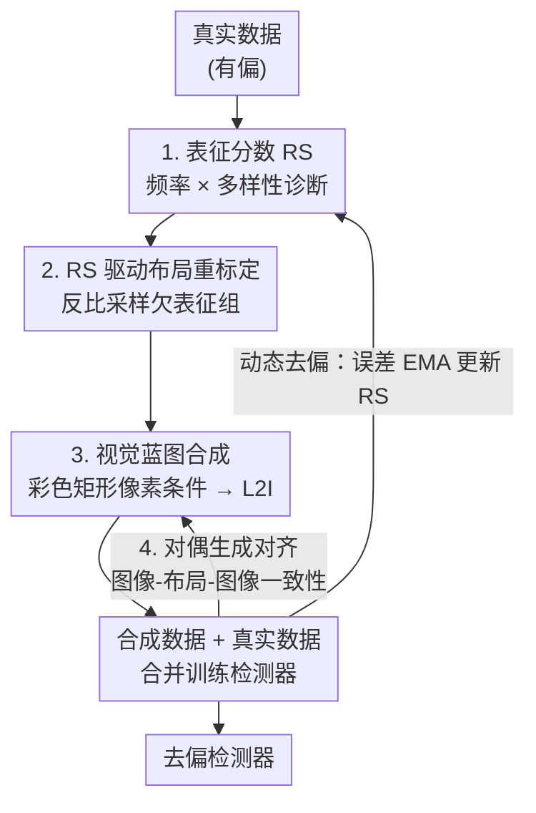

# Unbiased Object Detection Beyond Frequency with Visually Prompted Image Synthesis

**会议**: ICLR 2026  
**OpenReview**: [https://openreview.net/forum?id=SGSF9t9Vq2](https://openreview.net/forum?id=SGSF9t9Vq2)  
**代码**: https://github.com/NUST-Machine-Intelligence-Laboratory/Beyond_Freq  
**领域**: 目标检测 / 数据增强 / 可控扩散生成  
**关键词**: 检测去偏, 布局到图像合成, 表征分数, 视觉蓝图, 生成对齐

## 一句话总结
针对目标检测训练数据的类别/尺寸/位置偏差，本文提出一套"诊断—生成"去偏框架：用超越频率的**表征分数（RS）**找出真正欠表征的数据组，用 RS 重标定布局并以**视觉蓝图**（彩色矩形像素条件）+ **对偶生成对齐**合成高保真样本，把稀有类提升 3.6 mAP、大目标提升 4.4 mAP，合成图布局准确率比此前 L2I SOTA 高 15.9 mAP。

## 研究背景与动机
**领域现状**：目标检测的可靠性受训练数据偏差制约——类别长尾、尺寸偏向中大目标、目标在空间上扎堆于图像中心。传统去偏靠**重采样 / 重加权**，按实例频率调整稀有样本的影响力。近年兴起**基于生成的数据增强**，希望靠扩散模型合成全新样本来补齐数据，主流走的是 layout-to-image（L2I）路线：用训练集里的布局当条件去生成。

**现有痛点**：重采样只能在原数据集的"视觉词表"内打转，能放大稀有样本权重却造不出新的外观和场景；而朴素的 L2I 增强直接复用训练集的布局，**生成过程把它本想消除的偏差又原样保留了下来**。

**核心矛盾**：作者在 §2 用 Faster R-CNN + ResNet-50 做了受控实验，揭示两个更深的问题。其一，**频率是个不完整甚至有误导性的代理**：某些高性能、样本充足的组（如大目标）反而更"数据饥渴"——给它们补数据的收益（Bias-Agnostic Gen +9.8 mAP）比只盯着低频组补（Freq-Aware Gen +8.1 mAP）更大，只看频率会做出次优干预。其二，存在**保真度鸿沟**：在数据分布完全可控、同样有偏的前提下，用真实样本扩充比用合成样本扩充涨点更多，说明当前 L2I 合成图的质量仍不如真实图；而且把 2D 空间排布序列化成 1D 文本 token 会引入歧义，复杂场景里物体关系和遮挡控制不住。

**本文目标**：(1) 找一个比频率更靠谱的诊断工具，定位真正欠表征的数据组；(2) 让 L2I 合成既能精确执行去偏布局，又能产出高保真图像。

**切入角度**：把表征质量拆成"频率 + 多样性"来量化，而不是只数实例个数；同时把布局条件从模糊文本换成像素级的视觉信号，并利用"检测 ↔ 生成"是一对**对偶任务**这一结构来让两者互相校准。

**核心 idea**：用**表征分数 RS** 诊断"超越频率"的表征缺口并据此重标定布局，再用**视觉蓝图 + 对偶生成对齐**把欠表征的样本精确、高保真地合成出来。

## 方法详解

### 整体框架
框架是一条"诊断 → 重标定 → 合成 → 反馈"的闭环管线。输入是有偏的真实数据，输出是去偏后的检测器。具体地：检测器在真实数据上跑出预测，**偏差诊断引擎**结合频率与多样性算出每个数据组的表征分数 RS；**布局规划器**按 RS 反比采样，把种子布局重标定成补齐缺口的新布局；**布局渲染器**把重标定布局转成视觉蓝图（彩色矩形画布），作为像素级条件喂给 L2I 生成器合成图像；合成数据与真实数据合并去训练检测器。整条管线被两个反馈机制约束：**对偶生成对齐**强制"图像-布局-图像"回环的特征一致性，**误差动态去偏**用检测误差以 EMA 持续刷新 RS，让系统始终盯着训练中浮现的新偏差。

### 关键设计

**1. 表征分数 RS：用"频率 × 多样性"取代纯频率来诊断缺口**

针对"频率是不完整代理"这个痛点，RS 不再只数实例个数，而是把一个数据组 $G=(c,s,u)$（类别 $c$、尺寸 $s$、水平位置 $u$，其中连续的 $s,u$ 分别离散成 $K$ 个对数尺寸桶和 $M\times M$ 位置网格）的"被表征得好不好"拆成三块。第一块是样本频率 $D_{freq}(G)=N(G)/N_{all}$；后两块是**表征多样性**：视觉多样性 $D_{vis}(G)$ 是组内实例 ROI 特征的平均两两距离，刻画组内外观变化；上下文多样性 $D_{ctx}(G)$ 统计类别 $c$ 与其他类别的共现程度。三者合成为：

$$RS(G) = D_{freq}(G)\cdot\big(D_{vis}(G) + \beta\cdot D_{ctx}(G)\big)$$

低 RS 的组就是"真正欠表征"的组，被优先送去生成去偏。这样即便是高频组，只要它外观单一、上下文贫乏，也会被识别为需要补充——正好对上 §2 里"大目标频繁但仍数据饥渴"的观察，这是纯频率方法做不到的。

**2. RS 驱动布局重标定 + 误差动态去偏：把缺口翻译成可生成的合理布局，并随训练自适应**

光有 RS 还不够，还得把"缺什么"变成既多样又物理合理的布局——随机乱摆会产生不真实场景。本文从真实图像里取种子布局，再用 RS 引导地扰动它。对种子里属于组 $G=(c,s,u)$ 的物体，把它迁移到新组 $G'=(c,s',u')$，新尺寸-位置按 RS 反比联合采样（耦合而非独立处理，以尊重尺寸与位置的依赖关系）：$\pi(s',u'\mid c)\propto (RS(c,s',u')+\varepsilon)^{-\tau}$，$\tau$ 控制去偏强度。为保住自然的垂直分层（天在上、车在路面），竖直中心只做小幅高斯抖动 $v'=v+\epsilon,\ \epsilon\sim\mathcal{N}(0,\sigma_y^2)$。要补稀有类别时，目标类按"上下文感知 + RS 引导"的策略选：$\pi_c(c'\mid K)\propto(\kappa\cdot\mathbb{1}[c'\in K]+\mathbb{1}[c'\notin K])\cdot(RS(c')+\varepsilon)^{-\tau}$，$\kappa>1$ 鼓励往场景里已有类附近加实例，保证合理性。

由于 RS 是静态算出来的，无法反映"补了新数据后偏差已经变了"，本文加了**误差动态去偏**：训练时检测器在合成图上预测布局 $l_{pred}=D_\Phi(x_{syn})$，以预测布局与重标定布局之间的一致性损失 $L_{layout}$ 作为信号，用动量 $\mu=0.99$ 的 EMA 刷新 RS：

$$RS'(G_i)=\mu\cdot RS(G_i)+(1-\mu)\cdot L_{layout}(i)$$

于是难学的组（误差大）RS 被抬高、持续被关注，系统在整个训练过程里自适应地追着"正在浮现的偏差"走。

**3. 视觉蓝图：用像素空间的彩色矩形替代模糊文本布局**

针对"2D 布局序列化成 1D 文本带来歧义"的痛点，本文把布局 $l$ 渲染成视觉蓝图 $I_{cond}=R(l;P)$——一张把每个框画成彩色矩形的画布，颜色由调色板 $P$ 区分类别。为最大化类别可分性，颜色取 HSV 单位圆上等间距的色相再转 RGB：$p_i=\text{RGB}((i-1)\varphi,S_0,V_0)$，饱和度与明度设为 1。渲染算子 $R$ 还遵循三条原则解决信息丢失：同类不同实例的 HSV 明度按小步长 $\alpha$ 递减以区分个体；物体按框面积降序渲染，避免小目标被大目标完全盖住；背景物体半透明渲染，给模型留下遮挡关系的视觉线索。蓝图随后经一个轻量可训练编码器投成多尺度特征 $u=g_\phi(I_{cond})$，再以零初始化 adapter（类 ControlNet 结构）注入冻结 U-Net：$y_c=F(x;\Theta)+Z_2(F(x+Z_1(u);\Theta_c))$，训练目标为 $L_{visual\,L2I}=\mathbb{E}\lVert\epsilon-\epsilon_\theta(x_t,t,f_\psi(y),u)\rVert_2^2$。相比 ControlNet 用相邻整数表示类别（如 Person 是 $(0,0,0)$、Sheep 是 $(0,0,19)$，类间数值方差极小、易混淆），等距色相给出高方差信号，编码器更容易分辨——这是保真度大涨的关键。

**4. 对偶生成对齐：利用"检测 ↔ 生成"的对偶让两个模型互相校准**

现有框架把 L2I 生成器和检测器当成互相隔离的模块，导致合成图虽然看着合理、却与检测器的特征空间不对齐。本文抓住一个结构：检测器学的是 $D_\Phi:x\to l$，生成器学的是逆映射 $G_\Phi:l\to x$，二者天然构成"图像-布局-图像"回环。据此定义图像对齐损失，惩罚"用检测器预测布局生成"与"用真布局生成"之间的噪声差异：

$$L^{IA}_{image}=\big\lVert\epsilon_\theta(x_t,t,f_\psi(y),u)-\epsilon_\theta(x_t,t,f_\psi(y),u_{pred})\big\rVert_2^2$$

其中 $u_{pred}$ 由检测器输出布局 $l_{pred}$ 构造。检测器最终目标为 $L_{OD}=L_{det}+\lambda L^{IA}_{image}$。这等于在惩罚检测器产出"不足以忠实重建图像"的布局，同时逼它对生成器产出的特征更鲁棒、给出一致预测——把生成质量和检测精度拧成了一股绳。

### 损失函数 / 训练策略
- L2I 生成器：视觉蓝图条件下的去噪损失 $L_{visual\,L2I}$。
- 检测器：常规检测损失 + 对偶图像对齐损失，$L_{OD}=L_{det}+\lambda L^{IA}_{image}$；并以布局一致性损失 $L_{layout}$ 作为动态去偏的 RS 更新信号。
- 关键超参：动态去偏动量 $\mu=0.99$；主干为 Faster R-CNN + ResNet-50；在 MS COCO 与 NuImages 上评测。

## 实验关键数据

### 主实验

合成保真度（MS COCO，512² 分辨率，越高/越低越好）：

| 模型 | FID ↓ | mAP ↑ | AP50 ↑ | AP75 ↑ |
|------|-------|-------|--------|--------|
| ControlNet | 28.14 | 25.2 | 46.7 | 22.7 |
| GeoDiffusion | 18.89 | 30.6 | 41.7 | 35.6 |
| GDCC | 17.15 | 32.6 | 43.6 | 38.0 |
| **本文** | **15.24** | **46.5** | **61.4** | **51.6** |

布局准确率 mAP 比此前 SOTA（GeoDiffusion）高 **15.9**（46.5 vs 30.6），AP50 高 19.7，FID 也更低。

去偏效果（MS COCO，分属性 mAP，baseline 为 Faster R-CNN）：

| 模型 | mAP | outer | rare | large | small |
|------|-----|-------|------|-------|-------|
| Faster R-CNN（baseline） | 37.4 | 28.3 | 43.2 | 48.1 | 21.2 |
| GeoDiffusion（bias-agnostic） | 38.4 | 29.5 | 44.3 | 50.3 | 19.7 |
| GeoDiffusion + Resampling（freq-aware） | 38.5 | 30.0 | 44.5 | 49.9 | 20.0 |
| **本文** | **40.3** | **31.5** | **46.8** | **52.5** | **23.1** |

相对 baseline：稀有类 +3.6、图像边缘 +3.2、大目标 +4.4、小目标 +1.9 mAP；总 mAP 在 MS COCO / NuImages 分别达 40.3 / 40.0，均为新 SOTA。值得注意的是 ControlNet+Resampling 在多数属性上反而掉点（如 mAP −0.5），印证了"只按频率重采样会次优"。

### 消融实验

核心组件逐步叠加（MS COCO，Debiasing 设定）：

| 配置 | mAP | outer | rare | large | small | 说明 |
|------|-----|-------|------|-------|-------|------|
| Baseline（文本布局） | 37.0 | 27.8 | 43.0 | 47.9 | 20.5 | 起点 |
| + 视觉蓝图 | 38.9 | 29.6 | 45.0 | 51.1 | 21.9 | 空间线索保真，涨幅最大 |
| + 生成对齐 | 39.1 | 29.9 | 45.2 | 51.3 | 22.1 | 主要提保真，对检测温和提升 |
| + RS 驱动重标定 | 39.9 | 31.0 | 46.4 | 52.3 | 22.8 | 显著利好欠表征组 |
| + 动态去偏 | 40.3 | 31.5 | 46.8 | 52.5 | 23.1 | 完整模型 |

动态去偏动量 $\mu$ 消融：$\mu=0$（仅用当前 batch 误差）训练不稳、38.6 mAP；$\mu=1$（退化为静态 RS）39.8；$\mu=0.99$ 最佳 40.3——既稳定又能响应偏差变化。

蓝图设计消融（保真度，MS COCO）：文本基线 FID 28.14 / mAP 25.2 → +像素画布 20.15 / 40.8 → +实例区分（明度递减）17.05 / 44.5 → +遮挡感知（降序渲染+半透明背景）15.24 / 46.5，逐项都有增益。

### 关键发现
- **视觉蓝图是涨点主力**：把文本布局换成像素画布单步就让去偏 mAP 从 37.0 提到 38.9、保真 mAP 从 25.2 飙到 40.8，说明"歧义文本 → 无歧义像素条件"是保真度鸿沟的主因。
- **生成对齐主要提保真而非直接提检测**：单独加它检测 mAP 仅 +0.2，符合其"约束图像合成忠实度"的定位。
- **RS 与动态去偏专补欠表征组**：两者叠加让 outer/rare/small 等组的涨幅明显大于总体，验证了"超越频率诊断 + 自适应刷新"的针对性。
- **频率重采样可能反噬**：ControlNet+Resampling 多属性掉点，是"频率不完整代理"论点最直接的反例证据。

## 亮点与洞察
- **把"数据需求"从频率重新定义为表征质量**：RS 用频率 × (视觉 + 上下文多样性) 量化"被表征得好不好"，一句话点破"频繁 ≠ 充分表征"，这个诊断视角可迁移到分类、分割等任何长尾任务的数据筛选。
- **用颜色编码把布局变成高方差视觉信号**：等距 HSV 色相 + 明度递减 + 降序渲染 + 半透明背景，几条朴素的渲染规则就解决了类别歧义、同类实例区分、遮挡关系三个问题，比 ControlNet 的整数掩码可分性高得多，是很实用的工程 trick。
- **对偶任务回环当正则**：检测 ↔ 生成互为逆映射，"图像-布局-图像"一致性损失把两个本来割裂的模型拧到同一特征空间，这种"用逆任务校准正任务"的思路很有启发性。
- **诊断—生成闭环 + EMA 自适应**：静态诊断容易在补数据后失效，用检测误差 EMA 持续刷新 RS 让系统始终追着难点走，是"生成式去偏"区别于一次性增强的关键。

## 局限与展望
- **依赖种子真实布局**：重标定从真实图像布局出发以保证物理合理，意味着完全无真实布局可参考的场景（或全新场景结构）下的扩展性未充分验证。
- **主干较经典**：实验主要在 Faster R-CNN + ResNet-50 上，未见在 DETR 系/更大主干上的结果，去偏增益是否随更强检测器保持仍待观察。
- **额外训练开销**：生成器 + 检测器联合、加上 EMA 与对偶对齐损失，相对纯重采样的计算/显存成本更高，论文未给出明确的效率对比。
- **超参敏感**：去偏强度 $\tau$、上下文权重 $\kappa$、对齐权重 $\lambda$ 等需调，跨数据集迁移时的鲁棒性值得进一步分析。

## 相关工作与启发
- **vs 重采样 / 重加权（Cui et al., Tan et al.）**：传统方法在原数据"视觉词表"内调权重，造不出新外观；本文用生成补齐真正欠表征的组，且诊断超越频率。
- **vs 朴素 L2I 增强（GeoDiffusion, DetDiffusion）**：它们直接复用训练集布局、把偏差原样保留，且文本序列化布局有歧义；本文用 RS 重标定布局 + 视觉蓝图像素条件，既去偏又高保真，布局准确率 +15.9 mAP。
- **vs ControlNet 类可控扩散**：ControlNet 用相邻整数掩码表示类别、类间方差低易混；本文等距色相给高方差信号，FID 与布局精度均更优。
- **vs 混合/擦除式增强（MixUp, CutMix, Random Erasing）**：这些只重组已有视觉模式、多样性受限；本文合成带新外观的全新样本。

## 评分
- 新颖性: ⭐⭐⭐⭐⭐ 把"频率去偏"重构为"表征质量诊断 + 高保真生成"，RS、视觉蓝图、对偶对齐三处都有原创性。
- 实验充分度: ⭐⭐⭐⭐ 两数据集、保真与去偏双设定、组件/动量/蓝图三组消融齐全，但主干与效率维度略单薄。
- 写作质量: ⭐⭐⭐⭐⭐ §2 动机研究先立论再设计，逻辑链清晰，图表支撑到位。
- 价值: ⭐⭐⭐⭐⭐ 对长尾/欠表征检测有直接价值，RS 诊断与视觉蓝图思路可迁移到更广的生成式数据增强场景。

<!-- RELATED:START -->

## 相关论文

- [\[CVPR 2026\] Beyond Semantic Search: Towards Referential Anchoring in Composed Image Retrieval](../../CVPR2026/object_detection/beyond_semantic_search_towards_referential_anchoring_in_composed_image_retrieval.md)
- [\[CVPR 2026\] DyFCLT: Dynamic Frequency-Decoupled Cross-Modal Learning Transformer for Multimodal Tiny Object Detection](../../CVPR2026/object_detection/dyfclt_dynamic_frequency-decoupled_cross-modal_learning_transformer_for_multimod.md)
- [\[AAAI 2026\] Beyond Boundaries: Leveraging Vision Foundation Models for Source-Free Object Detection](../../AAAI2026/object_detection/beyond_boundaries_leveraging_vision_foundation_models_for_so.md)
- [\[AAAI 2026\] PromptMoE: Generalizable Zero-Shot Anomaly Detection via Visually-Guided Prompt Mixing of Experts](../../AAAI2026/object_detection/promptmoe_generalizable_zero-shot_anomaly_detection_via_visually-guided_prompt_m.md)
- [\[CVPR 2026\] Beyond Prompt Degradation: Prototype-Guided Dual-Pool Prompting for Incremental Object Detection](../../CVPR2026/object_detection/beyond_prompt_degradation_prototype-guided_dual-pool_prompting_for_incremental_o.md)

<!-- RELATED:END -->
