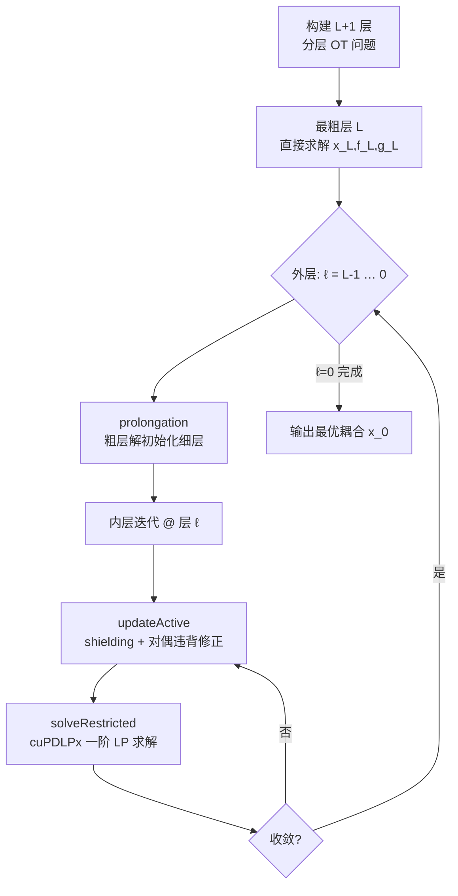

# A Memory-Efficient Hierarchical Algorithm for Large-scale Optimal Transport Problems

**会议**: ICLR 2026  
**OpenReview**: [https://openreview.net/forum?id=CkOBcyntGd](https://openreview.net/forum?id=CkOBcyntGd)  
**代码**: 待确认  
**领域**: optimization  
**关键词**: 最优传输, Wasserstein 距离, 线性规划, 多尺度算法, 内存高效, GPU 并行, PDHG  

## 一句话总结
提出 HALO——一个面向大规模最优传输（OT）问题的多尺度分层求解框架，用"粗到细 warm-start + 活跃支撑集剪枝 + factorization-free 一阶 LP 求解器"把内存压到 $O(n)$，在 $1024^2$ 像素图像上相比最强基线实现 8.9× 提速、70.5% 显存削减，并给出一个尺度无关的迭代复杂度上界。

## 研究背景与动机
**领域现状**：Wasserstein 距离（OT 的 Kantorovich 形式）是衡量两个分布相似度的强力工具，被广泛用于生成建模、颜色迁移、纹理合成、配准、域适应等场景。离散 OT 标准化为一个线性规划：$\min_{x\ge 0} c^\top x,\ \text{s.t.}\ Ax=q$，其中 $x=\mathrm{vec}(X)$ 是耦合矩阵的拉直，约束矩阵 $A\in\mathbb{R}^{(m+n)\times mn}$。

**现有痛点**：这个 LP 有 $mn$ 个变量、$m+n$ 个约束。对两张 $n=r\times r$ 的图像做 OT，变量数随 $n^2$ 增长——当 $r=1024$ 时逼近 $10^{12}$，计算和内存都不可承受。三类已有方法各有短板：（1）**近似法**（Sinkhorn 熵正则、低秩、sliced Wasserstein）牺牲精度换可扩展性；（2）**LP 加速法**（PDHG 及其变体等 factorization-free 一阶法）虽适合 GPU 并行，但在超大规模下仍有严重的内存瓶颈；（3）**多尺度法**（ShortCut、多尺度半光滑 Newton MSSN）实践中能降本，但缺乏迭代复杂度界、且依赖 CPU 端 LP 求解器难以并行。

**核心矛盾**：内存高效、大规模并行、高精度三者很难同时满足——GPU 友好的一阶法吃内存，省内存的多尺度法又卡在 CPU 求解器且没有理论保证。

**本文目标**：设计一个同时具备低内存、强并行、高精度、且带迭代复杂度保证的大规模 OT 求解器。

**核心 idea**：**[分层 + 稀疏]** 同时利用 OT 的两个结构——多尺度金字塔结构（粗层解 warm-start 细层）和最优传输计划的稀疏性（最优解最多 $m+n$ 个非零项），通过"更新活跃支撑集 + 在活跃支撑集上求解受限 LP"的交替迭代，把每层的工作量压缩到稀疏子问题上。

## 方法详解

### 整体框架
HALO 是一个两层循环结构：**外层**沿尺度从最粗第 $L$ 层到最细第 $0$ 层逐级求解 OT，每层用上一粗层的解做 prolongation 初始化（warm-start）；**内层**在固定层上交替执行 `updateActive`（更新活跃支撑集 $N$）和 `solveRestricted`（在 $N$ 上解受限 OT），直到满足收敛准则。两个结构性观察——多尺度的粗到细表征 + 传输计划的稀疏性——共同把计算复杂度与内存需求压下去，使整体内存只需 $O(n)$。

### 关键设计

**1. 粗到细的多尺度层级构建：用几何聚合提供高质量初始化** 内层迭代的效率高度依赖初值质量，HALO 借 OT 的几何来生成这个初值。第 $\ell$ 层的支撑点由第 $\ell-1$ 层邻域分组的代表点构成，边缘分布 $u^{(\ell)},v^{(\ell)}$ 通过聚合各组质量得到，代价 $c^{(\ell)}$ 用代表点间距离定义。在规则网格图像上，层级靠递归合并 $2\times 2$ 像素、以块重心作代表点构建；在点云等非网格场景，则用 2d-树/kd-树做空间划分。粗层解经 prolongation 注入细层后，使每层只需在一个"已经接近最优"的起点上做轻量 refine——这正是后面 $O(1)$ 迭代界成立的实践基础。

**2. 活跃支撑集上的受限 OT：用稀疏性把超大 LP 缩到 $m+n$ 量级** 经典 LP 理论指出最优解 $x^*$ 至多有 $m+n$ 个非零项，因此若已知 $\mathrm{supp}(x^*)$ 就能只在该集合上求解。HALO 把活跃支撑集 $N\subset S\times D$ 作为 $\mathrm{supp}(x^*)$ 的估计，定义受限 OT：$\min_x c_N^\top x_N,\ \text{s.t.}\ A_N x_N=q,\ x_N\ge 0,\ x_{N^\complement}=0$，其中 $A_N,c_N$ 是约束矩阵与代价向量在 $N$ 列上的子块。由于真实支撑未知，算法不一次性求出 $N$，而是交替"按当前解更新 $N$ + 在新 $N$ 上重解受限 OT"，逐步把估计逼近真支撑。这一步把变量规模从 $mn$ 砍到 $O(n)$，是内存削减的根源。

**3. `updateActive`：shielding 几何 + 对偶违背修正的双重支撑集扩张** 活跃支撑集如何更新决定整个内层的效率。HALO 在 ShortCut 的 shielding 机制（用 shielding 条件 $c(s,d)+c(s',d')>c(s,d')+c(s',d)$ 判断 $(s',d')$ 是否"屏蔽" $s$ 到 $d$ 的连接）之上做两项关键改造：（i）**扩张到整个上一轮支撑集**而非只保留上轮耦合的支撑，虽然让估计集变大，却换来尺度无关的迭代复杂度界，保证集合增长不破坏稀疏性；（ii）**对偶违背修正**——求解 pricing 问题 $C=\{(s_i,d_j): f_i+g_j>c_{ij}\}$ 收集违背 KKT 的对，再用 TopK 算子取对偶违背最大的 $K=\beta|S|$ 个加入 $N$。相比 MSSN 依赖阈值参数，TopK 选取能在加速困难实例收敛的同时严格控制集合稀疏。消融显示这一修正在 $r=1024$ 时把最大运行时间压到无修正版的 24.3%。

**4. factorization-free 一阶 LP 求解 + Pock–Chambolle 常步长：把求解器调成 GPU 友好且免范数估计** 受限 OT 由 `solveRestricted` 完成，它主导了计算与内存开销，故求解器选择至关重要。HALO 默认采用 cuPDLPx（PDHG 类一阶法），其主导运算是矩阵-向量乘，天然适配 GPU 并行且无需矩阵分解。论文进一步证明（Proposition 1）：受限 OT 的约束矩阵 $B$ 经 Pock–Chambolle 重缩放 $\tilde B=D_r^{-1}BD_c^{-1}$（$D_r=\mathrm{diag}(\sqrt{r_i},\sqrt{c_j})$、$D_c=\sqrt{2}I$）后满足 $\|\tilde B\|_2=1$。这意味着 PDHG 可以直接用常数步长，免去每轮的范数（幂迭代）估计——消融表明常步长在 $r=1024$ 带来 1.97× 加速。

**理论保证**：在方向覆盖、有界半径、有界密度、一致 Lipschitz、耦合稳定五个假设下，定理 1 给出**尺度无关的迭代复杂度上界**——存在常数 $C$ 使 $x^k$ 对所有 $k\ge C$ 都是全局最优，且 $|N^k|\le C|S|$（活跃支撑集始终保持稀疏）。这与数值观察一致：每尺度平均内层迭代数从不超过 2，且在更细尺度上反而递减。

## 实验关键数据

### 主实验表格（DOTmark 2D 图像，$n=m=r^2$）

对比 HOT、ShortCut、M3S 三个 SOTA 求解器（时间秒/显存 GB/相对 gap）：

| 指标 | 方法 | r=64 | r=128 | r=256 | r=512 | r=1024 |
|---|---|---|---|---|---|---|
| time(s) | **HALO** | 1.50 | 2.20 | 4.31 | **11.17** | **27.73** |
| | HOT | 1.56 | 2.12 | 14.32 | 78.43 | OOM |
| | ShortCut | 0.25 | 2.41 | 25.74 | 438.14 | TO |
| | M3S | 1.95 | 3.44 | 8.51 | 39.32 | 247.22 |
| mem(GB) | **HALO** | 0.38 | 0.48 | 0.76 | **2.07** | **6.25** |
| | HOT | 0.84 | 1.09 | 3.10 | 19.25 | OOM |
| | M3S | 0.71 | 0.95 | 1.92 | 5.78 | 21.21 |
| gap | **HALO** | 1.2e-6 | 1.5e-5 | 1.4e-5 | – | – |
| | HOT | 6.8e-4 | 6.0e-3 | 3.3e-2 | – | – |
| | M3S | 1.9e-4 | 1.9e-4 | 3.3e-4 | – | – |

在 $r=512$ 相比 HOT 提速 7.02×、省 89.2% 显存、gap 紧 2–3 个数量级；相比 ShortCut 在可比 gap 下提速 37.36×。$r=1024$ 相比 M3S 提速 8.92×、省 70.5% 显存、gap 紧 1–2 个数量级。运行时曲线斜率 ≈1（近线性增长）。

### 消融实验表格

**多尺度框架 + cuPDLPx 缺一不可**（时间秒）：

| Multiscale | PDHG | r=32 | r=64 | r=128 | r=256 |
|---|---|---|---|---|---|
| ✓ | ✓ | 0.88 | 1.50 | 2.19 | 4.31 |
| ✓ | ✗(Gurobi) | 0.91 | 2.56 | 27.68 | 159.06 |
| ✗ | ✓ | 2.87 | 128.4 | OOM | OOM |

关掉 cuPDLPx 在 $r=256$ 慢 36.9×；去掉多尺度框架在 $r=64$ 慢 85.6× 且更高分辨率直接 OOM。

**对偶违背修正**（DOTmark 最大运行时间秒）：r=1024 时有修正 154.20 vs 无修正 633.34，最大耗时压到 24.3%。

### 关键发现
- **内层迭代数验证 $O(1)$ 界**：各尺度平均内层迭代数从不超过 2，且在更细尺度递减，实证支持定理 1。
- **运行时与像素稀疏度强相关**：低强度稀疏（ClassicImages 0.01%）收敛快，高稀疏（Shapes 45.3%/Microscopy 42.0%）需 44–56s，可由定理 1 中更大的 Lipschitz 常数 $L$ 解释。
- **3D 点云 ModelNet10 泛化**：Sinkhorn 在 $n=2^{16}$ OOM、HiRef 在 $n=2^{19}$ 失败，而 HALO 扩展到 $n=2^{19}$ 仅用 2.99 GB；$n=2^{18}$ 相比 HiRef 提速 1.84×、省 83.2% 显存、传输代价低 24.9%。

## 亮点与洞察
- **把"理论复杂度界"和"GPU 工程"统一在一个框架里**：多尺度法以往要么有理论没并行（MSSN 依赖 CPU），要么有并行没保证（PDHG 单层）。HALO 用"扩张整个上轮支撑集"这一看似变大的设计换来尺度无关迭代界，又用 factorization-free 求解器保证 GPU 友好，是理论与工程的少见兼得。
- **Pock–Chambolle 重缩放给出 $\|\tilde B\|_2=1$ 是个漂亮的结构利用**：直接消掉了 PDHG 类方法每轮的范数估计开销，把 OT 约束矩阵的特殊结构吃干净。
- **TopK 取代阈值参数**：相比 MSSN 的阈值调参，TopK 对偶违背选取既保稀疏又免去敏感超参，工程鲁棒性更好。

## 局限与展望
- **聚焦平方欧氏代价 + 中等维度**：理论与方法都建立在 squared Euclidean cost 上，对一般代价、超高维场景的适用性未充分验证。
- **定理 1 的假设 4–5（一致 Lipschitz、耦合稳定）较强**：作者承认它们比假设 1–3 强，仅在多尺度 warm-start 下"直觉上合理"，缺乏一般情形的严格刻画。
- **高像素稀疏实例仍偏慢**：Shapes/Microscopy 类因非凸支撑奇异性导致 $L$ 偏大，耗时显著上升，说明对困难几何还有优化空间。
- **依赖特定 GPU 求解器实现**：默认绑定 cuPDLPx，虽附录展示了求解器灵活性，但性能与生态仍受底层求解器演进影响。

## 相关工作与启发
- **近似法**（Sinkhorn 熵正则 Cuturi 2013、低秩 HiRef、sliced Wasserstein）：HALO 不走牺牲精度路线，而是用稀疏受限 LP 在保精度的同时控内存。
- **LP 加速法**（PDHG/cuPDLPx、半光滑 Newton、Douglas–Rachford、Halpern 迭代 HOT）：HALO 复用 factorization-free 一阶法的 GPU 优势，但用活跃支撑集把它从"全规模"降到"稀疏子问题"，解决其内存瓶颈。
- **多尺度法**（ShortCut、MSSN）：HALO 直接站在 ShortCut 的 shielding 机制上，补足其缺失的迭代复杂度界，并把 CPU 求解器换成 GPU 友好的一阶法。
- **启发**：在"近似 vs 精确"的二分之外，"利用解的结构稀疏性 + 多尺度初始化"是把精确求解器扩展到大规模的一条通用路径，值得迁移到其他带稀疏最优解的结构化 LP/凸优化问题。

## 评分
- **新颖性**: ⭐⭐⭐⭐ 把多尺度 warm-start、活跃支撑集剪枝、factorization-free GPU 求解器三者系统整合，并首次为这类多尺度 OT 给出尺度无关迭代复杂度界，组合创新扎实。
- **实验充分度**: ⭐⭐⭐⭐ 2D 图像（到 $1024^2$）+ 3D 点云（到 $2^{19}$）双数据集、对比 5 个 SOTA、含多尺度/求解器/对偶修正/常步长四组消融，且用内层迭代数实证理论，较为完整。
- **写作质量**: ⭐⭐⭐⭐ 框架图清晰、理论与数值呼应紧密、贡献点分明；定理假设较多但作者诚实讨论了其强弱。
- **价值**: ⭐⭐⭐⭐ 大规模 OT 的内存瓶颈是生成建模/配准等下游的真实痛点，$O(n)$ 内存 + 近线性扩展具有实用意义，求解器可替换也利于落地。

<!-- RELATED:START -->

## 相关论文

- [\[ICLR 2026\] A Scalable Constant-Factor Approximation Algorithm for $W_p$ Optimal Transport](a_scalable_constant-factor_approximation_algorithm_for_w_p_optimal_transport.md)
- [\[ICLR 2026\] HOTA: Hamiltonian Framework for Optimal Transport Advection](hota_hamiltonian_framework_for_optimal_transport_advection.md)
- [\[ICLR 2026\] NeuCLIP: Efficient Large-Scale CLIP Training with Neural Normalizer Optimization](neuclip_efficient_large-scale_clip_training_with_neural_normalizer_optimization.md)
- [\[ICLR 2026\] Neural Hamilton–Jacobi Characteristic Flows for Optimal Transport](neural_hamilton--jacobi_characteristic_flows_for_optimal_transport.md)
- [\[CVPR 2026\] HFedATM: Hierarchical Federated Domain Generalization via Optimal Transport and Regularized Mean Aggregation](../../CVPR2026/optimization/hfedatm_hierarchical_federated_domain_generalization_via_optimal_transport_and_r.md)

<!-- RELATED:END -->
