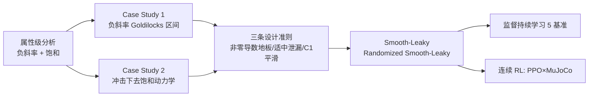

# Activation Function Design Sustains Plasticity in Continual Learning

**会议**: ICLR 2026  
**OpenReview**: [https://openreview.net/forum?id=XZf6wObHX4](https://openreview.net/forum?id=XZf6wObHX4)  
**代码**: [https://github.com/lute47lillo/activations_plasticity](https://github.com/lute47lillo/activations_plasticity)  
**领域**: 持续学习 / 可塑性 / 优化训练动力学  
**关键词**: 可塑性丧失, 激活函数, 持续学习, 死亡神经元, 强化学习  

## 一句话总结
本文把"激活函数"重新定位为缓解持续学习中**可塑性丧失**的首要、与架构无关的杠杆，通过对负半轴斜率与饱和行为的逐属性分析，提炼出三条设计准则，并据此提出两个即插即用非线性 Smooth-Leaky / Randomized Smooth-Leaky，在监督持续分类和非平稳 MuJoCo 强化学习上一致提升后期适应能力。

## 研究背景与动机
**领域现状**：持续学习要求网络在数据分布不断变化时持续吸收新知识。除了广为人知的"灾难性遗忘"（旧任务性能崩塌），还有一个被低估的失效模式——**可塑性丧失（loss of plasticity）**：网络也许还记得旧能力，却逐渐丧失学习新东西的能力。这一现象在强化学习里尤其隐蔽，因为智能体不断变化的策略本身就会改变它遇到的数据分布。

**现有痛点**：以往工作给可塑性丧失列了一长串"症状"——梯度幅度衰减、参数范数膨胀、曲率秩亏、表示多样性下降——但没有任何单一因素能跨场景解释它的成因（Lyle 等人称之为"瑞士奶酪"式的多机制叠加）。对应的缓解手段也各自为政：要么周期性替换低效用神经元（Continual Backprop），要么加针对可塑性的正则项，都要么增加容量、要么需要任务相关调参。

**核心矛盾**：可塑性需要在**稳定性（保留旧知识）**和**可塑性（适应新数据）**之间取得平衡，而真正决定"多少学习信号能穿过反向传播"的第一道闸门——激活函数——长期被当作已经"解决"的设计点。在 i.i.d. 训练里各激活函数差距确实很小，但本文发现：一旦进入持续、非平稳数据，差距会急剧拉开。

**本文目标**：把激活函数当作一个轻量、领域通用、不增加容量也不需任务调参的杠杆，系统刻画"什么形状的非线性能维持可塑性"，并给出可直接替换的实现。

**核心 idea**：**【属性级分析 + 设计准则】** 不是再发明一个炫技激活函数，而是先把激活函数拆成"负半轴响应度"和"饱和行为"两个可量化属性，找出它们与可塑性的因果关系（Goldilocks 区间 + 死亡带宽度），再把准则落地成两个最小改动的 Leaky-ReLU 变体。

## 方法详解

### 整体框架
全文是一条"诊断 → 准则 → 设计 → 验证"的链路：先用统一的 4 层 CNN + Adam + 固定预算，在 i.i.d. 与类增量（C-IL）下对比 11 种激活函数，确立"持续学习才放大差距"这一前提；再用两个 case study 分别隔离**稳态下的负斜率响应度**和**冲击后的去饱和速度**两个机制，提炼三条设计准则；最后据此构造 Smooth-Leaky / Randomized Smooth-Leaky，在 5 个监督持续基准 + 连续 RL（PPO × MuJoCo 4 任务 3 轮循环）上验证。

### 关键设计

**1. 负斜率"Goldilocks 区间"：响应度太小饿死、太大失稳。** 第一项诊断把负半轴当成可扫描的旋钮，对分段线性（Leaky-ReLU、RReLU）、平滑尾（Swish、GeLU、ELU 系）、自适应（PReLU）三族统一投影到**有效斜率** $\bar{s}=\mathbb{E}_{x<0}[\varphi'(x)]$ 这一公共坐标轴上。结论是性能在适中泄漏 $0.6\lesssim\bar{s}\lesssim0.9$ 时稳定见顶，越界即退化，背后是两个对立的失效机制：当 $\bar{s}\to0$ 时进入**死亡神经元区**（约 45% 单元失活，失活率与精度负相关 $r=-0.51$）；当 $\bar{s}\to1$ 时虽然几乎没有死亡单元，却引发**优化不稳定**——主曲率 $\lambda_{\max}$ 和有效秩出现尖峰。因此维持可塑性本质是"既不让梯度饿死、也不让损失面变僵硬"的折中。值得注意的是，无约束的自适应斜率（PReLU 各 scope）会在训练中漂移出这个区间（per-neuron 漂到 0.3–0.6），说明自适应有用但需要约束才能稳定留在带内。

**2. 去饱和动力学与"死亡带宽度"：决定冲击后多快重开梯度。** 仅有非零负斜率还不够——一次分布漂移会把大量预激活推进尾部，让梯度实际归零。第二项诊断每 10 个 epoch 施加一次"缩放冲击"（把预激活整体乘 $\gamma\in\{0.25,0.5,1.5,2.0\}$ 再复原），用三个指标量化恢复：峰值饱和比例、饱和曲线下面积 AUSC、以及恢复到冲击前 95% 性能所需步数 $\tau_{95}$。两条规律浮现：（i）**导数地板规则**——严格非零导数地板的激活（Leaky-ReLU/RReLU/PReLU）AUSC 最低、几乎不会恢复失败（<5%），而零地板（ReLU/Sigmoid/Tanh）大量不可恢复；（ii）**双侧饱和惩罚**——两侧都饱和的 Sigmoid/Tanh 约半数运行无法去饱和。在此基础上作者定义**死亡带宽度** DBW（典型输入区间内 $|\varphi'(x)|<10^{-3}$ 的占比），它与 AUSC（$r=0.81$）和不可恢复率（$r=0.84$）强相关，但与恢复速度无关——即 DBW 预测"会不会、有多严重地饱和"，不预测"恢复多快"。

**3. Smooth-Leaky / Randomized Smooth-Leaky：把三条准则压进最小改动。** 三条准则——(i) 保持严格非零导数地板、(ii) 负半轴响应度落在适中 Goldilocks 区间、(iii) 在前两条满足时优先 $C^1$（原点处一阶连续）平滑过渡——指向同一个家族：保留 Leaky-ReLU 的地板和线性泄漏，只把原点的"折角"换成平滑曲线。Smooth-Leaky 定义为

$$f(x)=\alpha x+(1-\alpha)\,x\,\sigma\!\left(\frac{cx}{p}\right)$$

其中 $\alpha$ 锁定负侧地板、$(p,c)$ 控制过渡区的宽度与陡度，渐近上 $f(x)\approx\alpha x\,(x\ll0)$、$f(x)\approx x\,(x\gg0)$，去掉了 kink 但不改变容量。Randomized 变体把固定 $\alpha$ 换成每次前向从 $[l,u]$ 均匀采样的随机斜率 $r$，推理时取均值 $r_{\text{test}}=(l+u)/2$：

$$f(x)=r x+(1-r)\,x\,\sigma\!\left(\frac{cx}{p}\right),\quad r\sim U(l,u)$$

随机化在保持严格地板和 $C^1$ 过渡的同时，引入对负侧响应度小扰动的鲁棒性——相当于在 Goldilocks 区间附近做轻量探索。作者特别说明：当"恢复成功率（低不可恢复）"和"恢复速度（低 AUSC）"冲突时，优先保证前者（不可恢复一旦发生就主导下游性能），所以选择保留带地板的线性泄漏、只把平滑作为加分项。

## 实验关键数据

### 主实验表格（监督持续学习，5 基准在线任务平均准确率 %，5 次运行）

| 激活 | Permuted MNIST | RandLabel MNIST | RandLabel CIFAR | CIFAR 5+1 | Continual ImageNet |
|---|---|---|---|---|---|
| ReLU | 78.85 | 20.03 | 25.79 | 4.76 | 73.71 |
| Leaky-ReLU | 84.14 | 91.53 | 98.34 | 48.86 | 85.28 |
| RReLU | 83.95 | 93.10 | 98.02 | 53.60 | 84.97 |
| PReLU | 82.62 | 92.67 | 96.86 | 43.30 | 82.37 |
| Swish (SiLU) | 83.41 | 67.73 | 87.40 | 35.31 | 82.64 |
| CReLU | 82.66 | 89.47 | 92.90 | 20.56 | 84.85 |
| Deep Fourier | 83.69 | 92.61 | 96.24 | **72.29** | 76.03 |
| **Smooth-Leaky** | 84.03 | 91.69 | 98.36 | 49.87 | 85.38 |
| **Rand. Smooth-Leaky** | **84.26** | **93.33** | **98.42** | 57.01 | **86.23** |

Rand. Smooth-Leaky 相对次优者（Smooth-Leaky）在多列上达到统计显著（Welch t 检验 $p<0.05$）；ReLU 在难设置（CIFAR 5+1 仅 4.76）上几乎完全丧失可塑性。

### 消融/对照（连续 RL，PPO 单智能体循环 HalfCheetah→Hopper→Walker2d→Ant 共 3 轮 12M 步）

| 指标 | Swish | PReLU | Sigmoid | **Rand. Smooth-Leaky** | Smooth-Leaky |
|---|---|---|---|---|---|
| Plasticity Score (IQM ± 95% CI) | 0.315 ± 0.071 | 0.272 ± 0.038 | 0.333 ± 0.059 | **0.388 ± 0.038** | 0.331 ± 0.037 |

Plasticity Score 采用 Min-Max 归一化 + IQM 聚合各环境的末轮稳态回报（仅展示头部激活）；Rand. Smooth-Leaky 拿下最高分。

### 关键发现
- **i.i.d. 压缩、C-IL 拉开**：Split-CIFAR-100 上各激活 i.i.d. 联合训练差距极小（58.78~73.71），到类增量下急剧分化（20.91~32.95），证明"持续学习才是放大激活差异的舞台"。
- **泄漏家族统治**：可学习/随机负半轴的 Leaky-ReLU/RReLU/PReLU/Smooth-Leaky 系一致碾压 ReLU，尤其在难设置上。
- **可塑性不以泛化为代价**：Rand. Smooth-Leaky 在稳定环境（Ant/Cheetah）拿高 Plasticity Score 的同时，泛化间隙增量 $\Delta\text{GAP}$ 反而更低，说明它倾向于"可迁移"的解而非死记最新数据。

## 亮点与洞察
- **重新定义问题视角**：把"可塑性丧失"从"加正则/换神经元"的工程修补，拉回到"激活函数形状"这个最底层、与架构无关的设计变量，给出了可证伪的属性级解释。
- **两个可量化诊断指标**：有效斜率 $\bar{s}$ 把线性泄漏和平滑尾放到同一坐标轴比较；死亡带宽度 DBW 是纯解析量却能强预测实验中的饱和严重度——这类"可分析、可计算"的代理量对未来设计激活函数很有用。
- **设计准则可迁移**：三条准则（非零地板 / 适中泄漏 / $C^1$ 平滑）不依赖具体任务，监督 CL 和 RL 共享同一套结论，体现"领域通用"承诺。

## 局限与展望
- **多参数与公平性**：Smooth-Leaky 引入 $(\alpha,p,c)$ 三个超参，作者自承在附录讨论了多参数设计与计算预算公平性的权衡，实际调参成本未完全消除。
- **RL 稳定性短板**：Rand. Smooth-Leaky 在 Humanoid 等物理仿真易失稳的环境会拿到零回报（被稳定地板裁剪），说明随机化在高方差动力学下仍有风险。
- **机制非唯一**：全文沿用"瑞士奶酪"多机制观点，激活函数只是其中一个杠杆，并未声称能单独解释全部可塑性丧失；与参数范数膨胀、值目标尺度等机制的交互留待后续。
- **训练性 vs 泛化性**：作者明确区分二者并指出关系尚未定论，当前两指标体系（Plasticity Score + ΔGAP）只是阶段性度量。

## 相关工作与启发
- **可塑性丧失谱系**：Continual Backprop（生成-测试替换低效用单元）、针对可塑性的正则化、CReLU/Rational/Deep Fourier 等替代激活，构成本文对照组；本文论证这些方法多数仍逊于"调好的泄漏家族 + 本文变体"。
- **激活函数研究**：从 Leaky-ReLU/PReLU/RReLU 的负斜率设计，到 Swish/GeLU 的平滑非单调，再到 ELU/CELU/SELU 的指数分支自归一化——本文把它们统一在"负半轴响应度 + 饱和"两轴下重新评估。
- **启发**：对做持续学习/终身学习/连续 RL 的研究者，这篇提示"先把激活函数选对、调进 Goldilocks 区间"可能是比加复杂正则更廉价的起点；DBW 这种解析代理量也启发用可计算指标做架构组件的先验筛选。

## 评分
- **新颖性**: ⭐⭐⭐⭐ 视角转换扎实——把老问题归因到"激活函数形状"并给出 Goldilocks 区间、死亡带宽度等可量化机制；激活函数本身是已有家族的小改动，但分析框架有原创性。
- **实验充分度**: ⭐⭐⭐⭐ 覆盖 i.i.d./C-IL 对照、两个隔离机制的 case study、5 个监督持续基准 + 连续 RL，均有多 seed 与统计显著性检验，证据链完整。
- **写作质量**: ⭐⭐⭐⭐ "诊断→准则→设计→验证"逻辑清晰，公式与相关性数字交代到位；多参数与术语（trainability vs generalizability）部分略密。
- **价值**: ⭐⭐⭐⭐ 即插即用、不增容量、无需任务调参，落地成本极低，对持续学习与连续 RL 社区有直接实用价值。

<!-- RELATED:START -->

## 相关论文

- [\[ICLR 2026\] LCA: Local Classifier Alignment for Continual Learning](lca_local_classifier_alignment_for_continual_learning.md)
- [\[ICLR 2026\] Submodular Function Minimization with Dueling Oracle](submodular_function_minimization_with_dueling_oracle.md)
- [\[ICLR 2026\] FIRE: Frobenius-Isometry Reinitialization for Balancing the Stability–Plasticity Tradeoff](fire_frobenius-isometry_reinitialization_for_balancing_the_stabilityplasticity_t.md)
- [\[ICLR 2026\] Reducing Contextual Stochastic Bilevel Optimization via Structured Function Approximation](reducing_contextual_stochastic_bilevel_optimization_via_structured_function_appr.md)
- [\[ICLR 2026\] Toward Principled Flexible Scaling for Self-Gated Neural Activation](toward_principled_flexible_scaling_for_self-gated_neural_activation.md)

<!-- RELATED:END -->
