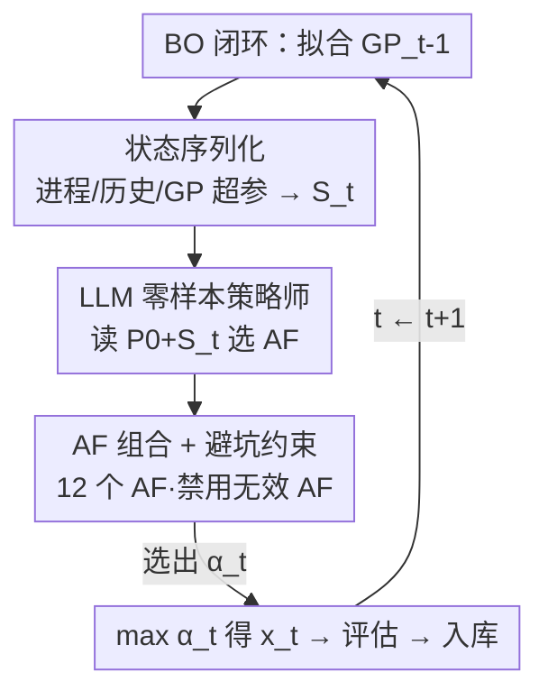

# Adaptive Acquisition Selection for Bayesian Optimization with Large Language Models

**会议**: ICLR2026  
**OpenReview**: [https://openreview.net/forum?id=EPKmSgXvRe](https://openreview.net/forum?id=EPKmSgXvRe)  
**代码**: 待确认  
**领域**: optimization  
**关键词**: 贝叶斯优化, 采集函数选择, 大语言模型, 零样本决策, 状态序列化

## 一句话总结
本文提出 LMABO，把预训练大语言模型当作贝叶斯优化（BO）过程的"零样本在线策略师"——每一轮把优化状态序列化成结构化文本提示，让 LLM 从一个采集函数（AF）组合中挑出当下最合适的那个；在 50 个基准上稳定超过静态、自适应组合与其它 LLM-based 基线。

## 研究背景与动机

**领域现状**：贝叶斯优化用一个代理模型（通常是高斯过程 GP）近似昂贵黑盒目标函数，再用采集函数 $\alpha(x;D_{t-1})$ 在"探索（采未知区）"与"利用（采当前最优附近）"之间权衡，决定下一个评估点。常见 AF 有 EI、LogEI、UCB、TS、PI、KG、MES、PES 等，各有偏好：TS、UCB 偏探索，EI、LogEI 偏利用。

**现有痛点**：一个公认事实是没有任何单一固定 AF 在所有问题上都最优，而且最优策略在一次优化过程内部都会随阶段动态变化。为此学界发展出"自适应组合（adaptive portfolio）"方法，每一轮从一组 AF 里动态选一个。但 GP-Hedge、No-PASt-BO、SETUP-BO 这类方法几乎只依据**过去函数值**算一个奖励信号来加权选择，视野非常窄。

**核心矛盾**：优化状态里其实藏着大量被忽略的关键信息——剩余预算（还能评估几次）、已评估点之间的距离（上一步是偏探索还是偏利用）、GP 超参数（如 lengthscale 反映函数复杂度）。问题在于：要手工设计一个能同时对"战略性、战术性、地形性"这么异构的信息做推理的算法策略，极其困难。

**本文目标**：让 AF 选择能用上完整状态，而又不必手写复杂策略，也不必针对任务做训练。

**切入角度**：现代 LLM 在海量科学文献和代码上预训练，本身就隐式编码了优化原理的丰富知识。与其手写覆盖所有状态的策略，不如直接调用这份预训练知识 + LLM 的推理能力来引导探索-利用平衡。

**核心 idea**：把"AF 选择"重新表述成一个**由预训练 LLM 在上下文中求解的序列决策问题**——每轮把多维优化状态序列化成结构化提示，LLM 读完后选出下一步用哪个 AF。

## 方法详解

### 整体框架

LMABO（Language Model-Assisted adaptive BO）是一个闭环系统：BO 主循环照常跑（拟合 GP、最大化 AF、评估目标、更新数据集），唯一改动是"用哪个 AF"这一步交给 LLM 在线决定。整条流程是：先发一次静态系统提示 $P_0$ 给 LLM 立人设和规则；之后每一轮 $t$，先拟合 $GP_{t-1}$，从它和历史里抽出**状态摘要 $S_t$**，把 $S_t$ 拼到 $P_0$ 后面构成更新提示 $P_t$，LLM 返回当轮 AF $\alpha_t$，再用 $\alpha_t$ 求 $x_t=\arg\max_x \alpha_t(x)$、评估 $y_t=f(x_t)+\eta_t$、把 $(x_t,y_t)$ 并入数据集，进入下一轮。注意 LLM 只当"语义控制器"挑 AF，并不替代 GP 这套严谨的数学骨架。

### 关键设计

**1. 把 AF 选择重写为 LLM 的上下文决策任务：人设 + 动作空间 + 输出格式**

这针对"手写覆盖全状态的策略太难"的痛点。LMABO 不微调任何权重，纯靠 in-context learning：开局发一次静态提示 $P_0$，由四块构成——① **角色扮演指令**，让 LLM 扮演"贝叶斯优化专家"，借此唤起预训练里学到的专家决策模式；② **可用动作**，列出 AF 组合里每个函数的缩写和全名（如 EI、UCB），但**故意不给每个 AF 写描述**，以免引入带偏见的解读，而是依赖 LLM 自己编码的知识，若输出非法则默认回退到 UCB；③ **状态信息 schema**，说明后续每轮会收到的 $S_t$ 各字段含义；④ **输出格式约束**，强制 "采集函数缩写: 理由" 的格式以便可靠解析。$P_0$ 只发一次定调，之后每轮把 $S_t$ 追加上去形成 $P_t$。这套设计的关键在于：它没有把 BO 的数学骨架（GP）交给 LLM，而只把"选哪个 AF"这个高层决策交出去，从而既拿到 LLM 的推理力又不牺牲数值严谨性——这正是它区别于 LLAMBO/LLMP（用 LLM 当数值回归引擎替代代理模型）的地方。

**2. 多维优化状态序列化 $S_t$：把数值状态翻译成 LLM 能读的结构化摘要**

这是全文最核心的设计，针对"已有方法只看历史函数值、视野太窄"的痛点。每轮把高维数值状态压成一段紧凑、人类可读的文本摘要 $S_t$，含三类信号：① **进程状态（Process Status）**——已评估次数 $N$、剩余预算 $N_{rem}$、问题维度 $D$；剩余预算尤其关键，它决定该为长期探索投资还是该短期利用收割。② **性能历史（Performance History）**——当前最优值 $f_{min}$、观测函数值范围、以及**最后一个评估点到所有历史点的最短距离**（用来指示上一步偏探索还是偏利用）。③ **GP 模型特征（GP Model Characteristics）**——拟合后代理模型的关键超参，包括核的 outputscale 和 lengthscale 的统计量（最小/最大/均值/标准差），向 LLM 透露当前对函数地形复杂度的理解。$S_t$ 的设计在"紧凑"和"完整"之间取平衡，让 LLM 无需训练就能利用这些领域信号；消融（Table 2）显示去掉任何一块都会显著掉点，证明这套表示是有效零样本决策的基础。

**3. 多样化 AF 组合 + "避开无效 AF"指令：给决策提供动作池并防止反复踩坑**

LMABO 可选的动作池是 12 个 AF 构成的组合，覆盖从偏探索（TS、UCB、MES、PES）到偏利用（EI、LogEI、PI、PosMean）的不同侧重，这样 LLM 才有空间在不同阶段切换重心。除此之外有一条很重要的提示工程约束：**指示 LLM 避开那些"没能改进当前最优"的 AF**。消融里这一条去掉后掉点最猛——没有它，LLM 会反复选到无效 AF，导致优化性能显著变差。换句话说，光给 LLM 一个动作池还不够，还要用一条简单规则把它从"重复犯错"里拽出来。

### 一个完整示例

设想一个 5 维合成函数，预算 50 轮。开局用 $2D+1=11$ 个点初始化。**早期**（如第 5 轮）：$S_t$ 显示剩余预算充足、最短距离较大、GP lengthscale 偏小（地形复杂），LLM 倾向选 MES/PES 这类信息论 AF 快速降低对全局最优位置的不确定性，同时穿插 EI 响应早期的快速改进。**中期**（如第 25 轮）若进展停滞（$f_{min}$ 几轮不动），LLM 转向更偏探索的 TS 跳出局部最优。**后期**（如第 45 轮）剩余预算所剩无几，LLM 重利用，频繁选 PosMean 做最后一搏去抠改进。整个过程里 LLM 在 EI、LogEI、TS 三者间频繁切换，但这种切换不是随机的——论文证明用"在这三者间随机选"或"EI/TS 交替"去模仿它，都拿不到 LMABO 的稳健表现。

## 实验关键数据

### 主实验

评测在 **50 个问题**上做：30 个来自 COCO/BoTorch 的合成函数 + 20 个来自 Bayesmark 的真实超参优化任务。代理模型用 Matérn 5/2 核 GP，LLM 默认 Gemini-2.5 Flash，每个实验 10 个随机种子。指标用 Simple Regret 曲线下面积（AUC）的相对性能 RP（最优方法记 1.0，其余=自身 AUC/最优 AUC，越低越好）和排名（共 38 个方法参与排名）。

| 类别 | 最佳基线 | LMABO 相对该基线 AUC |
|------|----------|----------------------|
| 静态 AF | EI/LogEI | 低 9.7% |
| 简单元策略 | — | 低 14.8% |
| 自适应组合 | GP-Hedge | 低 16.6% |
| LLM-based | LLAMBO | 低 54.7% |

| 方法 | Mean RP↓ | Mean Rank↓ (Min–Max) | CV |
|------|----------|----------------------|-----|
| EI（静态最强之一） | 1.34 | 13.08 (1–34) | 0.44 |
| GP-Hedge（自适应组合） | 1.45 | 16.96 (1–34) | 0.42 |
| LLAMBO（LLM-based） | 2.67 | 23.74 (1–38) | 0.43 |
| **LMABO** | **1.21** | **5.62 (1–19)** | **0.37** |

LMABO 平均 RP 1.21、平均排名 5.62（最差也只到 19，而静态 AF 最差能掉到 35），变异系数 0.37 表明跨种子高度一致。Friedman 检验 p 值 1.38e-106，post-hoc 配对比较确认 LMABO 与所有方法的差异都显著。成本上，一次 50 轮跑约 6000 tokens（≈$0.01）、每轮 LLM 调用约 1 秒延迟——相对评估昂贵黑盒函数（常需数分钟到数小时一次）可忽略。

### 消融实验

| 配置 | Mean RP↓ | Mean Rank↓ | 说明 |
|------|----------|-----------|------|
| Full LMABO | 1.21 | 5.62 | 完整模型 |
| w/o 剩余预算 | 1.40 | 15.72 | 三个状态分量里最不关键，掉点最小 |
| w/o GP 模型特征 | 1.50 | 20.04 | 明显掉点 |
| w/o 最短距离信息 | 1.50 | 19.76 | 与 GP 特征影响相当 |
| w/o 避开无效 AF 指令 | 1.92 | 28.30 | **掉点最猛**，LLM 会反复选无效 AF |

更换底座 LLM：LMABO-8B（Qwen3-8B）RP 1.48 有可感知下降但仍超所有基线；LMABO-30B 恢复到 1.29；LMABO-120B（gpt-oss-120b）与 GPT-4o mini 都做到 1.21/1.22，与默认版持平，说明效果不绑定特定 LLM，而是受益于强 LLM 的通用推理能力。

### 关键发现

- **去掉"避开无效 AF"指令掉点最猛**：说明光把状态喂给 LLM 还不够，必须一条规则防它重复踩坑；这是性价比最高的 prompt 设计。
- **状态三分量缺一不可**：去掉剩余预算掉点最小（最不关键），GP 特征与最短距离影响相当且更重要——验证了"超越历史函数值的丰富状态"才是相对自适应组合方法的优势来源。
- **行为随阶段自适应**：早期对所有信息敏感、爱用 MES/PES 降不确定性；中期看性能历史和进程状态，停滞时转探索（TS）；末期只盯当前最优值、重利用、PosMean 用得多。这套行为无法被简单启发式（随机/交替）复现。
- **注入任务上下文能防卡死**：在 $P_0$ 里加目标函数描述（如"有很多局部极小"）可作为防停滞的安全阀，在 HolderTable 上让 LMABO 早早绕开陷阱、更快收敛到全局最优。

## 亮点与洞察

- **"语义控制器"范式**：LLM 不替代 GP 数学骨架，只接管"选哪个 AF"这个高层决策——既拿 LLM 推理力又保数值严谨。这条边界划得很巧，是它区别于 LLAMBO/LLMP（拿 LLM 当数值回归引擎）的根本，也解释了为什么 LLM-based 基线反而最差。
- **状态序列化是真正的发动机**：把剩余预算、点间距离、GP lengthscale 这些"老方法看不见"的信号翻译成文本喂给 LLM，消融证明缺一掉点。这套"数值状态→结构化文本"的思路可迁移到任何想让 LLM 做在线控制的场景（如调度、超参调整）。
- **一条 prompt 规则的杠杆效应**："避开没改进的 AF"这条朴素指令带来最大边际收益，提醒做 LLM-agent 时**显式的避错约束**往往比堆信息更有效。
- **零样本、零训练、可换底座**：换成 8B/30B/120B/GPT-4o mini 都能用，工程落地门槛低。

## 局限与展望

- **依赖底座 LLM 质量**：小模型（8B）会可感知掉点，效果与 LLM 推理能力强相关；在算力受限或离线场景下表现会打折。
- **每轮一次 LLM 调用的开销**：虽然相对昂贵黑盒评估可忽略，但若目标函数本身评估很快（cheap function），LLM 调用的延迟和成本就不再划算，方法的适用前提是"评估比 LLM 调用贵得多"。
- **AF 组合是预设的**：动作池固定为 12 个人选 AF，LLM 只能在其中选，不能像 FunBO 那样发现新 AF；组合本身的设计仍依赖人工。
- **状态表示靠人工设计**：$S_t$ 含哪些字段、怎么序列化仍是手工选的（虽经消融验证），换问题域可能需要重新设计字段。
- **可改进方向**：把"注入任务上下文"从手工描述升级为自动检索/生成；或让 LLM 在线扩充 AF 组合，把 FunBO 的"生成新 AF"与本文的"在线选 AF"结合。

## 相关工作与启发

- **vs GP-Hedge / No-PASt-BO / SETUP-BO（自适应组合）**: 它们把 AF 选择当多臂老虎机，只用过去函数值算奖励信号加权选 AF，忽略剩余预算、点间距离、GP 超参；LMABO 把这些"被忽略的状态"全序列化喂给 LLM 做上下文决策，跨异构问题更稳（RP 1.21 vs 1.45+，排名方差更小）。
- **vs ESP（信息论组合）**: ESP 用"对全局最优位置不确定性的预期下降"做前瞻性选择标准，仍只看函数值与不确定性；LMABO 的状态更全面且靠 LLM 推理而非单一标准。
- **vs MetaBO / FSAF（学习型策略）**: 它们把 AF 选择形式化为强化学习、在源任务分布上元学习策略再迁移到目标任务；LMABO 是零样本、无需任何训练或迁移，直接 in-context 决策。
- **vs FunBO**: FunBO 用 LLM 当**离线 AF 生成器**发现新 AF，不参与在线的 AF 选择；LMABO 在线实时适配反馈，二者互补。
- **vs LLAMBO / LLMP（LLM-based BO）**: LLMP 用自然语言先验增强代理模型，LLAMBO 让 LLM 包办初始采样、代理建模、候选点提议——本质把 LLM 当数值回归引擎；LMABO 不动 GP 数学骨架，只把 AF 选择交给 LLM 当语义控制器，结果稳健性远胜（LMABO 比最佳 LLM 基线 AUC 低 54.7%）。

## 评分
- 新颖性: ⭐⭐⭐⭐ "LLM 当 AF 选择的语义控制器"是一个清晰且划得很准的新范式，但属于"换个决策者"的组合式创新
- 实验充分度: ⭐⭐⭐⭐⭐ 50 个问题、38 个方法排名、Friedman + post-hoc 统计检验、状态/指令/底座全方位消融，非常扎实
- 写作质量: ⭐⭐⭐⭐ 动机推导清晰、行为分析有洞察，状态表示和 prompt 设计讲得明白
- 价值: ⭐⭐⭐⭐ 零训练、可换底座、成本可忽略，工程落地门槛低，对自适应 BO 是实用提升

<!-- RELATED:START -->

## 相关论文

- [\[ICLR 2026\] Generative Bayesian Optimization: Generative Models as Acquisition Functions](generative_bayesian_optimization_generative_models_as_acquisition_functions.md)
- [\[ICLR 2026\] Combinatorial Bandit Bayesian Optimization for Tensor Outputs](combinatorial_bandit_bayesian_optimization_for_tensor_outputs.md)
- [\[ICLR 2026\] BoGrape: Bayesian optimization over graphs with shortest-path encoded](bogrape_bayesian_optimization_over_graphs_with_shortest-path_encoded.md)
- [\[ICML 2026\] Towards Understanding Continual Factual Knowledge Acquisition of Language Models: From Theory to Algorithm](../../ICML2026/optimization/towards_understanding_continual_factual_knowledge_acquisition_of_language_models.md)
- [\[ICLR 2026\] COLD-Steer: Steering Large Language Models via In-Context One-step Learning Dynamics](cold-steer_steering_large_language_models_via_in-context_one-step_learning_dynam.md)

<!-- RELATED:END -->
