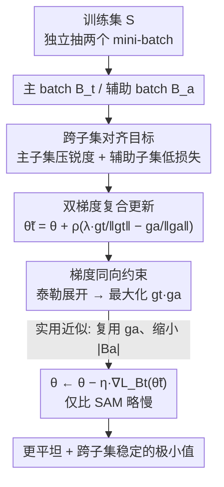

# Align-SAM: Seeking Flatter Minima for Better Cross-Subset Alignment

**会议**: ICLR2026  
**OpenReview**: [https://openreview.net/forum?id=LvllbDxKZt](https://openreview.net/forum?id=LvllbDxKZt)  
**代码**: 待确认  
**领域**: optimization  
**关键词**: 锐度感知最小化, 平坦极小值, 梯度对齐, 泛化, 优化器

## 一句话总结
Align-SAM 把"泛化"重新理解为"同分布两个随机子集上的更新要彼此一致"，在 SAM 寻找平坦极小值的基础上，额外引入一个辅助 mini-batch，让主训练 batch 的梯度与辅助 batch 的梯度变得更"同向"（congruent），从而在分类、噪声标签、小样本迁移、元学习等多种设定下稳定地小幅超过 SAM/ASAM。

## 研究背景与动机
**领域现状**：深度网络泛化好不好，和它收敛到的极小值"宽不宽"高度相关——平坦极小值对训练/测试之间的分布漂移更鲁棒。Sharpness-Aware Minimization（SAM, Foret et al. 2021）是这条路线上最有代表性的方法：它在当前参数 $\theta$ 的 $\rho$-邻域里找一个让损失最大的扰动模型，再去压低这个"最坏点"的损失，等价于同时压低训练损失和锐度，把模型推向平坦区域。后续 ASAM、GSAM、VASSO、LookSAM 等都是在 SAM 框架上做改良。

**现有痛点**：SAM 的理论保证来自 PAC-Bayes，它给的是"在某一个随机训练集 $S$ 上压锐度 → 泛化损失上界变小"。但这个视角只盯着**单个**子集的几何形状，没有显式利用"同一个分布可以反复重采样出不同子集"这件事——而泛化的本质恰恰是：模型在 $S$ 上学到的东西，换一个独立采样的子集 $S_a$ 还得照样管用。

**核心矛盾**：SAM 保证"在 $S$ 上平坦"，却不保证"在 $S$ 上的更新方向和 $S_a$ 上的更新方向一致"。如果两个同分布子集给出的梯度互相打架，模型即使落在平坦区，也可能对重采样敏感、对分布漂移脆弱。

**本文目标**：(1) 在理论上把泛化损失上界从"单子集锐度"扩展到"主子集锐度 + 辅助子集低损失"；(2) 设计一个实际可跑的优化器，让每一步更新既压主子集的锐度，又让主/辅子集的梯度变得同向。

**切入角度**：作者把泛化重新定义成"跨子集对齐"（cross-subset alignment）——一个模型如果主要在随机子集 $S$ 上优化，却同时在独立采样的辅助子集 $S_a$ 上也保持低损失，就说明它对"同分布的重采样"稳定，这正是好泛化的体现。

**核心 idea**：在 SAM 的"压锐度"之外，再加一个辅助 batch，并通过一步精心设计的复合更新，让"主 batch 梯度 · 辅助 batch 梯度"这个点积变大——即把两个梯度往同一方向掰，用梯度对齐来增强泛化。

## 方法详解

### 整体框架
Align-SAM 是一个**即插即用的优化器**，每个训练 step 从训练集里独立抽**两个** mini-batch：主 batch $B_t$ 和辅助 batch $B_a$（$B_a$ 通常比 $B_t$ 小很多以省算力）。它先用辅助 batch 的梯度构造一个扰动方向，把它和 SAM 风格的主 batch 上升方向**组合**成一个复合扰动点 $\tilde\theta^t$，再在这个点上算主 batch 的梯度来更新参数。关键在于：这一步复合更新经泰勒展开后，等价于同时在做三件事——压低主 batch 损失、压低主 batch 梯度范数（锐度项，和 SAM 一致）、以及**最大化主/辅两个梯度的点积**（这是 Align-SAM 独有的对齐项）。

理论支撑是 Theorem 1：在与 SAM 类似的条件下，对任意在主子集上达到最优的模型 $\theta^*$，其真实泛化损失 $L_D(\theta^*)$ 以高概率被 $L_D(\theta^*\mid S_a):=\max_{\|\theta'-\theta^*\|\le\rho}L_{S_a}(\theta')$（辅助子集上的锐度上界）加一个 $O(1/\sqrt{N_a})$ 的项控住。于是原问题被改写成一个**双层目标**（公式 3）：在所有最小化主子集锐度上界 $L_D(\theta\mid S_t)$ 的解里，再挑出辅助子集锐度上界 $L_D(\theta\mid S_a)$ 最小的那个。

### 关键设计

**1. 跨子集对齐视角与辅助子集上界：把"泛化"形式化成两个同分布子集的一致性**

SAM 的 PAC-Bayes 上界只看一个训练子集 $S$ 的锐度，作者认为这漏掉了"重采样稳定性"。他们引入一个独立采样的辅助子集 $S_a\sim D^{N_a}$，并证明 Theorem 1：对任意最小化主子集上界的 $\theta^*$，

$$L_D(\theta^*)\le L_D(\theta^*\mid S_a)+\frac{8L}{\sqrt{N_a}}\sqrt{\log\frac{N_a+k}{\delta}}+\dots$$

其中 $L_D(\theta\mid S):=\max_{\|\theta'-\theta\|\le\rho}L_S(\theta')$ 是 $S$ 上的锐度（最坏邻域损失），$k$ 是参数维度，$L$ 是损失上界。这把 SAM 在 0-1 损失上的 Theorem 1 推广到了任意有界损失，并第一次把**辅助子集**写进了上界。直观含义是：一个真正泛化好的模型，不仅要在自己训练的子集上平坦，还要在另一个独立抽的子集上保持低（最坏邻域）损失——这就是"跨子集对齐"。由此把目标写成双层问题（公式 3）：先求一批让主子集锐度上界最小的解，再在其中选辅助子集上界也最小的那个。

**2. 双梯度复合更新：用一步更新同时压锐度并掰直两个梯度**

直接套 MAML 式双层优化会把辅助集当成验证集、且需要显式的训练/验证划分，与作者"每一步对齐两个随机子集"的目标不符。作者改用随机优化把目标 (3) 转成迭代更新。在第 $l$ 步，定义辅助扰动 $\tilde\theta^a_l=\theta_l+\eta_2\nabla L_{B_a}(\theta_l)$，再构造主扰动点

$$\tilde\theta^t_l=\theta_l+\eta_1\nabla L_{B_t}(\theta_l)-\eta_2\nabla L_{B_a}(\tilde\theta^a_l),\qquad \theta_{l+1}=\theta_l-\eta\,\nabla L_{B_t}(\tilde\theta^t_l).$$

对 $L_{B_t}(\tilde\theta^t_l)$ 做一阶泰勒展开会得到

$$L_{B_t}(\tilde\theta^t_l)\approx L_{B_t}(\theta_l)+\eta_1\|\nabla L_{B_t}(\theta_l)\|_2^2-\eta_2\,\nabla L_{B_t}(\theta_l)\cdot\nabla L_{B_a}(\tilde\theta^a_l).$$

于是最小化它等价于同时：(i) 压低主 batch 损失、(ii) 压低主 batch 梯度范数（即锐度，和 SAM 同款）、(iii) **最大化主/辅两个梯度的点积** $\nabla L_{B_t}\cdot\nabla L_{B_a}$。前两项继承 SAM 的平坦化效果，第三项是 Align-SAM 的灵魂：它把两个同分布子集的下降方向往一起掰。Theorem 2 进一步证明在足够小的学习率下，更新后这两个梯度的点积有一个正的下界（同号时 $\ge\frac12$ 倍、异号时 $\ge\frac32$ 倍原点积），即训练过程中两梯度确实越来越同向（congruent）。论文 Figure 1 用余弦相似度实测验证了这一点。

**3. 归一化实用算法：把扰动归一化 + 缩小辅助 batch + 复用梯度，让开销只比 SAM 略增**

朴素实现需要在辅助集上多算一遍扰动模型的梯度，开销翻倍。作者照搬 SAM 的归一化技巧，令 $\eta_2=\rho/\|\nabla L_{B_a}(\theta_l)\|_2$、$\eta_1=\lambda\rho/\|\nabla L_{B_t}(\theta_l)\|_2$，于是复合扰动写成干净的一行（Algorithm 1）：

$$\tilde\theta^t_l=\theta_l+\rho\Big(\lambda\frac{g_t}{\|g_t\|_2}-\frac{g_a}{\|g_a\|_2}\Big),\quad g_t=\nabla L_{B_t}(\theta_l),\ g_a=\nabla L_{B_a}(\theta_l).$$

这里 $\rho$ 是扰动半径，$\lambda$ 是主/辅梯度的权衡系数。两个省算力的工程取舍：(a) 把辅助集上"扰动模型的梯度" $\nabla L_{B_a}(\tilde\theta^a_l)$ 直接换成"当前模型的梯度" $\nabla L_{B_a}(\theta_l)$，省掉一次前/反向；(b) 把辅助 batch 设得远小于主 batch（如 ImageNet 上主 2048 / 辅 512，Food101 上 128/32），让绝大多数算力都花在主更新上。作者实测 $\lambda>1$（偏重主 batch 梯度）效果更好，实验中统一取 $\lambda=2$；最终 Align-SAM 只比标准 SAM 略慢。

### 损失函数 / 训练策略
没有额外显式损失项，全部对齐效果都"长"在那一步复合更新里。关键超参：扰动半径 $\rho$（沿用 SAM 设定，如 CIFAR-100 用 0.1、CIFAR-10 用 0.05；ASAM 版用 1.0/0.5）、权衡系数 $\lambda=2$、辅助 batch 远小于主 batch、余弦学习率、200 epoch 从头训。Align-SAM 是优化器层面的改造，可叠到 ASAM 上得到 Align-ASAM。收敛性分析（A.2）指出其与 SAM 归一化版同阶——和 SAM 一样不严格收敛到训练损失最小点，但收敛速率相同。

## 实验关键数据

### 主实验
从头训练分类（ImageNet/Food101，ResNet18/34，200 epoch）：

| 数据集 | 模型 | SAM Top-1 | Align-SAM Top-1 |
|--------|------|-----------|-----------------|
| ImageNet | ResNet18 | 62.46 | **63.64** |
| ImageNet | ResNet34 | 63.73 | **65.89** |
| Food101 | ResNet18 | 73.15 | **73.45** |
| Food101 | ResNet34 | 73.87 | **74.47** |

CIFAR 从头训练（三种架构，3 个随机种子）：

| 设定 | 方法 | WRN28x10 | Pyramid101 | DenseNet121 |
|------|------|----------|------------|-------------|
| CIFAR-100 | SAM | 83.00 | 81.99 | 68.72 |
| CIFAR-100 | Align-SAM | **83.72** | **82.53** | 69.10 |
| CIFAR-100 | ASAM | 83.16 | 82.02 | 69.62 |
| CIFAR-100 | Align-ASAM | **83.88** | 82.31 | **69.71** |
| CIFAR-10 | SAM | 96.87 | 96.17 | 91.28 |
| CIFAR-10 | Align-SAM | 96.91 | **96.47** | **91.54** |

迁移学习（ImageNet 预训练微调 50 epoch）：ResNet18/34/50 上 Align-SAM 比 SAM Top-1 分别 +0.48 / +0.88 / +0.74；EfficientNet-B2~B4 在 Stanford Cars、FGVC-Aircraft、Food101、Country211 等小/中数据集上几乎全面超过 SGD/SAM/VASSO（如 EfficientNet-B2 在 Country211 上 12.48→13.41）。

### 消融实验

| 配置 / 分析 | 关键发现 | 说明 |
|------------|---------|------|
| 噪声标签 (CIFAR-100, ResNet32) | 各噪声率下普遍优于 SAM/FSAM/VASSO | 对称翻转噪声 {0.2,0.4,0.6,0.8} |
| 元学习 (Mini-ImageNet/Omniglot) | 叠在 Sharp-MAML$_{low}$ 上进一步提升 | 与 MAML、Sharp-MAML 对比 |
| 梯度余弦相似度 (Fig.1) | 更新后主/辅梯度相似度上升 | 验证 Theorem 2 的"梯度同向" |
| 权衡系数 $\lambda$ | $\lambda>1$（取 2）最佳 | 偏重主 batch 梯度 |
| 辅助 batch 大小 $|B_a|$ | 取小值即可，开销仅略增 | 见 Table 9 运行时间 |

### 关键发现
- **对齐项是真在起作用**：Figure 1 显示更新后两个子集梯度的余弦相似度确实上升，直接对应 Theorem 2 的下界，说明性能提升来自"梯度同向"而非单纯多采了一个 batch。
- **越容易过拟合/越难的设定收益越大**：在 ImageNet（ResNet34 +2.16）、噪声标签、Country211 这类难/含噪场景提升明显；CIFAR-10 因接近饱和只有小幅提升。
- **可与 ASAM 叠加**：Align-ASAM 在多数设定上进一步刷高，说明"跨子集对齐"和"自适应锐度"是正交的两条增益。

## 亮点与洞察
- **把泛化重新框成"跨子集对齐"**：从"单子集平坦"升级到"两个同分布子集的更新一致性"，这个视角既给了新的 PAC-Bayes 上界，也自然引出了"最大化梯度点积"的可操作目标，理论和算法咬合得很紧。
- **对齐被"藏"进一步复合更新里**：不显式加 loss、不需要双层反传，而是靠泰勒展开让一步更新自动包含 (i)(ii)(iii) 三个效应——其中 (iii) 的梯度点积就是对齐项。这种"用扰动几何编码正则"的手法很优雅，可迁移到其他需要多任务/多视图一致性的场景。
- **工程上把开销压回 SAM 水平**：归一化扰动 + 缩小辅助 batch + 复用当前梯度替代扰动梯度，三招让一个看似要双倍算力的方法只比 SAM 略慢，落地性强。
- Theorem 2 给出梯度点积的显式正下界（同号 0.5 倍、异号 1.5 倍），是少见的把"对齐确实发生"写成定理而非只靠经验图的做法。

## 局限与展望
- **额外训练开销**：每步多一个辅助 batch，训练时间随 $|B_a|$ 增加；作者把它当作性能-开销的权衡，并提议"复用上一步梯度"来进一步省算力，但本文未完整实现。
- **提升幅度偏小且任务受限**：CIFAR-10 等饱和任务上提升只有零点几个点，主战场是图像分类/元学习，未验证在 LLM、检测/分割等大规模或结构化任务上的效果。
- **理论与实用算法有缝**：Theorem 2 的梯度同向结论建立在"足够小学习率"假设上，而实用算法做了归一化和梯度复用近似，二者之间的严格一致性未完全闭合；收敛性也只是与 SAM 归一化版同阶（即同样不严格收敛到训练损失最小点）。
- **辅助 batch 怎么采更优是开放问题**：本文辅助集就是从同一训练集独立抽样，若按难度/类别/课程策略采样辅助集，可能进一步放大对齐收益。

## 相关工作与启发
- **vs SAM (Foret et al. 2021)**：SAM 只压单个训练子集的锐度（对应本文复合更新里的 (i)(ii) 两项）；Align-SAM 多了 (iii) 跨子集梯度对齐项，并把上界从单子集推广到含辅助子集、从 0-1 损失推广到任意有界损失。
- **vs ASAM / VASSO / GSAM / LookSAM**：这些是 SAM 在"自适应锐度 / 方差抑制 / 一阶平坦 / 复用扰动省算力"等方向的改良，仍是单子集视角；Align-SAM 与它们正交，Align-ASAM 验证了可叠加增益。
- **vs MAML / Sharp-MAML (Finn 2017; Abbas 2022)**：双层目标形式上像 MAML，但 MAML 把辅助集当验证集、需显式训/验划分、目标是适配新任务；Align-SAM 的辅助集是同分布重采样、目标是让每步更新跨子集一致，本质不同，且能叠在 Sharp-MAML 上再提升。
- **启发**：用"扰动几何 + 泰勒展开"把一致性正则隐式编码进一步更新，这个思路可迁移到多视图自监督、联邦学习（不同客户端子集对齐）、持续学习（新旧子集梯度对齐）等需要"跨集合稳定"的问题。

## 评分
- 新颖性: ⭐⭐⭐⭐ 把泛化重构为跨子集对齐、并给出含辅助子集的新 PAC-Bayes 上界，视角清新但仍属 SAM 家族的增量
- 实验充分度: ⭐⭐⭐⭐ 覆盖从头训练/迁移/噪声标签/元学习四类设定与多种架构，但缺大模型与检测分割等任务
- 写作质量: ⭐⭐⭐⭐ 理论与算法衔接清楚，三项效应推导直观；部分实用近似与理论间的缝隙交代略浅
- 价值: ⭐⭐⭐⭐ 即插即用、开销接近 SAM、可叠 ASAM，是优化器层面一个实用的小而稳的改进

<!-- RELATED:START -->

## 相关论文

- [\[NeurIPS 2025\] Exploring Landscapes for Better Minima along Valleys](../../NeurIPS2025/optimization/exploring_landscapes_for_better_minima_along_valleys.md)
- [\[ICLR 2026\] Combination-of-Experts with Knowledge Sharing for Cross-Task Vehicle Routing Problems](combination-of-experts_with_knowledge_sharing_for_cross-task_vehicle_routing_pro.md)
- [\[NeurIPS 2025\] Clean First, Align Later: Benchmarking Preference Data Cleaning for Reliable LLM Alignment](../../NeurIPS2025/optimization/clean_first_align_later_benchmarking_preference_data_cleaning_for_reliable_llm_a.md)
- [\[ICLR 2026\] Deep Latent Variable Model based Vertical Federated Learning with Flexible Alignment and Labeling Scenarios](deep_latent_variable_model_based_vertical_federated_learning_with_flexible_align.md)
- [\[ICLR 2026\] LCA: Local Classifier Alignment for Continual Learning](lca_local_classifier_alignment_for_continual_learning.md)

<!-- RELATED:END -->
