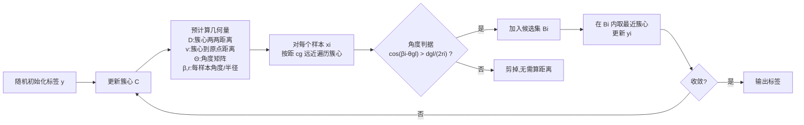

# Angle k-means：用角度关系加速精确 k-means

**会议**: ICLR 2026  
**OpenReview**: [https://openreview.net/forum?id=BdhQWT0y9s](https://openreview.net/forum?id=BdhQWT0y9s)  
**代码**: 论文补充材料提供 C/C++ 实现 + Python 接口  
**领域**: 聚类 / 优化算法 / 加速精确 k-means  
**关键词**: k-means 加速, 精确聚类, 几何剪枝, 角度关系, 无超参数  

## 一句话总结
本文提出 **Angle k-means**，通过预计算簇心之间的距离与角度，在赋值步骤里用一个仅含角度比较的几何不等式剪掉大量远处候选簇心，从而在不引入任何超参数、不改变聚类结果的前提下，把精确 k-means 跑得比 Ball k-means、Exp-ns 等 SOTA 更快。

## 研究背景与动机
- **领域现状**：Lloyd 的 k-means 因简单高效至今仍是聚类主力，但每轮"赋值"步骤需要计算每个样本到全部 $k$ 个簇心的距离，复杂度 $O(nkD)$，在大规模、高维数据上代价高昂。加速精确 k-means 的主流路线有两类：树结构（kd-tree、cover tree、dual-tree）和边界法（Elkan、Hamerly、Annulus、Exponion/Exp-ns、Ball k-means）。
- **现有痛点**：(1) 树结构法在高维下受"维度灾难"拖累，bound 变松；(2) 边界法 Elkan 要为每个样本维护 $k$ 个下界，内存 $O(nk)$ 随簇数膨胀；(3) Ball k-means、Yinyang、Adaptive k-means 等虽快，却**引入了额外超参数**（如邻居数、下界组数），调参困难，且破坏了 k-means "开箱即用"的简洁性。
- **核心矛盾**：想要更激进的候选剪枝（更快），通常意味着更复杂的辅助结构和更多需要调的超参数；如何在**零新超参数**下做出有效剪枝是个矛盾点。
- **本文目标**：设计一个与标准 k-means 用法完全一致（无新超参）、聚类结果完全相同（精确）、且在距离计算量与运行时间上都显著更优的加速算法。
- **核心 idea**：**【几何剪枝】** 现有边界法只用"簇心间距离"（三角不等式）筛候选；本文额外引入"样本/簇心相对坐标原点的**角度**"这一几乎免费的几何量，把候选簇心进一步压缩到一个角度判据所界定的小区域里。

## 方法详解

### 整体框架
Angle k-means 仍是 Lloyd 的"更新簇心 → 重新赋值"双步迭代，唯一改造的是赋值步骤：每轮先 $O(k^2 D)$ 地预计算簇心两两距离矩阵 $D$、簇心到原点距离 $v$、以及角度矩阵 $\Theta$；再为每个样本 $x_i$（当前属于簇 $g$、半径 $r_i=\|x_i-c_g\|_2$）用一个**仅含角度余弦比较**的判据筛出候选簇心集合 $B_i$，只在 $B_i$ 内做精确距离比较来更新标签。整套筛选有定理保证：被剪掉的簇心到 $x_i$ 的距离必然 $\ge r_i$，因此结果与暴力 Lloyd 完全一致。

### 关键设计

**1. 角度-距离下界定理：把"两点距离"问题归约到一维角度。** 全文的理论基石是 Theorem 2：给定参考点 $a,b$，若点 $p,q$ 到 $a,b$ 的四个距离固定，则 $p,q$ 之间可能的**最小**距离有闭式解 $d(p,q)=\sqrt{e_2^2+e_4^2-2e_2e_4\cos(\theta_1-\theta_2)}$，其中 $\theta_1,\theta_2$ 是相对基线 $\overrightarrow{ab}$ 的夹角。作者把它实例化到聚类场景：取 $a$ 为坐标原点 $o$、$b$ 为当前簇心 $c_g$，于是样本 $x_i$ 到任一簇心 $c_j$ 的距离平方下界写成
$$\|x_i-c_j\|_2^2 = r_i^2 + \|c_g-c_j\|_2^2 - 2r_i\|c_g-c_j\|_2\cos(\beta_i-\theta_{gj})$$
这里 $\beta_i=\angle o c_g x_i$、$\theta_{gj}=\angle o c_g c_j$，注意 $\beta_i-\theta_{gj}$ **并不是** $\angle x_i c_g c_j$，这条式子来自定理而非简单余弦定理——正是这一点让"样本侧角度 $\beta_i$"和"簇心侧角度 $\theta_{gj}$"可以分别预计算后再相减，避免逐对计算真实夹角。

**2. 两个特例给出剪枝直觉。** 在正式判据前，作者用两个易验证的特例建立几何画面：(Case 1) 若 $\|c_g-c_j\|\ge r_i$ 且 $|\beta_i-\theta_{gj}|\ge\pi/3$，则 $\|x_i-c_j\|\ge r_i$；(Case 2) 若 $\|c_g-c_j\|\le r_i$ 且 $|\beta_i-\theta_{gj}|\ge\pi/2$，同样成立。直觉是：当角度差足够大（簇心偏离样本所在方向）时，$\cos(\beta_i-\theta_{gj})$ 这个负贡献项不足以把下界压到 $r_i$ 以下。以 Case 1 为例，由 $\cos(\beta_i-\theta_{gj})\le 1/2$ 得 $\|x_i-c_j\|_2^2 \ge r_i^2+\|c_g-c_j\|_2(\|c_g-c_j\|_2-r_i)\ge r_i^2$。图 1(b) 里这两种情形对应可安全忽略的青色、紫色区域。

**3. 统一角度判据（核心剪枝规则）。** 把两个特例推广成连续阈值即 Corollary 2.1：令 $t=\frac{\|c_g-c_j\|_2}{2r_i}$，只要 $\cos(\beta_i-\theta_{gj})\le t$ 就有 $\|x_i-c_j\|_2\ge r_i$。反过来，**候选簇心集合**定义为
$$B_i=\Big\{\, l \;\Big|\; \cos(\beta_i-\theta_{gl}) > \frac{d_{gl}}{2r_i},\; l=1,\dots,k \,\Big\}$$
即只有角度余弦超过该距离比值的簇心才"可能"比当前更近，才值得真正算一次距离（图 1(c) 蓝色小区域）。相比 Ball k-means 只用距离划球邻居，这条判据把"距离 + 角度"耦合进一个标量比较，剪枝更紧。

**4. 距离排序提前终止，避免遍历全部簇心。** 实现上（Algorithm 1），对样本 $x_i$ 并不盲目扫所有 $k$ 个簇心，而是预先对距离矩阵 $D$ 的每一行排序得到索引矩阵 $H$（$c_g$ 的第 $j$ 近邻），按**离 $c_g$ 由近及远**的顺序访问：一旦遇到 $d_{gl}\ge 2r_i$ 就 `Break`——因为由三角不等式，若 $\|x_i-c_j\|<r_i$ 则必有 $\|c_g-c_j\|<2r_i$，更远的簇心不可能更近（图 1(a)）。这把单样本的候选遍历从 $O(k)$ 压到平均只看少数几个邻居，配合角度判据二次过滤，最终单轮复杂度 $O(k^2 D\log k + npD + nk)$、空间仅 $O(k^2)$，其中 $p$ 是每样本平均候选数。值得强调：**角度几乎免费**——$\Theta$ 由已算好的距离经余弦定理直接得到，不增加距离计算量，这也是它能在不付出额外开销的情况下额外剪枝的关键。

## 实验关键数据

### 主实验设置与结果
- **数据集**：14 个真实数据集，10 个中等规模（Digits、Corel5k、Coil100、CNBC、Isolet、RaFD、USPS、PINS、CPLFW、EYaleB）+ 4 个大规模（L-CAS、L-CLBA、L-YTF、L-EDS），样本量 4,000–621,126，维度 256–1024，簇数 $k$ 从 10 到 10,177。
- **对比基线**（均为**无超参**的精确加速法，保证公平）：标准 Lloyd、Elkan、Annulus、Exp-ns、Ball k-means（ring / no-ring 两版）。指标为每轮平均距离计算次数与运行时间。

| 数据集 (k) | 距离计算量(占 Lloyd %) | 运行时间(占 Lloyd %) |
|---|---|---|
| RaFD (k=200) | 10.15% | 32.13% |
| EYaleB (k=200) | 6.7% | 39.28% |
| L-YTF (k=2000) | 15.5% | 38.39% |
| L-CLBA (k=10000) | 14.81% | 52.16% |

### 复杂度对比

| 算法 | Setup | 时间 | 空间 |
|---|---|---|---|
| Lloyd | $O(1)$ | $O(nkD)$ | $O(k+n)$ |
| Elkan | $O(1)$ | $O(k^2D+knD)$ | $O(k^2+kn)$ |
| Exp-ns | $O(1)$ | $O(k^2D\log k+nD\log\log k+k^2D+knD)$ | $O(k^2+kn)$ |
| Ball k-means | $O(k^2D+knD)$ | $O(k^2D+kmD\log m+mn'D+nD)$ | $O(k^2+kn)$ |
| **Angle k-means** | $O(nD)$ | $O(k^2D\log k+npD+nk)$ | $O(k^2)$ |

### 关键发现
- 在多数数据集上，Angle k-means 使用**最少的样本-簇心距离计算**，由于距离计算主导各算法运行时间，它也在多数数据集上**跑得最快**。
- **$k$ 越大优势越明显**：在 Corel5k、PINS、L-CLBA、L-CAS 等大簇数数据集上，运行时间与距离计算量下降趋势更显著——这恰好契合"样本越多、簇数也越多"的大规模聚类实际场景。
- 空间复杂度仅 $O(k^2)$，明显优于 Elkan/Ball 等 $O(k^2+kn)$ 方法，对大 $n$ 友好。

## 亮点与洞察
- **"角度几乎免费"是最巧妙的一点**：角度矩阵 $\Theta$ 直接从已计算的簇心距离经余弦定理推得，不增加任何距离计算，却把候选区从"球邻域"进一步切成"角度楔形"，是典型的"用已有信息换更紧的界"。
- **零新超参数**是工程上的硬卖点：相比 Ball k-means / Yinyang / Adaptive 都要调邻居数或下界组数，Angle k-means 与标准 k-means 用法完全一致，落地无调参负担。
- **精确而非近似**：所有剪枝都有定理保证被剪簇心距离 $\ge r_i$，聚类结果与暴力 Lloyd 逐位相同，没有精度-速度的隐性折中。
- Theorem 2 把"约束下两点最小距离"归约成一维角度差的闭式解，这个引理本身具有一定的几何普适性，可能迁移到其他需要距离下界剪枝的最近邻/检索问题。

## 局限与展望
- **角度参考点固定为坐标原点 $o$** 只是为了计算方便，未必是最优锚点；作者在 Future Work 中提出用多参考点或动态选取的几何锚点来进一步收紧 filtering。
- 预计算 $\Theta$ 与排序 $D$ 带来 $O(k^2 D\log k)$ 的每轮开销，当 $k$ 很小、$n$ 不大时这部分占比上升，加速收益可能被吞掉（论文优势集中在大 $k$ 场景）。
- 实验只与"无超参"精确法对比，未直接量化对带超参 SOTA（如调好的 Yinyang/Adaptive）的相对位置，读者难以判断在允许调参时它是否仍占优。
- 角度判据本质仍依赖样本到当前簇心半径 $r_i$，对初始化敏感这一 k-means 固有问题并未触及（论文也明确只针对赋值步骤加速，不解决初始化敏感）。

## 相关工作与启发
- **边界法谱系**：Elkan（$k$ 下界，$O(nk)$ 内存）→ Hamerly（单下界，$O(n)$ 空间）→ Annulus（用 $|\,\|x\|-\|c\|\,|\le\|x-c\|$ 在圆环里找候选）→ Exponion/Exp-ns（球邻域 + 更紧 bound）→ Ball k-means（球邻居 + 稳定区）。Angle k-means 可视为在这条线上首次系统引入"角度"维度，是对 Annulus"用范数差剪枝"思路的角度版升级。
- **几何下界检索**：KM-G\*（Ismkhan & Izadi）同样用几何下界减距离计算，本文的 Theorem 2 提供了一种新的、基于角度的下界构造方式。
- **启发**：在任何"需要反复算样本到一组锚点距离"的任务（最近邻搜索、向量检索、注意力稀疏化）里，"预计算锚点间几何关系 + 一维角度/范数判据剪枝"都是低成本换高剪枝率的可复用范式。

## 评分
- **新颖性**: ⭐⭐⭐⭐ — 在成熟的加速精确 k-means 领域，首次把"角度关系"作为免费的二级剪枝判据引入，Theorem 2 的下界构造有一定原创性；但整体仍属边界法范式内的增量创新。
- **实验充分度**: ⭐⭐⭐⭐ — 14 个数据集覆盖中/大规模、$k$ 从 10 到 1 万，距离计算量与时间双指标，趋势分析清晰；略欠对带超参 SOTA 的对比与方差/收敛轮数报告。
- **写作质量**: ⭐⭐⭐⭐ — 定理-推论-算法递进清楚，图 1 三联图把剪枝几何讲得很直观；个别符号（$\beta_i-\theta_{gj}$ 非真实夹角）需读者细看才不踩坑。
- **价值**: ⭐⭐⭐⭐ — 无超参、精确、空间 $O(k^2)$、大 $k$ 场景显著加速，工程落地友好，对大规模聚类有直接实用价值。

<!-- RELATED:START -->

## 相关论文

- [\[ICLR 2026\] Scalable Second-Order Riemannian Optimization for K-means Clustering](scalable_second-order_riemannian_optimization_for_k-means_clustering.md)
- [\[AAAI 2026\] Convex Clustering Redefined: Robust Learning with the Median of Means Estimator](../../AAAI2026/optimization/convex_clustering_redefined_robust_learning_with_higher_order_norms_and_beyond.md)
- [\[ICLR 2026\] Submodular Function Minimization with Dueling Oracle](submodular_function_minimization_with_dueling_oracle.md)
- [\[ICLR 2026\] Bayesian Parameter Shift Rules in Variational Quantum Eigensolvers](bayesian_parameter_shift_rules_in_variational_quantum_eigensolvers.md)
- [\[ICLR 2026\] Strongly Convex Sets in Riemannian Manifolds](strongly_convex_sets_in_riemannian_manifolds.md)

<!-- RELATED:END -->
