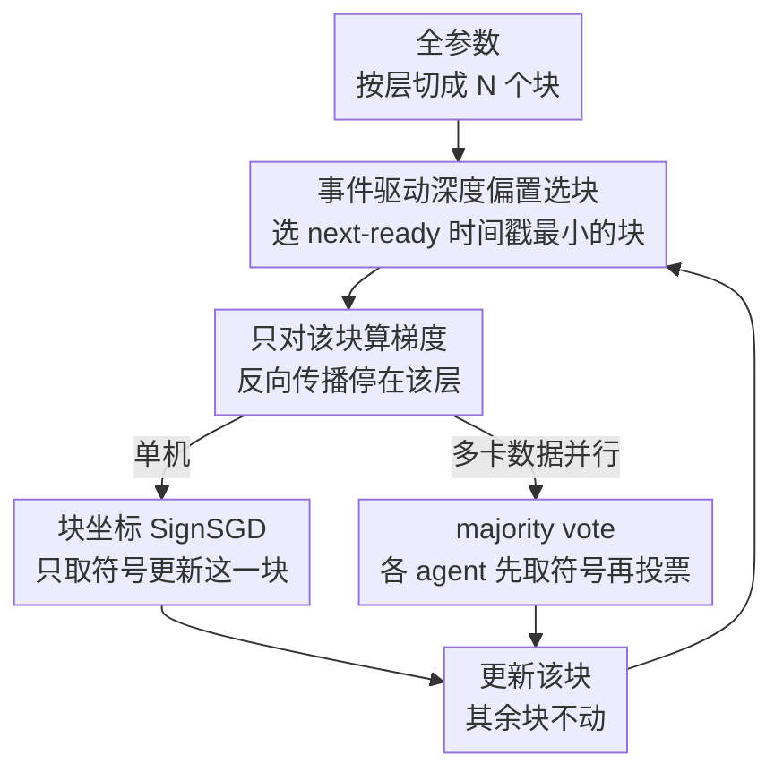

# Arbitrary-Order Block SignSGD for Memory-Efficient LLM Fine-Tuning

**会议**: ICLR2026  
**OpenReview**: [https://openreview.net/forum?id=NQsdnYkCar](https://openreview.net/forum?id=NQsdnYkCar)  
**代码**: https://github.com/yijiezcn/ABSignSGD  
**领域**: 优化算法 / LLM 高效微调  
**关键词**: SignSGD, 块坐标更新, 全参数微调, 内存高效, 收敛分析

## 一句话总结
本文提出 ABSignSGD——把 SignSGD 和"任意顺序的块坐标更新"结合起来的优化器：每步只更新一个 Transformer 层块、只存这一块的状态、只用梯度的符号更新，从而把全参数微调的显存压到接近推理水平，同时配一个深度偏置的块选择策略再省 20% 运行时；并给出统一的 $O(1/\sqrt{K})$ 收敛证明和一个只传符号、通信量降 960× 的多卡 majority-vote 变体。

## 研究背景与动机
**领域现状**：大模型在下游领域（医疗、法律、多语言对齐）落地仍然要靠微调，但即便是微调，全参数训练的显存开销也极其昂贵。围绕"省显存"已经形成几条主线：系统级的量化/offload（改数值表示或把张量挪到 CPU/NVMe）；零阶方法（不算反向、降到推理级显存，但收敛太慢）；以及本文关注的一阶算法路线。

**现有痛点**：一阶省显存方法可分三家，各有硬伤。(i) PEFT（LoRA、prefix/prompt-tuning、adapter）冻住主干只训少量旁路参数，省显存但性能普遍打不过全参数训练；(ii) 低秩投影（GaLore、Fira、Flora、Apollo）把梯度 SVD/随机投影到低秩子空间省优化器内存，但与强 baseline（AdamW）有性能差、与梯度累积不兼容、频繁分解时运行时很慢；(iii) 块坐标方法（BAdam）每步只更新一块、只存活跃块的优化器状态来省显存，但它用的是 Adam——而 Adam 依赖一阶/二阶动量的历史估计，块切换会反复清空这些状态，导致收敛比全模型更新的 Adam 还差。

**核心矛盾**：块坐标更新（省显存的关键）和有状态优化器（Adam 的一二阶动量）天生冲突——你每次换块，动量历史就废了。所以"块更新 + Adam"是把两个本不兼容的东西硬凑。

**本文目标**：找一个天然适配块切换、又不掉性能的优化器内核，把"省显存、省运行时、省通信"同时拿下。

**切入角度**：作者观察到 SignSGD 是**无状态**（memoryless）的——它丢掉梯度幅值，只用 $\text{sign}(g)$ 更新，不需要任何跨步动量。无状态恰恰意味着块切换不会损失任何历史信息，所以 SignSGD 和块更新是天作之合；而且近期实证表明 sign 类方法在性能和超参鲁棒性上已可与 AdamW 比肩。

**核心 idea**：用无状态的 SignSGD 替换 BAdam 里的 Adam，并把块选择从"循环"放宽成"任意顺序"（每块在 $B$ 步内至少更新一次即可），从而既消除状态重置的损失，又能把更新预算偏向更省反向计算的深层。

## 方法详解

### 整体框架
优化的是一般无约束问题 $\min_{x\in\mathbb{R}^d} f(x)$，在 LLM 微调里 $f(x)=\mathbb{E}_{\xi\sim D}F(x,\xi)$。把参数 $x$ 按层切成 $N$ 个互不相交的块 $\{\pi_1,\dots,\pi_N\}$（每个 Transformer 层含 attention+FFN 算一块，Qwen3-8B 得 $N=36$）。算法每一步只干一件事：挑一个块 $i_k$，对这一块的坐标做 SignSGD 更新，其余块原样不动：

$$x^{k+1}_{i_k} = x^{k}_{i_k} - \alpha\cdot\text{sign}\big(g_{i_k}(x^k)\big),\qquad x^{k+1}_{i}=x^{k}_{i}\ (\forall i\neq i_k).$$

两个省的来源叠在一起：因为只更新一块，优化器状态只需存活跃块（省显存）；因为块对齐到网络层、反向传播算到该层就能停（更新越深的层，反向走得越浅，省运行时）。在此之上还有一个多卡变体只传符号（省通信）。整体是一条"选块 → 取块梯度符号 → 更新该块"的极简循环，复杂度都被压进"怎么选块"这个调度策略里。

### 关键设计

**1. 块坐标 SignSGD：用无状态内核化解块切换与动量的冲突**

这是全文的内核，直接打在"块更新和 Adam 不兼容"这个痛点上。Adam 的自适应步长依赖一阶/二阶动量 $m_t,v_t$ 的长期历史，可一旦块切换，非活跃块的历史就被搁置/重置，自适应估计失真，收敛反而退化。SignSGD 的更新 $x^{k+1}=x^k-\alpha\,\text{sign}(g(x^k))$ 完全不带跨步状态——它只看当前这一步的梯度符号，丢掉幅值。把它套进块坐标框架后，"换块"不再损失任何东西，因为压根没有要被损失的历史。这样显存只需 $2M+\frac{M}{8N}$ GB（$M$ 为十亿参数量，前一项是半精度权重，后一项是活跃块的符号），对比 Adam 混合精度的 $18M$ GB、BAdam 的 $2M+\frac{16M}{N}$ GB——一个 8B、$N=36$ 的模型相比 BAdam 还能再省约 3.5 GB，因为它既不存动量、更新又只用 1 bit 符号。消融里也验证：把 Adam 换块会掉，而无状态的 SGD/SignSGD 换块不掉，且 SignSGD 比 SGD 收敛更快。

**2. 任意顺序 + 深度偏置块选择：把"灵活换块"的自由度变成实打实的运行时收益**

BAdam 用固定循环选块，反向时间约省 50%。本文把约束放宽到"每块在长度 $B$ 的窗口内至少被选一次"（即 Assumption 3.3 的有界更新间隔），于是更新顺序可以自由定制。因为更新越深的层、反向传播停得越早（省的计算越多），作者就让深层更新得更频繁。具体用一个事件驱动规则实现：给每块分配固定"虚拟更新成本" $\tau_i = N + c(N-i+1)$（$i=1$ 为最浅层，$c=10$ 为偏置系数，越深 $\tau$ 越小），维护每块的"下一次就绪时间戳" $T_i$（初值 $\tau_i$），每步选 $i_k=\arg\min_i T_i$ 更新后令 $T_{i_k}\leftarrow T_{i_k}+\tau_{i_k}$。深层 $\tau$ 小、就绪更快、被选更勤；同时"取最小时间戳"天然避免连续重复更新同一块（连续猛更一块会过早收敛到差的局部解），并能证明每块都在固定窗口 $B$ 内被选到，满足收敛假设。这套策略在 BAdam 之上再砍约 20% 运行时，且不掉性能——消融表明在适度超参范围内，块选择方案对收敛和下游泛化影响极小，所以深度偏置的价值纯粹在"省时间"。

**3. Majority-Vote 多卡变体：只传符号把通信压到 1 bit/坐标**

面向数据并行场景的通信瓶颈。$n$ 个 agent 并行算各自的块梯度，更新规则是先对每个 agent 的块梯度取符号、再多数投票取符号：

$$x^{k+1}_{i_k}=x^k_{i_k}-\alpha\cdot\text{sign}\Big(\sum_{j=1}^{n}\text{sign}\big(g^{j}_{i_k}(x^k)\big)\Big).$$

注意它和标准做法 $\text{sign}(\sum_j g^j)$ 的关键区别：是"先各自取符号再聚合"，于是每个 agent 每步只需交换块梯度的符号——每坐标 1 bit 而非 32 bit。$N=30$ 块时通信量相对 PyTorch DDP 降 960×，相对 BAdam 降 32×，相对 LoRA（$r=8,m=4096$）降 4.5×。更妙的是，因为先取符号丢掉了幅值，它不会被"自信但方向错"的离群梯度放大影响，在深度学习常见的重尾噪声下，majority vote 渐近上是比算术平均更优的符号估计器（Theorem 3.5）；实证里把 agent 从 1 增到 32，MV 曲线始终贴住单机基线。

### 损失函数 / 训练策略
没有改损失，纯优化器层面的工作。理论侧给出统一收敛保证：在 $L$-光滑且下有界（Assumption 3.1）、符号一致概率 $\rho_i(x)=P[\text{sign}(g_i)=\text{sign}(\nabla_i f)]>1/2$（SPB，Assumption 3.2）、有界更新间隔（Assumption 3.3）下，用一个"对齐范数" $\|g(x)\|_N=\sum_i w_i(x)|g_i(x)|$（按坐标的符号一致概率加权，ABSignSGD 取 $w_i=2\rho_i-1$，MV 取 $w_i=2I(\rho_i;l,l)-1$，$l=\lceil(n+1)/2\rceil$，$I$ 为正则不完全 beta 函数）来度量收敛：

$$\frac{\sum_{k=0}^{K-1}\mathbb{E}\|\nabla f(x^{kB})\|_N}{K}\le \frac{f(x^0)-f^*}{\alpha K}+\alpha L d\Big(B\big(1+\tfrac{1}{2N}\big)-\tfrac{N+1}{2}\Big).$$

取 $\alpha=1/\sqrt{K}$ 即得 $O(1/\sqrt{K})$ 速率，单机与多卡只在对齐权重定义上不同、共用一套证明框架。

## 实验关键数据

主体在 Qwen3-8B 上做：数学推理用 OpenMathInstruct-2（50K 样本），通用指令遵循用 Stanford-Alpaca（35K 样本），分别在 math-evaluation-harness 和 MT-Bench（GPT-5 评判）上测；另有 Llama3-8B、Qwen3-32B 在附录验证趋势一致。对比 LoRA、GaLore、Apollo、BAdam，统一开梯度检查点、关梯度累积、不加 offload/量化以避免运行时偏差。

### 主实验：显存与运行时（Qwen3-8B，OpenMathInstruct-2，3 epoch）

| 指标 | ABSignSGD | LoRA | GaLore | BAdam | Apollo |
|------|-----------|------|--------|-------|--------|
| 峰值显存 (GB) | **20.29** | 22.54 | 23.47 | 23.19 | 22.58 |
| 运行时 (h) | **2.66** | 5.51 | 12.77 | 3.32 | 6.64 |

显存最低（比 LoRA/Apollo 低约 2 GB、比 BAdam/GaLore 低近 3 GB），运行时比 BAdam 快约 20%、约为 LoRA 的一半。下游性能上，数学 benchmark 平均准确率 ABSignSGD 达 76，比第二名（BAdam 70）高 6 个点，超过 LoRA(68)、Apollo(62)、GaLore(65)，基座仅 44；MT-Bench 八类平均 6.18 居首并在五类领先。

### 消融实验（Qwen3-1.7B）

| 配置 | 现象 | 说明 |
|------|------|------|
| Adam + 块更新 (BAdam) | 收敛退化 | 自适应步长依赖被块切换清空的历史 |
| SGD / SignSGD + 块更新 | 不受影响 | 无状态，只看当前梯度，天然兼容块切换 |
| SignSGD vs SGD | SignSGD 更快 | 重类不平衡下的 Adam-like 正则 + 对重尾噪声的天然抑制 |
| 块选择方案 (DB/DS/UR) | 收敛与泛化几乎不变 | 深度偏置的价值在省运行时，不在精度 |

### 关键发现
- **无状态是块更新的最佳拍档**：替换核心优化器的消融最有说服力——Adam 一换块就掉，SGD/SignSGD 不掉，直接坐实了"块切换 vs 有状态动量"的冲突诊断。
- **SignSGD 为何能收敛**：在该任务上符号一致概率分布强烈偏向 1，只有约 1.1% 的坐标 $\rho_i<0.5$，恰好支撑 SPB 假设。
- **SignSGD 为何比 SGD 强**：一是 sign 更新带来 Adam-like 正则，在 token 类别严重不平衡（Alpaca 最高频 token 约为次高频 10×）时有益；二是相对梯度噪声幅值常 $>1$ 甚至超 $10^3$，会拖垮 SGD 但被符号更新天然抑制。
- **对噪声更敏感但不崩**：附录显示 ABSignSGD 比基线对小 batch（噪声大）更敏感，但即使 batch size=4 也不发散、仍快于 BAdam；主实验 batch size=16 下大幅领先。

## 亮点与洞察
- **"无状态恰好补块更新"是个干净的洞察**：作者没有去给块更新打补丁让 Adam 兼容，而是反过来挑一个本就不需要历史的内核，问题从根上消失。这种"换零件而非加补丁"的思路很值得迁移到其他"模块切换损失状态"的场景。
- **把约束放宽换来调度自由度**：从"循环选块"放宽到"$B$ 步内每块至少一次"，看似只是松了个假设，实则解锁了深度偏置这类省算力的更新策略——约束越松、优化空间越大，且收敛证明仍然成立。
- **先取符号再聚合 = 通信省 + 抗重尾**：MV 把"1 bit 通信"和"对离群梯度鲁棒"两件好事用同一个 $\text{sign}\circ\text{sign}$ 操作一并拿下，这个先量化再聚合的次序很巧。
- **诚实标注敏感性**：作者主动指出 SignSGD 对小 batch 更敏感，并归因于缺动量/自适应而非 sign 本身，还指出可通过 offload 优化器状态补回动量——这条改进方向对实践很有指导性。

## 局限与展望
- **作者承认的局限**：SignSGD 丢幅值，对梯度噪声（小 batch）更敏感，极端小 batch 下 SPB 可能失守（虽然实验里没崩）；缺少动量/自适应学习率这类正交机制，性能上仍有进一步空间。
- **未充分验证的假设**：作者猜测优先更新深层可缓解灾难性遗忘（浅层编码更通用特征），但明确把这一效应的实证验证留给未来工作。
- **可改进方向**：通过系统级 offload 把优化器状态挪走，从而引入动量做方差缩减——由于块坐标每步只需活跃块状态，I/O 带宽需求很小，能在不破坏超低显存/运行时的前提下补回有状态技术的好处。
- **自己发现的局限**：主实验集中在 8B 规模、两类任务，更大模型（32B）和更多任务只在附录给趋势；与量化/offload 等正交技术的组合虽声称兼容，但缺系统的联合实验。

## 相关工作与启发
- **vs BAdam（块坐标 + Adam）**：同为块坐标，BAdam 用 Adam，块切换要反复重置一二阶动量导致收敛退化、且只存活跃块状态仍需 $2M+\frac{16M}{N}$ GB、循环选块只省约 50% 反向；本文换成无状态 SignSGD，从根上消除状态重置、显存再省约 3.5 GB（8B）、任意顺序+深度偏置再省约 20% 运行时。
- **vs LoRA / PEFT**：LoRA 冻主干训低秩旁路，省显存但是部分参数微调、性能普遍逊于全参数；本文做的是真·全参数更新，显存还更低、下游更强。
- **vs GaLore / Apollo（低秩投影）**：它们靠 SVD/随机投影把梯度压到低秩子空间省优化器内存，但有与 AdamW 的性能差、与梯度累积不兼容、频繁分解拖慢运行时；本文不做投影、不做分解，显存与运行时都更优（GaLore 运行时高达 12.77h，本文 2.66h）。
- **vs 标准 sign 聚合 / DDP**：标准做法 $\text{sign}(\sum_j g^j)$ 或 DDP 全梯度平均通信量大、且会被自信错向的离群梯度带偏；本文 majority vote 先各自取符号再投票，通信降 960×（vs DDP）且在重尾噪声下渐近更优。

## 评分
- 新颖性: ⭐⭐⭐⭐ 把无状态 SignSGD 与任意顺序块更新结合的角度干净有力，虽各组件已有但组合洞察新。
- 实验充分度: ⭐⭐⭐⭐ 显存/运行时/收敛/下游四维度对比 + 针对性消融把机制讲透；更大规模与正交技术组合略欠。
- 写作质量: ⭐⭐⭐⭐⭐ 痛点诊断—方法—理论—实验逻辑严密，敏感性等局限主动诚实标注。
- 价值: ⭐⭐⭐⭐ 在紧显存预算下做全参数微调的实用方案，理论与工程兼备，易落地。

<!-- RELATED:START -->

## 相关论文

- [\[ICML 2026\] Memory-Efficient LLM Pretraining via Minimalist Optimizer Design](../../ICML2026/optimization/memory-efficient_llm_pretraining_via_minimalist_optimizer_design.md)
- [\[ICML 2026\] Learning a Zeroth-Order Optimizer for Fine-Tuning LLMs](../../ICML2026/optimization/learning_a_zeroth-order_optimizer_for_fine-tuning_llms.md)
- [\[ICCV 2025\] Zeroth-Order Fine-Tuning of LLMs in Random Subspaces](../../ICCV2025/optimization/zeroth-order_fine-tuning_of_llms_in_random_subspaces.md)
- [\[ICLR 2026\] Bi-LoRA: Efficient Sharpness-Aware Minimization for Fine-Tuning Large-Scale Models](bi-lora_efficient_sharpness-aware_minimization_for_fine-tuning_large-scale_model.md)
- [\[ICLR 2026\] FZOO: Fast Zeroth-Order Optimizer for Fine-Tuning Large Language Models towards Adam-Scale Speed](fzoo_fast_zeroth-order_optimizer_for_finetuning_large_language_models_towards_ad.md)

<!-- RELATED:END -->
