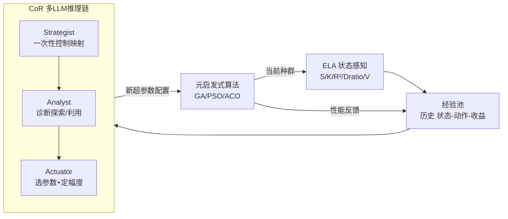

# AutoEP: LLMs-Driven Automation of Hyperparameter Evolution for Metaheuristic Algorithms

**会议**: ICLR 2026  
**OpenReview**: [https://openreview.net/forum?id=hit3hGBheP](https://openreview.net/forum?id=hit3hGBheP)  
**代码**: [https://github.com/YiZheZhang12/AutoEP](https://github.com/YiZheZhang12/AutoEP)  
**领域**: optimization  
**关键词**: 元启发式算法, 超参数动态调优, 大语言模型, 探索性景观分析(ELA), 零样本控制, 组合优化  

## 一句话总结
AutoEP 把"在线探索性景观分析(ELA)量化指标"喂给一条多 LLM 推理链，让大模型在**零训练**前提下逐代动态调节遗传算法/PSO/蚁群等元启发式的超参数，靠数据接地避免幻觉，使开源 30B 模型也能逼平 GPT-4 的调参效果。

## 研究背景与动机
**领域现状**：元启发式算法（GA、PSO、ACO）求解组合优化问题的成败，取决于"探索 vs 利用"这对超参数（变异率、交叉率等）的动态平衡。传统做法分两类：手工规则式调参（按迭代数/多样性硬编码地涨变异率）和数据驱动式调参（用深度强化学习从零学一个自适应策略）。

**现有痛点**：手工规则脆弱、需要大量人工标定、换问题/换算法就失效；而 DRL 路线虽然能自动化，却要跑上百万次算法执行才能训出一个策略，样本复杂度高得吓人，且策略容易过拟合到训练分布，遇到没见过的实例或算法变体就崩。Meta-BBO 这一支即便引入了神经 ELA、双 agent RL，仍然摆脱不了昂贵的 meta-training。

**核心矛盾**：既想要 Meta-BBO 那种状态感知的自适应性，又不想付出 instance-specific 的训练代价——缺一个**零样本**的调参框架。

**本文目标**：让 LLM 充当"即插即用"的零样本推理引擎，对任意元启发式算法做在线超参数控制，不做任何训练。

**核心 idea（接地推理 + 推理链分解）**：作者主张 LLM 最优的角色不是"替代求解器去生成解"（那会卡在浮点表示和上下文长度上），而是当"高层监督者"。两个关键支撑：**(1) 用实时搜索轨迹的量化指标(ELA)给 LLM 的抽象推理"接地"**，把"收敛""多样性"等先验知识锚定到当前优化状态的可观测动态上，从而抑制幻觉；**(2) 用一条多 LLM 协作推理链(CoR)把复杂控制任务拆成专职子步骤**，让小模型组合也能匹敌单个巨型专有模型。

## 方法详解

### 整体框架
AutoEP 是一个闭环控制系统：每个决策点先用 ELA 把元启发式算法的黑箱状态提炼成机器可读的量化特征，结合经验池(Experience Pool)里的历史状态-动作-收益拼成结构化 prompt，交给由三个专职 LLM 组成的推理链(CoR)做"诊断状态→决定探索/利用→翻译成具体超参数"，新配置回灌算法继续搜索，结果再写回经验池，形成 State-Sensing → Reasoning → Action 的持续 in-context learning 循环。

### 关键设计

**1. ELA 在线状态感知：把黑箱搜索翻成五个量化"病征"。** 由于元启发式是黑箱，AutoEP 用探索性景观分析(Exploratory Landscape Analysis)从当前种群里实时抽取一组紧凑而互补的特征，覆盖四个维度。**适应度分布**用偏度 $S=\frac{\frac{1}{n}\sum_i (y_i-\bar y)^3}{(\frac{1}{n}\sum_i (y_i-\bar y)^2)^{3/2}}$ 和峰度 $K$ 来判断：偏度正值意味着大量劣质解拖尾、应围绕少数精英加强利用，负值则预示种群正收敛、有早熟风险需加探索。**景观结构**用拟合优度 $R^2=1-\frac{\sum_i(y_i-f(\vec x_i))^2}{\sum_i(y_i-\bar y)^2}$ 判断地形是漏斗型($R^2\approx1$，宜利用)还是崎岖多峰($R^2\approx0$，宜探索）。**多样性**用离散比 $D_{ratio}=\frac{D(Q_{best})}{D(Q_{worst})}$（精英解与劣质解平均两两距离之比），$D_{ratio}\ll1$ 说明精英挤成一团（单漏斗，宜利用），$\approx1$ 说明精英散落多个区域（多峰，宜探索）。**搜索进度**用变化率 $V=\frac{\frac{1}{m}\sum_{m=g-m}^{g-1}\bar y_m}{\bar y_g}$ 衡量当前代相对前 $m$ 代的改善：$V>1$ 进展充分可加强局部利用，$V\le1$ 则停滞、需要多样化。这五个指标把"搜索现在卡在哪"变成可读的数字，是 LLM 推理的经验地基。

**2. 闭环 in-context 控制架构：用经验池做无梯度的持续学习。** AutoEP 不更新任何权重，而是把每次决策的"状态(ELA特征)→动作(超参数设置)→结果(适应度改善)"三元组存进经验池。下一个决策点把实时 ELA 特征与经验池里的相关历史一起塞进 prompt，让 LLM 既看到当前态势又看到"过去类似情况下怎么调有效"。这等价于在一次优化运行内做 in-context learning：随着搜索推进，框架持续根据观测到的性能自适应调整策略，而无需任何离线训练。

**3. Chain-of-Reasoning(CoR)三角色分解：把单一巨型 prompt 拆成专职流水线。** 把"理解任务 + 诊断状态 + 精确决策"全压给一个 LLM 会导致高延迟和输出不稳定，CoR 因此拆成三个协作 agent。**Strategist（一次性）**在运行开始时读问题描述和所选算法，生成一张静态"控制映射"，定性说明每个超参数对搜索的作用（如"变异率↑→促进探索"），供后续 agent 参考。**Analyst（状态诊断）**在每个决策点综合 ELA 信号与历史数据，识别"共识"（多个指标都指向探索，如低多样性+停滞）或"冲突"（指标矛盾，如低多样性但快速进展），输出明确的战略指令如 `ACTION: Increase Exploration`。**Actuator（决策调参）**拿到战略指令和控制映射后分两步落地：先按映射选出要改哪些超参数（增大变异率、减小交叉率），再通过经验池里的相似案例用 in-context learning 推断调整幅度（稳定进展时小步微调、深度停滞时大幅激进调整）。这套分解让无结构的复杂控制变成一串聚焦、可交叉验证的推理任务，从而即便用 30B 级小模型也稳定可靠。

## 实验关键数据

在 TSP、CVRP、FSSP 及更现实的 UAV-IoT 数据采集轨迹优化上，以 GA、PSO、ACO 为载体评测；AutoEP 默认用开源 Qwen3-30B，EoH/ReEvo 用 GPT-3.5-turbo，所有实验重复 30 次取均值。

### 主实验表格（TSP，Opt.gap 越小越好，%）

| 方法 | eil51 | Rd100 | Kroa150 | rd300 | rat575 | dsj1000 |
|------|-------|-------|---------|-------|--------|---------|
| DACT（神经组合优化 SOTA） | 0.00 | 0.09 | 0.13 | 0.93 | 2.55 | 4.97 |
| LEHD（神经组合优化 SOTA） | 0.08 | 0.21 | 0.96 | 1.38 | 2.64 | 5.54 |
| GA（裸算法） | 1.47 | 3.61 | 5.26 | 11.33 | 14.75 | 21.94 |
| GA+GLEET（RL 调参 SOTA） | 0.07 | 1.49 | 3.23 | 7.11 | 8.06 | 16.23 |
| GA+ReEvo（LLM 增强算子） | 0.27 | 1.97 | 3.39 | 7.58 | 8.39 | 16.53 |
| **GA+AutoEP** | **0.11** | **1.06** | **2.15** | **6.27** | **6.92** | **14.02** |
| GA-2opt+GLEET | 0.00 | 0.02 | 0.09 | 0.33 | 0.91 | 5.47 |
| **GA-2opt+AutoEP** | **0.00** | **0.01** | **0.01** | **0.09** | **0.08** | **3.58** |

AutoEP 在所有规模上都拿下最优，叠加局部搜索的 GA-2opt+AutoEP 甚至超过 DACT/LEHD 这类神经组合优化 SOTA；把 AutoEP 再套到已被 ReEvo/EoH 增强的算法上仍有进一步提升，验证其"即插即用增强器"属性。

### 消融实验表格（TSP，Opt.gap %）

| 方法 | eil51 | Rd100 | Kroa150 | rd300 | rat575 | dsj1000 |
|------|-------|-------|---------|-------|--------|---------|
| GA-2opt（基线） | 0.17 | 0.43 | 0.87 | 1.62 | 3.35 | 7.14 |
| AutoEP 去 ELA | 0.06 | 0.33 | 0.57 | 1.30 | 3.11 | 6.46 |
| AutoEP 去 CoR（单 LLM） | 0.16 | 0.43 | 0.81 | 1.60 | 3.37 | 7.11 |
| AutoEP 去 ELA+CoR | 0.21 | 0.56 | 1.37 | 1.84 | 3.91 | 7.93 |
| **AutoEP（完整）** | **0.00** | **0.01** | **0.01** | **0.09** | **0.08** | **3.58** |

去掉 ELA 则 LLM 失去态势感知、性能大跌；去掉 CoR（单 LLM 直接吃原始特征）几乎退回基线；两者皆去甚至比裸算法更差（盲目乱调）——证明"接地 + 分解"缺一不可。

### 关键发现
- **CoR vs 单个巨型模型**：用 30B 开源模型组成的 CoR，效果与 GPT-o1 / Claude 3.7 / Gemini 2.5 Pro / DeepSeek-R1 持平，但时间快一个数量级（eil51 上 5.8 min vs 44~54 min）。
- **对底座模型鲁棒**：EoH/ReEvo 靠 LLM 原始生成力，换小模型即大幅退化；AutoEP 因为结构化框架（ELA 接地 + CoR 推理），换弱模型仍保持高性能。
- **开销极小**：单次决策推理延迟约 30 ms，整轮数百次调整仅增加 2~5 分钟。
- **频率可调 + 滑动窗口**：每代调整收敛最快，但每 3~5 代调一次仍保留大部分增益；经验池用滑动窗口（L≈20）而非全历史，否则 prompt 膨胀反而拖累效率与质量。

## 亮点与洞察
- **"LLM 当监督者而非求解器"这个定位很对**：直接让 LLM 生成数值解会被浮点精度和上下文窗口卡死，转而让它控制超参数，既绕开了数值短板又用上了它的语义先验。
- **ELA 是抑制幻觉的关键拼图**：用可量化、可解释的搜索指标把抽象推理"钉"在真实动态上，是一个通用且可迁移到其他"LLM 控制黑箱系统"的范式。
- **CoR 把"大模型才行"打成"小模型组队也行"**：对算力受限、要本地部署、要复现性的场景非常友好，降低了 LLM 驱动算法控制的门槛。

## 局限与展望
- **ELA 特征是人工选定的**：偏度/峰度/R²/Dratio/V 这套指标和它们的"探索↔利用"映射规则仍带手工先验，换到非组合优化或高维连续问题上是否仍合适、能否自动发现特征，未充分讨论。
- **决策仍依赖 prompt 工程**：三个 agent 的 prompt（附录 C）质量直接影响输出稳定性，框架对 prompt 设计的敏感度、跨模型可移植性缺少系统分析。
- **dsj1000 仍有 3.58% gap**：大规模实例上提升明显收窄，说明在搜索空间极大时 LLM 调参的边际收益下降。
- **可拓展方向**：把"控制映射"和特征选择本身也交给学习/自动搜索，或扩展到连续黑箱优化、AutoML 超参数调度等更广义的算法控制场景。

## 相关工作与启发
- **Meta-BBO（GLEET、NeuroCrossover、Neural ELA、DesignX）**：用 RL 在算法空间里学优化器，本文借走了"状态感知自适应"的思想，但用零样本 LLM 推理替掉了昂贵 meta-training。
- **LLM 做算法设计（EoH、ReEvo 离线生成算子；EvoLLM 在线当进化算子）**：本文与它们正交——不替代算子，而是做动态超参数控制，绕开浮点表示难题。
- **ELA（Mersmann et al. 2011）**：把景观分析从"离线刻画问题难度"用作"在线给 LLM 接地的实时信号"，是一个值得借鉴的复用思路。

## 评分
- **新颖性**: ⭐⭐⭐⭐ — "ELA 量化接地 + 多 LLM 推理链 + 零样本超参数控制"的组合是新的，把 LLM 定位成监督者而非求解器的视角清晰且有说服力。
- **实验充分度**: ⭐⭐⭐⭐ — 覆盖 3 类算法 + 4 类问题、对比 RL/Bayesian/神经组合优化/LLM 增强多条 SOTA 线、30 次重复、含组件消融与模型鲁棒性/频率/窗口分析；扣分在 CVRP/FSSP/UAV 主结果挪到附录、正文主表只充分展开了 TSP。
- **写作质量**: ⭐⭐⭐⭐ — 动机—矛盾—方法逻辑顺畅，ELA 指标与三 agent 职责讲得清楚，图 1/2/3 配合到位。
- **价值**: ⭐⭐⭐⭐ — 即插即用、免训练、开源小模型可落地，对元启发式调参实践和"LLM 控制黑箱算法"这条线都有直接参考价值。

<!-- RELATED:START -->

## 相关论文

- [\[ICLR 2026\] Bayesian Evidence-Driven Prototype Evolution for Federated Domain Adaptation](bayesian_evidence-driven_prototype_evolution_for_federated_domain_adaptation.md)
- [\[ICLR 2026\] CALM: Co-evolution of Algorithms and Language Model for Automatic Heuristic Design](calm_co-evolution_of_algorithms_and_language_model_for_automatic_heuristic_desig.md)
- [\[ICLR 2026\] Generalizable Heuristic Generation Through LLMs with Meta-Optimization](generalizable_heuristic_generation_through_llms_with_meta-optimization.md)
- [\[ICLR 2026\] Efficient Algorithms for Incremental Metric Bipartite Matching](efficient_algorithms_for_incremental_metric_bipartite_matching.md)
- [\[ICLR 2026\] Completed Hyperparameter Transfer across Modules, Width, Depth, Batch and Duration](completed_hyperparameter_transfer_across_modules_width_depth_batch_and_duration.md)

<!-- RELATED:END -->
