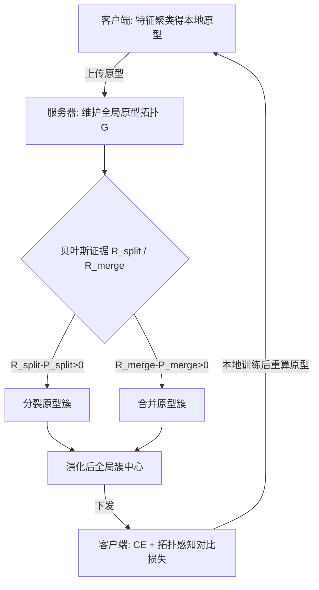

# Bayesian Evidence-Driven Prototype Evolution for Federated Domain Adaptation

**会议**: ICLR 2026  
**OpenReview**: [https://openreview.net/forum?id=plsgbZHX8A](https://openreview.net/forum?id=plsgbZHX8A)  
**代码**: 待确认  
**领域**: 联邦学习 / 域适应  
**关键词**: 联邦学习, 域偏移, 原型学习, 贝叶斯高斯混合模型, 拓扑演化, 对比学习  

## 一句话总结
FedPTE 把服务器端的全局原型集合当成一个**可动态演化的拓扑结构**，用贝叶斯高斯混合模型（BGMM）和边际似然比作为"统计证据"来决定何时把原型簇**分裂**或**合并**，配合稳定性惩罚和客户端的拓扑感知对比学习，在跨域联邦学习中持续刻画类内细粒度结构、缓解域偏移。

## 研究背景与动机

**领域现状**：联邦学习（FL）让多个客户端在不共享本地数据的前提下协同训练全局模型，但真实场景下各客户端往往来自不同域（如不同医院的成像设备、诊断协议），导致同一类别的特征分布在客户端之间存在结构性差异，即**域偏移（domain shift）**。基于原型（prototype）的 FL 方法通过跨域特征对齐缓解这一问题，是当前主流路线。

**现有痛点**：现有原型方法有两类做法都不够。一类直接对类内特征**求均值**得到单一原型，信息损失大、难以刻画困难域；另一类在客户端先聚类、再把多个聚类中心上传到服务器，但随着训练推进，模型对特征分布的估计不断细化，同类内部会出现明显的**类内变化（in-domain variation）**。无论是静态聚类还是简单平均，原型的**数量和结构都是固定的**，无法跟踪训练过程中语义可分性和方差结构的动态变化。

**核心矛盾**：理想做法是让服务器维护一个**动态原型拓扑**——遇到类内复杂分布时分裂原型簇以保留细粒度信息，遇到冗余/噪声时合并相近原型簇。但难点在于：如果服务器在单轮内**剧烈改变**全局原型结构，会与当前客户端表征严重错配，导致收敛退化；判据太保守则该细化时不细化，太激进则频繁震荡。

**本文目标**：设计一个能**动态感知类别粒度**、对跨域特征分布做更细粒度建模，同时保证训练稳定的原型学习框架。

**核心 idea**：**把"原型簇数量与拓扑结构"建模为一个证据驱动的模型状态**——用 NIW 共轭先验下的 BGMM 边际似然比作为统计证据来裁决分裂/合并，再用惩罚项约束单轮内的结构突变，让全局原型拓扑随训练自适应演化，而不再依赖经验阈值和静态聚类。

## 方法详解

### 整体框架
FedPTE 是一个"服务器决策拓扑演化 + 客户端拓扑感知对齐"的闭环。每轮通信里，客户端把本地各类原型上传到服务器；服务器把同类的所有候选点汇成原型簇、维护全局拓扑 $G=\{g_j\}_{j=1}^{|G|}$，通过**贝叶斯假设检验**逐簇判断该分裂还是合并（并用惩罚项压住剧烈变动）；演化后的簇中心下发回客户端，作为特征空间里的"共识锚点"，客户端用交叉熵 + 拓扑感知对比损失做本地训练，本地训练后再重新计算原型上传，进入下一轮。

### 关键设计

**1. 贝叶斯证据驱动的分裂/合并判据：用边际似然比代替经验阈值**。FedPTE 把全局拓扑 $G$ 视作 BGMM 的组件参数，每个原型簇 $g_j$ 对应一个均值 $\mu_j$、协方差 $\Sigma_j$ 的高斯分量，并为其引入 Normal-Inverse-Wishart（NIW）共轭先验 $p(\mu_j,\Sigma_j)=\mathrm{NIW}(\mu_j,\Sigma_j\mid m_0,\kappa_0,\nu_0,S_0)$，从而能同时建模均值和协方差。判断是否分裂时，它把簇 $g_j$ 的点集 $S_j$ 就近划成两个子簇，比较"两分量"假设 $H_1$ 与"单分量"假设 $H_0$ 的边际似然——得益于 NIW 共轭性，单分量对数边际似然 $\log p(S_j\mid H_0)$ 有**解析解**，于是分裂证据就是边际似然比 $R_{\text{split}}=\dfrac{p(S_{j,1}\mid H_0)\cdot p(S_{j,2}\mid H_0)}{p(S_j\mid H_0)}$；当 $R_{\text{split}}>1$ 时把 $g_j$ 拆成 $g_{j,1},g_{j,2}$。合并对称处理：对相邻簇对 $(g_j,g_l)$ 比较"同源"假设与"异源"假设，得 $R_{\text{merge}}=\dfrac{p(S_j\cup S_l\mid H_1)}{p(S_j\mid H_0)\cdot p(S_l\mid H_0)}$，$R_{\text{merge}}>1$ 则合并为加权平均的新簇 $g_{\text{new}}=(N_jg_j+N_lg_l)/(N_j+N_l)$。这样原型的数量和拓扑都由统计证据自动决定，摆脱了对人工阈值和静态聚类的依赖。

**2. 渐进式稳定性约束：让证据决策同时顾及结构质量与语义一致**。纯证据驱动的分裂/合并可能产生坏结构——分裂出大小悬殊的两个子簇，或把空间相近但语义不同的簇错误合并。FedPTE 为此各加一个惩罚。分裂上引入**平衡比** $B=\dfrac{\min(N_{j,1},N_{j,2})}{\max(N_{j,1},N_{j,2})}$（越接近 1 越均衡），惩罚 $P_{\text{split}}=\beta_{\text{split}}\cdot(1-B)$，判据改为 $\ln(R_{\text{split}})-P_{\text{split}}>0$，从而抑制极不平衡的低质量分裂。合并上则看两簇特征分布的语义相关性，用 Jensen-Shannon 型 KL 散度 $D(p_j\|p_l)=\tfrac12 D_{\text{KL}}(p_j\|m)+\tfrac12 D_{\text{KL}}(p_l\|m)$（$m=\tfrac12(p_j+p_l)$），惩罚 $P_{\text{merge}}=\beta_{\text{merge}}\cdot D(p_j\|p_l)$，判据 $\ln(R_{\text{merge}})-P_{\text{merge}}>0$，确保只有统计证据和语义都支持时才合并。这一层把"单轮剧烈结构突变 → 收敛退化"的风险压下去，平衡了拓扑自适应与训练稳定。

**3. 拓扑感知对比的双目标本地损失：把演化后的全局簇当多原型锚点对齐**。服务器演化完拓扑后下发簇中心，客户端用它们约束本地特征。本地目标是交叉熵 $L_{\text{CE}}$ 加一个**拓扑感知对比损失** $L_{\text{contra}}$：对样本特征 $z_i$，把全局拓扑中所有与其同标签的簇中心当正锚点集合 $G^+$、异标签的当负锚点 $G^-$，
$$L_{\text{contra}}=-\frac{1}{N_k}\sum_{i=1}^{N_k}\log\frac{\sum_{g^+\in G^+}\exp(\mathrm{sim}(z_i,g^+)/\tau)}{\sum_{g^+\in G^+}\exp(\mathrm{sim}(z_i,g^+)/\tau)+\sum_{g^-\in G^-}\exp(\mathrm{sim}(z_i,g^-)/\tau)}$$
关键在于分子对**所有正锚点求和**——这允许一个样本贴近其类别下的**任意子簇中心**，正好契合"一个类可以有多个细粒度子原型"的拓扑结构，而不是强行拉向单一类中心。总损失 $L_{\text{local}}=L_{\text{CE}}+\lambda\cdot L_{\text{contra}}$，既学判别边界又对齐全局语义拓扑，提升跨域泛化。

## 实验关键数据

数据集为 Digit（5 域：MNIST/SVHN/USPS/Synth/MNIST-M）和 Office（4 域：Amazon/Caltech/DSLR/Webcam），本地模型用 ResNet-10，对 MPFT 对比时用 CLIP-ViT-B-32。超参 $\lambda=100,\tau=0.06,\beta_{\text{split}}=1.0,\beta_{\text{merge}}=1.5$，3 个随机种子。

### 主实验表格

Digit（5 客户端，平均准确率 %）：

| 方法 | 模型 | MNIST | SVHN | USPS | Synth | MNIST-M | Avg. |
|------|------|------|------|------|------|------|------|
| FedOPT | ResNet-10 | 88.75 | 26.00 | 82.58 | 43.50 | 56.42 | 59.45 |
| FedProto | ResNet-10 | 97.65 | 72.02 | 96.20 | 87.36 | 84.36 | 87.52 |
| FPL | ResNet-10 | 98.10 | 77.02 | 96.99 | 90.50 | 87.89 | 90.10 |
| FedPLVM | ResNet-10 | 97.88 | 81.15 | 96.49 | 92.08 | 90.17 | 91.55 |
| MPFT | CLIP | 91.66 | 41.92 | 84.00 | 75.48 | 68.31 | 72.27 |
| **FedPTE** | CLIP | 95.31 | 46.68 | 93.55 | 81.42 | 71.13 | **77.62** |
| **FedPTE** | ResNet-10 | **98.88** | **84.93** | **98.32** | **95.13** | **92.65** | **93.98** |

Office（4 客户端，平均准确率 %）：

| 方法 | 模型 | Amazon | Caltech | DSLR | Webcam | Avg. |
|------|------|------|------|------|------|------|
| FedPLVM | ResNet-10 | 75.12 | 52.22 | 65.75 | 78.36 | 67.86 |
| FedPall | ResNet-50 | 76.21 | 51.41 | 66.67 | 67.82 | 65.53 |
| MPFT | CLIP | 91.30 | 91.67 | 96.88 | 96.47 | 94.08 |
| **FedPTE** | CLIP | **97.92** | **96.44** | **100.00** | **100.00** | **98.59** |
| **FedPTE** | ResNet-10 | **80.21** | **57.38** | **71.79** | **82.66** | **73.01** |

在 ResNet-10 下 Digit 平均 93.98%（较最强基线 FedPLVM 的 91.55% 提升约 2.4 个点），Office 平均 73.01%（较 FedPLVM 67.86% 提升约 5 个点）；CLIP 设定下 Office 达 98.59%，比 MPFT 高约 4.5 个点。

### 消融实验表格

Digit 5 客户端逐组件消融（平均准确率 %）：

| $R_{\text{split}}$ | $P_{\text{split}}$ | $R_{\text{merge}}$ | $P_{\text{merge}}$ | $L_{\text{contra}}$ | Avg. |
|:--:|:--:|:--:|:--:|:--:|:--:|
| | | | | | 83.67 |
| ✓ | | | | | 85.72 |
| ✓ | ✓ | | | | 86.31 |
| ✓ | ✓ | ✓ | | | 88.14 |
| ✓ | ✓ | ✓ | ✓ | | 89.43 |
| ✓ | ✓ | ✓ | ✓ | ✓ | **93.98** |

### 关键发现
- **分裂证据 $R_{\text{split}}$ 单独就带来 +2.05%**，说明动态调整原型簇数量的必要性；逐步加入分裂惩罚、合并、合并惩罚后稳步爬升到 89.43%，最后的拓扑感知对比损失 $L_{\text{contra}}$ 一举提升约 4.5 个点到 93.98%，是最大单一贡献项。
- **预训练表征与目标域是否匹配影响巨大**：CLIP 在与其预训练分布相近的 Office 上表现极好，但在低分辨率、风格多样的 Digit 上明显变差——表征错配时微调易受上传原型噪声拖累，FedPTE 的证据驱动拓扑维护正是用来抑制这种噪声。
- **强 Non-IID（Dirichlet $\alpha$ 越小越异质）下 FedPTE 在所有域全面领先**，基线在 SVHN/USPS 等复杂域显著退化，而 FedPTE 凭证据驱动拓扑维护保持类内可分性。
- 超参敏感性：$\tau=0.06$ 附近达到 93.98% 的最佳，对 $\tau$ 和 $\lambda$ 总体稳健。

## 亮点与洞察
- **把"原型数量/拓扑"从超参提升为可推断的模型状态**：用贝叶斯模型选择（边际似然比 + NIW 共轭解析解）替代经验阈值与静态聚类，是该工作最优雅的视角转换——分裂/合并不再靠手调阈值，而是由数据证据自然裁决。
- **"先证据、再约束"的两段式决策**很务实：直接照证据动结构会震荡，作者用平衡比惩罚和 JS 散度惩罚分别约束分裂质量和合并语义，把动态自适应和训练稳定这对天然矛盾捏合在一起。
- **多正锚点对比损失与拓扑结构自洽**：分子对所有同类子簇中心求和，允许样本贴近任一子原型，逻辑上与"一个类有多个细粒度子结构"完全一致，避免了把多模态类别硬拉向单一中心。

## 局限与展望
- **服务器端计算开销**：逐簇做 BGMM 假设检验、对相邻簇对枚举合并判据，随类别数和原型数增长可能带来不小的服务器计算负担，论文未充分讨论可扩展性与通信/计算成本。
- **超参仍未完全消除**：虽然把分裂/合并阈值换成了证据比 >1，但仍引入了 $\beta_{\text{split}},\beta_{\text{merge}},\lambda,\tau$ 以及 NIW 先验的 $m_0,\kappa_0,\nu_0,S_0$，先验设定对边际似然敏感，跨数据集的鲁棒性需更多验证。
- **评测规模有限**：仅在 Digit/Office 两个经典小数据集 + 少量客户端（4/5）上验证，附录虽含医学数据，但大规模客户端、类别更多、真实异构场景下的表现仍待检验。

## 相关工作与启发
- **原型联邦学习谱系**：FPL（无偏原型 + 一致性正则）、FedPLVM（双层原型聚类 + α-sparse 损失）、FedLSA（全局语义分类器 + vMF 对比）、MPFT（域特定原型集中训练全局 adapter）等都在做跨域原型对齐，FedPTE 的差异化在于把原型集合当**可演化拓扑**而非固定结构。
- **贝叶斯非参/模型选择**：用 BGMM + NIW 先验做分裂-合并，与 split-merge MCMC、Dirichlet Process 混合模型一脉相承，是把经典贝叶斯结构学习思想嫁接到 FL 原型维护上的一次落地。
- **启发**：这种"用边际似然比裁决结构增删"的范式可迁移到其他需要动态调整表征粒度的场景，如持续学习中的类原型扩张、检索系统中的聚类中心维护。

## 评分
- **新颖性**: ⭐⭐⭐⭐ 把贝叶斯模型选择（边际似然比 + NIW 解析解）引入联邦原型拓扑的分裂/合并裁决，视角新颖，不是简单的损失/聚合改良。
- **实验充分度**: ⭐⭐⭐ 主实验 + 逐组件消融 + Non-IID + 超参分析较完整且增益明显，但数据集和客户端规模偏小，缺乏服务器计算开销的量化。
- **写作质量**: ⭐⭐⭐⭐ 动机层层递进，公式推导（NIW 边际似然解析解、分裂/合并证据比）清晰，框架图与判据对应明确。
- **价值**: ⭐⭐⭐⭐ 为"原型数量该是多少"这一长期靠手调的问题提供了有原则的证据驱动答案，对跨域联邦学习与动态表征建模有较好的借鉴意义。

<!-- RELATED:START -->

## 相关论文

- [\[ICLR 2026\] AutoEP: LLMs-Driven Automation of Hyperparameter Evolution for Metaheuristic Algorithms](autoep_llms-driven_automation_of_hyperparameter_evolution_for_metaheuristic_algo.md)
- [\[CVPR 2025\] Federated Learning with Domain Shift Eraser](../../CVPR2025/optimization/federated_learning_with_domain_shift_eraser.md)
- [\[ICML 2026\] Rethinking the Flow-Based Gradual Domain Adaptation: A Semi-Dual Optimal Transport Perspective](../../ICML2026/optimization/rethinking_the_flow-based_gradual_domain_adaptation_a_semi-dual_optimal_transpor.md)
- [\[ICML 2025\] Sparse Causal Discovery with Generative Intervention for Unsupervised Graph Domain Adaptation](../../ICML2025/optimization/sparse_causal_discovery_with_generative_intervention_for_unsupervised_graph_doma.md)
- [\[ICLR 2026\] DADA: Dual Averaging with Distance Adaptation](dada_dual_averaging_with_distance_adaptation.md)

<!-- RELATED:END -->
