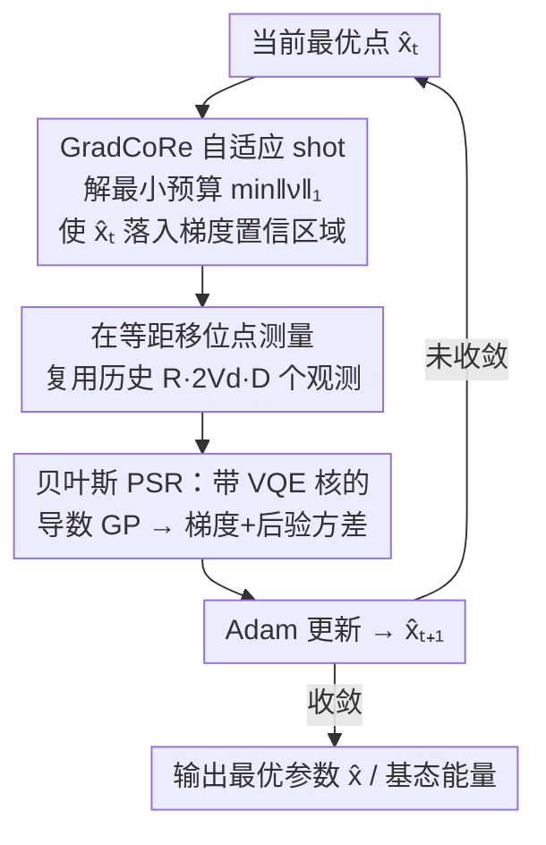

# Bayesian Parameter Shift Rules in Variational Quantum Eigensolvers

**会议**: ICLR 2026  
**OpenReview**: [https://openreview.net/forum?id=cS0L2kj0lj](https://openreview.net/forum?id=cS0L2kj0lj)  
**代码**: 待确认（论文称 Qiskit 实现随补充材料附带）  
**领域**: 量子计算 / 变分量子算法 / 贝叶斯优化  
**关键词**: 变分量子本征求解器, 参数移位规则, 高斯过程, 梯度置信区域, 量子优化

## 一句话总结
把变分量子本征求解器（VQE）里用于估梯度的参数移位规则（PSR）改写成贝叶斯版本——用带 VQE 核的导数高斯过程来估梯度，从而能在任意位置复用历史观测、并拿到梯度的后验不确定度；再据此提出"梯度置信区域（GradCoRe）"自适应分配测量次数，使 VQE 的 SGD 优化在相同测量预算下显著更快收敛、超过包括 NFT 系在内的现有 SOTA。

## 研究背景与动机
**领域现状**：VQE 是估计给定哈密顿量基态能量的混合量子-经典算法。量子端用参数化量子线路 $|\psi_x\rangle=G(x)|\psi_0\rangle$ 生成试探态并测量能量期望 $f^*(x)=\langle\psi_x|H|\psi_x\rangle$，经典端最小化这个含噪目标 $\min_x f^*(x)$。由于量子资源昂贵，优化的真实成本是整个过程消耗的**测量 shot 总数**，而不是迭代次数。

**现有痛点**：每次观测 $y=f^*(x)+\varepsilon$ 都带 shot 噪声，方差 $\sigma^{*2}\propto N_{\text{shots}}^{-1}$。主流的梯度法靠 PSR：第一阶 PSR（$V_d=1$）用两点 $\partial_d f^*=\frac{f^*(x+\alpha e_d)-f^*(x-\alpha e_d)}{2\sin\alpha}$（取 $\alpha=\pi/2$），广义 PSR 用 $2V_d$ 个**固定的等距点**。这套规则的硬约束是：① 观测点位置被钉死，无法利用上一步已经测过的点；② 给不出梯度估计的**不确定度**，于是每步只能拍脑袋固定 shot 数（如 1024），噪声小的时候浪费、噪声大的时候不够。

**核心矛盾**：PSR 把"在固定点上测量"和"估出准确梯度"绑死了，没有一个统一的概率框架既能容纳任意观测布局、又能输出梯度的置信信息——而正是后者决定了能不能省 shot。

**切入角度**：VQE 目标 $f^*$ 其实是一个三角多项式（Nakanishi 等证明 $f^*(x)=b^\top\mathrm{vec}(\otimes_d\psi_\gamma(x_d))$），Nicoli 等据此设计了完全反映这一物理结构的 **VQE 核** $k_\gamma$。既然有了好用的核，就可以把梯度估计交给"导数高斯过程"——导数算子是线性的，GP 样本的导数仍是 GP，只要相应地改写核的协方差项即可。

**核心 idea**：用带 VQE 核的导数 GP 来估 VQE 目标的梯度（"贝叶斯 PSR"）。它在无噪等距观测下严格退化为广义 PSR，但额外给出解析梯度、任意位置观测能力与后验不确定度；再用不确定度驱动一个自适应 shot 分配策略（GradCoRe），把"达到所需梯度精度"翻译成"最少 shot 预算"。

## 方法详解

### 整体框架
论文要解决的是：在 VQE 的 SGD 优化里，**用更少的测量 shot 达到更低的能量**。整体思路分两层——底层把梯度估计从"固定点 PSR"换成"任意点的导数 GP（贝叶斯 PSR）"，上层利用贝叶斯 PSR 给出的后验方差，在每一步只花刚好够用的 shot（GradCoRe）。

具体到一次 SGD-GradCoRe 迭代：以当前最优点 $\hat x_t$ 为中心，沿每个方向 $d$ 摆好 $2V_d$ 个等距移位点 $\breve X$；先求解一个"最小总 shot 数"问题，使得在这些点上测量后、$\hat x_t$ 处的梯度后验方差落进梯度置信区域（即每个方向方差 $\le\kappa_d^2$）；按解出的 shot 数实际测量，把新观测连同历史保留的 $R\cdot 2V_d\cdot D$ 个旧观测一起喂给导数 GP，得到带不确定度的梯度估计；最后用 Adam 走一步得到 $\hat x_{t+1}$。

### 关键设计

**1. 贝叶斯 PSR：用带 VQE 核的导数高斯过程估梯度**

这是全文地基，针对"PSR 观测点被钉死、且给不出不确定度"的痛点。做法是把目标函数放进 GP 先验 $p(f)=\mathcal{GP}(f;0,k_\gamma)$，核取 Nicoli 等的物理知情 VQE 核 $k_\gamma(x,x')=\sigma_0^2\prod_d\frac{\gamma^2+2\sum_v\cos(v(x_d-x_d'))}{\gamma^2+2V_d}$。由于导数算子线性，GP 样本的导数也是 GP，只需把涉及导数输出的协方差项换成核对相应坐标的偏导 $\tilde k(x,x')=\partial_{x_{d'}'}k(x,x')$、$\tilde k(x',x'')=\partial^2_{x_{d'}'x_{d''}''}k(x',x'')$，就能直接得到方向导数的后验 $p(\partial_d f|X,y)=\mathcal{GP}(\partial_d f;\tilde\mu^{(d)},\tilde s^{(d)})$。这样得到的梯度估计有四个旧 PSR 给不出的好处：解析形式、**可用任意位置的观测**、对异方差噪声是贝叶斯最优、且**观测前就能解析算出后验方差**——最后一条正是上层省 shot 的全部依据。

**2. 退化定理：与广义 PSR 的关系，以及 $\alpha=\pi/2$ 的最优性**

针对"换了框架会不会丢掉 PSR 的好性质"这一顾虑，作者用两条定理把贝叶斯 PSR 和经典 PSR 钉在一起。Theorem 3.1：在 $2V_d$ 个等距点、同方差噪声 $\sigma^2\ll\sigma_0^2$ 下，导数 GP 的后验均值就是广义 PSR (10) 的正则化版本——无噪极限 $\sigma^2\to 0$ 时方差趋于 0、均值精确收敛到广义 PSR；有噪时先验方差 $\sigma_0^2$ 通过分母里的 $(\gamma^2/2+1)\sigma^2/\sigma_0^2$ 项起到压制梯度幅度的正则化作用。Theorem 3.2：当 $V_d=1$，两点观测的导数后验方差 $\tilde s^{(d)}=\frac{\sigma^2}{(\gamma^2/2+1)\sigma^2/\sigma_0^2+2\sin^2\alpha}$ 在 $\alpha=\pi/2$ 处取最小，且与 $\sigma^2,\sigma_0^2,\gamma$ 无关。这从理论上解释了文献里"移位取 $\pi/2$"的经验选择——它对应两观测点的最大跨度，跨度越大不确定度越小。

**3. Bayes-SGD：跨迭代复用历史观测**

贝叶斯 PSR 最直接的红利是观测复用。标准 SGD 每步丢弃上一步的观测、重新在固定点测 $2V_d D$ 个点；Bayes-SGD 因为 GP 接受任意位置的观测，可以保留最近 $R\cdot 2V_d\cdot D$ 个历史观测（实验取 $R=5$），把它们和新观测一起做 GP 回归。累积的观测让梯度估计更准。不过实验显示，单论"换更准的梯度"，Bayes-SGD 的优化曲线和标准 SGD 基本持平——说明光有更准的梯度还不够，真正的增益来自下一项怎么花 shot。

**4. GradCoRe：用后验不确定度自适应分配 shot 预算**

这是把贝叶斯 PSR 的不确定度兑现成"省 shot"的关键。仿照置信区域 CoRe，定义梯度置信区域 $\tilde Z_{[X,\sigma]}(\kappa)=\{x:\tilde s^{(d)}_{[X,\sigma]}(x,x)\le\kappa_d^2,\forall d\}$，即各方向梯度后验方差都低于阈值 $\kappa_d$ 的区域。每步求解 $\min_{\tilde\nu}\|\tilde\nu\|_1$ s.t. $\hat x_t\in\tilde Z$，其中 $\tilde\nu$ 是各等距测量点的 shot 数、噪声随 shot 数 $\breve\sigma(\tilde\nu)=\sigma^{*2}/\tilde\nu$ 缩放——即在"当前最优点的梯度方差够小"约束下最小化总测量预算（实现上用网格搜索、各点等 shot 数）。阈值随迭代自适应：$\kappa^2(t)=\max\big(c_0,\;\frac{c_1}{D}\sum_d(\tilde\mu^{(d)}(\hat x_t))^2\big)$，即正比于当前估计梯度的 $L_2$ 范数（梯度大时容忍粗估、临近收敛时收紧精度），下界 $c_0$ 与斜率 $c_1$ 为超参。开优前先在随机点测出单 shot 噪声方差 $\sigma^{*2}(1)$ 作为标定。

### 损失函数 / 训练策略
优化目标就是 VQE 能量 $\min_{x\in[0,2\pi)^D} f^*(x)$，无额外正则项（贝叶斯 PSR 的"正则化"来自 GP 先验方差，不是 loss 项）。所有 SGD 类方法用 Adam，$\text{lr}=0.05$、$\beta=(0.9,0.999)$；非自适应方法固定 $N_{\text{shots}}=1024$。Bayes-SGD 与 GradCoRe 用最近 $R=5$ 倍观测估梯度；GradCoRe 在前 $D$ 次迭代用固定阈值 $\kappa^2(t)=\sigma^{*2}/256$ 再开始自适应。

## 实验关键数据

### 主实验
设置：Heisenberg / Ising 哈密顿量（开边界），$Q=5$ 量子比特、$L=3$ 层 Efficient SU(2) ansatz（$V_d=1$），100 个随机初始点，Qiskit 经典模拟量子硬件（不考虑硬件噪声、只考虑 shot 噪声）。评价用 $\Delta\text{Energy}$ 与 $\Delta\text{Fidelity}$（对真基态之差，越小越好）随**累积 shot 总数**的曲线。主结果（与 SOTA 比，图 4，定性，数值取自对数刻度曲线）：

| 方法 | 类型 | 相同 shot 预算下收敛 | 备注 |
|------|------|------|------|
| SGLBO | SGD+BO 步长 | 较慢 | Tamiya & Yamasaki 2022 |
| Bayes-NFT | 贝叶斯 SMO | 中等 | 已优于原版 NFT |
| EMICoRe | SMO+BO 选点 | 中等偏快 | Nicoli 2023a |
| SubsCoRe | SMO+自适应 shot | 快 | Anders 2024 |
| **GradCoRe（本文）** | SGD+自适应 shot | **最快、终能量最低** | 新 SOTA（附录 F.1 含显著性检验） |

### 消融实验
图 3 在 Ising 上对比 SGD / Bayes-SGD（各取 $N_{\text{shots}}=128/256/512/1024$）与 GradCoRe：

| 配置 | 相对表现 | 说明 |
|------|---------|------|
| SGD + 标准 PSR | 基线 | 每步固定 shot、不复用观测 |
| Bayes-SGD（复用观测） | ≈ 与 SGD 持平 | 梯度更准（附录 F 图 7），但优化曲线无明显增益 |
| GradCoRe（自适应 shot） | 全程优于上面两者各 shot 设置 | 自动决定每步最优 shot 数 |

### 关键发现
- **更准的梯度 ≠ 更快的优化**：Bayes-SGD 证明了仅靠复用观测把梯度估得更准，优化性能并不提升；真正起作用的是"把省下来的不确定度预算换成更省 shot"。
- **GradCoRe 的增益来自自适应 shot**：它建立在贝叶斯 PSR 的不确定度之上，能在每步自动选最优 shot 数，从而在相同累积 shot 下超过所有固定 shot 的 SGD/Bayes-SGD 及现有 SOTA。
- **$\alpha=\pi/2$ 有了理论依据**：Theorem 3.2 证明该移位最小化梯度不确定度且与噪声/核参无关，解释了长期的经验默认值。

## 亮点与洞察
- **把 PSR 概率化**：用导数 GP 统一了"固定点 PSR"与"任意点贝叶斯估计"，并证明前者是后者的特例——这种"经典规则 = 贝叶斯方法的退化"叙事既给出新能力又不丢旧保证，很干净。
- **不确定度是省 shot 的硬通货**：GradCoRe 的核心洞察是"观测前就能解析算出梯度方差"，于是能把"达到所需精度"反解成"最少 shot 预算"，这是固定 shot 的 PSR 永远做不到的。
- **可迁移思路**：任何"目标函数有已知结构、可设计物理/任务知情核"的含噪零阶优化（不止 VQE），都能照搬"导数 GP 估梯度 + 置信区域控采样预算"这套，把采样成本和精度需求显式挂钩。
- **理论副产品**：对长期被当作经验值的 $\alpha=\pi/2$ 给出最优性证明，是个漂亮的"顺手解释经验"。

## 局限与展望
- **不考虑硬件噪声**：与多数优化方法论文一致，只建模 shot 噪声，真实量子硬件的相干/读出误差未纳入，落地时 GP 的同方差/异方差假设可能被打破。
- **规模偏小**：实验止于 $Q=5$ 比特、$L=3$ 层、$V_d=1$ 的 Efficient SU(2)，更大线路下 GP 回归 $O(N^3)$ 的开销与高维 GradCoRe 网格搜索的可扩展性都存疑。
- **超参与近似**：阈值的 $c_0,c_1$、复用窗口 $R$ 需调；GradCoRe 预算问题用"各点等 shot 的网格搜索"近似求解，并非严格最优分配。
- **作者展望**：探索现有方法（SGD 类 vs SMO 类）的最优组合，以及针对特定哈密顿量自动选最合适策略。

## 相关工作与启发
- **vs 广义 PSR（Mitarai 2018 / Wierichs 2022）**：他们在固定等距点上给精确梯度，本文把它推广成任意点的贝叶斯估计，无噪等距下退化为前者，但多了任意布局、观测复用与不确定度。
- **vs NFT / Bayes-NFT（Nakanishi 2020 / Nicoli 2023a）**：NFT 是 SMO 路线，每步在 1D 子空间解析求最优；本文走 SGD 路线，证明 SGD 也能借同样的 VQE 核物理结构吃到贝叶斯红利。
- **vs EMICoRe（Nicoli 2023a）**：EMICoRe 用置信区域**选观测点位置**；GradCoRe 用置信区域**定每点 shot 数**，关注点从"测哪里"转到"测多少"。
- **vs SubsCoRe（Anders 2024）**：同样用 CoRe 控成本，但 SubsCoRe 在 SMO 框架里最小化 shot，GradCoRe 把这一思路搬到 SGD + 梯度置信区域。
- **vs GIBO（Müller 2021）**：GIBO 最小化 GP 估梯度的不确定度，GradCoRe 可看作其增强版——借 VQE 强物理先验在理论最优点上以最小成本观测。

## 评分
- 新颖性: ⭐⭐⭐⭐ 把 PSR 概率化为导数 GP 并据此自适应 shot，思路清晰且有理论支撑，但属于在 VQE-核/CoRe 谱系上的自然延伸。
- 实验充分度: ⭐⭐⭐⭐ 与多条 SOTA 基线在多种 Hamiltonian 上比、含显著性检验；但规模偏小、无硬件噪声。
- 写作质量: ⭐⭐⭐⭐ 理论-方法-实验衔接顺畅，定理与直觉对照清楚。
- 价值: ⭐⭐⭐⭐ 给 VQE 优化提供了能直接降低测量成本的实用框架，且方法论可迁移到含噪零阶优化。

<!-- RELATED:START -->

## 相关论文

- [\[ICML 2026\] Neural QAOA$^2$: Differentiable Joint Graph Partitioning and Parameter Initialization for Quantum Combinatorial Optimization](../../ICML2026/optimization/neural_qaoa2_differentiable_joint_graph_partitioning_and_parameter_initializatio.md)
- [\[ICLR 2026\] Symmetry-Aware Bayesian Optimization via Max Kernels](symmetry-aware_bayesian_optimization_via_max_kernels.md)
- [\[ICLR 2026\] Local Entropy Search over Descent Sequences for Bayesian Optimization](local_entropy_search_over_descent_sequences_for_bayesian_optimization.md)
- [\[ICLR 2026\] Generative Bayesian Optimization: Generative Models as Acquisition Functions](generative_bayesian_optimization_generative_models_as_acquisition_functions.md)
- [\[ICLR 2026\] Bayesian Evidence-Driven Prototype Evolution for Federated Domain Adaptation](bayesian_evidence-driven_prototype_evolution_for_federated_domain_adaptation.md)

<!-- RELATED:END -->
