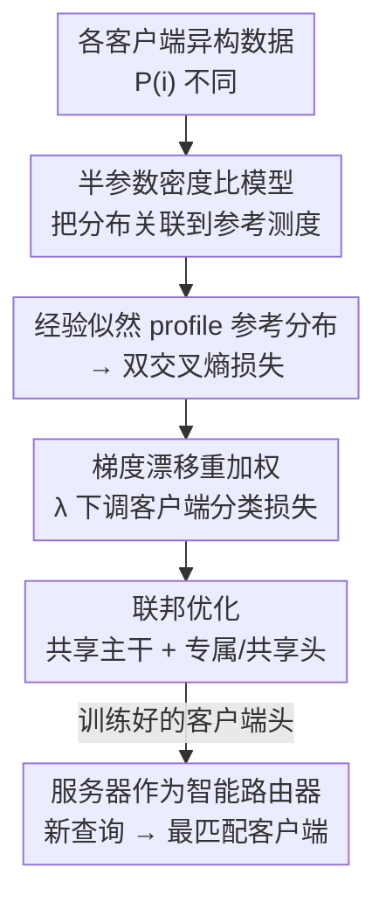

# Beyond Aggregation: Guiding Clients in Heterogeneous Federated Learning

**会议**: ICLR2026  
**OpenReview**: [https://openreview.net/forum?id=RZT1ixYGk1](https://openreview.net/forum?id=RZT1ixYGk1)  
**代码**: https://github.com/zijianwang0510/FedDRM.git  
**领域**: 联邦学习 / 优化  
**关键词**: 联邦学习, 统计异构性, 密度比模型, 经验似然, 查询路由

## 一句话总结
FedDRM 把联邦学习中服务器的角色从「被动聚合器」升级为「智能路由器」——用密度比模型加经验似然把异构性建模成一个可学习的客户端分类任务，从而在训练好各客户端本地模型的同时，让服务器能把新查询直接派给最擅长它的客户端，在 CIFAR 与真实眼底医学数据上同时提升本地精度与系统级路由精度。

## 研究背景与动机
**领域现状**：联邦学习（FL）让医院、银行、手机等多方在不共享原始数据的前提下协同训练模型，已成为隐私敏感场景的主流范式。但现实中各客户端的数据分布差异巨大（统计异构性，statistical heterogeneity），比如不同医院面对不同人群。主流做法把异构性当成需要「压制」的麻烦：要么改聚合算法（修正本地更新、重加权客户端贡献、加正则对齐全局目标）学一个全局模型，要么走个性化路线（微调 / 多任务 / 元学习）给每个客户端定制本地模型，或者把相似客户端聚类后分组训练。

**现有痛点**：所有这些方法都默认服务器只负责「协调训练 + 分发模型」，本质上还是个被动聚合器。它们要么拉平异构性损失了本地专长，要么虽然个性化了却**没人回答「新来的查询该交给谁」这个问题**。换句话说，异构性被当成 bug 在抑制，而它蕴含的「哪个客户端最擅长哪类数据」的信息被白白浪费。

**核心矛盾**：异构性既是训练时的障碍（本地模型漂移、收敛慢、全局模型回到本地反而变差），又是部署时的资源（不同客户端各有专长）。现有范式只看到前者、丢掉了后者。

**本文目标**：让服务器同时具备两种能力——（i）在异构下仍能跨客户端有效共享信息、学好每个本地模型；（ii）用一种有原则的方式量化「各客户端分布差异有多大」，从而把新查询匹配给最合适的客户端。

**切入角度**：作者从一个医疗场景出发——病人来了，与其用一个全局模型诊断，不如让服务器根据各院的数据分布把病人导向最对口的医院。要把这个直觉数学化，关键是要能写出「一个样本来自哪个客户端」的概率，这正好是一个判别问题。

**核心 idea**：用密度比模型（DRM）把每个客户端分布写成相对一个参考分布的「乘性密度倾斜」，再用经验似然（EL）非参数地把参考分布 profile 掉，整个目标会**自然分解成两个交叉熵**——一个预测目标类别（支撑常规 FL 训练），一个预测样本来自哪个客户端（恰好就是路由所需的信号）。于是服务器从聚合器变成了路由器。

## 方法详解

### 整体框架
FedDRM 要解决的是：在 m 个客户端、各自数据分布不同的 FL 系统里，既训练好每个客户端的目标分类器，又训练出一个「客户端分类器」让服务器能路由新查询。整套方法的转法是——先用一个概率模型（DRM）把所有客户端的特征分布关联到一个服务器端的虚拟参考分布上，再用经验似然把这个未知参考分布消掉，得到一个出人意料地简单的双交叉熵损失，最后用一个针对梯度漂移的重加权修正在标准 FedAvg 流程里联邦地优化它。

网络结构上（论文 Fig. 2）：一个共享主干 $g_\theta$（ResNet-18，输出 512 维 embedding）被所有客户端共用；在其之上分两路——目标分类用**客户端专属的线性头** $(\alpha_i,\beta_i)$，客户端分类用一个**全体共享的客户端头**（先过一个共享变换 $h_\tau$ 再接 $(\gamma,\xi)$）。推理时若要路由，就用客户端头对查询给出「属于各客户端」的概率分布，取最大者，再用那个客户端的本地目标头出最终类别预测。

### 关键设计

**1. 半参数密度比模型：把异构客户端分布关联到一个参考测度**

痛点是：要做路由，就得知道「各客户端分布差多少」，但逐个把每个客户端的分布估出来既不现实、又会因为参数假设而失真。作者引入密度比模型（DRM, Anderson 1979）——不去估每个分布本身，只建模它们之间的**相对差异**。具体地，先假设在协变量偏移下 $Y|X$ 的条件分布跨客户端一致：$P(Y=k|X=x)=\exp(\alpha_k+\beta_k^\top g_\theta(x))/\sum_j\exp(\alpha_j+\beta_j^\top g_\theta(x))$；再把各客户端的类条件分布通过一个**对数线性的密度比**联系到服务器端的虚拟参考测度 $P^{(0)}_1$：$dP^{(i)}_k/dP^{(i)}_1(x)=\exp(\gamma_i+\xi_i^\top h_\tau(g_\theta(x)))$。Theorem 2.1 进一步证明，这会让**边际特征分布也满足同样的 DRM 形式**：$dP^{(i)}_X/dP^{(0)}_X(x)=\exp\{\gamma^\dagger_i+\xi_i^\top h_\tau(g_\theta(x))\}$。这一步把「客户端 i 与参考分布的差异」压缩成了 embedding 上的一个对数线性倾斜，既避免了逐分布估计，又给后面构造似然铺好了路；当 $\gamma_i=\xi_i=0$ 时退化为 IID 情形。论文也强调这个假设的边界很坦诚：分布差异太剧烈时合并数据本就无益，那不是模型的锅而是问题本身的性质。

**2. 经验似然 profile 出参考分布：得到一个出奇简单的双交叉熵对偶损失**

参考测度 $P^{(0)}_X$ 是未知的，硬套参数族又会引入偏差。作者用经验似然（EL, Owen 2001）非参数地处理它——把每个观测样本的参考概率 $p_{ij}=P^{(0)}_X(\{X_{ij}\})$ 当作参数，受归一化与各客户端密度比积分为 1 的约束 $\sum_{i,j}p_{ij}=1$、$\sum_{i,j}p_{ij}\exp(\gamma^\dagger_l+\xi_l^\top h_\tau(g_\theta(X_{ij})))=1$。把这些 nuisance 参数 $p$ profile 掉之后，目标本来要解 m 个拉格朗日乘子方程、计算量很大；但 Theorem 2.2 给出了一个惊喜的闭式对偶——最优时乘子恰为 $\rho_l=n_l/N$，整个 profile log-EL 化简成两个标准交叉熵之和：

$$\ell(\zeta)=\sum_{i,j}\ell_{CE}(i,h_\tau(g_\theta(x_{ij}));\gamma,\xi)+\sum_{i,j}\ell_{CE}(y_{ij},g_\theta(x_{ij});\alpha,\beta).$$

前一项是「这个样本来自哪个客户端」的分类，后一项是「这个样本是哪个目标类」的分类。从一堆涉及 DRM、EL、拉格朗日对偶的推导里，最后落地的竟是两行交叉熵——这正是本文最漂亮的地方：复杂的统计建模换来了可以直接塞进任何深度网络训练的简单损失。论文还说明该框架在 $Y|X$ 与 $X$ 都跨客户端变化的最一般情形下也成立，只需把目标分类头改成客户端专属（即 Fig. 2 架构），形态上和 FedRep 这类个性化方法很像。

**3. 梯度漂移重加权：用 λ 稳住「天生标签倾斜」的客户端分类头**

把双损失直接联邦优化会踩一个坑：客户端分类损失 $\ell_i(\gamma,\xi)$ 在第 i 个客户端上**只能看到标签为 i 的样本**——这是一种极端的标签偏移。看它对 $\gamma_k$ 的梯度 $\partial\ell_i/\partial\gamma_k=n_i^{-1}\sum_j x_{ij}\{\mathbf{1}(i=k)-p_k(\cdot)\}$，当 $k\neq i$ 时指示项恒为 0，于是单个客户端对「别的客户端参数」的更新没有任何有效信息，本地更新天然有偏，导致客户端分类头的梯度漂移远大于目标分类头（论文 Fig. 3 实测，相对漂移比 $G_{client}/G_{class}$ 在整个训练过程都明显偏高）。作者借鉴重加权思想，把漂移更大的那一项**下调权重**：$\tilde\ell_i(\zeta)=(1-\lambda)\ell_i(\gamma,\xi)+\lambda\ell_i(\alpha,\beta)$，取 $\lambda>0.5$。Theorem 2.5 给出了收敛-精度的 trade-off 界：误差 $\|\zeta^{(T)}-\zeta_{true}\|^2$ 的第一项随 $\lambda$ 控制统计精度（在 $\{(1-\lambda)\|I_\gamma\|_{min}+\rho\}^{-1}$ 与 $\{\lambda\|I_\beta\|_{min}+\rho\}^{-1}$ 间平衡），最后一项 $\propto(1-\lambda)^2\bar G^2_{client}+\lambda^2\bar G^2_{class}$ 控制收敛速度——λ 越大收敛越快，但太大（趋近 1）会让目标分类压倒客户端分类、削弱路由能力。实测 $\lambda=0.8$ 时系统精度最高。

**4. 服务器作为智能路由器：把客户端分类头变成查询分配机制**

前三个设计训练出的那个共享客户端头，部署时正好就是路由器。对一个新查询，客户端头按 Theorem 2.1 的 $dP^{(i)}_X/dP^{(0)}_X$ 给出「属于各客户端」的预测分布，**取概率最大的客户端**，再用它的本地目标头做最终预测——这就是有原则的查询分配机制。和基线相比，这一步在效率上也有优势：基线没有路由机制，要当路由器只能让全部 m 个本地模型各预测一遍再多数投票（评估 m 个模型），而 FedDRM 只需评估单个模型。异构性在这里第一次被当成「资源」用了起来：分布差得越开，路由越准。

### 一个完整示例
以眼底诊断为例（论文 RETINA 实验设定）：系统有 3 个客户端，对应 ACRIMA、Rim、Refuge 三家临床中心，各自图像来源不同（协变量偏移）、正负类比例分别为 1.34 / 1.94 / 0.46（标签偏移）。训练阶段，三家共享主干 $g_\theta$ 和客户端头 $h_\tau$，但各自保留专属目标头。来了一张新的眼底图，服务器先用客户端头算出它最像 ACRIMA / Rim / Refuge 中的哪一家（比如最大概率指向 Refuge），就把它路由给 Refuge 的本地模型出青光眼 / 正常的判断——而不是用一个全局模型硬诊断。这就是「系统精度（system accuracy）」要衡量的：在汇集了所有客户端样本的池化测试集上，先路由再预测的整体正确率。

### 损失函数 / 训练策略
总损失即负 profile log-EL 的重加权版 $\tilde\ell(\zeta)=\sum_i(n_i/N)\tilde\ell_i(\zeta)$，其中 $\tilde\ell_i(\zeta)=\lambda\ell_i(\alpha,\beta)+(1-\lambda)\ell_i(\gamma,\xi)+(\rho/2)\|\zeta\|_2^2$（L2 项等价于 SGD 的 weight decay）。优化流程（Algorithm 1, FedDRM）是标准 FedAvg 骨架：每轮服务器广播 $(\theta,\tau,\gamma,\xi)$，各客户端并行做 E 步本地 SGD 更新全部参数，再把 $(\theta,\tau,\gamma,\xi)$ 传回服务器按样本量加权平均；目标头 $(\alpha_i,\beta_i)$ 客户端专属、不聚合。主干 $g_\theta$ 与客户端变换 $h_\tau$ 之间的共享深度可调（no/shallow/mid/deep sharing），deep sharing 在精度持平下最省参数。

## 实验关键数据

### 主实验
CIFAR-10/20/100，8 客户端，同时注入标签偏移（Dir-0.3 或 S-SPC）与协变量偏移（gamma / hue / saturation 变换），ResNet-18 主干，800 轮通信。系统精度（system accuracy，先路由再预测的池化测试集精度）：

| 数据集 / 设置 | 指标 | FedDRM | 最强基线 | 说明 |
|--------|------|------|----------|------|
| CIFAR-10 / Dir-0.3 | 系统精度 | **62.78** | 61.33 (FedALA) | 路由比多数投票更准 |
| CIFAR-10 / 5-SPC | 系统精度 | **58.50** | 57.17 (FedBABU) | 标签偏移更重时仍领先 |
| CIFAR-100 / 25-SPC | 系统精度 | **31.24** | 27.96 (FedAvgFT) | 100 类难任务优势最大 |
| CIFAR-10 / Dir-0.3 | 平均精度 | **80.26** | 79.08 (FedAvgFT) | 本地个性化也最好 |
| CIFAR-100 / 25-SPC | 平均精度 | **46.73** | 44.26 (FedAS) | 平均精度同样全面领先 |

FedDRM 在系统精度与平均精度两项上对所有基线（Ditto / FedRep / FedBABU / FedPAC / FedALA / FedAS / ConFREE 以及 FedAvgFT / FedProxFT / FedSAMFT）均一致占优；基线因个性化模型互相分歧，做路由只能多数投票，系统精度明显偏低。

### 消融 / 分析实验

| 配置 | 关键发现 | 说明 |
|------|---------|------|
| λ 扫描（0.1→0.95） | $\lambda=0.8$ 系统精度峰值 | 印证 Thm 2.5：λ 大偏向目标分类（平均精度↑、客户端精度↓） |
| 协变量偏移强度 low/mid/high | 系统精度 46.90→54.61→63.80 | 偏移越大路由越准，但信息共享变难、平均精度从 81.78 降到 80.25 |
| 主干共享 no/shallow/mid/deep | 四者相近，deep 最省参数 | shallow 略高但参数暴涨，deep sharing 是性价比之选 |
| 客户端数 m=8→32 | 系统精度 59.59→46.62，仍领先 top-2 | 随客户端增多普遍下滑，但 FedDRM 始终保持优势 |
| RETINA 真实医学数据 | 平均精度领先 0.83–3.77 点、系统精度领先 1.41–7.67 点 | 3 中心眼底图，协变量+标签双偏移下训练损失最低、收敛最稳 |

### 关键发现
- 重加权参数 λ 是部署 EL 框架到 FL 的关键：它在「路由能力」与「分类精度」间权衡，$\lambda=0.8$ 是甜点；这与梯度漂移分析（客户端分类头漂移更大、需下调）完全一致。
- 协变量偏移强度揭示了一个内在 trade-off：分布差得越开越利于路由（系统精度大涨）、却越不利于跨客户端信息共享（平均精度小降）——异构性确实是「双刃」，FedDRM 把它用成了资源。
- 在最难的 CIFAR-100 与真实多中心医学数据上优势最显著，说明方法在高异构、强专业化场景里最有价值。

## 亮点与洞察
- **把异构性从 bug 变 feature**：核心范式转变是让服务器主动「利用」而非「压制」客户端差异——这是 FL 里少见的、把部署阶段的路由需求直接写进训练目标的做法。
- **统计建模换来极简损失**：DRM + EL + 拉格朗日对偶的一长串推导，最后塌缩成两行交叉熵（Thm 2.2 的闭式乘子 $\rho_l=n_l/N$），既有理论根基又能无痛接入任何深度网络，这种「复杂理论 → 简单实现」的落差很优雅。
- **梯度漂移的诊断很到位**：作者没有泛泛地加正则，而是精确指出「客户端分类头只见一个标签 → 极端标签偏移 → 梯度漂移更大」这条因果链，再针对性地用一个标量 λ 下调它，且配上收敛界佐证，可迁移到任何「某个子任务标签支撑极窄」的多任务联邦场景。
- **路由还顺带省算力**：相比基线要跑 m 个模型多数投票，FedDRM 只评估单个共享主干 + 对应头，系统级效率更高。

## 局限与展望
- DRM 假设客户端分布通过对数线性密度比相联，作者也承认当分布差异极端时该假设失效——此时虽不算模型缺陷（合并数据本就无益），但路由与共享都会失去依据，方法的有效区间被限定在「中等异构」。
- 实验规模偏学术（CIFAR + 一个 3 中心眼底数据集，最多 32 客户端），缺少大规模、跨模态、动态客户端进出（client churn）的验证；真实医疗联邦里客户端会增删，路由器如何在线适配未涉及。
- λ 需用验证集调（因为 Fisher 信息与梯度漂移未知），跨任务是否需要重调、能否自适应估计 λ 是自然的改进点。
- 路由把整张查询「硬指派」给单个客户端，没有探讨软路由 / 多客户端集成或路由错误时的回退机制；当真实标签来源跨多个客户端混合时可能偏脆。

## 相关工作与启发
- **vs 聚合修正类（FedAvg / FedProx / FedSAM / ConFREE）**：它们改聚合以学单一全局模型、压制异构性；FedDRM 反过来把异构性建成可学习的客户端分类信号，既个性化又能路由，系统精度大幅领先。
- **vs 个性化 FL（FedRep / FedBABU / Ditto / FedPAC / FedALA / FedAS）**：这些方法给每个客户端定制本地模型、提升本地精度，但不回答「新查询交给谁」；FedDRM 的架构其实与 FedRep 类似（专属目标头 + 共享主干），但多了一个共享客户端头来支撑路由，是它们能力上的真子集扩展。
- **vs 客户端聚类（IFCA / FedCluster 等）**：聚类把相似客户端分组训练，仍假设服务器只协调训练；FedDRM 不做硬聚类，而用连续的密度比量化差异并直接做查询级路由。
- **方法学启发**：DRM + EL 这套半参数工具把「多个相似总体的信息融合」做得既灵活又有理论保证，对任何需要「跨域共享 + 量化域间差异」的分布式学习问题（多中心医疗、跨机构风控）都有借鉴价值。

## 评分
- 新颖性: ⭐⭐⭐⭐⭐ 把 FL 服务器从聚合器重定义为路由器，并用 DRM+EL 给出统计学根基，范式层面的创新。
- 实验充分度: ⭐⭐⭐⭐ CIFAR 三难度 + 真实眼底数据 + 充分的 λ/偏移/共享/客户端数消融，但规模与动态性偏学术。
- 写作质量: ⭐⭐⭐⭐⭐ 从医疗直觉到定理推导再到极简损失，叙事清晰、动机一以贯之。
- 价值: ⭐⭐⭐⭐ 为「异构性即资源」开辟了可落地的新方向，对多中心医疗 FL 尤具实用意义。

<!-- RELATED:START -->

## 相关论文

- [\[ICLR 2026\] Incentives in Federated Learning with Heterogeneous Agents](incentives_in_federated_learning_with_heterogeneous_agents.md)
- [\[ICLR 2026\] Byzantine-Robust Federated Learning with Learnable Aggregation Weights](byzantine-robust_federated_learning_with_learnable_aggregation_weights.md)
- [\[ICML 2026\] HO-SFL: Hybrid-Order Split Federated Learning with Backprop-Free Clients and Dimension-Free Aggregation](../../ICML2026/optimization/ho-sfl_hybrid-order_split_federated_learning_with_backprop-free_clients_and_dime.md)
- [\[ICLR 2026\] FedDAG: Clustered Federated Learning via Global Data and Gradient Integration for Heterogeneous Environments](feddag_clustered_federated_learning_via_global_data_and_gradient_integration_for.md)
- [\[AAAI 2026\] SMoFi: Step-wise Momentum Fusion for Split Federated Learning on Heterogeneous Data](../../AAAI2026/optimization/smofi_step-wise_momentum_fusion_for_split_federated_learning_on_heterogeneous_da.md)

<!-- RELATED:END -->
