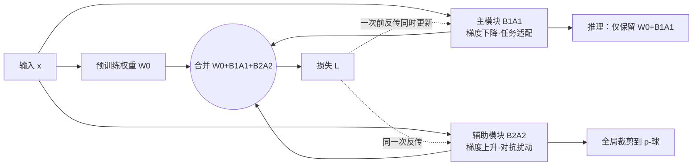

# Bi-LoRA: Efficient Sharpness-Aware Minimization for Fine-Tuning Large-Scale Models

**会议**: ICLR 2026  
**OpenReview**: [https://openreview.net/forum?id=zoYPlgX1bH](https://openreview.net/forum?id=zoYPlgX1bH)  
**代码**: [https://github.com/CrazyElements/Bi-LoRA](https://github.com/CrazyElements/Bi-LoRA)  
**领域**: optimization  
**关键词**: LoRA, Sharpness-Aware Minimization, 平坦极小, 参数高效微调, 对抗扰动, 泛化  

## 一句话总结
Bi-LoRA 用一个额外的"对抗 LoRA 模块"专门承载 SAM 的对抗扰动，把原本串行的"先算扰动再下降"两步合并成一次并行前反传，在几乎不增加成本的前提下让 SAM 真正能用于大模型 LoRA 微调，并跳出 LoRA-SAM 的受限子空间、找到更平坦的极小。

## 研究背景与动机
**领域现状**：LoRA 通过低秩矩阵 $\Delta W \approx BA$ 把大模型微调的可训练参数降到极低，已成为微调与部署大模型的事实标准。而泛化方面，Sharpness-Aware Minimization（SAM）通过求解 $\min_W \max_{\|\epsilon\|\le\rho} L(W+\epsilon)$ 的 min-max 问题去寻找平坦极小，在小规模训练上拿到过 SOTA 的泛化提升。把两者结合（LoRA-SAM）看似是"既省显存又泛化好"的天然方案。

**现有痛点**：直接把 SAM 套到 LoRA 参数上有两个硬伤。一是**效率**——SAM 每步要先算一次对抗扰动、再算一次梯度下降，两次反传必须串行，训练时间直接翻倍，模型越大代价越刺眼。二是**有效性**——LoRA-SAM 的扰动被限制在一个受限子空间里：把扰动展开 $\epsilon_W = B\epsilon_A + \epsilon_B A + \epsilon_B\epsilon_A$，交叉项可忽略后近似为 $\epsilon_W \approx c\,[BB^\top(\nabla_W L) + (\nabla_W L)A^\top A]$，其列/行空间分别被 $\mathrm{Col}(B)$、$\mathrm{Row}(A)$ 主导（命题 1）。更糟的是 $B,A$ 在训练早期就快速收敛，子空间随之"坍缩"，SAM 只能在这个越缩越小的子空间里优化锐度。

**核心矛盾**：推理时 LoRA 会被合并进全参数 $W_0+BA$，真正该关心的是**全参数空间**的锐度；但 LoRA-SAM 只在受限子空间里压锐度——损失景观可视化显示它在 LoRA 子空间最平、在全空间却仍随扰动陡升。于是"省显存"和"真正找到全空间平坦极小"难以兼得。

**本文目标**：让 SAM 在大模型 LoRA 微调上同时做到**高效**（不翻倍成本）和**有效**（跳出受限子空间、全空间更平坦）。

**核心 idea（解耦）**：引入一个独立的辅助对抗 LoRA 模块，把"锐度优化"从"任务适配"中**解耦**出来——主模块照常梯度下降做任务，辅助模块梯度上升专门承载 SAM 扰动，两者在一次前反传里并行更新；推理时丢掉辅助模块，回到标准 LoRA 结构、零额外开销。

## 方法详解

### 整体框架
Bi-LoRA 把权重写成两个对向 LoRA 模块之和：$W = W_0 + B_1A_1 + B_2A_2$。主模块 $(B_1,A_1)$ 用梯度**下降**做任务适配（等同标准 LoRA），辅助模块 $(B_2,A_2)$ 用梯度**上升**建模 SAM 的对抗扰动；二者解耦后可在同一次梯度步里并行更新，训练完丢弃辅助模块、只留 $W_0+B_1A_1$ 做推理。

### 关键设计

**1. 双向梯度更新：把 SAM 的两步拍扁成一次并行前反传。** 这是 Bi-LoRA 的核心。LoRA-SAM 的对抗扰动 $\epsilon_B=\rho\,\frac{\partial L}{\partial B}/F_{\text{total}}$ 必须先在 $(\epsilon_A,\epsilon_B)$ 上反传、再在 $(A,B)$ 上反传，两次串行。Bi-LoRA 把扰动单独交给辅助模块后，优化目标变成 $\min_{B_1,A_1}\max_{\|B_2A_2\|_F\le\rho} L(W_0+B_1A_1+B_2A_2)$，于是一次梯度步内主模块下降、辅助模块上升，互不依赖、可并行：
$$B_1^{k+1}=B_1^k-\eta_1(\nabla_W L)A_1^{k\top},\quad B_2^{k+1}=B_2^k+\eta_2(\nabla_W L)A_2^{k\top}$$
（$A$ 同理，梯度统一在合并权重 $W=W_0+B_1A_1+B_2A_2$ 处求）。两个模块独立反传让更新可并行，直接消掉了 LoRA-SAM 翻倍的计算量，把成本压回 LoRA 的 ×1。命题 2 进一步保证：辅助模块产生的上升方向与 SAM 的扰动方向非负对齐（$\langle G_t,\tilde\epsilon_{t+1}-\tilde\epsilon_t\rangle\ge0$），所以这次"偷懒"的并行更新仍在朝 SAM 想要的最坏方向爬升。

**2. 解耦带来更广的锐度探索：辅助子空间独立且收敛更慢。** LoRA-SAM 的扰动空间被主模块 $\mathrm{Col}(B)$ 绑死，还会随训练快速坍缩。Bi-LoRA 让扰动空间由 $\mathrm{Col}(B_2)$ 张成，**与主优化空间 $\mathrm{Col}(B_1)$ 严格解耦**——虽然仍是子空间，但不再被任务适配拖着一起收敛。实测中辅助模块只在训练最后 20% 的步数才收敛，比主模块慢得多且独立演化，从而保留了在受限子空间之外捕捉锐度的灵活性。损失景观可视化证实：Bi-LoRA 在**全参数空间**上比 LoRA-SAM 平坦得多，而这恰是推理（LoRA 合并进全权重）真正关心的。

**3. 全局范数裁剪：把扰动稳稳关进 ρ-球。** 辅助模块负责承载扰动，必须保证扰动量级足够小、不破坏正常训练。Bi-LoRA 对全部 $N$ 个辅助模块做**全局**裁剪：仅当总 Frobenius 范数 $c_{\text{norm}}=\sqrt{\sum_j\|B_2^{(j)}A_2^{(j)}\|_F^2}$ 超过半径 $\rho$ 时，按 $\sqrt{\rho/c_{\text{norm}}}$ 等比缩放各层 $B_2,A_2$，把整体扰动约束在 $\rho$-球内。消融显示"全局裁剪"远优于"不裁剪"（后者扰动过大、平均掉 3.48）和"逐层裁剪"（仅微升），是稳定与有效的关键。

**4. 理论解读：Bi-LoRA ≈ 带低秩梯度范数正则的 LoRA。** 从梯度范数视角，SAM 等价于 $L(W)+\rho\|\nabla_W L(W)\|_2$。命题 3 证明：若 Bi-LoRA 的内层最大化求解到最优，其目标化简为 $\min_{B_1,A_1} L(W_0+B_1A_1)+\rho\|\nabla_{W_0+B_1A_1}L\|_{(r)}$，其中 $\|\cdot\|_{(r)}$ 是 Ky Fan $r$-范数（前 $r$ 个奇异值之和）。也就是说 Bi-LoRA 本质上是给 LoRA 加了一个**显式的低秩梯度范数正则**，与 SAM 的正则化解释一脉相承（实践中只跑一步内层近似以保效率，与理论最优之间留有 gap）。

## 实验关键数据
覆盖 Llama 2-7B / 3.1-8B（数学、代码、对话、指令跟随）、Qwen 2.5-14B、SDXL 文生图，以及 T5-base 的 NLU 任务。

### 主实验表格
Llama 2-7B（数学/代码/对话）与 Llama 3.1-8B（指令跟随），Cost 为每步梯度计算次数：

| 方法 | Cost | GSM8K | HumanEval | MT-Bench | MMLU | DROP | HEval | BBH |
|------|------|-------|-----------|----------|------|------|-------|-----|
| Full FT | ×1 | 59.74 | 33.12 | 6.16 | 64.31 | 51.52 | 41.45 | 44.78 |
| LoRA | ×1 | 58.21 | 24.75 | 5.92 | 63.38 | 49.82 | 43.15 | 42.82 |
| LoRA-SAM | ×2 | 59.16 | 26.59 | 5.97 | 63.46 | 50.94 | 44.36 | 43.49 |
| Flat-LoRA | ×1 | 59.44 | 26.67 | 5.98 | 63.67 | 50.44 | 44.31 | 43.99 |
| **Bi-LoRA** | **×1** | **60.32** | **27.20** | **6.26** | **63.67** | **51.53** | **46.12** | 43.45 |

Bi-LoRA 以 ×1 成本（LoRA-SAM 需 ×2）相对 LoRA 提升 GSM8K +2.11%、HumanEval +2.45%、MT-Bench +0.34，并在 GSM8K、MT-Bench 上**反超全量微调**。

Qwen 2.5-14B 指令跟随平均分：Bi-LoRA **66.61**，高于 LoRA-SAM（65.63，×2）、Flat-LoRA（66.02）。SDXL DreamBooth（3D Icons）：Bi-LoRA 的 CLIP I2T 33.14、T2T 46.79，相对 LoRA（32.43 / 42.27）分别 +0.71 / +4.52。

### 消融实验表格
Llama 3.1-8B 指令跟随，拆解"额外分支 vs 对抗上升 vs 裁剪方式"：

| 方法 | 裁剪 | 对抗 | MMLU | DROP | HEval | BBH | Avg. |
|------|------|------|------|------|-------|-----|------|
| LoRA | ✗ | ✗ | 63.38 | 49.82 | 43.15 | 42.82 | 49.79 |
| Dual-LoRA（双下降分支） | global | ✗ | 63.49 | 49.97 | 42.71 | 43.25 | 49.86 |
| Bi-LoRA（无裁剪） | ✗ | ✓ | 61.33 | 47.31 | 40.24 | 41.96 | 47.71 |
| Bi-LoRA（逐层裁剪） | per-layer | ✓ | 63.49 | 50.26 | 43.29 | 43.06 | 50.03 |
| **Bi-LoRA（全局裁剪）** | global | ✓ | **63.67** | **51.53** | **46.12** | **43.45** | **51.19** |

### 关键发现
- **增益来自对抗上升，而非多一个分支**：Dual-LoRA（两个分支都做下降）只比 LoRA +0.07，证明性能提升源于辅助模块的梯度上升，而非单纯增加秩/容量。
- **全局裁剪是关键**：不裁剪扰动过大、平均掉 3.48；逐层裁剪只微升 0.24；全局裁剪 +1.40。
- **超参鲁棒**：辅助学习率 $\eta_2$ 在 1e-4~1e-3 范围内平均分稳定在 [50.55, 51.19]，最优在 $\eta_2=3\text{e-}4$（恰与主学习率一致），故主实验直接令 $\eta_2=\eta_1$；辅助秩 $r_2$ 升到 8 单调变好、再升无益。
- **可插拔**：叠加到 LoRA-GA / PiSSA / DoRA 上，T5-base 在 MRPC+CoLA 平均再涨 1.45%。

## 亮点与洞察
- **"解耦"是把效率和有效性同时解决的钥匙**：把 SAM 的对抗扰动从主优化中剥离，既让两步串行变并行（解决效率），又让扰动空间脱离会坍缩的 LoRA 子空间（解决有效性）——一个设计同时拆掉两个障碍。
- **直击 LoRA-SAM 的盲点**：命题 1 清晰指出 LoRA-SAM 只在 $\mathrm{Col}(B)/\mathrm{Row}(A)$ 受限子空间压锐度，且子空间会快速坍缩，这是"看起来该 work 却不 work"的根因，论文用范数曲线和余弦相似度把这一现象坐实。
- **理论与工程兼顾**：命题 2/3 把"偷懒的单步并行更新"与"低秩梯度范数正则"接上，给经验方法提供了 SAM 正则化视角的解释。

## 局限与展望
- **理论与实践有 gap**：命题 3 的等价性建立在内层最大化求到最优的前提上，而实际为效率只跑单步内层近似，论文承认这一缺口且未深入展开严格收敛分析。
- **引入新超参与额外训练显存**：辅助模块带来 $r_2$、$\eta_2$、$\rho$ 等超参（虽鲁棒），训练期也多一份辅助参数的显存/计算，只是推理零开销。
- **扰动空间仍是子空间**：$\mathrm{Col}(B_2)$ 虽与主空间解耦但仍非全空间，"更广探索"是相对 LoRA-SAM 而言，离真正全空间 SAM 仍有距离。
- **泛化提升幅度依任务而异**：BBH 等个别任务上相对基线优势不明显，增益主要体现在数学、代码、DROP 等任务。

## 相关工作与启发
- **SAM 及其加速变体**：ESAM、LookSAM、S²SAM、WSAM 等通过稀疏扰动/隔步扰动降本，但要么仍有额外开销（×1.x），要么在部分任务掉点；Bi-LoRA 用"独立模块并行更新"把成本压回 ×1，提供了不同于"少算"的"并行算"思路。
- **LoRA 平坦极小路线**：Flat-LoRA、LoRA-oBAR/nBAR 等也在 LoRA 上追求平坦极小，本文额外指出受限子空间坍缩问题，并以解耦+全局裁剪应对。
- **可与先进 LoRA 变体正交叠加**：能直接加在 LoRA-GA / PiSSA / DoRA 上持续提升，说明"对抗辅助模块"是一个与主流 PEFT 改进互补的通用插件，对后续 PEFT + 泛化的工作有借鉴意义。

## 评分
- 新颖性: ⭐⭐⭐⭐ 用"辅助对抗 LoRA 模块"解耦锐度优化与任务适配，一举把 SAM 的串行两步并行化、并跳出受限子空间，角度新颖且抓住了 LoRA-SAM 的真问题。
- 实验充分度: ⭐⭐⭐⭐ 覆盖 7B~14B LLM、扩散模型、T5 多任务，含组件/裁剪/超参/秩的系统消融与可插拔验证，对比基线丰富。
- 写作质量: ⭐⭐⭐⭐ 问题动机（子空间坍缩）论证清晰，命题与图表配合到位，方法可读性好。
- 价值: ⭐⭐⭐⭐ 把 SAM 真正变得"大模型 LoRA 微调可用"（×1 成本+泛化提升+推理零开销），实用性强、易落地与叠加。

<!-- RELATED:START -->

## 相关论文

- [\[ICLR 2026\] FZOO: Fast Zeroth-Order Optimizer for Fine-Tuning Large Language Models towards Adam-Scale Speed](fzoo_fast_zeroth-order_optimizer_for_finetuning_large_language_models_towards_ad.md)
- [\[ICLR 2026\] MASAM: Multimodal Adaptive Sharpness-Aware Minimization for Heterogeneous Data Fusion](masam_multimodal_adaptive_sharpness-aware_minimization_for_heterogeneous_data_fu.md)
- [\[ICLR 2026\] Towards Understanding the Calibration Benefits of Sharpness-Aware Minimization](towards_understanding_the_calibration_benefits_of_sharpness-aware_minimization.md)
- [\[ICLR 2026\] Minor First, Major Last: A Depth-Induced Implicit Bias of Sharpness-Aware Minimization](minor_first_major_last_a_depth-induced_implicit_bias_of_sharpness-aware_minimiza.md)
- [\[ICML 2025\] Tilted Sharpness-Aware Minimization](../../ICML2025/optimization/tilted_sharpness-aware_minimization.md)

<!-- RELATED:END -->
