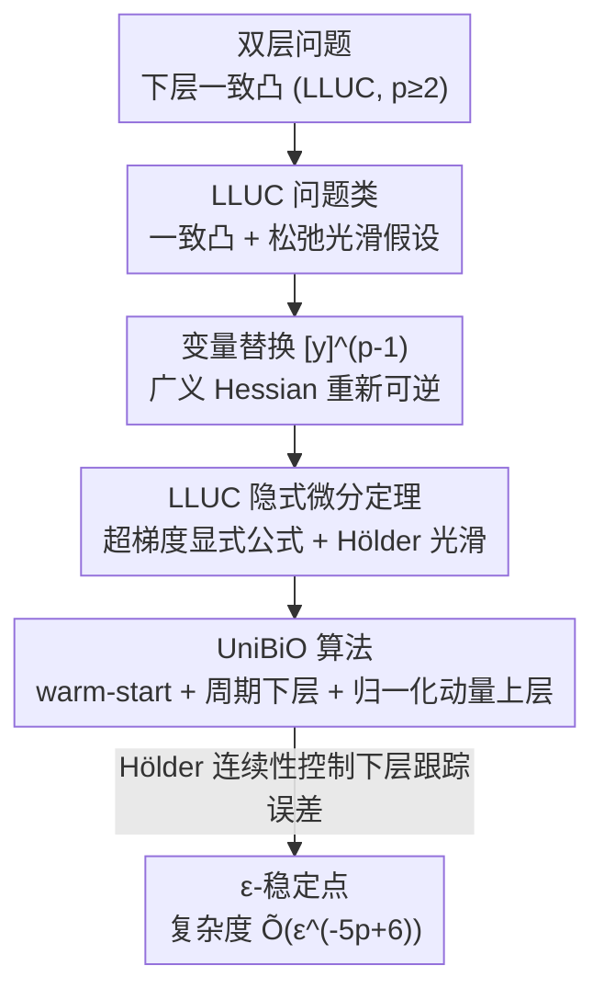

# Bilevel Optimization with Lower-Level Uniform Convexity: Theory and Algorithm

**会议**: ICLR2026  
**OpenReview**: [https://openreview.net/forum?id=dJgb3ngAvT](https://openreview.net/forum?id=dJgb3ngAvT)  
**代码**: https://github.com/MingruiLiu-ML-Lab/bilevel-optimization-lower-level-uniform-convexity  
**领域**: optimization  
**关键词**: 双层优化, 一致凸, 隐式微分, 超梯度, oracle 复杂度

## 一句话总结
本文用"下层一致凸（LLUC，指数 $p\ge 2$）"在下层强凸（$p=2$）与一般凸之间架起一座可解的桥梁，建立了一致凸条件下的隐式微分定理（给出超梯度显式公式与 Hölder 光滑性），并设计随机算法 UniBiO，证明其找到 $\epsilon$-稳定点的 oracle 复杂度为 $\widetilde{O}(\epsilon^{-5p+6})$，当 $p=2$ 退化为最优的 $\widetilde{O}(\epsilon^{-4})$。

## 研究背景与动机

**领域现状**：双层优化是一个层级结构——上层问题 $\min_x \phi(x):=f(x,y^*(x))$ 的可行域被下层问题 $y^*(x)\in\arg\min_y g(x,y)$ 约束，广泛用于超参数优化、元学习、数据清洗、神经架构搜索等。要给出非渐近收敛保证（在多项式时间内找到超梯度足够小的点），现有主流工作几乎都假设下层函数**强凸**，或满足 **Polyak-Łojasiewicz（PL）** 条件。这两个假设保证了下层 Hessian 非奇异，从而能用 Ghadimi & Wang (2018) 的标准隐式函数定理直接算超梯度 $\nabla\phi(x)$。

**现有痛点**：强凸/PL 在实际里并不总是成立。一个很自然的想法是放松到"一般凸"，但 Chen et al. (2024) 给出了一个相当负面的结论：对一般凸的下层函数，以"找小超梯度"为目标时双层优化本质上是**不可解的**——超目标 $\phi$ 可能不连续、甚至根本不存在稳定点。于是下层强凸（LLSC）与下层仅凸（LLC）之间形成了一道悬崖式的鸿沟。

**核心矛盾**：LLSC 太强（很多问题不满足），LLC 又太弱（理论上不可解）。两者之间是否存在一个**既比 LLC 强到可解、又比 LLSC 宽松**的中间函数类？

**本文目标**：识别这样一个可解的中间问题类，并在其上配套地解决两件事——(1) 下层 Hessian 可能奇异，标准隐式微分用不了；(2) 一致凸与标准光滑（$\nabla_y g$ 全局 Lipschitz）在无界域上**互不相容**，现有算法分析依赖的光滑假设失效。

**切入角度**：作者借用了优化理论里的"一致凸（uniform convexity）"概念——$g(x,y_2)\ge g(x,y_1)+\langle\nabla_y g(x,y_1),y_2-y_1\rangle+\frac{\mu}{p}\|y_2-y_1\|^p$，由指数 $p\ge 2$ 调控。$p=2$ 恰好就是强凸，$p\to\infty$ 越来越接近一般凸。这给了一个天然的、连续的插值刻度。

**核心 idea**：把下层假设从"强凸"换成"一致凸（LLUC）"，先在变量做 $[y]^{\circ(p-1)}$（逐元素 $p-1$ 次幂）的变量替换后，证明"广义 Hessian"重新变得可逆，从而恢复隐式微分；再针对随之而来的 Hölder（而非 Lipschitz）光滑超目标，设计带 warm-start + 周期性下层更新 + 归一化动量上层更新的随机算法 UniBiO。

## 方法详解

### 整体框架

本文是一篇**理论 + 算法**的论文，主线是两步：先建立"在 LLUC 下怎么算超梯度、超目标有多光滑"的隐式微分定理（第 4 节），再据此设计能匹配最优率的随机算法 UniBiO 并给出收敛证明（第 5 节）。

问题写成
$$\min_{x\in\mathbb{R}^{d_x}}\ \phi(x):=f(x,y^*(x)),\qquad y^*(x)\in\arg\min_{y\in\mathbb{R}^{d_y}} g(x,y),$$
只能通过随机 oracle 访问 $f,g$ 的随机梯度与随机 Hessian-向量积。关键障碍是：当下层一致凸但 $p>2$ 时，$g$ 在 $y$ 方向**不是强凸**，其 Hessian 可能在最优点退化奇异，所以 $\nabla\phi(x)=\nabla_x f-\nabla^2_{xy}g\,(\nabla^2_{yy}g)^{-1}\nabla_y f$ 这个经典公式里的 $(\nabla^2_{yy}g)^{-1}$ 直接失效。

整篇方法的逻辑链可以串成一条流水线：

### 关键设计

**1. LLUC 问题类：用一致凸指数 $p$ 在强凸与一般凸之间连续插值**

这是全文的地基，直接针对"强凸太强、一般凸不可解"的矛盾。作者把下层假设设为 $(\mu,p)$-一致凸（Assumption 3.2(i)）：$g(x,y_2)\ge g(x,y_1)+\langle\nabla_y g(x,y_1),y_2-y_1\rangle+\frac{\mu}{p}\|y_2-y_1\|^p$。$p=2$ 时退化为标准 $\mu$-强凸；$p$ 越大下层曲率越平、越接近一般凸。与之配套的是一个**松弛光滑**假设（Assumption 3.2(ii)）：$\|\nabla^2_{yy}g(x,y)\|\le L_0+L_1\|\nabla_y g(x,y)\|$，而不是经典的全局 $L$-光滑。作者特别指出，标准 $L$-光滑在无界域上与一致凸**根本不相容**（一致凸要求梯度增长够快，而 $L$-光滑限制其线性增长），所以必须换成这种随梯度范数放大的松弛光滑，这正是本文区别于所有 LLSC 算法的前提性改动。

为说明这类问题真实存在，作者给了具体例子：$\ell_p$ 范数回归的数据清洗任务，下层 $g(w,\lambda)=\frac{1}{n}\|\Lambda(Xw-\bar y)\|_p^p+c\|w\|_p^p$（$\Lambda=\mathrm{diag}(\sigma(\lambda_i)^{1/p})$）在 $p>2$ 时是一致凸但**非强凸**——它真的落在 LLC 与 LLSC 之间。

**2. LLUC 隐式微分定理：变量替换让奇异 Hessian 复活，超梯度回到显式公式**

这是论文的核心技术贡献，解决"奇异 Hessian 让经典隐式微分失效"的痛点。诀窍是不直接对 $y$ 微分，而是对 $[y]^{\circ(p-1)}$（逐元素 $p-1$ 次幂）微分，定义"广义 Hessian" $\frac{d\nabla_y g(x,y)}{d[y]^{\circ(p-1)}}$。作者证明（Lemma B.2）这个广义 Hessian 的最小特征值 $\lambda_{\min}\ge\mu>0$，因而**可逆**——这恰好补回了被 $p>2$ 破坏的非退化性。于是 Theorem 4.1 给出超梯度的显式公式：
$$\nabla\phi(x)=\nabla_x f(x,y^*)-\nabla^2_{xy}g(x,y^*)\Big(\tfrac{d\nabla_y g(x,y^*)}{d[y^*]^{\circ(p-1)}}\Big)^{-1}\tfrac{df(x,y^*)}{d[y^*]^{\circ(p-1)}}.$$
$p=2$ 时它精确退化成 Ghadimi & Wang (2018) 的经典公式。更重要的是它刻画了超目标的**光滑性退化**：$\phi$ 不再是 Lipschitz 光滑，而是 **Hölder 光滑**——
$$\|\nabla\phi(x_1)-\nabla\phi(x_2)\|\le L_{\phi_1}\|x_1-x_2\|^{\frac{1}{p-1}}+L_{\phi_2}\|x_1-x_2\|,$$
并配套一条下降不等式 $\phi(x_1)\le\phi(x_2)+\langle\nabla\phi(x_2),x_1-x_2\rangle+\frac{(p-1)L_{\phi_1}}{p}\|x_1-x_2\|^{\frac{p}{p-1}}+\frac{L_{\phi_2}}{2}\|x_1-x_2\|^2$。直观上 $p$ 越大、$\frac{1}{p-1}$ 越小，Hölder 指数越差，超目标越"粗糙"，这正是后面复杂度随 $p$ 变差的根源。证明思路靠两条引理：(a) 下层最优解映射 $y^*(x)$ 是 **Hölder 连续**的（Lemma 4.2），$\|y^*(x_2)-y^*(x_1)\|\le l_p\|x_2-x_1\|^{\frac{1}{p-1}}$，$p=2$ 退化为通常的 Lipschitz；(b) 上述广义 Hessian 可逆。这个定理本身是独立有意义的，可推广到多层/极小极大优化。

**3. UniBiO 算法：warm-start + 周期性下层更新 + 归一化动量上层更新**

有了超梯度公式还不够——最朴素的做法是每步把下层迭代到足够接近 $y^*(x)$ 再更新上层，但这样 oracle 复杂度太高。UniBiO（Algorithm 2）用三个机制压低复杂度。其一，**warm-start**：开头固定 $x_0$，用 Epoch-SGD（Algorithm 1）把下层 $y$ 先充分预热一段。其二，**下层周期性更新**：之后每隔 $I$ 步才用 Epoch-SGD 重新更新一次下层（而非每步都更新）；这之所以可行，正是因为 Lemma 4.2 保证 $y^*(x)$ 随 $x$ 缓慢移动——由于上层用归一化更新 $\|x_{t+1}-x_t\|=\eta$ 恒定，$\|y^*_{t+1}-y^*_t\|\le l_p\eta^{\frac{1}{p-1}}$，只要 $\eta$ 小、$I$ 不太大，周期更新出来的 $y_t$ 仍是 $y^*(x_t)$ 的好估计。其三，**上层归一化动量**：$m_t=\beta m_{t-1}+(1-\beta)\hat\nabla f(x_t,y_t;\bar\xi_t)$，$x_{t+1}=x_t-\eta\,\frac{m_t}{\|m_t\|}$，其中 $\hat\nabla f$ 用 Neumann 级数近似公式（4）逼近超梯度里的逆矩阵。下层用的 Epoch-SGD 变体带"收缩球（shrinking ball）"策略：每个 epoch 把投影半径按 $D_{k+1}=D_k/2^{1/p}$、迭代数按 $T_{k+1}=2^\tau T_k$（$\tau=2(p-1)/p$）、步长减半地调整，以适配一致凸 + 松弛光滑下的收敛分析。算法骨架与 Hao et al. (2024) 的 BO-REP 相似，但因为这里是 Hölder 光滑超目标 + 一致凸下层，学习率、周期长度、迭代数等超参选择**截然不同**。

**4. 收敛分析：把 Hölder 光滑下降不等式 + 下层跟踪误差 + 累积偏差三件事拼成 $\widetilde{O}(\epsilon^{-5p+6})$**

这是把前三块兑现成复杂度的一步。Theorem 5.1 在 Assumption 3.2–3.4 下，取 $K_t=\widetilde{O}(\epsilon^{-2p+2})$、$I=O(\epsilon^{-2})$、$1-\beta=\Theta(\epsilon^2)$、$\eta=\Theta(\epsilon^{3p-3})$、$T=O(\Delta_\phi/(\eta\epsilon))$，则以至少 $1-\delta$ 概率有 $\frac{1}{T}\sum_t\mathbb{E}\|\nabla\phi(x_t)\|\le\epsilon$，总 oracle 复杂度 $\widetilde{O}(\epsilon^{-5p+6})$。证明的关键是三条引理：Lemma 5.2 + Corollary 5.3 用对**任意缓变序列**成立的高概率论证，把下层跟踪误差 $\|y_t-y^*_t\|$ 控制在 $\min\{\epsilon/4L_{\phi_2},1/L_1\}$ 内（这样做避开了上下层随机性的耦合）；Lemma 5.4 控制超梯度估计的累积偏差 $\sum_t\mathbb{E}\|m_t-\nabla\phi(x_t)\|$，在 $1-\beta$ 和 $\eta$ 都取小值时该偏差只以 $T$ 的次线性速率增长；最后用 Theorem 4.1 的 Hölder 下降不等式把这两块代入，得到收敛率。**$p=2$ 时复杂度变为 $\widetilde{O}(\epsilon^{-4})$，与随机双层优化在 LLSC 下关于 $\epsilon$ 的最优率一致**（差对数因子）；这是 LLUC 下的首个非渐近结果，至于 $p>2$ 时 $\epsilon$ 依赖是否紧仍未知。

### 损失函数 / 训练策略
本文非"训练损失"范式。核心训练循环即 Algorithm 2（UniBiO）：warm-start → 每 $I$ 步用收缩球 Epoch-SGD 更新下层 → 每步用 Neumann 近似的超梯度做归一化动量上层更新。关键超参的量级（$\eta,I,1-\beta,K_t$）由 Theorem 5.1 显式给出，且都随 $p$ 退化以补偿超目标变粗糙。

## 实验关键数据

实验只为**验证理论**（"$p$ 越大收敛越慢"）和**验证 UniBiO 有效性**，不追求大规模 SOTA。

### 主实验

| 任务 | 设置 | 对比对象 | 关键结论 |
|------|------|----------|----------|
| 合成任务 | $g=\frac{1}{p}y^p-y\sin x$，上层非凸 / 下层一致凸，$p\in\{2,4,6,8\}$，$T=500$，下层 100 步 | 自身不同 $p$（附录另比 StocBiO/TTSA/MA-SOBA） | 超梯度范数曲线随 $p$ 增大收敛变慢，确定性与含噪 $N(0,0.01)/N(0,1)/N(0,10)$ 四种情形一致符合理论 |
| 数据清洗 | 噪声 SNLI 文本分类，标签翻转概率 $\tilde p=0.1$，下层带 $\|w\|_p^p$ 正则（$p=3$），3 层 RNN（300/4096/3） | StocBio, TTSA, SABA, MA-SOBA, SUSTAIN, VRBO | UniBiO 在训练/测试准确率与"准确率 vs. 运行时间"上均优于全部基线，兼具更高精度与更强计算效率 |

### 消融实验

论文未给传统模块消融表，而是以"扫 $p$"作为核心分析变量：

| 配置（$p$） | 现象 | 说明 |
|------|---------|------|
| $p=2$（强凸特例） | 收敛最快 | 复杂度退化为最优 $\widetilde{O}(\epsilon^{-4})$ |
| $p=4$ | 明显变慢 | 超目标 Hölder 指数 $\frac{1}{p-1}$ 变小 |
| $p=6,8$ | 进一步变慢 | 与 $\widetilde{O}(\epsilon^{-5p+6})$ 的 $p$ 依赖一致 |

### 关键发现
- **$p$ 是复杂度的唯一主导参数**：合成实验里不论有无噪声、噪声多大，$p$ 越大超梯度范数收敛越慢，定量印证 $\widetilde{O}(\epsilon^{-5p+6})$ 中的 $-5p$ 项。
- **变量替换是奇异 Hessian 可解的关键**：经 $[y]^{\circ(p-1)}$ 替换后广义 Hessian 最小特征值 $\ge\mu$，否则 $p>2$ 时根本算不出超梯度。
- **周期性下层更新省 oracle 而不损精度**：依赖 $y^*(x)$ 的 Hölder 连续性，下层不必每步更新，这是压低复杂度的核心。

## 亮点与洞察
- **用"一致凸指数 $p$"把一个离散对立（强凸 vs. 一般凸）变成连续刻度**：这让"可解性"从非黑即白变成随 $p$ 平滑退化，并精确量化到复杂度 $\widetilde{O}(\epsilon^{-5p+6})$ 上，思路非常干净，可复用到极小极大/多层优化。
- **变量替换 $[y]\to[y]^{\circ(p-1)}$ 复活奇异 Hessian**：这是最"啊哈"的一步——不去修改问题，而是换一个微分变量，让退化的二阶信息在新坐标下重新非退化，从而把整套隐式微分机器搬过来。
- **Hölder 光滑超目标的算法适配**：把归一化动量 + 周期更新这套（原本服务 Lipschitz 光滑）推广到 Hölder 光滑，并把超参随 $p$ 缩放，这套"按光滑度退化调参"的范式可迁移到其他非 Lipschitz 光滑的双层/复合优化问题。

## 局限与展望
- 作者承认 $p>2$ 时复杂度关于 $\epsilon$ 是否**紧**仍未知，缺少匹配的下界。
- 假设较多且偏强：Assumption 3.2–3.3 需要广义 Jacobian/导数对 $[y]^{\circ(p-1)}$ 可微且 Lipschitz、有界（$\le C$），并要求 light-tailed 噪声以做高概率分析；这些在更一般问题上未必成立。
- 实验规模小（合成 + 单个 SNLI 数据清洗、3 层 RNN），未在大模型超参优化等现实场景验证；$p$ 需要事先知道或假定，实际中如何估计/选取一致凸指数尚未讨论。
- 复杂度随 $p$ 指数式恶化（$-5p$），当 $p$ 较大时算法实用性会显著下降。

## 相关工作与启发
- **vs Ghadimi & Wang (2018)（LLSC 隐式微分）**：他们在强凸下用标准 Hessian 求逆得超梯度；本文在一致凸下 Hessian 可能奇异，改用 $[y]^{\circ(p-1)}$ 替换后的广义 Hessian 求逆，$p=2$ 时精确退化为他们的结果，是其严格推广。
- **vs Chen et al. (2024)（一般凸不可解）**：他们证明 LLC 下找小超梯度不可解；本文指出只要再多一点曲率（一致凸）就重新可解，正好填补 LLSC↔LLC 的鸿沟。
- **vs Hao et al. (2024) BO-REP**：算法骨架（warm-start + 周期下层 + 归一化动量）相似，但 BO-REP 面向强凸下层 + 松弛光滑超目标，UniBiO 面向一致凸下层 + Hölder 光滑超目标，超参选择与分析技术差异很大。
- **vs Iouditski & Nesterov (2014) 等一致凸单层优化**：他们研究单层一致凸（有界梯度/高阶光滑）的最优一阶/高阶方法；本文把一致凸搬到双层的**下层**，且无界梯度、用一阶 oracle，是不同的设定与挑战。

## 评分
- 新颖性: ⭐⭐⭐⭐⭐ 首次用一致凸架起 LLSC↔LLC 鸿沟，并给出配套隐式微分定理与首个非渐近算法
- 实验充分度: ⭐⭐⭐ 实验只为验证理论，规模偏小，缺大场景与下界
- 写作质量: ⭐⭐⭐⭐ 理论脉络（问题类→隐式微分→算法→收敛）清晰，假设与退化情形交代到位
- 价值: ⭐⭐⭐⭐ 为放松双层下层假设提供了干净且可推广的理论框架

<!-- RELATED:START -->

## 相关论文

- [\[NeurIPS 2025\] Learning Theory for Kernel Bilevel Optimization](../../NeurIPS2025/optimization/learning_theory_for_kernel_bilevel_optimization.md)
- [\[NeurIPS 2025\] An Adaptive Algorithm for Bilevel Optimization on Riemannian Manifolds](../../NeurIPS2025/optimization/an_adaptive_algorithm_for_bilevel_optimization_on_riemannian_manifolds.md)
- [\[ICML 2026\] Lower Complexity Bounds for Nonconvex-Strongly-Convex Bilevel Optimization with First-Order Oracles](../../ICML2026/optimization/lower_complexity_bounds_for_nonconvex-strongly-convex_bilevel_optimization_with_.md)
- [\[ICLR 2026\] Faster Gradient Methods for Highly-Smooth Stochastic Bilevel Optimization](faster_gradient_methods_for_highly-smooth_stochastic_bilevel_optimization.md)
- [\[ICLR 2026\] Reducing Contextual Stochastic Bilevel Optimization via Structured Function Approximation](reducing_contextual_stochastic_bilevel_optimization_via_structured_function_appr.md)

<!-- RELATED:END -->
