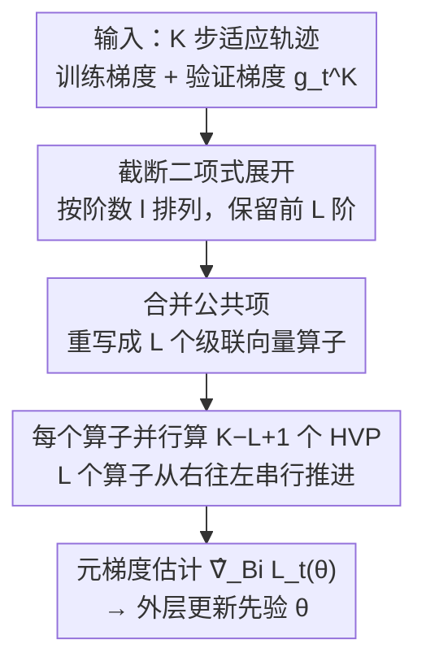

# Binomial Gradient-Based Meta-Learning for Enhanced Meta-Gradient Estimation

**会议**: ICLR2026  
**OpenReview**: [https://openreview.net/forum?id=mKgUAO41zf](https://openreview.net/forum?id=mKgUAO41zf)  
**代码**: 待确认  
**领域**: 优化 / 元学习 / 双层优化  
**关键词**: 元学习, 元梯度估计, MAML, 二项式展开, 截断反向传播

## 一句话总结
针对 MAML 这类基于梯度的元学习中"元梯度反向传播随适应步数 K 线性变贵"的痛点，本文把元梯度的连乘式 $\prod_{k}(I-\alpha H_k)$ 做**截断二项式展开**而不是简单截断尾部，得到的估计器 BinomMAML 在相同截断阶数 $L$ 下保留更多二阶信息、误差以**超指数速度**随 $L$ 衰减，且可用并行 HVP 计算，在 miniImageNet/tieredImageNet 上以略增开销换来明显更接近完整 MAML 的精度。

## 研究背景与动机
**领域现状**：元学习希望从一批相关任务里学到一个"任务无关先验"，使得新任务即便只有很少样本也能快速适应。其中最主流的一支是**基于梯度的元学习（GBML）**，代表作 MAML——它把先验编码成所有任务共享的初始化 $\theta$，然后对每个任务跑 $K$ 步梯度下降得到任务专属参数 $\phi_t^K(\theta)$，再用验证损失反向更新 $\theta$。

**现有痛点**：训练 $\theta$ 需要计算"元梯度"$\nabla L_t(\theta)$，而由链式法则它是一串 Hessian 相关项的连乘

$$\nabla L_t(\theta)=\prod_{k=0}^{K-1}\big(I_d-\alpha H_t^k\big)\,g_t^K,\qquad H_t^k:=\nabla^2\ell_t^{\mathrm{trn}}(\phi_t^k),\ g_t^K:=\nabla\ell_t^{\mathrm{val}}(\phi_t^K).$$

这条连乘的时间与空间复杂度都是 $O(Kd)$，随适应步数 $K$ 线性增长，使 MAML 难以扩展到需要大 $K$ 的场景。

**核心矛盾**：精度和复杂度的 trade-off。为省钱，现有近似器都在"砍信息"：一阶方法 FOMAML 直接令所有 $H_t^k=0$，复杂度降到 $O(d)$ 但丢掉全部二阶信息，误差大、收敛慢；截断反向传播 TruncMAML 只保留**最后 $L$ 步**的二阶项 $\prod_{k=K-L}^{K-1}(I-\alpha H_t^k)g_t^K$，复杂度 $O(Ld)$，可它的误差随 $L$ 衰减得很慢——必须 $L$ 接近 $K$ 才够准，等于没省多少。iMAML 走隐函数定理路线，但依赖解的近似最优性、数值不稳。

**本文目标**：在不放弃二阶信息的前提下，找一种"截断方式"，让元梯度估计误差随截断阶数 $L$ **快速**衰减，从而用远小于 $K$ 的开销拿到接近完整 MAML 的精度。

**切入角度**：作者注意到上面的连乘以及 TruncMAML 的截断本质上都是**一条无法并行的串行 HVP 链**——你只能从右往左一项一项乘。既然现代 GPU 算力富余，为什么不在每一步 HVP 旁边**并行地多算一些项**，把更多信息塞进估计里？

**核心 idea**：不要简单地"截掉尾巴"，而是把连乘 $\prod_k(I-\alpha H_t^k)$ 按**二项式定理展开**成按阶数 $l$ 排列的多项式，再**按阶截断**到 $L$ 阶。低阶项贡献大、高阶项 $O(\alpha^{L+1})$ 可忽略，于是在相同 $L$ 下能保留比 TruncMAML 多得多的信息，且这些项天然可并行。

## 方法详解

### 整体框架
BinomGBML 解决的是同一个问题——估计 MAML 的元梯度 $\nabla L_t(\theta)$——但换了一种"截断"方式。输入是 $K$ 步适应轨迹上的训练梯度 $\{\nabla\ell_t^{\mathrm{trn}}(\phi_t^k)\}$、验证梯度 $g_t^K$、步长 $\alpha$ 和截断阶 $L$；输出是元梯度估计 $\hat\nabla_{\mathrm{Bi}}L_t(\theta)$，再喂给外层优化器更新 $\theta$。

整条管线分三步：先把元梯度的矩阵连乘**二项式展开**成按阶数排列的求和式并截断到 $L$ 阶；由于直接展开后项数高达 $\sum_{l=1}^L\binom{K}{l}$、暴力算不动，第二步**合并公共项**，把这堆求和重写成 $L$ 个级联的算子；第三步把级联算子落成 Algorithm 1，每个算子内部含 $K-L+1$ 个相互独立、可在 GPU 上**并行**的 HVP，从右往左串行地推进 $L$ 个算子得到最终估计。

### 关键设计

**1. 截断二项式展开：把"截尾巴"换成"按阶数保留信息"**

这一点正面打击 TruncMAML"误差随 $L$ 衰减太慢"的痛点。作者把矩阵连乘按二项式定理展开——对标量有 $(1+z)^K=\sum_{l=0}^K\binom{K}{l}z^l$，推广到矩阵连乘就得到

$$\prod_{k=0}^{K-1}(I_d-\alpha H_t^k)=I_d+\sum_{l=1}^{K}\sum_{0\le k_{1:l}\uparrow<K}\prod_{i=1}^{l}(-\alpha H_t^{k_i}),$$

其中 $\{0\le k_{1:l}\uparrow<K\}$ 表示从 $\{0,\dots,K-1\}$ 里取 $l$ 个**严格递增**下标的所有 $\binom{K}{l}$ 种组合。每个 $l$ 阶项形如 $\prod_{i}(-\alpha H_t^{k_i})=O(\alpha^l)$，在 $\alpha$ 较小时随阶数 $l$ 指数衰减。于是只保留前 $L$ 阶就得到估计器

$$\hat\nabla_{\mathrm{Bi}}L_t(\theta)=\Big[I_d+\sum_{l=1}^{L}\sum_{0\le k_{1:l}\uparrow<K}\prod_{i=1}^{l}(-\alpha H_t^{k_i})\Big]g_t^K,$$

被丢掉的高阶项小到 $O(\alpha^{L+1})$。和 TruncMAML 只留"最后 $L$ 步的连乘"相比，二项式展开在同样的 $L$ 阶里**横跨整条轨迹**取组合，信息量大得多——以 $L=1$ 为例，$\hat\nabla_{\mathrm{Bi}}L_t(\theta)=g_t^K-\alpha\sum_{k=0}^{K-1}H_t^k g_t^K$，把所有 $K$ 个一阶 Hessian 项都用上了，而 TruncMAML($L=1$) 只用最后一步那一个。

**2. 合并公共项 → 级联向量算子：让指数级项数变成 $O(L)$ 个并行算子**

二项式展开虽准，但直接算的话项数是 $\sum_{l=1}^L\binom{K}{l}$，组合爆炸。这一设计解决"如何高效落地"。作者发现这些项里有大量公共的连乘前缀可以复用，于是定义算子把它们折叠起来：记 $P_t^i:=\prod_{k=K-i}^{K-1}(I_d-\alpha H_t^k)$，命题 3.1 证明截断二项式展开恰好等于 $L$ 个矩阵算子的级联 $B_t^{L-1}B_t^{L-2}\cdots B_t^0 I_d$；定理 3.2 进一步把它降成**向量算子**版本

$$\hat\nabla_{\mathrm{Bi}}L_t(\theta)=B_t^{g_t^K,L-1}B_t^{g_t^K,L-2}\cdots B_t^{g_t^K,0}\,g_t^K,$$

每个算子作用在向量上、只需若干次 HVP（$Hv=\nabla_{\phi}\langle\nabla\ell^{\mathrm{trn}},v\rangle$）。关键是：这 $L$ 个算子必须从右往左**串行**推进，但**单个算子内部含 $K-L+1$ 个相互计算独立的 HVP，可在 GPU 上并行**。这就把指数级的项数压成了 $O(L)$ 步串行 + 每步并行，正是 idea 里"在每个 HVP 旁边并行多算信息"的具体实现（Algorithm 1）。因此 BinomMAML 的时间复杂度 $O(Ld)$ 与 TruncMAML 相同，空间复杂度 $O((K-L+1)d)$。

**3. 动态计算图管理：顺手治好 MAML 的显存可扩展性**

这是方法的一个"副产品"红利。普通 MAML 在算 $\phi_t^K$ 时会一次性建好并**常驻**全部 $K$ 张 HVP 计算图，空间 $O(Kd)$；BinomMAML 因为是边推进算子边算 HVP，可以**即用即建、用完即释放**计算图。结果是：当 $L=K$ 时 BinomMAML 时间复杂度和 MAML 相同，但空间复杂度大幅下降；一般 $L$ 下时间与 TruncMAML 相同，空间随 $L$ 仿射增长。代价是并行需要 $K-L+1$ 个计算核、以及并行调度的额外开销，但实测这部分开销相对 HVP 本身很小。

### 损失函数 / 训练策略
方法本身不改变 MAML 的双层目标，只替换其中元梯度的估计方式，因此可直接插进 MAML 的训练流程：内层 $K$ 步 GD 求 $\phi_t^K$，外层用 $\hat\nabla_{\mathrm{Bi}}L_t(\theta)$ 更新先验 $\theta$。两个边界情形值得记住：$L=0$ 时 BinomMAML 退化为 FOMAML；$L=K$ 时与完整 MAML 等价（但更省显存）。同样的展开思路也可推广到其他 GBML 变体，论文以 MAML 为范例。

## 实验关键数据

### 主实验
在 miniImageNet / tieredImageNet 上做 5-way few-shot 分类，元训练统一**早停**在 20,000 步以放大"元梯度误差拖慢收敛"的效应，括号内为相对完整 MAML 的精度差（越接近 0 越好）。

| 设置 | 方法 | miniImageNet 1-shot | miniImageNet 5-shot | tieredImageNet 1-shot |
|------|------|------|------|------|
| $L=0$ | FOMAML | 44.57 (-1.93) | 62.97 (-1.26) | 43.53 (-3.50) |
| $L=2$ | TruncMAML | 44.93 (-1.57) | 63.61 (-0.62) | 45.93 (-1.10) |
| $L=2$ | **BinomMAML** | **46.23 (-0.27)** | 63.49 (-0.74) | **46.20 (-0.83)** |
| $L=3$ | BinomMAML | 46.00 (-0.50) | 64.17 (-0.06) | 46.43 (-0.60) |
| $L=5$ | MAML（参照） | 46.50 | 64.23 | 47.03 |

相同 $L$ 下 BinomMAML 在多数情形超过 TruncMAML、全面优于 iMAML，且性能差随 $L$ 快速逼近完整 MAML——只需小 $L$ 就够。

### 消融 / 分析

| 维度 | 关键发现 | 说明 |
|------|---------|------|
| 截断阶 $L$（合成正弦回归） | BinomMAML($L=1$) 的元梯度误差 ≈ TruncMAML($L=4$)，$L\ge2$ 后误差几乎可忽略 | 二项式展开信息密度远高于截尾 |
| 同 $L$ 误差对比 | 同 $L=4$ 时 BinomMAML 的实际元梯度误差比 TruncMAML 低 $10^3\sim10^4$ 量级 | 经验收益甚至超过理论界 |
| 1-shot vs 5-shot | 1-shot 区间 BinomMAML 平均领先 TruncMAML +1.33，5-shot 缩到 +0.27 | 低数据时更吃精确元梯度；数据多时截尾靠平均也能凑合 |
| 时间/显存/算力 | 时间略高于 TruncMAML，但显存与算力远低于 vanilla MAML | 动态计算图管理的红利 |

### 关键发现
- **二项式展开是误差衰减的主因**：理论上 BinomMAML 误差以超指数速度随 $L$ 衰减，而 TruncMAML 衰减缓慢；经验误差差距甚至比理论界更大。
- **小 $L$ 即可逼近 MAML**：$L=2\sim3$ 时精度已非常接近 $L=K$ 的完整 MAML，意味着可以用远小于 $K$ 的开销拿到接近满血的元梯度。
- **低数据场景收益最大**：1-shot 比 5-shot 获益更明显，恰好对应元学习最需要发力的小样本设定。

## 亮点与洞察
- **换"截断的姿势"而非堆算力**：同样是把元梯度近似到 $L$ 阶，"按阶数二项式截断"比"截掉尾部 $K-L$ 步"信息密度高一个层次——这是个很可迁移的视角，凡是有"连乘/级联可截断"的地方都值得想想能不能按阶展开。
- **串行不可避免、但每步可并行**：把指数级项数折叠成 $L$ 个级联向量算子、每个算子内部并行 $K-L+1$ 个 HVP，巧妙地把"用更多算力换更准估计"落到了 GPU 友好的形式上。
- **顺带解决 MAML 显存瓶颈**：动态建/释放计算图让 BinomMAML 在 $L=K$ 时与 MAML 同精度却更省显存，是个"白捡"的工程红利。
- **理论很扎实**：在 Lipschitz 梯度、凸、局部强凸三套假设下都给出了 $e_t^{\mathrm{Bin}}<e_t^{\mathrm{Tr}}<e_t^{\mathrm{FO}}$ 的误差界，并证明 BinomMAML 的界超指数衰减。

## 局限与展望
- **依赖并行资源**：每个算子需要 $K-L+1$ 个计算核，无 GPU 或核数受限的系统上优势会打折扣；并行调度本身也有额外开销（实测较小但非零）。
- **理论界在凸假设下偏松**：在 Lipschitz-only 假设下三条界都 sharp，但凸假设下 BinomMAML 的上界是松的（虽然仍超指数衰减并优于 TruncMAML），实际误差比界小不少。
- **只在 MAML 上实证**：方法声称可推广到其他 GBML 变体，但论文仅以 MAML/few-shot 分类与正弦回归验证，更大模型/更长 $K$ 的扩展性留待后续。
- **小学习率前提**：超指数衰减需要 $\alpha=O(1/H)$ 这类"不太激进"的步长条件，$H$ 实践中难估。

## 相关工作与启发
- **vs FOMAML / Reptile**：一阶方法（$L=0$）直接丢掉二阶信息，误差大、收敛慢；BinomMAML 在 $L=0$ 时恰好退化成 FOMAML，往上每增一阶都按二项式塞回更多信息。
- **vs TruncMAML**：同为保留部分二阶信息，TruncMAML 截掉前 $K-L$ 步、只留尾部连乘，误差随 $L$ 慢衰减；BinomMAML 按阶数横跨全轨迹取组合，相同 $L$ 下信息更多、误差超指数衰减。
- **vs iMAML**：iMAML 用隐函数定理求闭式解，依赖解的近似最优性并需共轭梯度等内层求解器、数值不稳；BinomMAML 走显式反向传播路线，更稳定，实验中全面优于 iMAML。

## 评分
- 新颖性: ⭐⭐⭐⭐⭐ 把"截断反向传播"重构成"截断二项式展开"，视角新颖且自然
- 实验充分度: ⭐⭐⭐⭐ 合成+真实数据、误差/精度/时空开销都覆盖，但仅限 MAML 与小规模 few-shot
- 写作质量: ⭐⭐⭐⭐⭐ 动机—方法—理论—实验链条清晰，三套假设下的误差界完整
- 价值: ⭐⭐⭐⭐ 给 GBML 的元梯度估计提供了一个精度/开销更优的可插拔替代，低数据场景尤其实用

<!-- RELATED:START -->

## 相关论文

- [\[ICLR 2026\] Evaluating Data Influence in Meta Learning](evaluating_data_influence_in_meta_learning.md)
- [\[ICLR 2026\] Generalizable Heuristic Generation Through LLMs with Meta-Optimization](generalizable_heuristic_generation_through_llms_with_meta-optimization.md)
- [\[ICLR 2026\] $\mu$LO: Compute-Efficient Meta-Generalization of Learned Optimizers](mulo_compute-efficient_meta-generalization_of_learned_optimizers.md)
- [\[ICLR 2026\] Unbiased Gradient Estimation for Event Binning via Functional Backpropagation](unbiased_gradient_estimation_for_event_binning_via_functional_backpropagation.md)
- [\[ICLR 2026\] Corner Gradient Descent](corner_gradient_descent.md)

<!-- RELATED:END -->
