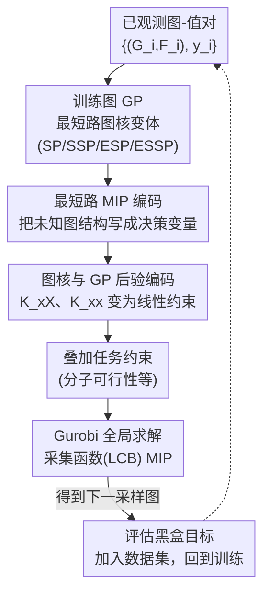

# BoGrape: Bayesian optimization over graphs with shortest-path encoded

**会议**: ICLR2026  
**OpenReview**: [https://openreview.net/forum?id=g0EbJrKFQJ](https://openreview.net/forum?id=g0EbJrKFQJ)  
**代码**: 待确认  
**领域**: optimization  
**关键词**: 贝叶斯优化、图优化、最短路图核、混合整数规划、分子设计  

## 一句话总结
BoGrape 把"在图结构本身上做贝叶斯优化"这件难事，转化成一个混合整数规划（MIP）问题：用决策变量精确刻画未知图的最短路结构，再把最短路图核与高斯过程后验编码进 MIP，从而对采集函数做**全局**优化、并能塞进分子可行性等任务约束，在合成基准和 QM7/QM9 分子设计上都打过现有图 BO 方法。

## 研究背景与动机
**领域现状**：很多科学与工程问题（分子设计、供应链、传感器布点、神经架构搜索）本质上是在**图**上优化一个昂贵的黑盒目标。黑盒 + 昂贵 → 梯度法和进化/种群法都不划算，贝叶斯优化（BO）因其样本效率成了首选。BO 需要两件东西：一个对目标做不确定性建模的代理模型（通常是高斯过程 GP），以及一个根据 GP 后验构造、用来挑下一个采样点的采集函数。把 BO 搬到图上，主流做法是给 GP 配一个图核。

**现有痛点**：图优化分两类——(i) 在**一张固定图的节点上**优化，(ii) 在**整个图空间上**优化图结构本身。后者难得多（结构本身是组合优化变量），却正是本文要解决的。现有图 BO 几乎都落在第一类：要么把搜索空间限死在一张给定图、有向标注图、无标注图等特殊子类，要么依赖任务专用的相似度度量，缺一个通用框架。更要命的是采集函数怎么优化：图空间同时含连续（节点特征）和离散（图结构）变量，现有方法只能用进化算法或随机采样去优化采集函数，这三件事都做不到——(i) 有效探索整个搜索域，(ii) 嵌入任务专属约束，(iii) 保证采集函数取到全局最优（而 BO 的收敛性证明几乎都建立在"每步都全局优化采集函数"这一假设上）。

**核心矛盾**：图 BO 缺一个"既能表达任意连通图结构、又能把采集优化做成可全局求解的优化问题"的统一形式。GNN 当代理虽能编码进 MIP，但 GNN 数据需求大、求解出来的 MIP 巨大、且本身不给不确定性，不适合做图 BO 的代理。

**本文目标**：(1) 对**未知**图结构 + 节点属性给一套能放进数学规划的精确表示；(2) 把图核与 GP 后验编码成约束，使采集函数优化变成一个可全局求解的 MIP；(3) 让框架天然兼容任务约束。

**切入角度**：作者注意到最短路（shortest-path, SP）图核既能处理有/无向图、又能考虑节点标签、还能刻画非相邻节点的关系，比基于子图模式的核更通用；而近年"把训练好的 ML 模型等价编码成 MIP 约束"的进展（GP/树/NN 都能编码）提供了把代理塞进决策问题的范式。两者一拼——只要能把"未知图的最短路结构"也写成 MIP 约束，整条链路就通了。

**核心 idea**：引入一组刻画最短路存在性、长度、路径经过节点的决策变量，证明这些变量的可行域与"所有 n 节点连通图"一一对应；再把最短路图核和 GP 后验都写成这些变量的线性/可处理表达式，于是采集函数全局优化 = 解一个混合特征 MIP。

## 方法详解

### 整体框架
BoGrape 就是标准 BO 循环，但把其中"优化采集函数"这一步换成解 MIP。每一轮迭代：(1) 用当前数据集 $X=\{(G_i,F_i),y_i\}$ 训练一个图 GP（核参数 $\alpha,\beta,\sigma_k^2$ 通过拟合学到）；(2) 把采集函数（论文以 LCB 为主）连同 GP 后验均值/方差写成优化目标与约束；(3) 关键的一步——把"下一个待采样图 $x=(G,F)$"当作决策变量，用最短路编码约束 + 图核约束把 $K_{xX_i}$、$K_{xx}$ 都表达出来，再叠加任务专属约束（如分子可行性），整体构成一个 MIP；(4) 用 Gurobi 全局求解，输出下一个采样图 $(G_t,F_t)$，评估其黑盒值，加入数据集，循环。

输入是已观测的图-值对，输出是每轮提议的新图。难点全集中在"图结构是未知决策变量"上：固定图时所有最短路信息都能用 Floyd–Warshall 算出来，但这里图还没定，必须把"最短路该满足什么关系"写成约束让求解器自己解出来。

### 关键设计

**1. 四种最短路图核变体：在表达力与可优化性之间铺一条谱**

图 BO 要先有个对图敏感、又能编码进 MIP 的核。论文从经典 SP 核出发：两图相似度由"对所有节点对，比较两端节点标签 + 比较两点间最短距离"累加而成，写成 Dirac 核的显式形式是统计"长度为 $s$、两端标签为 $(l_1,l_2)$ 的最短路出现次数"。作者一口气给了四个变体来覆盖不同需求：把节点标签也一起比的 **SP**；把标签从核里剥掉、只比最短路长度分布的简化版 **SSP**（$k_{SSP}=\frac{1}{n_1^2 n_2^2}\sum \mathbb{1}(d_{u_1,v_1}=d_{u_2,v_2})$，标签信息改由特征核承担）；以及对 SP/SSP 各取指数得到的非线性版 **ESP / ESSP**（$k_{ESP}=\exp(k_{SP})/\sigma_k^2$）。

这么设计是因为存在一个明确权衡：SP/SSP 预计算好所有最短路长度后其实是**线性核**，优化起来简单，但表达力弱、Gram 矩阵秩受限；ESP/ESSP 借鉴 RBF/Matérn 这类指数核实践中更强的经验，表达力更高、不确定性量化更准，代价是给后续优化引入额外难度（指数项要处理）。论文还证明四个核都是正定的（SSP 是"所有节点同标签"的 SP 特例，ESP/ESSP 是指数核故 PD）。此外把图核与特征核解耦——$k(X_1,X_2)=\alpha\cdot k_G(G_1,G_2)+\beta\cdot k_F(F_1,F_2)$，$\alpha,\beta$ 可学，避免"要求节点特征完全相同"导致匹配路径骤减、也避免对每对节点算复杂特征相似度带来的优化成本爆炸。

**2. 把未知图的最短路编码成 MIP 约束：核心技术贡献**

这是全文最硬的一块。难点在于：邻接矩阵就能表示图，但"最短路长度/路径经过哪些节点"在图未定时无法直接写出来。作者引入三组变量（节点数 $n$ 给定时）：边存在性 $A_{u,v}\in\{0,1\}$、最短距离 $d_{u,v}\in[n]$、以及"节点 $w$ 是否落在 $u\to v$ 最短路上"的 $\delta^w_{u,v}\in\{0,1\}$。受 Floyd–Warshall 启发，把这些变量之间该满足的关系写成一组线性约束（MIP-SP），核心几条是：相邻则距离 $\le 1$、不相邻则距离 $\ge 2$（$d_{u,v}\le 1+n(1-A_{u,v})$ 与 $d_{u,v}\ge 2-A_{u,v}$）；经过中间点 $w$ 时满足三角等式 $d_{u,v}=d_{u,w}+d_{w,v}$（用大 M 与 $\delta$ 联动）；以及对落在最短路上的节点数的上下界约束。

为什么这套约束是"对的"？论文证明了一个**双射定理**（Theorem 3.5）：对任意 $n$，MIP-SP 可行域里的每个解 $(A,d,\delta)$ 都唯一对应一个 $n$ 节点连通图，反之每个 $n$ 节点连通图也都是可行解。也就是说"满足这组约束"与"是一张合法连通图"完全等价——求解器在这组约束里搜，等价于在所有连通图里搜，既不漏也不多。论文进一步把它扩展到**图大小未知但有界** $[n_0,n]$ 的情形（用 $A_{v,v}$ 表示节点是否存在，把 $d$ 的取值域扩到 $[n+1]$ 用 $n$ 代表无穷），同样给出双射（Theorem 3.6），并在附录给出无向图的简化编码。

**3. 把图核与 GP 后验也写成约束：让采集函数全局优化变成解 MIP**

有了最短路变量，下一步是把核值 $K_{xX_i}=k(x,X_i)=\alpha\cdot k_G(G,G_i)+\beta\cdot k_F(F,F_i)$ 表达成它们的函数。对 SSP/SP，思路是引入指示变量 $d^s_{u,v}=\mathbb{1}(d_{u,v}=s)$（满足 $\sum_s d^s_{u,v}=1$、$\sum_s s\cdot d^s_{u,v}=d_{u,v}$），于是 $k_{SSP}(G,G_i)=\frac{1}{n^2 n_i^2}\sum_{u,v,s} D_s(G_i)\cdot d^s_{u,v}$，其中 $D_s(G_i)$ 是**已知图** $G_i$ 中长度为 $s$ 的最短路条数（常量）——核值就线性化了。SP 核类似，再多引入带标签的指示变量 $p^{s,l_1,l_2}_{u,v}$。

非平稳（指数）核里 $K_{xx}$ 不再是常量、是整个公式里最复杂的项：$k_{SSP}(G,G)$ 本是关于 $D_s=\sum_{u,v} d^s_{u,v}$ 的二次型，作者再套一层指示变量 $D^c_s=\mathbb{1}(D_s=c)$ 把二次型线性化成 $\frac{1}{n^4}\sum_{s,c} c^2 D^c_s$。指数核 ESP/ESSP 的指数项则交给 Gurobi 的动态外逼近（给定误差容限）处理。把这些全拼起来，采集函数（如 LCB：$\min\ \mu-\beta_t^{1/2}\sigma$，配 GP 后验均值/方差约束）优化就成了一个混合特征 MIP，配合 PK-MIQP 框架，享有**全局最优 + 后悔界**的理论保证——这正是采样/进化法给不了的。

**4. 任务专属约束的原生兼容：分子设计才真正用得上**

把采集优化做成 MIP 还有一个用进化/采样法换不来的红利：可以直接把问题专属约束写进同一个模型。合成基准里图可以是任意连通图，进化/采样法尚能凑合；但到了分子设计，分子图必须与原子特征兼容（化合价等），作者发现这种结构约束会让采样/进化法**几乎产生不出可行解**。BoGrape 直接从 Limeade 借来分子可行性约束加进 MIP，保证优化全程只在合法分子里搜，这也是它在 QM7/QM9 上能稳定跑赢的直接原因。

### 损失函数 / 训练策略
没有独立的训练损失：代理是 GP，核参数 $\alpha,\beta,\sigma_k^2$ 每轮在已观测数据上通过 GP 拟合（GPflow 实现）学得；优化端用 Gurobi 解 MIP，合成基准里观察到好解很早就被找到（剩余时间多花在证明最优性上），故设 600s 为 MIP 时间上限。

## 实验关键数据

实验用随机初始化的 GNN 当合成黑盒函数（GAT/GCN/GraphSAGE，各两层卷积 + 两层线性，隐层 64 维），用在 QM7/QM9 上训练好的 GNN 当分子属性预测器做真实案例。硬件为 4.2GHz i7-7700K + 16GB。

### 主实验

| 任务 | 设置 | 对比基线 | BoGrape 结果 |
|------|------|----------|--------------|
| 合成基准 | GAT/GCN/GraphSAGE，$N\in\{10,20\}$，10 初始 + 50 迭代 | Random、RW-rand、WL-rand、WL-evol（后者可视为图 BO 的 SOTA，改自 Ru et al. 2021 的 NAS 方法） | 四种核变体在多数情形下均优于基线 |
| 分子设计 | QM7 / QM9，$N\in\{10,20,30\}$ | Random（限定 Limeade 生成的可行分子）、RW/WL-rand（WL-evol 因产不出可行解被移除） | 不论用哪种核，普遍优于基线 |

### 模型预测对比（QM7，100 样本取 30 训练、预测剩余 70）

| 比较维度 | 发现 |
|----------|------|
| 预测精度 | 四种最短路核与经典图核相当 |
| 不确定性量化 | 两个指数核（ESP/ESSP）明显更准 |
| 加特征核项 | 普遍提升所有核的预测性能 |
| 大图（更大 N） | SP/ESP 这类更复杂的核预测更好（对最短路的匹配判据更严） |

### 关键发现
- **存在"表达力 ↔ 优化复杂度"的权衡**：图小时 SP/ESP 更强（更有表达力）；图大时反而是简单核（SSP/ESSP）在固定时间预算内能解出更好的解，因为复杂核让 MIP 太难、限时内求不出好解。
- **任务约束是分水岭**：分子设计里结构约束让采样/进化法基本产不出可行解，只有把约束写进 MIP 的 BoGrape（和受限的 Random）能跑——这说明"采集优化可嵌入约束"不是锦上添花而是刚需。
- **指数核换来的是更准的不确定性**，这对 BO 的探索-利用平衡直接有益。

## 亮点与洞察
- **用双射定理为"在图空间搜索"正名**：MIP-SP 可行域与所有 $n$ 节点连通图严格一一对应，把"启发式搜图"变成"在一个等价的精确优化域里搜"，这是把图优化从经验做法拉回有理论支撑的关键一步。
- **"已知图算常量、未知图设变量"的对称编码很漂亮**：同一套最短路量，给定图时用 Floyd–Warshall 当常量算，未知图时当决策变量约束，核值因此能线性表达——这个对称性是整套 MIP 能成立的支点。
- **把采集函数全局优化当作一等公民**：BO 收敛理论默认每步全局优化采集函数，但实际图 BO 几乎都用采样/进化"凑近似"。本文用 MIP 真正做到全局最优 + 后悔界，补上了理论与实践之间长期被忽略的缺口。
- **可迁移性**：这套"把代理模型 + 结构约束 + 采集函数统一编码成 MIP"的范式，可推广到神经架构搜索、传感器布点等其他带硬约束的组合 BO 任务。

## 局限与展望
- **计算成本是硬伤**：图一大，MIP 规模和求解时间快速膨胀，导致大图上只能退而用简单核换取限时内可解，牺牲了表达力（作者自己在附录 B.5 讨论了这一计算瓶颈）。
- **连通性假设**：当前编码要求图连通，作者把"放松连通性要求"列为未来工作。
- **聚焦无向图**：虽然 SP 核能处理有/无向图，BoGrape 实现上聚焦无向图。
- **基准是自造的**：图 BO 领域缺现成合成基准，作者用随机 GNN 自造（代码待评审后公开），其黑盒函数的代表性如何尚需更多验证。
- 个人观察：单核 CPU + Gurobi 的实验规模偏小（节点数到 30），更大分子/更大图上的可扩展性还需检验；指数核的指数项靠外逼近处理，误差容限对结果的敏感性值得进一步报告。

## 相关工作与启发
- **vs WL-evol（图 BO SOTA，改自 Ru et al. 2021 的 NAS 方法）**：它用 WL 核 + 进化算法优化采集函数，本文用最短路核 + MIP 全局优化。区别在于 BoGrape 能保证采集函数全局最优、能嵌入任务约束；在带结构约束的分子设计上 WL-evol 直接产不出可行解被移除，凸显了 MIP 路线的优势。
- **vs 固定图上的图 BO（Oh et al. 2019 / Wan et al. 2023 / Liang et al. 2024）**：它们的图核衡量"一张给定图上两节点的相似度"，只能在节点上优化；本文衡量"两张图的相似度"，真正在图结构空间上优化。
- **vs GNN-as-surrogate 的 MIP 方法（Zhang et al. 2023/2024、McDonald et al. 2024）**：同样走 MIP，但用 GNN 当代理数据需求大、MIP 巨大且无不确定性量化；本文用图 GP，既给不确定性又让 MIP 更可解。
- **vs PK-MIQP（Xie et al. 2024）**：本文复用其全局采集优化框架与后悔界理论，把它从连续/混合特征域扩展到图结构域，新增的是最短路与图核的 MIP 编码。

## 评分
- 新颖性: ⭐⭐⭐⭐⭐ 首个把"未知图最短路结构 + 图核 + GP 后验"统一编码进 MIP、并以双射定理保证等价的图 BO 框架。
- 实验充分度: ⭐⭐⭐⭐ 合成基准 + QM7/QM9 分子设计 + 多核对比较完整，但规模偏小、基准自造。
- 写作质量: ⭐⭐⭐⭐ 理论与编码推导清晰、配 Algorithm 与示意图；MIP 公式较密集，对非优化背景读者门槛偏高。
- 价值: ⭐⭐⭐⭐⭐ 为带硬约束的图组合 BO 提供了通用、有理论保证的范式，对分子设计等应用有直接价值。

<!-- RELATED:START -->

## 相关论文

- [\[ICLR 2026\] Combinatorial Bandit Bayesian Optimization for Tensor Outputs](combinatorial_bandit_bayesian_optimization_for_tensor_outputs.md)
- [\[ICLR 2026\] Adaptive Acquisition Selection for Bayesian Optimization with Large Language Models](adaptive_acquisition_selection_for_bayesian_optimization_with_large_language_mod.md)
- [\[ICLR 2026\] Symmetry-Aware Bayesian Optimization via Max Kernels](symmetry-aware_bayesian_optimization_via_max_kernels.md)
- [\[ICLR 2026\] Contextual Causal Bayesian Optimisation](contextual_causal_bayesian_optimisation.md)
- [\[ICLR 2026\] Generative Bayesian Optimization: Generative Models as Acquisition Functions](generative_bayesian_optimization_generative_models_as_acquisition_functions.md)

<!-- RELATED:END -->
