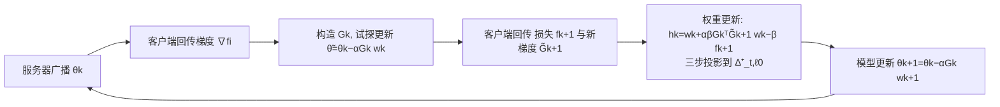

# Byzantine-Robust Federated Learning with Learnable Aggregation Weights

**会议**: ICLR 2026  
**OpenReview**: [https://openreview.net/forum?id=lXSrulux48](https://openreview.net/forum?id=lXSrulux48)  
**代码**: 待确认  
**领域**: optimization  
**关键词**: 联邦学习, 拜占庭鲁棒, 自适应聚合权重, 交替最小化, 收敛分析, 数据异质性  

## 一句话总结
把"检测并剔除恶意客户端"这件离散决策改写成对聚合权重 $w$ 的连续优化，并与全局模型 $\theta$ 联合求解，得到一个既能压制拜占庭客户端、又能在数据异质场景下自适应重加权诚实客户端的联邦学习框架 FedLAW，且带有可证明的鲁棒性与收敛保证。

## 研究背景与动机
- **领域现状**：联邦学习（FL）让客户端在不共享原始数据的前提下协作训练全局模型，FedAvg 用按数据量加权的平均聚合客户端更新。但恶意（拜占庭）客户端可以提交任意更新破坏全局模型。已有的鲁棒聚合方法分三类——基于距离（Krum）、基于统计量（Median、Trimmed Mean、Bulyan）、基于性能，核心都是先识别再剔除离群更新。
- **现有痛点**：据作者观察，几乎所有现有拜占庭鲁棒方法在剔除恶意客户端后，都给剩余诚实客户端分配**均匀权重**（退化回 FedAvg 式）。在数据异质（non-IID）场景下，剔除恶意客户端会进一步加剧剩余诚实客户端之间的标签/数据分布失衡，此时均匀权重无法适配这种失衡，导致对某些标签关注不足、精度下降。
- **核心矛盾**：异质场景下，"由数据异质引起的良性更新偏差"和"恶意客户端的污染更新"在表现上难以区分；而"剔除后均匀加权"的范式既丢掉了对剩余客户端分布失衡的补偿能力，又把鲁棒防御与训练目标割裂开来。
- **本文目标**：把拜占庭防御直接嵌入学习目标本身，让聚合权重既能将恶意客户端压到零、又能对诚实客户端按其数据分布自适应分配非均匀权重。
- **核心 idea**：**[把离散检测剔除转成连续权重优化]** 将聚合权重 $w$ 视为与全局模型 $\theta$ 同等地位的决策变量，在一个带稀疏-单位-上限单纯形约束的优化问题里联合学习二者，用交替最小化求解并给出鲁棒性与收敛证明。

## 方法详解

### 整体框架
FedLAW 把传统 FL 的"固定权重 + 事后剔除"重写为一个联合优化问题：在权重可行域 $\Delta^+_{t,\ell_0}$（稀疏、非负、单个权重上限为 $t$、非零元个数 $\le s$ 的单位单纯形）上联合最小化 $\sum_i w_i f_i(\theta)$。求解采用**嵌套式交替最小化**：内层对固定权重做一步模型梯度下降，外层在已知"权重如何影响模型更新"的前提下更新权重；权重更新通过对非凸目标做二次近似 + 投影到稀疏单纯形完成，模型更新则与标准 FL 完全一致。

### 关键设计

**1. 稀疏单位上限单纯形：把"剔除 + 上限"写进约束。** 可行域定义为 $\Delta^+_{t,\ell_0}=\{w\mid \sum_i w_i=1,\ w_i\ge 0,\ w_i\le t,\ \|w\|_0\le s\}$。其中 $\ell_0$ 伪范数约束 $\|w\|_0\le s$ 强制最多保留 $s$ 个非零权重，相当于把"最多剔除 $n-s$ 个（含拜占庭）客户端"写进约束；单个权重上限 $t$ 防止任何客户端独占聚合。一个漂亮的特例是：当 $t=1/(n-b_f)$、$s=n-b_f$ 时，唯一可行解恰好是"剔除 $b_f$ 个客户端、其余均匀加权"，即现有方法被当作本框架的特殊情形包含进来；放宽 $t$ 则允许对诚实客户端非均匀加权，正是异质场景所需的额外自由度。

**2. 嵌套重写 + 二次近似：让权重"看得见"它对模型更新的影响。** 作者没有用 BSUM、prox-linear 这类标准交替算法（实验发现其更新过于激进、忽略了两块变量间对检测有用的耦合），而是把问题重写为嵌套形式 $\min_{w}\min_{\theta}\sum_i w_i f_i(\theta)$。内层用二次近似 $\hat f_i(\theta;\theta_k)=f_i(\theta_k)+\langle\nabla f_i(\theta_k),\theta-\theta_k\rangle+\frac{1}{2\alpha}\|\theta-\theta_k\|^2$，解得 $\theta_{k+1}(w)=\theta_k-\alpha G_k w$，其中 $G_k=[\nabla f_1(\theta_k),\dots,\nabla f_n(\theta_k)]$。关键在于外层目标 $\Phi_k(w)=\sum_i w_i f_i(\theta_k-\alpha G_k w)$ **显式地把权重对模型更新的作用代入了损失**：它会优先给那些"梯度方向与下降方向一致"的客户端更大权重——诚实客户端梯度在参数空间形成连贯簇，而拜占庭客户端因偏离或不一致而成为离群点被自然压低。

**3. 三步投影到非凸稀疏单纯形（Theorem 1）：权重更新可高效精确求解。** 外层非凸，作者对 $\Phi_k$ 再做二次近似后，权重更新等价于一个邻近映射 $w_{k+1}=\mathrm{prox}_{\Delta^+_{t,\ell_0}}(h_k)$，即把 $h_k=w_k-\beta\nabla_w\Phi_k(w_k)$ 投影到非凸集合 $\Delta^+_{t,\ell_0}$。Theorem 1 证明该投影可由三步**精确**完成：(i) 稀疏化——取 $h_k$ 最大的 $s$ 个元素 $h_\lambda=P_{L_s}(h_k)$；(ii) 支撑选择 $S^*=\mathrm{supp}(h_\lambda)$；(iii) 在支撑集上投影到单位上限单纯形 $w_{k+1}^{S^*}=P_{\Delta^+_t}(h_\lambda^{S^*})$，其余置零。整个权重更新的服务器端开销为内存 $O(dn)$、计算 $O(n\min(s,\log n)+s^2)$，模型更新部分与标准 FL 完全相同，额外通信仅每轮两次通信轮（但因引入 $w$ 加速了模型收敛，总轮数未必翻倍）。

**4. 双重理论保证：鲁棒性（Theorem 2）与收敛（Theorem 3）相互锁定。** Byzantine-resilience 分析的起点是用带精确余项的泰勒定理把目标 (6) 改写为二次型 $w^\top G_k^\top G_k w=-\sum_i w_i\|v_{k,i}\|^2+\sum_{i,j}w_i w_j\|v_{k,i}-v_{k,j}\|^2$，从成对梯度距离出发证明高概率鲁棒：聚合器偏差 $\|\mathbb{E}\{\tilde F\}-g\|\le\eta_k$，其中 $\eta_k$ 被显式分解为损失异质、梯度异质、客户端间方差、mini-batch 采样噪声四项（采样噪声随批量 $B$ 增大而消失）。Theorem 3 进一步证明：即使在攻击下，自适应权重序列也会稳定到目标 (6) 的临界点，且算法在非凸/强凸两种情形下都收敛到最优解的邻域，误差半径由聚合器的渐近偏差与方差 $(\zeta_\infty,\sigma_{F,\infty})$ 决定，并满足 $\zeta_\infty\le\eta_\infty$——即"逐步鲁棒"的同一机制也界定了"长期收敛偏差"，把聚合层的静态鲁棒性与算法层的动态收敛统一起来。

## 实验关键数据

### 主实验设置与结果（MNIST / CIFAR10，200 客户端，non-IID）
- **数据集与模型**：MNIST（3 层全连接）、CIFAR10（4 层卷积 + group norm）。异质度由集中度参数 $q\in\{0.6,0.9\}$ 控制；恶意客户端比例 $\in\{0.1,0.2,0.3,0.4\}$。
- **攻击类型（5 种）**：label-flipping、inverse-gradient、backdoor、double（组合）、LIE（Little Is Enough）。
- **对比基线**：Krum、Trimmed Mean、Bulyan、Coordinate-wise Median、CCLIP、RFA、Huber Aggregator，以及它们与 Bucketing 的组合，外加无防御的 FedAvg。

| 场景 | FedLAW | 最优基线 | 优势 |
|------|--------|----------|------|
| MNIST，inverse-gradient，40% 恶意 | — | 次优防御 | 高 **3.6** 个百分点 |
| CIFAR10，label-flipping，$q{=}0.6$，40% 恶意 | **70.5%** | Bulyan 62.2% | **+8.3** pp |
| CIFAR10，inverse-gradient，$q{=}0.9$，40% 恶意 | **59.38%** | 56.24% | **+3.1** pp（RFA/CClip 发散） |
| MNIST，double attack，高异质 | 保持鲁棒 | RFA/RFA-bucketing 降 >31%，CClip 发散 | 显著 |

### 关键发现
- **极端污染下优势最大**：恶意比例越高、异质度越大，FedLAW 相对基线的优势越明显；许多基线（RFA、CClip 及其 bucketing 变体）随攻击比例上升急剧退化甚至发散，FedLAW 则"优雅降级"、跨攻击比例精度稳定。
- **权重快速收敛**：聚合权重 $w$ 通常在前 20 轮内稳定，之后更新影响可忽略；恶意客户端权重被持续压到接近零（图 1 右），是 $\zeta_k\to 0$ 的经验证据。
- **双管齐下**：鲁棒性来自 (i) 识别并剔除恶意客户端 + (ii) 对剩余诚实客户端自适应重加权，后者正是传统"剔除后均匀加权"范式缺失的部分。

## 亮点与洞察
- **范式转换**：把"离散的检测-剔除"重写为"连续的权重优化"，让现有"剔除后均匀加权"方法成为本框架的一个特例（$t=1/(n-b_f),s=n-b_f$），在概念上非常干净。
- **耦合是关键**：外层目标显式代入"权重如何改变模型更新 $\theta_k-\alpha G_k w$"，使权重优化天然偏好与下降方向一致的诚实梯度簇，无需额外设计检测器。
- **理论闭环**：鲁棒性界 $\eta_k$ 与收敛偏差 $\zeta_\infty\le\eta_\infty$ 用同一量锁定，把聚合器的静态鲁棒性与算法的动态收敛统一证明，并覆盖 non-iid、mini-batch、高概率等更贴近实际的设定。
- **工程友好**：服务器端额外开销仅一次稀疏单纯形投影（$O(n\min(s,\log n)+s^2)$），模型更新与标准 FL 一致，且 $\ell_2$ 裁剪等假设本就是 FedAvg/DP-Fed 常规操作。

## 局限与展望
- **两次通信轮/每 epoch**：FedLAW 每个训练 epoch 需两轮通信（先收梯度、再收试探点处的损失与新梯度），虽因加速模型收敛而总轮数未必翻倍，但在通信受限场景仍是额外成本。
- **cross-silo 设定**：面向客户端数量适中、长期在线的 cross-silo（医院、金融机构）场景；大规模 cross-device、客户端频繁掉线/采样的情形未充分验证。
- **实验规模有限**：仅在 MNIST/CIFAR10 + 浅层网络上验证，未涉及大模型、复杂任务或真实异质数据；攻击假设了范数受限 $\|b_{k,i}\|\le\max_j\|\tilde v_{k,j}\|$（靠服务器端梯度裁剪保证），更强或自适应攻击下的表现待考。
- **超参敏感性**：稀疏度 $s$、上限 $t$、两个步长 $\alpha,\beta$ 的选择对鲁棒性-精度权衡影响较大，实际部署需调参（论文在附录 I 给出敏感性分析）。

## 相关工作与启发
- **鲁棒聚合三流派**：距离型（Krum、Bulyan）、统计型（Median、Trimmed Mean）、性能型——本文揭示它们共享"剔除后均匀加权"的盲点，并把异质场景下的标签失衡补偿作为新维度。
- **CCLIP / RFA / Bucketing / Huber**：异质鲁棒 FL 的代表性强基线，本文在高异质 + 高污染下展示了它们的退化/发散，凸显自适应重加权的价值。
- **嵌套/双层优化与 prox 投影**：把权重当决策变量、用嵌套重写避开 BSUM/prox-linear 的"过激更新"，并给出非凸稀疏单纯形的精确三步投影，是可迁移到其他"软选择"问题（如客户端选择、数据加权、鲁棒回归）的技巧。
- **启发**：当"硬性剔除离群点"会损失有用信息时，"把离散选择松弛成连续可学权重并嵌入目标"往往能同时兼顾鲁棒性与适配性——这一思路对带噪标签学习、数据重加权、混合专家路由等都有借鉴意义。

## 评分
- **新颖性**: ⭐⭐⭐⭐ 把拜占庭检测-剔除重写为连续权重优化、并将现有范式作为特例包含，配合稀疏单位上限单纯形约束，思路新颖且自洽。
- **实验充分度**: ⭐⭐⭐ 覆盖 5 种攻击 × 2 数据集 × 多异质度/污染比例，对比基线丰富，但仅限小数据集 + 浅层网络，缺大规模与真实异质验证。
- **写作质量**: ⭐⭐⭐⭐ 问题动机清晰、方法推导（嵌套重写→二次近似→三步投影）层层递进，理论与实验呼应到位。
- **价值**: ⭐⭐⭐⭐ 在高异质 + 高污染场景下相对强基线有稳定且可观的提升，且带可证明的鲁棒性与收敛保证，对 cross-silo 鲁棒 FL 有实用价值。

<!-- RELATED:START -->

## 相关论文

- [\[ICML 2026\] Delayed Momentum Aggregation: Communication-efficient Byzantine-robust Federated Learning with Partial Participation](../../ICML2026/optimization/delayed_momentum_aggregation_communication-efficient_byzantine-robust_federated_.md)
- [\[ICLR 2026\] DeepAFL: Deep Analytic Federated Learning](deepafl_deep_analytic_federated_learning.md)
- [\[ICLR 2026\] Distributionally Robust Linear Regression with Block Lewis Weights](distributionally_robust_linear_regression_with_block_lewis_weights.md)
- [\[ICLR 2026\] Beyond Aggregation: Guiding Clients in Heterogeneous Federated Learning](beyond_aggregation_guiding_clients_in_heterogeneous_federated_learning.md)
- [\[ICLR 2026\] FedMuon: Federated Learning with Bias-corrected LMO-based Optimization](fedmuon_federated_learning_with_bias-corrected_lmo-based_optimization.md)

<!-- RELATED:END -->
