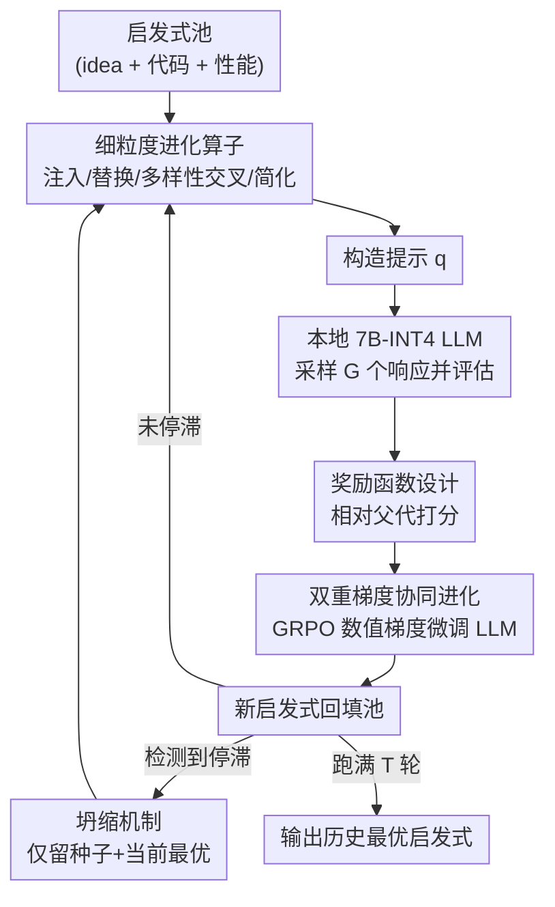

# CALM: Co-evolution of Algorithms and Language Model for Automatic Heuristic Design

**会议**: ICLR2026  
**OpenReview**: [https://openreview.net/forum?id=x6bG2Hoqdf](https://openreview.net/forum?id=x6bG2Hoqdf)  
**代码**: https://github.com/whxru/CALM  
**领域**: 优化 / 自动启发式设计 / LLM  
**关键词**: 自动启发式设计, LLM 进化搜索, GRPO, 组合优化, 协同进化

## 一句话总结
CALM 让"生成启发式的提示词进化"和"底层 LLM 本身"同时进化——在 LLM 驱动的进化式启发式设计循环里，把每轮"提示-响应-性能"三元组当作强化学习数据，用 GRPO 在线微调一个本地 7B INT4 模型，使得单张 24GB 显卡跑出来的启发式在多个组合优化任务上超过依赖 GPT-4o-mini API 的 SOTA 方法。

## 研究背景与动机
**领域现状**：很多实际优化问题（物流、调度、路径规划）长期依赖专家手工设计启发式，费时费力。近两年兴起的"LLM-based Automatic Heuristic Design (AHD)"把 LLM 当成启发式生成器、把进化计算（EC）当成搜索框架：LLM 根据当前精英启发式的描述、代码和分数生成新候选，候选被仿真评估后再反哺到下一轮提示里，形成"评估-生成"的反馈进化循环（如 FunSearch、EoH、ReEvo、MCTS-AHD）。

**现有痛点**：这些方法几乎都**只动提示、不动模型**——它们通过操纵提示生成过程（作者称之为"verbal gradient / 语言梯度"）来引导启发式进化，底层 LLM 参数始终冻结。这意味着进化循环里产生的大量"哪种生成方式更管用"的信号被白白浪费，LLM 自身的生成能力从头到尾没有因为反馈而变强。

**核心矛盾**：进化循环天然会源源不断产生"提示-响应-性能"三元组，每个启发式的好坏其实就是对"底层生成过程是否有用"的隐式监督信号；但固定模型的范式没有任何机制去消化这个信号。结果是高质量结果只能靠更强（也更贵）的商用 API 模型堆出来。

**本文目标**：把 AHD 从"只优化提示"升级为"同时优化提示生成过程和 LLM 模型本身"，并且要在本地小模型上做到——既省钱又能反超 API。

**切入角度**：作者观察到，如果把启发式生成既当作优化目标、又当作训练数据来源，就能用强化学习把性能反馈转成"numerical gradient / 数值梯度"去微调 LLM，让模型逐步内化"成功启发式长什么样"。

**核心 idea**：用"语言梯度（改提示）+ 数值梯度（GRPO 微调 LLM）"的混合引导，让算法和语言模型**协同进化（co-evolution）**，而不是只让算法进化、模型旁观。

## 方法详解

### 整体框架
CALM 维护一个启发式池，池里每个启发式都带有三样东西：自然语言 idea、源代码、以及实测性能 $g(h)=\mathbb{E}_{x\in D}[-f(h(x))]$（越大越好）。每一轮，CALM 先从一组进化算子里选一个可行算子，结合从池中采样的启发式构造出新的提示 $q$；本地 LLM $\pi_\theta$ 针对 $q$ 采样出一组 $G$ 个响应，逐个执行评估；评估结果一方面转成奖励喂给 GRPO 在线微调 LLM（这就是"数值梯度"），另一方面把新产生的可行启发式加回池中。若搜索陷入停滞，坍缩机制会重置种群以逃离局部最优。跑满 $T$ 轮后返回历史最优启发式。

整个流程的两个新维度是：**算子层面**用细粒度变异 + 多样性感知交叉来更精准地控制启发式变化；**模型层面**用 GRPO + 定制奖励让 LLM 随搜索一起变强。下图给出这条协同进化回路：

### 关键设计

**1. 双重梯度协同进化：让 LLM 随搜索一起进化，而不是旁观**

这是 CALM 区别于所有 SOTA 的根本点。以往方法只有"语言梯度"——靠改提示去引导生成；CALM 额外引入"数值梯度"——把每个启发式的性能反馈当作强化学习信号去微调 LLM 本身。具体做法是采用 GRPO（DeepSeek-R1 同款、省显存的 RL 算法）：对每个提示 $q$ 采样一组 $G$ 个响应 $\{o_i\}$，按相对奖励算出每个 token 的优势 $\hat{A}_{i,t}=(r_i-\text{mean}(r))/\text{std}(r)$，再用带裁剪和 KL 正则的目标 $J_{GRPO}(\theta)$ 更新参数。GRPO 用组内均值奖励当 baseline，省掉了价值网络，因此能在单张 24GB 卡上微调 INT4 量化的 7B 模型（只调 1.15% 权重）。其效果是：随着搜索进行，LLM 逐步内化"成功启发式"的特征，后期生成质量持续上升——训练曲线显示 CALM 早期因 GPT-4o-mini 抢跑而落后，但 GRPO 适配后反超所有 baseline。

**2. 细粒度进化算子：更精准地控制启发式如何变异**

GRPO 给整条响应的每个 token 按"整体响应相对好坏"分配优势，但启发式往往改一个子组件性能就会剧烈波动，对所有部分一刀切地赋同向梯度并不可靠。为此 CALM 设计了一套算子让变异"动得更小、更有意义"，从而让 GRPO 更容易识别出单个结构改动的贡献。其中**注入（injection）**让 LLM 在已有启发式里加一个**新**组件，并强制写出该组件的简短描述存入全局库，后续注入必须引入与库中已存不同的组件以促进多样性；和旧方法"给一堆完整代码让它生成一个不同的"不同，注入只给一个基启发式 + 已探索组件的紧凑摘要，省 context 又更聚焦未探索方向。**替换（replacement）**让 LLM 在指定指令下重写某个组件，除了常见的"改超参"，还新增两条指令：把"实例无关的决策规则"改成"实例相关的"、把"对所有候选均等赋分的片段"改成"按上下文表现区分赋分的"。**多样性感知交叉（diversity-aware crossover）**每次随机在"按性能选双亲"和"第一亲按性能、第二亲按多样性排名选"之间二选一，多样性定义为 $\text{div}(h_{c,1},h)=|\text{idea\_token}(h)\setminus\text{idea\_token}(h_{c,1})|/|\text{idea\_token}(h)|$，保证至少一个高质量亲本、另一个要么高性能要么结构新颖。**简化（simplification）**专门压缩因反复注入/交叉/替换而臃肿冗余的启发式——消融显示去掉它掉点最多，因为只有它在对抗其它算子带来的"代码膨胀"。

**3. 坍缩机制：用概率性重启逃离近亲繁殖导致的局部最优**

LLM 进化搜索能成功，是因为含更优启发式的提示倾向于引导出更优的后代，形成自增强回路；但这也会"近亲繁殖"——种群逐渐被当前最优的微小变体占满，长期没有突破就困在局部最优。CALM 的对策是：当检测到停滞（持续多轮无全局更优）时，丢弃池里除"原始种子算法"和"当前最优启发式"外的全部个体，用这两个作为新一轮搜索的种子，既保留过往进展又甩掉积累的遗传冗余。触发由一个无突破计数器 $c_n$ 控制：每轮若有响应刷新全局最优则 $c_n$ 清零，否则加一；每轮末以 $\text{random}(0,1)<c_n\delta_0$ 或 $c_n\ge C$ 触发坍缩，其中 $\delta_0\ll1$ 控制坍缩概率增速、$C$ 是硬上限。作者还给出触发前期望轮数的解析近似 $\mathbb{E}[c_n\mid \text{collapse},\,C>1/\delta_0]\approx\sqrt{\pi}/(2\delta_0)$ 来辅助调参。这种"渐升概率 + 固定上限"的设计在"给搜索足够改进空间"和"避免无限停滞"之间取得平衡。

**4. 奖励函数设计：相对父代打分，避免把功劳/罪过全算在 LLM 头上**

奖励要鼓励 LLM 生成可行、新颖、高性能的启发式，所以采用渐进式分级：非法响应 < 重复启发式 < 新启发式 < 新的高性能启发式。关键巧思在于：生成质量其实受提示里的基启发式影响，不该把全部功过都归给 LLM，于是奖励**相对于提示中最优基启发式 $h_{t\_base}$** 来算改进量 $\Delta(h_{new},h_{t\_base})=\text{clip}\big(|g(h_{new})-g(h_{t\_base})|/\min\{|g(h_{new})|,|g(h_{t\_base})|\},0,1\big)$。最终奖励为：与某基启发式性能相同时给一个小而稳定的 $\alpha_1 r_{invalid}$（抑制平凡复制）；低于最优基时给按 $\Delta$ 缩放的负奖励 $\alpha_2 r_{invalid}\cdot\Delta$；高于最优基时给从 1 起步的正奖励 $1+\Delta$。这样奖励主要由"是否超过最优基启发式"决定、再用相对差距调节强度。消融显示，换成"相对种子算法按性能给正奖励"或"$\{0.5r_{rand},1\}$ 改进式奖励"都更差，前者在 OP 上甚至不如不用 RL 的基线。

### 损失函数 / 训练策略
模型基于 Unsloth，采用 INT4 量化的 Qwen2.5-7B-Instruct，仅微调 1.15% 权重，全程单张 24GB GPU。优化目标即 GRPO 的 $J_{GRPO}(\theta)$（含裁剪比率 $\hat{r}_{i,t}=\pi_\theta(o_{i,t}\mid q,o_{i,<t})/\pi_{\theta}^{old}(o_{i,t}\mid q,o_{i,<t})$ 和 KL 正则项 $\beta D_{KL}[\pi_\theta\|\pi_{ref}]$）。除 OBP 外所有任务固定 2000 次 LLM 查询预算（OBP 也只用 2000，而以往 AHD 方法常用 4000+）。

## 实验关键数据

### 主实验
覆盖四类对 LLM-based AHD 仍有挑战的优化任务：在线装箱（OBP）、逐步构造下的旅行商（TSP）、ACO 框架下的带容量车辆路径（CVRP）和定向越野（OP）。对比手工启发式（Best-Fit/GC/ACO）、神经组合优化（POMO/DeepACO）和一众 LLM-based AHD（FunSearch/EoH/ReEvo/HSEvo/OpenEvolve/MCTS-AHD/EvoTune）。

| 任务 | 指标 | CALM(本地+GRPO) | 之前最优 LLM-AHD | 说明 |
|--------|------|------|----------|------|
| OBP（6 测试集均值最优间隙） | gap↓ | **0.71%** | MCTS-AHD 0.89% | 1k_500 上达 0.00%（精确最优）|
| OBP（CALM API 版 w/o GRPO） | gap↓ | 0.82% | 与 MCTS-AHD 持平/更优 | 仅靠语言梯度即进第一梯队 |
| TSP N=200（out-of-domain） | gap↓ | **13.41%** | MCTS-AHD 13.71% | 该尺度还超过需逐尺度训练的 POMO(20.45%) |
| CVRP N=200 | gap↓ | **3.95%** | MCTS-AHD 4.70% | 全测试集均超所有 LLM-AHD |
| OP N=200 | gap↓ | **12.58%** | MCTS-AHD 16.34% | out-of-domain 全面领先 |

核心结论：用 GRPO + 定制奖励后，本地 INT4 量化的 7B 模型导出的启发式不仅追平、还**反超**基于 GPT-4o-mini 的启发式——而后者用的是明显更强的 API 模型。

### 消融实验（OBP / OP 最优间隙，越小越好）

| 配置 | OBP | OP | 说明 |
|------|---------|------|------|
| CALM（本地, w/ GRPO） | 0.71% | 17.41% | 完整模型 |
| CALM（API, w/o GRPO） | 0.82% | 19.13% | 去掉数值梯度，仅语言梯度 |
| local, w/o GRPO | 1.78% | 19.89% | 去 GRPO 掉点最多 |
| rew = performance | 1.24% | 21.30% | 换奖励：OP 甚至不如不用 RL |
| w/o Collapse | 0.98% | 19.57% | 去坍缩机制 |
| w/o simplification | 1.35% | 19.45% | 算子中去掉它掉点最大 |
| w/o diversity（交叉只按性能） | 1.05% | 19.44% | 比完全不用交叉还差 |

### 关键发现
- **RL（GRPO）贡献最大**：在几乎所有消融里，禁用 GRPO 造成的性能下降都是最大的，印证"协同进化"中数值梯度是核心引擎。
- **简化算子最关键**：算子里去掉简化掉点最多，因为只有它在对冲其它算子导致的启发式膨胀/冗余。
- **多样性比交叉本身更重要**：交叉若只按性能选亲本（去多样性），效果反而比完全不用交叉还差，说明多样性感知是这个最常用算子的灵魂。
- **坍缩需要合理容忍度**：$\delta_0=0.005,\,C=15$ 这种"最不容忍无突破"的激进配置反而最差（OP 上有一次跑到第 132 次查询后再无突破），耐心与早停要平衡。

## 亮点与洞察
- **把进化循环的"副产品"变成训练数据**：以往大家只把"提示-响应-性能"三元组用来更新提示，CALM 第一个意识到它同时是绝佳的 RL 监督信号，从而把"改算法"和"改模型"统一进一个回路——这是最让人"啊哈"的视角转换。
- **奖励相对父代而非绝对性能**：把功劳/罪过相对提示里的最优基启发式来分配，巧妙地剥离了"提示本身带来的红利"，让 RL 学到的是 LLM 真正的边际贡献，这个 credit assignment 思路可迁移到任何"生成结果质量受输入上下文强影响"的 RL 微调场景。
- **小模型 + RL 反超大模型 API**：单张 24GB 卡、INT4 量化 7B、只调 1.15% 权重就能超过 GPT-4o-mini 驱动的 SOTA，给"资源受限下做 AHD"提供了极具说服力的范式。
- **坍缩机制的解析可调**：用 $\sqrt{\pi}/(2\delta_0)$ 估计触发前期望轮数，把一个工程 trick 做成了可分析、可调参的模块。

## 局限与展望
- **任务局限于经典组合优化**：实验集中在 OBP/TSP/CVRP/OP 这类有明确仿真评估的问题；对评估代价极高或无现成 solver 近似最优解的问题，奖励信号的获取与可靠性存疑。
- **依赖可执行+可评估的启发式**：方法假设每个生成的启发式都能被快速执行并打分，评估开销大的领域可能难以撑起 2000 次查询的预算。
- **INT4 量化牺牲精度**：作者自己指出量化进一步降低了 7B 的原始精度，最终靠 RL 把差距补回来；这意味着收益部分来自"用 RL 弥补量化损失"，在更强基座上增益是否同样显著有待验证。
- **超参敏感**：坍缩的 $\delta_0,C$、奖励的 $\alpha_1,\alpha_2,r_{invalid}$ 都需要调；激进坍缩配置会明显恶化，鲁棒性还有提升空间。

## 相关工作与启发
- **vs MCTS-AHD / ReEvo / EoH（固定模型的 LLM-AHD）**：它们都只改提示、冻结 LLM（纯语言梯度），且多依赖商用 API；CALM 额外用 GRPO 在线微调本地小模型（数值梯度），在多数任务上反超，且省钱可本地部署。
- **vs EvoTune / 同期 DPO 式微调 AHD**：同样想微调 LLM，但 EvoTune 等多用偏好式 DPO；CALM 改用分数式 RL（GRPO），并配套细粒度算子和相对父代的奖励，消融显示其奖励设计优于朴素 performance/improvement 奖励。
- **vs 神经组合优化 POMO/DeepACO**：NCO 直接学策略解实例、常需按尺度重训；CALM 在 meta 层学"生成启发式的算法结构"，对新尺度泛化更自然，TSP N=200 上甚至超过 POMO。
- **vs AlphaDev / GP 等传统/RL meta-search**：它们重度依赖手工搭的算法构件；CALM 借 LLM 在开放启发式空间里以极少先验探索，减少了人工介入。

## 评分
- 新颖性: ⭐⭐⭐⭐⭐ 首个把"提示进化 + LLM 在线微调"统一进 AHD 回路、提出语言梯度+数值梯度协同进化的框架。
- 实验充分度: ⭐⭐⭐⭐ 覆盖四类任务、三类基线、详尽消融与训练曲线；但任务仍限于经典组合优化，强基座上的增益未验证。
- 写作质量: ⭐⭐⭐⭐⭐ 动机层层递进，方法各模块"为什么这么做"交代清晰，坍缩机制还给了解析近似。
- 价值: ⭐⭐⭐⭐⭐ 单张 24GB 卡上用 7B 反超 GPT-4o-mini SOTA，为资源受限的自动启发式设计提供了强范式。

<!-- RELATED:START -->

## 相关论文

- [\[ICML 2026\] PathWise: Planning through World Model for Automated Heuristic Design via Self-Evolving LLMs](../../ICML2026/optimization/pathwise_planning_through_world_model_for_automated_heuristic_design_via_self-ev.md)
- [\[ICLR 2026\] AutoEP: LLMs-Driven Automation of Hyperparameter Evolution for Metaheuristic Algorithms](autoep_llms-driven_automation_of_hyperparameter_evolution_for_metaheuristic_algo.md)
- [\[ICML 2026\] Automatic Unsupervised Ensemble Outlier Model Selection–Extended Version](../../ICML2026/optimization/automatic_unsupervised_ensemble_outlier_model_selection--extended_version.md)
- [\[ICLR 2026\] Generalizable Heuristic Generation Through LLMs with Meta-Optimization](generalizable_heuristic_generation_through_llms_with_meta-optimization.md)
- [\[AAAI 2026\] Co-Layout: LLM-driven Co-optimization for Interior Layout](../../AAAI2026/optimization/co-layout_llm-driven_co-optimization_for_interior_layout.md)

<!-- RELATED:END -->
