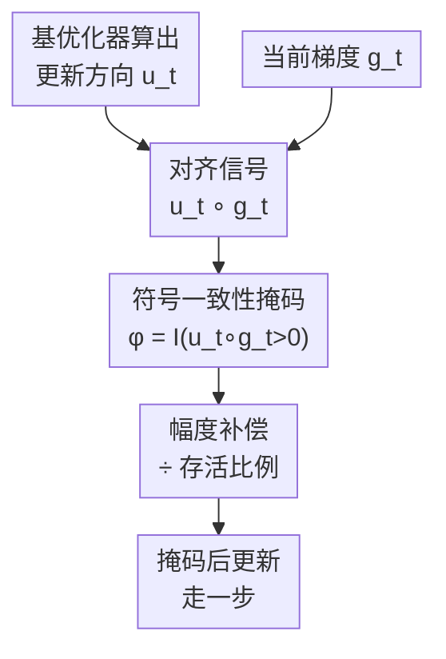

# Cautious Optimizers: Improving Training with One Line of Code

**会议**: ICLR2026  
**OpenReview**: [https://openreview.net/forum?id=zBPZeRjfgu](https://openreview.net/forum?id=zBPZeRjfgu)  
**代码**: 待确认  
**领域**: 优化器 / LLM 预训练  
**关键词**: 动量优化器, 符号一致性掩码, 哈密顿动力学, 单调下降, AdamW

## 一句话总结
给任意动量优化器加一行代码：只在「更新方向」与「当前梯度」符号一致的坐标上更新，否则把这些坐标的更新清零并按比例放大补偿，由此得到 C-AdamW / C-Lion 等"谨慎版"，在不动原超参的前提下持续加速 LLM 预训练和图像分类。

## 研究背景与动机
**领域现状**：自 Adam / AdamW 提出近十年来，它一直是 Transformer 预训练的默认优化器。社区不断尝试更快更稳的替代品——Lion、SHAMPOO、SOAP、ADOPT、Schedule-Free 等，每个都声称大幅超越 AdamW。

**现有痛点**：这些新优化器要拿到宣称的收益，往往需要重新做非平凡的超参搜索（尤其是学习率、动量系数），调参成本高，迁移到新模型/新数据时还得再来一遍。这极大限制了它们的落地——大多数实际训练仍然用 AdamW 当主力，因为换优化器的风险和工程代价太大。

**核心矛盾**：动量类优化器的更新方向 $u_t$ 并不总是和当前梯度 $g_t=\nabla L(w_t)$ 对齐。动量带有"惯性"，会让参数在某些坐标上继续沿历史方向冲，即使这个方向此刻会让损失短暂上升。也就是说，损失 $L(w_t)$ 沿轨迹**不是单调下降**的，会震荡、过冲，拖慢收敛。

**本文目标**：能不能在**完全不改原优化器超参**、不增加显存、几乎不增加计算的前提下，消除这种"逆梯度"的浪费动作，让训练更稳更快？

**切入角度**：作者注意到，真正"帮倒忙"的恰恰是那些 $u_t$ 与 $g_t$ 符号相反的坐标——在这些坐标上更新，会让损失在该方向上升。那就干脆**别在这些坐标上动**。这个观察可以直接落成一个逐元素掩码，不触碰优化器内部状态。

**核心 idea**：用 $u_t \circ g_t > 0$ 构造一个对齐掩码，把符号不一致的坐标的更新清零、再按存活比例放大补偿幅度——一行 PyTorch 即可，把任意动量优化器变成"谨慎"版本，并能从理论上证明它既保留原优化器的收敛保证、又额外让损失单调下降。

## 方法详解

### 整体框架
谨慎优化器（Cautious Optimizer）不是一个新优化器，而是套在任何动量优化器外面的**一层后处理**。基优化器照常算出它的更新方向 $u_t$（Adam、Lion、Polyak/Nesterov 动量都行），谨慎层只做三件事：① 拿 $u_t$ 和当前梯度 $g_t$ 逐元素相乘，得到对齐信号 $u_t\circ g_t$；② 对乘积为正（同号）的坐标保留更新、为负（异号）的坐标清零，构成掩码 $\phi_t = \mathbb{I}(u_t\circ g_t>0)$；③ 因为掩掉一部分坐标会让整体步长变小，用存活坐标的比例对学习率做放大补偿，最后用掩码后的更新走一步。

核心修改就是把原始更新 $w_{t+1}\leftarrow w_t-\epsilon_t u_t$ 换成：

$$w_{t+1}\leftarrow w_t-\epsilon_t\, u_t\circ\phi(u_t\circ g_t),$$

其中 $\circ$ 是逐元素积。论文给出的极简 PyTorch 实现就是文中那"一行代码"（Algorithm 1）：先算对齐掩码 `m = (u*g > 0)`，再做 `p.add_(u * m / (m.mean()+eps), alpha=-lr)`——`m.mean()` 正是存活比例，除以它实现幅度补偿。

### 关键设计

**1. 符号一致性掩码：只在"更新方向和梯度同号"的坐标上更新**

这一步直接针对动量带来的逆梯度过冲。对每个坐标 $i$，看 $u_t$ 和 $g_t$ 的符号是否一致：一致（$u_{t,i} g_{t,i}>0$）说明朝这个方向走确实能降损失，保留；不一致说明动量惯性正在把参数往损失上升的方向推，清零。形式上掩码为 $\phi(v)=\mathbb{I}(v>0)$ 作用在 $v=u_t\circ g_t$ 上。这样修改后的更新与梯度的内积非负，由一阶 Taylor 展开可得

$$L(w_{t+1})-L(w_t)\approx-\epsilon_t\,(u_t\circ g_t)^\top\phi(u_t\circ g_t)\le 0,$$

即步长足够小时损失**单调下降**——这是普通动量法即便用无穷小步长也保证不了的（惯性会带来震荡）。关键在于它只读符号、不碰优化器内部的一阶/二阶动量状态，所以"零侵入"。

**2. 幅度补偿：掩掉一部分坐标后，把步长按存活比例放大**

只清零会有副作用：被掩掉的坐标越多，这一步实际走的总幅度越小，相当于隐式缩小了学习率。作者引入一个正的缩放因子 $\alpha$ 来补偿：

$$\alpha(v)=\frac{\dim(v)}{\mathrm{nnz}(v>0)+\xi},$$

其中 $\dim(\cdot)$ 是总坐标数、$\mathrm{nnz}(v>0)$ 是存活（同号）坐标数，$\xi>0$ 默认取 $1$。直观上 $\alpha$ 就是"总数 / 存活数"，存活坐标越少补偿越大，使掩码后的平均更新幅度大致回到原来的水平。在 C-AdamW（Algorithm 2）里这写成把学习率乘 $\frac{d}{\|\phi_t\|_0+1}$。正是这个补偿让谨慎版不必重调原优化器的学习率就能用——这是它"免调参"的工程关键。

**3. 哈密顿 + 下降的理论保证：既不破坏原收敛性，又额外降损失**

作者把常见动量法统一进一个连续时间的"阻尼哈密顿系统"框架：存在 Lyapunov / 哈密顿函数 $H(w,s)=L(w)+K(s)$（$L$ 是势能即真实损失、$K$ 是动量带来的动能），满足 $\min_s H(w,s)=L(w)$。原系统只保证 $H$ 单调不增，而 $L$ 本身可以临时上升（损失换动能）。谨慎动力学把更新方向 $\nabla K(s)$ 按 $\phi(\nabla L\circ\nabla K)$ 重新加权后，定理 2.1 证明：只要 $\phi$ 满足 $x^\top\phi(x)\ge 0$，就有 $\frac{d}{dt}L(w_t)\le 0$（$L$ 也单调下降）；若进一步满足 $x^\top(1-\phi(x))\le 0$，则 $H$ 和 $L$ 都比原系统降得更快。默认掩码 $\phi(v)=\alpha(v)\mathbb{I}(v\ge 0)$（$\alpha\ge 1$）正好满足这些条件。推论 2.2 还说明：算法不会卡在非平稳点——因为动量会持续累积梯度，即便某一步 $u_t$ 完全与 $g_t$ 冲突被整体掩掉，迟早会重新转成与 $g_t$ 正内积。

**4. 离散时间下的单步占优与一整族新优化器**

连续时间之外，作者在离散时间证明谨慎版"每一步至少不比基优化器差"。定理 2.3：在 $\mu$-光滑损失下，从同一点 $(w_t,s_t)$ 出发，存在一段步长范围使 $L(w_{t+1})\le L(\bar w_{t+1})$（谨慎版降得更多）；定理 2.4 给出一类更严格的掩码 $\phi_k=\alpha_k\mathbb{I}(\nabla L\circ u_k\ge\frac{\mu\sigma}{2}u_k\circ u_k)$，保证每步严格降损失。作者也诚实指出：多步占优一般不成立（两个优化器一步后就走到损失曲面不同区域，可构造反例），这与"没有免费午餐"定理一致；但深度学习实际损失上单步优势通常能自然延续到多步，由实验佐证。更重要的是，满足条件 (6) 的 $\phi$ 不止一种选择，因此理论同时揭示了**一整族**谨慎优化器，文中只挑了最简单的那个（硬掩码 + 比例补偿）做实验。

### 一个例子：2D 二次函数上的对比
取 $L(w)=\kappa w_1^2+w_2^2$（$\kappa=4$，最优点在原点），从 $(1,1)$ 出发。普通带动量梯度下降 GDM 即使用理论最优的 $(\epsilon,\beta)$，轨迹仍明显过冲、绕圈、损失震荡下降；谨慎版 C-GDM 在相同超参下轨迹更平滑、过冲更小，并且 $L(w_t)$ 单调下降、连原 GDM 的哈密顿量都降得更快。作者还在 $(\epsilon,\beta)$ 网格上画收敛率热力图：所有谨慎变体的最优收敛率都低于 GDM 的闭式最优率 $\frac{\sqrt\kappa-1}{\sqrt\kappa+1}$，且在超参取得不理想时谨慎掩码让收敛更鲁棒（"不会更差，常常更好"）。

## 实验关键数据

### 主实验
**LLaMA-100M 在 C4 上预训练**（batch 至 2M token、共 50B token，约 25× Chinchilla）。报告最终评估困惑度（越低越好）：

| 优化器 | 最优 lr | 困惑度 | 谨慎版 | 谨慎版困惑度 |
|--------|---------|--------|--------|--------------|
| AdamW | 1e-2 | 18.965 | C-AdamW | **18.684** |
| Lion | 3e-4 | 21.401 | C-Lion | **19.795** |

谨慎版在各学习率下普遍更优，且不改变基优化器超参搜索的最优点；Lion 实验里 C-Lion 甚至能容忍更高学习率、在基线发散处仍稳定训练。

**FineWeb-Edu 上的 scaling（1× Chinchilla，逐尺度细调超参）**：

| 规模 | AdamW | C-AdamW | 提升 (%) |
|------|-------|---------|----------|
| 130M | 27.39 | 27.30 | 0.33 |
| 300M | 18.30 | 18.28 | 0.10 |
| 520M | 15.07 | 14.92 | 1.00 |
| 1.2B | 11.36 | 11.32 | 0.32 |

各尺度上 C-AdamW 一致优于 AdamW。1.2B 检查点的 7 项下游评测中谨慎版赢 5 项（MMLU、OpenBookQA、Arc Easy、HellaSwag、Arc Challenge）。

### 消融 / 跨优化器分析
**Mini-ImageNet 上 ViT 图像分类**（Top-1，越高越好）：

| 配置 | Top-1 | 说明 |
|------|-------|------|
| AdamW | 72.11 | 基线 |
| C-AdamW | 73.52 | +1.41 |
| LaProp | 71.73 | 基线 |
| C-LaProp | 73.92 | +2.19 |
| MARS | 74.06 | 基线 |
| C-MARS | **74.91** | +0.85 |

谨慎掩码套在 AdamW / LaProp / MARS 三种不同动量优化器上都带来一致提升，验证了"对任意动量优化器即插即用"的普适性。

### 关键发现
- **鲁棒性是主卖点之一**：谨慎修改对学习率不敏感，且不改变基优化器的最优超参；Lion 在某些 lr 下发散，C-Lion 仍能稳定收敛——掩码对"惯性导致的发散"有抑制作用。
- **收益随设置而异**：语言模型困惑度提升通常较小（百分之零点几到一），但稳定且一致；图像分类 Top-1 提升更明显（最高 +2.19）。
- **理论与实验对得上**：2D toy 中 $L(w_t)$ 单调下降、热力图收敛率全面优于 GDM，与单调下降/单步占优的定理一致。

## 亮点与洞察
- **"一行代码"的极致简洁**：只读 $u_t$ 与 $g_t$ 的符号一致性，不碰优化器内部状态、不加显存、几乎不加算力，却能即插即用到任意动量优化器——工程落地成本几乎为零，这是它最"啊哈"的地方。
- **把工程 trick 钉死在理论上**：作者没有止步于"加个掩码有用"，而是用哈密顿 + 下降框架证明了它保留原收敛性、额外让损失单调下降，并揭示出满足条件的一整族掩码，给后续设计留了空间。
- **幅度补偿是容易被忽略但关键的一笔**：单纯清零会隐式缩小步长导致需要重调 lr；用"总数/存活数"补偿后才实现"免调参"，这个细节决定了方法是否真的好用。
- **可迁移的思路**：符号一致性掩码可推广到 eigenspace（论文 future work 之一）、RL、持续学习等场景；"在更新与梯度冲突的坐标上谨慎一点"是个通用的稳定化原则。

## 局限与展望
- **单步占优 ≠ 多步占优**：理论只保证单步至少不差，多步可构造反例（与 no free lunch 一致），实际多步收益靠经验。
- **收益幅度有限且任务相关**：大模型困惑度提升常在 1% 以内，是否值得在所有场景启用需视任务而定。
- **掩码可能过于激进**：硬掩码 $\mathbb{I}(\cdot>0)$ 在梯度噪声大时可能错杀有用更新；作者也提到可用更平滑的 $\phi_c$ / 基于内积的掩码，但主实验只用了最简单的硬掩码。
- **作者列出的方向**：扩展到 RL / 持续学习；在 eigenspace 而非参数空间做掩码；严格分析谨慎优化器为何能改进收敛率（目前只有经验证据）。

## 相关工作与启发
- **vs AdamW 及其变体（NAdam / AdaBelief / Adan / ADOPT）**：这些方法都在改 Adam 内部（动量项、二阶统计、Nesterov 等），通常要重调超参、有的还增显存；谨慎优化器是套在外层的一行掩码，沿用基优化器默认超参，且能与任意动量优化器组合，而非只针对 Adam。
- **vs Lion / SHAMPOO / SOAP / Schedule-Free**：这些"AdamW 替代品"声称大幅提升但调参成本高；本文不替代它们，而是把谨慎掩码叠加上去（C-Lion 也成立），定位是"性能增强器"而非"新优化器"。
- **vs 哈密顿动力学分析路线（Lion-K、Maddison et al. 等）**：前人用哈密顿/Lyapunov 框架解释动量法收敛；本文把该框架反过来用作设计工具，导出一个能同时降 $H$ 和 $L$ 的修改，并给出条件 (6) 刻画的一整族掩码。

## 评分
- 新颖性: ⭐⭐⭐⭐ 改动极简但视角新——把"符号一致性掩码"钉在哈密顿框架上，揭示一整族优化器。
- 实验充分度: ⭐⭐⭐⭐ 覆盖 2D toy、LLM 预训练（含 scaling 到 1.2B + 下游评测）、图像分类多优化器，但单点收益偏小。
- 写作质量: ⭐⭐⭐⭐ 理论与直觉穿插清晰，算法伪代码和"一行代码"很易懂。
- 价值: ⭐⭐⭐⭐⭐ 零成本即插即用、不改超参就稳定提升，落地友好度极高。

<!-- RELATED:START -->

## 相关论文

- [\[ICLR 2026\] Cautious Weight Decay](cautious_weight_decay.md)
- [\[ICLR 2026\] Towards Dynamic Interleaving Optimizers](towards_dynamic_interleaving_optimizers.md)
- [\[ICLR 2026\] Fantastic Pretraining Optimizers and Where to Find Them](fantastic_pretraining_optimizers_and_where_to_find_them.md)
- [\[ICLR 2026\] DES-LOC: Desynced Low Communication Adaptive Optimizers for Foundation Models](des-loc_desynced_low_communication_adaptive_optimizers_for_foundation_models.md)
- [\[ICLR 2026\] Improving Feasibility via Fast Autoencoder-Based Projections](improving_feasibility_via_fast_autoencoder-based_projections.md)

<!-- RELATED:END -->
