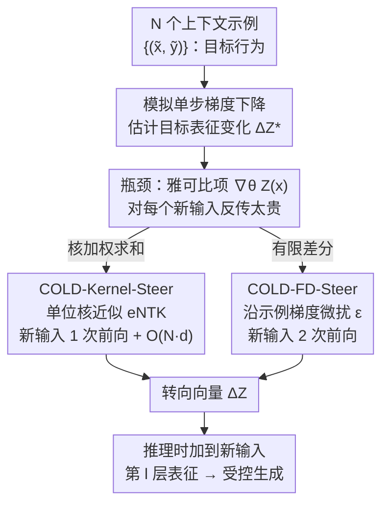

# COLD-Steer: Steering Large Language Models via In-Context One-step Learning Dynamics

**会议**: ICLR 2026  
**arXiv**: [2603.06495](https://arxiv.org/abs/2603.06495)  
**代码**: [https://github.com/Ksartik/cold-steer](https://github.com/Ksartik/cold-steer)  
**领域**: 优化  
**关键词**: 激活转向, 学习动力学, 无训练推理, 样本效率, 多元对齐

## 一句话总结
提出 COLD-Steer，通过近似梯度下降在上下文示例上产生的表征变化来实现无训练的 LLM 激活转向，在仅用 50 分之一样本量的情况下达到 95% 的转向效果。

## 研究背景与动机

**领域现状**：激活转向（activation steering）可在推理时控制 LLM 行为而无需重训练，分为两类——对比方法（DiffMean/CAA）用正负对的激活差异构造方向向量，参数调优方法（ReFT/BiPO）端到端训练转向参数。

**现有痛点**：对比方法样本效率高但只利用激活层面的信号（不用损失函数），转向精度有限；参数调优方法（ReFT）需要 250-1000 个示例训练，成本高且需多 epoch 调参。

**核心矛盾**：样本效率与转向精度之间存在根本性 trade-off——如何用少量示例、不训练参数，就获得等同于微调的转向效果？

**本文目标**：设计一个 training-free 框架，仅用 10-50 个示例就能高效转向 LLM 行为。

**切入角度**：作者观察到微调时模型表征的变化遵循可分析的模式（学习动力学）。核心洞察是：可以在推理时**模拟**梯度下降对表征的影响，而无需实际更新参数。

**核心 idea**：将激活转向重新定义为"模拟单步梯度下降的学习动力学"——计算上下文示例的梯度会如何改变目标表征，直接将该变化作为转向向量。

## 方法详解

### 整体框架
COLD-Steer 想解决的是这样一个问题：要让模型行为偏向某种风格（更诚实、不谄媚、支持某个少数派立场），传统做法要么训练一组转向参数（贵），要么只拿正负样本的激活差当方向（信号弱）。它的思路是把"如果用这些示例微调一步会发生什么"直接算出来，但**只算表征的变化，不真的更新参数**。具体地，给定 $N$ 个示例 $\{(\tilde{\mathbf{x}}_i, \tilde{\mathbf{y}}_i)\}$，它估计模型在这些示例上做单步梯度下降后、目标表征会朝哪个方向移动多少，把这个变化量 $\Delta\mathbf{Z}^*$ 当作转向向量，在推理时加到新输入的第 $l$ 层表征上：

$$\Delta\mathbf{Z}^*(\mathbf{x}) \approx -\frac{\eta}{N} \nabla_\theta \mathbf{Z}(\mathbf{x};\theta) \sum_i \nabla_\theta \mathcal{L}(\mathcal{M}(\tilde{\mathbf{x}}_i), \tilde{\mathbf{y}}_i)$$

难点在于这个式子里有一项对新输入 $\mathbf{x}$ 的雅可比 $\nabla_\theta \mathbf{Z}(\mathbf{x};\theta)$，直接算等于要对每个新输入反向传播，推理时承受不起。COLD-Steer 给出两条绕开这项的近似路线（核加权与有限差分），再用一个统一视角说明已有的对比方法其实都是它的特例。

### 关键设计

**1. COLD-Kernel-Steer：用核函数近似 eNTK，避免对新输入反向传播**

雅可比那一项贵，是因为它把"新输入的梯度"和"示例的梯度"耦合在一起。把链式法则展开后，这种耦合可以写成一个作用在表征空间上的核函数 $\kappa$，于是变化量变成示例侧损失梯度按核相似度加权求和：

$$\Delta\mathbf{Z}^{(\kappa)}(\mathbf{x}) = -\frac{\eta}{N} \sum_i \kappa(\mathbf{Z}(\mathbf{x}), \mathbf{Z}(\tilde{\mathbf{x}}_i)) \nabla_{\mathbf{Z}} \mathcal{L}|_{\mathbf{Z}(\tilde{\mathbf{x}}_i)}$$

这里 $\kappa$ 本质是经验神经正切核（eNTK）。作者进一步取最简单的单位核 $\kappa=1$ 作近似，依据是线性表征假说——同一个概念的梯度主要由一个共享方向主导，因此对不同示例用相同权重也够用。这样一来，新输入只要做 1 次前向传播拿到表征，再做 $O(N\cdot d)$ 的核相似度计算即可，没有任何反向传播，特别适合需要保持子群体分布保真度、不希望大幅改变模型的场景。

**2. COLD-FD-Steer：用有限差分绕过雅可比计算**

核近似省掉了反传，但单位核是个比较粗的假设，在某些任务上不够准。COLD-FD 换一条路：不去显式算雅可比，而是用有限差分来逼近"参数沿示例梯度方向微扰一点后，表征怎么变"：

$$\Delta\mathbf{Z}^{(fd)} = -\frac{\eta}{\varepsilon N} \big[\mathbf{Z}(\mathbf{x}; \theta + \varepsilon \textstyle\sum_i \nabla_\theta \mathcal{L}_i) - \mathbf{Z}(\mathbf{x}; \theta)\big],\quad \varepsilon = 10^{-6}$$

它先把所有示例的损失梯度累加成一个方向，把参数沿该方向推一个极小步 $\varepsilon$，然后只比较微扰前后同一个新输入的表征之差。整个过程对新输入是 2 次前向传播（原参数一次、微扰参数一次），计算成本固定、不随输入复杂度变化；代价是要把完整的模型梯度存下来，开销 $O(|\theta|)$。这条路保留了真实雅可比的信息，因而转向更准——实验里它是表现最强的变体。

**3. 统一视角：已有的对比方法都是 COLD-Kernel 的特例**

把核近似的式子代入不同的损失函数和核，能反推出现有方法。DiffMean 这类对比方法等价于 COLD-Kernel 取单位核、配上损失 $\mathcal{L} = -\sum_i \|\mathbf{Z}(\tilde{\mathbf{x}}_i \oplus \tilde{\mathbf{y}}_i^+) - \mathbf{Z}(\tilde{\mathbf{x}}_i \oplus \tilde{\mathbf{y}}_i^-)\|^2$——也就是说它们只用了正负对的激活差异，没碰损失函数携带的梯度信息；RepE/ICV 则相当于在 COLD-Kernel 之上再做一层 PCA 降维近似。这个视角解释了为什么对比方法样本效率高却精度有限：它们是 COLD-Steer 退化掉梯度信号后的特例。

### 损失函数 / 训练策略
- 配对设置用 DPO 损失，正样本设置用交叉熵损失
- 超参搜索：$\eta \in \{0.1, 1, 2\}$，$l \in \{10, 15, 20, 30\}$
- 开放生成仅在第一个生成 token 处干预，限制转向的复合效应

## 实验关键数据

### 主实验（CAA 数据集，Llama-2-7b-chat，行为选择准确率）

| 方法 | 协调-AIS | 纠正-HH | 幻觉 | 拒绝 | 谄媚 | 平均排名↓ |
|------|---------|--------|------|------|------|----------|
| Base | 0.28 | 0.62 | 0.70 | 0.62 | 0.80 | 5.14 |
| DiffMean | 0.52 | 0.82 | 0.86 | 0.74 | 0.80 | 4.00 |
| ReFT(vec) | 0.48 | 0.62 | 0.70 | 0.72 | 0.82 | 3.29 |
| **COLD-FD** | **0.90** | **0.86** | **0.96** | **0.98** | 0.86 | **2.00** |
| COLD-Kernel | 0.28 | 0.62 | 0.70 | 0.64 | 0.80 | 4.43 |

### 样本效率对比

| 方法 | 所需样本数 | 平均转向准确率 |
|------|----------|--------------|
| ReFT(mlp) | 250-1000 | ~70-80% |
| DiffMean | 50 | ~65-75% |
| **COLD-FD** | **10-50** | **~85-95%** |
| **COLD-Kernel** | **10-50** | **~75-85%** |

### 关键发现
- **COLD-FD 在 CAA 上平均排名 2.00**（pair 设置），显著优于所有基线
- 使用仅 **50 分之一** 的样本即可达到接近 ReFT 的效果
- 对比方法 DiffMean 被证明是 COLD-Kernel 在特定损失下的特例——统一了对比与梯度方法
- 在 OpinionsQA 多元对齐任务上同样有效，支持少数派观点的适配
- 跨模型家族验证：Qwen-2.5-7B-Instruct 上 COLD-FD 准确率提升最高达 96%；Gemma-2-9B 和 Mistral-7B 上同样有效

### 多元对齐（OpinionsQA，Llama-2-7b-chat）
- COLD-Kernel 在所有人群分组上一致最优，将 Black 群体 KL 散度从 2.43 降至 0.86，Republican 从 2.38 降至 0.97
- TV 距离均降至 0.4 以下，表明核方法更适合保持子群体分布保真度
- COLD-FD 在分布式转向设定下效果不佳，原因仍为开放问题

### 行为生成质量（GPT-5-mini 评判）
- COLD-FD 在 CAA 的 hallucination 任务上从 2.98 提升到 3.32（Llama-2-7b-chat），在 survival-instinct 上从 5.26 提升到 6.20
- COLD-Kernel 偏保守，基本维持 Base 水平，适合不希望大幅改变模型行为的场景

## 亮点与洞察
- **将激活转向重新理解为学习动力学的模拟**极为优雅——不是训练一个转向器，而是直接计算"如果微调了会怎样"
- **理论统一性强**：证明 DiffMean/RepE/ICV 都是 COLD-Kernel 的特例，为现有方法提供了统一的梯度视角
- **COLD-FD 的两次前向传播方案**：完全避免新输入的反向传播，实用性极高

## 局限与展望
- COLD-FD 需存储完整模型梯度 $O(|\theta|)$，对 70B+ 模型内存压力大
- 单位核近似在某些任务上效果不佳（如 Llama-2 上 COLD-Kernel 未提升）
- 仅实验了单层干预，多层协同转向可能更强
- 有限差分的 $\varepsilon$ 选择依赖经验

## 相关工作与启发
- **vs CAA/DiffMean**: COLD-Steer 证明对比方法只用了激活差异信号，未利用损失函数信息
- **vs ReFT**: ReFT 训练 MLP 需几百样本+多 epoch；COLD-Steer 零训练、10 样本即可
- **vs prompt tuning**: COLD-Steer 在激活层面操作，更精细且不受上下文窗口限制

## 评分
- 新颖性: ⭐⭐⭐⭐⭐ 将激活转向重新定义为学习动力学模拟，理论贡献突出
- 实验充分度: ⭐⭐⭐⭐ 5 个 LLM + 多数据集 + 多元对齐，但消融实验可更深入
- 写作质量: ⭐⭐⭐⭐⭐ 理论推导清晰，统一视角有说服力
- 价值: ⭐⭐⭐⭐⭐ 50x 样本效率提升有巨大实用价值，尤其对多元对齐

<!-- RELATED:START -->

## 相关论文

- [\[ICLR 2026\] Adaptive Acquisition Selection for Bayesian Optimization with Large Language Models](adaptive_acquisition_selection_for_bayesian_optimization_with_large_language_mod.md)
- [\[ICLR 2026\] FZOO: Fast Zeroth-Order Optimizer for Fine-Tuning Large Language Models towards Adam-Scale Speed](fzoo_fast_zeroth-order_optimizer_for_finetuning_large_language_models_towards_ad.md)
- [\[NeurIPS 2025\] The Trilemma of Truth in Large Language Models](../../NeurIPS2025/optimization/the_trilemma_of_truth_in_large_language_models.md)
- [\[ICLR 2026\] Gradient Descent with Large Step Sizes: Chaos and Fractal Convergence Region](gradient_descent_with_large_step_sizes_chaos_and_fractal_convergence_region.md)
- [\[NeurIPS 2025\] Doubly Robust Alignment for Large Language Models](../../NeurIPS2025/optimization/doubly_robust_alignment_for_large_language_models.md)

<!-- RELATED:END -->
