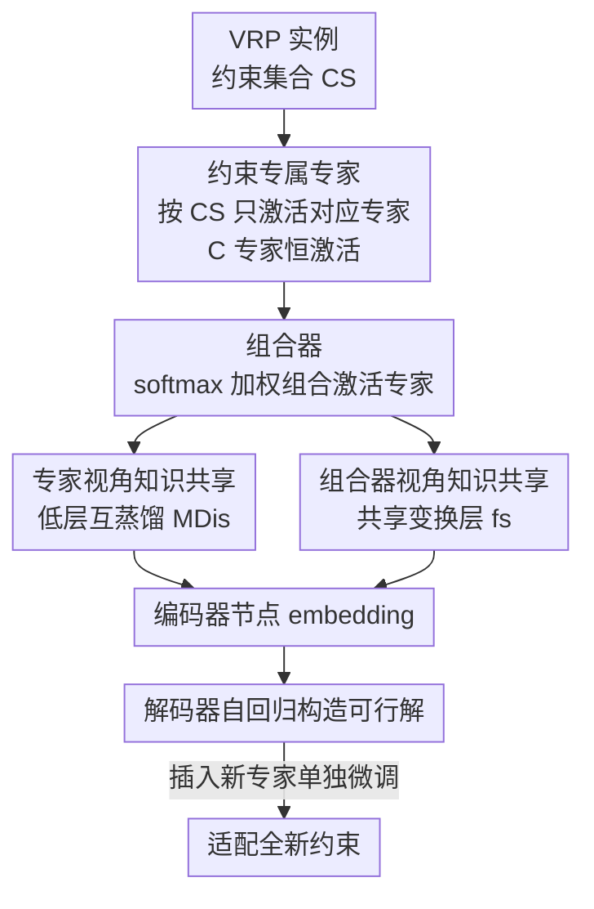

# Combination-of-Experts with Knowledge Sharing for Cross-Task Vehicle Routing Problems

**会议**: ICLR2026  
**OpenReview**: [https://openreview.net/forum?id=lHBs9mbgwp](https://openreview.net/forum?id=lHBs9mbgwp)  
**代码**: https://github.com/yuzikang0/CoEKS  
**领域**: 神经组合优化 / 车辆路径问题(VRP) / 混合专家  
**关键词**: 跨任务泛化, 约束组合, 组合专家, 互蒸馏, 分布外泛化

## 一句话总结
针对车辆路径问题（VRP）"每个任务由若干基础约束组合而成"这一结构特性，本文提出 CoEKS：用「约束专属专家 + 组合器」按需激活并加权组合各约束的专家，再配一套「专家互蒸馏 + 共享变换层」的多视角知识共享，让一个统一模型既能在见过的约束组合上更准，又能零样本泛化到没见过的约束组合（相对 SOTA 提升约 12–18%），还能插入新专家适配全新约束（提升约 25%）。

## 研究背景与动机

**领域现状**：VRP 是组合优化里最基础也最难的一类问题——给一队车规划路线服务一批客户，同时满足容量、时间窗等各种约束。近年的神经构造方法用深度强化学习端到端学一个策略，按自回归方式一个节点一个节点地构造解，省去了传统精确解法的指数级开销和启发式方法对手工规则的依赖。但绝大多数方法是"一个任务一个模型"，换个约束就得重训重部署。于是出现了**跨任务统一模型**：用一个网络同时解 CVRP、OVRP、VRPTW 等多种 VRP 变体。

**现有痛点**：现有统一模型在**分布外（OOD）**场景下表现很差，而 OOD 恰恰是实用价值最高的两类——(1) 训练时没见过的**约束组合**（如只训过 VRPB 和 VRPL，要求解 VRPBL）；(2) 训练时根本没出现过的**新基础约束**。现有方法分两类：**任务共享稠密模型**（POMO-MTL、RouteFinder、CaDA）所有参数完全共享，过度强调耦合表示而牺牲任务特异表示，导致任务间**负迁移**，OOD 尤其糟；**节点级 MoE 模型**（MVMoE、ReLD-MoEL）用门控把一个实例里每个节点的 embedding 路由给不同专家，但门控让专家只能看到节点子集这个**狭窄视野**，削弱了对任务级知识的认知。

**核心矛盾**：两类方法都忽略了一个关键事实——**每个 VRP 任务本质上是多个基础约束的组合**（如 OVRPBLTW = Open + Backhaul + Duration + TimeWindow + Capacity）。稠密模型把约束揉成一团学不出专门知识；节点级 MoE 又把专家绑死在节点粒度，专家学到的不是"约束级"知识。问题的根源是：专家划分的**粒度没对上 VRP 的结构**——既不该是"全共享"，也不该是"按节点分"，而应该是"按约束分"。

**本文目标**：(1) 让模型为每个基础约束学一份可复用的专门知识；(2) 通过灵活组合这些约束知识，零样本泛化到未见过的约束组合；(3) 通过插入新专家，快速适配全新约束；(4) 同时还要让专家之间共享可迁移的通用知识，避免各学各的、协作不起来。

**切入角度**：既然 VRP 任务 = 约束的组合，那就让**专家也按约束来组合**。给每个基础约束配一个专属专家，求解某个任务时只激活它涉及的那几个约束专家，再自适应加权组合它们的输出——这天然对应了 VRP 的组合结构，未见组合无非是"激活一组新的专家子集"，自然就能零样本泛化。

**核心 idea**：用"约束专属专家的灵活组合（combination-of-experts）"替代"全共享 / 节点级 MoE"，再叠加"跨约束的多视角知识共享"来抑制专家割裂，从而把 VRP 的结构先验直接编码进网络架构。

## 方法详解

### 整体框架
CoEKS 把改造集中在编码器（encoder）里——标准 Transformer block 中负责捕捉复杂关系的 FFN，被替换成一个**约束专属专家池 + 组合器**，外加一套跨专家的知识共享机制。整条流程是：从训练集采样一个 VRP 实例（比如 OVRP，它的约束集合 $CS=\{C,O\}$）→ 编码器按 $CS$ **只激活对应约束的专家**（C、O 专家），其余专家置零不参与 → 每个激活专家配的组合器算出一组归一化权重，把各专家输出加权求和得到节点 embedding → 解码器据此自回归构造可行解。训练用 REINFORCE（带共享 baseline 的 POMO 式策略梯度），同时在低层编码器对激活专家做互蒸馏。训练好的策略推理时，遇到未见约束组合就激活相应专家子集（零样本），遇到全新约束就插入并单独微调一个新专家。

整个 VRP 在完全图 $G=(V,E)$ 上建模，目标是最小化总路程 $\min_{\tau\in\Phi} c(\tau)$；本文聚焦六个基础约束：容量 C、开放路线 O、回程 B、时长限制 L、时间窗 TW、混合回程 MB，其中 C 是所有 VRP 的底层约束。

### 关键设计

**1. 约束专属专家与组合器：按约束分专家，按需激活再加权组合**

这一设计直击"专家划分粒度没对上 VRP 结构"的痛点。CoEKS 把 Transformer block 里的单个 FFN 换成一池 FFN，每个专家 $E_j$（$j\in\{C,O,B,L,TW\}$）只负责一个基础约束。对一个约束集合为 $CS\subseteq E$ 的实例，只激活集合内的专家，其余输出为零：

$$O^E_j(h)=\begin{cases}E_j(h),& j\in CS\\ 0,& \text{otherwise}\end{cases}$$

其中 $E_j(h)=\mathrm{FFN}_j(h)\in\mathbb{R}^d$。由于容量 C 是所有 VRP 的底座，C 专家被设为**恒激活的共享专家**（对应 CVRP），既保证任意任务都有通用求解能力，又让其余专家专注各自约束的特异知识。激活之后还要决定"怎么把这几份约束知识揉到一起"——每个专家配一个组合器 $W_j\in\mathbb{R}^{1\times d}$，先算原始打分 $s_j(h)=W_j\cdot h$，再在激活集合内做 softmax 归一化：

$$S_j(h)=\frac{\exp(s_j(h))}{\sum_{k\in CS}\exp(s_k(h))},\quad j\in CS$$

最终输出是激活专家的加权组合 $O(h)=\sum_{j\in CS}E_j(h)\cdot S_j(h)$。这样设计的妙处在于：未见过的约束组合，本质就是激活一组**没一起出现过、但每个都训练充分**的专家子集，模型不用学新参数就能零样本应对——这正是节点级 MoE 做不到的，因为后者的专家不绑定语义约束、视野又局限在节点子集。

**2. 专家视角知识共享：低层互蒸馏，让约束专家既专又通**

只把专家按约束分开，会带来新风险：每个专家只看自己那个约束的样本，容易学得太"窄"，专家之间缺乏对 VRP 共性的认知，OOD 时协作不起来。本文用**互蒸馏（MDis）**解决——不同于传统师生蒸馏，MDis 让激活的专家做**点对点的相互学习**，交换跨约束的共性模式。它通过一个辅助损失实现，总损失为 $L=L_p+\alpha\cdot L_{md}$（$L_p$ 是任务主损失，$\alpha=0.01$ 控制蒸馏强度），其中

$$L_{md}=\begin{cases}0,& K=1\\ \mathrm{MSE}(E_1(h),E_2(h)),& K=2\\ \frac{1}{K}\sum_{i=1}^{K}\mathrm{MSE}(E_i(h),E_{avg}(h)),& K>2\end{cases}$$

$K$ 是激活专家数，$E_{avg}(h)=\frac1K\sum_i E_i(h)$ 是一个把激活专家输出取平均的"虚拟专家"。当 $K>2$ 时不做两两 MSE，而是都向虚拟专家对齐，把复杂度从 $O(K^2)$ 降到 $O(K)$，同时通过最小化专家输出的方差引导它们达成共识。**关键一笔是只在低层编码器（如第一层）做 MDis**——依据是神经网络低层学通用特征、高层学任务特异知识，把知识共享局限在早期表示，能在"共享有用通用信息"和"不把专家同质化"之间取得平衡（附录用 t-SNE 验证了低层专家表示确实更接近）。

**3. 组合器视角知识共享：共享变换层注入跨任务知识，让加权决策更明智**

光是专家之间共享还不够，**组合器**本身也需要见多识广才能为不同任务做出合理的加权。本文在 embedding $h$ 进入组合器之前，先过一个**共享变换层** $f_s$，它对所有组合器统一注入跨任务知识，使每个组合器在面对多样 VRP 任务时都能做出"知情"的加权决策。$f_s$ 实现为带残差的低秩 MLP：

$$f_s(h)=W_2\cdot\mathrm{ReLU}(W_1\cdot h)+h$$

其中 $W_1\in\mathbb{R}^{d\times r}$、$W_2\in\mathbb{R}^{r\times d}$ 构成 $r\ll d$ 的瓶颈结构，既省参数又保留表达力，ReLU 引入非线性以建模复杂函数。于是 CoEKS 的最终输出把共享变换接在组合器输入端：

$$O_{CoEKS}(h)=\sum_{j\in CS}E_j(h)\cdot S_j(f_s(h))$$

这与设计 2 形成互补：MDis 让"专家"之间共享，$f_s$ 让"组合器"之间共享，两个视角合起来就是"多视角知识共享"，共同强化对未见约束组合的泛化。

**4. 插入新专家适配全新约束：冻结旧参数，单独微调新专家防遗忘**

前三个设计解决的是"未见组合"，第四个解决"全新约束"。当出现训练时完全没有的基础约束（如混合回程 MB），CoEKS 直接**插入一个新的约束专属专家 + 组合器**，**只微调这个新模块、冻结所有已有参数**，从而避免灾难性遗忘、保住已学知识。本文给出两个变体：CoEKS+ 随机初始化新专家与组合器；CoEKSc+ 复用共享模块（C 专家 $E_C$ 与其组合器 $S_C$）来初始化以加速学习。这种"即插即用"让模型能持续、快速地扩展到新约束，部署友好——而稠密模型要适配新约束往往得动到全局参数。

### 损失函数 / 训练策略
策略用 REINFORCE 优化，带共享 baseline $b(G)$（一个实例多条采样轨迹的平均 reward），梯度为 $\nabla_\theta L_p=\mathbb{E}[(r(\tau)-b(G))\nabla_\theta\log p_\theta(\tau|G)]$，reward 为负总路程。叠加互蒸馏辅助损失后总损失 $L=L_p+\alpha L_{md}$，$\alpha=0.01$。CoEKS 实现在 SOTA 的 ReLD 主干上，训练 300 epoch、每 epoch 100K 实例，Adam（lr $3\times10^{-4}$，在第 270、295 epoch 乘 0.1），$n=50/100$ 时 batch 为 256/128。训练任务集含 CVRP、OVRP、VRPB、VRPL、VRPTW、OVRPTW、OVRPL 共 7 个，沿用 RouteFinder 的混合批训练与 reward 正则；MDis 放在第一层编码器；推理用贪心 rollout + ×8 实例增广。

## 实验关键数据

实验覆盖 48 个 VRP 任务，单张 RTX 3090。基线含传统解法（PyVRP、OR-Tools）与跨任务神经方法（POMO-MTL、RF-TE、MVMoE、CaDA、ReLD-MoEL），后者是 ReLD 上的 SOTA。指标为目标值（总路程）、相对最优传统解法的 gap、总测试时间，每个任务 1000 个测试实例。

### 主实验

ID（训练分布内）平均 gap：CoEKS 在 7 个训练任务上全面领先，14 个（任务×规模）case 里 10 个取得最小 gap。

| 设置 | 指标 | CoEKS | ReLD-MoEL(次优) | 传统最优 |
|------|------|------|----------|------|
| ID Avg. n=50 | gap | **1.751%** | 1.902% | 0%（HGS-PyVRP，10.4m）|
| ID Avg. n=100 | gap | **2.646%** | 2.852% | 0%（HGS-PyVRP，20.8m）|

OOD 未见约束组合（9 个任务）平均 gap：CoEKS 全部最优，神经方法里相对提升 n=50 至少 18.3%、n=100 约 13%。最难的几个组合提升尤其明显。

| 任务 | 规模 | CoEKS gap | ReLD-MoEL gap | RF-TE gap |
|------|------|-----------|---------------|-----------|
| OVRPB | n=100 | **8.811%** | 10.691% | 14.520% |
| OVRPBL | n=100 | **8.755%** | 10.506% | 14.864% |
| OOD Avg. | n=50 | **3.432%** | 4.202% | 4.823% |
| OOD Avg. | n=100 | **5.857%** | 6.735% | 8.702% |

适配全新约束（在 VRPMB / VRPMBTW 上微调 10 epoch，每 epoch 10K 实例），CoEKSc+ 最佳：

| 方法 | VRPMB gap | OVRPMB gap | 说明 |
|------|-----------|------------|------|
| RF-TE-AL | 24.69% | 47.92% | 适配层，崩得厉害 |
| ReLD-MoEL-EAL | 2.59% | 5.09% | 高效适配层基线 |
| CoEKS+ | 1.61% | 4.19% | 新专家随机初始化 |
| **CoEKSc+** | **1.56%** | **3.52%** | 复用共享模块初始化 |

### 消融实验
在 16 个 $n=50$ 的 VRP 任务上，以 ReLD-MoEL 为基线，逐一去掉知识共享组件：

| 配置 | 现象 | 说明 |
|------|------|------|
| 完整 CoEKS | 最优 | CoE + 互蒸馏 + 共享变换层 |
| w/o MDis | ID/OOD 下降 | 去掉专家互蒸馏 |
| w/o 共享变换层 | ID/OOD 下降 | 去掉组合器视角共享 |
| w/o 两者 | 下降最多，尤其 OOD | 退化为纯 CoE |

### 关键发现
- **多视角知识共享对 OOD 的增益远大于 ID**：去掉 MDis 或共享变换层都会掉点，且 OOD 掉得更狠，说明跨约束的通用知识正是泛化到未见组合的关键。
- **MDis 的位置至关重要**：从低层逐渐加到高层，OOD 只有在 MDis 仅作用于低层时才改善；加到所有层反而损害——印证了"低层共享通用、高层保留特异"的设计动机。
- **架构具有通用性（Q3）**：CoEKS 装在经典 POMO 和 SOTA ReLD 两种主干上，ID 与 OOD 平均 gap 都是同主干里最好，说明增益来自架构本身而非特定 backbone。
- **越复杂的组合优势越大**：约束越多的 OOD 任务（如 OVRPBLTW），CoEKS 相对节点级 MoE 的领先越明显，因为灵活组合专家的能力随约束数增长而放大。

## 亮点与洞察
- **把"任务=约束组合"的结构先验直接写进架构**：这是最核心的"啊哈"——别人在门控/共享上做文章，本文洞察到 VRP 的组合本质，让专家粒度对齐约束粒度，未见组合自然变成"激活新的专家子集"，零样本泛化几乎是免费的副产品。
- **虚拟专家把互蒸馏从 $O(K^2)$ 降到 $O(K)$**：用激活专家的均值作为蒸馏目标、最小化输出方差来逼近共识，这个 trick 简单且可迁移到任何"多专家需要互相对齐"的场景。
- **"低层共享、高层特异"的精细放置**：知识共享不是越多越好，把 MDis 局限在第一层编码器，既共享通用又不同质化，这种对网络层级语义的利用值得借鉴到其他 MoE/多专家结构。
- **即插即用 + 冻结旧参数**适配新约束，给出了一条"持续扩展、不灾难遗忘"的实用路径，对生产环境里约束不断新增的物流系统很友好。

## 局限与展望
- **专家数随约束数线性增长**：每个基础约束一个专家，约束种类一多，专家池和组合器都会膨胀；论文聚焦 6 个基础约束，更大规模约束体系下的可扩展性与参数开销待考。
- **改造集中在编码器**：CoE 只替换了编码器的 FFN，解码器仍沿用主干；约束信息在解码阶段是否也该按专家组织，文中未深入。
- **依赖约束可被显式枚举**：方法前提是任务能拆成已知的离散基础约束集合 $CS$；对那些约束耦合、难以清晰拆分或连续参数化的现实问题，"按约束分专家"的范式是否还成立存疑。
- **互蒸馏强度 $\alpha$、共享层秩 $r$ 等超参**对不同约束体系的敏感性，以及新专家微调 epoch 预算对适配效果的影响，可进一步系统分析。

## 相关工作与启发
- **vs 任务共享稠密模型（POMO-MTL / RouteFinder / CaDA）**：它们全参数共享，过度强调耦合表示、压制任务特异表示，导致负迁移、OOD 差；CoEKS 用约束专属专家保留特异性，再靠知识共享补回通用性，鱼和熊掌兼得。
- **vs 节点级 MoE（MVMoE / ReLD-MoEL）**：它们的门控按节点把 embedding 路由给专家，专家视野局限在节点子集、学不到任务级知识；CoEKS 把专家绑定到**约束语义**，视野是整个约束而非节点，且未见组合可零样本组合专家——这是本文相对 SOTA（ReLD-MoEL）OOD 大幅领先的根因。
- **vs 适配器式新任务适配（Lin et al. 的 AL / RouteFinder 的 EAL）**：它们靠加适配层或零填充扩展权重来适配新约束，CoEKS 则插入一个语义明确的新约束专家并冻结旧参数，CoEKSc+ 还能复用共享模块加速——在 VRPMB 等新约束上 gap 从 EAL 的 2.59% 降到 1.56%。

## 评分
- 新颖性: ⭐⭐⭐⭐⭐ 把"任务=约束组合"的结构先验编码为"组合专家"架构，视角清晰且与 VRP 本质高度契合，区别于全共享/节点级 MoE。
- 实验充分度: ⭐⭐⭐⭐⭐ 48 任务、ID/OOD 组合/OOD 新约束三层评测，双主干验证通用性，消融到位（含 MDis 层位置分析）。
- 写作质量: ⭐⭐⭐⭐ 结构清楚、公式完整、图示直观；约束符号与变体命名稍密集，需对 VRP 变体有背景才好读。
- 价值: ⭐⭐⭐⭐⭐ 跨任务 VRP 统一模型在 OOD 上的实质突破 + 即插即用扩展新约束，对物流调度类落地很有吸引力。

<!-- RELATED:START -->

## 相关论文

- [\[ICLR 2026\] LMask: Learn to Solve Constrained Routing Problems with Lazy Masking](lmask_learn_to_solve_constrained_routing_problems_with_lazy_masking.md)
- [\[NeurIPS 2025\] Rethinking Neural Combinatorial Optimization for Vehicle Routing Problems with Different Constraint Tightness Degrees](../../NeurIPS2025/optimization/rethinking_neural_combinatorial_optimization_for_vehicle_routing_problems_with_d.md)
- [\[CVPR 2026\] Label-Free Cross-Task LoRA Merging with Null-Space Compression](../../CVPR2026/optimization/label-free_cross-task_lora_merging_with_null-space_compression.md)
- [\[NeurIPS 2025\] Learning to Insert for Constructive Neural Vehicle Routing Solver](../../NeurIPS2025/optimization/learning_to_insert_for_constructive_neural_vehicle_routing_solver.md)
- [\[ICLR 2026\] Align-SAM: Seeking Flatter Minima for Better Cross-Subset Alignment](align-sam_seeking_flatter_minima_for_better_cross-subset_alignment.md)

<!-- RELATED:END -->
