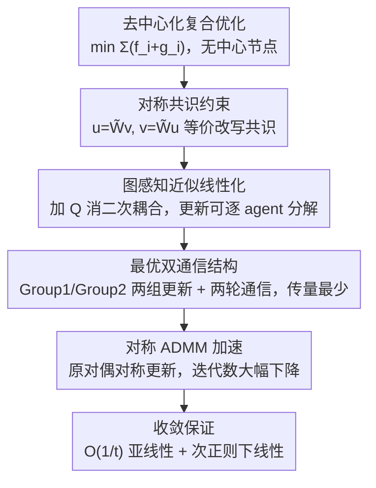

# Communication-Efficient Decentralized Optimization via Double-Communication Symmetric ADMM

**会议**: ICLR2026  
**OpenReview**: [https://openreview.net/forum?id=HZYuyNkBdD](https://openreview.net/forum?id=HZYuyNkBdD)  
**代码**: 待确认  
**领域**: optimization  
**关键词**: 去中心化优化, 对称 ADMM, 多轮通信, 通信高效, 线性收敛

## 一句话总结
针对无中心节点的去中心化复合优化，本文提出 DS-ADMM：用一对"对称共识约束"把"每次迭代两轮通信"嵌进 ADMM 的问题结构里，再配对称 ADMM 加速；虽然单次迭代通信翻倍，却让总迭代数大幅下降，从而整体通信量反而更省，并在度量次正则（metric subregularity）这一弱条件下证明线性收敛。

## 研究背景与动机

**领域现状**：去中心化优化（decentralized optimization）让一组 agent 在没有中央服务器的连通网络上协作求解全局问题——每个 agent 只做本地计算、只跟邻居交换信息。主流做法（DGD、EXTRA/PG-EXTRA、NIDS、gradient tracking、以及各种去中心化 ADMM）几乎都遵循同一个结构惯例：**每做一次本地迭代，就跟邻居通信一轮**。

**现有痛点**：这个"一迭代一通信"的惯例很少被挑战，因为大家默认"每次迭代多通信几轮只会让总通信成本更高"。少数尝试固定多轮通信的工作（Jakovetić 2014、Berahas 2019、Ye 2023、Li 2018）走的是 **multi-consensus**（多共识）路线——在一次迭代里反复用通信把本地变量混合（mixing）几遍来加速达成一致。但实验反复表明：固定多轮 multi-consensus **并不能真正降低总通信轮数**，它继承了 DGD 的收敛毛病，只是让"变量趋于一致"更快，却没怎么提升每一步迭代的质量。

**核心矛盾**：multi-consensus 把"多轮通信"当成一个**外挂增强**（反复平均），通信花在了"对齐变量"而非"推进优化"上，所以多花的通信换不回足够的迭代数下降。问题的根本是：多轮通信没有被设计进算法的优化结构里，而只是贴在外面。

**本文目标**：找一种**把多轮通信内生地嵌入问题结构**的方式，使得"单次迭代多通信"能真正换来"总迭代/总通信大幅下降"，并且在弱假设下有严格的线性收敛保证。

**切入角度**：作者不走 multi-consensus 的"反复混合"老路，而是从 **ADMM 的约束设计**入手——如果把共识条件写成一对涉及 2-hop（两跳）邻居信息的线性约束，那么"两轮通信"就成了算法每次迭代**必然且最少**要做的事，而不是人为外加的；再叠加 Symmetric ADMM（对称 ADMM）让原、对偶变量更新更均衡、收敛更快。

**核心 idea**：用一对**对称共识约束** $u=\widetilde{W}v,\ v=\widetilde{W}u$ 把"双轮通信"焊进 ADMM 结构里，配对称 ADMM 加速——以"每迭代多一轮通信"为代价，换来"总迭代数显著下降"，净通信反而更省。

## 方法详解

### 整体框架

考虑无中心协调者的去中心化复合优化问题
$$\min_{x\in\mathbb{R}^d} F(x)=\sum_{i=1}^n \big(f_i(x)+g_i(x)\big),$$
其中 $f_i$ 是 agent $i$ 私有的凸损失、$g_i$ 是私有凸正则项（典型组合如 Lasso：平方损失 + $\ell_1$；SVM：hinge 损失 + $\ell_2$）。网络是连通无向图 $G=(V,E)$，用对称、双随机、谱隙为正的混合矩阵 $W$ 编码邻居权重，$\widetilde{W}=W\otimes I_d$。

DS-ADMM 的整条 pipeline 是：**(1)** 先把"所有 agent 变量相等"这个共识约束，等价改写成一对对称线性约束，使得它天然需要 2-hop 信息、从而内生出双轮通信；**(2)** 把改写后的问题套进 generalized symmetric ADMM，并用一个图感知（graph-aware）的近似矩阵 $Q$ 做近似线性化，消掉二次耦合、让更新可逐 agent 分解；**(3)** 把这套更新拆成 Group 1 / Group 2 两组本地更新 + 两轮邻居通信，并精心设计"传哪些量"，把每轮通信压到最少（每轮只传两个 $d$ 维向量）；**(4)** 在标准与弱正则条件下证明（亚）线性收敛。

### 关键设计

**1. 对称共识约束：把"双轮通信"焊进 ADMM 的约束结构**

去中心化 ADMM 的难点在于：没有中央协调者来强制"所有 agent 变量一致"，必须把共识写成本地可执行的线性约束。作者利用混合矩阵的谱性质——$W$ 对称、双随机、谱隙为正，使得 $I_n-W$ 的零空间恰好是共识子空间 $\mathrm{span}\{\mathbf{1}\}$。由此得到一个等价刻画（命题 2）：堆叠的本地变量满足 $u_1=\cdots=u_n$，当且仅当存在辅助变量 $v$ 使得 $u=\widetilde{W}v$ 且 $v=\widetilde{W}u$。于是原问题被等价改写为
$$\min_{u,v}\ f(u)+g(v)\quad \text{s.t.}\quad Au-Bv=0,\qquad A=(\widetilde{W},I_{nd})^\top,\ B=(I_{nd},\widetilde{W})^\top.$$
这个约束的精妙处在于它对 $u\leftrightarrow v$、$(A,B)\leftrightarrow(B,A)$ **完全对称（self-adjoint）**：两个原变量块以完全相同的方式进入增广拉格朗日，因而天然适配对称 ADMM。更关键的是，约束里出现的 $\widetilde{W}^\top\widetilde{W}$ 涉及 2-hop 邻居信息，使得"两轮通信"成为执行这套更新**必然且最少**的代价——多轮通信不再是外挂，而是问题结构的内生产物。作者特别对比了 Wang et al. (2018) 的相关但**非对称**约束（$A=((I-\widetilde W)^{1/2},I)^\top,\ B=(0,I)^\top$）：它用单轮通信，却因为不对称而无法套用对称 ADMM、享受不到对称加速。

**2. 图感知近似线性化：消掉二次耦合，让更新可逐 agent 分解**

把改写后的对称问题直接套 generalized symmetric ADMM，子问题里会出现 $\|Au-Bv^{(t)}\|^2$、$\|Au^{(t+1)}-Bv\|^2$ 这类**二次耦合项**，导致 $u$、$v$ 的更新跨 agent 纠缠在一起、无法分布式求解。作者引入一个图感知的正定近似矩阵
$$Q=\beta\big((1+\tau)I_{nd}-\widetilde{W}^\top\widetilde{W}\big),\qquad \tau>0,$$
把它作为近似项加进子问题。这个 $Q$ 的选法恰好抵消掉 $\widetilde W^\top\widetilde W$ 带来的耦合，使增广拉格朗日在 agent 之间可分（separable）：两个原变量块都退化成"邻居加权平均 + 邻居信息 + 近似邻居正则"的形式，再经各自损失/正则的近端算子（proximal operator）一步求出。由于 Lasso 的 $\ell_1$、SVM 的 hinge 等常见损失/正则都有闭式近端算子，每个 agent 的更新都是闭式、完全本地、无需中央求解器。$\tau$ 越大近似项越强、单步越保守但越稳。

**3. 最优双通信结构：两轮通信、每轮只传两个 $d$ 维向量**

由于更新里的 $\widetilde W^\top\widetilde W$ 需要 2-hop 信息，一次完整迭代**必然**含两轮通信。作者按两条有序原则把通信压到极致：**(i) 轮数最少**——恰好两轮（$\lambda_1^{(t+1/2)}$ 需要聚合后的 $u^{(t+1)}$、$\lambda_2^{(t+1)}$ 需要聚合后的 $v^{(t+1)}$，这就把两轮通信的位置卡死了）；**(ii) 每轮传量最少**——不传原始变量，而是传**精心构造的对偶组合**。具体把一次迭代拆成两组：

- **Group 1 + 通信 1**：agent $i$ 先更新 $\lambda_{2,i}$，再用 $f_i$ 的近端算子算 $u_i^{(t+1)}$，形成中间对偶 $\lambda_{2,i}^{(t+1/2)}$；然后只广播 $\big(u_i^{(t+1)},\ a_i^{(t+1)}\big)$，其中 $a_i^{(t+1)}=\lambda_{2,i}^{(t+1/2)}+\tfrac{1}{r}\big(\lambda_{2,i}^{(t+1/2)}-\lambda_{2,i}^{(t)}\big)$。
- **Group 2 + 通信 2**：用收到的 $\widetilde u_i^{(t+1)},\widetilde a_i^{(t+1)}$ 更新 $\lambda_{1,i}^{(t+1/2)}$、用 $g_i$ 的近端算子算 $v_i^{(t+1)}$、形成 $\lambda_{1,i}^{(t+1)}$；然后广播 $\big(v_i^{(t+1)},\ b_i^{(t+1)}\big)$，其中 $b_i^{(t+1)}=2\lambda_{1,i}^{(t+1)}-\lambda_{1,i}^{(t+1/2)}$。

每轮只传两个 $d$ 维向量，是与对称 ADMM 结构兼容的最小通信。两组之间形成一种**耦合反馈**：某一组算出的信息不直接用于自己的更新，而是喂给另一组——通信和更新交织在一起，相互驱动推进。

**4. 对称 ADMM 加速：让"多通信"真正换来"少迭代"**

前三点保证了"双轮通信内生 + 可分布式 + 传量最省"，但要让"多花的通信"净赚回来，靠的是 Symmetric ADMM（He et al. 2016）的加速。对称 ADMM 在标准 ADMM 基础上**多插一次对偶变量的中间更新**（$\lambda^{(t+1/2)}$），令原、对偶更新更均衡、收敛更快；步长设为 $0<r\le1,\ s=1$。正是第 1 点的对称约束让这里能用上对称 ADMM——非对称约束（如 Wang 2018）享受不到。综合效果：单次迭代通信翻倍，但总迭代数大幅下降，整体通信与计算反而更省，这正是论文揭示的**"每迭代通信轮数 ↔ 整体收敛速度"的新 trade-off**。

### 损失函数 / 训练策略
没有额外训练损失——优化目标即问题 (1) 的 $\sum_i(f_i+g_i)$。关键超参：增广拉格朗日罚参数 $\beta$、对偶步长 $r\le1$ 与 $s=1$、近似系数 $\tau$。实验固定 $(r,s)=(0.99,1)$、$\tau=0.01$。初始化 $u^{(0)}=v^{(0)}=\lambda_1^{(0)}=\lambda_2^{(-1/2)}=0$。

## 实验关键数据

### 收敛理论（核心"结果"）

| 条件 | 收敛类型 | 速率 / 界 |
|------|----------|-----------|
| 标准假设（无强凸） | 非遍历亚线性 | $\|\theta^{(t)}-\theta^{(t+1)}\|^2\le \dfrac{1}{\beta\tau(t+1)}\cdot\dfrac{1+r}{1-r}\big(\|\theta^{(1)}-\theta^{(0)}\|_H^2+\|v^{(1)}-v^{(0)}\|_Q^2\big)$，即 $O(1/t)$ |
| KKT 映射在解处度量次正则（模 $c$） | 距解集 Q-线性 | $\mathrm{dist}_H^2(\theta^{(t+1)},\Omega^\*)\le \dfrac{1}{1+\epsilon}\,\mathrm{dist}_H^2(\theta^{(t)},\Omega^\*)$，$\epsilon=\tfrac{\phi}{c^2\delta\zeta}$ |
| 同上 | 次优性 R-线性 | $\|f(u^{(t)})+g(v^{(t)})-(f^\*+g^\*)\|\le l\,q^t$，$q=\sqrt{\tfrac{1}{1+\epsilon}}$ |

其中 $\phi=\min\{2\beta\rho,\ (1-r)/\beta\}$，$\rho$ 是网络谱隙——**谱隙越大（连通性越好）收敛越快**。亚线性结果不依赖具体网络/混合矩阵，因此对不同拓扑天然鲁棒（Remark 2）。

度量次正则在机器学习里很容易满足：命题 3 给出三个充分条件——(i) 各 $f_i$ 光滑强凸且 $g_i$ 为 PLQ（分段线性二次）；(ii) 全部 $f_i,g_i$ 为 PLQ；(iii) 全部光滑强凸。$\ell_1$/$\ell_2$、hinge、平方损失、elastic net 都是 PLQ，因此 Lasso、logistic 回归、SVM 等都落在线性收敛覆盖范围内。

### 数值实验设置与结果

| 任务 | 数据集 | $f_i$ | $g_i$ | 对比方法 |
|------|--------|-------|-------|----------|
| Lasso 回归 | a9a (LIBSVM) | $\tfrac{1}{2m}\|A_ix-b_i\|^2$ | $\tfrac{\lambda}{n}\|x\|_1$ | DProx-ADMM(Wang'18)、PG-EXTRA、NIDS、ProxMudag |
| SVM 分类 | a1a | $\tfrac1m\sum\max(0,1-b_ja_j^\top x)$ | $\tfrac{\lambda}{2n}\|x\|_2^2$ | DProx-ADMM、PG-EXTRA、NIDS（ProxMudag 因需全局耦合非光滑项被排除） |

统一设置：$n=30$ agent、随机图边概率 $p=0.5$、Metropolis–Hastings 混合矩阵、数据均分到各 agent；次优性以 $F(\bar u^{(t)})-F(u^\star)$ 衡量（$u^\star$ 为高精度中心化解）。基线的自适应参数都按最佳性能调过。

### 关键发现
- **核心结论**：在 Lasso 与 SVM 两个任务上，DS-ADMM 以**更少的迭代数**和**显著更少的通信轮数**收敛，全面优于现有去中心化方法（图 2 同时画了"按迭代"和"按通信轮数"两条横轴，DS-ADMM 在两条上都最快）。
- **机制层面的"啊哈"**：固定多轮通信长期被认为只增不减总通信（Ye 2023 的实验也支持这一悲观结论），但本文说明——只要多轮通信是**从问题结构内生**（对称共识约束）而非外挂式 multi-consensus，"多通信换少迭代"就能净赚。
- **网络连通性**：收敛速率显式依赖谱隙 $\rho$，连通性越好越快；而亚线性收敛与拓扑无关，给出对网络变化的鲁棒下保。

## 亮点与洞察
- **把"通信轮数"从超参变成结构产物**：传统方法里"每迭代几轮通信"是人为旋钮，本文通过 2-hop 的对称约束让"恰好两轮"成为算法的最小必然代价——这把一个调参问题转成了一个有定数的结构性质，值得借鉴到其它图上算法设计。
- **对称约束 → 能用对称 ADMM → 加速**：约束的 self-adjoint 设计不是为了好看，而是解锁对称 ADMM 加速的前提条件，环环相扣；和 Wang(2018) 的非对称版本对比把这一点讲得很清楚。
- **传对偶组合而非原始变量**：通信里刻意广播 $a_i,b_i$ 这类对偶外推组合而非原始 $\lambda$，把每轮通信压到两个 $d$ 维向量，是可迁移的"通信打包"技巧。
- **弱条件下的线性收敛**：用度量次正则（而非强凸）作为线性收敛的充分条件，覆盖了 Lasso/SVM 这类只分段线性二次、非强凸的实际问题，理论实用性强。

## 局限与展望
- **实验规模偏小**：只在 a1a/a9a 上做 Lasso 和 SVM，$n=30$、单机模拟，没有大规模/真实分布式部署或深度模型的验证；"通信更省"在更大网络/更高维下能否保持还需更多证据。
- **同步 + 静态拓扑假设**：算法默认所有 agent 同步、图固定连通；异步、时变拓扑、节点掉线/拜占庭等更现实的去中心化场景未涉及。
- **参数依赖**：线性速率显式依赖 $\tau,r,\beta$ 和谱隙 $\rho$，虽然实验用固定参数即可，但 $\beta,\tau$ 的选取对实际收敛快慢仍可能敏感，论文把敏感性分析放在附录。
- **每迭代通信翻倍的适用边界**：在通信极其昂贵或带宽极不均衡的网络里，"双轮"虽然轮数定死，但单轮延迟若占主导，"多通信换少迭代"的净收益可能缩水——这条 trade-off 的适用区间值得进一步刻画。

## 相关工作与启发
- **vs multi-consensus 类（Jakovetić'14 / Berahas'19 / Ye'23 / Li'18）**：它们把多轮通信当外挂、反复 mixing 来加速"变量一致"，实测不降总通信、且继承 DGD 收敛缺陷；本文把多轮通信**内生进约束结构**，并用对称 ADMM 真正把迭代数压下来，实现净通信下降。
- **vs Wang et al. (2018) 去中心化近端 ADMM**：两者都用混合矩阵构造 ADMM 约束，但 Wang 用**非对称**约束、单轮通信，结构不平衡因而无法套对称 ADMM 加速；本文用对称约束 + 双轮通信，换来对称加速带来的更少总迭代。
- **vs 梯度跟踪类（EXTRA/PG-EXTRA、NIDS、SONATA）**：那条线靠校正项估计全网平均梯度来加速一阶法；本文走对偶/ADMM 路线，天然不需光滑性、直接吃近端算子，更契合非光滑复合目标。

## 评分
- 新颖性: ⭐⭐⭐⭐ 把"双轮通信"做成对称共识约束的内生产物、并由此解锁对称 ADMM 加速，是去中心化优化里没被探索过的构造。
- 实验充分度: ⭐⭐⭐ 理论严谨完整，但实验只有 Lasso/SVM 两个小任务、单机 $n=30$ 模拟，规模偏弱。
- 写作质量: ⭐⭐⭐⭐ 动机递进清晰，约束设计与通信调度讲得有条理，理论与算法衔接自然。
- 价值: ⭐⭐⭐⭐ 揭示"每迭代通信轮数 ↔ 整体收敛"的新 trade-off，并给出弱条件线性收敛保证，对去中心化优化的算法设计有启发。

<!-- RELATED:START -->

## 相关论文

- [\[ICLR 2026\] DES-LOC: Desynced Low Communication Adaptive Optimizers for Foundation Models](des-loc_desynced_low_communication_adaptive_optimizers_for_foundation_models.md)
- [\[ICLR 2026\] Decentralized Nonconvex Optimization under Heavy-Tailed Noise: Normalization and Optimal Convergence](decentralized_nonconvex_optimization_under_heavy-tailed_noise_normalization_and_.md)
- [\[AAAI 2026\] A Unified Convergence Analysis for Semi-Decentralized Learning: Sampled-to-Sampled vs. Sampled-to-All Communication](../../AAAI2026/optimization/a_unified_convergence_analysis_for_semi-decentralized_learni.md)
- [\[ICLR 2026\] Enhancing Communication Compression via Discrepancy-aware Calibration for Federated Learning](enhancing_communication_compression_via_discrepancy-aware_calibration_for_federa.md)
- [\[ICML 2026\] Delayed Momentum Aggregation: Communication-efficient Byzantine-robust Federated Learning with Partial Participation](../../ICML2026/optimization/delayed_momentum_aggregation_communication-efficient_byzantine-robust_federated_.md)

<!-- RELATED:END -->
