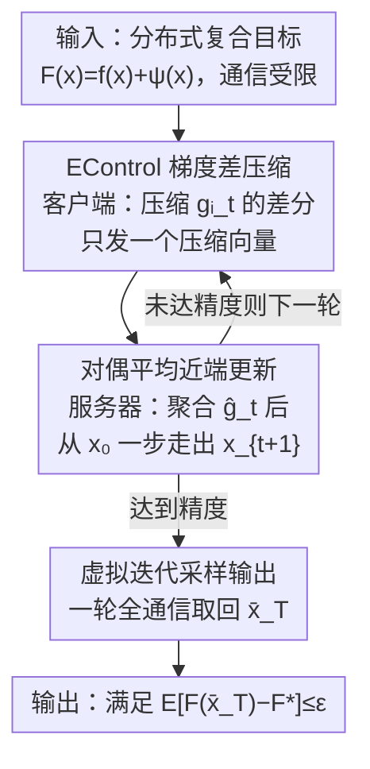

# Composite Optimization with Error Feedback: the Dual Averaging Approach

**会议**: ICLR 2026  
**OpenReview**: [https://openreview.net/forum?id=PSmakC4sw5](https://openreview.net/forum?id=PSmakC4sw5)  
**代码**: https://github.com/mlolab/comp-opt-da_iclr  
**领域**: 分布式优化 / 通信压缩 / 凸优化理论  
**关键词**: 误差反馈, 复合优化, 对偶平均, 通信压缩, 虚拟迭代

## 一句话总结
针对"误差反馈（Error Feedback）在带非光滑正则项/约束的复合优化里会失效"这个长期空白，本文用**对偶平均（Dual Averaging）**重塑迭代的求和结构，把它和最新的 EControl 误差反馈机制结合，首次给出复合凸优化下与无复合项情形**完全匹配**的收敛率。

## 研究背景与动机

**领域现状**：分布式训练里，客户端要把本地梯度传给服务器，通信是主要瓶颈。常用的解法是**收缩压缩（contractive compression，如 Top-K）**，但这类压缩是有偏的，直接聚合会发散。业界与理论界的标准修复手段是**误差反馈（EF）**：把这一步压缩丢掉的信息累积成误差项 $e_t$，在下一步补回去。EF 在光滑无约束（$\psi\equiv 0$）设定下既好用又有完整理论，分析靠的是 **virtual iteration（虚拟迭代）** 框架。

**现有痛点**：现实里的目标常常是**复合形式** $F(x)=f(x)+\psi(x)$，其中 $f$ 光滑、$\psi$ 是非光滑正则项（如 $\ell_1$）甚至约束指示函数（取 $+\infty$）。一旦加上 $\psi$，更新就从"减去梯度"变成**近端步（proximal step）**，经典 EF 与它的虚拟迭代分析就**整体崩塌**。已有的复合 EF 工作要么额外加苛刻假设、要么处理不了随机梯度、要么收敛率次优。

**核心矛盾**：虚拟迭代框架的命根子是——在 $\psi\equiv 0$ 时，真实迭代 $x_t$ 恰好是过去所有梯度估计的**干净求和** $x_0-\frac1\gamma\sum_k \hat g_k$，于是把累积误差 $e_t=\sum_k(\hat g_k-g_k)$ 减掉就能精确还原"用真梯度走出来的轨迹"。可一旦有 $\psi$，每步近端算子都会引入扭曲，$x_t$ **再也写不成过去梯度估计的求和**，而 $e_t$ 仍是压缩误差之和——两者**结构错位**，虚拟迭代 $\tilde x_t:=x_t-h_t e_t$ 甚至可能跑到 $\mathrm{dom}\,\psi$ 之外，不再是合法的代理。这才是经典分析失效的根本原因。

**本文目标**：在**一般复合设定**下，为 EF 机制找到一个能匹配无复合项最优率的算法与分析框架。

**切入角度**：既然问题出在"近端步破坏了求和结构"，那就换一种**天然保持求和结构**的迭代格式——**对偶平均**：它在每一步都把过去梯度全部累加，然后从初始点一步走出。这样 $x_t$ 重新由 $\sum_k a_k\hat g_k$ 这样的（加权）求和定义，加权累积误差 $e_t:=\sum_k a_k(\hat g_k-g_k)$ 又能像从前那样把偏差校正回来，只不过这次校正发生在近端算子**内部**。

**核心 idea**：用**对偶平均替换梯度下降**来恢复 EF 赖以分析的求和结构，再叠加 **EControl** 的梯度差压缩控制误差，从而把误差反馈的理论第一次干净地推广到复合凸优化。

## 方法详解

### 整体框架

整个方法是一轮轮的分布式压缩通信。每一轮里：**客户端**算本地随机梯度，用 EControl 机制把"梯度差"压缩后只发一个压缩向量给服务器；**服务器**把各客户端的压缩增量聚合成全局梯度估计 $\hat g_t$，然后做一次**对偶平均近端更新**得到 $x_{t+1}$；训练结束时再用一个轻量的**虚拟迭代采样**步骤，取回一个有收敛保证的输出点 $\bar x_T$。三者的分工是：EControl 负责"把误差压到可控"，对偶平均负责"让误差仍能被校正"，采样负责"把分析里那个不显式存储的虚拟迭代真正交出来"。

整篇论文真正的新意不在某个单独模块，而在于**用对偶平均当脊柱**把这三件事串成一个能严格分析的整体——并配套提出一个可独立使用的"非精确对偶平均"分析模板。

### 关键设计

**1. EControl 梯度差压缩：把误差界从"梯度范数"换成"梯度差"**

经典 EF 在界定误差 $\frac1n\sum_i\|e^i_t\|^2$ 时，最终要去界 $\|\nabla f(x_t)\|^2$，这一步在 $\psi\equiv 0$ 时靠光滑性自动成立，但在复合设定里**不再成立**——除非 $\nabla f(x^\star)=0$（一般不真）。本文沿用 EControl（Gao et al., 2024a）的**梯度差压缩**思路绕开这个死结：客户端不直接压缩当前梯度，而是压缩 $\delta^i_t = g^i_t - \hat g^i_{t-1} - \eta e^i_t$（当前梯度与上一步估计、误差的组合差），再令 $\hat g^i_t=\hat g^i_{t-1}+\mathcal C(\delta^i_t)$。这样误差和就能被**相邻梯度的差** $\|g^i_{t+1}-g^i_t\|^2$ 界住（Lemma 4.1），而后者只需用"平均光滑"假设 2.5 就能控制，**完全避开对梯度范数的依赖、也不用数据异质性假设**。取 $\eta=\frac{\delta}{3\sqrt{1-\delta}(1+\sqrt{1-\delta})}$ 时误差和满足 $\sum_t\|e^i_t\|^2\le\frac{81(1-\delta)^2(1+\sqrt{1-\delta})^4}{2\delta^4}\sum_t\|g^i_{t+1}-g^i_t\|^2$。这一界**只依赖 EControl 机制本身**，与具体目标无关，是后续把误差喂进收敛分析的关键砖块。

**2. 对偶平均重塑求和结构：让 EF 在复合设定下重新可控**

这是全文的核心一招。服务器不做"减梯度"的更新，而是做对偶平均近端步：

$$x_{t+1}=\arg\min_{x\in\mathrm{dom}\,\psi}\Big\{\sum_{k=0}^{t}a_k\big(\langle\hat g_k,x\rangle+\psi(x)\big)+\frac{\gamma_t}{2}\|x-x_0\|^2\Big\}$$

它的妙处在于：$x_t$ 现在**精确地由所有梯度估计的加权和** $\sum_k a_k\hat g_k$ 决定，求和结构被找回来了。于是可以定义加权累积误差 $e_t:=\sum_{k=0}^{t-1}a_k(\hat g_k-g_k)$，并在近端算子**内部**用 $-\langle e_t,x\rangle$ 把偏差校正掉——校正后得到的虚拟迭代恰好等价于"把真梯度 $g_k$ 喂进同一个对偶平均"。换句话说，EF 想做的"用累积误差还原真梯度轨迹"在复合设定下重新成立了，而且虚拟迭代始终留在 $\mathrm{dom}\,\psi$ 内、是合法代理。这正是经典 virtual-iterate 论证在复合情形失败、而本文得以修复的根源所在。

**3. 非精确对偶平均分析模板与虚拟迭代采样：让证明可用、让结果可取回**

围绕上面的更新，作者抽象出一个**"非精确对偶平均"（Inexact Dual Averaging）通用分析模板**（Algorithm 1）：只要每步拿到一个近似梯度 $\hat g_t\approx g_t$，就能从虚拟迭代视角给出收敛保证。其中 Lemma 3.2 把虚拟迭代与真实迭代的距离用累积误差界住 $\|\tilde x_t-x_t\|^2\le\frac1{\gamma_{t-1}^2}\|e_t\|^2$，Theorem 3.3 给出虚拟迭代的收敛主定理——这个模板不假设 $f$ 有有限和结构，可独立用于"更新被近似/噪声/约束扭曲"的各类问题。

但虚拟迭代 $\tilde x_t$ 在算法里**并不显式存储**，怎么把它当结果交出来？作者设计了一个**采样过程**：用一个伯努利变量 $\tau_t$（$\Pr[\tau=1]=a_t/A_{t+1}$）让客户端各自维护本地累积真梯度 $\bar g^i$，从而在结束时按 $a_t$ 正比的概率随机抽到某个虚拟迭代，再用**一轮全通信**收集 $\bar g^i$、解一次近端问题得到输出 $\bar x_T$（Lemma 3.4 保证其期望次优性等于虚拟迭代的加权平均次优性）。代价仅是每轮多 1 比特 + 结尾 1 轮全通信。三个模块合在一起就是最终的 **Algorithm 2：EControl with Dual Averaging**。

### 损失函数 / 训练策略

目标是分布式随机复合优化 $\min_x f(x)+\psi(x)$，$f=\frac1n\sum_i f_i$，每个 $f_i$ 只能通过无偏、方差有界（$\le\sigma^2$）的随机梯度预言机访问，$f_i$ 满足平均光滑（假设 2.5，比逐函数 $L_{\max}$-光滑更弱）。设 $a_t=1$、$\gamma_t=\gamma$ 常数，$\eta$ 取上述值，$\gamma=\max\{\tfrac{24\sqrt2\,\ell}{\delta},\sqrt{\tfrac{T\sigma^2}{nR_0^2}},17\tfrac{T^{1/3}\ell^{1/3}\sigma^{2/3}}{R_0^{2/3}\delta^{4/3}}\}$；复合情形（$\psi\not\equiv 0$）额外先走一步精确随机梯度，用来把初始次优 $F_0$ 界成 $LR_0^2$。

## 实验关键数据

论文是理论工作，实验仅用于**佐证**结论，主战场是合成目标：带 $\ell_1$ 正则的 softmax 目标 $F(x)=\mu\log\sum_i\exp(\frac{\langle a_i,x\rangle-b_i}{\mu})+\lambda\|x\|_1$，取 $\mu=0.1,\lambda=0.1,d=200,k=2048$，Top-K 压缩 $K/d=0.1$，$\sigma^2=25$；附录另有 FashionMNIST 实验。

### 主实验（理论收敛率）

| 设定 | 本文收敛率（迭代/通信复杂度） | 对照 |
|------|------|------|
| 复合凸 + EF（本文 Thm 4.4） | $O\!\big(\frac{R_0^2\sigma^2}{n\varepsilon^2}+\frac{R_0^2\sqrt{\ell}\sigma}{\delta^2\varepsilon^{3/2}}+\frac{\ell R_0^2}{\delta\varepsilon}\big)$ | 首个匹配无复合情形的率 |
| 无复合 $\psi\equiv 0$（EControl, Gao 2024a） | 同上式 | 本文在 $\psi\equiv 0$ 时**完全退化为它** |
| 已有复合 EF 工作 | 需额外约束 / 不支持随机梯度 / 率次优 | 被本文一并超越 |

主项 $\frac{R_0^2\sigma^2}{n\varepsilon^2}$ 随客户端数 $n$ **线性加速**且与压缩率 $\delta$ 无关，这正是 EF 类方法最看重的性质。

### 消融 / 验证实验

| 实验 | 现象 | 说明 |
|------|------|------|
| 增大客户端数 $n$（4→8→16→32，固定 $\gamma=0.0001$） | 真实迭代稳定到的误差随 $n$ 近似**线性下降** | 在真实迭代上验证了线性加速（理论只保证虚拟迭代） |
| 虚拟迭代 vs 真实迭代 | 两者次优性曲线**几乎重合** | 提示真实迭代可能也有强理论，是开放问题 |

### 关键发现
- **理论只覆盖虚拟迭代，真实迭代是缺口**：算法严格收敛保证给在虚拟迭代（的随机采样）上，需要采样过程才能取回；但实验显示真实迭代表现几乎一样好，暗示真实迭代的强理论或两者之间的 lower bound 是值得追的方向。
- **梯度差压缩是绕开复合难点的关键**：正是因为误差界改成靠 $\|g^i_{t+1}-g^i_t\|^2$ 而非 $\|\nabla f(x_t)\|^2$，才在 $\nabla f(x^\star)\ne 0$ 的复合设定下仍然成立。
- **复合情形需一步初始精确梯度**：用来把 $F_0$ 界成 $LR_0^2$；去掉它仍收敛，但率会多一个依赖 $F_0$ 的（仍属 $O(\frac1{\delta\varepsilon})$ 的）项。

## 亮点与洞察
- **"换迭代格式来救分析"的思路很漂亮**：问题被精准定位为"近端步破坏了求和结构"，于是不去硬修虚拟迭代，而是换上天然保求和的对偶平均，让老分析工具重新生效——是诊断到根因再对症下药的范例。
- **把误差界从梯度范数解耦到梯度差**，顺带甩掉了数据异质性假设，这个 trick 可迁移到其他"目标最优点梯度非零"的受约束/复合压缩场景。
- **非精确对偶平均分析模板**被作者明确标注为"may be of independent interest"：任何"更新被近似、噪声或约束扭曲"的迭代算法（安全强化学习、受约束分布式优化等）都可能复用这套 virtual-iterate + 采样的框架。

## 局限与展望
- **理论与实践的虚拟/真实迭代缺口**：强保证只在虚拟迭代上，真实迭代缺乏同等强度的界，目前只能靠采样过程或实验信心来弥合。
- **凸性假设**：分析建立在 $f,\psi$ 凸（且 $f$ 平均光滑）之上，非凸复合 + EF 仍是空白。
- **实验偏合成/小规模**：主要在合成 softmax-$\ell_1$ 和 FashionMNIST 上验证，缺大规模真实分布式训练的端到端证据。
- **展望**：精化附录 I 的分析模板去直接刻画真实迭代、或构造 lower bound 揭示二者差距；以及把这套方法接到近期"简化 EF 以便实用"的工作上。

## 相关工作与启发
- **vs 经典 EF + virtual iteration（Stich 2018 / Karimireddy 2019）**：他们在 $\psi\equiv 0$ 下用梯度下降 + 虚拟迭代，复合时求和结构被近端步破坏而失效；本文用对偶平均重建求和结构，把同一套虚拟迭代分析救活。
- **vs EControl（Gao et al., 2024a）**：EControl 提供梯度差压缩与误差控制，但只在 $\psi\equiv 0$ 下分析；本文把它嵌进对偶平均框架，首次拿到复合设定的率，且 $\psi\equiv 0$ 时完全退化为 EControl 的结果，还顺带给出 EControl 变步长 $\gamma_t$ 的分析（此前未知）。
- **vs 已有复合 EF（Islamov 2025 / Condat 2022 / Qian 2020）**：它们分别受限于额外约束、不支持随机梯度、或率次优；本文在一般复合 + 随机梯度下取得匹配无复合最优率，覆盖面更广。

## 评分
- 新颖性: ⭐⭐⭐⭐⭐ 首次把误差反馈干净地推广到复合凸优化，"对偶平均救分析"思路清晰有力。
- 实验充分度: ⭐⭐⭐ 作为理论工作够用，但仅合成/小规模，真实迭代与大规模场景验证偏弱。
- 写作质量: ⭐⭐⭐⭐⭐ 把经典 EF 为何失效讲得透彻，动机—诊断—对策—分析链条完整。
- 价值: ⭐⭐⭐⭐ 填补长期理论空白，配套的非精确对偶平均模板有独立复用价值。

<!-- RELATED:START -->

## 相关论文

- [\[ICLR 2026\] Error Feedback for Muon and Friends](error_feedback_for_muon_and_friends.md)
- [\[ICLR 2026\] DADA: Dual Averaging with Distance Adaptation](dada_dual_averaging_with_distance_adaptation.md)
- [\[ICLR 2026\] Online Black-Box Prompt Optimization with Regret Guarantees under Noisy Feedback](online_black-box_prompt_optimization_with_regret_guarantees_under_noisy_feedback.md)
- [\[ICLR 2026\] Riemannian Federated Learning via Averaging Gradient Streams](riemannian_federated_learning_via_averaging_gradient_streams.md)
- [\[ICLR 2026\] Egalitarian Gradient Descent: A Simple Approach to Accelerated Grokking](egalitarian_gradient_descent_a_simple_approach_to_accelerated_grokking.md)

<!-- RELATED:END -->
