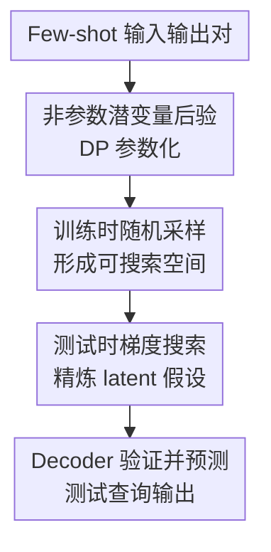

# Compositional Generalization through Gradient Search in Nonparametric Latent Space

**会议**: ICLR2026  
**OpenReview**: [https://openreview.net/forum?id=RNTWTJe4x6](https://openreview.net/forum?id=RNTWTJe4x6)  
**代码**: https://github.com/idiap/AbductionTransformer  
**领域**: 优化 / 测试时自适应  
**关键词**: 组合泛化, 非参数潜变量, 梯度搜索, Dirichlet Process, 元学习

## 一句话总结
这篇论文提出 Abduction Transformer，把 few-shot 抽象推理任务中的隐藏规则表示为可变大小的非参数潜在混合分布，并在测试时对潜在假设做梯度搜索，从而在 1-D ARC、SRAVEN 和语言系统性任务上显著提升 OOD 组合泛化能力。

## 研究背景与动机
**领域现状**：组合泛化讨论的是模型能否把训练中见过的原语、规则或子程序重新组合起来，解决训练时从未出现过的新任务。当前 Transformer、LLM 和元学习模型在很多分布内任务上很强，但在 ARC-like puzzle、Raven 矩阵、语法归纳这类需要系统性重组知识的任务上，经常会把训练分布中的模式记住，却无法把旧规则按新方式组合。

**现有痛点**：标准 encoder-decoder Transformer 通常把 few-shot examples 压成一次前向传播得到的上下文表示，然后直接解码测试答案。这个表示一旦前向传播结束就固定了，模型没有显式地检验“这个隐藏规则是否真的能解释所有示例”。已有 Latent Program Network 等方法引入测试时 latent search，但 latent 通常是固定维度向量；当任务复杂度从单个规则扩展到多个规则组合时，一个固定大小向量很难自然承载可变数量的构成成分。

**核心矛盾**：组合泛化需要两件事同时成立：表示空间要能容纳不同复杂度的隐藏假设，推理过程又要能在测试样本给出的约束下搜索这些假设。只靠强模型容量容易记忆训练组合；只靠测试时搜索，如果潜在空间不平滑、不可组合，也会找不到有意义的方向。

**本文目标**：作者把 few-shot 元学习任务重写为隐藏映射 $H$ 的后验推断问题：给定若干输入输出对 $X=\{(x_i,y_i)\}$，模型需要推断一个能解释这些样例的假设 $H$，再用它回答测试查询 $x_{query}$。目标不是让模型背下所有可能映射，而是让它学会在训练中见过的原语和部分组合之上，对测试时未见组合做假设搜索。

**切入角度**：论文的关键观察是，Transformer 本身输出的是一组向量，而不是单个向量；这组向量的数量会随输入 token 数变化。作者将这个 set-of-vector 结构解释为 Bayesian nonparametrics 中的可变复杂度表示，用 Dirichlet Process（DP）构造非参数潜变量空间，再在测试时对采样得到的 latent hypothesis 做梯度下降。

**核心 idea**：用“非参数潜在混合分布 + 信息论正则 + 测试时 latent gradient search”替代一次性前向推断，让模型在可搜索的假设空间里组合训练中学到的规则。

## 方法详解

### 整体框架
Abduction Transformer 把一个 few-shot episode 看成一次 abductive inference：样例对是观察，隐藏映射 $H$ 是解释这些观察的原因。模型先用 encoder 从每个输入输出对中推断一个 Dirichlet Process 后验，采样出 latent mixture 表示候选假设；再用 decoder 检查该假设是否能把示例输入解码成示例输出，并通过示例上的交叉熵损失在测试时直接更新 $H$。完成若干步搜索后，精炼后的 $H^o$ 被用于解码测试查询，得到最终预测。

从概率建模角度看，encoder 近似 $q_\phi(H\mid X)$，decoder 近似 $p_\theta(X\mid H)$。训练目标是变分自由能：一方面让 posterior 不要偏离先验太远，另一方面让 sampled hypothesis 能解释数据。测试时则固定模型参数 $\phi,\theta$，只更新 latent hypothesis $H$，因此它不是传统意义上的 test-time fine-tuning，而更像在模型学到的生成空间里做实例级后验推断。

### 关键设计
**1. 非参数潜变量后验：让隐藏规则的复杂度随任务变化**

组合任务的隐藏规则可能很简单，也可能是多个规则串联后的组合。如果 latent 表示总是一个固定维度向量，模型必须把“规则个数、规则类型、组合关系”都挤进同一个瓶颈里；训练只覆盖简单规则时，这种表示很容易在复杂组合上塌掉。Abduction Transformer 利用 Transformer encoder 的 set-of-vector 输出，把每个输出向量投影为 Dirichlet Process 的伪观测：均值 $\mu_i$、方差 $\sigma_i^2$ 和伪计数 $\alpha_i$。

论文将 posterior 写成一个 DP：$q_\phi(H\mid X):=DP(N_0(\mu,\sigma^2),\alpha_0)$，其中 base distribution $N_0$ 是由多组高斯伪观测按 $\alpha_i/\alpha_0$ 加权得到的混合分布，$\alpha_0=\sum_i\alpha_i$。这样，$H$ 不再是单个向量，而是从 DP 中采样出的离散混合分布；有效 component 数量可以随输入复杂度变化。这个设计和组合泛化的需求对齐：训练中见过的简单规则可以对应较少 component，测试时更复杂的组合可以通过更多或不同权重的 component 来表达。

**2. 训练时随机采样与 KL 正则：把 latent space 变成可搜索空间**

只把 encoder 输出解释成 DP 还不够，因为测试时梯度下降需要一个平滑、有意义的搜索地形。如果训练时 latent 表示是确定性的，梯度搜索可能只是沿着 decoder 的局部噪声方向乱走。作者因此在训练中从 posterior DP 采样 latent mixture，并加入 KL 正则，让 posterior 既能携带解释任务所需的信息，又不会变成任意复杂、尖锐且不可插值的记忆表。

训练损失近似为 $L(\phi,\theta)=\lambda_{KL}\frac{1}{n}\sum_i KL(q_\phi(H\mid x_i,y_i)\Vert p(H))-\log p_\theta(y^*\mid x_{query},H)$。其中 KL 项鼓励 mixture weights 稀疏，并通过带噪采样让 decoder 在 latent 附近形成稳定响应。实验中的“No KL-regularization”消融掉点明显，说明正则不是形式上的 VAE 装饰，而是搜索能够工作的前提：没有它，latent space 虽然能编码训练样例，却不一定能支持测试时对未见组合做连续优化。

**3. 测试时梯度搜索：把 few-shot examples 当作假设检验器**

测试阶段的核心动作是：先由 encoder 给出初始假设 $H$，再在 few-shot examples 上最小化 $-\sum_i\log p_\theta(y_i\mid x_i,H)$，只对 $H$ 求梯度，不更新 encoder 或 decoder 参数。每一步更新都等价于问“当前假设能否解释这些示例输入输出对”，如果不能，就沿着让示例重构损失下降的方向调整 latent mixture。

这种搜索特别适合组合泛化，因为未见组合并不一定需要新参数；它可能只是训练中已学规则在 latent 空间里的新位置或新配比。decoder 在这里扮演可微的验证器：同一个 $H$ 必须同时解释多个 few-shot pairs，才会被梯度更新保留下来。最后得到的 $H^o$ 没有见过测试输出 $y^*$，只利用示例约束，因此它更像 posterior refinement，而不是答案泄漏。

**4. Decoder 以 latent mixture 为条件：把假设显式作用到查询上**

Abduction Transformer 的 decoder 自回归生成输出 $\hat y$，并通过 cross-attention 访问 latent hypothesis $H$。由于 $H$ 是混合分布，作者采用 Henderson & Fehr 的 denoising-attention 视角，把普通 attention 推广到对分布的 attention；当输入分布退化为离散向量集合时，它又能覆盖常规 attention。

这个设计让“隐藏映射”不只是 encoder 内部状态，而是 decoder 每一步生成都能访问的条件变量。对 few-shot 样例而言，decoder 计算的是 $H(x_i)$；对测试查询而言，decoder 计算的是 $H^o(x_{query})$。因此整体方法在语义上保持闭环：encoder 推断规则，gradient search 用样例修正规则，decoder 将修正后的规则应用到新输入。

### 一个完整示例
可以把 1-D ARC 中的测试任务想成：训练集中见过 `translate` 和 `denoise`，但从未见过 `translate` 后接 `denoise` 的组合。few-shot examples 给出三组像素序列输入输出，单看其中一组可能有多种解释，但三组共同约束会排除许多错误假设。

Abduction Transformer 首先为每个样例对采样一个 latent mixture，并取平均形成初始 $H$。初始 decoder 可能只捕捉到“移动色块”而漏掉“去噪”，于是对三组示例输出的交叉熵仍然较高。测试时搜索会沿着降低这些损失的方向更新 $H$，使 latent mixture 同时包含 translation 和 denoising 的成分。经过固定步数后，模型不再重新训练参数，而是用这个精炼后的 $H^o$ 去处理新的 query 序列，输出组合变换后的结果。

这个例子也解释了为什么论文强调 nonparametric latent space：如果 latent 只能是一个单向量，translation 和 denoising 的组合容易被压缩成模糊折中；而 mixture 表示允许不同成分在同一个 hypothesis 中并存，搜索时可以调权重、调 component 位置，让组合关系更自然。

### 损失函数 / 训练策略
训练数据由 meta-learning episodes 组成，每个 episode 包含 problem specification $X$、test query $x_{query}$ 和 ground-truth output $y^*$。默认训练时先从每个 $(x_i,y_i)$ 的 DP posterior 采样 $H_i$，再平均得到 $H=\frac{1}{n}\sum_i H_i$；decoder 用 $H$ 预测 $y^*$，并和 KL 项一起反向传播。

论文也允许训练时插入中间 gradient search：先对 $H$ 做若干步示例重构损失优化，得到 $H^o$，再用 $H^o$ 解码 test query。实验中常用 1 步训练期搜索，测试期则根据任务使用 10 或 100 步搜索。优化器为 AdamW，ARC/SRAVEN 主要模型规模约 1.1M 到 1.3M 参数，说明结果不是靠大模型容量堆出来的。

## 实验关键数据

### 主实验
论文用三个任务族验证组合泛化：1-D ARC 测试未见函数组合，SRAVEN 测试未见规则组合，语言系统性任务测试未见解释语法。最关键的对比是：同样有测试时 latent search 的 LPN 使用单向量 latent，而 Abduction Transformer 使用非参数 mixture latent；标准 Transformer baseline 则缺少这种可搜索后验结构。

| 任务 | 指标 | Abduction Transformer | 最强主要基线 | 提升 / 结论 |
|------|------|----------------------|--------------|-------------|
| 1-D ARC OOD Composition | Solve Rate | 25.1 ± 2.6 | LPN 1.9 ± 1.0 / Decoder-only 5.2 ± 1.3 | 非参数 latent + 搜索显著优于单向量搜索和普通 Transformer |
| SRAVEN 训练 1% 规则组合 | Solve Rate | 46.1 ± 4.2 | LPN 37.1 ± 2.0 / Decoder-only 28.8 ± 1.3 | 极端 OOD 下优势最明显 |
| SRAVEN 训练 90% 规则组合 | Solve Rate | 96.4 ± 0.4 | Decoder-only 95.3 ± 1.1 / LPN 93.5 ± 1.0 | 训练覆盖充分时多种模型接近饱和 |
| 语言系统性任务 | Perfect Solve Rate | 10-shot 以上接近完美，5-shot 仍约 50% | encoder-decoder 随 examples 减少持续下降 | 在 few-shot 信息不足时更稳健 |

值得注意的是，作者还把 GPT-5 Thinking 和 GPT-4.1 作为零样本参照：1-D ARC 上 GPT-5 Thinking 为 29.0%，略高于本文模型；SRAVEN 1% split 上 GPT-5 Thinking 为 41.0%，低于本文的 46.1%。这个对比主要说明任务难度和方法潜力，因为本文模型只有约百万级参数且经过任务训练，不能简单等价为通用模型能力比较。

### 消融实验
| 配置 | 1-D ARC Solve Rate | SRAVEN 1% Solve Rate | 说明 |
|------|-------------------|----------------------|------|
| Full Abduction Transformer | 25.1 | 46.1 | 完整方法：DP mixture latent + KL 正则 + 测试时搜索 |
| No KL-regularization | 16.7 | 16.8 | latent space 失去信息瓶颈与平滑性后，搜索效果大幅下降 |
| No gradient search | 0.1 | 20.9 | 没有测试时后验精炼，极端组合泛化明显不足 |
| Encoder-decoder baseline | 0.1 | 10.8 | 即使有类似训练设置，确定性表示不形成可搜索空间 |
| LPN | 1.9 | 37.1 | 单向量 latent search 有帮助，但复杂组合上不如非参数 mixture |

### 关键发现
- 在非组合设置中，Abduction Transformer 和 LPN 几乎一样强：1-D ARC 分别为 98.39 与 97.90，SRAVEN 分别为 99.95 与 99.90。这说明本文优势不是普通任务求解能力，而是来自非参数 latent 对未见组合的承载能力。
- 测试时搜索步数越多，Abduction Transformer 和 LPN 在 1-D ARC 与 SRAVEN 上都受益；但 Abduction Transformer 的起点和上限更好，说明它的 latent geometry 更适合被梯度优化。
- t-SNE 可视化显示，训练中见过的 primitive transformation 在 latent space 中分离较清楚，未见组合会落在相关 constituent transformations 附近。这为“搜索是在语义组织良好的空间中进行”提供了直观证据。
- SRAVEN 的 90% split 上 decoder-only baseline 已接近满分，说明如果训练覆盖大部分组合，普通 Transformer 也能插值；真正区分方法的是 1% split 这种极端 OOD 组合情形。

## 亮点与洞察
- 把组合泛化问题明确落到“隐藏假设后验推断”上很有启发性。论文没有只说模型需要 reasoning，而是把 reasoning 拆成可训练的 posterior、可搜索的 latent 和可验证的 decoder 三个环节。
- 非参数 latent space 是这篇论文最关键的结构选择。它利用了 Transformer 输出一组向量的自然形态，比把所有内容压成一个 latent vector 更贴近“规则组合数量可变”的问题本质。
- 测试时只优化 latent hypothesis，而不更新模型参数，是一个很干净的 test-time adaptation 形式。它避免了 TTFT 中参数漂移和样本构造的问题，同时保留了“针对当前实例多想几步”的能力。
- KL 正则的角色被实验验证得很清楚：它不是为了追求生成模型美观，而是为了让 latent space 可搜索。这个思想可以迁移到其他需要实例级搜索的任务，例如工具组合、程序归纳、结构化规划和小样本任务适配。
- 与 LLM 的对比虽然不是严格公平的同类竞赛，但很能说明一个方向：小模型如果有合适的后验推断机制，在特定抽象推理任务上可以接近甚至超过大通用模型的零样本表现。

## 局限与展望
- 任务仍以合成或程序化生成的抽象推理为主，包括 1-D ARC、SRAVEN 和人工语法归纳。它们能精确测量组合泛化，但离真实世界的多模态任务、开放式语言推理或复杂软件工程任务还有距离。
- 测试时 gradient search 需要额外计算，且搜索步数在不同任务上不同：ARC/SRAVEN 极端设置使用到 100 步，推理成本会随 episode 数量显著增加。未来需要研究自适应停止、搜索步预算分配或更高效的 latent optimizer。
- 论文展示了 latent space 的 t-SNE 结构，但对 mixture component 是否真的对应可解释子规则，还缺少更直接的因果或可解释性分析。若 component 能被稳定映射到 primitive rule，将更能支撑“组合”解释。
- 方法依赖 few-shot examples 对隐藏规则有足够约束；当示例不足以唯一确定规则时，模型可能学到数据分布偏好而非真正推断。语言系统性实验中 5-shot 还能保持约 50% 是亮点，但也说明信息不足时性能仍会下降。
- 未来可以把这种 latent posterior search 接到更真实的程序合成、ARC-AGI 2D 任务、LLM tool-use planning 或多步数学证明中，检验非参数 latent 是否能承载更长链条、更离散的组合结构。

## 相关工作与启发
- **vs Latent Program Network**: LPN 同样在测试时搜索 latent program，但主要使用单向量潜变量。本文保留 latent search 的优点，同时用 DP mixture 表示可变复杂度假设，因此在 1-D ARC 未见组合和 SRAVEN 1% split 上明显更强。
- **vs 标准 encoder-decoder Transformer**: 标准模型把 few-shot examples 编码后直接解码，没有显式 posterior refinement。本文把“解释示例”变成测试时优化目标，因此可以在新组合上利用示例反馈调整假设。
- **vs decoder-only Transformer / in-context learning**: decoder-only baseline 在训练覆盖充分时表现很好，但在极端 OOD 组合下掉点明显。本文说明仅靠上下文条件化不一定够，关键是要有能被示例约束修正的中间假设。
- **vs Test-Time Fine-Tuning**: TTFT 通常更新模型参数或在测试输入附近构造训练数据；本文固定参数，只更新 latent representation。这个边界更清楚，也更适合把推理解释为 posterior inference。
- **vs VAE / Transformer VAE**: 本文继承 VAE 的变分推断和 KL 正则，但把 latent 从 fixed vector 扩展为 set-of-vector / nonparametric mixture，更适合 Transformer 和组合复杂度可变的任务。

## 评分
- 新颖性: ⭐⭐⭐⭐⭐ 把 DP 非参数 latent、变分正则和测试时 gradient search 组合到抽象组合泛化中，结构设计很有辨识度。
- 实验充分度: ⭐⭐⭐⭐ 覆盖三类任务、多个 baseline 和关键消融，但真实世界开放任务还不够。
- 写作质量: ⭐⭐⭐⭐ 论文主线清楚，公式和实验设置完整；部分 appendix 细节较多，读者需要来回对照。
- 价值: ⭐⭐⭐⭐⭐ 对“神经网络如何系统性组合知识”给出一个可实现、可消融、可扩展的方向，尤其适合启发测试时推理和潜变量搜索研究。

<!-- RELATED:START -->

## 相关论文

- [\[AAAI 2026\] Instance Generation for Meta-Black-Box Optimization through Latent Space Reverse Engineering](../../AAAI2026/optimization/instance_generation_for_meta-black-box_optimization_through_latent_space_reverse.md)
- [\[ICLR 2026\] Improving LLM-based Global Optimization with Search Space Partitioning](improving_llm-based_global_optimization_with_search_space_partitioning.md)
- [\[ICLR 2026\] Binomial Gradient-Based Meta-Learning for Enhanced Meta-Gradient Estimation](binomial_gradient-based_meta-learning_for_enhanced_meta-gradient_estimation.md)
- [\[ICLR 2026\] Deep Latent Variable Model based Vertical Federated Learning with Flexible Alignment and Labeling Scenarios](deep_latent_variable_model_based_vertical_federated_learning_with_flexible_align.md)
- [\[ICLR 2026\] Generalizable Heuristic Generation Through LLMs with Meta-Optimization](generalizable_heuristic_generation_through_llms_with_meta-optimization.md)

<!-- RELATED:END -->
