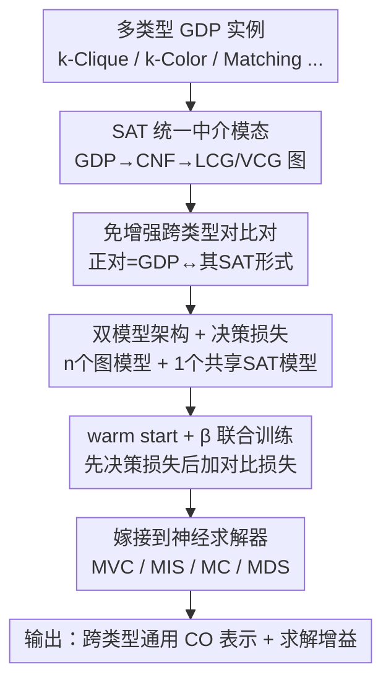

# ConRep4CO: Contrastive Representation Learning of Combinatorial Optimization Instances across Types

**会议**: ICLR 2026  
**OpenReview**: [https://openreview.net/forum?id=OXRnvOOiAf](https://openreview.net/forum?id=OXRnvOOiAf)  
**代码**: https://github.com/Thinklab-SJTU/ConRep4CO  
**领域**: 组合优化 / 表示学习 / 对比学习 / 图神经网络  
**关键词**: 组合优化、对比预训练、SAT 归约、跨类型表示、图决策问题

## 一句话总结
ConRep4CO 把不同类型的组合优化（CO）实例统一归约成 SAT 形式作为"中介模态"，再以"原始实例 ↔ 其 SAT 形式"为正对做免增强的对比预训练，从而学到跨问题类型通用的表示，把它嫁接进 MVC/MIS/MC/MDS 等专用神经求解器后，目标值 gap 平均缩小 32%~61%。

## 研究背景与动机
**领域现状**：用机器学习解组合优化（ML4CO）这几年很火，主流范式是两段式——先用 GNN 把图实例编码成低维表示，再用这个表示去预测/构造解。但绝大多数工作都是为**单一问题类型**量身定做的，比如专门做 TSP、专门做图匹配。

**现有痛点**：和文本、视觉里成熟的表示学习（BERT、CLIP 这类）相比，CO 的**表示学习**本身一直被忽视，尤其是**跨类型**的通用表示几乎没人碰。单类型方法的问题是各练各的，k-Clique 学到的东西帮不上 k-Color，无法利用问题之间潜在的共性知识，泛化到更大规模或没见过的新问题时就容易崩。

**核心矛盾**：要做跨类型对比学习，最直接的想法是照搬视觉里的 SimCLR——给同一实例做数据增强生成正样本。但 CO 实例的"增强"是个出了名的难题：图结构高度受约束，随机加边/删点往往会破坏问题语义（一个可满足实例增强后可能就不可满足了），所以视觉那套增强范式没法直接搬过来。同时，不同 GDP 类型图拓扑差异巨大，根本没有天然的公共空间来对齐。

**本文目标**：① 找到一种能跨越异构 CO 问题类型的公共表示空间；② 在不依赖数据增强的前提下构造有效的对比正负样本；③ 让学到的通用表示真能反哺实际的 NP-hard 优化求解。

**切入角度**：作者抓住了一个理论事实——**所有 NP 完全（NPC）问题都能互相归约，并且都能转化成布尔可满足性问题（SAT）**。Karp 的 21 个 NPC 问题里有 10 个是图决策问题（GDP），它们恰好是各类 NP-hard 优化问题（MVC、MIS……）的决策版本。既然 SAT 是它们共同的"最大公约形式"，那 SAT 就可以当作连接所有类型的桥梁。

**核心 idea**：把每种 GDP 看作一种"模态"，用 **SAT 形式作为统一中介模态**，让"原始 GDP 实例"和"它归约出的 SAT 实例"天然构成对比正对（免增强），通过对比学习把异构问题类型对齐到同一表示空间，得到一个可迁移的 CO 预训练范式。

## 方法详解

### 整体框架
ConRep4CO 要解决的是"如何在多种 CO 问题类型之间学一套通用表示"。整体流程是：拿来 $n$ 种 GDP（k-Clique、k-Domset、k-Vercov、k-Color、k-Indset、Matching、Automorph 等），先把每个实例用 CNFGen 这类现成工具归约成 CNF、再画成 SAT 图（LCG 或 VCG）；然后为每种 GDP 配一个独立的"图模型"、再配一个共享的"SAT 模型"，每个模型都由 **表示提取器（GNN）+ 输出模块（MLP）** 两部分组成；训练时用两种监督——**决策损失**让各模型学好自己问题域的判别表示，**对比损失**把每个 GDP 模态和 SAT 模态对齐，让信息在不同问题域之间流动。预训练好的 SAT 模型可以被冻结复用，嫁接进 MVC/MIS/MC/MDS 的专用神经求解器，实现"一次预训练、多处增益"。

### 关键设计

**1. SAT 作为统一中介模态：给异构问题类型找一个公共空间**

不同 GDP 的图拓扑天差地别，没法直接对齐，这是跨类型表示学习的根本障碍。作者的做法是把每个 GDP 实例 $(P_i, G_i^j)$ 先归约成 CNF 公式、再构造成 SAT 图 $B_i^j$（论文用文献里的 LCG——文字-子句二部图，以及由它合并文字与其否定得到的 VCG）。这样一来，无论原始问题是着色还是团搜索，都被标准化成同一种 SAT 图表示，从而获得跨问题类型的统一建模接口。归约用 CNFGen 现成工具，只需多项式复杂度，相对于训练成本可忽略。这一步把"对齐异构图"的难题，转化成了"对齐每个实例和它自己的 SAT 形式"的简单问题。

**2. 免增强的跨类型对比对：用 SAT 归约天然生成正负样本**

视觉里靠裁剪/翻转造正样本，但 CO 实例的增强会破坏问题语义，行不通。ConRep4CO 干脆**不做任何增强**：对某个 GDP 类型 $P_n$，把"一个原始实例"和"它归约出的 SAT 实例"定义成**正对**，而同一 GDP 类型里其他实例对应的 SAT 图（对图模型而言）、或其他原始实例（对 SAT 模型而言）就是**负样本**。对比损失采用经典 InfoNCE 形式，对每个 batch 内 $N$ 对实例做双向对齐：

$$\mathcal{L}_{con,n}=\sum_{i=1}^{N}\left(-\log\frac{\exp(\mathrm{sim}(\hat r_n^i,\hat r_{sat}^i)/\tau)}{\sum_{j=1}^{N}\mathbb{1}_{j\neq i}\exp(\mathrm{sim}(\hat r_n^i,\hat r_{sat}^j)/\tau)}-\log\frac{\exp(\mathrm{sim}(\hat r_n^i,\hat r_{sat}^i)/\tau)}{\sum_{j=1}^{N}\mathbb{1}_{j\neq i}\exp(\mathrm{sim}(\hat r_n^j,\hat r_{sat}^i)/\tau)}\right)$$

其中 $\hat r_n^i$、$\hat r_{sat}^i$ 是归一化后的实例表示，$\tau$ 是温度，$\mathrm{sim}(\cdot,\cdot)$ 是余弦相似度。SAT 模态作为"枢纽"和所有其他模态对齐，从而让 k-Clique 学到的东西能通过 SAT 中介传给 k-Color，实现跨域信息传递。免增强是它相对于直接照搬 SimCLR 的关键优势。

**3. 双模型架构 + 决策损失：每个模态既学判别又留住自身特性**

为了在对齐共性的同时不丢掉每种问题的独有特征，作者搭了 $n+1$ 个模型——$n$ 个图模型 $M_1,\dots,M_n$（每种 GDP 一个）外加一个统一 SAT 模型 $M_{sat}$。每个模型都是 **表示提取器（GNN，负责从输入图抽实例级表示）+ 输出模块（MLP，负责把表示映射成判定输出）** 的两段式结构。除了对比损失，每个模型还独立地用**决策损失**（二元交叉熵）监督：

$$\mathcal{L}_{dec}=\sum_{i\in Batch}\left[-d_i^{gt}\log(d_i^{out})-(1-d_i^{gt})\log(1-d_i^{out})\right]$$

$d^{out}$ 是模型判定输出、$d^{gt}$ 是真值标签。决策损失独立作用在每个模型上，逼它学好自己问题域的判别特征；对比损失则跨模态做信息融合。两者一推一拉，既保证每个模型解自己的 GDP 准，又让表示空间彼此对齐。

**4. warm start + β 加权的联合训练：先站稳再对齐**

如果一上来就同时上决策损失和对比损失，模型还没学到任何有意义的表示，强行做跨模态对齐反而会把训练带偏。作者用 **warm start** 策略：初始阶段只开决策损失、关掉对比损失，让每个模型先基于判定结果学到稳定的任务特定表示；等表示打好基础后，再引入对比损失做更复杂的跨模态对齐。联合阶段用一个权重参数 $\beta$ 控制决策损失的相对比重，平衡两个目标。SAT 模型这边则是把它对所有 GDP 模态算出的对比损失**取平均**来优化，保证它作为枢纽对每个模态都公平对齐。

**5. 嫁接到问题专用神经求解器：让通用表示反哺实际优化**

预训练只在 GDP 上做，但 ConRep4CO 真正的价值是要帮上 NP-hard 优化求解。作者给出一套"即插即用"流程：① 把目标问题（如 MVC）的决策版实例转成 CNF；② 用第 2、3 个设计里的损失，让神经求解器和**冻结的**预训练 SAT 模型做对比对齐（求解器可能要小改，比如加个输出模块）；③ 在原问题域上微调求解器以适配学到的表示。因为预训练好的 SAT 模型可复用、参数固定，整个过程只需一次轻量对齐而非全量重训，所以一套预训练 SAT 模型能服务多个下游求解器，实用性大大提高。

### 损失函数 / 训练策略
总损失 = 决策损失 $\mathcal{L}_{dec}$（每个模型独立的 BCE）+ 对比损失 $\mathcal{L}_{con}$（GDP 模态与 SAT 模态对齐的 InfoNCE），用 $\beta$ 加权。训练采用 warm start：先纯决策损失热身，再加入对比损失联合训练；SAT 模型用跨所有 GDP 模态的平均对比损失优化。

## 实验关键数据

### 主实验
评测分两块：**表示质量评测**（用 GDP 求解准确率衡量学到的表示好不好）和 **CO 求解增强**（把 ConRep4CO 嫁接进专用求解器看 gap 缩小多少）。7 个 GDP 覆盖 easy/medium/hard 三档难度，每个 easy/medium 数据集 16 万训练样本，标签 50% 可满足 / 50% 不可满足。

表示质量（GCN+ConRep4CO 在 identical 分布上的 Overall 准确率，节选）：

| 难度 | 配置 | Overall 准确率(%) |
|------|------|------|
| Easy | Graph Model | 68.5 |
| Easy | + ConRep4CO | 71.9 |
| Medium | Graph Model | 65.7 |
| Medium | + ConRep4CO | 69.1 |

GraphSAGE 主干上提升尤其夸张：Easy Overall 从 54.9 → 73.9，Medium 从 54.8 → 70.9。

CO 求解增强（gap 缩小幅度，越大越好）：

| 问题 | 基线求解器 | avg. gain |
|------|-----------|-----------|
| MVC | OptGNN | 61.27% |
| MIS | GFlowNet | 32.20% |
| MC | GFlowNet | 36.46% |
| MDS | GFlowNet | 45.29% |

以 MVC ER(50,100) 为例，OptGNN 基线目标值 55.87（最优 54.62，绝对 gap 1.25），加 ConRep4CO 后降到 54.70（gap 0.08），单点 gain 高达 93.6%。

### 消融实验

| 配置 | Easy Overall(%) | Medium Overall(%) | 说明 |
|------|------|------|------|
| + ConRep4CO（完整） | 71.9 | 69.1 | 跨域信息传递开启 |
| + ConRep4CO + Single Domain | 71.4 | 67.9 | 关掉跨域信息传递 |

关掉跨域信息传递后 Overall 下降（Medium 掉得更明显，69.1 → 67.9），印证"跨域信息传递"是框架核心收益来源，而不只是 SAT 变换本身带来的。

### 关键发现
- **跨域信息传递是主要增益来源**：Table 6 显示，单域版本（Ours-1）只有约 5% 的 gain，主要来自 SAT 变换本身；多域对齐才是性能大头。
- **预训练域数量存在饱和**：随源域数从 1 增到 7，下游增益**亚线性**增长，1→2 提升最陡，到 5~6 个域后基本饱和（新信息边际收益递减）。这意味着扩到大量 GDP 时不必把所有域都纳入预训练。
- **大规模问题增益略小**：gain 在更大规模实例上偏小（如 MVC ER(400,500) 只有 38.83%），作者归因于预训练数据集与评测问题之间规模差距拉大、问题更难。
- **泛化性提升显著**：在没见过的 hard 数据集（in-domain 规模泛化）和完全没见过的 GDP 域（cross-domain，只用 2 万实例微调）上，+ConRep4CO 都稳定超过独立训练基线。

## 亮点与洞察
- **把"对齐异构问题"转化成"对齐实例与其归约形式"**：直接对齐不同 GDP 的图几乎无从下手，作者用 NPC 可互相归约这一理论事实，把 SAT 当公共形式，巧妙地把难题降维成了天然成对的简单问题——这是最"啊哈"的一步。
- **免增强对比是顺势而为而非妥协**：CO 增强本就是大难题，作者没有硬造增强，而是让"原始实例 ↔ SAT 形式"自然成对，既绕开了增强陷阱，又让正对带有真实语义等价性，比随机扰动的正对更可靠。
- **可迁移的范式设计**："冻结预训练 SAT 模型 + 轻量对齐 + 微调"这套嫁接流程，本质上是把 CO 也做成了 CLIP 式的"预训练 + 下游适配"，一次预训练复用到多个求解器的思路可以推广到其他结构化优化任务（如未来想做的 MILP）。

## 局限与展望
- **依赖标签的监督训练**：决策损失需要可满足/不可满足的真值标签，数据稀疏场景受限；作者展望转向无监督/自监督来降低对标签的依赖。
- **绑定 SAT 形式**：当前中介模态固定为 SAT，对能干净归约成 NPC/SAT 的问题友好，但对 MILP 这类更一般的 CO 问题不一定适配；作者计划探索 SAT 之外的其他统一形式。
- **规模泛化仍有衰减**：大规模实例上的增益明显小于小规模，预训练与下游的规模 gap 是个未解的实际瓶颈。
- **饱和现象的代价**：5~6 域饱和意味着继续堆问题类型收益有限，如何突破这个信息饱和上限论文未深究。

## 相关工作与启发
- **vs 单类型 ML4CO（TSP/图匹配专用方法）**：它们各练各的、不共享跨域知识；ConRep4CO 用 SAT 中介把多类型对齐，主打跨类型通用表示，泛化性更强。
- **vs 多任务 CO（GOAL / UniCO / MAB-MTL）**：这些工作直接走多任务范式、没有对比预训练；ConRep4CO 与之正交，靠对比预训练学共享表示，可叠加。
- **vs 图对比学习（SimCLR / GraphCL 等增强类方法）**：传统方法靠结构/特征扰动造增强正样本，在 CO 上会破坏语义；ConRep4CO 是**免增强**的，用跨问题类型的 SAT 归约对替代增强对，更契合 CO 的离散约束特性。

## 评分
- 新颖性: ⭐⭐⭐⭐⭐ 用 NPC 归约把"统一 CO 表示"做成 SAT 中介下的免增强对比预训练，角度新颖且有理论支撑。
- 实验充分度: ⭐⭐⭐⭐ 7 个 GDP × 多主干 + 4 个下游 NP-hard 问题，含跨域/规模泛化与饱和分析，较扎实；但都是合成图、缺真实世界数据。
- 写作质量: ⭐⭐⭐⭐ 动机推导清晰、图示到位，归约与对比方案讲得明白。
- 价值: ⭐⭐⭐⭐ "预训练一次、多求解器复用"对 ML4CO 是有吸引力的范式，gap 缩小幅度可观。

<!-- RELATED:START -->

## 相关论文

- [\[ICLR 2026\] HeuriGym: An Agentic Benchmark for LLM-Crafted Heuristics in Combinatorial Optimization](heurigym_an_agentic_benchmark_for_llm-crafted_heuristics_in_combinatorial_optimi.md)
- [\[ICLR 2026\] FrontierCO: Real-World and Large-Scale Evaluation of Machine Learning Solvers for Combinatorial Optimization](frontierco_real-world_and_large-scale_evaluation_of_machine_learning_solvers_for.md)
- [\[ICLR 2026\] NExCO: Native Solution Expansion for Diffusion-based Combinatorial Optimization](nexco_native_solution_expansion_for_diffusion-based_combinatorial_optimization.md)
- [\[ICLR 2026\] Multi-Action Self-Improvement for Neural Combinatorial Optimization](multi-action_self-improvement_for_neural_combinatorial_optimization.md)
- [\[ICML 2026\] Bayesian Gated Non-Negative Contrastive Learning](../../ICML2026/optimization/bayesian_gated_non-negative_contrastive_learning.md)

<!-- RELATED:END -->
