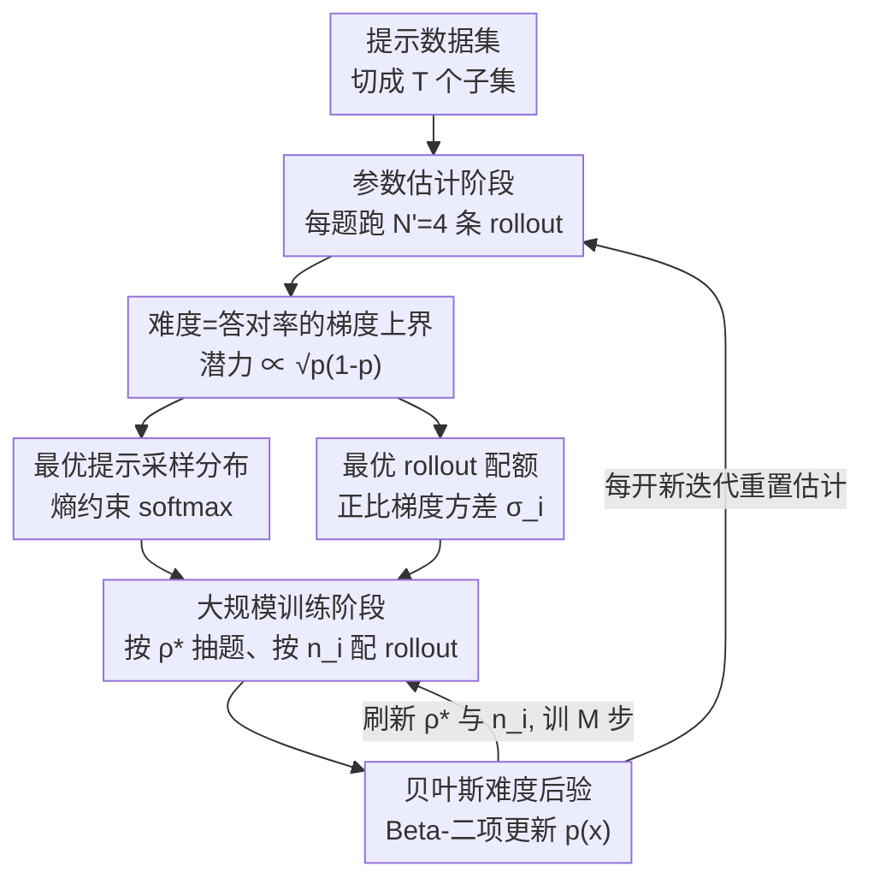

# CurES: From Gradient Analysis to Efficient Curriculum Learning for Reasoning LLMs

**会议**: ICLR2026  
**OpenReview**: [https://openreview.net/forum?id=QXrZ0Y3yGJ](https://openreview.net/forum?id=QXrZ0Y3yGJ)  
**代码**: https://github.com/ZexuSun/CurES  
**领域**: 强化学习 / 推理LLM / 课程学习  
**关键词**: RLVR, 课程学习, 梯度方差, 贝叶斯后验, 样本效率

## 一句话总结
CurES 从强化学习梯度分析出发，证明"提示采样分布决定收敛速度、rollout 配额决定梯度更新的稳定性"，并据此用一套贝叶斯（Beta-二项）难度估计动态地把采样概率和 rollout 预算往中等难度题上倾斜，在八个数学推理基准上比 GRPO 平均高 3.3（1.5B）/4.82（7B）分，且收敛快至 5.5 倍。

## 研究背景与动机
**领域现状**：带可验证奖励的强化学习（RLVR，如 GRPO、REINFORCE++）已是训练推理 LLM 的主流范式——对一道题采样多条 rollout、用"答案对不对"作为 0/1 奖励来更新策略。但主流做法默认对所有训练题**一视同仁**：均匀采样、每题固定 rollout 数。

**现有痛点**：题目难度天然异质，均匀对待会把算力浪费在两类无效题上——要么是模型早已做对、几乎没有梯度信号的简单题，要么是模型几乎全错、学不动的超难题。已有改进各有缺陷：手工分阶段课程（按难度切几段）粒度太粗，跟不上模型能力的演化；在线数据过滤（先生成 rollout 再剪枝）必须先把 rollout 全跑完才知道该不该丢，rollout 阶段的算力照样浪费；动态算力再分配（如 GVM、Speed-RL）又只各管一头（要么只调采样、要么只调 rollout 配额）。

**核心矛盾**：这些方法都是经验性的、零散的，缺一个统一的理论把"该采哪些题"和"每题该跑几条 rollout"一起讲清楚——到底是什么量在决定训练效率？

**本文目标**：从最贴近优化本质的**梯度**视角出发，回答两个子问题：(1) 提示采样分布如何影响损失收敛速度？(2) rollout 配额如何影响梯度更新的一致性与稳定性？再把答案落成一个低开销的实用算法。

**切入角度**：把"题目难度"直接定义为模型在该题上的答对率 $p_\theta(x)$，于是难度变成一个可以反复估计、还能随训练更新的标量；再用自然梯度 + Cramér-Rao 不等式把单题的损失下降幅度上界精确地写成 $p_\theta(x)$ 的函数。

**核心 idea**：损失的可优化潜力正比于 $\sqrt{p_\theta(x)(1-p_\theta(x))}$——在 $p=0.5$（中等难度）时最大、在 $p\to0$ 或 $p\to1$（太难或太易）时趋零；据此把采样概率和 rollout 预算都向中等难度题倾斜，并用贝叶斯后验在训练中持续、廉价地刷新难度估计。

## 方法详解

### 整体框架
CurES 的目标是：在固定 rollout 总预算下，让每一步策略更新都尽量榨取最大梯度信号。它把 RLVR 训练改造成"先估难度、再按难度分配资源"的两阶段循环，并嵌进一个抗分布漂移的迭代结构里。

整条管线由两部分理论支撑、再落成一个算法循环：**理论侧**先证明单题损失下降的上界由难度 $p_\theta(x)$ 决定（4.1 节），由此解出**最优提示采样分布**；再证明实际梯度估计的方差由 rollout 配额决定（4.2 节），由此解出**最优 rollout 配额**。**算法侧**把整个数据集切成 $T$ 个互不重叠的子集做迭代训练；每个迭代内分两阶段：① **参数估计阶段**——对当前子集每题先跑少量（$N'=4$）rollout，冷启动出难度估计与梯度方差；② **大规模训练阶段**——按估出的采样分布有放回地抽一批提示，按估出的配额给每题分 rollout，跑完后用贝叶斯后验刷新难度、再做一次 RL 更新。每开一个新迭代就重置难度/方差估计，以对抗模型能力变化带来的分布漂移。

### 关键设计

**1. 难度=答对率的梯度上界：把"该练哪些题"还原成一道可解的优化题**

作者先把题目难度直接定义为模型答对率 $p_\theta(x)=\mathbb{E}_{y\sim\pi_\theta}[r(x,y)]$（$r$ 是 0/1 可验证奖励）。对单题在 KL 信赖域约束 $\mathrm{KL}(\pi_{\theta_{old}}\|\pi_\theta)\le\delta$ 下做最优更新，用拉格朗日乘子 + 对损失一阶/对 KL 二阶泰勒展开，解出自然梯度方向，得到损失下降幅度等于 $\sqrt{2\delta\,g^\top F^{-1} g}$（$F$ 为 Fisher 信息矩阵）。再注意到 0/1 奖励是答对率的无偏估计，套 Cramér-Rao 不等式，得到这篇论文的核心不等式：

$$|L(\theta_{old}+d)-L(\theta_{old})|\le\mathbb{E}_{x\sim\rho}\Big[\sqrt{2\delta\,p_{\theta_{old}}(x)\big(1-p_{\theta_{old}}(x)\big)}\Big].$$

这一步是全文的地基：它把"一道题能贡献多少损失下降"精确地写成难度的函数 $\sqrt{p(1-p)}$，在 $p=0.5$ 时最大、太难太易时趋零——首次从理论上**证明**了"中等难度最有用"这个此前只靠直觉的经验法则。

**2. 最优提示采样分布：在熵约束下把采样概率偏向中等难度**

既然每题潜力是 $\sqrt{p(1-p)}$，那采样分布 $\rho$ 就该往高潜力题倾斜，但又不能塌缩到只采那几道题（要保留探索）。作者把它写成"最大化期望潜力 + 熵正则"的约束优化：$\max_\rho \mathbb{E}_{x\sim\rho}[\sqrt{2\delta p(1-p)}+\alpha H(\rho)]$，闭式解是一个温度化的 softmax：

$$\rho^*(x)=\frac{\exp\big(\sqrt{p(1-p)}/\tau\big)}{\sum_{x'}\exp\big(\sqrt{p(x')(1-p(x'))}/\tau\big)},\quad \tau=\frac{\alpha}{\sqrt{2\delta}}.$$

和 Speed-RL 那种硬性"扔掉准确率为 0 或 1 的题"的过滤不同，这里是**连续加权**：中等难度题概率最高、极端题概率小但非零，温度 $\tau$ 平滑地调节"专注 vs 探索"，避免了硬过滤丢信息又能聚焦高产出题。

**3. 最优 rollout 配额：用梯度方差决定每题跑几条**

采样分布管"练哪些题"，但实际梯度估计 $\hat g$ 是用有限 rollout 算出来的，会有方差，方差大就让更新方向飘、训练不稳。作者把"在总预算 $\sum_i n_i=N$ 下让实际更新逼近理论上界"化简成最小化梯度估计的总方差 $\mathrm{Tr}(V(\hat g))$，拉格朗日解出配额正比于每题的梯度标准差：

$$n_i=\frac{\sigma_i}{\sum_j\sigma_j}N,\quad \sigma_i=\sqrt{\mathrm{Tr}\big(V_{y\sim\pi_{old}}(h(y,x_i;\theta_{old}))\big)}.$$

关键巧思在于 $\sigma_i$ 的计算：作者把方差按"答对/答错"两类展开成一个对称闭式，让它**复用 4.1 节已经估出的难度 $p(x)$**（方差里出现的正是 $p(1-p)^2$、$p^2(1-p)$ 这类项），于是配额估计几乎不额外花算力。这也解释了为何 CurES 和 GVM 行为相反：GVM 随准确率上升单调减 rollout，而 CurES 是"中等难度配最多 rollout"的钟形分配，梯度更一致、训练更稳。

**4. 贝叶斯难度后验 + 分子集迭代：让难度估计又准又便宜，还抗漂移**

前两个设计都依赖准确的难度 $p(x)$，但难度在训练中一直变，"每次采样前先专门评测一遍"既贵又浪费样本。作者把 rollout 拆成多阶段 mini-batch，套 Beta-二项共轭：假设 $p_{\theta_{old}}(x_i)\sim\mathrm{Beta}(\alpha_0,\beta_0)$（$\alpha,\beta$ 即累计答对/答错数），每观测到一批新 rollout（$n_i$ 条里 $s$ 条对）就闭式更新后验 $\alpha_t=\alpha_{t-1}+s,\ \beta_t=\beta_{t-1}+n_i-s$，用后验均值当难度估计。这样训练过程中**顺带产生的 rollout 就是难度证据**，不需要独立评测步，置信度还越训越高。

但模型能力一路上升会让旧估计系统性失真（分布漂移），训得越久越严重。作者借鉴 GVM，把数据集切成 $T=15$ 个不重叠子集逐个迭代训练，每个迭代固定训 $M$ 步、**开新迭代时重置全部难度与方差估计**——既廉价地清掉了过期估计，又让采样配额始终对齐模型当下的真实能力。

### 损失函数 / 训练策略
优化目标仍是标准 RLVR（信赖域内最大化期望可验证奖励），优势函数 $A_{\theta_{old}}(x,y)=r(x,y)-\mathbb{E}_{y\sim\pi_{old}}[r]$；GRPO 与 REINFORCE++（RPP）都可作为优势估计器接入。训练框架用 VERL，策略初始化为 Qwen2.5-Math（1.5B / 7B），学习率恒为 $1\times10^{-6}$；数据集 Numina-Math 切 15 子集做 15 个迭代、每迭代 10 步，每迭代起始每题 4 条 rollout 冷启动，训练期总预算 $8\times1024$。

## 实验关键数据

### 主实验
八个数学推理基准（MATH500 / GSM8K / Gaokao-EN / Minerva / OlympiadBench / AIME24 / AIME25 / AMC23），竞赛级小测集取 16 次平均。

| 模型 | 方法 | 平均分 (Avg.) | vs GRPO |
|------|------|------|------|
| Qwen2.5-Math-1.5B | GRPO | 41.64 | — |
| 1.5B | GVM-GRPO | 42.82 | +1.18 |
| 1.5B | **CurES-GRPO** | **44.94** | **+3.30** |
| 1.5B | **CurES-RPP** | 44.14 | — |
| Qwen2.5-Math-7B | GRPO | 47.59 | — |
| 7B | GVM-GRPO | 50.64 | +3.05 |
| 7B | **CurES-GRPO** | **52.41** | **+4.82** |

CurES-GRPO 在两个规模上都拿下最佳平均分，比最强的样本高效基线平均再高 +2.12 分。

### 效率与行为分析（替代消融）
本文没有传统模块消融表，而是用三组分析验证每个机制的作用：

| 分析 | 配置 | 关键发现 |
|------|------|---------|
| 收敛速度 (Fig.6) | CurES-GRPO vs GRPO | 达到同等峰值快 **5.5×**；CurES-RPP vs RPP 快 1.75× |
| rollout 配额 (Fig.4) | 不同迭代 | 配额随准确率呈"钟形"，中等难度题分到最多 rollout，且随训练越来越尖 |
| 采样配置 (Fig.5) | $N'\in\{4,8,16\}$, $n\in\{8,16,32\}$ | 增大 $N'$ 或 $n$ 收益不成正比——小值已够，证明高样本效率 |

### 关键发现
- **"中等难度最有用"被理论证明**：损失下降潜力 $\propto\sqrt{p(1-p)}$，$p=0.5$ 最大，这是采样/配额都偏向中等难度的根因。
- **CurES 与 GVM 配额方向相反**：GVM 随准确率上升单调减 rollout，CurES 给中等难度配最多 rollout，钟形分配带来更稳的梯度。
- **难度分布随训练右移且收紧**（Fig.3）：模型逐渐掌握样本、成功率趋于双峰，恰说明均匀采样在双峰分布下效率最低，凸显重分布采样的必要。

## 亮点与洞察
- **把经验法则升级成定理**：此前"中等难度题最有训练价值"全凭直觉，本文用自然梯度 + Cramér-Rao 把它写成 $\sqrt{p(1-p)}$ 的闭式上界，让采样和配额都有据可依，这是最漂亮的一笔。
- **方差闭式复用难度估计**：rollout 配额所需的 $\sigma_i$ 被拆成按答对/答错分类的对称式，直接复用已估的 $p(x)$，把"两个看似独立的资源分配问题"用同一个难度标量串了起来，几乎零额外开销。
- **贝叶斯后验把评测成本摊进训练**：Beta-二项共轭让"训练顺带产生的 rollout"直接充当难度证据，不需要独立评测步，这个思路可迁移到任何需要在线估计样本难度/价值的数据选择场景。
- **分子集重置对抗漂移**：用极简的"切块 + 重置估计"替代复杂的在线纠偏，是个低成本但有效的工程选择。

## 局限与展望
- **只验证了数学推理**：全部实验在 Qwen2.5-Math + 数学基准上，对代码生成、逻辑推理等其他可验证奖励任务的迁移性未知。
- **理论建立在若干近似上**：一阶/二阶泰勒展开、Fisher 矩阵、自然梯度上界在实际大模型训练中是否始终贴合，作者也承认实践中回避了昂贵的自然梯度、只用理论结果指导采样。
- **难度=答对率的定义偏粗**：把题目难度压成一个标量答对率，忽略了同一准确率下不同题的梯度结构差异；钟形配额对"准确率相同但价值不同"的题无法区分。
- **超参 $\tau$、子集数 $T$、每题冷启动 rollout 数等需经验设定**，对新任务可能要重新调。

## 相关工作与启发
- **vs GVM**：GVM 也做基于梯度方差的动态 rollout 配额，但它随准确率单调递减 rollout、且不调采样分布；CurES 同时优化采样分布与配额，配额呈中等难度最多的钟形，理论上更贴近最优。
- **vs Speed-RL**：Speed-RL 用硬过滤只保留准确率非 0/1 的"中间难度"题；CurES 用熵正则 softmax 做连续加权，既聚焦中等难度又保留探索，且把"采样 + 配额"统一在同一难度框架下。
- **vs 手工分阶段课程（如 progressive curriculum）**：那类方法把训练切成几段固定难度，粒度粗、跟不上模型演化；CurES 是逐题、逐迭代自适应，且每迭代重置估计对齐当下能力。
- **vs 在线数据过滤**：过滤类方法必须先跑完 rollout 再剪枝，rollout 算力照样浪费；CurES 在采样和配额阶段就把预算导向高产出题，从源头省算力。

## 评分
- 新颖性: ⭐⭐⭐⭐⭐ 首次把"中等难度最有用"做成梯度上界定理，并统一推导采样分布与 rollout 配额
- 实验充分度: ⭐⭐⭐⭐ 两规模、八基准、收敛/配额/配置三组分析扎实，但局限于数学推理、缺跨任务验证
- 写作质量: ⭐⭐⭐⭐ 理论推导清晰、动机到方法逻辑顺，公式较密集需要耐心
- 价值: ⭐⭐⭐⭐⭐ 给 RLVR 课程学习提供了可落地且理论自洽的资源分配框架，收敛快至 5.5×

<!-- RELATED:START -->

## 相关论文

- [\[ICLR 2026\] New Hybrid Fine-Tuning Paradigm for LLMs: Algorithm Design and Convergence Analysis Framework](new_hybrid_fine-tuning_paradigm_for_llms_algorithm_design_and_convergence_analys.md)
- [\[ICLR 2026\] Binomial Gradient-Based Meta-Learning for Enhanced Meta-Gradient Estimation](binomial_gradient-based_meta-learning_for_enhanced_meta-gradient_estimation.md)
- [\[ICLR 2026\] Clipped Gradient Methods for Nonsmooth Convex Optimization under Heavy-Tailed Noise: A Refined Analysis](clipped_gradient_methods_for_nonsmooth_convex_optimization_under_heavy-tailed_no.md)
- [\[ICML 2026\] Learning a Zeroth-Order Optimizer for Fine-Tuning LLMs](../../ICML2026/optimization/learning_a_zeroth-order_optimizer_for_fine-tuning_llms.md)
- [\[NeurIPS 2025\] Nonlinearly Preconditioned Gradient Methods: Momentum and Stochastic Analysis](../../NeurIPS2025/optimization/nonlinearly_preconditioned_gradient_methods_momentum_and_stochastic_analysis.md)

<!-- RELATED:END -->
