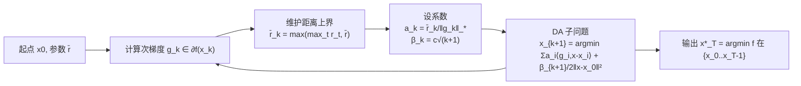

# DADA: Dual Averaging with Distance Adaptation

**会议**: ICLR 2026  
**OpenReview**: [https://openreview.net/forum?id=t4WNcclzLE](https://openreview.net/forum?id=t4WNcclzLE)  
**代码**: 待确认  
**领域**: optimization  
**关键词**: 凸优化, parameter-free, dual averaging, 距离自适应, universal method, 步长无调参  

## 一句话总结
DADA 把"动态估计初始点到最优解距离"的技巧嫁接到经典对偶平均（Dual Averaging）框架上，得到一个**无需任何问题相关参数、对约束/无界域都成立、且能自动适应六大凸函数类**的通用一阶方法，同时把误估初始距离的代价从乘性 $\rho^2$ 降到对数级 $\log^2\rho$。

## 研究背景与动机

**领域现状**：一阶梯度法是机器学习训练的主力，但步长（learning rate）必须靠人工调参或线搜索来定，模型越大越贵。近年涌现一批 parameter-free 方法（DoG、DoWG、D-Adaptation、Prodigy、Bisection Search），核心思路是动态估计初始距离 $D_0:=\|x_0-x^*\|$，免去对步长的先验知识。

**现有痛点**：这些方法几乎都建立在 AdaGrad 式累加平方梯度范数的条件化上，导致两个硬伤——其一，理论收敛率被锁死在 $\epsilon^{-2}$ 量级，无法随更光滑的函数类自动加速（哪怕函数有 Lipschitz Hessian 也吃不到红利）；其二，很多方法要么假设有界域（DoWG），要么无法推广到约束问题（D-Adaptation、Prodigy）。另一条线 Nesterov 的 UGM 虽叫"universal"，但只覆盖 Hölder-smooth 这一子集，且依赖内部线搜索，在约束/复合问题里不实用。

**核心矛盾**：真正的"通用"应当是——单一算法、零问题相关参数，却能在从非光滑 Lipschitz 到高阶光滑、再到 quasi-self-concordant 的整个谱系上都拿到与各自最优率相匹配的复杂度。已有方法要么牺牲通用性换 parameter-free，要么牺牲 parameter-free 换通用性。

**本文目标**：设计一个既 parameter-free、又对约束/无界域成立、还能自动适应目标函数局部增长行为的通用一阶法。

**核心 idea**：**用对偶平均（DA）替代 AdaGrad 式累加**——DADA 不去累加平方梯度范数，而是把每步梯度 $g_k$ 直接除以自身范数做归一化，再让 DA 的系数随"迭代点到起点的距离" $r_t=\|x_0-x_t\|$ 动态膨胀。正是这个"归一化 + 距离驱动系数"的组合，让算法对未知 $D_0$ 只付出对数代价，并让收敛率自动适配函数的局部增长函数 $\omega(t)$。

## 方法详解

### 整体框架
DADA 套在经典加权对偶平均（WDA）的骨架上：每步累加历史梯度的加权线性化项，再加一个 $\frac{\beta_{k+1}}{2}\|x-x_0\|^2$ 的正则，求解得到下一个迭代点 $x_{k+1}$。与 WDA 唯一的本质差别在系数 $a_k,\beta_k$ 的选法——WDA 用固定的用户估计 $\hat D_0$，DADA 则把它替换成在线维护的距离上界 $\bar r_k$。整个分析围绕一个标量量 $v(x)$（迭代点到"支撑超平面"的距离）展开，再通过局部增长函数 $\omega(\cdot)$ 把 $v(x)$ 翻译成函数残差，从而一套证明覆盖所有函数类。

### 关键设计

**1. 用 $v(x)$ 而非函数残差做收敛尺度，把"通用性"装进局部增长函数 $\omega$**：DADA 不直接盯着 $f(x)-f^*$，而是定义到支撑超平面的距离 $v(x):=\frac{\langle\nabla f(x),x-x^*\rangle}{\|\nabla f(x)\|_*}\ge 0$ 作为质量度量。关键在于它与函数残差之间存在桥梁不等式 $f(x)-f^*\le\omega(v(x))$，其中 $\omega(t):=\max_{x\in B(x^*,t)}f(x)-f^*$ 刻画了目标在最优解附近的局部增长。这一步是整篇文章的杠杆：算法本身只需保证 $v^*_T\to 0$，而"它在某个具体函数类上跑多快"完全由该类对应的 $\omega$ 决定。于是非光滑、Lipschitz-smooth、Hölder、高阶光滑、QSC、$(L_0,L_1)$-smooth 六类函数共用同一份收敛证明，只是各自代入不同的 $\omega$ 上界，复杂度自然分化出来——这正是"universal"的技术实现。

**2. 距离驱动的系数：归一化梯度 + 单调膨胀的 $\bar r_k$**：DADA 取 $a_k=\frac{\bar r_k}{\|g_k\|_*}$、$\beta_k=c\sqrt{k+1}$，其中 $\bar r_k:=\max\{\max_{1\le t\le k}r_t,\ \bar r\}$ 是迄今所有 $r_t=\|x_0-x_t\|$ 的运行最大值（$\bar r$ 是一个微小初始猜测）。和 DoG/DoWG 一脉相承用 $r_t$ 估计 $D_0$，但区别在于把 $g_k$ 简单地除以自身范数 $\|g_k\|_*$，而不是 AdaGrad 那样累加平方范数。证明里这个选择带来两个连锁好处：一是能用归纳法证出 $\bar r_k\le\bar D$ 一致有界（$\bar D:=\max\{\bar r,\frac{2c}{c-\sqrt 2}D_0\}$），从而把右端的 $\bar r_{k-1}$ 项消掉；二是配合 $D_0^2-D_k^2\le 2r_kD_0$ 与一条对非降序列成立的求和不等式，最终得到 $v^*_T\le\frac{eD}{\sqrt T}\log\frac{e\bar D}{\bar r}$（Theorem 1）。

**3. 把误估初始距离的代价从乘性 $\rho^2$ 砍到对数 $\log^2\rho$**：经典 WDA 若 $\hat D_0$ 偏离真实 $D_0$，要付乘性惩罚 $\rho^2$（$\rho:=\max\{\hat D_0/D_0,\ D_0/\hat D_0\}$），$D_0$ 估不准时这一项会爆炸。DADA 的复杂度统一写成 $T_v(\delta)=\frac{e^2D^2}{\delta^2}\log^2\frac{e\bar D}{\bar r}$，对初始猜测 $\bar r$ 的依赖只进到 $\log^2(\bar D_0/\bar r)$ 里。换言之即便 $\bar r$ 设小了几个数量级，代价也只是一个对数平方因子——这是相比 WDA 乃至部分 NGM 变体（penalty 仍是乘性 $\rho^2=D_0^2/\bar r^2$）的实质改进，也是实验里把 $\delta=10^{-6}$ 设得极保守仍能稳定收敛的理论依据。系数常数取 $c=2\sqrt 2$ 可最小化（对数因子外的）复杂度上界。

**4. 六大函数类的统一复杂度谱系**：代入不同 $\omega$，DADA 在各类上都拿到匹配各自标准率（仅多一个不可避免的对数因子）的复杂度：非光滑 Lipschitz $O(\frac{L_0^2\bar D_0^2}{\epsilon^2}\log^2_+\frac{\bar D_0}{\bar r})$；Lipschitz-smooth $O(\frac{L_1\bar D_0^2}{\epsilon}\log^2_+)$；Hölder-smooth $O((\frac{H_\nu}{\epsilon})^{\frac{2}{1+\nu}}\bar D_0^2\log^2_+)$；高阶 Lipschitz 导数 $O((\frac{L_p}{p!\,\epsilon})^{\frac{2}{p+1}}\bar D_0^2\log^2_+)$；QSC $O(\frac{(M^2+\|\nabla^2 f(x^*)\|)\bar D_0^2}{\epsilon}\log^2_+)$；$(L_0,L_1)$-smooth $O(\frac{(L_1^2+L_0)\bar D_0^2}{\epsilon}\log^2_+)$。与线搜索版 UGM 的差别只在那个对数因子是**乘性**而非**加性**，但代价换来的是覆盖 UGM 够不到的 QSC、高阶光滑等类。其中 QSC 这一类是首次被一阶 parameter-free 方法系统覆盖。

## 实验关键数据

实验目标是验证 DADA 在不调参前提下跨函数类的竞争力，对比 DoG、Prodigy、UGM（线搜索初值 $L_0=1$，目标精度 $\epsilon=10^{-6}$）与经典 WDA。起点 $x_0=(1,\dots,1)$，初始距离猜测 $\bar r=\delta(1+\|x_0\|)$，$\delta=10^{-6}$。

### 主实验：高阶光滑 worst-case 函数

测试函数 $f(x)=\frac1p\sum_{i=1}^{d-1}|x^{(i)}-x^{(i+1)}|^p+\frac1p|x^{(d)}|^p$（$d=10000$，最优点 $x^*=0$），对应"高阶 Lipschitz 导数"类，调节 $p$ 改变光滑阶数：

| 方法 | $p=2$ | $p=4$ | $p=6$ | 是否需调参 |
|------|-------|-------|-------|-----------|
| WDA（已知 $D_0$） | 接近最优 | — | — | 需真实 $D_0$ |
| UGM（线搜索） | 接近最优 | 稳定 | 稳定 | 需线搜索 |
| DoG | 接近最优 | 随 $p$ 增大变慢 | 明显落后 | 否 |
| Prodigy | 起步慢、后段追平 | 起步慢 | 起步慢 | 否 |
| **DADA** | 接近最优 | **显著快于 DoG** | **显著快于 DoG** | **否** |

### 关键发现
- **$p$ 越大优势越明显**：$p=2$ 时各法相近（Prodigy 例外，前期偏慢但最终追平）；随 $p$ 增大，DADA 收敛显著快于 DoG，作者归因于 DADA 能自动吃到高阶光滑红利，而 DoG 的率与 $p$ 无关、利用不上。
- **跨 $p$ 稳定**：只有 DADA 与 UGM 在不同 $p$ 下都稳定一致，且 DADA 略优于 UGM——但 DADA 不需要 UGM 的线搜索。
- **对 $\delta$ 鲁棒**：额外的敏感性实验表明，把初始距离猜测 $\bar r$（由 $\delta$ 控制）设得极小，DADA 仍稳定收敛，印证了理论上 $\log^2(\bar D_0/\bar r)$ 的对数级代价。

## 亮点与洞察
- **一个换框架的小动作撬动大通用性**：把"AdaGrad 式累加平方范数"换成"按自身范数归一化 + 距离驱动系数"，看似微调，却让 $v^*_T\to 0$ 成立，进而让收敛率随局部增长 $\omega$ 自适应——这是 DoG 等方法即使在确定性问题上都拿不到的性质。
- **$v(x)$ 这一中间度量是叙事支点**：用支撑超平面距离做收敛尺度、再用 $\omega$ 桥接到函数残差，巧妙地把"算法分析"与"函数类特性"解耦，使六类函数共用一套证明。
- **误估代价从 $\rho^2$ 到 $\log^2\rho$**：这是工程上最值钱的一条——意味着初始步长/距离猜测可以非常保守地设小，几乎不损失收敛速度，真正接近"开箱即用"。
- **覆盖面拓到 QSC 与高阶光滑**：首次让一阶 parameter-free 方法系统覆盖 quasi-self-concordant（logistic/softmax/exp 都属此类）与高阶 Lipschitz 导数函数。

## 局限与展望
- **不含随机/stochastic 分析**：Table 1 明确 DADA 在 Stochastic 一栏为 ✗，目前只覆盖确定性（full-gradient）设定，而 DoG、Prodigy 等已有随机版本——这是落地深度学习训练前必须补的一环。
- **对数因子是乘性而非加性**：相比线搜索版 UGM/GM-LS 把 $\log$ 放在加性位置，DADA 的 $\log^2_+$ 是乘性的，理论率略逊；只是换来了对更广函数类的覆盖与免线搜索。
- **加速版缺位**：当前是非加速（nonaccelerated）DA，Lipschitz-smooth 类只有 $O(1/\epsilon)$ 而非加速法的 $O(1/\sqrt\epsilon)$，能否在保持通用性的同时融入 Nesterov 加速是开放问题。
- **实验偏合成**：仅在合成凸 worst-case 函数上验证，缺少真实 ML 训练（如 logistic 回归、神经网络）规模上的经验对照。

## 相关工作与启发
- **距离自适应一脉**：DoG (Ivgi 2023)、DoWG (Khaled 2023)、D-Adaptation (Defazio & Mishchenko 2023)、Prodigy (Mishchenko & Defazio 2024)，均用 $r_t$ 或递增下界估计 $D_0$；DADA 的差异是用 DA + 归一化取代 AdaGrad 累加。
- **通用梯度法**：Nesterov 的 UGM (2015) 经线搜索对 Hölder-smooth 达最优率，是 DADA 在通用性上的直接对照与超越目标。
- **二阶 / NGM 对照**：QSC 上二阶法（Doikov 2023）每步更贵但率更优；NGM (Nesterov 2018/2024)、Vankov 2024 是 DADA 在 $(L_0,L_1)$-smooth 上的非自适应近亲。
- **启发**：当某个 parameter-free 技巧（这里是距离自适应）被框架被锁死在某复杂度阶时，换底层优化骨架（subgradient→dual averaging）往往比在原框架里调参更能解锁新的自适应能力；"中间度量 + 桥接函数"是把单一算法证明推广到多函数类的可复用范式。

## 评分
- **新颖性**: ⭐⭐⭐⭐ — 把距离自适应嫁接到 DA 并实现六类函数的真·通用性，QSC/高阶光滑首次被一阶 parameter-free 法覆盖，且误估代价降到对数级，是干净有力的理论贡献。
- **实验充分度**: ⭐⭐⭐ — 合成 worst-case 函数上的对比清晰印证理论（$p$ 越大越占优、对 $\delta$ 鲁棒），但缺随机设定与真实 ML 任务规模验证。
- **写作质量**: ⭐⭐⭐⭐ — 用 $v(x)$ 和 $\omega$ 串起全篇，Table 1 一图道尽与同类方法的差异，证明思路有清晰 sketch。
- **价值**: ⭐⭐⭐⭐ — 给"一个算法吃遍多函数类、几乎不用调参"提供了坚实的理论范式；补上随机版后对实际训练有直接吸引力。

<!-- RELATED:START -->

## 相关论文

- [\[ICML 2025\] Layer-wise Quantization for Quantized Optimistic Dual Averaging](../../ICML2025/optimization/layer-wise_quantization_for_quantized_optimistic_dual_averaging.md)
- [\[ICML 2026\] Rethinking the Flow-Based Gradual Domain Adaptation: A Semi-Dual Optimal Transport Perspective](../../ICML2026/optimization/rethinking_the_flow-based_gradual_domain_adaptation_a_semi-dual_optimal_transpor.md)
- [\[ICLR 2026\] Dual Optimistic Ascent (PI Control) is the Augmented Lagrangian Method in Disguise](dual_optimistic_ascent_pi_control_is_the_augmented_lagrangian_method_in_disguise.md)
- [\[ICLR 2026\] Bayesian Evidence-Driven Prototype Evolution for Federated Domain Adaptation](bayesian_evidence-driven_prototype_evolution_for_federated_domain_adaptation.md)
- [\[CVPR 2026\] Defending Unauthorized Model Merging via Dual-Stage Weight Protection](../../CVPR2026/optimization/defending_unauthorized_model_merging_via_dual-stage_weight_protection.md)

<!-- RELATED:END -->
