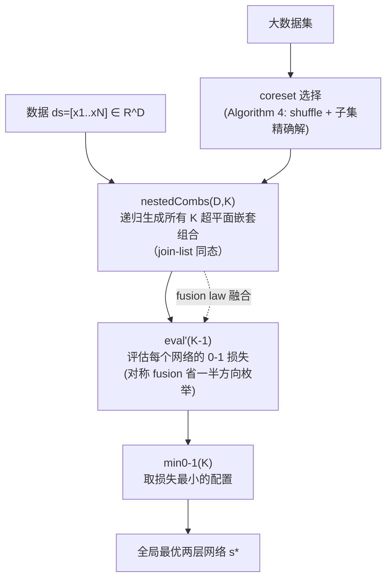

# Deep-ICE: The First Globally Optimal Algorithm for Minimizing 0–1 Loss in Two-Layer ReLU and Maxout Networks

**会议**: ICLR 2026  
**OpenReview**: [https://openreview.net/forum?id=pP8XVJX3cI](https://openreview.net/forum?id=pP8XVJX3cI)  
**代码**: [https://github.com/XiHegrt/DeepICE-algorithm-artifacts](https://github.com/XiHegrt/DeepICE-algorithm-artifacts)  
**领域**: 学习理论 / 组合优化 / 精确算法  
**关键词**: 全局最优 ERM, 0-1 损失, 两层网络, ReLU/Maxout, 构造式算法, fusion law, 精确训练  

## 一句话总结
本文用构造式算法学（list homomorphism + fusion law）推导出第一个对两层 ReLU/Maxout 网络在 **0-1 损失**下做经验风险最小化（ERM）的**全局最优算法 Deep-ICE**，最坏复杂度约 $O(N D^{K+1})$，并在 11 个 UCI 数据集上用配套的 coreset 启发式做到了比 SVM 和梯度下降训练的 MLP 更高的训练与测试精度。

## 研究背景与动机
- **领域现状**：两层网络（ReLU/Maxout）表达力强、又因输出是隐单元的线性组合而具有可解释性，是高风险决策（司法、医疗、环保）中"既要准又要透明"的理想假设类。要在这类假设集里找到"最好的可解释模型"，本质上需要**全局最优（精确）算法**。
- **现有痛点**：直接求神经网络的 ERM 解极难——Goel et al. (2020) 证明两层 ReLU 网络在平方损失下的训练误差最小化是 NP-hard，后续工作把它推广到 $L_p$ 损失。而分类真正关心的是 **0-1 损失**（误分类计数），其离散性比连续代理损失更难优化，即便最简单的线性分类器，最优 0-1 损失算法也要 $O(N^{D+1})$。
- **核心矛盾**：理论上 NN 有有限 VC 维，原则上可在多项式时间内精确训练（Mohri 2012）。最接近的工作 Arora et al. (2016) 和 Hertrich (2022) 给出过"逐个枚举"的训练思路，但**只有伪代码、复杂度分析含糊、八年来无任何公开实现**，而且仅限凸损失、假设超平面划分"已给定"、常数因子（$2^K\times C_1$）和指数（$D\times K + C_2$）都大到无法实用。
- **本文目标**：给出一个**定义清晰（单条等式）、复杂度明确、可在 GPU 上实际运行**、且支持任意可计算损失（特别是 0-1 损失）的全局最优 ERM 算法。
- **核心 idea**：**把 ERM 写成"穷举搜索的可证明正确规范"，再用构造式算法学的 fusion law 把它机械地变换成高效的递归生成器**——关键是设计出第一个对"嵌套组合（nested combination）"的递归生成器，使整条管线可被 fusion 融合、向量化、并行化。

## 方法详解

### 整体框架
Deep-ICE 把"训练两层网络"重新理解为一个组合枚举问题：每个隐神经元对应输入空间里的一个超平面，$K$ 个隐神经元就是 $K$ 个超平面的组合，再叠加 $2^K$ 种符号方向，构成搜索空间 $S(N,K,D)$。算法先把"穷举所有配置并取 0-1 损失最小者"写成一条可证明正确的规范式（等式 10），再依次用 fusion law 把"生成—评估—取最小"三步融合进一个**递归的嵌套组合生成器** `nestedCombs`，从而避免物化所有中间组合，同时支持边算边出候选解、向量化和无通信并行。

### 关键设计

**1. 把 ERM 写成"可证明正确的穷举规范"，再交给 fusion law：** 本文站在构造式算法学（Bird & De Moor）的立场——程序先写成一定正确但低效的规范式，再用代数定律推导出高效实现。作者把两层网络的 ERM 直接写成 $\text{DeepICE}(D,K)=\text{min}_{0\text{-}1}(K)\circ\text{eval}(K)\circ\text{cp}(\text{basgns}(K))\circ\text{nestedCombs}(D,K)$（等式 10）：穷举所有 $K$-超平面组合与 $2^K$ 符号赋值的笛卡尔积，逐个评估再取最小。这条规范的正确性显然，而效率则完全来自后续的 fusion 变换。相比 Arora/Hertrich 那种"非递归、逐个生成"的写法（无法被 fusion 加速），本文的所有算子都建立在 list 同态之上，因此能被机械地融合与并行化。

**2. 高效的嵌套组合生成器 nestedCombs（核心贡献）：** 算法的瓶颈在于如何递归地枚举"$K$ 个超平面的嵌套组合"。作者基于 He & Little (2024) 的 $K$-组合生成器 `kcombs`（一个 join-list 同态）扩展出 `nestedCombs`。朴素写法 $\text{nestedCombs}(D,K)=\langle\text{setEmpty}(D),\text{kcombs}(K)\circ!!(D)\rangle\circ\text{kcombs}(D)$ 需要先物化所有 $\binom{N}{D}$ 个 $D$-组合，内存开销巨大。本文的关键是验证一个 **fusion 条件** $f\circ\text{kcombsAlg}(D)=\text{nestedCombsAlg}(D,K)\circ f\times f$（等式 12），把外层映射直接融合进生成器，得到一个**单一递归过程**——边生成 $D$-组合边构造 $K$-嵌套组合、用完即用 `setEmpty(D)` 清空，从而把存储需求降到 $O\!\big(\binom{N}{D-1}N + \binom{N}{D}^{K-1}K\big)$，并天然适合 GPU 向量化执行。

**3. Maxout 对称 fusion，砍掉一半枚举：** 对 Maxout 网络，作者证明了**对称 fusion 定理**（Theorem 3）：若已知一组 $K$ 个超平面的预测，则把所有法向量反向后得到的配置预测可以直接推出、无需重算。这意味着枚举 $2^K$ 种超平面方向时只需实际计算其中 $2^{K-1}$ 种，把规范式简化为 $\text{DeepICE}(D,K)=\text{min}_{0\text{-}1}(K)\circ\text{eval}'(K-1)\circ\text{nestedCombs}(D,K)$，常数因子直接减半。最终 Deep-ICE 的时间复杂度为 $O\!\Big(K N 2^{K-1}\binom{N}{D}^{K} + N D^3\binom{N}{D}\Big)$，严格优于 Arora et al. 的 $O(2^K C_1 N D^{K+C_2})$（且后者在最好/最坏情形都达到该界）。

**4. 两种实现 + coreset 扩展到大规模：** 作者给出 **sequential 版**（Algorithm 2，用 memoization 复用超平面预测、节省内存与运行时）和 **divide-and-conquer 版**（Algorithm 3，支持无处理器间通信的"尴尬并行"）。对超出精确求解规模的大数据集，本文提出 **coreset 选择**（Algorithm 4）：通过打乱数据避免"最优解只在递归很晚才出现"的病态顺序，对最有代表性的子集求精确解，从而高效地探索成千上万个候选配置，并按验证/测试表现挑选——而无需像 SVM/MLP 那样靠重训练或强概率假设来生成替代模型。

## 实验关键数据

### 主实验表格
11 个 UCI 数据集上的五折交叉验证（训练误差 / 测试误差，单位为准确率 %，`*` 表示直接用 Deep-ICE 精确求解、否则用 coreset 启发式；加粗为该行最佳）：

| 数据集 | N | D | Deep-ICE (K=2) | SVM | MLP (K=2, 梯度下降) |
|---|---|---|---|---|---|
| Caesr | 72 | 5 | **89.45 / 88.00** | 72.00 / 57.33 | 76.36 / 56.00 |
| VP | 704 | 2 | **97.76 / 97.59** | 96.77 / 97.02 | 96.77 / 97.02 |
| Spesis | 975 | 3 | **96.43 / 95.26** | 94.46 / 92.43 | 94.46 / 92.55 |
| HB | 283 | 3 | **80.11 / 77.19** | 72.40 / 71.23 | 75.34 / 75.26 |
| BT | 502 | 4 | **79.59 / 77.98** | 75.09 / 70.14 | 76.11 / 73.54 |
| DB | 1146 | 9 | **83.60 / 81.37** | 69.72 / 67.62 | 77.64 / 76.19 |
| SS | 51433 | 3 | **86.60 / 86.72** | 82.77 / 82.75 | 79.65 / 79.65 |

在相同两层网络架构下，Deep-ICE（含 coreset）在几乎所有数据集上的训练与测试精度都领先 SVM 与梯度下降 MLP。

### 消融实验表格
精确解 vs. 梯度下降（rank-2 Maxout 单神经元，VP 数据集 N=704, D=2，0-1 损失为误分类数，越低越好）：

| 方法 | 0-1 损失（误分类数） |
|---|---|
| 全局最优线性模型（He & Little 2023） | 19 |
| SVM | 23 |
| 梯度下降（同架构 Maxout） | 25 |
| **Deep-ICE（精确解）** | **16** |

梯度下降虽用了 rank-2 Maxout（两个超平面），实际只用上一个——第二个超平面落在数据区域外、对预测毫无贡献；Deep-ICE 则真正利用了模型容量。

### 关键发现
- **复杂度与实测吻合**：实测墙钟时间曲线与最坏复杂度分析一致（Figure 2）；CUDA 实现可在几分钟内解决含 122,468,448,960（约 $1.2\times10^{11}$）种配置的问题，且尚未引入任何 bounding 加速。
- **最优算法未必过拟合**：尽管 Deep-ICE 训练精度远高于 SVM/MLP，其样本外测试表现依然更好——只要模型复杂度（K）控制得当，**挑战了"最优算法必然过拟合训练集"的普遍认知**。
- **最大间隔不一定最优**：实验未发现 SVM 这类最大间隔分类器在样本外表现上具有稳定优势（详见 Appendix A.7）。

## 亮点与洞察
- **方法论新颖**：把"训练神经网络"当作可被 fusion law 机械推导的程序变换问题，是构造式算法学罕见地落到深度学习训练上的成功案例，给出了"定义即一条等式、复杂度可证明"的清晰算法。
- **填补八年空白**：Arora (2016)/Hertrich (2022) 八年无实现，本文不仅给出可运行的 CUDA 实现，还把适用范围从凸损失扩展到任意可计算损失（含真正的 0-1 损失）。
- **嵌套组合生成器**是可复用的核心组件，自带边算边出候选解、向量化、无通信并行三大工程友好特性。
- **经验性反直觉结论**（最优解不必过拟合、最大间隔不必最优）对"何时该追求精确 ERM"提供了有价值的指引。

## 局限与展望
- **维度/神经元数的诅咒**：复杂度对 $D$ 和 $K$ 是指数级（$\binom{N}{D}^K$），只对小 $D$、小 $K$、固定架构可行；高维特征或深层网络会组合爆炸。
- **深层网络只能贪心近似**：精确解三层网络需 $O\!\big(\binom{N}{D}^{K_1 K_2}\big)$ 级复杂度，实际不可行；只能逐层贪心训练，此时整体复杂度被第一隐层主导，已不再是全局最优。
- **依赖 coreset 启发式**：大规模数据上的优势来自 coreset 子集精确解 + 候选筛选，并非对整集的全局最优，启发式的代表性选择仍有理论空白。
- **一般位置假设**：要求数据仿射独立（去重 + 加极小高斯噪声），对高度退化/共线数据需预处理。
- **未来方向**：引入 branch-and-bound 等 bounding 技术进一步剪枝加速，扩大可精确求解的规模。

## 相关工作与启发
- **精确 0-1 损失分类**：He & Little (2023) 的线性分类器精确算法（$O(N^{D+1})$）与对称 fusion 思想是本文的直接基础，本文将其从单超平面推广到 $K$ 超平面嵌套组合。
- **两层网络精确训练**：Arora et al. (2016)、Hertrich (2022) 的逐个枚举思路是最近的前驱，但仅限凸损失、无实现；本文以构造式算法学给出可执行、可并行、覆盖 0-1 损失的版本。
- **凸化训练**：Bai et al. (2023) 把带 $L_2$ 正则的凸损失 ReLU 训练重写为凸规划，但通用求解器复杂度不可控，且问题比 0-1 损失简单得多。
- **期望精度优化**：Karpukhin et al. (2024) 的 EXACT（实为"期望精度优化"）是随机近似而非确定性精确算法，本文在附录中与之对比。
- **启发**：把损失函数离散性视为"组合枚举"而非"连续优化障碍"，并借助代数程序推导得到可证明最优 + 可并行的实现，这种思路可能迁移到决策树、规则集等其他可解释假设类的精确训练。

## 评分
- **新颖性**: ⭐⭐⭐⭐⭐ 第一个两层 ReLU/Maxout 网络 0-1 损失全局最优算法，方法论（fusion law + 嵌套组合生成器）在深度学习训练语境下相当独特。
- **实验充分度**: ⭐⭐⭐⭐ 11 个 UCI 数据集 + 复杂度实测 + 与 SVM/MLP/EXACT 多方对比；但受限于精确算法本质，规模偏小、未触及现代大模型场景。
- **写作质量**: ⭐⭐⭐⭐ 理论推导严谨、贡献点清晰；但构造式算法学记号（list 同态、point-free）门槛较高，对一般读者不友好。
- **价值**: ⭐⭐⭐⭐ 为可解释高风险场景提供"可证明最优"的训练工具，并以经验证据挑战"最优即过拟合"的成见，对学习理论与精确优化社区均有启发。

<!-- RELATED:START -->

## 相关论文

- [\[ICML 2026\] Sharp Description of Local Minima in the Loss Landscape of High-Dimensional Two-Layer ReLU Networks](../../ICML2026/optimization/sharp_description_of_local_minima_in_the_loss_landscape_of_high-dimensional_two-.md)
- [\[ICLR 2026\] Directional Convergence, Benign Overfitting of Gradient Descent in leaky ReLU two-layer Neural Networks](directional_convergence_benign_overfitting_of_gradient_descent_in_leaky_relu_two.md)
- [\[ICLR 2026\] Convex Dominance in Deep Learning I: A Scaling Law of Loss and Learning Rate](convex_dominance_in_deep_learning_i_a_scaling_law_of_loss_and_learning_rate.md)
- [\[ICLR 2026\] A Memory-Efficient Hierarchical Algorithm for Large-scale Optimal Transport Problems](a_memory-efficient_hierarchical_algorithm_for_large-scale_optimal_transport_prob.md)
- [\[ICLR 2026\] Globally Aware Optimization with Resurgence](globally_aware_optimization_with_resurgence.md)

<!-- RELATED:END -->
