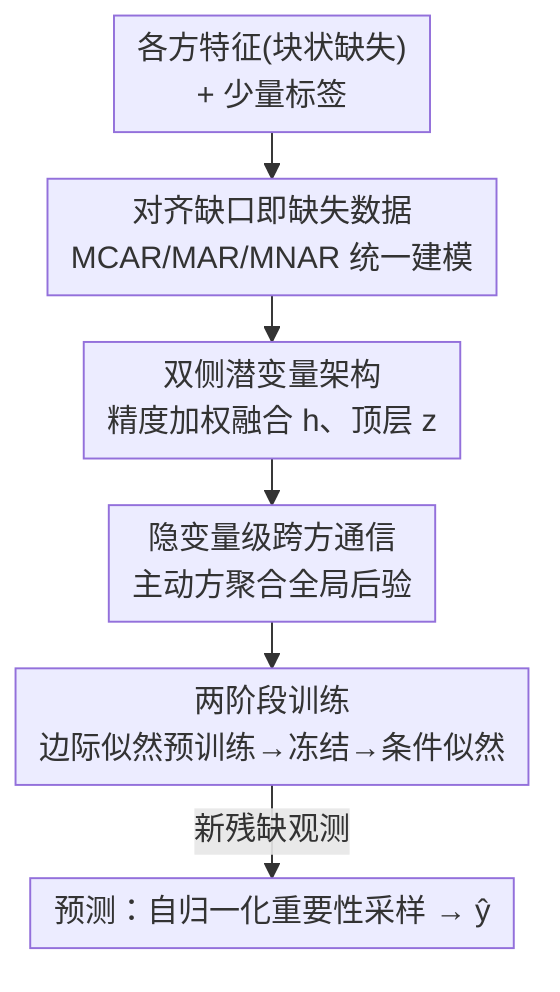

# Deep Latent Variable Model based Vertical Federated Learning with Flexible Alignment and Labeling Scenarios

**会议**: ICLR2026  
**OpenReview**: [https://openreview.net/forum?id=qCM2vo896B](https://openreview.net/forum?id=qCM2vo896B)  
**代码**: 待确认  
**领域**: 联邦学习 / 概率方法 / 变分推断  
**关键词**: 纵向联邦学习, 深度潜变量模型, 缺失数据机制, 半监督, 变分推断

## 一句话总结
把纵向联邦学习中"用户对不齐"的问题重新解释成经典的"块状缺失数据"问题，用一个深度潜变量模型 + 两阶段（无监督预训练 / 有监督微调）训练，第一次在多方场景下同时吃下不对齐、无标签、任意缺失机制（MCAR/MAR/MNAR）的数据，在 168 个配置里有 160 个超过最强基线，平均领先 9.6 个百分点。

## 研究背景与动机
**领域现状**：纵向联邦学习（Vertical Federated Learning, VFL）针对的是"特征被切开"的场景——多家机构（银行 + 电商、医院 + 药企、保险 + 车厂）持有同一批用户的互补特征，想在不交换原始数据的前提下联合训练一个模型。要做联合训练，传统 VFL 要求样本先"对齐"：同一个用户的各方特征要能拼到一起。

**现有痛点**：现实里用户集合几乎不可能完全重合，一篇 VFL 综述指出**只有 0.2% 的潜在 VFL 配对是可以完全对齐的**。于是大量数据要么是各方用户不重合的"不对齐"样本，要么因隐私法规根本拿不到标签。现有方法几乎都靠苛刻假设硬撑：要么只支持两方（VFed-SSD、FedCVT），要么不充分利用部分对齐的数据（VFLFS、VFedTrans），要么推理时只能在完全对齐的数据上做（FedHSSL、PlugVFL），还有的（MAGS）只在推理期处理不对齐却不在训练期用它。最接近的 LASER-VFL 能同时吃对齐 / 不对齐样本，却忽略了无标签数据，且它假设一个 batch 共享同一种缺失模式。

**核心矛盾**：VFL 里"对齐"这件事，本质上和经典缺失数据里的**块状缺失（blockwise missingness）**是同一回事——某个用户在某一方根本没有记录，就等价于这一整块特征"缺失"。但过去的 VFL 工作没有把它当缺失数据来系统处理，导致每加一个能力（多方 / 无标签 / 任意缺失）就要打一个新补丁，无法统一。

**本文目标**：造一个统一框架，让 VFL 在**训练和推理**两端都能处理任意对齐程度 + 任意标签可得性 + 任意缺失机制，且天然支持多方。

**切入角度**：作者借用缺失数据文献的三类机制——MCAR（完全随机缺失）、MAR（缺失只依赖已观测值）、MNAR（缺失依赖未观测值）——把"对不齐"翻译成缺失，再用对缺失数据天然友好的深度潜变量模型（DLVM）来建模。

**核心 idea**：把对齐缺口重写成缺失数据，用一个深度潜变量模型 $p_{\Theta,\psi}(y\mid x^{obs},m)$ 在 MAR 假设下退化为 $p_\Theta(y\mid x^{obs})$，再用"先无监督预训练边际似然、再有监督微调条件似然"的两阶段训练，把海量无标签 / 不对齐数据全部利用起来。方法取名 **FALSE-VFL**（Flexible Alignment and Labeling Scenarios Enabled VFL）。

## 方法详解

### 整体框架
FALSE-VFL 的设定是：一个**主动方**（active party，持有标签）+ $K-1$ 个**被动方**（passive party，只有特征）。每个样本 $i$ 的完整观测 $x_i=[x_i^1,\dots,x_i^K]$ 被切到各方，用掩码 $m_i^k\in\{0,1\}$ 标记第 $k$ 方是否缺这块（$m_i^k=1$ 表示缺失），用 $u_i\in\{0,1\}$ 标记标签是否缺失。这样"完全对齐 / 部分对齐 / 完全不对齐 / 有标签 / 无标签"全部被统一成 $(m_i,u_i)$ 的取值，整张数据表就是一张带块状缺失的表。

整条流水线是：各方先用本地编码器把自己那块特征编码成局部潜变量分布，主动方把这些局部分布**按精度加权**聚合成全局潜变量 $h$，再往上编码出顶层潜变量 $z$，形成一条潜变量链 $z\to h\to x$；训练分两阶段——先用**所有**样本（含无标签、不对齐）最大化观测特征的边际似然 $p_{\Theta_g}(x^{obs})$ 做预训练，冻结生成参数 $\Theta_g$ 后，再用有标签样本最大化条件似然训练判别器 $\phi$；推理时对新来的（残缺）观测做自归一化重要性采样得到 $p_\Theta(y\mid x^{obs})$。整个过程中各方只交换潜变量的分布参数和标量概率，不交换原始特征。

### 关键设计

**1. 对齐缺口即缺失数据：用统一缺失机制把 VFL 的所有变体收进一个框架**

这是全文的概念基石。过去 VFL 把"用户对不齐"当成一个工程对齐难题，每种对齐 / 标签情形都要单独设计方法。本文指出：第 $k$ 方对某用户没有记录，等价于这块特征 $x_i^k$ 缺失（$m_i^k=1$）。于是把样本拆成 $x_i=[x_i^{obs},x_i^{mis}]$，只用得到 $x_i^{obs}$；完全对齐就是 $\sum_k m_i^k=0$，完全不对齐是 $\sum_k m_i^k=K-1$，介于中间的是部分对齐；标签缺失记作 $u_i=1$。这一步把"多方 / 部分对齐 / 无标签"全部翻译成缺失数据语言后，作者进一步区分两类不对齐：(a) 因标识符不完美而**暂时**没连上的、可以靠隐私保护的记录链接技术补齐的；(b) **本质上**没有对应记录、无法对齐的。本文聚焦后者，正好对应缺失数据里的块状缺失，从而可以借用 MCAR / MAR / MNAR 三类机制。关键的理论便利是：在 MAR 假设下 $p_{\Theta,\psi}(y\mid x^{obs},m)=p_\Theta(y\mid x^{obs})$（附录 A.1），即缺失模式 $m$ 不必显式建模就能正确预测——这让 FALSE-VFL-I（MAR 版）省去对掩码分布的建模；附录 A.2 的 FALSE-VFL-II 把假设放宽到 MNAR。

**2. 双侧深度潜变量架构与精度加权后验融合：把多方残缺特征拼成一个可推断的全局潜变量**

模型分**特征侧**和**标签侧**两组模块。每个方 $k$ 有自己的编码器 $\gamma_c^k$ 和解码器 $\theta_c^k$（特征侧）；持标签的主动方额外有全局编码器 $\gamma_s$、全局解码器 $\theta_s$ 和判别器 $\phi$（标签侧）。生成方向是一条随机隐藏层链 $p_{\Theta_g}(x)=\int p_{\Theta_g}(h_L)p_{\Theta_g}(h_{L-1}\mid h_L)\cdots p_{\Theta_g}(x\mid h_1)\,dh$（论文取 $L=2$，记 $h:=h_1,z:=h_L$）。推断用摊销变分推断，难点在于**只有部分方有观测**时怎么把局部后验融合成全局后验——本文给出精度加权的高斯融合：

$$q_{\gamma_c}(h\mid x^{obs})=\mathcal{N}\!\left(\frac{1}{|obs|}\sum_{k\in obs}\mu_{\gamma_c^k}(x^k),\ \Big(\sum_{k\in obs}\Sigma_{\gamma_c^k}^{-1}(x^k)\Big)^{-1}\right).$$

直觉是：每个在场的方贡献一个高斯局部后验 $\mathcal{N}(\mu_{\gamma_c^k},\Sigma_{\gamma_c^k})$，按精度（协方差的逆）加权求和——越确定的方权重越大；缺席的方直接不进求和，所以**任意子集的方在场都能算出全局 $h$**，这正是它能容忍任意对齐模式的关键。顶层 $q_{\gamma_s}(z\mid h)$ 同样取高斯。判别器 $p_\phi(y\mid h)$ 对回归取高斯、对分类取类别分布。整套设计的好处是模块化、与方数无关，加一个方只是多一对编解码器。

**3. 隐变量级跨方通信：在不泄露原始特征的前提下完成多方协作**

由于原始 $x^{obs}$ 不能跨方共享，所有信息流都走潜变量。预训练 / 训练时：每个方算出自己局部后验的均值和方差，发给主动方；主动方把这些局部表示聚合成全局潜分布、采样 $h$ 再广播回各方；各方用本地解码器算 $p_{\theta_c}(x^{obs}\mid h)$ 并把**标量概率**回传；主动方据此算损失、再把各方本地参数的梯度发回去。相比标准 VFL（被动方发表示、主动方回梯度），FALSE-VFL 只多了两步：主动方把采样的全局潜变量发给各方、各方把标量概率回传。推理时走同样的前向通信、不交换梯度。这套协议让"用潜变量做隐私聚合"和"任意方子集在场即可推断"自洽地落地。

**4. 两阶段训练：先用全部数据预训练边际似然，再冻结后微调条件似然**

最终目标是最大化条件似然 $\sum_{u_i=0}\log p_\Theta(y_i\mid x_i^{obs})$，但它即便用变分近似也不可解。作者绕道去最大化联合似然，因为有恒等式

$$\log p_\Theta(y,x^{obs})=\log p_\Theta(y\mid x^{obs})+\log p_{\Theta_g}(x^{obs}).$$

问题是 $x^{obs}$ 维度极高（$d_{obs}\gg 1$），右边的边际项 $\log p_{\Theta_g}(x^{obs})$ 会**压倒**条件项，导致模型只顾拟合特征分布、忽略预测（即 implicit modeling bias）。两阶段训练正是为此：**阶段 1（预训练）**先单独最大化占主导的边际似然——由于积分不可解，用 $\kappa$ 样本的重要性加权（IWAE）下界 $L_\kappa(\Theta_g)$ 来优化，且这一阶段**不需要标签**，于是海量无标签 / 不对齐样本全部被用上；**阶段 2（训练）**冻结 $\Theta_g$，只用有标签样本最大化联合似然 $L'_\kappa(\phi)$ 训练判别器 $\phi$。冻住 $\Theta_g$ 后，最大化联合似然就等价于最大化条件似然，从而既消除了建模偏置、又把目标对准了真正想要的预测。Theorem 3.1 保证 $L_\kappa,L'_\kappa$ 随 $\kappa$ 增大而单调上升并收敛到真对数似然。预测则用自归一化重要性采样：$p_\Theta(y\mid x^{obs})\approx\sum_l w_l\,p_\phi(y\mid h_l)$，权重 $w_l=r_l/\sum_j r_j$ 由各采样点的重要性比 $r_l$ 决定。

### 损失函数 / 训练策略
- **阶段 1（无监督，含无标签 / 不对齐）**：最大化边际似然的 IWAE 下界 $L_\kappa(\Theta_g)=\sum_i \mathbb{E}[\log R_\kappa(x_i^{obs})]$，其中 $R_\kappa$ 是 $\kappa$ 个采样点的重要性加权平均。
- **阶段 2（有监督，冻结 $\Theta_g$）**：最大化 $L'_\kappa(\phi)=\sum_{u_i=0}\mathbb{E}[\log R'_\kappa(y_i,x_i^{obs})]$，只更新判别器 $\phi$。
- 关键超参是重要性采样数 $\kappa$（越大下界越紧），以及潜变量层数 $L\ge 2$（实现取 $L=2$）。

## 实验关键数据

### 主实验
在四个数据集（Isolet、HAPT 两个表格数据 + FashionMNIST、ModelNet10 两个图像数据）上，对 **6 种训练期缺失 × 7 种测试期缺失 = 168 个配置**做评测，与 Vanilla VFL、LASER-VFL、PlugVFL、FedHSSL 比较。表格数据切成 8 方、ModelNet10 切成 6 方；表格给 500 个标签、图像给 1000 个，其余全当无标签。

| 维度 | 设置 | FALSE-VFL 相对最强基线的平均准确率领先（百分点） |
|--------|------|------|
| 整体 | 168 配置（其中 160 个领先） | **9.6**（按 160 例算；按全部 168 例算为 9.1） |
| 按数据集 | Isolet | 15.7 |
| 按数据集 | HAPT | 7.3 |
| 按数据集 | FashionMNIST | 4.5 |
| 按数据集 | ModelNet10 | 9.1 |
| 按测试缺失率 | MCAR 0 → MCAR 5 → MAR 2 | 1.8 → 9.6 → 12.3（缺失越重领先越大） |

### 消融 / 鲁棒性实验

| 配置 | 关键发现 | 说明 |
|------|---------|------|
| MCAR 5 vs MCAR 2 训练 | 28 例中 23 例掉点最小，多数测试集反而涨 | 对更严重缺失最鲁棒 |
| 方数 $K$ 从 4 到 12 | 各 $K$ 下全面领先；LASER-VFL 随 $K$ 增大退化 | $K$ 大时单一掩码 batch 难凑，LASER 批利用率崩 |
| 数据异质性 $\alpha\in\{\infty,10,1,0.1\}$ | FALSE-VFL 全程持平且最高 | Vanilla/FedHSSL 随异质性增大掉点，LASER 反而升 |

### 关键发现
- **缺失越严重，优势越大**：测试缺失从 MCAR 0 到 MAR 2，领先从 1.8 拉大到 12.3 个百分点——说明它真正吃到了"在残缺数据上也能推断"的红利，而不是靠对齐样本撑分。
- **两个 MAR/MNAR 版本几乎打平**：FALSE-VFL-I（不显式建模掩码）与 FALSE-VFL-II（建模 MNAR）表现接近，印证了 MAR 假设下不必建模掩码分布的理论结论，工程上可优先用更简单的 I 版。
- **方数鲁棒性的根因不同**：Vanilla VFL / FedHSSL 只能用完全对齐的有标签样本，$K$ 一大同时被所有方观测到的概率骤降而掉点；FALSE-VFL 能用不对齐的有标签样本，$K$ 增大反而受益于"所有信息特征同时缺失的概率更低"。

## 亮点与洞察
- **一句话框架重述带来统一**：把"对齐"重写成"缺失"，是那种事后看很自然、之前却没人系统做的视角转换——一旦完成，多方 / 无标签 / 任意缺失三件事就被同一套缺失数据机制收编，不再需要逐个打补丁。这种"换个语言描述问题"的思路可迁移到很多看似工程化的对齐 / 拼接难题。
- **精度加权的高斯融合是容错的关键**：用各方局部后验的精度加权求和来构造全局后验，天然允许任意方子集在场——这是它能"任意对齐都能推断"的机制底座，而不是靠数据补全。
- **两阶段训练同时解决两个问题**：先预训练边际似然既缓解了高维特征压倒预测的建模偏置，又顺手把无标签数据全用上；冻结 $\Theta_g$ 把联合似然变成条件似然，是个干净的"绕道求解"技巧，值得借鉴到其他"目标不可解但联合可解"的场景。

## 局限与展望
- **隐私只到"不交换原始特征"层面**：方法交换潜变量分布参数和梯度，并未给出针对潜变量泄露 / 重构攻击的形式化隐私保证（如差分隐私），在强对抗设定下的安全性待考。
- **MAR 假设是默认主力**：FALSE-VFL-I 依赖 MAR 才能省去掩码建模；现实中若缺失明显依赖未观测值（强 MNAR），需切到 II 版，其额外开销与适用边界论文展开有限。
- **规模仍偏小**：实验是 8 方 / 500~1000 标签、四个经典 benchmark，没有触及上百方、超高维或工业级隐私约束的场景；通信轮次随重要性采样数 $\kappa$ 和方数增长的实际开销也值得更系统的评估。
- **可改进方向**：把记录链接（处理"暂时连不上"的那类不对齐）与本框架（处理"本质对不上"的那类）组合起来，端到端联合优化，可能进一步榨干数据。

## 相关工作与启发
- **vs LASER-VFL**：两者都能用不对齐样本，但 LASER 假设一个 batch 共享同一掩码，方数 $K$ 一大、掩码模式爆炸，难凑同掩码 batch、批利用率下降；FALSE-VFL 用潜变量精度加权融合，不要求 batch 同掩码，且额外能吃无标签数据。
- **vs FedHSSL / PlugVFL / Vanilla VFL**：这些方法训练时本质依赖完全对齐的有标签样本，$K$ 增大时同时被所有方观测到的样本骤减而掉点；FALSE-VFL 能直接训练不对齐的有标签样本，规避了这一瓶颈。
- **vs supMIWAE / not-MIWAE（深度潜变量缺失数据方法）**：本文受 supMIWAE 启发把"有监督 + 缺失数据"的 DLVM 思路搬进 VFL，并补上多方场景下的隐私聚合通信协议与两阶段训练，使其在联邦设定下可用——是把单机缺失数据建模成功移植到分布式隐私场景的一次落地。

## 评分
- 新颖性: ⭐⭐⭐⭐⭐ "对齐即缺失"的视角转换干净有力，第一个同时统一多方 / 无标签 / 任意缺失的 VFL 框架
- 实验充分度: ⭐⭐⭐⭐ 168 配置 + 方数 / 缺失率 / 异质性三组消融很全面，但 benchmark 偏经典、规模偏小
- 写作质量: ⭐⭐⭐⭐ 缺失机制与两阶段训练动机讲得清楚，理论与方法衔接顺，部分推导放在附录
- 价值: ⭐⭐⭐⭐ 直击 VFL "只有 0.2% 可完全对齐"的现实痛点，对标签稀缺、对齐困难的真实联邦场景有实用意义

<!-- RELATED:START -->

## 相关论文

- [\[ICLR 2026\] DeepAFL: Deep Analytic Federated Learning](deepafl_deep_analytic_federated_learning.md)
- [\[ICLR 2026\] Learning to Solve Orienteering Problem with Time Windows and Variable Profits](learning_to_solve_orienteering_problem_with_time_windows_and_variable_profits.md)
- [\[ICML 2026\] Distribution Alignment for One-Shot Federated Learning via Optimal Transport](../../ICML2026/optimization/distribution_alignment_for_one-shot_federated_learning_via_optimal_transport.md)
- [\[ICLR 2026\] LCA: Local Classifier Alignment for Continual Learning](lca_local_classifier_alignment_for_continual_learning.md)
- [\[ICLR 2026\] Convex Dominance in Deep Learning I: A Scaling Law of Loss and Learning Rate](convex_dominance_in_deep_learning_i_a_scaling_law_of_loss_and_learning_rate.md)

<!-- RELATED:END -->
