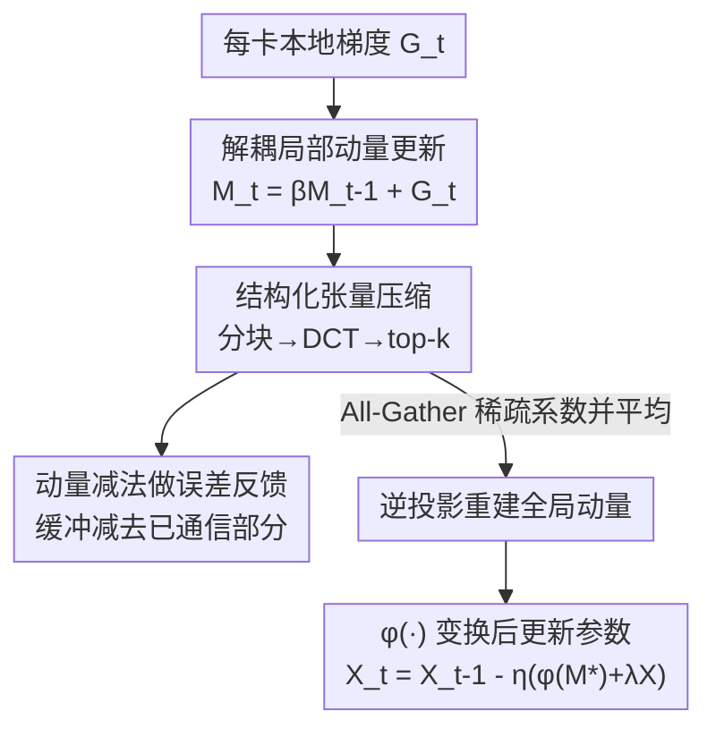

# DeMo: Decoupled Momentum Optimization

**会议**: ICLR2026  
**OpenReview**: [https://openreview.net/forum?id=U9oewpa7cn](https://openreview.net/forum?id=U9oewpa7cn)  
**代码**: https://github.com/bloc97/DeMo  
**领域**: optimization  
**关键词**: 分布式训练, 通信压缩, 动量优化, 误差反馈, top-k 稀疏化

## 一句话总结
DeMo 把分布式数据并行里"每步同步全精度梯度"换成"只同步压缩后的局部动量"——通过解耦各 worker 的动量更新、用 DCT 正交变换 + top-k 稀疏化压缩动量、再用动量缓冲自身充当误差反馈，做到每步每卡通信量比 AdamW-DDP 少最多 85×，而下游精度与收敛基本持平。

## 研究背景与动机
**领域现状**：训练十亿乃至千亿参数的大模型，主流靠分布式数据并行（DDP）把计算摊到大量加速器上。DDP 的标准做法是：每个 worker 算完本地梯度后，在每个优化步之前做一次 All-Reduce，把所有 worker 的梯度同步成全局梯度，再各自更新参数。

**现有痛点**：这个 All-Reduce 的通信量正比于模型大小，对 SOTA 模型可达到每步 TB 级。这逼着你必须上昂贵的高带宽互连（NVLink、InfiniBand）并把集群物理放在一起，成本高、扩展性差，根本没法跨数据中心或在以太网上训练。

**核心矛盾**：通信瓶颈的根子在于"同步的对象选错了"——直接传原始稠密梯度，既贵又冗余。已有的梯度稀疏化方法（只传幅值最大的梯度）虽然能减量，但直接作用在梯度上会产生稀疏的更新模式，常常伤害收敛；而要补偿这种有偏压缩带来的信息损失，传统误差反馈（EF-SGD 一类）又得额外开一份和参数同样大的内存来累积误差。于是"省通信"和"保精度 + 省显存"之间形成 trade-off。

**本文目标**：找一个能直接替换任意动量类优化器、几乎不改训练代码、把每步通信压两到三个数量级、同时不额外占显存、还能保持收敛的方案。

**切入角度**：作者的关键观察是——分布式训练里交换的梯度信息高度冗余，而**动量**比原始梯度更适合被压缩通信。动量是历史梯度的指数平滑，信息更"富"也更平滑；更妙的是，动量缓冲天然可以兼职做误差累加器，省掉额外的误差反馈内存。

**核心 idea**：不传稠密梯度，改传"变换域里 top-k 稀疏化后的局部动量"，并让动量缓冲减去已通信的部分来充当隐式误差反馈——用压缩动量的通信代替全梯度同步。

## 方法详解

### 整体框架
DeMo 是一个可直接套在 SGD-momentum、Signum、Muon 等动量类优化器外面的分布式优化框架。它对标准 DDP 流水线做三处改动：(1) **解耦的局部动量更新**——去掉每步对微批梯度的全局 All-Reduce，让每个 worker 的动量缓冲独立演化；(2) **结构化张量压缩**——对动量做分块、逐块正交线性投影（默认 DCT）、再 top-k 稀疏化，只把少量大系数发出去；(3) **动量减法做误差反馈**——把已通信解码出的更新从本地动量缓冲里减掉，让缓冲自动累积"还没传出去"的信息。

一步的完整数据流是：每卡算本地随机梯度 → 累进本地动量缓冲 → 把动量分块、DCT、top-k 得到稀疏系数 → 把解码出的部分从缓冲里原地减掉（残差留在缓冲里） → 各卡 All-Gather 稀疏系数并求平均 → 逆投影重建出全局动量 → 经基优化器对应的变换 $\phi(\cdot)$ 后更新参数。通信只发生在"发稀疏系数"这一步，而稀疏系数远小于稠密梯度。

### 关键设计

**1. 解耦的局部动量更新：把"同步梯度"换成"同步动量"**

标准 DDP 一算完梯度就立刻全局同步，这一步正是通信瓶颈。DeMo 直接拿掉对微批梯度 $G_t^i$ 的全局 All-Reduce，让每卡的动量缓冲独立演化：

$$M_t^i = \beta M_{t-1}^i + (1-\beta) G_t^i$$

之所以能改传动量而不传梯度，是因为聚合梯度和聚合动量在理论上等价（动量对梯度是线性的）。但直接同步稠密动量张量本身仍然很贵，所以这一步只是"换了同步对象"，真正减量靠后面的压缩。这一改动把"每步必须等全局梯度"松绑成"各卡先自己跑动量、只在压缩后才通信"，也是后面误差反馈能复用缓冲的前提。

**2. 结构化张量压缩：分块 + DCT 正交投影 + top-k 稀疏化**

这是减通信量的主力，由三步串成。**分块（Tensor Chunking）**：把动量张量 $M\in\mathbb{R}^{n_0\times\cdots\times n_{d-1}}$ 沿每维拆成 $c_i$ 个大小 $s_i$ 的小块（实验默认矩阵切成 $64\times64$ 的块）。分块不只是为压缩——复杂度分析里，不分块对 $N\times N$ 动量做投影是 $O(N^3)$ 计算、$O(N^2)$ 存储，切成 $C^2$ 块后计算降到 $O(N^3/C)$、内存降到 $O(N^2/C^2)$。**逐块线性投影（Blockwise Linear Projection）**：每个块 $B_k$ 做可分离的多线性变换 $Q_k=T(B_k;P_0,\dots,P_{d-1})$，二维情形就是 $Q_k=P_0 B_k P_1^\top$。投影基有两种——每步重采样的随机正交矩阵，和离散余弦变换（DCT）。**top-k 稀疏化**：投影后每块只保留幅值最大的 $k$ 个系数 $\hat Q_k=\text{Top-}k(Q_k,k)$，上传带宽因此缩小 $(\prod_i s_i)/k$ 倍。

为什么要先投影再稀疏化，而不是像旧方法直接对梯度 top-k？因为直接在原空间做稀疏更新会让参数只在少数维度被更新、模式很"尖"，伤害收敛；而正交投影后，每个参数更新变成许多非稀疏向量的线性组合，参数被更"均匀"地更新，尤其在 $k$ 很小时这点格外重要。消融显示 DCT 明显优于不投影（$P_i=I$）；随机投影略好一点点，但 DCT 因为有 FFT 快速实现、且基只需训练前算一次，性价比最高，所以默认用 DCT。

**3. 动量减法做误差反馈：让动量缓冲兼职误差累加器**

top-k 是有偏压缩，丢掉的小系数若不管会累积成偏差。传统误差反馈（EF-SGD）要额外开一份和参数等大的内存来存累积误差。DeMo 的巧思是直接复用动量缓冲：把已通信、再解码回来的部分从本地缓冲里原地减掉

$$M_t^i \leftarrow M_t^i - \alpha\, B^{-1}\!\left(T^{-1}(Q_k; P_0^{-1},\dots,P_{d-1}^{-1})\right)$$

其中 $\alpha\in(0,1]$ 是动量减法系数。这样缓冲里留下的就是"还没传出去的残差信息"，下一步会连同新梯度一起再被压缩通信，保证每次通信的都是新信息、被省略的更新会在后续步里逐渐补回来。相比固定基下 $\alpha=0$（不减）会导致 top-k 反复选中同一批元素、连续几步更新几乎一样而退化，加上减法是必要的；但消融发现也不要 $\alpha=1$ 全减，用较小的 $\alpha=0.2$ 让 top-k 元素缓慢演化、已通信值随时间部分衰减，效果更好。历史梯度信息的衰减由 $\alpha$ 和 $\beta$ 共同控制。

### 损失函数 / 训练策略
DeMo 不改训练目标，只改优化器。重建出全局动量 $M_t^*$ 后，按基优化器套一层变换 $\phi(\cdot)$：SGD 用 $\phi(M)=M$，Signum 用 $\phi(M)=\text{sign}(M)$，Muon 用 $\phi(M)=M(M^\top M+\epsilon I)^{-1/2}$，再做带权重衰减的更新 $X_{t+1}=X_t-\eta_t(\phi(M_t^*)+\lambda X_t)$。理论上，在方差有界、$L$-光滑、梯度有界三个标准假设下，取步长 $\eta=\Theta(1/\sqrt T)$、动量 $\beta=O(1/\sqrt T)$，DeMo 的收敛率为 $O(1/\sqrt T)+O(1/\sqrt N)$（$T$ 为步数、$N$ 为 worker 数），即标准随机优化的收敛速度。实验里默认 chunk size $s=64$、$\beta=0.999$（开了动量减法后大 $\beta$ 明显更好），$\alpha$ 在 $\{0.2,0.5,1.0\}$ 里调。

## 实验关键数据

### 主实验
在 OLMo 框架下用 64 张 H100、全局 batch 2048、序列长 2048 训练 OLMo-300M（3.2 亿非嵌入参数）和 OLMo-1B（11.8 亿），主结果跑 100B token，对比标准 AdamW-DDP。核心指标是 HellaSwag / ARC-Easy / PIQA 的 zero-shot 精度与每卡每步通信量（MB/step）。

| 模型 | 优化器 | Hella↑ | ARC↑ | PIQA↑ | 通信 MB/step↓ |
|------|--------|--------|------|-------|---------------|
| 300M | AdamW-DDP | 0.35 | 0.46 | 0.65 | 636.9 |
| 300M | DeMo k=8 | 0.38 | 0.47 | 0.67 | 7.49 |
| 300M | DeMo k=1 | 0.35 | 0.45 | 0.65 | 0.93 |
| 1B | AdamW-DDP | 0.43 | 0.51 | 0.68 | 2416.6 |
| 1B | DeMo k=16 | 0.47 | 0.53 | 0.70 | 55.16 |
| 1B | DeMo k=2 | 0.44 | 0.51 | 0.69 | 6.89 |

300M 上 $k=8$ 把每卡通信从 637 MB 压到 7.5 MB（85×）且精度不降；1B 上 $k=16$ 在 HellaSwag / PIQA 上反超 AdamW，通信只要 55 MB（44×）。训练损失曲线显示 $k=2$ 就足以追平甚至略好于 AdamW，继续加大 $k$ 只换来边际收益。

### 消融实验

| 配置 | 现象 | 说明 |
|------|------|------|
| 动量减法 $\alpha=0$ | 明显退化 | top-k 反复选同一批元素，连续更新雷同 |
| 动量减法 $\alpha=0.2$ | 最佳 | 让 top-k 元素缓慢演化、部分衰减历史 |
| 投影 $P_i=I$（不投影） | 最差 | 稀疏更新模式伤收敛，尤其小 $k$ |
| DCT 投影 | 明显更好 | 参数被更均匀更新；基只算一次 |
| 随机正交投影 | 略好于 DCT | 但每步要重算基，不划算 |
| 动量 $\beta$ 扫 0.95→0.999 | 0.995/0.999 更好 | 最佳 $\beta=0.995$ |

### 关键发现
- 三个改动里，**动量减法（误差反馈）和正交投影**对精度最关键：去掉投影或不做减法都会显著退化，而这两者几乎不增加额外内存或计算。
- **DCT vs 随机投影**：随机投影理论上更"持续旋转动量子空间"，但固定 DCT 基性能相当且省去每步重算，是工程上的甜点。
- **跨方法对比**：相同压缩比下 DeMo 的验证困惑度持续低于 DiLoCo；PowerSGD（低秩压缩）最终性能与 DiLoCo 接近、略低于 DeMo。在等更新步数、不计通信成本时 DeMo 略逊于精调的 AdamW，但它的卖点是用两三个数量级更低的通信换来几乎持平的质量。

## 亮点与洞察
- **"换同步对象"这一招很巧**：聚合动量与聚合梯度理论等价，但动量更平滑、更可压；把通信目标从梯度换成压缩动量，是整套方法的支点。
- **动量缓冲一物两用**：让动量缓冲同时充当误差累加器，省掉传统误差反馈那份和参数等大的额外内存——这是"既省通信又不增显存"能同时成立的关键。
- **变换域稀疏化的洞察可迁移**：先做正交变换再 top-k，避免原空间稀疏更新的尖锐模式，这个思路对任何"想稀疏化但怕伤收敛"的压缩通信场景都有借鉴意义。
- **拓扑无关、几乎零改造**：实现上只需写个优化器类 + 关掉 PyTorch DDP 的默认梯度同步，就能跨数据中心或以太网训练，工程门槛极低。

## 局限与展望
- **等步数下略逊 AdamW**：在不计通信、相同更新步数时 DeMo 收敛略慢于精调 AdamW，省的是通信不是计算步；优势只在通信受限场景才凸显。
- **实验规模有限**：最大只验证到 1B 参数、100B token；更大模型 / 更长训练下压缩误差是否仍可忽略、$k$ 该如何随规模选，论文未充分回答。
- **超参引入新维度**：chunk size、$k$、$\alpha$、$\beta$ 都需要调，尤其 $\alpha$ 和 $\beta$ 的耦合（共同控制历史衰减）缺乏自动化指导。
- **基优化器适配**：$\phi(\cdot)$ 目前手工对 SGD/Signum/Muon 给定，换到更复杂的自适应优化器（如完整 Adam 的二阶矩）如何压缩通信仍是开放问题。

## 相关工作与启发
- **vs 梯度稀疏化（Deep Gradient Compression 等）**：他们直接对原始梯度 top-k，更新模式稀疏易伤收敛，且需显式误差反馈内存；DeMo 在变换域稀疏化动量、用动量缓冲做隐式误差反馈，精度更稳、显存更省。
- **vs 误差反馈（EF-SGD / Karimireddy 2019）**：传统 EF 要额外一份累加器内存；DeMo 复用动量缓冲，零额外内存。
- **vs DiLoCo / Local SGD / FedAvg**：这类降低**通信频率**（多步本地更新后才同步参数），可能遇 client drift、轨迹不稳；DeMo 反其道而行，保持**高频但高度压缩**的优化器状态同步，相同压缩比下困惑度更低。
- **vs PowerSGD**：用低秩投影压梯度，rank<16 会显著退化、还需 warmup；DeMo 用分块 + 正交变换 + top-k，最终性能略优。

## 评分
- 新颖性: ⭐⭐⭐⭐⭐ "传压缩动量 + 动量缓冲兼职误差反馈"两个洞察组合得很漂亮，简单且 drop-in
- 实验充分度: ⭐⭐⭐⭐ 两个尺度 + 与 AdamW/Muon/DiLoCo/PowerSGD 全面对比，但最大只到 1B
- 写作质量: ⭐⭐⭐⭐ 算法、复杂度、收敛理论与消融都讲清楚，图表稍多
- 价值: ⭐⭐⭐⭐⭐ 让跨数据中心 / 以太网训练大模型变得现实，工程影响大

<!-- RELATED:START -->

## 相关论文

- [\[ICLR 2026\] High Probability Bounds for Non-Convex Stochastic Optimization with Momentum](high_probability_bounds_for_non-convex_stochastic_optimization_with_momentum.md)
- [\[ICML 2026\] On the Provable Suboptimality of Momentum SGD in Nonstationary Stochastic Optimization](../../ICML2026/optimization/on_the_provable_suboptimality_of_momentum_sgd_in_nonstationary_stochastic_optimi.md)
- [\[ICML 2026\] RMNP: Row-Momentum Normalized Preconditioning for Scalable Matrix-Based Optimization](../../ICML2026/optimization/rmnp_row-momentum_normalized_preconditioning_for_scalable_matrix-based_optimizat.md)
- [\[ICLR 2026\] DNT: a Deeply Normalized Transformer that can be trained by Momentum SGD](dnt_a_deeply_normalized_transformer_that_can_be_trained_by_momentum_sgd.md)
- [\[ICML 2026\] Follow-the-Perturbed-Leader for Decoupled Bandits: Best-of-Both-Worlds and Practicality](../../ICML2026/optimization/follow-the-perturbed-leader_for_decoupled_bandits_best-of-both-worlds_and_practi.md)

<!-- RELATED:END -->
