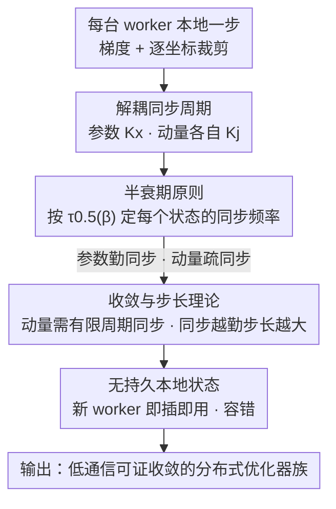

# DES-LOC: Desynced Low Communication Adaptive Optimizers for Foundation Models

**会议**: ICLR2026  
**OpenReview**: [https://openreview.net/forum?id=6N2qFixxYZ](https://openreview.net/forum?id=6N2qFixxYZ)  
**代码**: 待确认  
**领域**: LLM效率 / 分布式优化  
**关键词**: 分布式训练, 通信效率, 自适应优化器, Local Adam, 容错训练

## 一句话总结
DES-LOC 给自适应优化器的参数和各个动量状态**分配各自独立的同步周期**——参数同步得勤、动量按其"半衰期"同步得疏，在保持可证收敛的前提下把通信量压到比 DDP 少 170×、比之前 SOTA 的 Local Adam 少 2×，并在 1–13B 模型上拿到 1.3–2.1× 的端到端加速。

## 研究背景与动机

**领域现状**：训练基础模型要把优化分摊到多台 worker 上，标准做法是分布式数据并行（DDP），每一步都做一次全量梯度通信。为了省带宽，Local SGD / FedAvg 这类"低频通信"方法让每台 worker 先本地跑 $K \gg 1$ 步、再平均一次参数，把通信轮数砍掉 $K$ 倍。

**现有痛点**：Local SGD 这套设计当年只考虑同步**参数**，而现代基础模型用的是 Adam 这类自适应优化器——除了参数，还有一阶动量 $u$、二阶动量 $v$ 这些额外的优化器状态。把 Local SGD 硬套到 Adam 上有三条死路：(1) 只平均参数、把动量留在本地（DiLoCo 一系），缺收敛保证，本地动量会一直累积小 batch 的噪声梯度，新加入的 worker 也没法初始化动量；(2) 每次同步后把动量清零重置，会反复扰动训练、引发震荡；(3) Local Adam 把所有状态都按统一周期同步，**可证收敛**也鲁棒，但通信成本是 Local SGD 的 3 倍（参数 + 两个动量都要传）。

**核心矛盾**：要收敛保证就得同步动量，要省通信就想少传动量——Local Adam 把这两者绑死成"全同步或不收敛"，没有中间地带。

**切入角度**：作者观察到一个被忽略的事实——**不同优化器状态的变化速度天差地别**。Adam 里二阶动量 $v$ 用很大的 $\beta_2$（如 0.9999），它对新梯度极不敏感、变化极慢；一阶动量 $u$ 的 $\beta_1$（如 0.95）小得多、变化快得多。既然各状态"老化"速度不同，凭什么要用同一个同步周期？

**核心 idea**：给参数和每个动量**解耦同步频率**——变化快的勤同步、变化慢的疏同步，用状态自身的"半衰期"来定它该多久同步一次。

## 方法详解

### 整体框架

DES-LOC（Desynced Low Communication Adaptive Optimizers）是一**族**优化器，而不是单个算法：它把任意带 $N$ 个内部状态的自适应优化器 $\mathrm{OPT}$（如 Adam 的 $N=2$：$s^1=u$、$s^2=v$）包装成低通信的分布式版本。$M$ 台 worker 各自跑本地训练，唯一的改动是：参数 $x$ 用周期 $K_x$ 同步、第 $j$ 个优化器状态 $s^j$ 用**自己的**周期 $K_j$ 同步，这些周期相互独立。

每台 worker 每步做的事：算随机梯度 → 逐坐标裁剪 $\hat g = \mathrm{clip}(g,\rho)$ → 对每个状态 $s^j$，若 $t \bmod K_j = 0$ 就先把全体 worker 的该状态平均（$\mathbb{E}_m[\cdot]$）再做本地更新、否则纯本地更新 → 参数 $x$ 同理按 $K_x$ 决定是否先平均。同步用 FedAvg 的外层优化器（保证可证收敛），但框架也能直接接 FedOpt（如 Nesterov 外优化器）。整套设计的灵魂是下面的"半衰期原则"：先用理论刻画每个状态的变化速度，再据此给它派一个同步周期。

### 关键设计

**1. 解耦同步周期：给参数和每个动量各派一个独立的通信周期**

这是全文的根。Local Adam 的桎梏在于参数 $x$ 和动量 $u,v$ 共用一个周期 $K$，于是省通信就得连动量一起少传、进而破坏收敛。DES-LOC 直接把它们拆开：在算法里，参数按 $K_x$ 同步、状态 $s^j$ 按 $K_j$ 同步，互不绑定（Adam 即 $K_x, K_u, K_v$ 三个独立周期）。实践推荐 $K_u = 3K_x$、$K_v = 6K_x$——参数同步最勤，一阶动量疏 3 倍，二阶动量疏 6 倍。

为什么这样能省通信又不塌？因为通信成本正比于"传的状态数 × 频率"，把变化慢的二阶动量同步频率打到 1/6，整体通信量就大幅下降；而下面的理论会证明：只要动量仍以**有限周期**同步（不是永远本地），收敛性和 Local Adam 一样有保证。把"省通信"从"砍掉动量同步"改成"拉长动量同步周期"，是 DES-LOC 既省又稳的关键。

**2. 半衰期原则：用状态自身的衰减速度决定它该多久同步一次**

拆开周期后立刻面临一个问题——每个状态的 $K_j$ 到底该设多大？作者给出一个可计算的判据。定义状态衰减到原权重 $\psi$ 所需步数 $\tau_\psi(\beta) = \frac{\ln \psi}{\ln \beta}$，取半衰期 $\tau_{0.5}$ 为主测度：$\tau_{0.5}(0.95)\approx 13.5$、$\tau_{0.5}(0.999)\approx 692.8$、$\tau_{0.5}(0.9999)\approx 6931$。半衰期越长，说明该状态对新梯度越不敏感、"老化"越慢。

更进一步，在逐坐标裁剪 $|g_i|\le\rho$ 下，把 Adam 递推展开 $K$ 步可证两个动量的最大 $\ell_\infty$ 漂移有界：

$$\|u_{t+K}-u_t\|_\infty \le 2\rho\,(1-\beta_1^{K}), \qquad \|v_{t+K}-v_t\|_\infty \le 2\rho^2\,(1-\beta_2^{K}).$$

大 $\beta$ 配小裁剪半径 $\rho$（恰是基础模型训练的常见配置），动量在 $K$ 步内的绝对变化被牢牢压住。结论是：状态的半衰期应当直接决定它的同步频率——半衰期远大于本地步数 $K$ 时，同步只影响最初几步、随后影响衰减到 0，所以可以放心疏同步；半衰期和 $K$ 同量级时同步才真正左右本地更新。实验（RQ1/RQ2）验证了这点：二阶动量在高 $\beta_2$ 下变化比一阶慢约 100×，因此它最适合疏同步。

**3. 收敛与步长理论：动量必须以有限周期同步，且同步越勤、可用步长越大**

光省通信不够，得证明这么搞不会破坏收敛。作者把"每 $K$ 步同步一次"等价成"以概率 $p=1/K$ 同步"，对 DES-LOC-SGDM 证明（Theorem 1）：取步长 $\eta=\min(\eta_0, 1/\sqrt T)$ 时，平均梯度范数以最优速率 $O(1/\sqrt T)$ 收敛，且**主导项不受本地步数影响**。参数同步概率 $p_x$、动量同步概率 $p_u$ 只出现在高阶项 $O(1/T)$ 和一个量 $\psi$ 里：

$$\psi \;=\; \frac{4(1-p_x)}{p_x^2}\cdot\frac{(1-\beta)(1-p_u)}{1-(1-p_u)\beta}.$$

两个洞察从这里掉出来：(i) $\psi=O(1/p_x^2)$ 对参数同步极度敏感——$p_x\to 0$ 会让 $\psi$ 爆炸、速率崩掉，所以**参数必须勤同步**；(ii) 动量同步 $p_u$ 即使关掉（$p_u=0$）也不改变渐近速率，但 $\psi$ 同时进了步长上界 $\eta_0\propto 1/\sqrt\psi$——$p_u\to0$ 时 $\psi$ 取到最大，把允许的步长压到最小。换句话说，**动量同步得越勤、能用的稳定步长越大、实践收敛越快**。再加上对 DES-LOC-Adam 的高概率分析表明：当 $\beta_2<1.0$ 时，二阶动量的同步周期必须**有限**——这就是"动量可以少同步、但不能永远不同步"的理论底线，正好解释了纯本地动量的启发式方法为何不稳。

**4. 无持久本地状态：天然支持 worker 即插即用与容错**

把动量留在本地的启发式方法有个致命伤：每台 worker 的动量是私有且持续累积的，新 worker 加进来没有合法的动量初始值，某台 worker 挂掉也没法恢复，因此不适合大规模、易故障的训练环境。DES-LOC 因为**最终所有状态都会被同步**（周期有限），等价于一个 $K=\max(K_x,K_u,K_v)$ 的 Local Adam——任何新加入的 worker 在下一个同步点就能从全局平均拿到一致的参数和动量，无需持久本地状态。实验里在第 1536 步把 worker 数量翻倍，DES-LOC 和 Local Adam 的困惑度/梯度范数都保持平稳，而启发式基线和"临时从 checkpoint 平均动量"的做法都出现明显扰动。这让 DES-LOC 同时具备低通信 + 容错两个性质。

### 损失函数 / 训练策略
训练目标就是标准的分布式经验风险最小化 $\min_x \frac1M\sum_m f_m(x)$，没有引入额外损失项。优化侧用 ADOPT（Adam 变体，在高 $\beta_2$ 下更稳，取 $\beta_2=0.9999$）作内优化器、FedAvg 或 Nesterov 作外优化器；学习率用 WSD schedule；裁剪半径 $\rho$ 配合大 $\beta$ 控制动量漂移。关键超参就是三个同步周期：先按带宽定 $K_x$ 保证吞吐，再把 $K_u,K_v$ 设成 $K_x$ 的常数倍（如 3×、6×）或按各自 $\beta$ 的半衰期设。

## 实验关键数据

### 主实验

在 135M GPT 训 6.4B token、1.7B 训 40B token 上验证。核心结论：DES-LOC 在匹配 Local Adam 困惑度的同时把通信减半，比 DDP 少 170×，端到端 1.3–2.1× 加速。

billion-scale 模型的 ICL（in-context learning）下游表现（越高越好）：

| 方法 | Arc Challenge | Arc Easy | PIQA | HellaSwag | Avg |
|------|--------------|----------|------|-----------|-----|
| DES-LOC | 31.8 | 59.0 | 70.7 | 44.9 | 51.6 |
| Local Adam | 31.9 | 59.0 | 70.6 | 45.8 | 51.8 |
| FAVG+OPT（持久本地态） | 30.1 | 58.0 | 70.0 | 44.8 | 50.7 |
| DDP（性能上界） | 33.8 | 62.5 | 71.1 | 47.8 | 53.8 |

DES-LOC 几乎追平 Local Adam（51.6 vs 51.8）、明显优于持久本地态的 FAVG+OPT（后者因激活/参数范数膨胀、训练不稳而掉点），并逼近 DDP 上界——而通信量只有 Local Adam 的一半。

到 1B–13B 规模的墙钟时间（天，越低越好）：

| 方法 | 1B (Kx=256) | 7B (Kx=256) | 13B (Kx=256) |
|------|-------------|-------------|--------------|
| DDP | 1.41 | 38.74 | 175.50 |
| Local Adam | 0.64 | 24.18 | 83.34 |
| DES-LOC | 0.63 | 24.06 | 82.68 |

在 13B、$K_x=256$ 下 DES-LOC 比 DDP 省下 90+ 天；高频 $K_x=16$ 时比 Local Adam 省 13 天，逼近持久本地态基线的吞吐（差距 < 3%），但比后者稳定得多。

### 消融实验

| 配置 | 现象 | 说明 |
|------|------|------|
| 改变 $K_x$（参数同步周期） | 拉长则困惑度明显恶化 | 参数同步是性能命门，对应理论主导项 |
| 改变 $K_v$（二阶动量周期） | 几乎不影响性能 | 半衰期巨大，可放心疏同步省通信 |
| 改变 $K_u$（一阶动量周期） | 仅当周期接近其半衰期时才影响 | 与"半衰期原则"完全吻合 |
| 外优化器换 Nesterov（700M, $K_x=32$） | 比纯平均再提升 ≈0.5%，逼近 DDP 1% 以内 | DES-LOC 兼容 FedOpt 框架 |
| 内优化器换 Muon（16M–360M） | 持平 Local Muon，少传 > 1.5× 字节 | 半衰期原则对非 Adam 族同样成立 |

### 关键发现
- **参数 vs 动量的同步重要性高度不对称**：参数同步周期 $K_x$ 是性能命门（$\psi\propto 1/p_x^2$），二阶动量几乎可以随便疏同步——这是 2× 通信缩减的直接来源。
- **半衰期是可计算的同步频率判据**：二阶动量经验变化速度比一阶慢约 100×，与理论半衰期比 $\tau_{0.5}(\beta_2)/\tau_{0.5}(\beta_1)=\ln\beta_1/\ln\beta_2$ 一致，把"该多久同步"从玄学变成可算的量。
- **方法是优化器无关的**：从 Adam/ADOPT 到单动量的 Muon，再到外层换 Nesterov，半衰期原则都成立，说明 DES-LOC 是一套通用包装而非单点 trick。

## 亮点与洞察
- **把"省通信"重新定义为"拉长同步周期"而非"砍掉同步"**：这一念之差让它既省又可证收敛——这是相比纯本地态启发式方法的本质区别，也是最巧的地方。
- **理论和现象严丝合缝**：$\psi$ 这一个量同时解释了"参数为何必须勤同步"（$1/p_x^2$ 爆炸项）和"动量为何同步越勤步长越大"（$\eta_0\propto1/\sqrt\psi$），不是事后凑的故事而是同一公式的两个推论。
- **半衰期原则可直接迁移**：任何带衰减系数 $\beta$ 的动量类状态都能套——只要算出 $\tau_{0.5}(\beta)$ 就知道它能疏同步到什么程度，这套判据对未来的新优化器都适用。
- **低通信和容错一箭双雕**：因为"最终都会同步"，它顺带解决了 worker 即插即用问题，对跨数据中心、易故障的大规模训练特别有价值。

## 局限与展望
- 收敛理论主要建立在 SGDM 和单动量简化 Adam 上，完整双动量 Adam 与 Nesterov 外优化器的严格界仍不完全适用（作者承认 Eq.(4) 对 Nesterov 只是"启发式提示"）。
- 推荐的 $K_u=3K_x, K_v=6K_x$ 是经验常数倍，虽有半衰期原则背书，但最优周期仍依赖人工网格搜索或对 $\beta$ 的先验。
- 实验在 IID 数据为主、最大 1.7B（墙钟外推到 13B），Non-IID 与真正 13B+ 全量训练只在附录/外推中给出，超大规模长训练下的稳定性还需更多验证。
- 作者指出的延展方向：逐层差异化同步、自适应同步频率、再叠加压缩/稀疏化更新，以及跨数据中心、协作训练等新场景。

## 相关工作与启发
- **vs Local SGD / FedAvg**: 它们只同步参数、为 SGD 设计，套到自适应优化器上要么缺收敛保证、要么需处理额外动量；DES-LOC 把动量纳入框架并给出可证收敛。
- **vs DiLoCo / 持久本地态启发式**: 把动量永远留本地虽省通信，但累积噪声、无法初始化新 worker、缺保证；DES-LOC 用"有限周期同步"既省又稳，且天然容错。
- **vs 重置状态的启发式**: 每次同步清零动量会反复震荡；DES-LOC 平均而非重置，避免扰动。
- **vs Local Adam（前 SOTA）**: 它把参数和两个动量绑定同一周期、保证收敛但通信三倍；DES-LOC 解耦周期、按半衰期疏同步动量，通信减半、性能持平、鲁棒性相当。

## 评分
- 新颖性: ⭐⭐⭐⭐⭐ "解耦同步周期 + 半衰期原则"把一个被忽略的事实（状态变化速度不同）变成可证、可算、可迁移的方法
- 实验充分度: ⭐⭐⭐⭐ 覆盖 16M–1.7B 训练 + 13B 墙钟外推、多内/外优化器、worker 翻倍容错；但真·13B 全量训练与 Non-IID 偏附录
- 写作质量: ⭐⭐⭐⭐⭐ 理论与现象对应清晰，$\psi$ 一式贯穿动机、设计、消融，逻辑闭环
- 价值: ⭐⭐⭐⭐⭐ 直击基础模型分布式训练的带宽瓶颈，给出可落地的同步频率配方，且兼容现有优化器生态

<!-- RELATED:START -->

## 相关论文

- [\[ICLR 2026\] A Tale of Two Geometries: Adaptive Optimizers and Non-Euclidean Descent](a_tale_of_two_geometries_adaptive_optimizers_and_non-euclidean_descent.md)
- [\[ICLR 2026\] A Convergence Analysis of Adaptive Optimizers under Floating-Point Quantization](a_convergence_analysis_of_adaptive_optimizers_under_floating-point_quantization.md)
- [\[ICLR 2026\] Adaptive Acquisition Selection for Bayesian Optimization with Large Language Models](adaptive_acquisition_selection_for_bayesian_optimization_with_large_language_mod.md)
- [\[ICLR 2026\] Communication-Efficient Decentralized Optimization via Double-Communication Symmetric ADMM](communication-efficient_decentralized_optimization_via_double-communication_symm.md)
- [\[ICLR 2026\] MT-DAO: Multi-Timescale Distributed Adaptive Optimizers with Local Updates](mt-dao_multi-timescale_distributed_adaptive_optimizers_with_local_updates.md)

<!-- RELATED:END -->
