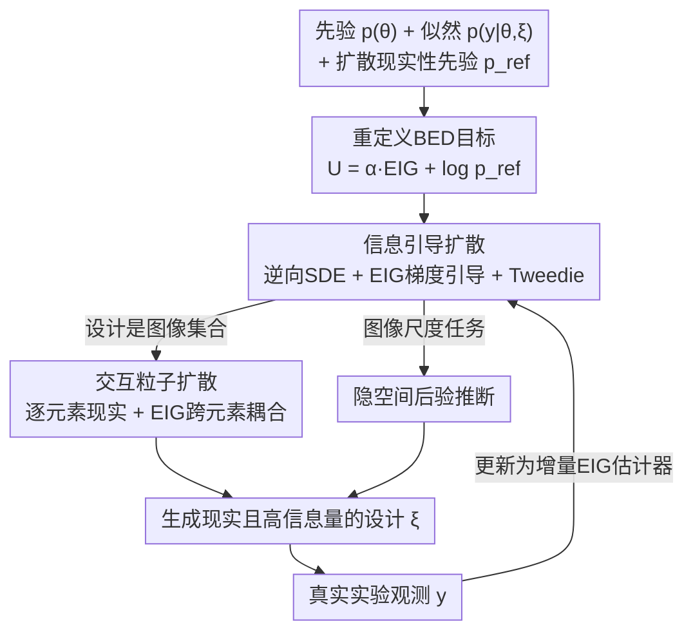

# DiffBED: Scaling Bayesian Experimental Design to High-Dimensions

**会议**: ICLR2026  
**OpenReview**: [https://openreview.net/forum?id=pNO7VqKAcY](https://openreview.net/forum?id=pNO7VqKAcY)  
**代码**: 待确认  
**领域**: 贝叶斯实验设计 / 扩散模型 / 概率方法  
**关键词**: 贝叶斯实验设计, 期望信息增益, 扩散引导, 模型失配, 奖励黑客

## 一句话总结
DiffBED 指出贝叶斯实验设计（BED）在高维设计空间失效的根因不是 EIG 估计器不够好，而是似然在远离数据流形处被"过度自信"地利用（一种奖励黑客行为）；它把一个扩散模型当作"现实性先验"，用 EIG 的梯度去引导扩散的逆向 SDE，从而生成既高信息量又真实可行的设计，第一次把 BED 推到了 75 万维以上的图像设计空间。

## 研究背景与动机

**领域现状**：贝叶斯实验设计（BED）是"如何聪明地采集数据"的一套原则化框架。给定对目标量 $\theta$ 的先验 $p(\theta)$ 和似然 $p(y\mid\theta,\xi)$，BED 通过最大化期望信息增益（EIG）$\text{EIG}(\xi)=\mathbb{E}_{p(\theta)p(y\mid\theta,\xi)}[\log p(y\mid\theta,\xi)-\log p(y\mid\xi)]$ 来选出能最大程度降低不确定性的设计 $\xi$。它天然适合序贯自适应采集——每一步把上一步的观测纳入后验再选下一个设计。

**现有痛点**：尽管原理上通用，BED 历史上只在设计变量低维（通常 $\lesssim 20$ 维）的简单问题上成功过。社区一直把"扩展到高维"理解成一个**计算问题**，于是大量工作在卷如何更便宜、更低方差地估计 EIG 的梯度（NMC、PCE 等）。

**核心矛盾**：本文指出有一个更根本的障碍被忽略了——**似然在整个设计空间上保持准确这件事本身就不现实**。随着设计维度升高，似然必须在指数级增长的空间上都准，而现代 ML 模型只在数据流形附近学得好；实验设计偏偏要去探索"已知之外"的信息，这就逼着似然往建模假设最脆弱的区域外推。结果是：直接优化 EIG 会被吸引到似然"虚假地过度自信"的区域，产出看似高 EIG、实则毫无意义的设计（如纯像素噪声）。作者把这类比成强化学习里的**奖励黑客**（reward hacking）。在序贯设定下问题被进一步放大——病态的反馈回路让后验在错误值上塌缩（论文 Figure 2）。

**本文目标**：在不要求似然处处准确的前提下，让 BED 在高维设计空间里也能选出真正有用的设计。

**切入角度**：作者的关键观察是——失配不是均匀的。似然在"现实、可行的设计流形"上往往足够准（因为它就是从这类数据学出来的），只是在流形之外不可信。而在很多实际场景里，我们对"哪些设计是可行的"是有先验知识的（一批无标注图像、或一个生成式基础模型），这个"现实性"判据可以独立于实验结果来指定。

**核心 idea**：不去修似然，而是改造设计目标本身——在 EIG 之外显式加一项"现实性奖励"，并用一个扩散模型来刻画这个现实性先验，再用 EIG 的梯度去引导扩散采样，让生成的设计同时满足"高信息量 + 高现实性"。

## 方法详解

### 整体框架
DiffBED 的整体思路是把"选设计"从"在全空间上直接梯度上升 EIG"换成"从一个被 EIG 倾斜过的现实性分布里采样"。具体地，它定义一个新效用 $U_{\text{DiffBED}}(\xi)=\alpha\cdot\text{EIG}(\xi)+\log p_{\text{ref}}(\xi)$，其中 $p_{\text{ref}}$ 是一个扩散模型给出的"现实设计先验"；不直接优化 $U$，而是从指数倾斜分布 $p^\*(\xi)\propto p_{\text{ref}}(\xi)\exp(\alpha\cdot\text{EIG}(\xi))$ 里采样。采样靠"信息引导扩散"实现：在扩散模型的逆向 SDE 里加一项由 EIG 梯度构成的引导漂移，把噪声样本往高 EIG 的现实设计推。序贯场景下，每观测到一个新结果就更新 EIG 估计器（先验换成后验、用增量 EIG），再重跑一次引导扩散选下一个设计。

### 关键设计

**1. 重定义 BED 目标：用现实性正则压住奖励黑客**

这一步针对的痛点是"直接最大化 EIG 会去钻似然的空子"。作者先从理论上把这件事说清：用一个"真实 EIG"（TEIG，用未知真分布 $p_{\text{true}}$）做对照，可以把模型 EIG 分解为 $\text{EIG}(\xi)=\text{TEIG}(\xi)+\underbrace{\mathbb{E}_{p(\theta)}[H[p_{\text{true}}(y\mid\theta,\xi)]-H[p(y\mid\theta,\xi)]]}_{M(\xi)}+\big(H[p(y\mid\xi)]-H[p_{\text{true}}(y\mid\xi)]\big)$。其中 $M(\xi)$ 度量"模型平均过度自信程度"：似然越是比真分布更确定，$M(\xi)$ 越大。$M(\xi)$ 随设计变化，于是直接优化 EIG 等于鼓励去 $M(\xi)$ 大的地方——即似然过度自信处；而剩下那个边际项因为对 $\theta$ 做了平均、比似然弥散得多，往往提供不了足够的反向保护。这就解释了为什么高维下 EIG 优化几乎必然奖励黑客。

解法不是去修似然（高维下处处准不现实，且优化会放大残差），而是改目标：加一个惩罚 $r(\xi)$ 罚那些"落在对齐良好区域之外"的设计。由于可对齐区域是隐的，作者用一个在现实数据上训练的生成模型 $p_{\text{ref}}(\xi)$ 来代理它，取 $r(\xi)=-\log p_{\text{ref}}(\xi)$，得到效用 $U_{\text{DiffBED}}(\xi)=\alpha\cdot\text{EIG}(\xi)+\log p_{\text{ref}}(\xi)$，$\alpha>0$ 权衡"信息量 vs. 现实性"。但直接优化 $U$ 有两个毛病：深度生成模型密度最高的点未必是合理样本；且 SOTA 生成模型（扩散/流）多是隐式的，拿不到可靠的 $p_{\text{ref}}$。于是作者改为**采样**而非优化——从 $p^\*(\xi)\propto p_{\text{ref}}(\xi)\exp(\alpha\cdot\text{EIG}(\xi))$ 采样。这个倾斜分布还有个等价变分解释：它是 $\max_q \mathbb{E}_q[\text{EIG}(\xi)]-\tfrac{1}{\alpha}\text{KL}[q\Vert p_{\text{ref}}]$ 的唯一解，$\alpha$ 正是在"高 EIG"和"贴近现实先验"之间做权衡的同一个超参。

**2. 信息引导扩散：用 EIG 梯度引导逆向 SDE，无需重训**

要从 $p^\*(\xi)$ 采样，作者把它转成一个随机最优控制问题：在扩散的逆向 SDE 上加一项漂移 $u(\xi_t,t)\,dt$，把噪声态推向高 EIG 区域。理想的漂移是 $u(\xi_t,t)=g(t)^2\nabla_{\xi_t}\log\mathbb{E}_{p_{\text{ref}}(\xi_0\mid\xi_t)}[\exp(\alpha\cdot\text{EIG}(\xi_0))]$，但它要对 $p_{\text{ref}}(\xi_0\mid\xi_t)$ 求期望、每个样本都要重解一遍 SDE，不可行。借鉴 training-free guidance，作者用条件均值 $\hat\xi_0(\xi_t)=\mathbb{E}_{p_{\text{ref}}}[\xi_0\mid\xi_t]$ 处的 delta 近似，得到 $u(\xi_t,t)\approx g(t)^2\nabla_{\xi_t}[\alpha\cdot\text{EIG}(\hat\xi_0(\xi_t))]$。关键在于 $\hat\xi_0$ 可由 **Tweedie 公式**直接用现成的得分函数 $s_{\text{ref}}$ 算出而无需仿真：例如 VP-SDE/DDPM 下 $\hat\xi_0(\xi_t)=(\xi_t+(1-\alpha_t)s_{\text{ref}}(\xi_t,t))/\sqrt{\alpha_t}$。最终采样器就是把"得分 + 缩放后的 EIG 梯度"叠加进逆向 SDE：

$$d\xi_t=\Big[f(\xi_t,t)-g(t)^2\big(s_{\text{ref}}(\xi_t,t)+\alpha\nabla_{\xi_t}\text{EIG}(\hat\xi_0(\xi_t))\big)\Big]dt+g(t)\,d\overleftarrow{W}_t.$$

也就是在每一步的得分网络上加一个按比例缩放的 EIG 梯度估计（$y$ 离散用式(3)的非嵌套估计器，连续则用 PCE/NMC 等）。这套方案的好处是：兼容隐式生成先验、不需要任何依赖似然的重训练、也不改似然，因此可以直接套用 SOTA 预训练扩散/基础模型。序贯时只需把 EIG 梯度估计器换成增量 EIG $\text{EIG}(\xi_k\mid D_{k-1})$ 即可自适应。

**3. 交互粒子扩散：当设计本身是一组图像**

很多任务（如偏好诱导）里，一个设计是 $S$ 个元素的集合 $\xi=\{\xi^{(1)},\dots,\xi^{(S)}\}$。作者复用一个定义在单元素上的扩散模型，把参考分布取成各元素独立的乘积 $p_{\text{ref}}(\xi)\propto\prod_j p_{\text{ref}}(\xi^{(j)})$，然后对每个元素 $\xi^{(j)}_t$ 跑逆向过程：扩散先验项给出**逐元素独立的得分更新**（保证每张图各自现实），而 EIG 项 $\nabla_{\xi^{(j)}_t}\text{EIG}(\hat\xi_0(\xi_t))$ 引入**跨元素耦合**（保证整组作为一个设计是信息量最大的，比如几张图要互相有区分度）。这构成一个交互粒子扩散——结构上类似多样性导向的粒子引导，但耦合来自 EIG 目标本身，而非人为设计的排斥核。这正好解释了实验里 DiffBED 会先探索粗粒度属性（性别、发色）再细化的行为：信息量诉求自然要求被比较的图互相不同，而单纯的预测熵（Entropy 基线）做不到这点。

**4. 隐空间后验推断：把高维任务压回低维表征**

序贯 BED 需要一个又快又准的后验采样器。DiffBED 在图像尺度实验里的一个关键选择是**在隐空间（而非像素空间）做推断**：很多名义上高维的任务，我们真正关心的信息集中在一个低得多的表征里（如感知特征），而背景、光照、像素噪声这些干扰变化可以忽略。在嵌入空间做推断让 DiffBED 既稳健又可扩展，同时天然契合"似然本就定义在某个编码器之上"的问题——θ 取自 SimCLR / VGGFace2 等预训练嵌入，推断得到的后验样本再解码回图像空间。

## 实验关键数据

实验统一围绕"人类反馈诱导"这一主题（设计是一张或多张图像，反馈是排序或离散评分），目标是恢复一个真值 $\theta_{\text{true}}$。主要基线是当前标准范式：对 EIG 估计器做直接梯度上升的 BED；此外有 Entropy（用边际预测熵而非 EIG 引导）、Rank (Pool)（每轮从 1000 个候选里选 EIG 最高者）、Rank (Diffuse)（从扩散先验采少量候选）、Random。

### 主实验

| 任务 | 设计维度 / 设置 | 评估指标 | DiffBED 表现 | 标准 BED |
|------|------|------|------|------|
| 源定位（合成） | 低维传感器位置，人为注入失配 $\Xi^\*$ | 后验对真源的 L2 误差 | **最低 L2 误差**，高精度恢复源位置 | EIG 高但常落在 $\Xi^\*$ 外，L2 误差比从 $p_{\text{ref}}$ 随机抽还差 |
| MNIST 搜索 | $S{=}4$ 图集合，排序反馈 | 后验 vs $\theta_{\text{true}}$ 余弦相似度 | **最高余弦相似度** | EIG 高但设计退化为噪声，相似度近 0 |
| CelebA 搜索 | $S{=}4$ 图集合，排序反馈 | 余弦相似度 | **最高**，且优于看 1000 候选的 Rank (Pool) | 失败 |
| Zappos 评分 | 512×512 单图，>75 万维，离散评分 | 余弦相似度 | 优于除 Rank (Pool) 外所有基线，与之仅微小差距 | 学不到任何有意义的东西 |

最具标志性的结果是 Zappos：用微调过的 Stable Diffusion v1.5（10 亿参数基础模型）当 $p_{\text{ref}}$，DiffBED 在**超过 75 万维**的设计空间上仍然有效——而此前序贯 BED 极少能成功超过约 20 维。

### 消融 / 对照分析

| 配置 | 现象 | 说明 |
|------|------|------|
| 标准 BED（无现实性先验） | EIG 高、设计是噪声、相似度≈0 | 奖励黑客的直接证据 |
| Entropy（EIG→边际熵） | 不鼓励图集之间互异 | 说明排序信息量需要 EIG，而非单纯不确定性 |
| Rank (Pool) 1000 候选 | 在"集合型设计"任务上反不如 DiffBED | 候选越多越易混入 $p_{\text{ref}}$ 下不可能的设计 + "赢家诅咒"噪声 |
| Rank (Pool) vs Rank (Diffuse) | 1000 候选反而 L2 比 5 候选差 | 大候选池更易选中 OOD 设计，呼应主动学习里 BALD 随池增大退化的现象 |

### 关键发现
- **奖励黑客是高维 BED 的真正瓶颈**：在源定位里，BED 的增量 EIG 在后验退化时反而又开始上升，是病态反馈回路的指纹；而高 EIG 完全不等于高信息量。
- **"更多候选"会害了 Rank**：候选池越大越可能含有 $p_{\text{ref}}$ 下不现实的设计、并被估计噪声放大（赢家诅咒），所以 Rank (Pool) 在集合型设计上反输给只生成单个设计集的 DiffBED。
- **DiffBED 主动用更低 EIG 换现实性**：它在 $p_{\text{model}}$ 下的增量 EIG 往往低于标准 BED，但因为设计落在对齐良好区域，真实学习效果反而最好——这正是"用现实性正则压住奖励黑客"的体现。
- **设计是集合时优势更大**：DiffBED 用梯度直接生成互补的设计集，Rank 只能靠随机组合碰运气，故子设计越多 DiffBED 领先越多。

## 亮点与洞察
- **重新诊断问题**：把"高维 BED 失败"从一个公认的"EIG 估计器计算问题"重新定性为"似然失配被优化器钻空子的奖励黑客问题"，并给出 $M(\xi)$ 过度自信项的分解作为理论支撑——这是认知层面的转变，比单纯换估计器更根本。
- **不修似然、改目标**：承认"高维下似然不可能处处准"，转而约束设计落在似然可信的现实流形上。这个"接受失配、绕开它"的思路可迁移到任何"模型只在数据流形附近可信、但优化会把你推出流形"的场景（如离线 RL、对抗优化、分子设计）。
- **复用现成扩散模型当先验**：training-free guidance + Tweedie 让 EIG 引导只需一次得分函数评估，完全不碰扩散模型的训练，因此能直接接 Stable Diffusion 这类基础模型——把 BED 和生成式基础模型耦合起来的工程路径很实用。
- **交互粒子扩散的耦合来自目标本身**：图集之间的多样性不是靠人造排斥核硬加的，而是 EIG 自然诱导的，这让"先探索粗属性再细化"的行为自发涌现。

## 局限与展望
- **delta 近似较粗**：用条件均值 $\hat\xi_0$ 的 delta 来近似 $p_{\text{ref}}(\xi_0\mid\xi_t)$ 是个 crude approximation，作者承认这点，只是经验上够用；在 $p_{\text{ref}}$ 多峰、条件分布很宽时引导信号可能不准。
- **依赖一个好的现实性先验**：DiffBED 的有效性建立在"存在一个能刻画可行设计、且与似然可信区域重合"的 $p_{\text{ref}}$ 上。当无标注辅助数据稀缺、或可行设计本身就远离任何已有数据流形时，这个前提会动摇。
- **实验集中在人类反馈诱导/图像**：虽然框架不限定场景，但所有实验都围绕图像偏好诱导；在科学实验设计（药物、临床）这类真正动机场景上的验证仍待补。
- **$\alpha$ 的权衡敏感性**：信息量与现实性的平衡完全压在单个 $\alpha$ 上，论文未充分展开其敏感性与自适应选择。
- **Rank (Pool) 在单图任务上仍很强**：Zappos 上 DiffBED 仅微弱领先 Rank (Pool)，说明当设计是单个元素、且有现成数据池可直接挑时，生成式方法相对"挑选式"方法的优势会收窄。

## 相关工作与启发
- **vs 可扩展 EIG 估计器（Foster et al. 2019/2020、Goda et al. 2022、Iollo et al. 2025）**: 他们把高维难题当成"如何更便宜地估 EIG 梯度"，但都仍限于低维设计空间（最高约 15–20 维）；DiffBED 指出真正的瓶颈是似然失配，并把设计空间推到 75 万维以上。Iollo et al. 也用了扩散模型，但只是用在目标变量 $\theta$ 的先验上以改善 $\theta$ 空间扩展，而非设计空间。
- **vs BED 中的模型失配研究（Feng 2015、Go & Isaac 2022、Sürer et al. 2024）**: 以往工作多通过显式修正模型/EIG，或用高斯过程纠偏（但假设已有真实实验结果数据）。本文首次展示奖励黑客式行为并论证它在高维学习型似然下几乎不可避免；在高维低数据设定下学显式偏差不可行，DiffBED 改用设计先验来正则化优化。
- **vs 用 LLM 做偏好诱导的 BED（Choudhury 2025、Kobalczyk 2025、Handa 2024）**: 它们多是 LLM 生成一批候选、各自估 EIG、选最高者，类似本文的 Rank 变体；DiffBED 则面向高维连续设计空间，用基于梯度的优化直接生成信息量最大的设计集。
- **vs 多样性粒子引导（Corso 2023、Kirchhof 2025）**: 结构相似（多粒子交互），但 DiffBED 的跨元素耦合来自 EIG 目标，而非为多样性人为设计的排斥核。

## 评分
- 新颖性: ⭐⭐⭐⭐⭐ 把高维 BED 失败重新诊断为奖励黑客并给出理论分解，再用扩散引导绕开失配，视角和方法都新。
- 实验充分度: ⭐⭐⭐⭐ 从合成源定位到 75 万维 Zappos 的渐进式验证扎实、基线丰富，但场景集中在图像偏好诱导，缺真实科学实验设计验证。
- 写作质量: ⭐⭐⭐⭐⭐ 问题诊断（含 $M(\xi)$ 分解）与方法推导（倾斜分布→引导 SDE→Tweedie）层层递进，配图直观。
- 价值: ⭐⭐⭐⭐⭐ 第一次把 BED 推到图像尺度，打通"BED + 生成式基础模型"的实用路径，显著拓宽了原则化实验设计的适用范围。

<!-- RELATED:START -->

## 相关论文

- [\[NeurIPS 2025\] Learning Quadratic Neural Networks in High Dimensions: SGD Dynamics and Scaling Laws](../../NeurIPS2025/optimization/learning_quadratic_neural_networks_in_high_dimensions_sgd_dynamics_and_scaling_l.md)
- [\[ICLR 2026\] From Sorting Algorithms to Scalable Kernels: Bayesian Optimization in High-Dimensional Permutation Spaces](from_sorting_algorithms_to_scalable_kernels_bayesian_optimization_in_high-dimens.md)
- [\[ICLR 2026\] Contextual Causal Bayesian Optimisation](contextual_causal_bayesian_optimisation.md)
- [\[ICLR 2026\] CALM: Co-evolution of Algorithms and Language Model for Automatic Heuristic Design](calm_co-evolution_of_algorithms_and_language_model_for_automatic_heuristic_desig.md)
- [\[ICLR 2026\] Combinatorial Bandit Bayesian Optimization for Tensor Outputs](combinatorial_bandit_bayesian_optimization_for_tensor_outputs.md)

<!-- RELATED:END -->
