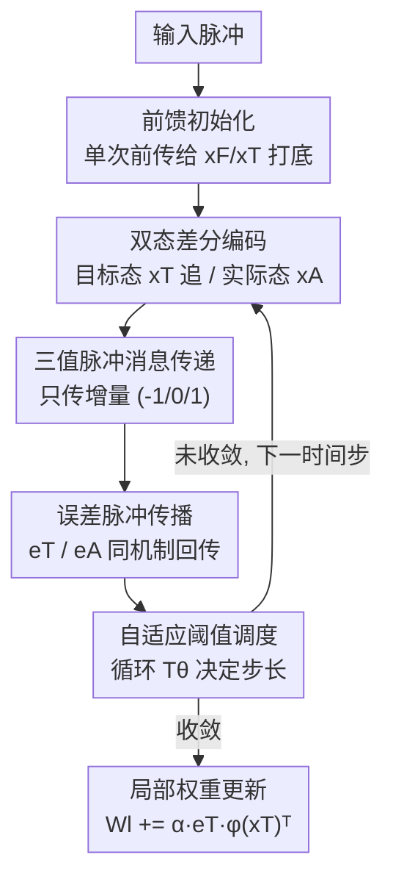

# Difference Predictive Coding for Training Spiking Neural Networks

**会议**: ICLR2026  
**OpenReview**: [https://openreview.net/forum?id=iu9dbz2lB9](https://openreview.net/forum?id=iu9dbz2lB9)  
**代码**: 待确认  
**领域**: 优化 / 脉冲神经网络 / 神经形态计算  
**关键词**: 差分预测编码, 脉冲神经网络, 预测编码, 局部学习, 三值脉冲

## 一句话总结
本文把"预测编码"这套生物启发的局部学习框架改造成**完全脉冲原生**的训练算法 DiffPC：层间不再传稠密浮点数，而是只在状态发生变化时发出稀疏的三值脉冲（-1/0/1），在 MNIST 99.3%、Fashion-MNIST 89.6%、CIFAR-10 上超过反向传播基线的同时，把训练时的通信量压低了两个数量级以上。

## 研究背景与动机
**领域现状**：深度学习的成功建立在误差反向传播（BP）之上，但 BP 有两个被广泛诟病的"非生物合理性"：一是需要**全局误差信号**——某层权重更新依赖于跨多层传来的信息，远超神经元本地能拿到的信号；二是依赖**连续值的激活与梯度**，而大脑用的是离散、事件驱动的脉冲。神经形态硬件（如 Intel Loihi 2、TrueNorth、SpiNNaker）把存储和计算放在一起以减少数据搬运，天然适合脉冲神经网络（SNN），但 SNN 怎么训练一直是难题。

**现有痛点**：现有 SNN 训练大致分三类，各有硬伤。(i) ANN→SNN 转换：精度高但训练仍在片外、用稠密浮点；(ii) 替代梯度直训（BPTT + surrogate gradient）：精度最高，但仍依赖全局反向信号和稠密通信，难以在片上训练；(iii) 纯局部规则（STDP 等）：符合生物与硬件约束，但往往需要额外分类器、复杂任务上掉点。而**预测编码（PC）**本是个理想候选——它只在相邻层间传残差误差、用局部学习规则，理论上极契合神经形态硬件的并行分布结构。

**核心矛盾**：但标准 PC 的实现要做迭代"沉降"（iterative settling），为了让信息在网络里传播，单个输入要反复多次前向/反向传播才收敛，而且这些 message passing 用的是**稠密浮点数**。结果是 PC 虽然解决了 BP 的"全局误差搬运"问题，却又因为稠密连续通信，把部署在事件驱动硬件上想省的能耗又赔了回去——它没真正吃到神经形态基底的稀疏性红利。

**本文目标**：把 PC 重写成一个**脉冲原生**的算法，让计算和通信都变成事件驱动（仅在需要纠正预测误差时才发生），同时保持 PC 的局部学习性质，使其能跑在 Loihi 2 这类神经形态芯片上。

**切入角度**：作者借鉴了"用脉冲近似梯度（gradient-by-spikes）"的思路——把连续的状态变化量离散成脉冲来传，但不是传整个状态，而是只传**增量**。

**核心 idea**：用稀疏三值脉冲传"状态差分"替代稠密浮点 message passing，配合自适应阈值调度让离散脉冲态逼近连续 PC 的动力学——这就是 Difference Predictive Coding（DiffPC）。

## 方法详解

### 整体框架
先回顾标准 PC：一个 $L$ 层网络，每层维护目标活动 $x_{T,l}$ 和由上一层生成的预测 $x_{F,l}=W_l\,\phi(x_{T,l-1})$，二者之差就是预测误差 $\epsilon_l = x_{T,l}-x_{F,l}$。网络最小化所有层误差的"自由能" $F=\sum_l \|\epsilon_l\|_2^2$，并交替做两类**局部**更新：权重更新 $W_l \leftarrow W_l + \alpha\,\epsilon_l\,\phi(x_{T,l-1})^\top$，以及目标活动更新（依赖本层误差和下一层回传的 $W_{l+1}^\top\epsilon_{l+1}$）。这些更新只涉及相邻层，所以要迭代多步才能让信息走遍全网。

DiffPC 要做的，是把上面这套**浮点计算和信息传递全部离散成三值脉冲序列 (-1, 0, 1)**。它的核心改造是：每个单元不再直接传"状态值"，而是维护两套变量——

- 目标态 $x_T$ 与实际态 $x_A$：$x_T$ 是想要达到的活动，$x_A$ 努力去追 $x_T$，二者之差按正比于自适应阈值 $T_\theta$ 的步长逐步缩小，每一步的差分调整以脉冲形式发给后续层；
- 目标误差 $e_T$ 与实际误差 $e_A$：作用方式相同，$e_A$ 追 $e_T$，调整量也以脉冲传出。

由于阈值 $T_\theta$ 决定了每步更新的步长，它的调度策略对收敛至关重要。整个流程是：先做一遍**前馈初始化**给网络状态打底，然后逐时间步迭代——接收输入脉冲更新预测、算目标误差、更新目标态并生成活动脉冲、把误差也编码成脉冲传播、最后更新权重。

### 关键设计

**1. 双态差分编码：用"目标态/实际态之差"承载本该传的浮点状态**

标准 PC 每步都要广播完整的浮点状态，这正是通信开销的来源。DiffPC 给每个单元拆出两个状态：目标态 $x_T$（期望活动）和实际态 $x_A$（当前已对外"宣告"的活动）。后续层看到的不是 $x_T$ 本身，而是 $x_A$ 通过脉冲累加重建出来的近似。每个时间步，只有当二者之差超过当前阈值时才发脉冲：$s_A = \mathrm{sign}(x_T - x_A)\odot(|x_T - x_A| > T_\theta)$，然后 $x_A \leftarrow x_A + T_\theta\cdot s_A$，把差距缩小一个 $T_\theta$ 的台阶。这样"状态没变就不发脉冲"，把稠密广播变成了**按需的增量通信**——本质是对状态做了事件驱动的增量量化。误差变量 $e_T,e_A$ 用完全相同的机制传播，前向预测端则按 $x_F \leftarrow x_F + s_{in}\cdot T_\theta$ 把收到的脉冲累加回浮点预测。

**2. 三值脉冲消息传递：把激活和误差都压成 -1/0/1**

DiffPC 把训练全过程中传输的所有信息都限定为三值序列。生成脉冲后还要套一层"脉冲版 ReLU"：$s_A \leftarrow s_A \odot (x_A + s_A\cdot T_\theta > 0)$，即只有当这次更新不会把实际态压到 0 以下时才允许发脉冲，从而在脉冲域里近似 PC 里的非线性 $\phi$。误差侧同理，下一层把脉冲乘上转置权重 $(W^{l+1})^\top s_e^{l+1}$ 接收回来累加。相比标准 BP 一个神经元传 32-bit 浮点、标准 PC 传 960 bits，DiffPC 在 MNIST 上把误差传播阶段压到**每神经元 0.08–0.18 bits**——这正是两个数量级通信节省的来源。代价是要用更多时间步（75–120 步）把信息用脉冲"凑"出来。

**3. 循环阈值调度器：让离散脉冲态指数级逼近连续 PC 目标**

脉冲离散化必然带来量化误差，关键在于阈值 $T_\theta$ 的调度。作者设计了循环调度器：$T_\theta(t)=\dfrac{2^m}{2^{\,t \bmod n}}$，$\gamma(t)$ 仅在每个周期起点取 $\gamma$、其余为 0。直觉是：阈值在一个长度为 $n$ 的周期内逐步减半（$2^m, 2^{m-1}, \dots$），相当于做二分逼近——先用大步长快速接近，再用越来越小的步长精修。作者给出收敛保证（Theorem 4.1）：若 $|x_T - x_A| < 2^{m+1}$ 且 $x_T>0$，则经过一个 $n$ 步的 $\gamma$-cycle 后，$|x_T - x_A| < 2^{m+1-n}$，即**误差随周期长度指数衰减**。$n$ 越大近似越准，但更费时间步和脉冲。

**4. 循环衰减调度 + 前馈初始化：用收敛动态压时间步**

把 $n$ 设很大虽精确却昂贵。作者观察到：随着 PC 网络收敛，$e_T$ 和 $x_T$ 的变化会越来越小，所以阈值规模也应随之缩小。于是在循环调度上再乘一个递减函数 $d(t)=1-(1-a)\,t/T$（$a\in(0,1]$，$T$ 为单次迭代长度），得到**循环衰减调度** $T_\theta(t)=d(t\bmod T)\,\dfrac{2^m}{2^{\,t\bmod n}}$，以及更简单的**常数衰减调度** $T_\theta(t)=d(t\bmod T)\,c$，让更新步长在一次迭代内整体收缩，从而用更短的 $n$ 也能保持高精度。此外在迭代开始前先做一次**前馈初始化**：输入脉冲单次前传、不算反馈误差，快速给 $x_T$ 和 $x_F$ 一个初值（在 Loihi 2 上可用 graded spike 实现），显著减少后续迭代步数——相当于先用一次标准 SNN 前向推理给网络"预热"。

### 损失函数 / 训练策略
训练目标仍是 PC 的自由能 $F=\sum_{l=1}^L \|\epsilon_l\|_2^2$，权重按局部规则 $W_l \leftarrow W_l + \alpha\,e_T^l\,\phi(x_T^{l-1})^\top$ 更新。MLP 用一两个隐层 + dropout，CIFAR-10 用两层 $5\times5$ stride-2 卷积（10/5 通道）接三层全连接，统一用 AdamW 优化；MNIST 加随机平移抖动、CIFAR-10 加随机水平翻转做增强。算法在 Intel Loihi 2 官方模拟器（LAVA）上验证可部署性，同时提供 PyTorch 实现加速实验。

## 实验关键数据

### 主实验
DiffPC-L/S/M 是不同网络规模或调度配置（L=Large、S=Small、M/Long/Efficient 对应不同周期长度 $n$）。

| 数据集 | 配置 | 网络结构 | 准确率 | 对比 |
|--------|------|----------|--------|------|
| MNIST | DiffPC-L | 784-1024-512-10 FC | 99.3% | = BP(99.3%)、> 标准 PC-SE(98.3%) |
| MNIST | DiffPC-S | 784-400-10 FC | 98.3% | ≈ PC-SNN(98.1%) |
| Fashion-MNIST | DiffPC-M | 784-1000-10 FC | 89.6% | > FastSNN-FC(89.1%) |
| Fashion-MNIST | DiffPC-S | 784-400-10 FC | 89.2% | — |
| CIFAR-10 | DiffPC-Long (n=16) | 卷积 | 65.6% | **> BP 基线 63.5%** |
| CIFAR-10 | DiffPC-Efficient (n=12) | 卷积 | 63.3% | ≈ BP |

### 通信效率（MNIST 误差传播阶段）

| 方法 | 运算类型 | 每神经元 bits | 时间步 |
|------|---------|--------------|--------|
| Backpropagation | 浮点 | 32 | 1 |
| PC-SE（标准 PC） | 浮点 | 960 | 15 |
| PC-SNN | 浮点 | 960 | 15 |
| **DiffPC-L** | 脉冲 | **0.18**（0.09 spikes） | 120 |
| **DiffPC-S** | 脉冲 | **0.08**（0.04 spikes） | 75 |

CIFAR-10 上由于卷积用更高保真的误差消息，DiffPC-Long 为 1.9 bits/神经元、DiffPC-Efficient 为 0.7 bits/神经元，仍远低于 BP 的 32 bits 和标准 PC 的 960 bits。

### 关键发现
- **精度不降反升**：在 CIFAR-10 上 DiffPC 实际超过了 BP 基线（65.6% vs 63.5%），说明脉冲离散化和稀疏通信没有牺牲表达能力，反而可能带来一定正则效果。
- **bits-时间步权衡**：DiffPC 用"更多时间步"换"极少通信量"——75–120 步把每神经元 bits 压到不足 1 bit。在数据搬运能耗主导的神经形态硬件上，这种交换是划算的。
- **周期长度 $n$ 是核心旋钮**：$n$ 越大近似标准 PC 越准、但越费时间步；循环衰减调度让网络在收敛后自动用更小步长，从而用更短 $n$ 保住精度。

## 亮点与洞察
- **"传增量而非传状态"是核心巧思**：双态（目标/实际）结构把通信量从"状态本身"降到"状态变化"，天然契合事件驱动硬件——状态稳定时几乎零通信，这是稀疏性的本质来源。
- **阈值二分调度 + 收敛定理**：循环调度让脉冲态在一个周期内指数级逼近浮点目标（$2^{m+1-n}$ 的界），把一个看似 hacky 的离散化做出了理论保证，这点比很多"工程上能 work"的 SNN 训练方法更扎实。
- **端到端纯脉冲**：不像此前一些脉冲 PC 工作要冻结网络、外接非脉冲线性分类器来报 MNIST 精度，DiffPC 的精度反映的是真正端到端脉冲系统的性能，对"全神经形态部署"更有参考价值。
- **可迁移思路**：把"差分量化 + 自适应阈值调度"这套机制抽出来，对任何需要在带宽受限/事件驱动硬件上传播连续量的场景（如分布式训练的梯度压缩）都有借鉴意义。

## 局限与展望
- **任务规模有限**：实验止步于 MNIST/Fashion-MNIST/CIFAR-10 这类小图分类，CIFAR-10 精度（65.6%）相对现代 SNN SOTA 仍偏低，能否扩展到 ImageNet 或更深的卷积/Transformer 结构未验证。
- **时间步换通信的代价**：通信省了两个数量级，但时间步从 BP 的 1 步涨到 75–120 步。最终能耗优势取决于具体硬件上"时间步成本 vs 数据搬运成本"的实际比值，论文用 bits 做代理指标，未给端到端实测能耗。
- **硬件验证停留在模拟器**：受限于 Loihi 2 实机访问，所有结果都在官方模拟器上得到，真实芯片上的精度/能耗/时延还需进一步确认。
- **调度超参较多**：$m, n, a, c, T$ 等调度参数需要针对任务调，论文未给系统的敏感性分析，迁移到新任务时的调参成本未知。

## 相关工作与启发
- **vs 标准预测编码（PC-SE / Rosenbaum 2022）**：二者目标函数、局部更新规则一致，但标准 PC 用稠密浮点 message passing（960 bits/神经元）；DiffPC 用三值脉冲增量传递（<0.2 bits），在精度持平甚至更高的前提下省两个数量级通信。
- **vs PC-SNN（Lan et al. 2022）**：PC-SNN 用 time-to-first-spike 编码、每神经元至多一次脉冲，能耗极省但运行时随输入精度指数增长（$2^B$ 步），且训练阶段仍传浮点、在 GPU 上做；DiffPC 全程脉冲、端到端可部署到神经形态芯片。
- **vs 替代梯度直训（BPTT + surrogate，如 SLAYER/TET）**：这类方法精度 SOTA、时间步少（$O(1\text{–}8)$），但依赖全局反向信号和稠密通信，难做片上训练；DiffPC 牺牲时间步数换取完全局部 + 稀疏脉冲，更贴合神经形态约束。
- **vs 纯局部可塑性（STDP）**：STDP 完全局部但常需外接分类器、复杂任务掉点；DiffPC 同样局部，却能端到端训练并在 CIFAR-10 上超过 BP 基线。

## 评分
- 新颖性: ⭐⭐⭐⭐ 把 PC 做成完全脉冲原生 + 差分增量通信，并配收敛定理，思路扎实且少见
- 实验充分度: ⭐⭐⭐ 通信效率对比有说服力，但任务仅限小图分类、缺实机能耗与超参敏感性分析
- 写作质量: ⭐⭐⭐⭐ 算法伪代码、调度公式、收敛界交代清楚，动机推导连贯
- 价值: ⭐⭐⭐⭐ 为神经形态硬件上的通信高效局部训练提供了一个有理论支撑的可行框架

<!-- RELATED:START -->

## 相关论文

- [\[ICML 2026\] A2SG: Adaptive and Asymmetric Surrogate Gradients for Training Deep Spiking Neural Networks](../../ICML2026/optimization/a2sgadaptive_and_asymmetric_surrogate_gradients_for_training_deep_spiking_neural.md)
- [\[ICML 2026\] ePC: Fast and Deep Predictive Coding in Digital Simulation](../../ICML2026/optimization/epc_fast_and_deep_predictive_coding_in_digital_simulation.md)
- [\[ICLR 2026\] Predictive Differential Training Guided by Training Dynamics](predictive_differential_training_guided_by_training_dynamics.md)
- [\[ICLR 2026\] Differentiable Model Predictive Control on the GPU](differentiable_model_predictive_control_on_the_gpu.md)
- [\[ICLR 2026\] Rapid Training of Hamiltonian Graph Networks using Random Features](rapid_training_of_hamiltonian_graph_networks_using_random_features.md)

<!-- RELATED:END -->
