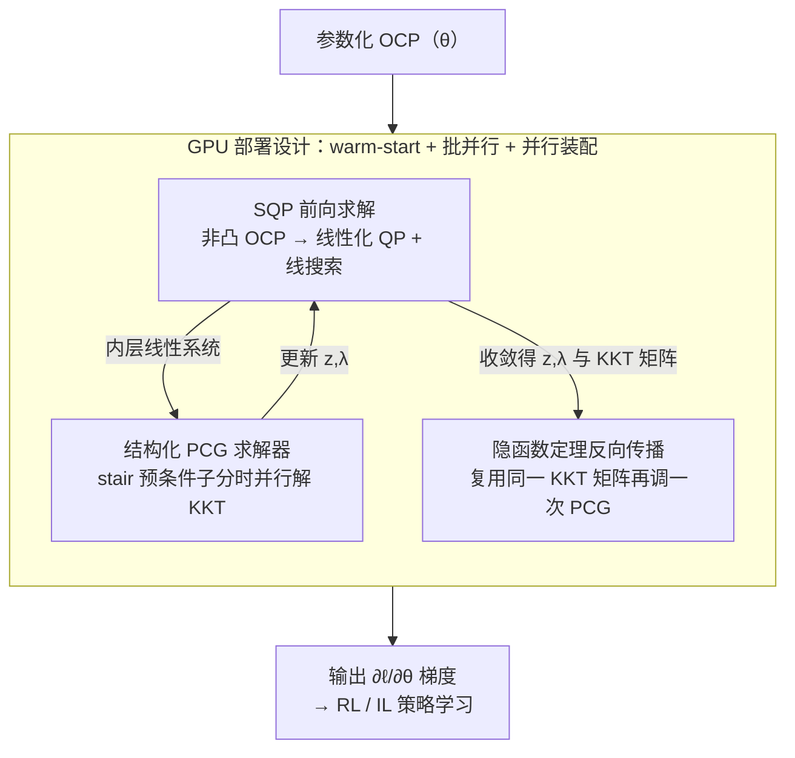

# Differentiable Model Predictive Control on the GPU

**会议**: ICLR2026  
**OpenReview**: [https://openreview.net/forum?id=bFYfV6c9zu](https://openreview.net/forum?id=bFYfV6c9zu)  
**代码**: https://github.com/ToyotaResearchInstitute/diffmpc  
**领域**: 优化 / 可微优化 / 模型预测控制  
**关键词**: 可微 MPC, GPU 并行, 序列二次规划, 预条件共轭梯度, 隐函数定理

## 一句话总结
作者提出 DiffMPC——一个把可微模型预测控制（MPC）彻底搬上 GPU 的求解器：用序列二次规划（SQP）做前向、用带 stair 预条件子的共轭梯度（PCG）在时间维上并行求解 KKT 线性系统、再用隐函数定理复用同一 KKT 矩阵算梯度，相比 mpc.pytorch / trajax / Theseus 等基线在 GPU 上取得 4–7× 提速，并用它通过强化学习自动调参，让一辆丰田 Supra 稳健地漂移穿过路面水洼。

## 研究背景与动机
**领域现状**：可微优化（differentiable optimization）把优化算法当成神经网络里的一层，让"求解器输出"成为带结构、带约束的归纳偏置——既能减少数据需求、强制满足物理约束，又能用数据自动调优化器的超参。可微 MPC 是其中应用最广的一支，覆盖运动规划、参数估计与调参、强化学习、模仿学习、端到端规控。

**现有痛点**：优化算法天生是**串行**的。最优控制问题（OCP）有"时间维稀疏"结构，主流可微求解器（如基于 iLQR 的 mpc.pytorch、trajax，或基于 Riccati 递推的方法）正是靠沿时间 $t=0,\dots,T$ 的递推来利用这个结构——可递推本质串行，在 GPU 上跑不出加速，甚至比 CPU 还慢；另一些通用可微求解器（如 Theseus）支持 GPU，却不够利用 OCP 结构，慢上几个数量级。结果是：要么 GPU 跑不快，要么结构利用不充分。

**核心矛盾**：**"利用时间稀疏结构"与"GPU 并行"之间存在张力**——传统利用稀疏结构的方式（Riccati / iLQR 递推）恰恰把计算钉死成串行，无法把时间维展开成并行；要 GPU 加速就得换一种"既利用结构又能并行"的求解路径。

**本文目标**：造一个**在 GPU 上又快又可微**的 OCP 求解器，使前向（解 OCP）和反向（对参数 $\theta$ 求梯度）都能充分并行，从而把可微 MPC 扩展到大批量、大数据、表达力更强的学习管线。

**切入角度**：作者借鉴了自家此前的 MPCGPU 工作——用一个**为 GPU 定制的 PCG 例程**来解 OCP 最优性条件导出的线性系统。PCG 虽是迭代法，但它把时间维 $t$ 暴露为可并行维度，且天然支持 warm-start，特别适合 MPC 反复重规划的场景。

**核心 idea**：用"SQP 前向 + 结构化 PCG 解 KKT 系统 + 隐函数定理反向"三件套替代 Riccati 递推，让同一套并行友好的线性求解器同时服务前向与反向，从而把可微 MPC 整体并行化到 GPU 上。

## 方法详解

### 整体框架
DiffMPC 要解并可微分一类参数化最优控制问题：

$$\text{OCP}:\ \arg\min_{z=(x,u)} \sum_{t=0}^{T} c^{x,\theta}_t(x_t) + \sum_{t=0}^{T-1} c^{u,\theta}_t(u_t)\quad \text{s.t. } f^\theta_t(x_{t+1},x_t,u_t)=0,\ x_0=x^\theta_s,$$

其中代价、等式约束（动力学）和初始条件都由参数 $\theta$ 决定——$\theta$ 可以是神经网络权重、中间层输出，或物理模型参数。整套管线分三块：**前向**用 SQP 迭代地把非凸 OCP 线性化成 QP 并解出轨迹 $z$；解 QP 的核心是把 KKT 系统化成 Schur 补、再用**结构化 PCG** 在时间维并行求解；**反向**用隐函数定理，复用前向已经算好的 KKT 矩阵，再调一次同样的 PCG 即可拿到 $\partial \ell/\partial\theta$。所有矩阵装配、PCG 迭代、线搜索都在批维和时间维上并行，并支持 warm-start，使整体在 GPU 上跑得比 CPU 递推式求解器快得多。最终 DiffMPC 是一个完全可微的策略，可直接嵌进强化学习（RL）和模仿学习（IL）。

### 关键设计

**1. SQP 前向求解：把非凸 OCP 迭代线性化成可并行的 QP**

OCP 一般非凸，作者用带线搜索的序列二次规划（SQP）逐步逼近：每一步以当前猜测 $z$ 为基准，把代价做二次近似、把动力学约束做线性化，得到一个参数化 QP——

$$\text{QP}:\min_{z}\sum_t \tfrac12 x_t^\top Q_t x_t + q_t^\top x_t + \sum_t \tfrac12 u_t^\top R_t u_t + r_t^\top u_t\quad \text{s.t. } A^+_t x_{t+1}+A_t x_t+B_t u_t=C_t,\ x_0=x_s.$$

其中 $(Q_t,q_t)$ 是代价对 $x_t$ 的二阶/一阶导、$(R_t,r_t)$ 同理对 $u_t$，$(A^+_t,A_t,B_t)$ 是动力学对 $x_{t+1},x_t,u_t$ 的雅可比——**这些矩阵在所有问题实例和所有时间步 $t$ 上并行装配**，这正是 GPU 友好性的第一来源。为保证 $(Q,R)$ 正定，把它们投影到正定锥上。解 QP 等价于找满足 KKT 条件的 $(z,\lambda)$。值得注意：和 Amos 2018、标准 SQP 一样，作者**故意忽略动力学约束的曲率**，只取代价的 Hessian 作为 $(Q,R)$，靠线搜索保证可靠下降——这样虽可能让梯度精度略降，但避免了昂贵的约束二阶导，实现简单、实践够用。线搜索本身也在多个预设步长上并行评估"代价+约束"的 merit 函数。

**2. 结构化 PCG 求解器：用 stair 预条件子把 KKT 线性系统在时间维并行求解**

这是 DiffMPC 的加速心脏。QP 的 KKT 矩阵 $\frac{\partial F}{\partial w}=\begin{bmatrix}G & H^\top\\ H & 0\end{bmatrix}$ 中，$G$ 是块对角的代价矩阵、$H$ 是带状的动力学矩阵。作者不走 Riccati 递推（串行），而是先构造 Schur 补 $S:=-HG^{-1}H^\top$、$\gamma:=d+HG^{-1}b$，把求解拆成先解 $S\lambda=\gamma$、再并行回代 $z=-G^{-1}(b+H^\top\lambda)$。关键在于 $S$ 具有块三对角结构，于是用一个**对称 stair（阶梯）预条件子** $\Phi^{-1}$（来自 Bu & Plancher 2024）：它在显著降低 $S$ 条件数的同时**保持块三对角结构**，使 PCG 的每步矩阵-向量乘都能沿时间 $t$ 并行。回代步里 $x_t,u_t$ 也按 $t$ 并行计算，例如 $u_t=-R_t^{-1}(r_t+B_t^\top\lambda_{t+1})$。PCG 虽是迭代法，但作者指出它对可微优化特别合适：① 预条件子既降条件数又留并行结构；② 天生支持 warm-start，在反复调用的 MPC 重规划中省下大量迭代。

**3. 隐函数定理反向传播：复用前向 KKT 矩阵，反向几乎"免费"**

要对 $\theta$ 求梯度，作者用隐函数定理（IFT）而非展开求解过程反传。设原-对偶解 $w=(z,\lambda)$ 满足 $F(z,\lambda,\theta)=0$，则 $\frac{\partial w}{\partial\theta}=-\big(\frac{\partial F}{\partial w}\big)^{-1}\frac{\partial F}{\partial\theta}$。机器学习里通常只需某标量损失 $\ell(z)$ 对 $\theta$ 的梯度，用向量-雅可比积（VJP）只需解**一个**线性系统：

$$\begin{bmatrix}\tilde z\\ \tilde\lambda\end{bmatrix}=\begin{bmatrix}G & H^\top\\ H & 0\end{bmatrix}^{-1}\begin{bmatrix}\partial\ell/\partial z\\ 0\end{bmatrix}.$$

**这个系统和前向解 QP 的系统是同一个 KKT 矩阵**，只是把右端 $(-b,d)$ 换成 $(\partial\ell/\partial z,0)$。因此 KKT 矩阵、Schur 补、预条件子全都在前向时已经算好并直接传给反向，反向只需把同样的结构化 PCG 再跑一次——这让反向几乎不增加额外的"装配"开销，是 DiffMPC 把前向和反向都压到 GPU 上的关键。

**4. GPU 部署设计：warm-start + 批并行 + 并行装配，串起前后向**

上面三块之所以能转化成真实的墙钟提速，靠的是一组面向 GPU 的工程取舍，它们贯穿前向与反向（对应框架图里把 SQP/PCG/IFT 包起来的子图）。① **多源并行**：每次 SQP 迭代里所有矩阵 $(Q_t,R_t,A_t,\dots)$ 和 $(S,\Phi^{-1})$ 的各块都并行装配，PCG 沿 $t$ 并行，线搜索沿步长并行；② **warm-start 与复用**：SQP 与 PCG 循环都能用上一次的解热启动，前向算好的 KKT/Schur 矩阵直接喂给反向不再重算；③ **批并行**：DiffMPC 在问题实例维上批处理，配合大 batch 训练。正是这一整套"既利用 OCP 时间稀疏、又把时间维展开成并行"的设计，让它在 GPU 上反超那些靠 Riccati 递推的求解器——后者因串行递推，在 GPU 上往往跟 CPU 差不多甚至更慢。

### 损失函数 / 训练策略
DiffMPC 作为可微策略 $\pi^\theta_{0:T}(x_0):=(u^\theta_0,\dots,u^\theta_T)$（其中 $(x^\theta_0,u^\theta_0,\dots)$ 解 OCP），可直接接入两种范式：RL 目标为最大化 $\mathbb{E}\big[\sum_{t} R(x_t,\pi^\theta(x_t))\big]$，状态由可微仿真环境推进；IL 目标为最小化 $\mathbb{E}\big[\|(\hat u_0,\dots,\hat u_T)-\pi^\theta_{0:T}(x_0)\|^2\big]$ 的均方模仿损失。相比黑盒策略，它通过动力学模型和"解 OCP"注入了物理归纳偏置；因为整套求解器为 GPU 定制，可以放心用大 batch 训练。

## 实验关键数据

### 主实验
在 JAX 中实现 DiffMPC，与三个 SOTA 可微求解器对比：Theseus（PyTorch，非线性最小二乘）、mpc.pytorch（PyTorch，iLQR）、Trajax（JAX，iLQR）。

**RL 计时（随机生成的凸 MPC 问题，batch 64、50 步、单次迭代、10 seed 平均）**：

| 求解器（设备） | 前向 (ms) | 反向 (ms) | 备注 |
|--------|------|------|------|
| **DiffMPC (GPU)** | **219** | **322** | 反向含一次前向 |
| DiffMPC (CPU) | 1326 | 2702 | CPU 上不占优 |
| mpc.pytorch (GPU) | 1909 | 4460 | Riccati 递推，GPU 提速有限 |
| trajax (GPU) | ~954 / 1828 | — | 最快基线，仍慢约 4× |
| Theseus (CPU) | >80,000 | — | 未充分利用稀疏结构 |

DiffMPC 在 GPU 上比最快基线快 **4×**；在附录其他问题（含非线性姿态镇定）上对 trajax 提速 **4–7×**。CPU 上 DiffMPC 介于 mpc.pytorch 与 trajax 之间——递推式方法更适合 CPU，印证"加速来自 GPU 并行而非单纯算法"。

**IL（cart-pole 非线性动力学，端到端训练 200 epoch）**：GPU 上 DiffMPC 比最快基线 trajax **墙钟快约 2×**，且收敛性相当（模型损失 $\|\theta-\theta^\star\|^2$ 与模仿损失同步下降）。

### 消融实验
论文未给传统"去模块"消融表，而是给出 **warm-start 增益**与**漂移调参前后对比**两组分析：

| 配置 / 项 | 关键指标 | 说明 |
|------|---------|------|
| warm-start（PCG tol $10^{-12}$） | 前/反向各 +4% | 高精度下增益温和 |
| warm-start（PCG tol $10^{-4}$） | 前 +11% / 反 +9% | 低精度/高频重规划下更明显 |
| 漂移：baseline 策略 | 成功率 70% | 手工调参，遇水洼易甩尾 |
| 漂移：RL 学得策略 | 成功率 **100%** | 后轮摩擦系数 −13%、侧偏角代价 −58% |

### 关键发现
- **加速来自 GPU 并行而非算法本身**：同一个 DiffMPC 在 CPU 上并不领先，只有上 GPU 才反超递推式求解器——印证"把时间维展开成并行"是核心。
- **warm-start 在低精度/高频场景更值钱**：tol 从 $10^{-12}$ 放宽到 $10^{-4}$，增益从 4% 升到 ~10%，对 MPC 反复重规划尤其有利。
- **学到的参数物理上合理却难手调**：RL 把后轮摩擦系数非对称地降 13%、侧偏角跟踪代价降 58%，用"牺牲侧偏跟踪换抗水洼鲁棒"换来更稳的漂移，这种非对称取舍人工很难凑出。
- **仿真到实车可迁移**：仅在 figure-8 轨迹上训练，学得策略无需额外调参就迁移到画圆/donut 漂移，并在真实丰田 Supra 上穿水洼成功，靠的正是 MPC 的归纳偏置。

## 亮点与洞察
- **"换求解路径"而非"换硬件"**：洞察到 Riccati 递推天生串行才是 GPU 加速的拦路虎，于是改用 Schur 补 + 结构化 PCG 把时间维变成并行维——这是把可微 MPC 搬上 GPU 的真正关键，思路可迁移到任何"带时间/链式稀疏结构"的可微优化层。
- **前向与反向共享同一 KKT 矩阵**：因为 IFT 的反向线性系统和前向 QP 的 KKT 矩阵完全相同，前向算好的矩阵直接复用，反向几乎只剩一次 PCG——这是"可微优化层"工程上一个非常划算的复用。
- **stair 预条件子兼顾"降条件数"与"留并行结构"**：一般预条件会破坏稀疏/并行结构，这里的对称 stair 预条件子两者兼得，是 PCG 能在 GPU 上跑出优势的支点。
- **真实极限工况的落地**：在"漂移穿水洼"这种不稳定、易甩尾、需要大 batch 域随机化才能稳健训练的任务上验证，恰好暴露出"为什么需要 GPU 大批量"，把方法动机和应用绑得很紧。

## 局限与展望
- **不等式约束支持弱**：当前只能把不等式约束罚进代价、或把控制边界塞进动力学；作者承认用增广拉格朗日/内点法会更可靠，但可微分穿过这类约束很难，梯度在约束边界处可能不连续。
- **CPU 上不占优**：因为为 GPU + JAX 定制，CPU 上比递推式方法慢；改写成 C/C++ 能提速，但 CPU 场景 Riccati 递推可能仍更优。
- **缺求解器超参的可微调**：不显式支持调最大迭代数、PCG 容差等超参，尽管批并行能力或许有助于扫这些超参。
- **对初始猜测敏感**：解和参数的初值差时求解器可能发散，拖累下游训练管线，作者把"鲁棒初始化"列为未来工作。
- **梯度精度的取舍**：忽略动力学曲率（只取代价 Hessian）虽简化实现，但会让梯度精度有所下降，对某些对梯度质量敏感的任务可能是隐患。

## 相关工作与启发
- **vs mpc.pytorch / trajax（iLQR + Riccati 递推）**：它们也利用 OCP 时间稀疏、也支持 GPU，但靠沿 $t$ 的 Riccati 递推，本质串行，需要很大 batch 才在 GPU 上见效；DiffMPC 用 PCG 避开递推，在中等 batch 下也能 4–7× 提速，且支持 warm-start 跨实例复用。
- **vs Theseus（通用可微求解器）**：通用器支持 GPU、适用面广，但不充分利用 OCP 结构，按 Wan 2024 那样 rollout 控制输入解 OCP 会慢上几个数量级（CPU 上 >80s）。DiffMPC 是 OCP 专用、结构利用充分。
- **vs MPCGPU（Adabag 2024）**：DiffMPC 直接复用其 GPU 友好的 PCG 例程，但 MPCGPU 本身**不可微**、不提供对参数的灵敏度；DiffMPC 在其上补齐了基于 IFT 的反向，把"快"与"可微"合二为一。
- **vs Frey 2025 等精确可微 NMPC**：那类方法在反向中考虑约束曲率、KKT 矩阵不同，梯度更精确但实现更重、二阶导昂贵；DiffMPC 走 Amos 2018 的近似路线（忽略曲率 + 线搜索），牺牲一点梯度精度换实现简单与速度。

## 评分
- 新颖性: ⭐⭐⭐⭐ 不是全新算法组件，但"用结构化 PCG 替代 Riccati 递推把可微 MPC 整体并行化到 GPU"的系统性组合很扎实，且真机验证有说服力。
- 实验充分度: ⭐⭐⭐⭐ 覆盖 RL/IL 计时、warm-start、域随机化漂移到真实 Supra，多基线多问题；但缺标准"去模块"消融、不等式约束场景未测。
- 写作质量: ⭐⭐⭐⭐ 公式与算法框图清晰，前后向数据流讲得明白；部分实现细节散落附录。
- 价值: ⭐⭐⭐⭐⭐ 开源工具，直接把可微 MPC 的训练吞吐拉高数倍，对学习+控制结合的研究与落地都很实用。

<!-- RELATED:START -->

## 相关论文

- [\[ICLR 2026\] Difference Predictive Coding for Training Spiking Neural Networks](difference_predictive_coding_for_training_spiking_neural_networks.md)
- [\[ICLR 2026\] Multilevel Control Functional](multilevel_control_functional.md)
- [\[ICLR 2026\] Predictive Differential Training Guided by Training Dynamics](predictive_differential_training_guided_by_training_dynamics.md)
- [\[ICLR 2026\] Gradient-Based Diversity Optimization with Differentiable Top-$k$ Objective](gradient-based_diversity_optimization_with_differentiable_top-k_objective.md)
- [\[ICLR 2026\] A Schrödinger Eigenfunction Method for Long-Horizon Stochastic Optimal Control](a_schrödinger_eigenfunction_method_for_long-horizon_stochastic_optimal_control.md)

<!-- RELATED:END -->
