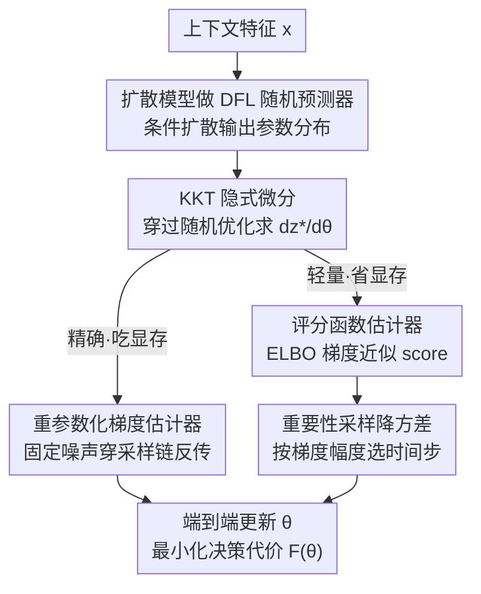

# Diffusion-DFL: Decision-focused Diffusion Models for Stochastic Optimization

**会议**: ICLR2026  
**OpenReview**: [https://openreview.net/forum?id=uhv3f80jmG](https://openreview.net/forum?id=uhv3f80jmG)  
**代码**: https://github.com/GT-KOALA/Diffusion_DFL  
**领域**: 决策聚焦学习 / 随机优化  
**关键词**: 决策聚焦学习, 扩散模型, 随机优化, 评分函数估计, 重参数化

## 一句话总结
这篇论文首次把扩散模型塞进决策聚焦学习（DFL）框架，用条件扩散模型刻画不确定参数的完整分布、再用从分布采样的样本求解随机优化，并给出两套端到端梯度算法——精确但吃显存的重参数化估计器，和用 ELBO 梯度近似评分函数、显存从 60.75 GB 砍到 0.13 GB 的轻量评分函数估计器；在三个真实优化任务上决策质量稳定超过所有基线。

## 研究背景与动机
**领域现状**：很多现实决策（库存订货、电力调度、投资组合）都是"先预测未知参数、再据此优化决策"。传统做法是 predict-then-optimize 两阶段流水线：先用 MSE 之类的损失训一个预测器，再把点预测喂给求解器。决策聚焦学习（DFL）则把预测和优化拧成一个端到端目标，直接以"最终决策代价最低"为训练信号，往往能拿到更低的 regret。

**现有痛点**：几乎所有现有 DFL 方法都依赖**确定性点预测**——对未知参数 $y^*$ 只给一个标量/向量估计。可现实里参数本身就带强随机性、还常是多峰分布。用点预测会让模型过度自信，决策质量下降。论文用一张图说明：在风险厌恶的代价函数下，任何确定性解都会落到可行域**边界**（极端决策），期望代价更高；而随机优化解落在**内部**，把各种可能结果的代价平均掉，期望代价更低。

**核心矛盾**：要刻画不确定性，就得有一个**表达力足够强**的随机预测器去拟合复杂/多峰分布；但表达力强的生成模型（如扩散）采样是多步序列过程，端到端反传梯度会贵到不可行。表达力 vs 可微训练成本之间存在直接冲突。已有的随机化尝试（如 Gen-DFL 用 normalizing flow）受限于双射网络结构，表达力被卡死；而把封闭形式评分函数用于 DFL 的工作（Silvestri et al.）又要求评分能写成解析式——扩散模型恰恰没有封闭形式的评分。

**本文目标**：(1) 让 DFL 的预测器变成能表达多峰分布的扩散模型；(2) 解决"穿过扩散采样链反传梯度"的显存与计算瓶颈。

**核心 idea**：用条件扩散模型当 DFL 的随机预测器，把决策问题写成对扩散分布求期望的随机优化；再把"对扩散输出求梯度"这件事，从逐步反传改写成一个**评分函数（log-likelihood 对参数的梯度）**，并用扩散模型自带的 ELBO 训练损失的梯度去近似这个评分，从而绕开穿过采样链的反传。

## 方法详解

### 整体框架
方法要解决的是：给定上下文特征 $x$，预测未知参数 $y$ 的**分布**而非点值，再让"求随机优化得到的决策"端到端地最小化决策代价 $F(\theta)=\mathbb{E}_{(x,y^*)}[f(y^*, z^*_\theta(x))]$。

整条链路是：上下文 $x$ → 条件扩散模型 $P_\theta(\cdot\mid x)$ 输出参数分布 → 从分布采样若干 $y$，求解带约束的随机优化 $z^*_\theta(x)=\arg\min_z \mathbb{E}_{y\sim P_\theta}[f(y,z)]$ s.t. $Gz\le h, Az=b$ → 算出决策代价 $F(\theta)$ → 反传更新扩散参数 $\theta$。

难点全在最后一步的反传：决策 $z^*_\theta$ 由一个**嵌套优化**隐式定义，链式法则里的 $\mathrm{d}z^*_\theta/\mathrm{d}\theta$ 要通过对定义 $z^*_\theta$ 的 KKT 系统隐式微分得到（Amos & Kolter），而 KKT 里又含对扩散分布求期望的项 $\mathbb{E}_{y\sim P_\theta}[\nabla_z f]$，其对 $\theta$ 的依赖藏在分布里。论文给两条算法处理这个分布梯度：**重参数化估计器**（精确、贵）和**评分函数估计器**（近似、便宜），后者再配一套**重要性采样降方差**才稳定可用。

### 关键设计

**1. 用条件扩散模型当 DFL 的随机预测器：把点预测换成完整分布**

针对"点预测无法表达多峰不确定性"这个痛点，论文把 DFL 优化层的输入从确定性 $y_\theta(x)$ 换成一个概率模型 $P_\theta(\cdot\mid x)$，决策变成求解随机优化 $z^*_\theta(x)=\arg\min_z \mathbb{E}_{y\sim P_\theta(\cdot\mid x)}[f(y,z)]$。$P_\theta$ 选用条件扩散模型（Tashiro et al. 的 CSDI 式条件化），每一步转移概率都条件在 $x$ 上。相比 Gaussian DFL 只能表达单峰，扩散模型靠"固定加噪链 + 学习去噪链"能拟合多峰、高维的复杂分布——这正是论文反复强调的优势来源：股票组合任务里 Gaussian DFL 只有 0.10% 回报，而扩散 DFL 能到约 4%，差距几乎全来自分布表达力。

**2. 重参数化估计器：固定噪声、把扩散采样变成 θ 的确定性函数**

这是把"分布梯度"做精确的第一条路。利用重参数化技巧（Kingma & Welling），把一个样本写成基础高斯噪声的可微变换 $y=R(\epsilon,\theta\mid x)$，$\epsilon\sim P(\epsilon)$，于是扩散采样对 $\theta$ 可微：
$$\nabla_\theta\,\mathbb{E}_{y\sim P_\theta(\cdot\mid x)}[f(y,z)]=\mathbb{E}_{\epsilon\sim P(\epsilon)}\big[(\nabla_\theta R(\epsilon,\theta\mid x))^\top\nabla_y f(y,z)\big].$$
把这个梯度塞进 KKT 系统求解 $\mathrm{d}z^*_\theta/\mathrm{d}\theta$，再乘 $\mathrm{d}F/\mathrm{d}z^*_\theta$ 得到总梯度（论文式 5，含 Hessian $H$、约束矩阵 $G,A$ 与对偶变量构成的块矩阵求逆）。它无偏、精确，但**致命缺点**是要穿过整条扩散采样链（可能 1000 步）反传、全程跟踪梯度，显存和计算开销巨大（实测约 60 GB），还容易不稳定。

**3. 评分函数估计器：用 ELBO 梯度近似 score，绕开穿采样链反传**

这是论文真正的"减负"贡献。核心是用 log-derivative trick（log-trick）把"对期望求梯度"改写成"评分函数的期望"：
$$\nabla_\theta\,\mathbb{E}_{y\sim P_\theta(\cdot\mid x)}[f(y,z)]=\mathbb{E}_{y\sim P_\theta(\cdot\mid x)}\big[f(y,z)\cdot\nabla_\theta\log P_\theta(y\mid x)\big].$$
这样只需对最终的 log-likelihood 求梯度，不必逐步穿采样链微分。难点是 $\nabla_\theta\log P_\theta(y\mid x)$ 没有封闭形式（$P_\theta$ 是积掉整条扩散轨迹后的边缘概率）。论文的关键近似是**用扩散模型 ELBO 训练损失的梯度当评分的代理**：$\nabla_\theta\log P_\theta(y_0\mid x)\approx\nabla_\theta\,\mathrm{ELBO}(y_0\mid x;\theta)$。而 ELBO 正好退化成 DDPM 那个简单的去噪 MSE $\mathbb{E}_{t,y_0,\epsilon_t}[\lVert\epsilon_t-\epsilon_\theta(y_t,t)\rVert^2]$，一次前向加噪即可评估。论文还给了 Proposition 5.1：近似误差被 $\sqrt{2}B(\theta,y_0)\sqrt{\mathrm{KL}(q(y_{1:T}\mid y_0)\Vert p_\theta(y_{1:T}\mid y_0))}$ 上界——只要扩散反向过程拟合得好（KL 小），ELBO 梯度就接近真 score。实践中先采一个最终输出 $y$，再随机抽 $k\ll T$ 个时间步跑前向加噪算 ELBO 梯度即可。最终把总梯度写成**重要性加权形式**（式 10）：$\frac{\mathrm{d}F}{\mathrm{d}\theta}\approx\frac{\mathrm{d}}{\mathrm{d}\theta}\mathbb{E}_y[\,\mathrm{detach}[w_\theta(y)]\cdot\mathrm{ELBO}(y\mid x,\theta)\,]$，把重要性权重 $w_\theta(y)$ 做 stop-gradient、只对 ELBO 求梯度，整个反传被封装成一个 PyTorch autograd 模块（前向返回最优决策 $z^*,\lambda^*,\nu^*$，反向返回 $\mathrm{d}F/\mathrm{d}\theta$）。

**4. 时间步重要性采样：给只用几步评分带来的高方差降噪**

只采少数几个时间步算评分会引入很高方差，让训练不稳。论文沿用 Improved DDPM（Nichol & Dhariwal）的时间步重要性采样：不再均匀采时间步，而是按概率 $p_t\propto\sqrt{\mathbb{E}[\lVert\nabla_\theta\mathrm{ELBO}_t\rVert^2]}$ 采样、再用 $1/p_t$ 加权：
$$\nabla_\theta\mathrm{ELBO}_{\mathrm{IS}}=\mathbb{E}_{t\sim p_t}\Big[\frac{\nabla_\theta(\mathrm{ELBO}_t)}{p_t}\Big],\quad \sum_t p_t=1.$$
这保持估计器无偏，但把方差压到最小。直观上它给梯度大的早期时间步**更少**权重、给后期时间步更多权重，从而抹平梯度幅度的不均。消融显示加上它后学习曲线明显更稳。

### 损失函数 / 训练策略
训练目标就是决策代价的期望 $F(\theta)=\mathbb{E}_{(x,y^*)}[f(y^*,z^*_\theta(x))]$，端到端反传更新扩散参数 $\theta$；梯度由上面两套估计器之一提供。评分函数路线下，每次更新只需 $k$ 个（甚至 10～50 个）样本/时间步的一步前向加噪，配合时间步重要性采样稳定收敛。约束（$Gz\le h, Az=b$）通过 KKT 隐式微分进入梯度，决策始终满足可行性。

## 实验关键数据

### 主实验
三个任务：合成产品分配（风险厌恶代价 $f=\exp(-y^\top z)$，多峰高斯混合）、24 小时电力调度（非对称缺额/超额线性代价 + 二次跟踪 + 爬坡约束，8 年 PJM 电网数据）、S&P 500 股票组合（均值-方差权衡，2004–2017 数据）。指标含预测 RMSE 与真正关心的决策任务损失/收益。

| 任务 | 指标 | Diffusion DFL（本文） | Gaussian DFL | 确定性 DFL | 两阶段最好 |
|------|------|------|------|------|------|
| 合成产品分配 | Task↓ | **0.362**（SF）/ 0.365（Reparam） | 1.132 | 1.987 | 0.393（Diffusion TS） |
| 电力调度 | Task↓ | **3.152**（Reparam）/ 3.171（SF） | 3.724 | 4.324 | 5.580（Gaussian TS） |
| 股票组合 | Task(%)↑ | **4.17%**（Reparam）/ 3.98%（SF） | 0.14% | 0.07% | 0.13%（Diffusion TS） |

本文两个扩散 DFL 变体在三个任务上都拿下最佳与次佳，显著超过所有基线。

### 消融实验

| 配置 | 关键指标 | 说明 |
|------|---------|------|
| Reparameterization | 决策质量最高，**~60 GB 显存** | 穿全部扩散步反传，精确但极贵 |
| Score Function（50 样本） | 与 Reparam 测试损失差 <0.02，**~0.13 GB 显存** | 显存少一个数量级，决策质量几乎持平 |
| Score Function（10 样本） | 略差但仍超确定性基线 | 极少样本也够用 |
| SF 均匀采时间步 | 梯度高方差、训练不稳 | 暴露降方差必要性 |
| SF + 时间步重要性采样 | 学习曲线明显更稳 | 无偏 + 最小方差 |

### 关键发现
- **评分函数是性价比之王**：显存从 60.75 GB → 0.13 GB（少约一个数量级），决策质量却与重参数化几乎持平（差 <0.02），让扩散 DFL 在复杂问题上真正可落地。
- **随机 > 确定**：建模不确定性在每个任务都赢过确定性 DFL，股票组合最夸张（0.07% → ~4%）。
- **扩散 > 高斯**：表达多峰分布的能力是决策质量的核心来源，Gaussian DFL 因单峰假设吃亏。
- **离线上下文 bandit 是强基线但仍输**：它直接优化下游目标、能在调度/组合任务上超两阶段，但因忽略优化约束、不能利用已知优化结构，整体不及 Diffusion-DFL。

## 亮点与洞察
- **把"穿扩散采样链反传"换成"对 ELBO 求一次梯度"**：log-trick + ELBO 代理评分这套组合，是显存暴降的关键，且有 KL 上界做理论背书，不是纯工程 hack。
- **重要性加权 + stop-gradient 的工程化**：把复杂的 KKT 总梯度封装成一个即插即用的 PyTorch autograd 模块，前向给决策、反向给梯度，复用性强，可迁移到其他"随机优化 + 生成式预测器"的场景。
- **首次打通 diffusion × predict-then-optimize**：之前扩散在组合优化/黑盒优化里有用，但没人把它端到端嵌进 DFL，这条路线为"不确定性建模 + 决策"提供了新范式。
- **时间步重要性采样的复用**：直接借 Improved DDPM 的降方差技巧解决评分估计的高方差，是个漂亮的跨领域搬运。

## 局限与展望
- **仍依赖可微/凸优化层**：决策梯度走 KKT 隐式微分，主文只覆盖仿射约束（附录提到可扩展到一般凸约束），更一般的非凸/组合优化求解器未必直接适用。
- **评分估计是有偏近似**：ELBO 梯度代理评分的误差受 KL 项控制，当扩散反向过程拟合差（KL 大）时近似可能退化，论文未充分压力测试这种情形。
- **任务规模与多样性有限**：三个任务维度都不算大（合成 $d=10$、调度 24 维、组合 50 资产），更高维、更强非平稳的真实决策系统上的表现待验证。
- **改进方向**：把评分函数估计器推广到非凸求解器、自适应选择采样时间步数 $k$、以及与更先进的快速采样扩散（少步采样）结合进一步压成本。

## 相关工作与启发
- **vs Gen-DFL（Wang et al. 2025，normalizing flow 预测器）**：两者都想给 DFL 引入随机预测器，但 flow 需要双射网络、表达力受限；本文用扩散模型表达力更强，能拟合多峰分布，决策质量更高。
- **vs Silvestri et al. 2026（封闭形式评分扩展 DFL 到不可微求解器）**：他们要求评分有解析式，而扩散模型评分无封闭形式；本文用 ELBO 梯度做代理并给出近似误差界，把评分函数路线推广到了扩散这种隐式似然模型。
- **vs 确定性 DFL（Donti et al. 2017 等）**：经典 DFL 端到端优化决策但只用点预测，在高维、风险敏感场景下表现挣扎；本文用完整分布替代点预测，直接修这个表达力短板。
- **vs 离线上下文 bandit（Brandfonbrener et al. 2021）**：bandit 直接学 context→action 策略、能超两阶段，但忽略优化约束、不利用已知优化结构；本文把生成模型与下游求解器耦合，能更好刻画复杂决策分布。

## 评分
- 新颖性: ⭐⭐⭐⭐⭐ 首个把扩散模型端到端嵌进 DFL，并给出 ELBO 代理评分这条降本路线 + 理论界。
- 实验充分度: ⭐⭐⭐⭐ 三个真实任务 + 显存/方差消融充分，但任务规模偏小、非凸场景未覆盖。
- 写作质量: ⭐⭐⭐⭐ 动机用图讲清、两套估计器推导清晰，部分图表在缓存里有乱码但正文自洽。
- 价值: ⭐⭐⭐⭐⭐ 把扩散 DFL 从 60 GB 砍到 0.13 GB，让"分布感知决策"真正可落地。

<!-- RELATED:START -->

## 相关论文

- [\[ICLR 2026\] NExCO: Native Solution Expansion for Diffusion-based Combinatorial Optimization](nexco_native_solution_expansion_for_diffusion-based_combinatorial_optimization.md)
- [\[CVPR 2026\] Learning to Learn Weight Generation via Local Consistency Diffusion](../../CVPR2026/optimization/learning_to_learn_weight_generation_via_local_consistency_diffusion.md)
- [\[CVPR 2026\] DABO: Difficulty-Aware Bayesian Optimization with Diffusion-Learned Priors](../../CVPR2026/optimization/dabo_difficulty-aware_bayesian_optimization_with_diffusion-learned_priors.md)
- [\[NeurIPS 2025\] MDNS: Masked Diffusion Neural Sampler via Stochastic Optimal Control](../../NeurIPS2025/optimization/mdns_masked_diffusion_neural_sampler_via_stochastic_optimal_control.md)
- [\[ICLR 2026\] Faster Gradient Methods for Highly-Smooth Stochastic Bilevel Optimization](faster_gradient_methods_for_highly-smooth_stochastic_bilevel_optimization.md)

<!-- RELATED:END -->
