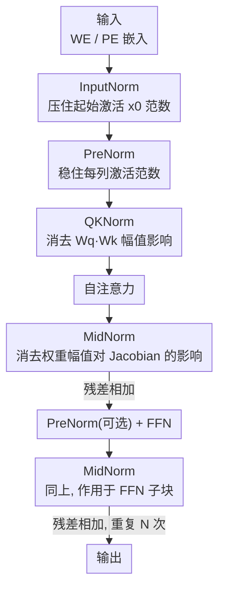

# DNT: a Deeply Normalized Transformer that can be trained by Momentum SGD

**会议**: ICLR2026  
**OpenReview**: [https://openreview.net/forum?id=62pn18XmAg](https://openreview.net/forum?id=62pn18XmAg)  
**代码**: 待确认  
**领域**: optimization  
**关键词**: Transformer 优化, 动量 SGD, 归一化, 重尾梯度, Jacobian 分析  

## 一句话总结
本文从 Jacobian 矩阵分析出发，弄清了 Transformer 训练时"重尾梯度"的来源，并通过在合适位置加 / 调归一化算子（InputNorm + PreNorm + QKNorm + MidNorm）重新设计出 DNT 架构，使得用最朴素的动量 SGDW 就能训练，效果与 AdamW 持平（ImageNet 81.5% vs 82.1%，OpenWebText val loss 2.849 vs 2.863），同时省下优化器一半的显存。

## 研究背景与动机
**领域现状**：Transformer 已是现代深度学习的事实标准骨干，但训练它几乎离不开 Adam / AdamW 这类带自适应学习率的高级优化器。经典的 SGD 及其动量变体（momentum SGD，mSGD）在训练 Transformer 时通常明显逊色，因此即便 Adam 的优化器状态比 mSGD 多占一倍显存（一阶 + 二阶动量），大模型与多模态模型仍普遍用它。

**现有痛点**：mSGD 省显存、机制简单，但训不好 Transformer。已有研究（Simsekli et al. 2019；Zhang et al. 2020）指出根因在于 Transformer 的随机梯度呈**重尾分布**——梯度各元素的幅值跨度极大，更新权重时各分量"步调不一致"。Adam 之所以鲁棒，正是因为它用一阶项除以二阶项的平方根做了逐元素归一化，自然压住了重尾；而 mSGD 直接拿带动量的一阶梯度更新，无力应对这种幅值悬殊。

**核心矛盾**：问题表面在"优化器"，根子却在"架构"。论文把梯度回传写开后发现，重尾的真正来源是各层 **Jacobian 矩阵 $\frac{\partial x_{l+1}}{\partial x_l}$ 的奇异值过于离散**（条件数过大）——它由权重矩阵的奇异值分布和激活的幅值范围共同决定。既然如此，与其换更复杂的优化器去"事后救火"，不如直接在架构里约束 Jacobian，让梯度天生就集中。

**本文目标**：能不能让 mSGD 在 Transformer 上达到 Adam 的水平？在什么条件下能？分解为两个子问题：(1) 重尾梯度的根因到底是什么；(2) 如何用归一化去针对性地驯服 Jacobian。

**切入角度**：作者不发明新归一化，而是逐一推导 InputNorm / PreNorm / MidNorm / PostNorm / QKNorm 这五种**位置不同**的归一化各自如何作用于 Jacobian——哪个压权重幅值、哪个压激活范数、哪个压 $W_q^\top W_k$ 的联合影响——再把"有益"的几种组装起来。

**核心 idea**：把归一化算子"放对位置"来逐项约束 Jacobian 矩阵，使梯度分布集中、摆脱重尾，从而让朴素 mSGDW 训练 Transformer 也能比肩 AdamW——这就是 Deeply Normalized Transformer（DNT）。

## 方法详解

### 整体框架
DNT 的出发点是一个被严格写开的事实：对前向层 $x_l = W^l x_{l-1}$，权重梯度满足

$$\frac{\partial L}{\partial W^l} = \frac{\partial L}{\partial x_{l+1}}\frac{\partial x_{l+1}}{\partial x_l} x_{l-1\top},$$

因此**梯度是否重尾，取决于 Jacobian $\frac{\partial x_{l+1}}{\partial x_l}$ 的奇异值是否离散**。奇异值离散有两个来源：权重矩阵本身奇异值跨度大；激活幅值跨度大。要压住重尾，就要分别约束"权重的幅值影响""激活的范数影响""二者的联合影响"。DNT 的做法就是把四种归一化放到 Transformer 里的对应位置，各管一摊。

整条前向流是：词/图块嵌入（WE/PE）→ **InputNorm**（驯住起始激活 $x_0$ 的范数）→ 堆叠 $N$ 个 block，每个 block 内先 **PreNorm** → 带 **QKNorm** 的自注意力 → **MidNorm** → 残差相加，再（可选 PreNorm）→ FFN → **MidNorm** → 残差相加 → 重复 $N$ 次后输出。注意 DNT **刻意不用 PostNorm**（放在残差块之后的归一化），因为它对激活范数过于敏感、易引发训练不稳定。视觉版叫 V-DNT（用 patch embedding），语言版叫 L-DNT（用 word embedding + 注意力掩码）。

### 关键设计

**1. InputNorm：把起始激活 $x_0$ 的范数钉在合理区间**

Transformer 的残差结构展开后，第 $l$ 层激活 $x_{l+1} = x_0 + f(x_0) + \cdots + f(x_l)$；在高维"近似正交"假设下其范数满足 $\|x_{l+1}\|_2 \asymp \sqrt{\|x_0\|_2^2 + \|f(x_0)\|_2^2 + \cdots}$。也就是说**起始项 $\|x_0\|_2^2$ 会被一路携带进每一层**。而归一化层的 Jacobian $\frac{\partial \mathrm{RMSN}(x)}{\partial x} = \frac{\sqrt{d}}{\sqrt{\|x\|_2^2+\epsilon}}\mathrm{diag}(\gamma)\big(I - \frac{xx^\top}{\|x\|_2^2+\epsilon}\big)$ 里有个 $\frac{1}{\|x\|_2}$ 的因子：$x_0$ 太大→后续各层梯度被压成消失，$x_0$ 太小→梯度爆炸（Proposition 1）。InputNorm 就是在嵌入之后、进入主干之前先做一次归一化把 $x_0$ 的范数限定住，从源头切断这条"范数传染链"。这也是 DNT 区别于 nGPT 的关键之一——nGPT 用很多 PostNorm 却没有 InputNorm。

**2. PreNorm：在自注意力前稳住激活列范数，间接稳住 $W_q,W_k,W_v$ 的梯度**

自注意力 $Y = W_v X A$ 对输入 $X$ 的 Jacobian（式 5）非常依赖各列 $x_j$ 的范数。PreNorm 把每列缩放为 $x_j' = \alpha_j x_j$（$\alpha_j$ 是归一化标量），论文证明（Proposition 2）：在相同 $W_q,W_k,W_v$ 下，注意力对 $X$ 和对归一化后 $X'$ 的 Jacobian 完全相同，即归一化把"列范数"这个扰动因子从 Jacobian 里消掉了。范数稳→Jacobian 稳；又因为 $W_q,W_k,W_v$ 的梯度都直接含 $X$，激活列范数被稳住后，这三个投影矩阵的梯度也随之稳定。这正是 PreNorm 不能被 QKNorm 替代的原因：QKNorm 管不到 $W_v$，而 $W_v$ 的梯度同样受 $X$ 影响。

**3. QKNorm：消去 $W_q,W_k$ 幅值的联合影响，避免注意力坍塌**

把 QKNorm 加在 query / key 上：$q_i' = \sqrt{d_h}\,\mathrm{diag}(\gamma_q)\frac{W_q x_i}{\|W_q x_i\|_2}$，key 同理。推导 logit 项 $P_{ij}' = q_i'^\top k_j'$ 对输入的梯度（式 11）后得到 Proposition 5：在高维随机假设下，$\frac{\partial P_{ij}'}{\partial x}$ **与 $W_q,W_k$ 的幅值无关**。这一点很关键——训练中 $W_q^\top W_k$ 的最大奇异值会快速膨胀，被认为是 rank collapse / entropy collapse / 谱能量集中（model crash）的根因；QKNorm 把这个联合幅值因子从梯度里剥掉，从而压住模型崩溃的风险。但它只管 $W_q,W_k$，所以仍需 PreNorm 来联合处理含 $W_v$、且依赖 $X$ 的部分。

**4. MidNorm（兼论为何弃用 PostNorm）：让子块 Jacobian 只看权重"形状"不看"幅值"**

MidNorm 放在自注意力 / FFN 输出之后、残差相加之前。以 FFN 为例 $z = W_2\,\mathrm{ReLU}(W_1 x)$，接 RMSNorm 后整段 Jacobian（式 7）中关键项 $M = \frac{W_2\,\mathrm{diag}(\mathbb{1}(W_1x>0))W_1}{\|W_2\mathrm{ReLU}(W_1x)\|_2}$。Proposition 3 证明：高维随机下 $M$ 的奇异值只与 $W_1,W_2$ 的**形状**有关，而与其**幅值**无关——也就是说哪怕 $W_1,W_2$ 的范数训得很大，也不会因此放大梯度。注意力子块里 $W_v,W_o$ 与 $W_1,W_2$ 角色相同，同样被 MidNorm 覆盖。相对地，PostNorm（放在残差块之后）对输入范数极其敏感（Proposition 4）：经典 Transformer 训练后 $\sigma_1(W_1),\sigma_1(W_2)$ 常涨到上千，使 $\|f(x;W)\|_2$ 巨大、$z_{l+1}$ 巨大，PostNorm 在此会直接造成梯度消失。所以 DNT 用 MidNorm 在"进残差之前"就把权重幅值的影响消化掉，并整体弃用 PostNorm 以换取训练稳定。

> ⚠️ 论文不主张发明了新的归一化，只主张"把已有归一化放对位置 + 给出每个位置的 Jacobian 理论解释"。四种归一化各管一项扰动因子（$x_0$ 范数 / 激活列范数 / $W_qW_k$ 联合幅值 / 子块权重幅值），合起来才把 Jacobian 的奇异值整体压平、让梯度集中。

### 损失函数 / 训练策略
没有改动目标函数，纯架构改造。训练用 PyTorch + bfloat16 + A800，余弦学习率，动量系数默认 $\mu=0.90$。视觉用 timm 实现的 ViT-Large(307M)/ViT-Huge(632M)，语言用 nanoGPT 的 GPT2-Small(124M)/GPT2-Large(774M)。作者强调学习率基本沿用前作（Karpathy 2022；Sophia）未精调，认为调参还能再涨。

## 实验关键数据

### 主实验
两种架构（ViT/GPT2 vs V-DNT/L-DNT）× 两种优化器（AdamW vs mSGDW）的交叉对比。核心结论：**DNT 让 mSGDW 追平 AdamW，而标准 Transformer 用 mSGDW 会明显掉队**。

| 任务 / 规模 | AdamW + 标准 | AdamW + DNT | mSGDW + 标准 | mSGDW + DNT |
|------|------|------|------|------|
| ImageNet Acc↑ (307M) | 81.7 | 82.1 | 78.2 | **81.5** |
| ImageNet Acc↑ (632M) | 80.8 | 81.9 | 73.5 | **81.2** |
| OpenWebText Loss↓ (124M) | 2.867 | 2.863 | 2.906 | **2.849** |
| OpenWebText Loss↓ (774M) | 2.492 | 2.481 | 2.544 | **2.503** |
| OpenWebText Loss↓ (1436M) | 2.435 | 2.396 | 2.472 | 2.408 |

mSGDW 训标准 ViT-Huge 只有 73.5%，换成 V-DNT 直接拉到 81.2%（+7.7），且超过 AdamW 训标准 ViT-Huge 的 80.8%。梯度可视化（Fig.1）显示标准 ViT 各权重梯度幅值散布在 $[0,10^{-4}]$ 的长尾里，V-DNT 集中在 $[0,10^{-5}]$，直观印证"重尾被压平"。

### 显存对比

| | AdamW(仅优化器) | mSGDW(仅优化器) | DNT+AdamW(模型+优化器) | DNT+mSGDW |
|------|------|------|------|------|
| 1.4B 模型显存 | 11.5 GB† | 5.7 GB† | ≈67 GB‡ | ≈61 GB‡ |

mSGDW 优化器状态只需一份动量，理论上比 AdamW 省一半；1.4B 模型实测省约 6GB（†理论值，‡实测值）。

### 消融实验
五种设置全部用 mSGDW 训练，逐步加归一化：

| 设置 | 配置 | 关键发现 |
|------|------|------|
| S1 | 标准 PreNorm | 两任务均最差（mSGDW 训不动标准 Transformer） |
| S2 | S1 + QKNorm | 与 S1 接近，单加 QKNorm 提升有限 |
| S3 | S2 + InputNorm | 明显改善；ImageNet 上甚至最好 |
| S4 | 2×PreNorm + MidNorm + QKNorm + InputNorm | OpenWebText 最佳 |
| S5 | 1×PreNorm(SA前) + MidNorm + QKNorm + InputNorm | 与 S4 相当（故默认弃用第二个 PreNorm） |

### 关键发现
- **InputNorm 贡献突出**：从 S2 到 S3 只加 InputNorm 就跳了一大档，呼应 $x_0$ 范数会"传染"全网的理论。
- **第二个 PreNorm 可省**：S4 与 S5 几乎一样，所以 DNT 默认只在自注意力前留一个 PreNorm、FFN 前的那个设为可选。
- **单项归一化不够**：S2 单加 QKNorm 几乎没用，必须四种组合（每种各压一类扰动因子）才能整体压平 Jacobian。

## 亮点与洞察
- **把"换优化器"问题转化为"改架构"问题**：核心洞察是 mSGD 训不好 Transformer 并非优化器无能，而是架构让梯度重尾；只要架构把 Jacobian 奇异值压平，简单优化器就够用——这是个很解气的视角转换。
- **逐位置的 Jacobian 理论账**：五种归一化各配一条 Proposition，清楚说明"哪种归一化消掉了哪个扰动因子"（$x_0$ / 激活列范数 / $W_qW_k$ / 子块权重幅值），不是经验堆砌而是可推导的设计，迁移性强。
- **PostNorm 的"反面教材"价值**：通过 $\sigma_1(W)$ 会涨到上千→PostNorm 必然梯度消失的分析，给"为什么近年模型多弃 PostNorm"补了一个干净的理论解释。
- **可迁移的 trick**：QKNorm 压 $W_q^\top W_k$ 膨胀来防 model crash、InputNorm 防范数传染，这两点可直接搬去任何 Transformer 训练稳定性工程，与是否用 mSGD 无关。

## 局限与展望
- **学习率未充分调**：作者自承沿用旧设置没精调 lr，mSGDW 的潜力可能被低估，但也意味着当前数字不是上限、横向比较需留 caveat。
- **规模仍偏中小**：最大到 1.4B（GPT2 量级），未验证到当代 LLM 的真正大规模；重尾与 Jacobian 的结论在百亿/千亿参数、长上下文下是否依旧成立未知。
- **高维近似正交假设**：多条 Proposition 依赖"高维随机向量近似正交"的理想假设，真实训练中早期/特定层未必满足，理论与实践的缝隙值得进一步检验。
- **省显存幅度有限**：1.4B 上仅省 ~6GB（67→61），相对总显存占比不大；mSGDW 的吸引力更多在"机制简单 + 可用简单优化器达到 SOTA"，而非显存本身。

## 相关工作与启发
- **vs AdamW**：AdamW 用二阶动量做逐元素归一化"事后"压重尾，代价是多一倍优化器显存；DNT 把归一化前移进架构"事前"压住 Jacobian，从而让一阶的 mSGDW 也够用——一个治标在优化器、一个治本在架构。
- **vs nGPT (Loshchilov et al. 2025)**：nGPT 也用了若干归一化，但 (a) DNT 为每个位置的归一化给出理论解释；(b) DNT 用 InputNorm 而非 PostNorm，nGPT 反之；(c) nGPT 把激活/权重归一化到球面上，DNT 只归一化激活、不要求落在球面。
- **vs 重尾梯度的优化器系工作（Sophia、signSGD、Lion、Muon 等）**：这些从优化器侧应对重尾/各向异性；DNT 提供了正交的架构侧解法，二者原则上可叠加。
- **vs QKNorm (Henry et al. 2020) 原始动机**：原 QKNorm 主要为数值稳定；本文把它纳入统一的 Jacobian 框架，解释其为何能抑制 $W_q^\top W_k$ 膨胀导致的注意力坍塌。

## 评分
- 新颖性: ⭐⭐⭐⭐⭐ 首次证明"架构改对了，朴素 mSGDW 能追平 AdamW"，并给出逐位置归一化的理论账。
- 实验充分度: ⭐⭐⭐⭐ ViT/GPT 双架构、四象限交叉对比 + 梯度可视化 + 消融齐全，但规模止于 1.4B、lr 未精调。
- 写作质量: ⭐⭐⭐⭐⭐ 从问题、Jacobian 推导到架构组装层层递进，Proposition 与设计一一对应，逻辑非常清晰。
- 价值: ⭐⭐⭐⭐⭐ 既是省显存的实用结果，也把"重尾梯度↔Jacobian↔归一化位置"讲透，对 Transformer 训练稳定性研究有长期参考价值。

<!-- RELATED:START -->

## 相关论文

- [\[ICML 2026\] RMNP: Row-Momentum Normalized Preconditioning for Scalable Matrix-Based Optimization](../../ICML2026/optimization/rmnp_row-momentum_normalized_preconditioning_for_scalable_matrix-based_optimizat.md)
- [\[ICLR 2026\] SGD with Adaptive Preconditioning: Unified Analysis and Momentum Acceleration](sgd_with_adaptive_preconditioning_unified_analysis_and_momentum_acceleration.md)
- [\[ICLR 2026\] High-dimensional limit theorems for SGD: Momentum and Adaptive Step-sizes](high-dimensional_limit_theorems_for_sgd_momentum_and_adaptive_step-sizes.md)
- [\[ICML 2026\] On the Provable Suboptimality of Momentum SGD in Nonstationary Stochastic Optimization](../../ICML2026/optimization/on_the_provable_suboptimality_of_momentum_sgd_in_nonstationary_stochastic_optimi.md)
- [\[ICLR 2026\] DeMo: Decoupled Momentum Optimization](demo_decoupled_momentum_optimization.md)

<!-- RELATED:END -->
