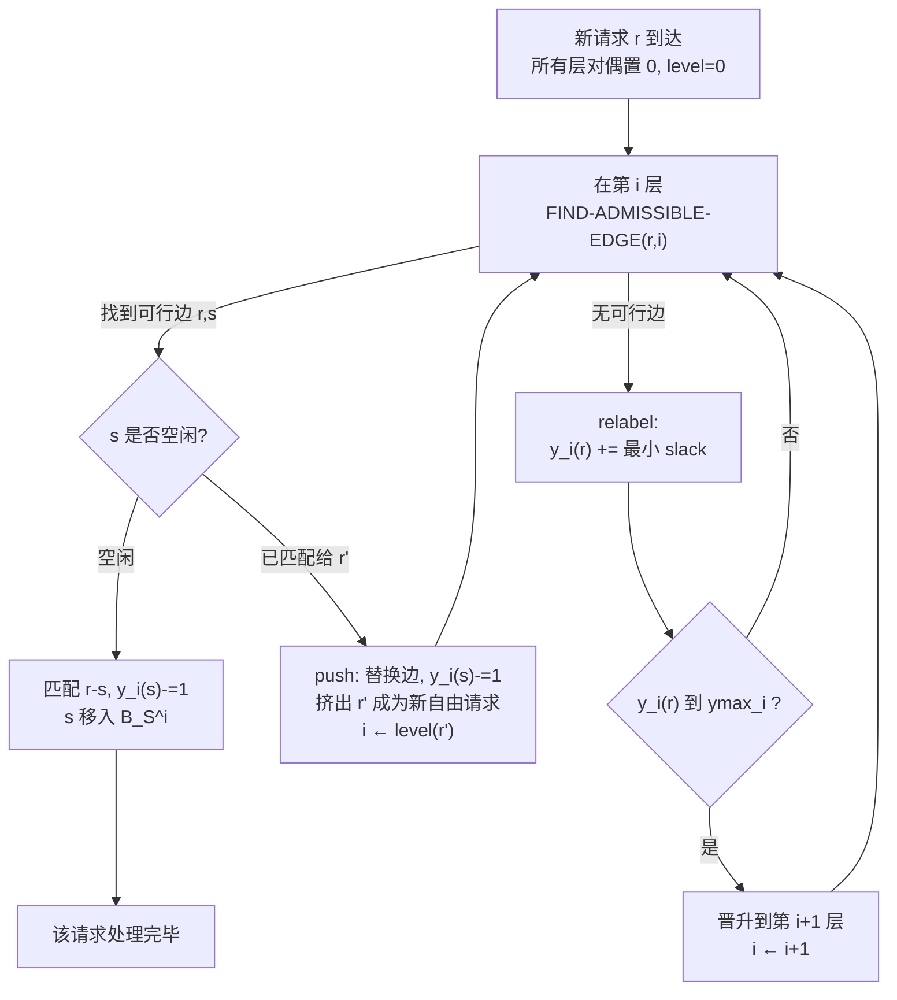

# Efficient Algorithms for Incremental Metric Bipartite Matching

**会议**: ICLR 2026  
**OpenReview**: [https://openreview.net/forum?id=wnIanx0r0w](https://openreview.net/forum?id=wnIanx0r0w)  
**代码**: [https://github.com/ritesh-777/Incremental-Metric-Bipartite-Matching-Algorithm](https://github.com/ritesh-777/Incremental-Metric-Bipartite-Matching-Algorithm)  
**领域**: optimization  
**关键词**: 二分图匹配, 增量算法, 度量空间, push-relabel, 最优传输, Wasserstein 距离, 近似算法  

## 一句话总结
本文给出了**任意度量空间下增量最小成本二分图匹配的第一个常数因子近似算法**：在固定服务器集合 $S$、请求点单边在线到达的设定下，用一套"距离缩放层级 + push-relabel"框架维护 $O(1/\delta^{0.631})$ 近似的匹配，每次插入的摊还更新时间为 $\tilde{O}(n^{1+\delta})$，并且天然可并行、可上 GPU。

## 研究背景与动机
**领域现状**：最小成本二分图匹配（min-cost bipartite matching）是机器学习、计算机视觉、物流调度的共同底座——它既是把打车请求分配给出租车这类"请求-服务器"问题的经典建模，也是计算两个经验分布之间 1-Wasserstein 距离 $W_1(\mu,\nu)=\inf_{\pi\in\Pi(\mu,\nu)}\int d(x,y)\,d\pi$ 的等价形式。静态情形下，匈牙利算法 $O(n^3)$ 求精确解，Agarwal & Sharathkumar (2014) 给出了离线度量空间下 $O(n^{2+\delta})$ 时间、$1/\delta^{0.631}$ 近似的算法。

**现有痛点**：现实里点是**动态到达**的——纽约出租车系统每天处理 30 万+ 请求，分布漂移监测、在线学习、公平性审计里样本都是流式的。每来一个新请求就从头重算一遍匹配代价过高：匈牙利算法每次更新要 $\Theta(n^2)$，处理 $n$ 个请求累积到 $O(n^3)$，计算时间甚至超过派车时间，导致排队雪崩。

**核心矛盾**：已有的动态匹配工作（如 Goranci et al. 2025）几乎全部局限在**低维欧氏空间**，且假设两侧顶点数始终相等（平衡实例），其证明严重依赖这个平衡性，无法自然推广到单边到达或高维 / 一般度量（图最短路、流形、$L_1$ 等）。而把 Agarwal-Sharathkumar 的静态算法直接搬到增量场景也行不通：每个新请求都可能触发遍历 $\Theta(n^2)$ 条边的增广路搜索，且其距离缩放框架依赖一个对最优值的常数因子估计，这在动态过程中很难维护。

**本文目标**：回答"能否为单边插入设计一个**适用于任意度量空间**、更新快、且有常数因子近似保证的匹配算法"。

**核心 idea**：**用 push-relabel 取代增广路**。把静态算法的 $O(\log(1/\delta))$ 层缩放度量同时显式维护起来，每个新请求在各层之间做"推（push）/ 重标号（relabel）"的局部操作而非全局增广路搜索，靠精细的摊还分析把更新时间压到 $\tilde{O}(n^{1+\delta})$。

## 方法详解

### 整体框架
算法构建在 Agarwal & Sharathkumar (2014) 的静态算法之上，但把"一层层串行做"改成"所有层同时维护 + push-relabel 局部更新"。核心是三件套：(1) 一个 $\mu+1\approx O(\log(1/\delta))$ 层的**缩放度量层级** $M_0,\dots,M_\mu$，越高层距离被压缩得越狠、需要处理的点越少；(2) 每层维护一个 **1-feasible 部分匹配** $M_i$ 及对偶权重 $y_i(\cdot)$，由此导出"可行边（admissible edge）"概念；(3) 一个 **push-relabel 调度**：新请求从第 0 层出发找可行边做 push，找不到就 relabel 抬高自己的对偶，对偶到顶就晋升到上一层，直到匹配成功或被丢到第 $\mu+2$ 层用匈牙利兜底。

### 关键设计

**1. $\omega$-缩放度量层级：把"远近"逐层放大、让高层只剩少量点。** 算法不直接在原度量 $d(\cdot,\cdot)$ 上工作，而是给定一个对离线最优 $\omega$（满足 $w(M^\star_j)\le\omega\le 2w(M^\star_j)$）后，构造一串度量 $M_0,\dots,M_\mu$，距离定义为
$$\hat{d}_i(s,r)=\begin{cases}\left\lceil \dfrac{2 d(s,r)\cdot n}{\varepsilon\omega}\right\rceil & i=0\\[2mm] \left\lceil \dfrac{\hat{d}_{i-1}(s,r)}{2(1+\varepsilon)^2 n^{\phi_{i-1}}}\right\rceil & i>0\end{cases}$$
其中 $\phi_i=3^i\delta$，$\varepsilon=\tfrac{1}{2\log_3(1/\delta)}$。基层 $M_0$ 把所有距离离散成有界整数、使最优匹配代价变为 $O(n)$ 量级；越往高层缩放因子 $n^{3^i\delta}$ 以指数速率增长，距离被压得越小，从而**晋升到高层的点数急剧衰减**——这正是后续摊还分析的命根子。每层都保持是合法度量（Lemma 1），且与原度量有界比例可还原。

**2. 1-feasible 匹配 + 可行边：把"近似最优"变成可局部检验的对偶条件。** 沿用 Gabow-Tarjan (1989) 思想，每层维护一个匹配 $M_i$ 配上对偶 $y_i(\cdot)$，满足
$$y_i(s)+y_i(r)\le \hat{d}_i(s,r)+1\ \ (\text{非匹配边}),\qquad y_i(s)+y_i(r)=\hat{d}_i(s,r)\ \ (\text{匹配边}).$$
一条边称为**可行（admissible）**当且仅当它在 $M_i$ 内，或满足 $y_i(r)+y_i(s)=\hat{d}_i(s,r)+1$。这样"是否还能改进"被局部化成对偶差额（slack）是否为 0 的判断，无需全局增广路。本文的新意在于：静态算法是一层层先后造对偶，而这里要**所有层的对偶同时维护**并始终保持两条不变量——(I1) 每层匹配恒为 1-feasible；(I2) 空闲服务器对偶恒为 0，请求 / 服务器在其所在层以下各层的对偶分别钉死在 $y^{\max}_k$ / $0$。

**3. 增量 push-relabel：用局部推挤代替全局增广路。** 这是把静态算法搬进动态的关键手术。新请求 $r$ 各层对偶置 0、标记为自由请求，并预先建一张按距离排序的空闲服务器列表 $L_{r}$。然后在当前层 $i$ 反复执行：调用 FIND-ADMISSIBLE-EDGE 找可行边 $(r,s)$——若 $s$ 空闲就直接匹配并令 $y_i(s)\!-\!=\!1$、把 $s$ 移入第 $i$ 层匹配集 $B_S^i$；若 $s$ 已匹配给 $r'$ 就做 **push**：换边、$y_i(s)\!-\!=\!1$、把被挤出的 $r'$ 变成新的自由请求并从 $i\leftarrow level(r')$ 继续。若找不到可行边就做 **relabel**：把 $y_i(r)$ 抬高到刚好让某条边变可行的最小 slack；一旦 $y_i(r)$ 触顶 $y^{\max}_i=\tfrac{30}{\varepsilon}n^{\phi_i}$ 就把 $r$ **晋升**到第 $i+1$ 层。一条关键不变量是：在第 $i$ 层被匹配的服务器只对 level $\ge i$ 的请求开放，从而搜索永远不必碰更低层已锁定的服务器。

**4. 摊还更新时间分析：把"看似 $\Theta(n^2)$"压成 $\tilde{O}(n^{1+\delta})$。** 单次推一个请求最坏要扫 $\Theta(n^2)$ 条边，但摊还后远低于此。证明分三块：(a) **relabel** 每个请求每层最多 $y^{\max}_i$ 次增量；(b) **push** 的服务器对偶递减总量被请求对偶递增总量上界控制（Lemma 3），从而 push 数被 relabel 数兜住；(c) **可行边搜索**最贵，但 Lemma 4 给出"晋升到第 $i$ 层及以上的请求数 $n_i\le n^{1-\Phi_i}$（$\Phi_i=\tfrac{3^i-1}{2}\delta$）"——高层点数指数级稀疏，配合"为每个请求维护排序好的服务器列表、$O(1)$ 取最近空闲服务器"，得到每层搜索总时间 $O(n^{2+\delta})$（Lemma 5）。被丢到第 $\mu+2$ 层的请求数 $<n^\delta$，用匈牙利兜底每次 $\le n^{1+\delta}$。合计 $O(n^{2+\delta}\log^2(1/\delta))$ 总更新时间，即每次插入摊还 $\tilde{O}(n^{1+\delta})$。

**5. 去掉对 $\omega$ 的假设 + 批处理并行化。** 实际无法预知最优 $\omega$，本文用标准的 **guess-and-double**：初始 $\omega=\min_s d(s,r_1)$，一旦发现某层 $i$ 的高层请求数超过 $n^{1-\Phi_i}$，就把 $\omega$ 翻倍并以新 $\omega$ 重跑当前请求序列；归纳可证每个阶段 $\omega$ 至多是最优的两倍，阶段数被 $\log(n\Delta)$（$\Delta$ 为度量纵横比）上界。此外，push 步可改写成在可行图上算极大匹配、relabel 步是更新一个"slack 矩阵"，二者都天然并行——本文借鉴 Lahn et al. (2023) 的并行 push-relabel，把请求按 200 一批送 GPU 并发处理（Batch Incremental PR），从而避免串行排队。

## 实验关键数据

### 主实验设置
两套独立实现：C++ 纯 CPU 版 + PyTorch GPU 版。机器为 AMD EPYC 7763（单线程跑 CPU 任务）+ NVIDIA A100-40GB。四个数据集各 10,000 点、服务器固定 10,000、请求量 $n\in\{1000,\dots,10000\}$、$\delta=0.001$、批大小 200、采样 10 次取均值。

| 数据集 | 度量 | 类型 |
|--------|------|------|
| MNIST | $L_1$ 范数（784 维） | 高维 |
| NYC-Taxi | 欧氏（上下车经纬度） | 低维欧氏 |
| Beijing Road Network | 最短路距离（≈3.1万点 / 7.2万边） | 图度量 |
| Synthetic | $[0,100]^2$ 均匀欧氏 | 低维欧氏 |

对比基线：Greedy（最近空闲服务器，GPU 算距离）、QuadTree-based（QT，CPU）、Dynamic Euclidean（Goranci et al. 2025，仅欧氏可用）。

### 关键发现
- **高维 / 一般度量是主战场**：MNIST（$L_1$）与 Beijing（最短路）上 QT 与 Dynamic Euclidean **根本不适用**，Batch Incremental PR 在**代价和更新时间上都大幅领先 Greedy**——这正是本文"任意度量"价值的直接体现。
- **NYC-Taxi（低维欧氏）**：在 QT / Dynamic Euclidean 的主场，它们运行时更快，但**代价更高**；Batch Incremental PR 代价持续优于二者，与 Greedy 相当，达成更好的代价-时间平衡。
- **Beijing Road Network**：代价显著更低、对 Greedy 保持明显优势；运行时在约 7,000 点前优于 Greedy，之后 Greedy 反超，但其平均响应时间**始终不超过 50 毫秒**。
- **总结**：跨数据集来看，Batch Incremental PR 在代价与运行时间之间取得最佳平衡，且优势能延伸到低维欧氏之外的场景。
- 附录 B.1 给出 $\delta$ 的敏感性分析（$\delta$ 调节运行时-代价 trade-off），B.2 分析批大小对平均更新时间的影响。

## 亮点与洞察
- **"换引擎"式的算法迁移**：把静态匹配搬进动态的难点不在套壳，而在增广路一旦动态化就退化成 $\Theta(n^2)$。本文洞见是 push-relabel 的局部性恰好匹配增量更新——这与最大流领域"用 push-relabel 而非增广路做动态维护"的直觉一脉相承，是一次漂亮的跨问题借力。
- **缩放度量层级 = 廉价的"分而治之"**：把 $\Theta(n^2)$ 的搜索按层指数稀疏化（$n_i\le n^{1-\Phi_i}$），让"看似要扫全图"的最坏情形在摊还意义下消失，是整篇分析的技术心脏。
- **理论严格泛化已有结果**：总执行时间与近似比都与 Agarwal-Sharathkumar 静态算法持平，却额外支持动态插入——即"免费"获得了动态能力，这是很强的理论 selling point。
- **理论可并行性落到实处**：push / relabel 的并行结构不是纸上谈兵，直接接 Lahn et al. (2023) 的 GPU 实现做成批处理，理论-工程闭环完整。

## 局限与展望
- **只支持单边插入，不支持删除**：服务器集合固定、请求只增不减。现实里请求可能取消、服务器可能下线，作者自己也指出把这套"维护精确组合结构 + 近似代价"的框架推广到删除是"极具挑战的开放问题"。
- **近似比 $1/\delta^{0.631}$ 在小 $\delta$ 时偏松**：$\delta=0.001$ 时常数因子并不小，与 $(1+\delta)$ 近似的 Sinkhorn / 离线 OT 方法相比精度量级不同；论文的卖点是"任意度量 + 快更新"而非最优近似比。
- **依赖纵横比 $\Delta$**：更新时间里含 $\log(n\Delta)$，纵横比极端的度量上阶段数会变多。
- **实验仅用单计算线程跑 CPU 任务**：CPU 基线对比的绝对时间意义有限，GPU 批处理的收益与批大小强相关（需附录佐证），大批量下的可扩展性还需更系统的评估。
- 展望：把 push-relabel 框架扩展到**双边动态（插入+删除）**、与近线性时间 min-cost flow（Chen et al. 2022）的新工具结合、以及在更一般结构化度量（图 / 流形 OT）上落地，都是自然的下一步。

## 相关工作与启发
- **静态度量匹配根基**：Agarwal & Sharathkumar (2014) 的距离缩放 + 同步增广路是本文直接的"被改造对象"；Gabow & Tarjan (1989) 的 1-feasible 匹配提供了对偶可行性框架。
- **动态 / 流式匹配**：Goranci et al. (2025) 的动态欧氏匹配（双边更新、$O(1/\delta)$ 近似、亚线性更新）是最接近的对照，但受限于平衡实例与低维欧氏；Andoni et al. (2009) 给出 EMD 的流式 sketch。
- **近线性 min-cost flow 浪潮**：Chen et al. (2022) 的近线性 min-cost flow、van den Brand et al. (2024) 的增量近似最大流，说明"把近似流的动态维护技巧迁到维护精确组合结构（完美匹配）"仍是开放难题——本文绕开了这条路，选择在近似代价 + push-relabel 上做文章。
- **OT 的并行 / 加性近似线**：Cuturi (2013) 的 Sinkhorn、Lahn et al. (2019, 2023) 的组合式加性近似都高度可并行、有 GPU 实现，本文的批处理实现正是嫁接了 Lahn et al. (2023) 的并行 push-relabel。
- **启发**：对任何"静态有好算法、但一动态化就退化"的组合优化问题，本文示范了一条范式——**寻找一个局部性更强的等价求解框架（如 push-relabel）+ 层级稀疏化 + 摊还分析**，往往能在不损失近似保证的前提下换来高效的增量维护。

## 评分
- **新颖性**: ⭐⭐⭐⭐½ — 任意度量空间下增量匹配的第一个常数因子近似算法，"push-relabel 替增广路 + 同时维护多层对偶"是实打实的新技术贡献，严格泛化了经典静态结果。
- **实验充分度**: ⭐⭐⭐½ — 覆盖高维 $L_1$、图最短路、低维欧氏三类度量，对比 3 个基线并有 $\delta$ / 批大小敏感性分析；但结果以图为主、单线程 CPU 对比的说服力有限，缺更大规模与可扩展性曲线。
- **写作质量**: ⭐⭐⭐⭐ — 问题动机、技术概览（overview of techniques）到正式分析层层递进，把摊还分析的直觉讲得清楚；公式偏多但符号体系自洽。
- **价值**: ⭐⭐⭐⭐ — 同时服务物流调度与 Wasserstein / OT 计算两大需求，"任意度量 + 亚线性更新 + 可 GPU 并行"组合在动态 OT 监测、分布漂移检测等场景有实际落地潜力。

<!-- RELATED:START -->

## 相关论文

- [\[ICLR 2026\] High-dimensional Mean-Field Games by Particle-based Flow Matching](high-dimensional_mean-field_games_by_particle-based_flow_matching.md)
- [\[CVPR 2025\] Towards Stable and Storage-efficient Dataset Distillation: Matching Convexified Trajectory](../../CVPR2025/optimization/towards_stable_and_storage-efficient_dataset_distillation_matching_convexified_t.md)
- [\[ICLR 2026\] A Memory-Efficient Hierarchical Algorithm for Large-scale Optimal Transport Problems](a_memory-efficient_hierarchical_algorithm_for_large-scale_optimal_transport_prob.md)
- [\[ICLR 2026\] Convergence of Regret Matching in Potential Games and Constrained Optimization](convergence_of_regret_matching_in_potential_games_and_constrained_optimization.md)
- [\[ICLR 2026\] AutoEP: LLMs-Driven Automation of Hyperparameter Evolution for Metaheuristic Algorithms](autoep_llms-driven_automation_of_hyperparameter_evolution_for_metaheuristic_algo.md)

<!-- RELATED:END -->
