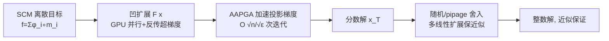

# Efficient Submodular Maximization for Sums of Concave over Modular Functions

**会议**: ICLR 2026  
**OpenReview**: [https://openreview.net/forum?id=HIi4lNsvXW](https://openreview.net/forum?id=HIi4lNsvXW)  
**代码**: [https://github.com/lvymath1/Efficient-Submodular-Maximization](https://github.com/lvymath1/Efficient-Submodular-Maximization)  
**领域**: optimization  
**关键词**: 子模最大化, SCM, 凹扩展, 加速投影梯度, 随机舍入, GPU 并行  

## 一句话总结
针对「凹函数复合模函数之和」(SCM) 这一子模函数子类，本文用「凹扩展 + 加速近似投影梯度上升 (AAPGA) + 随机舍入」三件套，把基数/背包/划分拟阵约束下的查询复杂度从 PGA 的 $O(n^2\varepsilon^{-2})$ 降到 $O(n^{1/2}\varepsilon^{-1/2}(T_1+T_2))$，实测最高加速 32.3 倍。

## 研究背景与动机

**领域现状**：子模最大化在传感器布点、数据摘要、覆盖等场景应用广泛，但经典贪心算法 $O(nk)$ 的串行复杂度在现代大规模问题上难以扩展。学界已发展出流式、并行、分布式、连续松弛等多条加速路线。其中 Bai et al. (2018) 提出对「深度子模函数」做连续松弛 + 投影梯度上升 (PGA) + pipage 舍入的框架，能用 GPU 加速。

**现有痛点**：主流加速方法把子模函数当成黑箱 value oracle，不利用其内部结构；即便是 Bai 的梯度框架，PGA 要达到 $(1-\varepsilon)$ 近似仍需 $O(n^2/\varepsilon^2)$ 次迭代，每次迭代还要做一次反向传播 (代价 $T_2$)，总查询复杂度 $O((n^2/\varepsilon^2)T_2)$，在超大规模图上依然过高。

**核心矛盾**：连续松弛的两种扩展各有取舍——多线性扩展 (multilinear extension) 有「方向凹性」便于舍入保证近似比，但精确计算不可行、梯度要靠采样近似；凹扩展 (concave extension) 可在 GPU 上并行、超梯度可由反向传播高效求得，却缺乏舍入所需的方向凹性。如何兼得「优化端的计算效率」与「舍入端的近似保证」是关键。

**本文目标**：聚焦 SCM 子类 $f(A)=\sum_{i\in V}\phi_i(m_i(A))$ ($\phi_i$ 非负单调凹、$m_i$ 模函数)，在基数、背包、划分拟阵三类约束下，设计一个迭代次数与查询复杂度都显著更低的近似算法。

**核心 idea**：**【混合扩展 + Nesterov 加速】** 优化阶段用凹扩展 (GPU 并行 + 反传超梯度) 跑加速版投影梯度，舍入阶段切回多线性扩展借其方向凹性拿近似保证，并把 PGA 换成 FISTA 式的 AAPGA 把迭代数从 $O(n^2/\varepsilon^2)$ 压到 $O(n^{1/2}\varepsilon^{-1/2})$。

## 方法详解

### 整体框架

本文沿用 Bai et al. (2018) 的「连续松弛 → 连续优化 → 舍入」三段式管线，但在每一段都做了升级：连续松弛端把超梯度推广到不可微激活函数；连续优化端用 AAPGA 替换 PGA；舍入端为背包约束设计了 $O(n)$ 的随机舍入，并补齐三类约束下的近似比与复杂度证明。关键是一套「优化用凹扩展、舍入用多线性扩展」的混合策略，由 Lemma 1 在两种扩展间架桥。

### 关键设计

**1. 凹扩展替代多线性扩展，把超梯度变成一次反向传播**：对 SCM $f(A)=\sum_i\phi_i(m_i(A))$，由于模函数是线性映射、凹复合线性仍凹、凹之和仍凹，可构造连续凹扩展 $F(x)=\sum_{i\in V}\phi_i(m_i(x))$ 满足 $f(A)=F(\mathbf 1_A)$。与多线性扩展须靠采样近似梯度不同，凹扩展整体就是一个「线性层 + 凹激活」的两层网络，超梯度 $g=\big(\sum_{i}m_{ij}\,\phi_{i+}'(m_i(x))\big)_j$ 可直接由反向传播在多 GPU 上算出。为支持 $\min\{x,1\}$、$1-\exp(x)$、$\sqrt x$ 等在某些点不可微的常用激活，本文用右导数 $\phi_{i+}'$ 定义超微分 $\partial F(x)=\{g\mid F(y)-F(x)\le g\cdot(y-x)\}$，从而把 Bai 框架推广到不可微 SCM。这一步把梯度计算这个瓶颈从「采样近似」变成「精确反传」。

**2. AAPGA：FISTA 式加速 + δ-近似投影，迭代数从 $O(n^2/\varepsilon^2)$ 降到 $O(n^{1/2}\varepsilon^{-1/2})$**：标准 PGA 直接在 $x^{(t)}$ 上做投影，而 AAPGA 借鉴 Nesterov/FISTA，先对外推点 $y^{(t)}=x^{(t)}+\frac{\alpha_t-1}{\alpha_{t+1}}(x^{(t)}-x^{(t-1)})$ 做投影。关键改动是投影只需「近似」——定义近似投影集 $P_L'(y)=\{x'\in P:\|x'-\Pi_P(y+\frac1L\gamma_F(y))\|\le\delta\}$，配合回溯线搜索 (找最小整数 $i_t$ 令二次代理 $Q_L$ 被满足) 自适应步长。本文证明 (Theorem 1) 只要近似误差 $\delta<O(1/T^3)$，即得 $F(x^*)-F(x^{(T)})\le O(n/T^2)$ 的收敛率；要拿 $(1-\varepsilon)$ 近似只需 $T=O(n^{1/2}\varepsilon^{-1/2})$ 次迭代 (Corollary 1)，相比 PGA 的 $O(n^2/\varepsilon^2)$ 是数量级的下降。每类约束的 $\delta$-近似投影都能在 $O(n\log(n/\delta))$ 内算出，故单步代价与 PGA 几乎相同，总查询复杂度 $T\cdot(T_1+T_2)=O(n^{1/2}\varepsilon^{-1/2}(T_1+T_2))$。

**3. 混合扩展 + Lemma 1 桥接，让凹扩展上优化的解能在多线性扩展上拿近似保证**：凹扩展虽好优化但缺方向凹性，无法直接保证舍入质量；多线性扩展有方向凹性 (pipage 舍入沿 $e_i-e_j$ 方向保期望值) 但不可计算。本文用 Lemma 1 (引自 Bai et al. 2018) 把二者夹起来：$\max_{\eta\in[0,1]}(1-\eta)\big[1-|V|\exp(-\eta^2\triangle(x))\big]F(x)\le F_m(x)\le F(x)$，其中 $\triangle(x)=\min_{i\in V}\frac{m_i(x)}{2\max m_i}$。于是优化阶段只跑凹扩展 $F$，舍入阶段切到多线性扩展 $F_m$，最终对基数/划分拟阵约束得到近似比 $(1-\varepsilon)(1-\eta)[1-|V|\exp(-\eta^2\min_i\frac{\min m_i\cdot k}{\max m_i})]$ (Theorem 2)，随约束规模 $k$ 增大近似比反而收紧。

**4. 背包约束的 $O(n)$ 随机舍入，把指数级舍入代价降到线性、保 $1/2$ 近似**：基数与划分拟阵可直接用 $O(n)$ 的 pipage 舍入，但背包约束下传统 $(1-\varepsilon)$ 舍入需 $O(n^{\lceil\varepsilon^{-4}\rceil+1})$ 的天价。本文 (Algorithm 2) 改用「最优单元素 + 成对随机舍入」：先取 $e=\arg\max_e f(e)$ 兜底，再对分数解反复随机挑一对 $(i,j)$，沿方向 $v=\frac1{c_i}e_i-\frac1{c_j}e_j$ (保持背包代价不变) 取可行步长 $\theta_{\min},\theta_{\max}$，以概率 $\frac{-\theta_{\min}}{-\theta_{\min}+\theta_{\max}}$ 走 $\theta_{\max}$、否则走 $\theta_{\min}$，使每轮至少一个分量变整数；最后返回 $\arg\max\{f(x),f(e)\}$。该舍入 $O(n)$ 时间、给出 $\frac12$ 常数因子近似，使背包总复杂度为 $O(nT_1+n^{1/2}\varepsilon^{-1/2}T_2)$。

## 实验关键数据

实验环境：Hygon C86 7380 32 核 CPU、2×NVIDIA A800 80GB GPU、256GB RAM、CUDA 12.2。所有方法 (含原本非 GPU 的基线) 统一 GPU 加速，随机算法结果对 50 次运行取平均。

### 主实验表格

基数约束下 ($k=50$) 概率覆盖最大化，结果为目标值 / 墙钟时间 (秒)：

| 算法 | EU-Email 值/时 | Facebook-ego 值/时 | SBM 值/时 | Erdős–Rényi 值/时 |
|------|------|------|------|------|
| Greedy | **864.61** / 4.96 | **3676.31** / 145.74 | **1654.00** / 9.73 | **3773.46** / 42.02 |
| Lazier-greedy | 853.75 / 1.02 | 3610.24 / 29.18 | 1628.71 / 1.98 | 3748.74 / 8.44 |
| Stream | 784.74 / 0.99 | 3441.45 / 25.47 | 1440.89 / 1.90 | 3538.56 / 6.88 |
| PGA+Rounding | 862.69 / 1.68 | 1661.63 / 1.49 | 1427.04 / 2.09 | 3652.71 / 2.50 |
| **AAPGA+Rounding** | 864.60 / **1.12** | 3653.14 / **1.84** | 1642.38 / **1.78** | 3714.83 / **1.30** |

AAPGA+Rounding 目标值稳居前三，且时间显著更短：在 Erdős–Rényi 上比 Greedy 快 **32.3×**。

背包约束下：在 Facebook-ego 上 AAPGA+Rounding 比 Lazier-greedy 快约 **9.72×**，目标值仅小幅落后 (4850.83 vs 4885.69)，全面优于流式基线。

### 消融实验表格

AAPGA vs PGA 在凹扩展上的收敛对比 (同一约束/数据集)：

| 设置 | PGA | AAPGA |
|------|-----|-------|
| EU-Email 背包 (早期) | 50 轮才 743.8 | 20 轮即 748.7 |
| Wikipedia Vote | 收敛到 4600.6 | 更高 4629.0 |

理论上 AAPGA 收敛迭代数 $O(n^{1/2}\varepsilon^{-1/2})$，PGA 为 $O(n^2\varepsilon^{-2})$。

### 关键发现
- **更快且更好**：因 Nesterov 加速，AAPGA 不仅前期上升更陡，最终目标值也常优于 PGA。
- **GPU 并行的红利**：Greedy / Lazier-greedy 难并行，墙钟时间显著更高；凹扩展可 GPU/多 GPU 并行，故加速明显。
- **大规模可扩展**：在 Google+ 网络 (107,614 点、3049 万边)、$k$ 从 10 到 5120，AAPGA+pipage 在基数与划分拟阵约束下增长速率始终快于 PGA。

## 亮点与洞察
- **「优化用凹扩展、舍入用多线性扩展」的混合策略**是核心巧思：用 Lemma 1 在两种扩展间架桥，既吃到凹扩展可反传/可 GPU 并行的工程红利，又保住多线性扩展的舍入近似保证。
- **把子模优化「神经网络化」**：凹扩展本质是「线性层 + 凹激活」的浅网络，超梯度 = 反向传播，天然契合 GPU/多 GPU 与现成深度学习基础设施。
- **近似比随约束规模收紧**：$1-|V|\exp(-\eta^2\cdot\text{(与 }k\text{ 或 }B\text{ 正相关)})$ 这一形式意味着 $k,B$ 越大保证越好，对大规模问题反而友好；对覆盖函数更可达 $1-1/e-\varepsilon$。
- **背包随机舍入**把传统 $O(n^{\lceil\varepsilon^{-4}\rceil+1})$ 的指数代价降到 $O(n)$，以 $1/2$ 近似换取实用速度。

## 局限与展望
- **近似比非固定常数**：基数/划分拟阵约束下的保证依赖 $\eta$、$|V|$、$\min m_i/\max m_i$ 等量，最坏情形保证弱于经典 $1-1/e$；仅对覆盖函数等特例才达 $1-1/e-\varepsilon$。
- **背包约束退化为 $1/2$**：相比基数/拟阵的近似比明显下降，且实验中 AAPGA 在背包上目标值常略逊于 Lazier-greedy，靠速度取胜。
- **局限于 SCM 子类**：方法吃的是「凹复合模 + 可反传」的结构，对一般黑箱子模函数不直接适用。
- **依赖 GPU 基础设施**：加速红利建立在 GPU/多 GPU 并行之上，CPU-only 场景优势会缩水。
- 展望：把混合扩展思路推广到更广的可微分子模子类、非单调情形，或与学习型代理结合进一步降 $T_1,T_2$。

## 相关工作与启发
- **梯度上升做子模最大化**：Bai et al. (2018) 的深度子模 + PGA + pipage 框架是本文直接基座；本文在迭代数、舍入与不可微激活上做了系统升级。
- **连续相对加速**：FISTA (Beck & Teboulle, 2009) 的 Nesterov 加速被搬到 AAPGA，并新增 $\delta$-近似投影的收敛分析。
- **覆盖函数三步框架**：Karimi et al. (2017) 的「松弛—优化—舍入」启发了 SCM 的处理路径，并提供覆盖函数可达 $1-1/e-\varepsilon$ 的依据。
- **经典子模加速谱系**：Lazier-Greedy (Mirzasoleiman et al., 2015)、FAST (Breuer et al., 2020)、LS+PGB (Chen et al., 2021) 等构成对照基线；本文相比这些「value oracle 黑箱加速」强调利用 SCM 内部结构。
- **启发**：当目标函数具备「凹复合线性」这类可微可并行结构时，与其当黑箱调 oracle，不如把它当成浅神经网络，用深度学习的反传 + GPU + 加速优化器一并吃下——这套「优化—舍入分用不同扩展」的范式或可迁移到其他结构化组合优化问题。

## 评分
- 新颖性: ⭐⭐⭐⭐ 混合扩展 + FISTA 式加速 + 背包 $O(n)$ 舍入的组合在 SCM 上是清晰的工程化创新，但单点技术多为已有思想 (Bai 框架、FISTA、pipage) 的巧妙拼装。
- 实验充分度: ⭐⭐⭐⭐ 覆盖小/大规模、多约束、合成+真实图、最高千万级边，收敛与端到端对比齐全；但缺与更多近期背包/拟阵专用 SOTA 的横评。
- 写作质量: ⭐⭐⭐⭐ 理论 (定理/复杂度) 与算法伪代码清晰，扩展取舍论证到位；部分近似比表达式较繁琐。
- 价值: ⭐⭐⭐⭐ 把子模最大化与深度学习基础设施打通，在可扩展性上给出实用且可复现 (开源) 的方案，对大规模覆盖/摘要类应用有现实意义。

<!-- RELATED:START -->

## 相关论文

- [\[ICML 2026\] Differentially Private Submodular Maximization with a Knapsack Constraint](../../ICML2026/optimization/differentially_private_submodular_maximization_with_a_knapsack_constraint.md)
- [\[ICML 2026\] A General Framework for Dynamic Consistent Submodular Maximization](../../ICML2026/optimization/a_general_framework_for_dynamic_consistent_submodular_maximization.md)
- [\[NeurIPS 2025\] A Unified Approach to Submodular Maximization Under Noise](../../NeurIPS2025/optimization/a_unified_approach_to_submodular_maximization_under_noise.md)
- [\[ICLR 2026\] DR-Submodular Maximization with Stochastic Biased Gradients: Classical and Quantum Gradient Algorithms](dr-submodular_maximization_with_stochastic_biased_gradients_classical_and_quantu.md)
- [\[NeurIPS 2025\] Online Two-Stage Submodular Maximization](../../NeurIPS2025/optimization/online_two-stage_submodular_maximization.md)

<!-- RELATED:END -->
