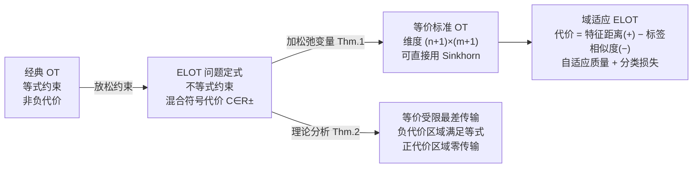

# Elastic Optimal Transport: Theory, Application, and Empirical Evaluation

**会议**: ICLR 2026  
**论文**: [OpenReview: gG09r15HhQ](https://openreview.net/forum?id=gG09r15HhQ)  
**代码**: 论文补充材料提供，未公开 GitHub 仓库  
**领域**: 最优传输理论 / 域适应  
**关键词**: 弹性最优传输, 自适应质量传输, 混合符号代价矩阵, 无监督域适应, 部分域适应

## 一句话总结

本文提出弹性最优传输（ELOT），用"边缘不等式约束 + 混合符号代价矩阵"替代经典 OT 的等式约束，让传输质量完全由问题自身的几何结构自适应决定，在无监督域适应和部分域适应基准上大幅超越 POT/UOT 系列方法。

## 研究背景与动机

**领域现状**：最优传输（OT）是比较和对齐两个概率分布的经典工具，近年在机器学习中被广泛用于域适应、GAN、图像处理、NLP 等任务。Cuturi（2013）的熵正则化 Sinkhorn 算法使大规模 OT 得以实用，推动了一波 OT 应用热潮。

**现有痛点**：经典 Kantorovich OT 要求全质量守恒——源域和目标域的全部概率质量都必须被搬运。这在真实数据中会强制对齐噪声、离群点和不匹配样本，导致 OT 映射失真。为此学界发展了两条路线：**部分 OT（POT）**放宽为"传输固定预算质量 $s$"；**非平衡 OT（UOT）**用 KL 散度"软约束"边缘分布，引入系数 $\tau_1, \tau_2$。

**核心矛盾**：两条路线都没有真正解决"应该传多少质量"的问题——POT 需要人工指定 $s$，UOT 需要人工调 $\tau_1, \tau_2$，两者本质上都把自适应的问题转移成了超参数选取的问题，在实践中同样困难。

**本文目标**：能否让传输质量完全由数据的内在几何结构自适应确定，而不需要任何额外超参数来控制"传多少"？

**切入角度**：将边缘约束从等式放松为不等式，同时允许代价矩阵有负值（混合符号），让优化器自己决定哪些样本对值得对齐、哪些应被忽略。

**核心 idea**：边缘不等式约束 + 混合符号代价矩阵共同驱动自适应质量分配，正代价对应"对齐有损"的样本对（自然不传质量），负代价对应"对齐有益"的样本对（最大化传输）。

## 方法详解

### 整体框架

ELOT 的核心是一个新的 OT 问题定式：用**边缘不等式约束**替换经典等式约束，并允许**混合符号代价矩阵**。通过引入松弛变量，将 ELOT 等价转化为一个标准 OT 问题（维度扩大 1×1），从而直接复用 Sinkhorn 等现成求解器。在域适应应用中，代价矩阵由特征空间距离（正项）和标签相似度（负项）联合构成，使传输计划在对齐相似样本对的同时自动过滤离群点。

### 关键设计

**1. 弹性 OT 问题定式：不等式约束 + 混合符号代价**

经典 Kantorovich OT 的传输计划集合 $\Pi(\mu,\nu)$ 要求 $\gamma \mathbf{1}_m = \mu$ 且 $\gamma^\top \mathbf{1}_n = \nu$（两侧等式）。ELOT 将其放宽为：

$$\Pi_e(\mu,\nu) = \{\gamma \in \mathbb{R}^{n\times m}_+ \mid \gamma \mathbf{1}_m \leq \mu,\ \gamma^\top \mathbf{1}_n \leq \nu\}$$

同时允许代价矩阵 $C \in \mathbb{R}^{n\times m}_\pm$（含正负值）。仅靠不等式约束无法实现自适应——若代价全非负，优化器会直接选择零传输；仅靠负代价也无法约束传输范围。两者缺一不可：**负代价驱动有益样本对传输，不等式约束阻止过度传输**，共同产生正好合适的自适应质量分配。

这一定式的优势在于：无需指定 POT 的固定预算 $s$，也无需调 UOT 的软约束强度 $\tau_1, \tau_2$——超参数量比 JUMBOT 和 m-POT 更少，而"传多少"完全由代价矩阵的几何结构决定。

**2. 等价标准 OT 重表述：无缝复用现成求解器（Theorem 1）**

ELOT 含不等式约束，不能直接调用标准 OT 求解器。作者通过**引入松弛变量**（线性规划中将不等式转等式的经典手法），构造增广代价矩阵和边缘向量：

$$\bar{C} = \begin{pmatrix} C & \sigma\mathbf{1}_m \\ \sigma\mathbf{1}_n^\top & 2\sigma \end{pmatrix},\quad \bar\mu = \begin{pmatrix}\mu \\ \|\nu\|_1\end{pmatrix},\quad \bar\nu = \begin{pmatrix}\nu \\ \|\mu\|_1\end{pmatrix}$$

**Theorem 1** 证明：增广问题的最优传输计划去掉最后一行/列后，与原 ELOT 的最优传输计划完全等价；两者最优值相差常数 $\sigma(\|\mu\|_1+\|\nu\|_1)$（优化时可忽略）。更重要的是，最优传输计划与 $\sigma$ 的取值无关，因此直接令 $\sigma=1$ 即可。这使 ELOT 的算法复杂度仅比经典 OT 多一个常数（问题规模从 $n\times m$ 扩为 $(n+1)\times(m+1)$），并可加熵正则化后用 Sinkhorn-Knopp 高效求解。

**3. 质量传输机制：等价受限最差传输（Theorem 2）**

为理解 ELOT 为何能自动过滤离群点，作者将代价矩阵拆分为正部 $C^+$ 和负部 $C^-$，证明 ELOT 等价于一个**受限最差传输问题**：只在负代价区域上最大化 $\sum_{i,j}(-C^-_{ij})\gamma_{ij}$，且在负代价位置上恰好满足某侧的等式边缘约束。

**Theorem 2** 给出直觉：若某源样本 $x_i$ 与所有目标样本的代价均为正（即它与目标域没有相似样本），则 $\sum_j \gamma^*_{ij} = 0$，该样本完全不传输——ELOT 自动将其识别为离群点/噪声并丢弃。相反，两个样本对之间代价越负，传输质量越大。这与部分域适应的直觉完全吻合：源域中属于目标域没有类别的样本（"私有类"），其代价自然倾向正值，ELOT 自动减少/消除对其的传输，避免负迁移。

**4. 域适应中的混合符号代价构造**

在域适应场景中，ELOT 构造混合符号代价矩阵为：

$$C_{ij} = \alpha\|g(x_i) - g(z_j)\|^2 - \beta\, y_i \tanh\!\left(f(g(z_j))\right)$$

第一项是特征空间 $\ell_2$ 距离（正值，惩罚特征不匹配），第二项用源标签 $y_i$ 与目标伪标签 $f(g(z_j))$ 的符号一致性给出负奖励（同类对代价更负，异类对代价更正）。整个训练目标为联合最小化 ELOT 传输距离和源域分类损失：

$$\min_{\gamma,g,f}\,\langle\gamma, C(g,f)\rangle + \mathcal{L}(g,f),\quad \gamma\in\Pi_e(\mu,\nu)$$

相比 JUMBOT（UOT）和 m-POT（POT），ELOT 的代价函数结构相同，但**无需额外的 $s$/$\tau_1$/$\tau_2$ 超参数**，真正做到了 "less tuning, more adaptive"。

## 实验关键数据

### 主实验——无监督域适应（UDA）

| 数据集 | 指标 | ELOT (本文) | m-POT (SOTA) | JUMBOT | 提升 |
|--------|------|-------------|--------------|--------|------|
| VisDA（大规模，15万图） | Avg Acc (%) | **76.32±0.28** | 73.59±0.15 | 72.50 | +2.73 |
| Office-31（6任务）| Avg Acc (%) | **90.5** | 88.3 | 86.4 | +2.2 |
| Office-Home（12任务）| Avg Acc (%) | **71.75** | 70.34 | 70.17 | +1.41 |

### 主实验——部分域适应（PDA）

| 数据集 | 指标 | ELOT (本文) | m-POT | JUMBOT | 提升 |
|--------|------|-------------|-------|--------|------|
| Office-Home PDA（12任务）| Avg Acc (%) | **79.19** | 77.98 | 75.96 | +1.21 |
| DomainNet PDA（6任务，大规模345类）| Avg Acc (%) | **71.4** | — | — | vs ARPM 68.8，+2.6 |

### 消融实验（传输计划热图分析）

| 配置 | 传输质量（归一化） | VisDA Acc | 说明 |
|------|-------------------|-----------|------|
| ELOT，ε=0 | 0.6111 | 75.0% | 传输计划稀疏，噪声样本被过滤 |
| ELOT，ε=0.1（熵正则） | 0.7468 | 76.39% | 传输计划更稠密，自动收敛到约0.75 |
| m-POT 最优设置 | s=0.75（人工设定） | 参考值 | 需预知最优 s |

### 关键发现

- ELOT 在所有 UDA 数据集上均超越 m-POT 和 JUMBOT，说明自适应质量传输优于固定预算或软约束方案
- 部分域适应中，ELOT 在 DomainNet 上超越专为 PDA 设计的 ARPM，验证了自动过滤离群点的鲁棒性
- 热图分析显示传输计划沿对角块集中（类间对齐），且 ELOT 的自适应质量（≈0.75）与 m-POT 人工最优设置高度吻合，却无需人工指定

## 亮点与洞察

- **自适应质量的优雅性**：ELOT 通过代价矩阵的几何结构自动确定"传多少"，理论上等价于受限最差传输（Theorem 2），使得正代价样本对完全不传输——这是一个极其干净的机制，不需要任何关于噪声/离群点比例的先验知识
- **超参数更少反而更好**：JUMBOT 和 m-POT 需要 $s$ 或 $\tau_1,\tau_2$ 来控制"传多少"，ELOT 只保留 $\beta$（代价结构超参），减少了一个层面的选择困难，却在所有基准上全面超越
- **等价重表述的工程价值**：Theorem 1 表明只需将问题扩大 1 行 1 列就能直接用 Sinkhorn，算法改动极小但理论保证完整，工程落地极简

## 局限与展望

- 混合符号代价要求代价矩阵必须含负值，对于某些只有自然非负代价的任务（纯特征距离），需要额外设计负代价项，增加了应用门槛
- 目前仅在域适应任务中验证，理论上可扩展到 GAN 训练、图匹配、点云配准等场景，但这些方向尚未实验验证
- 代价矩阵中超参 $\beta$（控制标签代价权重）仍需交叉验证调整，并未完全消除调参负担

## 相关工作与启发

- **vs Kantorovich OT**：全质量守恒，ELOT 用不等式约束放松，允许部分质量不传输
- **vs Partial OT（Caffarelli & McCann 2010）**：POT 固定传输质量预算 $s$，ELOT 自适应确定，无需人工指定 $s$
- **vs Unbalanced OT（Liero et al. 2017）**：UOT 用散度软化约束，引入 $\tau_1,\tau_2$；ELOT 通过混合符号代价实现类似效果且超参更少
- **vs JUMBOT（Fatras et al. 2021）**：UOT + mini-batch，需调 $\tau_1,\tau_2,s$；ELOT 在完全相同代价结构下少两个超参，准确率全面超越
- **vs m-POT（Nguyen et al. 2022）**：POT + mini-batch，需调 $s$；ELOT 在 VisDA 上大幅领先 +2.73 pp

## 评分

- 新颖性: ⭐⭐⭐⭐ 问题定式新颖，混合符号代价与不等式约束的组合是原创，理论分析（等价受限最差传输）有深度
- 实验充分度: ⭐⭐⭐⭐ 覆盖 UDA 和 PDA 共 5 个基准数据集，与多个 OT 和非 OT 基线对比，还有热图可视化和 T-SNE 分析
- 写作质量: ⭐⭐⭐⭐ 理论定理清晰，公式推导完整，问题动机交代充分，结构紧凑
- 价值: ⭐⭐⭐⭐ 提供了一个参数更少、效果更好的 OT 框架，理论简洁实用，潜在应用场景广泛（生物信息、物理、运筹等）

<!-- RELATED:START -->

## 相关论文

- [\[ICLR 2026\] HOTA: Hamiltonian Framework for Optimal Transport Advection](hota_hamiltonian_framework_for_optimal_transport_advection.md)
- [\[ICLR 2026\] Neural Optimal Transport Meets Multivariate Conformal Prediction](neural_optimal_transport_meets_multivariate_conformal_prediction.md)
- [\[ICLR 2026\] Neural Hamilton–Jacobi Characteristic Flows for Optimal Transport](neural_hamilton--jacobi_characteristic_flows_for_optimal_transport.md)
- [\[ICLR 2026\] A Memory-Efficient Hierarchical Algorithm for Large-scale Optimal Transport Problems](a_memory-efficient_hierarchical_algorithm_for_large-scale_optimal_transport_prob.md)
- [\[ICLR 2026\] A Scalable Constant-Factor Approximation Algorithm for $W_p$ Optimal Transport](a_scalable_constant-factor_approximation_algorithm_for_w_p_optimal_transport.md)

<!-- RELATED:END -->
