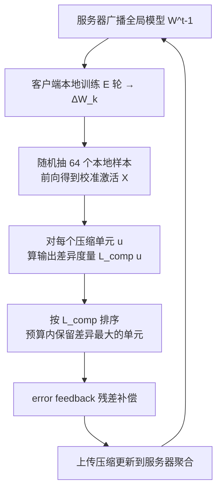

# Enhancing Communication Compression via Discrepancy-aware Calibration for Federated Learning

**会议**: ICLR 2026  
**OpenReview**: [https://openreview.net/forum?id=Hude2v2AEX](https://openreview.net/forum?id=Hude2v2AEX)  
**代码**: [https://github.com/wzy1026wzy/Discrepancy-aware-Compression-for-FL](https://github.com/wzy1026wzy/Discrepancy-aware-Compression-for-FL)  
**领域**: optimization / federated learning  
**关键词**: 联邦学习, 通信压缩, 稀疏化, 低秩分解, 校准数据, 输出差异  

## 一句话总结
联邦学习里现有通信压缩(Top-k、ATOMO)都按"幅值大小"决定丢哪些参数,本文改用每个客户端的一小撮本地校准数据直接测量"丢掉某个压缩单元会让该层输出变化多少",按这个输出差异排序来丢,可即插即用增强主流压缩方案,在压缩比 0.1 时相对精度提升 18.9%。

## 研究背景与动机
- **领域现状**: 联邦学习(FL)用传参数更新代替传原始数据来保护隐私,但客户端带宽和电量有限,上传模型更新的通信开销是核心瓶颈。主流缓解手段是通信压缩——稀疏化(Top-k、Random-k)只传一小部分元素,低秩分解(ATOMO、PowerSGD)只传大奇异值及其奇异向量。
- **现有痛点**: 所有这些方法决定"丢哪个压缩单元"时,都依赖**幅值或随机性**这种选择规则,完全不考虑丢掉这个单元会对该层输出造成多大的差异。结果可能丢掉那些"幅值小但对输出影响大"的单元,造成不必要的压缩损失。
- **核心矛盾**: 幅值大 ≠ 重要。某层输出 $Y=WX$ 同时取决于权重 $W$ 和输入激活 $X$;一个幅值 0.1 的元素若对应一个能量 $10^3$ 的输入特征,丢掉它造成的输出差异可能比丢掉一个幅值 10 的元素大 $10^8$ 倍。FL 的特殊性进一步放大了这个问题:FL 传的是累积多步本地更新的**参数更新**(而非梯度),其幅值与损失/重要性的相关性更弱。
- **本文目标**: 在极端受限的通信预算下,用一个能即插即用增强现有压缩方案的统一原则,提升精度与通信效率的权衡。
- **核心 idea**: **discrepancy-aware(输出差异感知)校准压缩**——每个客户端利用自己一小撮本地数据作为校准集,直接度量丢掉每个候选压缩单元(元素或奇异三元组)所诱导的输出差异,以此作为压缩度量来指导取舍,替代幅值/随机规则。FL 通信稀疏的特性恰好让"多花点本地算力换每个传输比特的价值最大化"变得划算。

## 方法详解

### 整体框架
方法挂在标准 FedAvg 训练循环的"客户端压缩上传"那一步:客户端本地训练得到更新 $\Delta W_k$ 后,不再按幅值挑,而是随机抽一小撮本地样本算出校准激活 $X$,对每个候选压缩单元 $u$ 计算"丢掉它会让该层输出变多大",按这个度量排序后在通信预算内保留影响最大的单元,再上传给服务器聚合。整个方案与经典 error feedback(残差累积补偿)完全兼容。

### 关键设计

**1. 最小化输出差异作为统一压缩目标:把"丢哪个"重新定义成一个优化问题。** 与其用幅值这种间接代理,本文直接把压缩目标定为"压缩后输出与原输出的差异最小"。对一层(Transformer 层 $Y=(W_0+W)X$ 或 CNN 的互相关),压缩后更新 $\widehat{W}$ 产生输出 $Y'$,目标是在校准集上最小化 Frobenius 范数 $\min_{\widehat W} L_{comp}(W-\widehat W)=\sum_X \lVert\Delta Y\rVert_F^2=\sum_X \lVert Y-Y'\rVert_F^2$。这个目标统一了稀疏化和低秩两类压缩器,也直接点明了为什么纯幅值/随机规则在根本上不够——它们优化的根本不是这个量。

**2. 校准数据驱动的输出差异度量:用一小撮真实激活把每个压缩单元打上"删除代价"。** 这是方法落地的核心。每个客户端每轮随机抽一小撮本地训练样本(默认 64 个)前向得到校准激活 $X$,再对每个候选压缩单元 $u$(一个元素或一个奇异三元组)算它的删除代价 $L_{comp}(u)=\sum_{\text{cal }X}\lVert Y-Y'\rVert_F^2$,然后按 $L_{comp}(u)$ 排序——保留 $L_{comp}$ 大的、丢掉 $L_{comp}$ 小的。这把抽象的"重要性"变成了可在客户端本地廉价计算的具体量,而且因为校准集就是客户端自己的数据,天然刻画了该客户端的数据分布特性(在 non-IID 下尤其关键)。

**3. 针对架构与压缩粒度的闭式度量:让差异度量不用真去做一次压缩前向就能算出。** 直接对每个候选单元做一次"压缩—前向—算差异"太贵,作者推导了四种情形的闭式表达式让计算高效。元素稀疏化在 Transformer 层:丢元素 $w_{i,j}$ 的代价是 $L_{comp}(w_{i,j})=w_{i,j}^2\lVert f_j\rVert_F^2$($f_j$ 是 $X$ 的第 $j$ 行)——可见代价同时含权重平方和对应输入特征能量,正好解释了幅值规则为何会失手。低秩分解在 Transformer 层:丢奇异值 $\sigma_t$ 的代价是 $L_{comp}(\sigma_t)=\sigma_t^2\lVert v_t^\top X\rVert_F^2$,即奇异值平方乘以其右奇异向量在输入上的投影能量。CNN 层(卷积建模为互相关)也给出了对应的元素与奇异三元组闭式,并用"先 $1\times F$ 横向滤波再 $F\times 1$ 纵向滤波"的两遍方案把低秩度量计算从 $O(rF^2H'W')$ 降到 $O(rFH'W')$,从而兼容 PowerSGD 这类高效低秩近似。

**4. 即插即用 + error feedback 兼容:作为模块增强现成压缩器而非另起炉灶。** 该差异度量只是替换了"排序/取舍"那一步,因此可无缝增强两类代表方法——稀疏化 Top-k 和低秩 ATOMO。同时它与经典 error feedback 完全兼容:客户端维护残差向量累积历史压缩误差,每轮先把残差加到当前更新形成补偿更新,再过压缩算子得到传输消息,最后残差减去已传部分更新,从而缓解有损压缩带来的偏差。

## 实验关键数据
数据集 CIFAR-10/100、Fashion-MNIST,non-IID(Dirichlet $\alpha=0.2$),100 客户端每轮抽 10 个,200 轮,每轮每客户端 64 个校准样本;模型含 ViT-tiny/small/base、AlexNet、ResNet-18。

### 主实验(元素稀疏化 Top-k,最终测试精度 %)

| 数据集(模型) | 方法 | 0.01 | 0.1 | 0.2 | 0.4 | 0.6 |
|---|---|---|---|---|---|---|
| CIFAR-10(ViT-tiny) | Magnitude | 21.03 | 34.93 | 37.69 | 38.25 | 38.57 |
| CIFAR-10(ViT-tiny) | **Discrepancy** | **29.62** | **41.52** | **43.11** | **42.81** | 41.21 |
| CIFAR-100(ResNet-18) | Magnitude | 10.76 | 27.28 | 30.71 | 32.34 | 32.82 |
| CIFAR-100(ResNet-18) | **Discrepancy** | **15.58** | **29.71** | **32.54** | **33.65** | **33.71** |
| FMNIST(AlexNet) | Magnitude | 63.31 | 70.32 | 71.50 | 71.59 | 71.98 |
| FMNIST(AlexNet) | **Discrepancy** | **67.55** | **73.42** | **73.61** | **73.70** | **74.01** |

压缩比 0.1 时 CIFAR-10/ViT-tiny 相对提升 18.9%;压缩越激进,增益越大。

### 低秩分解(ATOMO,不同保留秩,精度 %)

| 数据集(模型) | 方法 | rank 1 | 2 | 4 | 8 |
|---|---|---|---|---|---|
| CIFAR-10(ViT-small) | Magnitude | 33.41 | 37.01 | 41.32 | 44.01 |
| CIFAR-10(ViT-small) | **Discrepancy** | **34.61** | **40.10** | **43.17** | **45.29** |
| CIFAR-100(ViT-base) | Magnitude | 17.08 | 19.07 | 24.62 | 29.01 |
| CIFAR-100(ViT-base) | **Discrepancy** | **20.17** | **23.99** | **26.13** | **30.62** |

### 关键发现
- **收敛更快**: 达到目标精度所需通信轮数显著减少,CIFAR-10/ViT-tiny 在压缩比 0.01 时最高 1.56× 加速。
- **重叠率分析**: 压缩越激进、数据越 non-IID($\alpha$ 越小),两种选择规则选出的单元重叠越少,差异感知的优势越大;反之压缩温和且接近 IID 时两者趋同,说明幅值大的单元此时才"重新"有相对优势。

## 亮点与洞察
- 把"压缩单元取舍"从启发式幅值规则升级为"最小化输出差异"的优化视角,并用两个 $10^8$ 倍差距的反例直观说明幅值规则的失效边界。
- 闭式度量(尤其 $L_{comp}(w_{i,j})=w_{i,j}^2\lVert f_j\rVert_F^2$、$L_{comp}(\sigma_t)=\sigma_t^2\lVert v_t^\top X\rVert_F^2$)让"差异感知"几乎零额外前向开销,且 CNN 的两遍滤波技巧把低秩计算降一个 $F$ 量级。
- 抓住 FL 与传统分布式学习的本质差异——通信稀疏使得"多花本地算力换比特价值"在 FL 中划算而在数据中心不划算,这是 idea 的立足点。

## 局限与展望
- 实验局限在中小规模视觉任务(CIFAR、FMNIST)和分类,未验证大语言模型或更大数据集。
- 校准激活需要存储与前向,虽有闭式但每轮每层仍有额外本地计算/内存开销,对极端弱端设备的实际成本未充分量化。
- 校准样本数(64)与抽样策略的鲁棒性、隐私影响(校准数据虽不外传但参与度量)讨论较浅。
- 只增强了 Top-k 与 ATOMO 两种代表方法,与量化类(QSGD、FedFQ 等)及下行压缩的组合留待探索。

## 相关工作与启发
- **通信压缩**: Top-k/Random-k 稀疏化、ATOMO/PowerSGD 低秩分解、QSGD/SignSGD 量化是被增强或对比的基线;本文与它们的根本区别是引入输出差异而非幅值。
- **FL 自适应压缩**: FedFQ/FedAQ/FedMPQ 做自适应量化、AdapComFL 基于带宽预测、HGC 混合框架——本文指出它们仍未跳出幅值/随机选择规则。
- **启发**: 这种"用校准数据测输出敏感度"的思路与训练后量化/剪枝里的校准范式(如 SparseGPT/GPTQ 的二阶敏感度)一脉相承,把它迁移到 FL 通信压缩是一个干净的跨域移植。

## 评分
- **新颖性**: ⭐⭐⭐⭐ 将"校准数据测输出差异"这一已在 PTQ/剪枝中成熟的范式干净地迁移到 FL 通信压缩,并配合 FL 通信稀疏的特性论证,视角清晰但单一原则的移植性大于全新发明。
- **实验充分度**: ⭐⭐⭐ 覆盖多数据集/模型/压缩比且含重叠率与收敛轮数分析,但局限于中小视觉分类任务,缺大模型与更强基线(量化/PowerSGD 端到端)对比。
- **写作质量**: ⭐⭐⭐⭐ 动机用反例直观、四类闭式度量推导完整、算法伪代码清晰。
- **价值**: ⭐⭐⭐⭐ 即插即用、在强压缩下增益显著(相对 18.9%、最高 1.56× 加速),对带宽受限的真实 FL 部署有实用价值。

<!-- RELATED:START -->

## 相关论文

- [\[ICLR 2026\] Unlocking the Potential of Weighting Methods in Federated Learning through Communication Compression](unlocking_the_potential_of_weighting_methods_in_federated_learning_through_commu.md)
- [\[ICLR 2026\] FedMC: Federated Manifold Calibration](fedmc_federated_manifold_calibration.md)
- [\[AAAI 2026\] Personalized Federated Learning with Bidirectional Communication Compression via One-Bit Random Sketching](../../AAAI2026/optimization/personalized_federated_learning_with_bidirectional_communication_compression_via.md)
- [\[ICLR 2026\] Towards Understanding the Calibration Benefits of Sharpness-Aware Minimization](towards_understanding_the_calibration_benefits_of_sharpness-aware_minimization.md)
- [\[ICLR 2026\] LEGACY: A Lightweight Dynamic Gradient Compression Strategy for Distributed Deep Learning](legacy_a_lightweight_dynamic_gradient_compression_strategy_for_distributed_deep_.md)

<!-- RELATED:END -->
